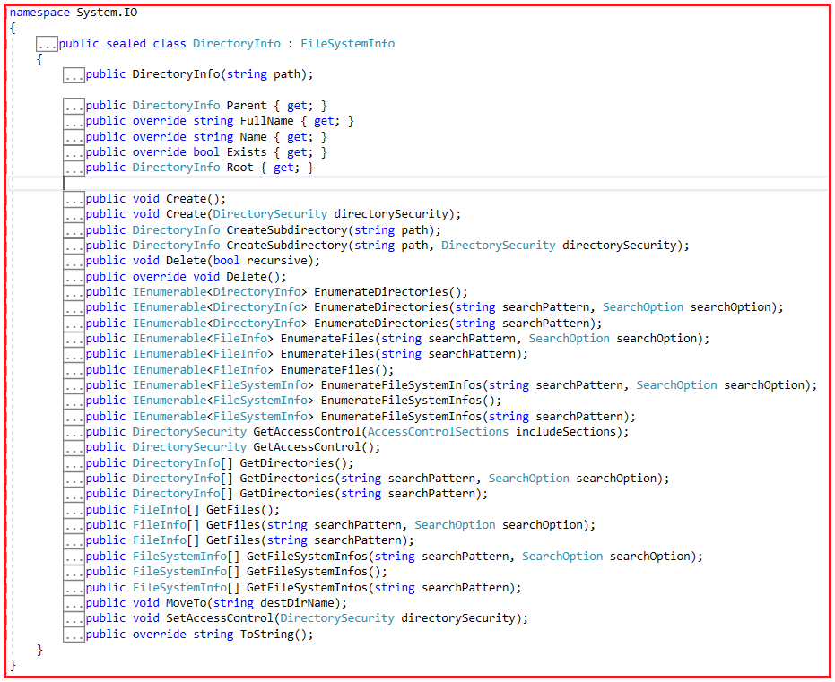
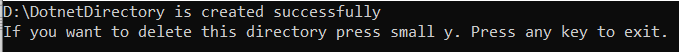
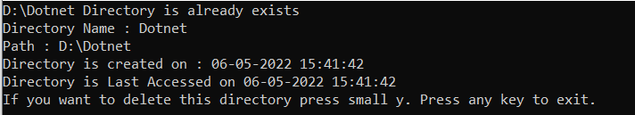

## **کلاس DirectoryInfo در سی شارپ به همراه مثال**

با مثال بررسی خواهم کرد **در این مقاله، کلاس DirectoryInfo را در سی شارپ** . لطفاً مقاله قبلی ما در مورد کلاس FileInfo در سی شارپ با مثال را مطالعه کنید. کلاس DirectoryInfo در سی شارپ قابلیت کار با پوشه‌ها یا دایرکتوری‌ها را فراهم می‌کند. در پایان این مقاله، شما خواهید فهمید که کلاس DirectoryInfo در سی شارپ چیست و چه زمانی و چگونه می‌توان از کلاس DirectoryInfo در سی شارپ با مثال استفاده کرد.

##### **DirectoryInfo در سی شارپ چیست؟**

کلاس DirectoryInfo در سی شارپ، کلاسی است که در فضای نام System.IO موجود است. کلاس DirectoryInfo تقریباً ویژگی مشابهی با کلاس FileInfo در سی شارپ دارد. تنها تفاوت این است که DirectoryInfo فقط روی دایرکتوری تمرکز دارد، نه روی سیستم فایل‌ها. بنابراین، وقتی در مورد کلاس DirectoryInfo صحبت می‌کنیم، در مورد دایرکتوری فیزیکی صحبت می‌کنیم. با کمک آن، شیء‌ای را به دست می‌آوریم که می‌توانیم با آن ایجاد، حذف و همچنین برخی زیردایرکتوری‌ها را ایجاد کنیم و بسیاری از عملیات دیگر را انجام دهیم.

این کلاس چندین متد برای انجام عملیات مربوط به دایرکتوری‌ها و زیردایرکتوری‌ها ارائه می‌دهد. این یک کلاس مهر و موم شده (sealed) است و از این رو نمی‌توان آن را به ارث برد. اگر به تعریف کلاس DirectoryInfo بروید، شکل زیر را مشاهده خواهید کرد.



کلاس DirectoryInfo در سی شارپ، سازنده، متدها و ویژگی‌های زیر را برای کار با دایرکتوری و زیردایرکتوری ارائه می‌دهد.

##### **سازنده کلاس DirectoryInfo در سی شارپ**

کلاس DirectoryInfo سازنده‌ی زیر را ارائه می‌دهد.

**public DirectoryInfo(string path):** این متد یک نمونه جدید از کلاس DirectoryInfo را در مسیر مشخص شده مقداردهی اولیه می‌کند. در اینجا، متغیر path مسیر ایجاد DirectoryInfo را مشخص می‌کند.

##### **ویژگی‌های کلاس DirectoryInfo در سی شارپ**

کلاس DirectoryInfo ویژگی‌های زیر را ارائه می‌دهد.

1. **Parent** : برای دریافت دایرکتوری والد یک زیردایرکتوری مشخص شده استفاده می‌شود. اگر مسیر null باشد یا مسیر فایل نشان‌دهنده‌ی یک ریشه (مانند "\\"، "C:" یا \* "\\\\server\\share") باشد، دایرکتوری والد یا null را برمی‌گرداند.
2. **FullName** : برای دریافت مسیر کامل دایرکتوری استفاده می‌شود. این تابع یک رشته حاوی مسیر کامل را برمی‌گرداند.
3. **Name** : برای دریافت نام این نمونه System.IO.DirectoryInfo استفاده می‌شود. نام دایرکتوری را برمی‌گرداند.
4. **Exists** : برای دریافت مقداری که نشان می‌دهد آیا دایرکتوری وجود دارد یا خیر، استفاده می‌شود. در صورت وجود دایرکتوری، مقدار true و در غیر این صورت، مقدار false را برمی‌گرداند.
5. **ریشه (Root)** : برای دریافت بخش ریشه دایرکتوری استفاده می‌شود. این تابع یک شیء را برمی‌گرداند که نشان‌دهنده ریشه دایرکتوری است.
6. **CreationTime** : برای دریافت یا تنظیم زمان ایجاد فایل یا دایرکتوری فعلی استفاده می‌شود. این تابع تاریخ و زمان ایجاد شیء System.IO.FileSystemInfo فعلی را برمی‌گرداند.
7. **LastAccessTime** : برای دریافت یا تنظیم زمان آخرین دسترسی به فایل یا دایرکتوری فعلی استفاده می‌شود. این تابع زمان آخرین دسترسی به فایل یا دایرکتوری فعلی را برمی‌گرداند.
8. **LastWriteTime** : برای دریافت یا تنظیم زمان آخرین نوشته شدن فایل یا دایرکتوری فعلی استفاده می‌شود. این تابع زمان آخرین نوشته شدن فایل فعلی را برمی‌گرداند.
9. **Extension** : برای دریافت رشته‌ای که نشان‌دهنده‌ی بخش پسوند فایل است، استفاده می‌شود. این تابع رشته‌ای حاوی پسوند System.IO.FileSystemInfo را برمی‌گرداند.

##### **متدهای کلاس DirectoryInfo در سی شارپ**

کلاس DirectoryInfo در سی شارپ متدهای زیر را ارائه می‌دهد.

1. **Create():** این متد برای ایجاد یک دایرکتوری استفاده می‌شود.
2. **Create(DirectorySecurity directorySecurity):** این متد با استفاده از شیء DirectorySecurity یک دایرکتوری ایجاد می‌کند. پارامتر directorySecurity کنترل دسترسی مورد نظر برای اعمال به دایرکتوری را مشخص می‌کند.
3. **CreateSubdirectory(string path):** این متد یک زیرشاخه یا زیرشاخه در مسیر مشخص شده ایجاد می‌کند. مسیر مشخص شده می‌تواند نسبت به این نمونه از کلاس DirectoryInfo باشد. پارامتر path مسیر مشخص شده را مشخص می‌کند.
4. **CreateSubdirectory(string path, DirectorySecurity directorySecurity):** این متد یک یا چند زیردایرکتوری در مسیر مشخص شده با امنیت مشخص شده ایجاد می‌کند. مسیر مشخص شده می‌تواند نسبت به این نمونه از کلاس DirectoryInfo باشد. پارامتر path، مسیر مشخص شده را مشخص می‌کند. این نمی‌تواند یک حجم دیسک یا نام کنوانسیون نامگذاری جهانی (UNC) متفاوت باشد. پارامتر directorySecurity، امنیتی را که باید اعمال شود، مشخص می‌کند.
5. **Delete():** این متد برای حذف DirectoryInfo در صورت خالی بودن آن استفاده می‌شود.
6. **Delete(bool recursive):** این متد برای حذف این نمونه از DirectoryInfo استفاده می‌شود و مشخص می‌کند که آیا زیرشاخه‌ها و فایل‌ها حذف شوند یا خیر. پارامتر بازگشتی مقدار true را برای حذف این دایرکتوری، زیرشاخه‌های آن و تمام فایل‌ها تعیین می‌کند؛ در غیر این صورت، مقدار false را برمی‌گرداند.
7. **EnumerateDirectories():** این متد مجموعه‌ای قابل شمارش از اطلاعات دایرکتوری‌های موجود در دایرکتوری فعلی را برمی‌گرداند. این متد مجموعه‌ای قابل شمارش از دایرکتوری‌های موجود در دایرکتوری فعلی را برمی‌گرداند.
8. **EnumerateFiles():** این متد مجموعه‌ای از اطلاعات فایل‌های قابل شمارش در دایرکتوری فعلی را برمی‌گرداند. این متد مجموعه‌ای قابل شمارش از فایل‌های موجود در دایرکتوری فعلی را برمی‌گرداند.
9. **GetAccessControl():** این متد برای دریافت شیء DirectorySecurity استفاده می‌شود که ورودی‌های لیست کنترل دسترسی (ACL) را برای دایرکتوری توصیف شده توسط شیء DirectoryInfo فعلی کپسوله‌سازی می‌کند. این متد یک شیء DirectorySecurity را برمی‌گرداند که قوانین کنترل دسترسی را برای دایرکتوری کپسوله‌سازی می‌کند.
10. **GetDirectories():** این متد زیرشاخه‌های دایرکتوری فعلی را برمی‌گرداند. این متد آرایه‌ای از اشیاء System.IO.DirectoryInfo را برمی‌گرداند.
11. **GetFiles():** این متد لیستی از فایل‌ها را از دایرکتوری فعلی برمی‌گرداند. این متد آرایه‌ای از نوع System.IO.FileInfo را برمی‌گرداند.
12. **MoveTo(string destDirName):** این متد یک نمونه از DirectoryInfo و محتویات آن را به یک مسیر جدید منتقل می‌کند. پارامتر destDirName نام و مسیری را که این دایرکتوری به آن منتقل می‌شود، مشخص می‌کند. مقصد نمی‌تواند یک حجم دیسک دیگر یا یک دایرکتوری با نام یکسان باشد. می‌تواند یک دایرکتوری موجود باشد که می‌خواهید این دایرکتوری را به عنوان یک زیردایرکتوری به آن اضافه کنید.
13. **SetAccessControl(DirectorySecurity directorySecurity):** این متد برای تنظیم ورودی‌های لیست کنترل دسترسی (ACL) که توسط یک شیء DirectorySecurity توصیف می‌شوند، استفاده می‌شود. پارامتر directorySecurity شیء‌ای را مشخص می‌کند که یک ورودی ACL را برای اعمال به دایرکتوری توصیف شده توسط پارامتر path توصیف می‌کند.
14. **ToString():** مسیر اصلی که کاربر وارد کرده است را برمی‌گرداند.

##### **ایجاد یک دایرکتوری جدید در سی شارپ:**

متد Create از DirectoryInfo برای ایجاد یک دایرکتوری جدید استفاده می‌شود. در مثال زیر، ما پوشه‌ای به نام MyTestFile1 در درایو D ایجاد می‌کنیم.

```csharp
using System;
using System.IO;

namespace DirectoryInfoDemo
{
    class Program
    {
        static void Main(string[] args)
        {
            string path = @"D:\\MyTestFile1";
            DirectoryInfo fl = new DirectoryInfo(path);
            fl.Create();
            {
                Console.WriteLine("Directory has been created");
            }
            Console.ReadKey();
        }
    }
}
```

پس از اجرای کد بالا، پوشه موجود در درایو D دستگاه خود را تأیید کنید.

##### **ایجاد زیرشاخه در سی شارپ**

متد CreateSubdirectory از کلاس DirectoryInfo یک یا چند زیرشاخه در مسیر مشخص شده ایجاد می‌کند. در مثال زیر، ما یک پوشه به نام MyTestFile2 درون پوشه MyTestFile1 ایجاد می‌کنیم.

```csharp
using System;
using System.IO;

namespace DirectoryInfoDemo
{
    class Program
    {
        static void Main(string[] args)
        {
            string path = @"D:\\MyTestFile1";
            DirectoryInfo fl = new DirectoryInfo(path);
            DirectoryInfo dis = fl.CreateSubdirectory("MyTestFile2");
            {
                Console.WriteLine("SubDirectory has been created");
            }
            Console.ReadKey();
        }
    }
}
```

##### **جابجایی دایرکتوری در سی شارپ**

متد MoveTo از کلاس DirectoryInfo در سی شارپ، یک دایرکتوری، شامل محتویات آن را به مکان جدیدی منتقل می‌کند. در مثال زیر، ما دایرکتوری MyTestFile1 را به داخل دایرکتوری NewTestFile1 منتقل می‌کنیم.

```csharp
using System;
using System.IO;

namespace DirectoryInfoDemo
{
    class Program
    {
        static void Main(string[] args)
        {
            string path1 = @"D:\\MyTestFile1";
            string path2 = @"D:\\NewTestFile1";
            DirectoryInfo directoryInfo1 = new DirectoryInfo(path1);
            DirectoryInfo directoryInfo2 = new DirectoryInfo(path2);
            directoryInfo1.MoveTo(path2);
            {
                Console.WriteLine("Directory has been Moved");
            }
            Console.ReadKey();
        }
    }
}
```

##### **حذف دایرکتوری در سی شارپ**

متد Delete از کلاس DirectoryInfo در سی شارپ برای حذف یک دایرکتوری استفاده می‌شود و مشخص می‌کند که آیا زیردایرکتوری‌ها و فایل‌ها حذف شوند یا خیر. در مثال زیر، ما دایرکتوری NewTestFile1 را از درایو D حذف می‌کنیم.

```csharp
using System;
using System.IO;

namespace DirectoryInfoDemo
{
    class Program
    {
        static void Main(string[] args)
        {
            string path = @"D:\\NewTestFile1";
            DirectoryInfo directoryInfo1 = new DirectoryInfo(path);
            directoryInfo1.Delete();
            {
                Console.WriteLine("Directory has been deleted");
            }
            Console.ReadKey();
        }
    }
}
```

##### **چگونه می‌توانم جزئیات دایرکتوری را در سی شارپ دریافت کنم؟**

مثال زیر نحوه‌ی استفاده از کلاس DirectoryInfo را در سی‌شارپ نشان می‌دهد. در مثال زیر، ما وجود دایرکتوری "D:\\Dotnet" را بررسی می‌کنیم و اگر دایرکتوری در سیستم وجود داشته باشد، اطلاعات دایرکتوری را نشان می‌دهد، در غیر این صورت یک دایرکتوری جدید به نام D:\\Dotnet ایجاد می‌کند.

```csharp
using System;
using System.IO;

namespace DirectoryInfoDemo
{
    class Program
    {
        static void Main(string[] args)
        {
            string DirectoryPath = @"D:\\Dotnet";
            DirectoryInfo directoryInfo = new DirectoryInfo(DirectoryPath);
            try
            {
                if (directoryInfo.Exists)
                {
                    Console.WriteLine("{0} Directory is already exists", DirectoryPath);
                    Console.WriteLine("Directory Name : " + directoryInfo.Name);
                    Console.WriteLine("Path : " + directoryInfo.FullName);
                    Console.WriteLine("Directory is created on : " + directoryInfo.CreationTime);
                    Console.WriteLine("Directory is Last Accessed on " + directoryInfo.LastAccessTime);
                }
                else
                {
                    directoryInfo.Create();
                    Console.WriteLine(DirectoryPath + "Directory is created successfully");
                }
                //Delete this directory
                Console.WriteLine("If you want to delete this directory press small y. Press any key to exit.");
                try
                {
                    char ch = Convert.ToChar(Console.ReadLine());
                    if (ch == 'y')
                    {
                        if (directoryInfo.Exists)
                        {
                            directoryInfo.Delete();
                            Console.WriteLine(DirectoryPath + "Directory Deleted");
                        }
                        else
                        {
                            Console.WriteLine(DirectoryPath + "Directory Not Exists");
                        }
                    }
                }
                catch
                {
                    Console.WriteLine("Press Enter to Exit");
                }
                Console.ReadKey();
            }
            catch (DirectoryNotFoundException d)
            {
                Console.WriteLine("Exception raised : " + d.Message);
                Console.ReadKey();
            }
        }
    }
}
```

پس از اجرای کد بالا، خروجی زیر را دریافت خواهید کرد. توجه داشته باشید که این دایرکتوری وجود ندارد و از این رو، آن را ایجاد می‌کند.



حالا، هر کلیدی به جز y را فشار دهید، برنامه را ببندید و دوباره اجرا کنید. از آنجایی که دایرکتوری در اولین اجرا ایجاد شده است، این بار خروجی زیر را دریافت خواهید کرد.

