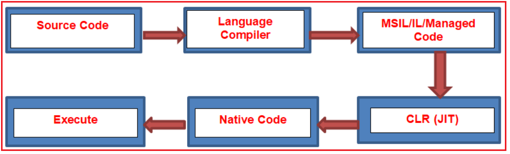
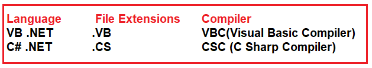

## **آشنایی با چارچوب دات نت**

در این مقاله، قصد دارم مروری بر **چارچوب دات نت (DOT NET Framework** ) داشته باشم . به عنوان یک توسعه‌دهنده دات نت، دانستن تاریخچه و تکامل چارچوب دات نت برای شما مهم است. در اینجا، در این مقاله، در مورد آنچه قبل از چارچوب دات نت وجود داشته و مشکلاتی که در آن با آن مواجه هستیم و نحوه غلبه بر همه این مشکلات در چارچوب دات نت بحث خواهیم کرد. قبل از چارچوب دات نت، COM وجود داشت. بنابراین، ابتدا اجازه دهید در مورد اینکه COM چیست و چه مشکلاتی در COM با آن مواجه هستیم، بحث کنیم.

##### **کام چیست؟**

COM مخفف Component Object Model است. COM یکی از فناوری‌های مایکروسافت است. با استفاده از این فناوری، می‌توانیم برنامه‌های ویندوز و همچنین برنامه‌های وب را توسعه دهیم. در COM، زبان برنامه‌نویسی VB برای پیاده‌سازی برنامه‌های ویندوز و ASP فناوری مورد استفاده برای پیاده‌سازی برنامه‌های وب است.

##### **معایب COM چیست؟**

دو عیب اصلی COM به شرح زیر است:

1. برنامه‌نویسی شیءگرای ناقص به این معنی است که از تمام ویژگی‌های OOP پشتیبانی نمی‌کند.
2. وابستگی به پلتفرم به این معنی است که برنامه‌های COM فقط می‌توانند روی سیستم عامل ویندوز اجرا شوند.

برای غلبه بر مشکلات فوق، چارچوب DOT NET وارد عمل می‌شود.

##### **.NET نمایانگر چیست؟**

NET مخفف Network Enabled Technology (فناوری فعال‌شده با شبکه) است. در .NET، نقطه (.) به شیءگرایی اشاره دارد و NET به اینترنت اشاره دارد. بنابراین .NET کامل به این معنی است که از طریق شیءگرایی می‌توانیم برنامه‌های مبتنی بر اینترنت را پیاده‌سازی کنیم.

##### **فریم ورک چیست؟**

یک فریم‌ورک یک نرم‌افزار است. یا می‌توان گفت که یک فریم‌ورک مجموعه‌ای از فناوری‌های کوچک است که برای توسعه برنامه‌هایی که می‌توانند در هر مکانی اجرا شوند، با هم ادغام شده‌اند.

##### **چارچوب دات نت چیست؟**

طبق گفته مایکروسافت، چارچوب دات‌نت (.NET Framework) یک چارچوب توسعه نرم‌افزار برای ساخت و اجرای برنامه‌ها در ویندوز است. چارچوب دات‌نت بخشی از پلتفرم دات‌نت است که مجموعه‌ای از فناوری‌ها برای ساخت برنامه‌ها برای لینوکس، macOS، ویندوز، iOS، اندروید و موارد دیگر است.

##### **انواع مختلف چارچوب دات نت.**

.NET یک پلتفرم توسعه‌دهنده است که از ابزارها، زبان‌های برنامه‌نویسی و کتابخانه‌هایی تشکیل شده است که برای ساخت انواع مختلف برنامه‌ها مانند دسکتاپ، وب، موبایل و غیره استفاده می‌شوند. پیاده‌سازی‌های مختلفی از .NET وجود دارد. هر پیاده‌سازی به کد .NET اجازه می‌دهد تا در مکان‌های مختلفی مانند لینوکس، macOS، ویندوز، iOS، اندروید و بسیاری دیگر اجرا شود.

1. **چارچوب دات‌نت (.NET Framework)** پیاده‌سازی اصلی دات‌نت است. این چارچوب از اجرای وب‌سایت‌ها، سرویس‌ها، برنامه‌های دسکتاپ و موارد دیگر در ویندوز پشتیبانی می‌کند.
2. **.NET** یک پیاده‌سازی چند پلتفرمی برای اجرای وب‌سایت‌ها، سرویس‌ها و برنامه‌های کنسول در ویندوز، لینوکس و macOS است. .NET در GitHub متن‌باز است. .NET قبلاً .NET Core نامیده می‌شد.
3. **زامارین/مونو (Xamarin/Mono)** یک پیاده‌سازی دات‌نت (.NET) برای اجرای برنامه‌ها روی تمام سیستم عامل‌های اصلی موبایل، از جمله iOS و اندروید است.

#### **چارچوب دات نت چه چیزی ارائه می‌دهد؟**

دو جزء اصلی چارچوب دات‌نت، زمان اجرای زبان مشترک و کتابخانه کلاس چارچوب دات‌نت هستند.

1. **CL** (کتابخانه‌های کلاس)
2. **CLR** (زمان اجرای زبان مشترک)

##### **کتابخانه‌های کلاس چارچوب دات‌نت:**

کتابخانه‌های کلاس چارچوب .NET توسط مایکروسافت طراحی شده‌اند. بدون کتابخانه‌های کلاس، ما نمی‌توانیم هیچ کدی را در .NET بنویسیم. بنابراین، کتابخانه‌های کلاس به عنوان بلوک سازنده برنامه‌های .NET نیز شناخته می‌شوند. این کتابخانه‌ها هنگام نصب چارچوب .NET در دستگاه نصب می‌شوند. کتابخانه‌های کلاس شامل کلاس‌ها و رابط‌های از پیش تعریف شده هستند و این کلاس‌ها و رابط‌ها برای توسعه برنامه استفاده می‌شوند. کتابخانه کلاس همچنین مجموعه‌ای از APIها و انواع را برای عملکردهای رایج ارائه می‌دهد. این کتابخانه انواعی را برای رشته‌ها، تاریخ‌ها، اعداد و غیره فراهم می‌کند.

از .NET Framework 4 به بعد، مکان پیش‌فرض برای Global Assembly Cache، **%windir%\\Microsoft.NET\\assembly** است . در نسخه‌های قبلی .NET Framework، مکان پیش‌فرض **%windir%\\assembly** است .

##### **زمان اجرای زبان مشترک (CLR):**

CLR مخفف عبارت Common Language Runtime است و جزء اصلی چارچوب .NET است که وظیفه تبدیل کد MSIL (زبان میانی مایکروسافت) به کد بومی را بر عهده دارد و سپس محیط زمان اجرا را برای اجرای کد فراهم می‌کند. این بدان معناست که Common Language Runtime (CLR) موتور اجرایی است که برنامه‌های در حال اجرا را مدیریت می‌کند. این موتور خدماتی مانند مدیریت نخ، جمع‌آوری زباله، ایمنی نوع، مدیریت استثنا و موارد دیگر را ارائه می‌دهد. در مقاله بعدی، به تفصیل در مورد CLR صحبت خواهیم کرد.

**در چارچوب .NET، کد دو بار کامپایل می‌شود.**

1. در ۱خیابان در کامپایل، کد منبع توسط کامپایلر زبان مربوطه کامپایل می‌شود و کد میانی را تولید می‌کند که به عنوان **MSIL (زبان میانی مایکروسافت)** یا **IL (کد زبان میانی)** یا **کد مدیریت‌شده** شناخته می‌شود.
2. در ۲و در طول کامپایل، **کد MSIL** تبدیل می‌شود **به کد Native** (کد Native به کدی گفته می‌شود که مختص سیستم عامل است تا توسط سیستم عامل اجرا شود) و این کار توسط **CLR** انجام می‌شود.

همیشه ۱خیابان کامپایل کند است و ۲و کامپایل سریع است.

##### **جی آی تی چیست؟**

JIT مخفف **کامپایلر Just-in-Time** است . این جزئی از **CLR** است که وظیفه تبدیل **کد MSIL** به **کد بومی (Native Code)** را بر عهده دارد . کد بومی، کدی است که مستقیماً توسط سیستم عامل قابل فهم است.

##### **چه چیزی دات نت نیست؟**

1. دات‌نت یک سیستم عامل نیست.
2. این یک برنامه یا بسته نیست.
3. دات‌نت یک پایگاه داده نیست
4. این یک برنامه ERP نیست.
5. .NET یک ابزار تست نیست.
6. یک زبان برنامه نویسی نیست.

##### **دات نت دقیقاً چیست؟**

.NET یک ابزار چارچوبی است که از بسیاری از زبان‌های برنامه‌نویسی و فناوری‌های مختلف پشتیبانی می‌کند. .NET از بیش از ۶۰ زبان برنامه‌نویسی پشتیبانی می‌کند. از میان بیش از ۶۰ زبان برنامه‌نویسی، ۹ زبان توسط مایکروسافت و بقیه توسط غیر مایکروسافت طراحی شده‌اند. زبان‌های برنامه‌نویسی طراحی‌شده توسط مایکروسافت به شرح زیر هستند.

1. وی بی دات نت
2. سی شارپ.NET
3. VC++.NET
4. جی#.NET
5. اف#.NET
6. جی‌اسکریپت دات‌نت
7. ویندوز پاورشل
8. فیتون آهن
9. یاقوت آهنی

فناوری‌های پشتیبانی‌شده توسط چارچوب دات‌نت به شرح زیر هستند:

1. ASP.NET (صفحات سرور فعال.NET)
2. ADO.NET (شیء داده فعال.NET)
3. WCF (بنیاد ارتباطات ویندوز)
4. WPF (بنیاد ارائه ویندوز)
5. بنیاد گردش کار ویندوز (WWF)
6. ای‌جکس (جاوااسکریپت و XML ناهمگام)
7. LINQ (پرس و جوی یکپارچه زبان)

##### **زبان چیست و چه نیازی به آن وجود دارد؟**

1. زبان به عنوان واسطه بین برنامه نویس و سیستم عمل می کند.
2. این برنامه برخی قوانین و مقررات را برای نوشتن برنامه ارائه می‌دهد.
3. این زبان همچنین کتابخانه‌هایی را ارائه می‌دهد که برای نوشتن برنامه مورد نیاز هستند.

##### **فناوری و نیازهای آن چیست؟**

1. فناوری همیشه برای یک هدف خاص طراحی می‌شود.
2. برای مثال، توسعه برنامه‌های کاربردی مرتبط با وب در .NET با استفاده از فناوری ASP.NET.
3. اما این فناوری هیچ قانون خاصی برای نوشتن برنامه‌ها ارائه نمی‌دهد. به همین دلیل است که نمی‌توان فناوری را به صورت جداگانه پیاده‌سازی کرد.
4. VB.NET و C#.NET هر دو زبان‌های برنامه‌نویسی هستند. با استفاده از این دو زبان می‌توانیم برنامه‌های ویندوز/دسکتاپ را به صورت جداگانه پیاده‌سازی کنیم.
5. هر زبانی کامپایلر مخصوص به خود را دارد

