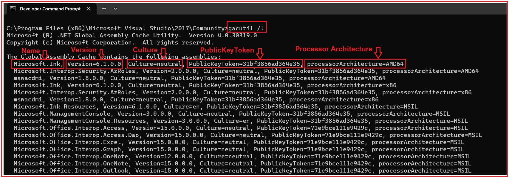
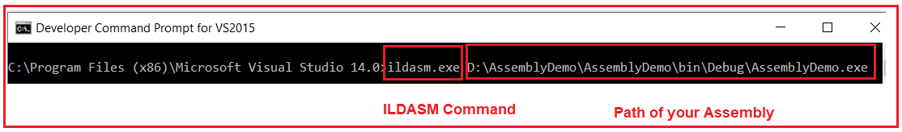
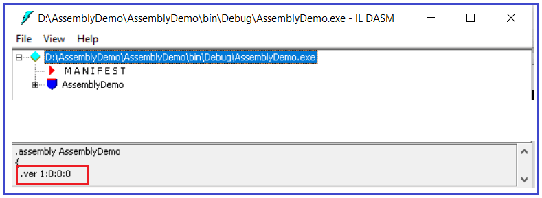
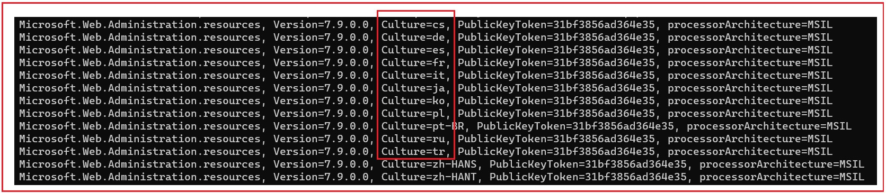
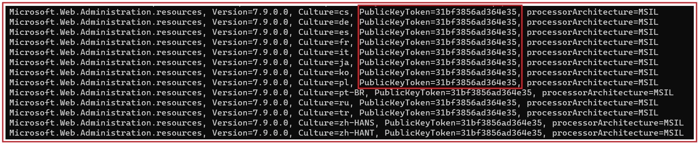
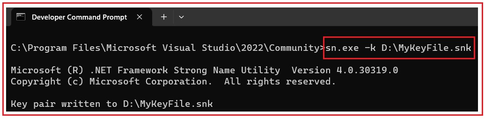
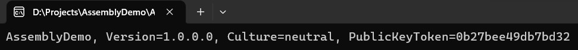

## **اسمبلی‌های قوی و ضعیف در چارچوب دات‌نت**

در این مقاله، قصد دارم **اسمبلی‌های قوی و ضعیف را در چارچوب دات‌نت** به همراه مثال‌هایی مورد بحث قرار دهم. لطفاً مقاله قبلی ما را که در آن در مورد دامنه برنامه در برنامه‌های دات‌نت بحث کردیم، مطالعه کنید. در چارچوب دات‌نت، اسمبلی‌ها به طور کلی به دو نوع طبقه‌بندی می‌شوند. آنها به شرح زیر هستند:

1. **اسمبلی‌های با نام ضعیف**
2. **اسمبلی‌های قوی با نام**

بیایید ابتدا بفهمیم اسمبلی چیست و سپس در مورد اسمبلی قوی و ضعیف و تفاوت بین آنها بحث خواهیم کرد.

##### **درک اسمبلی در چارچوب .NET:**

بیایید یک برنامه کنسول ساده با نام **AssemblyDemo** ایجاد کنیم و سپس **کلاس Program** را مطابق شکل زیر تغییر دهیم. این یک برنامه بسیار ساده C# است که به سادگی پیام " **Hello world** " را در کنسول چاپ می‌کند. برای چاپ پیام در کنسول، در اینجا از **کلاس Console** استفاده می‌کنیم . **کلاس Console** می‌آید **از فضای نام System** . و **فضای نام System** Assembly وجود دارد **در System** . اسمبلی System یک اسمبلی .NET Framework است.

```csharp
using System;

namespace AssemblyDemo
{
    class Program
    {
        static void Main(string[] args)
        {
            Console.WriteLine("Hello world");
            Console.ReadKey();
        }
    }
}
```

وقتی .NET Framework را روی دستگاه خود نصب کردیم، دو جزء مهم نصب می‌شوند. یکی کتابخانه کلاس پایه .NET Framework (BCL) و دیگری CLR است که چیزی جز محیط زمان اجرا نیست که برنامه .NET ما قرار است در آن اجرا شود. در کتابخانه کلاس پایه .NET Framework، چندین اسمبلی داریم. همه اسمبلی‌های .NET Framework در یک مکان خاص به نام GAC (Global Assembly Cache) نصب می‌شوند.

با شروع از .NET Framework 4، مکان پیش‌فرض برای حافظه پنهان سراسری اسمبلی، **%windir%\\Microsoft.NET\\assembly** است . در نسخه‌های قبلی .NET Framework، مکان پیش‌فرض **%windir%\\assembly** است . وقتی به مکان GAC بروید، تمام اسمبلی‌های .NET Framework را خواهید یافت. در مقاله بعدی خود به تفصیل در مورد GAC صحبت خواهیم کرد. برای مشاهده اسمبلی‌های نصب شده، باید Visual Studio Command Prompt را باز کنیم و **دستور gacutil -l** یا **gacutil /l** را تایپ کنیم و همانطور که در تصویر زیر نشان داده شده است، دکمه enter را فشار دهیم.



تمام اسمبلی‌های موجود در GAC از نوع Strong Type هستند. در بخش بعدی این مقاله، در مورد اینکه یک اسمبلی Strong Type دقیقاً چیست و تفاوت بین یک اسمبلی Strong Type و Weak Type در چارچوب .NET چیست، بحث خواهیم کرد. در چارچوب .NET، یک اسمبلی از 4 بخش تشکیل شده است. آنها به شرح زیر هستند:

1. نام متنی ساده (یعنی نام اسمبلی).
2. شماره نسخه.
3. اطلاعات فرهنگی (در صورت ارائه، در غیر این صورت جلسه از نظر زبان بی‌طرف است)
4. توکن کلید عمومی

بیایید هر بخش از یک مونتاژ را با جزئیات مورد بحث قرار دهیم.

##### **نام مجموعه (نام متنی ساده):**

این چیزی جز نام پروژه نیست. ما یک برنامه کنسول با نام **AssemblyDemo** ایجاد کرده‌ایم . اکنون پروژه را بسازید و به **پوشه Bin => Debug** پروژه خود بروید. در آنجا باید یک اسمبلی با نام **AssemblyDemo پیدا کنید.**

##### **شماره نسخه:**

قالب پیش‌فرض شماره نسخه **۱.۰.۰.۰** است . این یعنی شماره نسخه دوباره از چهار بخش به شرح زیر تشکیل شده است:

1. **نسخه اصلی**
2. **نسخهٔ جزئی**
3. **شماره ساخت**
4. **شماره ویرایش**

معمولاً هر نرم‌افزاری که توسعه می‌دهیم، در طول یک دوره زمانی دستخوش تغییرات می‌شود. وقتی اشکالات را برطرف می‌کنیم یا ویژگی‌های جدیدی اضافه می‌کنیم، بسته به اهمیت تغییر، یا شماره اصلی را تغییر می‌دهیم یا شماره فرعی را. اگر تغییراتی که در برنامه ایجاد می‌کنیم بزرگ باشد، احتمالاً شماره اصلی را تغییر می‌دهیم در غیر این صورت شماره فرعی را تغییر می‌دهیم. اغلب اوقات شماره ساخت و شماره ویرایش پیش‌فرض هستند.

برای مشاهده شماره نسخه اسمبلی AssemblyDemo **،** خط فرمان توسعه‌دهنده ویژوال استودیو را باز کنید و **از دستور ILDASM** برای مشاهده شماره نسخه، همانطور که در زیر نشان داده شده است، استفاده کنید.



وقتی دستور ILDASM و به دنبال آن مسیر فیزیکی اسمبلی خود را وارد کنید و کلید اینتر را بزنید، پنجره ILDASM زیر را خواهید دید و کافیست به شماره نسخه که در پایین پنجره قرار دارد نگاه کنید.



**نکته:** شما همچنین می‌توانید شماره نسخه پروژه خود را با استفاده از فایل کلاس AssemblyInfo.cs که در پوشه Properties پروژه شما قرار دارد، بررسی کنید. اگر فایل کلاس AssemblyInfo.cs را باز کنید، باید عبارت AssemblyVersion زیر را مشاهده کنید.

**[assembly: AssemblyVersion("1.0.0.0")]**

##### **چگونه شماره نسخه یک اسمبلی را در .NET Framework تغییر دهیم؟**

اگر می‌خواهید شماره نسخه اسمبلی خود را تغییر دهید، باید **از ویژگی AssemblyVersion** در **کلاس AssemblyInfo** که در **پوشه Properties** پروژه شما موجود است، استفاده کنید. می‌توانید تمام مقادیر را مشخص کنید یا می‌توانید با استفاده از '\*' شماره‌های Revision و Build را پیش‌فرض کنید. فرض کنید می‌خواهید شماره اصلی را به 3 و شماره فرعی را به 2 تغییر دهید، باید ویژگی AssemblyVersion زیر **از** کلاس **AssemblyInfo** را به شرح زیر به‌روزرسانی کنید.

**[assembly: AssemblyVersion("3.2.*")]**

با اعمال تغییرات فوق، اکنون اگر راهکار را بسازید و شماره نسخه را با استفاده از ابزار ILDASM بررسی کنید، باید شماره نسخه به‌روز شده را مشاهده کنید. لطفاً مقالات ILDASM و ILASM ما را مطالعه کنید تا درباره ILDASM و ILASM بیشتر بدانید.

##### **فرهنگ مونتاژ:**

ویژگی AssemblyCulture برای مشخص کردن فرهنگ اسمبلی استفاده می‌شود. به طور پیش‌فرض در .NET Framework، اسمبلی‌ها از نظر زبان خنثی هستند، به این معنی که ویژگی AssemblyCulture شامل Culture=neutral است. اگر به GAC مراجعه کنید، خواهید دید که اکثر اسمبلی‌ها از نظر فرهنگ خنثی هستند. اما ممکن است برخی از اسمبلی‌ها مختص به فرهنگ باشند. برای درک بهتر، لطفاً به تصویر زیر که می‌توانید در GAC خود نیز پیدا کنید، نگاهی بیندازید. اسمبلی‌های زیر مختص زبانی هستند که در ویژگی Culture مشخص شده است.



وقتی فرهنگ را مشخص می‌کنید، آن اسمبلی تبدیل به یک **اسمبلی ماهواره‌ای** می‌شود . یک اسمبلی ماهواره‌ای، یک اسمبلی چارچوب دات‌نت است که شامل منابع مختص به یک زبان معین است. با استفاده از اسمبلی‌های ماهواره‌ای، می‌توانید منابع مربوط به زبان‌های مختلف را در اسمبلی‌های مختلف قرار دهید و اسمبلی صحیح فقط در صورتی در حافظه بارگذاری می‌شود که کاربر انتخاب کند برنامه را به آن زبان مشاهده کند.

اگر می‌خواهید فرهنگ را مشخص کنید، باید از **ویژگی AssemblyCulture** به همراه **فایل کلاس AssemblyInfo.cs** استفاده کنید . برای مثال، اگر می‌خواهید زبان انگلیسی را به عنوان فرهنگ مشخص کنید، باید ویژگی AssemblyCulture را مطابق شکل زیر به‌روزرسانی کنید.

**[assembly: AssemblyCulture("en")]**

##### **توکن کلید عمومی:**

اگر به GAC بروید، خواهید دید که به هر اسمبلی یک توکن کلید عمومی اختصاص داده شده است، همانطور که در تصویر زیر نشان داده شده است.



برای دریافت توکن کلید عمومی، باید اسمبلی خود را با یک جفت کلید خصوصی و عمومی امضا کنید. حال سوال این است که چگونه کلید خصوصی-عمومی را دریافت کنم؟

##### **چگونه کلید خصوصی-عمومی را دریافت کنم؟**

در چارچوب .NET، ابزاری به نام Strong Naming Tool (sn.exe) داریم و می‌توانیم از این ابزار (sn.exe) برای تولید جفت کلید عمومی خصوصی استفاده کنیم. برای استفاده از این ابزار، مجدداً باید از خط فرمان توسعه‌دهنده برای ویژوال استودیو استفاده کنیم. بنابراین، خط فرمان توسعه‌دهنده را برای ویژوال استودیو در حالت Administrator باز کنید و سپس **sn.exe -k D:\\MyKeyFile.snk** را تایپ کنید و همانطور که در تصویر زیر نشان داده شده است، دکمه enter را فشار دهید.



پس از تایپ دستور مورد نیاز و فشردن کلید اینتر، فایل کلید با نام **MyKeyFile.snk** باید در درایو D: ایجاد شود. در SN.exe، SN مخفف Strong Name است.

پس از ایجاد فایل کلید، باید **از ویژگی AssemblyKeyFile** در **کلاس AssemblyInfo** برای امضای اسمبلی با یک نام قوی استفاده کنید. به سازنده ویژگی AssemblyKeyFile، باید مسیر فایل کلید که حاوی کلیدهای خصوصی و عمومی است را مطابق شکل زیر ارسال کنید.

**[assembly: AssemblyKeyFile("D:\\MyKeyFile.snk")]**

پس از افزودن ویژگی AssemblyKeyFile فوق، راه‌حل را بسازید. پس از ساخت راه‌حل، اکنون اسمبلی شما با یک جفت کلید خصوصی-عمومی امضا می‌شود. اکنون، اسمبلی ما هر چهار مؤلفه یعنی نام، شماره نسخه، فرهنگ و توکن کلید عمومی را دارد. برای مشاهده اطلاعات اسمبلی، لطفاً کلاس Program را به شرح زیر تغییر دهید.

```csharp
using System;
using System.Reflection;

namespace AssemblyDemo
{
    class Program
    {
        static void Main(string[] args)
        {
            // Replace D:\\Projects\\AssemblyDemo\\AssemblyDemo\\bin\\Debug\\AssemblyDemo.exe
            // With your Assembly Path
            Console.WriteLine(Assembly.LoadFile(@"D:\\Projects\\AssemblyDemo\\AssemblyDemo\\bin\\Debug\\AssemblyDemo.exe"));
            Console.ReadKey();
        }
    }
}
```

حالا، برنامه را اجرا کنید و باید نتیجه زیر را ببینید.



##### **اسمبلی قوی در چارچوب .NET:**

یک اسمبلی زمانی اسمبلی با نام قوی نامیده می‌شود که ویژگی‌های زیر را داشته باشد:

1. **نام مجمع.**
2. **شماره نسخه.**
3. **این اسمبلی باید با جفت کلید خصوصی/عمومی امضا شده باشد.**

##### **تفاوت بین اسمبلی‌های قوی و ضعیف در چارچوب دات‌نت چیست؟**

اگر یک اسمبلی با جفت کلید خصوصی/عمومی امضا نشده باشد، به آن اسمبلی، اسمبلی با نام ضعیف گفته می‌شود و تضمینی برای منحصر به فرد بودن آن وجود ندارد و ممکن است باعث مشکل DLL Hell شود. اسمبلی‌های با نام قوی تضمین می‌کنند که منحصر به فرد باشند و مشکل DLL Hell را حل می‌کنند. باز هم، شما نمی‌توانید یک اسمبلی را در GAC نصب کنید، مگر اینکه اسمبلی دارای نام قوی باشد.

**توجه:** در مقالات بعدی، در مورد اینکه مشکل DLL Hell چیست و چگونه می‌توانیم با استفاده از Strong Name Assembly و مثال‌هایی آن را در .NET Framework حل کنیم، بحث خواهیم کرد.