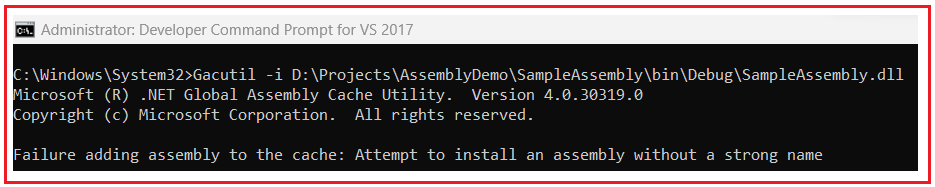
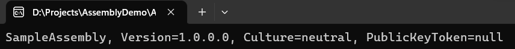
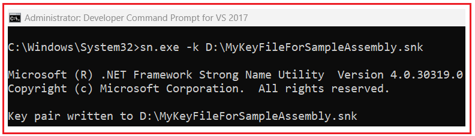
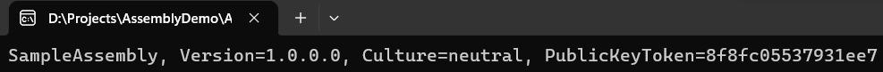
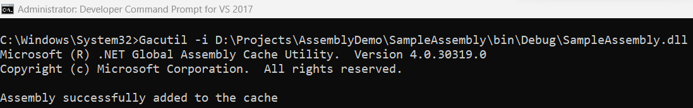
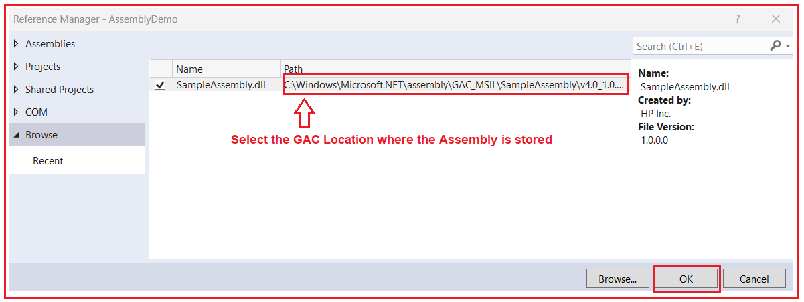
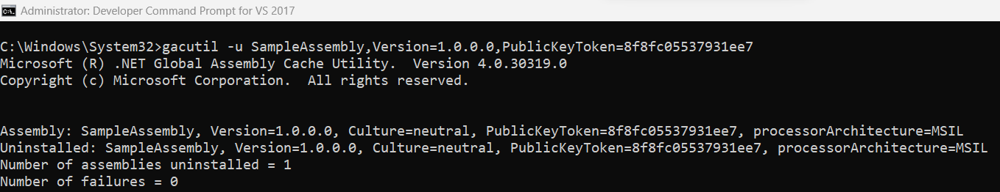

## **نحوه نصب یک اسمبلی در GAC در چارچوب .NET**

در این مقاله، قصد دارم **نحوه نصب یک اسمبلی در GAC در چارچوب .NET را** با مثال‌هایی مورد بحث قرار دهم. لطفاً مقاله قبلی ما را که در آن در مورد اسمبلی‌های قوی و ضعیف در چارچوب .NET بحث کردیم، مطالعه کنید.

##### **GAC چیست؟**

GAC مخفف Global Assembly Cache است و فقط شامل اسمبلی‌های با نام قوی (Strong Named Assemblies) می‌شود. هر کامپیوتری که Common Language Runtime روی آن نصب شده باشد، یک حافظه پنهان کد در سطح ماشین به نام Global Assembly Cache دارد. یک اسمبلی زمانی دارای نام قوی (Strong Name) است که شامل ویژگی‌های زیر باشد:

1. نام مجمع.
2. شماره نسخه.
3. این اسمبلی باید با جفت کلید خصوصی/عمومی امضا شده باشد.

حافظه نهان سراسری اسمبلی، اسمبلی‌هایی را ذخیره می‌کند که به‌طور خاص برای اشتراک‌گذاری بین چندین برنامه روی رایانه تعیین شده‌اند. توصیه می‌شود فقط در صورت نیاز و اشتراک‌گذاری بین برنامه‌ها، اسمبلی را در GAC نصب کنید، در غیر این صورت، باید آن‌ها را خصوصی نگه دارید.

از .NET Framework 4 به بعد، مکان پیش‌فرض برای Global Assembly Cache (GAC) مسیر **C:\\Windows\\Microsoft.NET\\assembly** است . در نسخه‌های قبلی .NET Framework، مکان پیش‌فرض **C:\\Windows\\Assembly** بود .

##### **چگونه یک اسمبلی را در GAC در چارچوب .NET نصب کنیم؟**

برای نصب یک اسمبلی در GAC، اسمبلی باید به صورت Strong Name باشد، در غیر این صورت، خطایی با عنوان **Failadding assembly to the cache: Attempt to install an assembly without a strong name** دریافت خواهید کرد . دو راه برای نصب یک اسمبلی در GAC وجود دارد.

1. **به سادگی بکشید و رها کنید**
2. **از GacUtil.exe (ابزار کمکی GAC) استفاده کنید**

##### **ایجاد یک اسمبلی با نام‌گذاری قوی در چارچوب .NET:**

ابتدا یک پروژه کتابخانه کلاس با نام **SampleAssembly** ایجاد کنید و سپس نام **فایل کلاس Class1.cs** را به **فایل کلاس Calculator.cs** تغییر دهید و سپس کد زیر را در آن کپی و جایگذاری کنید.

```csharp
namespace SampleAssembly
{
    public class Calculator
    {
        public int Calculate(int x, int y)
        {
            return x + y;
        }
    }
}
```

وقتی پروژه بالا را کامپایل می‌کنید، یک اسمبلی با نام **SampleAssembly.dll** ایجاد می‌شود و این یک اسمبلی با نام قوی نیست. بیایید سعی کنیم **SampleAssembly.dll** را به GAC اضافه کنیم و ببینیم چه اتفاقی می‌افتد. مسیر فیزیکی اسمبلی ما به صورت زیر است:

**D:\\Projects\\AssemblyDemo\\SampleAssembly\\bin\\Debug\\SampleAssembly.dll**

سپس، Visual Studio Command Prompt را در حالت Administrator باز کنید و دستور زیر را کپی و جایگذاری کنید و دکمه enter را فشار دهید. در اینجا، **-i** استفاده کنید **برای نصب است، به طور مشابه، اگر می‌خواهید یک اسمبلی را حذف نصب کنید، باید از -u** .

**Gacutil -i D:\\Projects\\AssemblyDemo\\SampleAssembly\\bin\\Debug\\SampleAssembly.dll**

پس از تایپ دستور بالا و فشردن دکمه اینتر، خطای زیر را مشاهده خواهید کرد که می‌گوید: **عدم موفقیت در افزودن اسمبلی به حافظه پنهان: تلاش برای نصب یک اسمبلی بدون نام قوی.**



دلیل این امر این است که اسمبلی ما یک اسمبلی با نام قوی نیست و با هیچ کلید عمومی خصوصی امضا نشده است. برای اثبات این موضوع، یک برنامه کنسول ایجاد کنید و سپس کد زیر را در آن کپی و جایگذاری کنید. شما باید مسیر را مطابق با SampleAssembly خود جایگزین کنید.

```csharp
using System;
using System.Reflection;

namespace AssemblyDemo
{
    class Program
    {
        static void Main(string[] args)
        {
            // Replace D:\\Projects\\AssemblyDemo\\SampleAssembly\\bin\\Debug\\SampleAssembly.dll
            // With your Assembly Path
            Console.WriteLine(Assembly.LoadFile(@"D:\\Projects\\AssemblyDemo\\SampleAssembly\\bin\\Debug\\SampleAssembly.dll"));
            Console.ReadKey();
        }
    }
}
```

حالا برنامه را اجرا کنید و باید ببینید که مقدار PublicKeyToken همانطور که در تصویر زیر نشان داده شده است، null است.



##### **چگونه می‌توان اسمبلی را به یک اسمبلی قوی تبدیل کرد؟**

برای اینکه اسمبلی ما به صورت Strongly Named باشد، باید اسمبلی خود را با یک جفت کلید خصوصی و عمومی امضا کنیم و این موضوع را در مقاله قبلی خود مورد بحث قرار داده‌ایم.

در چارچوب .NET، ابزاری به نام Strong Naming Tool (sn.exe) داریم و می‌توانیم از این ابزار (sn.exe) برای تولید جفت کلید عمومی خصوصی استفاده کنیم. مجدداً، برای استفاده از این ابزار، باید از خط فرمان توسعه‌دهنده برای ویژوال استودیو استفاده کنیم. بنابراین، خط فرمان توسعه‌دهنده را برای ویژوال استودیو در حالت Administrator باز کنید و سپس **sn.exe -k D:\\MyKeyFileForSampleAssembly.snk** را تایپ کنید و همانطور که در تصویر زیر نشان داده شده است، دکمه enter را فشار دهید.



پس از تایپ دستور مورد نیاز و فشردن کلید Enter، فایل کلید با نام **MyKeyFileForSampleAssembly.snk** باید در درایو D: ایجاد شود.

پس از ایجاد فایل کلید، باید **از ویژگی AssemblyKeyFile** در **کلاس AssemblyInfo** برای امضای اسمبلی با یک نام قوی استفاده کنید. بنابراین، **فایل کلاس AssemblyInfo** از **پروژه SampleAssembly** را باز کنید و سپس به سازنده **ویژگی AssemblyKeyFile** ، باید مسیر فایل کلید که شامل کلیدهای خصوصی و عمومی است را مطابق شکل زیر ارسال کنیم.

**[assembly: AssemblyKeyFile(@"D:\\MyKeyFileForSampleAssembly.snk")]**

پس از افزودن ویژگی AssemblyKeyFile فوق، راه‌حل را بسازید. پس از ساخت راه‌حل، اکنون اسمبلی شما با یک جفت کلید خصوصی-عمومی امضا می‌شود. اکنون، اسمبلی ما حاوی توکن کلید عمومی است. برای مشاهده اطلاعات اسمبلی، لطفاً برنامه کنسول را دوباره اجرا کنید و باید خروجی زیر را مشاهده کنید.



اکنون، می‌توانید ببینید که اسمبلی ما شامل نام، شماره نسخه و توکن کلید عمومی است که برای یک اسمبلی با نام Strongly مورد نیاز هستند. حال، بیایید سعی کنیم **SampleAssembly.dll** را در GAC نصب کنیم. بنابراین، Visual Studio Developer Command Prompt را در حالت Administrator باز کنید و سپس دستور **Gacutil -i D:\\Projects\\AssemblyDemo\\SampleAssembly\\bin\\Debug\\SampleAssembly.dll** را تایپ کنید و همانطور که در تصویر زیر نشان داده شده است، دکمه enter را فشار دهید.

****

در اینجا، می‌توانید ببینید که پیامی مبنی بر اینکه Assembly با موفقیت به حافظه پنهان اضافه شد، دریافت می‌کنیم. می‌توانید assembly را در آدرس زیر پیدا کنید.

**C:\\WINDOWS\\Microsoft.NET\\assembly\\GAC\_MSIL\\SampleAssembly\\v4.0\_1.0.0.0\_\_8f8fc05537931ee7**

##### **چگونه می‌توان از SampleAssembly در پروژه‌های دیگر استفاده کرد؟**

فرض کنید می‌خواهیم متد Calculate از کلاس Calculator را از برنامه کنسول خود استفاده کنیم. اما در اینجا، قرار نیست ارجاع را به پروژه Class Library اضافه کنیم، بلکه ارجاع را از GAC به Assembly اضافه خواهیم کرد.

ابتدا، باید یک ارجاع به فایل SampleAssembly.dll از مسیر ( **C:\\WINDOWS\\Microsoft.NET\\assembly\\GAC\_MSIL\\SampleAssembly\\v4.0\_1.0.0.0\_\_8f8fc05537931ee7** ) که در GAC ذخیره شده است، همانطور که در تصویر زیر از برنامه کنسول ما نشان داده شده است، اضافه کنیم.



اکنون، متد Main از کلاس Program در برنامه Console Application را مطابق شکل زیر تغییر دهید.

```csharp
using SampleAssembly;
using System;

namespace AssemblyDemo
{
    class Program
    {
        static void Main(string[] args)
        {
            Calculator calculator = new Calculator();
            Console.WriteLine(calculator.Calculate(100, 200));
            Console.ReadKey();
        }
    }
}
```

حالا برنامه را اجرا کنید و خروجی مورد انتظار را دریافت خواهید کرد.

##### **چگونه یک اسمبلی را از GAC در .NET Framework حذف کنیم؟**

برای حذف نصب یک اسمبلی از GAC، با استفاده از ابزار GAC، باید از دستور زیر استفاده کنیم.

**gacutil -u SampleAssembly**

در GAC وجود داشته باشد **اگر چندین نسخه از SampleAssembly** ، تمام آن نسخه‌ها با دستور بالا حذف می‌شوند. اگر می‌خواهید فقط یکی از اسمبلی‌ها را حذف کنید، نام کامل را مطابق شکل زیر مشخص کنید.

**gacutil -u SampleAssembly,Version=1.0.0.0,PublicKeyToken=8f8fc05537931ee7**

بنابراین، Visual Studio Developer Command Prompt را در حالت Administrator باز کنید و سپس **دستور gacutil -u SampleAssembly,Version=1.0.0.0,PublicKeyToken=8f8fc05537931ee7** را تایپ کنید و همانطور که در تصویر زیر نشان داده شده است، دکمه enter را فشار دهید.

****

