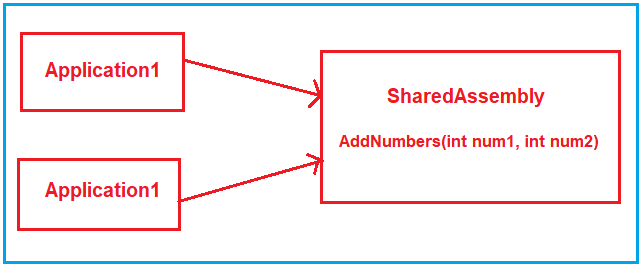
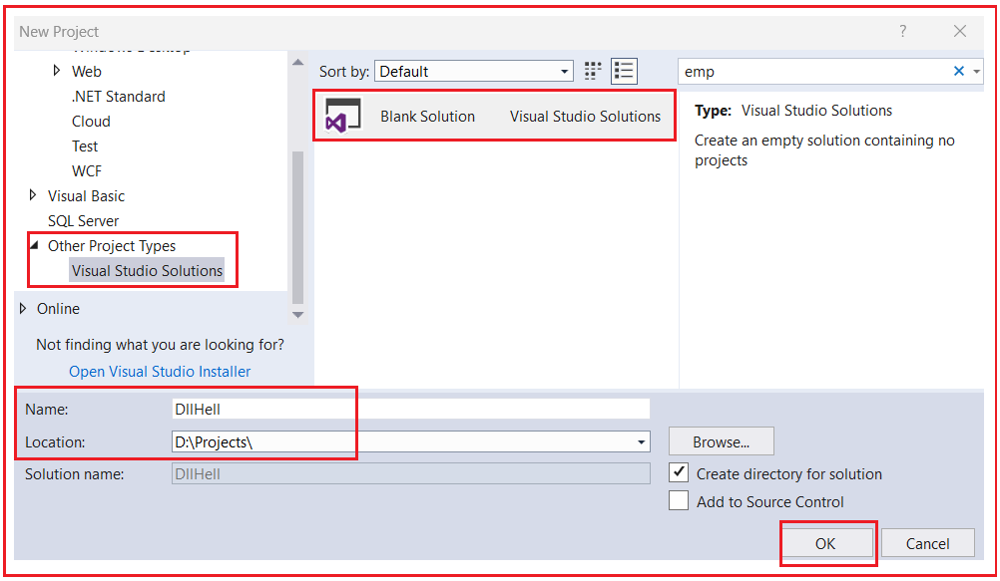
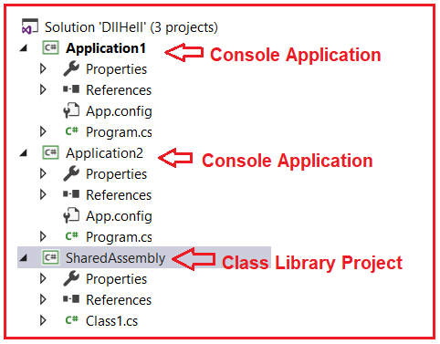
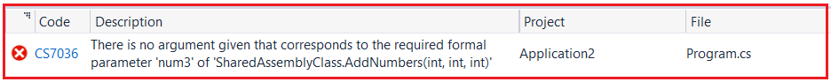
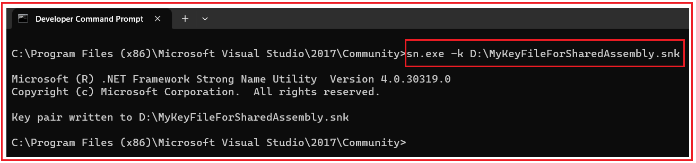
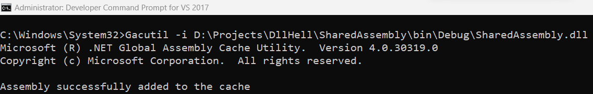
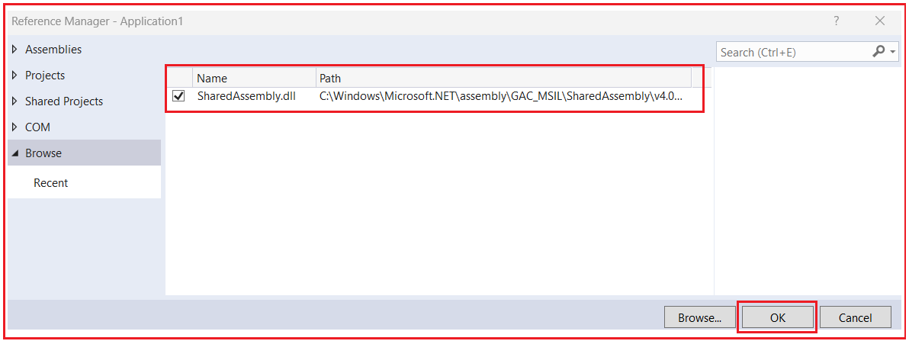
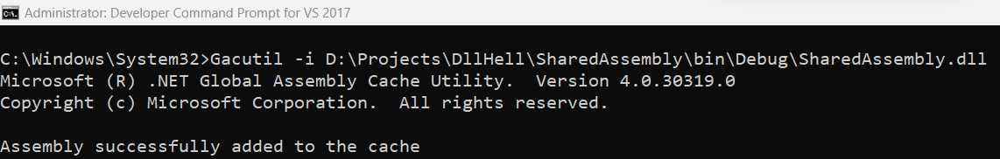
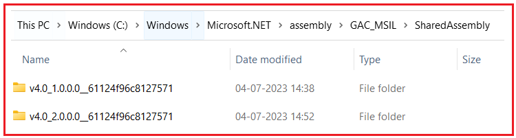
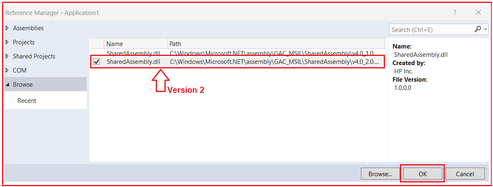

## **مشکل DLL Hell و راه حل آن در .NET Framework**

در این مقاله، قصد دارم **به همراه مثال‌هایی، مشکل DLL Hell و راه‌حل آن را در چارچوب .NET** بررسی کنم. لطفاً مقاله قبلی ما را که در آن نحوه نصب یک اسمبلی در GAC در چارچوب .NET را مورد بحث قرار دادیم، مطالعه کنید.

##### **مشکل DLL Hell در دات نت فریم ورک چیست؟**

DLL Hell مشکلی در چارچوب .NET است که در آن دو برنامه مختلف یک اسمبلی مشترک دارند و اگر یکی از برنامه‌ها اسمبلی مشترک را تغییر دهد و اگر این تغییرات با نسخه‌های قبلی سازگار نباشد، باعث از کار افتادن برنامه دیگر می‌شود. بیایید این موضوع را با یک مثال درک کنیم.

فرض کنید دو برنامه داریم، یعنی Application1 و Application2 و هر دوی این برنامه‌ها یک Assembly مشترک دارند، بیایید آن Assembly مشترک را **SharedAssembly** (یک پروژه کتابخانه کلاس) بنامیم و عملیات Assembly مشترک را مصرف کنند. فرض کنید که Assembly مشترک یک متد به نام **AddNumbers(int num1, int num2)** دارد و این متد توسط هر دو برنامه مصرف خواهد شد. برای درک بهتر، لطفاً به نمودار زیر نگاهی بیندازید.



هر دو برنامه به خوبی کار می‌کنند. اما پس از مدتی **Application2** تصمیم می‌گیرد الزامات برنامه خود را تغییر دهد. بنابراین در طول تغییرات در Application2، **AddNumbers(int num1, int num2)** متد **را به AddNumbers(int num1, int num2, int num3)** در **SharedAssembly** پروژه کتابخانه کلاس اسمبلی **تغییر می‌دهد. بنابراین پس از این تغییر، Application2** به خوبی اجرا می‌شود زیرا **AddNumbers(int num1, int num2, int num3)** را که در Shared Assembly است مصرف می‌کند، اما **Application1** استفاده می‌کند ، از کار می‌افتد **به دلیل اینکه Application1** هنوز از **AddNumbers(int num1, int num2)** تابع **.** این وضعیت در .NET Framework به عنوان مشکل DLL Hell شناخته می‌شود.

##### **مثالی برای درک مشکل DLL Hell در چارچوب .NET**

ابتدا، باید یک راه‌حل خالی ایجاد کنیم و به این راه‌حل خالی، قرار است ۳ پروژه اضافه کنیم. دو برنامه کنسول با نام‌های **Application1** و **Application2** و یک پروژه کتابخانه کلاس با نام **SharedAssembly** .

بنابراین، ویژوال استودیو را باز کنید، سپس از منوی زمینه، File => New => Project را انتخاب کنید که پنجره New Project زیر را باز می‌کند. Other Project Types را انتخاب کنید، سپس Blank Solution را انتخاب کنید، نام Solution را DllHell و مکانی را که می‌خواهید پروژه‌ها در آن ایجاد شوند، وارد کنید و سپس همانطور که در تصویر زیر نشان داده شده است، روی دکمه OK کلیک کنید.



پس از کلیک بر روی دکمه‌ی OK، یک solution خالی با نام DllHell ایجاد می‌شود. به این solution خالی، ابتدا دو Console Application با نام‌های **Application1** و **Application2** و یک class Library Project با نام **SharedAssembly اضافه می‌کنیم.** پس از افزودن پروژه‌ها، solution شما باید مانند تصویر زیر باشد.



##### **اصلاح پروژه کتابخانه کلاس SharedAssembly**

در مرحله بعد، **Class1.cs** کد فایل کلاس **از پروژه کتابخانه کلاس SharedAssembly** را به شرح زیر تغییر دهید. در اینجا، می‌توانید ببینید که ما در حال تعریف یک متد به نام **AddNumbers** هستیم که دو پارامتر عدد صحیح می‌گیرد.

```csharp
namespace SharedAssembly
{
    public class SharedAssemblyClass
    {
        public int AddNumbers(int num1, int num2)
        {
            return num1 + num2;
        }
    }
}
```

حالا، پروژه کتابخانه کلاس را بسازید و وقتی پروژه را بسازید، یک اسمبلی در پوشه Bin=>Debug پروژه با نام SharedAssembly.dll ایجاد خواهد شد. اکنون، متد AddNumbers از SharedAssembly که در بالا ذکر شد، توسط Application1 و Application2 مورد استفاده قرار خواهد گرفت.

##### **اصلاح برنامه کنسول Application1:**

ابتدا، یک ارجاع به پروژه کتابخانه کلاس SharedAssembly اضافه کنید و سپس متد Main از کلاس Program را به صورت زیر تغییر دهید. در اینجا، می‌توانید ببینید که ما در حال ایجاد یک نمونه از **کلاس SharedAssemblyClass** فراخوانی می‌کنیم **هستیم و با ارسال 10 و 20، متد AddNumbers را** .

```csharp
using System;
using SharedAssembly;

namespace Application1
{
    class Program
    {
        static void Main(string[] args)
        {
            SharedAssemblyClass obj = new SharedAssemblyClass();
            Console.WriteLine(obj.AddNumbers(10, 20));
            Console.Read();
        }
    }
}
```

حالا، Application1 را به عنوان پروژه‌ی آغازین قرار دهید و برنامه‌ی اجرا را اجرا کنید. باید خروجی مورد انتظار، یعنی 30، را دریافت کنید.

##### **اصلاح برنامه کنسول Application2:**

ابتدا، یک ارجاع به پروژه کتابخانه کلاس SharedAssembly اضافه کنید و سپس متد Main از کلاس Program را به صورت زیر تغییر دهید. در اینجا، می‌توانید ببینید که ما در حال ایجاد یک نمونه از **کلاس SharedAssemblyClass** را فراخوانی می‌کنیم **هستیم و با ارسال ۱۰۰ و ۲۰۰، متد AddNumbers** .

```csharp
using System;
using SharedAssembly;

namespace Application2
{
    class Program
    {
        static void Main(string[] args)
        {
            SharedAssemblyClass obj = new SharedAssemblyClass();
            Console.WriteLine(obj.AddNumbers(100, 200));
            Console.Read();
        }
    }
}
```

حالا، Application2 را به عنوان پروژه‌ی آغازین قرار دهید و برنامه‌ی اجرا را اجرا کنید. باید خروجی مورد انتظار، یعنی ۳۰۰، را دریافت کنید. در مثال ما، SharedAssembly توسط دو برنامه به اشتراک گذاشته شده است و هر دو برنامه به خوبی کار می‌کنند.

##### **الزامات تغییر Application1:**

حال، الزامات تجاری Application1 تغییر کرده است، اکنون می‌خواهد متد AddNumbers به ​​جای ۲ عدد صحیح، ۳ عدد صحیح را جمع کند. بنابراین، برای این کار، باید متد AddNumbers را در پروژه کتابخانه کلاس SharedAssembly نیز تغییر دهیم.

بنابراین، ابتدا، **پروژه کتابخانه کلاس SharedAssembly** را به صورت زیر تغییر دهید. در اینجا، همانطور که می‌بینید، ما متد AddNumbers را طوری تغییر می‌دهیم که ۳ پارامتر را بپذیرد.

```csharp
namespace SharedAssembly
{
    public class SharedAssemblyClass
    {
        public int AddNumbers(int num1, int num2, int num3)
        {
            return num1 + num2 + num3;
        }
    }
}
```

حالا، فایل کلاس Program.cs از پروژه Application1 را به صورت زیر تغییر دهید. در اینجا، می‌توانید ببینید که ما متد AddNumbers را با ۳ پارامتر فراخوانی می‌کنیم.

```csharp
using System;
using SharedAssembly;

namespace Application1
{
    class Program
    {
        static void Main(string[] args)
        {
            SharedAssemblyClass obj = new SharedAssemblyClass();
            Console.WriteLine(obj.AddNumbers(10, 20, 30));
            Console.Read();
        }
    }
}
```

حالا، Application1 را به عنوان پروژه‌ی آغازین قرار دهید و برنامه‌ی اجرا را اجرا کنید. باید خروجی مورد انتظار، یعنی ۶۰، را دریافت کنید. حالا، Application2 را به عنوان پروژه‌ی آغازین قرار دهید و برنامه‌ی اجرا را اجرا کنید. باید خطای زمان کامپایل زیر را دریافت کنید.



همانطور که می‌بینید، برنامه از کار می‌افتد و به این مشکل DLL Hell در چارچوب دات‌نت گفته می‌شود.

##### **چگونه بر مشکل DLL Hell در .NET Framework غلبه کنیم؟**

برای غلبه بر مشکل جهنم DLL در چارچوب .NET، باید اسمبلی‌های مشترک را با یک نام قوی امضا کنیم. با استفاده از Strongly Named Assembly، می‌توانیم نسخه‌های مختلفی از اسمبلی‌های یکسان را در GAC (حافظه پنهان سراسری اسمبلی) قرار دهیم. بنابراین، اگر Application1 هرگونه تغییر مخربی انجام دهد، این تغییر در نسخه متفاوتی از Shared Assembly خواهد بود، بنابراین بر Application1 تأثیری نخواهد گذاشت.

GAC مخفف Global Assembly Cache است و فقط شامل اسمبلی‌های با نام قوی (Strong Named Assemblies) می‌شود. یک اسمبلی زمانی دارای نام قوی (Strong Named) است که شامل ویژگی‌های زیر باشد:

1. **نام مجمع.**
2. **شماره نسخه.**
3. **این اسمبلی باید با جفت کلید خصوصی/عمومی امضا شده باشد.**

حافظه نهان سراسری اسمبلی، اسمبلی‌هایی را ذخیره می‌کند که به‌طور خاص برای اشتراک‌گذاری توسط چندین برنامه در رایانه تعیین شده‌اند.

##### **چگونه می‌توان اسمبلی را به یک اسمبلی قوی تبدیل کرد؟**

برای ایجاد یک اسمبلی با نام Strongly Named، باید اسمبلی خود را با یک جفت کلید خصوصی و عمومی امضا کنیم و قبلاً در مقالات قبلی خود در مورد این موضوع بحث کرده‌ایم.

در چارچوب .NET، ابزاری به نام Strong Naming Tool (sn.exe) داریم و می‌توانیم از این ابزار (sn.exe) برای تولید جفت کلید عمومی خصوصی استفاده کنیم. مجدداً، برای استفاده از این ابزار، باید از خط فرمان توسعه‌دهنده برای ویژوال استودیو استفاده کنیم. بنابراین، خط فرمان توسعه‌دهنده را برای ویژوال استودیو در حالت Administrator باز کنید و سپس **sn.exe -k D:\\MyKeyFileForSharedAssembly.snk** را تایپ کنید و همانطور که در تصویر زیر نشان داده شده است، دکمه enter را فشار دهید.



پس از تایپ دستور مورد نیاز و فشردن دکمه اینتر، فایل کلید با نام **MyKeyFileForSharedAssembly.snk** باید در درایو D: ایجاد شود.

پس از ایجاد فایل کلید، باید **از ویژگی AssemblyKeyFile** از **کلاس AssemblyInfo** برای امضای اسمبلی با یک نام قوی استفاده کنید. بنابراین، **فایل کلاس AssemblyInfo** از **پروژه کتابخانه کلاس SharedAssembly** را باز کنید و سپس به سازنده **ویژگی AssemblyKeyFile** ، مسیر فایل کلید که حاوی کلیدهای خصوصی و عمومی است را مطابق شکل زیر ارسال کنید. می‌توانید **کلاس AssemblyInfo** را در پوشه properties پروژه خود پیدا کنید.

**[assembly: AssemblyKeyFile(@"D:\\MyKeyFileForSharedAssembly.snk")]**

بنابراین، با این تغییر، **پروژه کتابخانه کلاس SharedAssembly را** بسازید و پس از موفقیت در ساخت، اسمبلی ما به یک اسمبلی با نام Strong Named تبدیل می‌شود. حال، بیایید **SharedAssembly.dll** را در GAC نصب کنیم. بنابراین، Visual Studio Developer Command Prompt را در حالت Administrator باز کنید و سپس دستور **Gacutil -i D:\\Projects\\DllHell\\SharedAssembly\\bin\\Debug\\SharedAssembly.dll** را تایپ کنید و همانطور که در تصویر زیر نشان داده شده است، دکمه Enter را فشار دهید.



در اینجا، می‌توانید ببینید که پیامی مبنی بر اینکه Assembly با موفقیت به حافظه پنهان اضافه شد، دریافت می‌کنیم. می‌توانید assembly را در آدرس زیر پیدا کنید.

**C:\\Windows\\Microsoft.NET\\assembly\\GAC\_MSIL\\SharedAssembly\\v4.0\_1.0.0.0\_\_61124f96c8127571**

##### **از اسمبلی فوق در هر دو برنامه استفاده کنید:**

اکنون، به جای ارجاع به پروژه کتابخانه کلاس SharedAssembly از هر دو برنامه کنسول، باید به **SharedAssembly** از GAC ارجاع دهیم. بنابراین، ابتدا **مرجع SharedAssembly** را که در حال حاضر به **پروژه کتابخانه کلاس SharedAssembly** اضافه کنید . **اشاره می‌کند، حذف کنید و سپس SharedAssembly را** از GAC همانطور که در تصویر زیر نشان داده شده است،



همین کار را برای Application 2 انجام دهید. حالا، فایل کلاس Program از Application1 Console Application را به صورت زیر تغییر دهید و برنامه را اجرا کنید. خروجی مورد انتظار را دریافت خواهید کرد.

```csharp
using System;
using SharedAssembly;

namespace Application1
{
    class Program
    {
        static void Main(string[] args)
        {
            SharedAssemblyClass obj = new SharedAssemblyClass();
            Console.WriteLine(obj.AddNumbers(10, 20, 30));
            Console.Read();
        }
    }
}
```

حالا، فایل کلاس Program از Application2 Console Application را به صورت زیر تغییر دهید و برنامه را اجرا کنید. خروجی مورد انتظار را دریافت خواهید کرد.

```csharp
using System;
using SharedAssembly;

namespace Application2
{
    class Program
    {
        static void Main(string[] args)
        {
            SharedAssemblyClass obj = new SharedAssemblyClass();
            Console.WriteLine(obj.AddNumbers(100, 200, 300));
            Console.Read();
        }
    }
}
```

##### **الزامات متغیر:**

اکنون، الزامات Application1 تغییر کرده است. به جای اضافه کردن ۳ عدد صحیح، Application1 می‌خواهد ۲ عدد صحیح اضافه کند. برای این کار، Application1 به تغییراتی در پروژه کتابخانه کلاس SharedAssembly نیاز دارد. بنابراین، پروژه کتابخانه کلاس SharedAssembly را باز کنید و سپس فایل کلاس Class1.cs را به صورت زیر تغییر دهید:

```csharp
namespace SharedAssembly
{
    public class SharedAssemblyClass
    {
        public int AddNumbers(int num1, int num2)
        {
            return num1 + num2;
        }
    }
}
```

در مرحله بعد، از آنجایی که تغییراتی در پروژه کتابخانه کلاس ایجاد کرده‌ایم، اجازه دهید ویژگی AssemblyVersion کلاس AssemblyInfo از پروژه کتابخانه کلاس SharedAssembly را به‌روزرسانی کنیم. در حال حاضر، مقدار ویژگی AssemblyVersion برابر با « **1.0.0.0** به « **2.0.0.0 » به‌روزرسانی کنیم.** » است، اجازه دهید این مقدار را به صورت زیر

**[assembly: AssemblyVersion("2.0.0.0")]**

اکنون، پروژه کتابخانه کلاس SharedAssembly را بسازید و دوباره با استفاده از دستور **Gacutil -i D:\\Projects\\DllHell\\SharedAssembly\\bin\\Debug\\SharedAssembly.dll** در خط فرمان ویژوال استودیو در حالت Administrator، همانطور که در تصویر زیر نشان داده شده است، اسمبلی را در GAC نصب کنید.



حال اگر به GAC بروید، خواهید دید که دو نسخه از SharedAssembly همانطور که در تصویر زیر نشان داده شده است، در دسترس هستند.



حالا، از Application1، ابتدا مرجع SharedAssembly را حذف کنید و سپس مرجع SharedAssembly را که نسخه آن ۲ است، همانطور که در تصویر زیر نشان داده شده است، اضافه کنید.



حالا، کد کلاس Program مربوط به برنامه‌ی کنسول Application1 را به صورت زیر تغییر دهید. در اینجا، ما با ارسال دو عدد صحیح، متد را فراخوانی می‌کنیم و به خوبی کار می‌کند. Application1 را به عنوان پروژه‌ی آغازین قرار دهید و برنامه را اجرا کنید.

```csharp
using System;
using SharedAssembly;

namespace Application1
{
    class Program
    {
        static void Main(string[] args)
        {
            SharedAssemblyClass obj = new SharedAssemblyClass();
            Console.WriteLine(obj.AddNumbers(10, 20));
            Console.Read();
        }
    }
}
```

حالا، Application2 را به عنوان پروژه‌ی آغازین قرار دهید و برنامه را اجرا کنید و خواهید دید که آن هم طبق انتظار کار می‌کند. اکنون، Application1 از SharedAssembly نسخه ۲ و Application2 از SharedAssembly نسخه ۱ استفاده می‌کند. بنابراین، به این ترتیب، با استفاده از Strong Named Assembly می‌توانیم بر مشکل DLL Hell در .NET Framework غلبه کنیم.