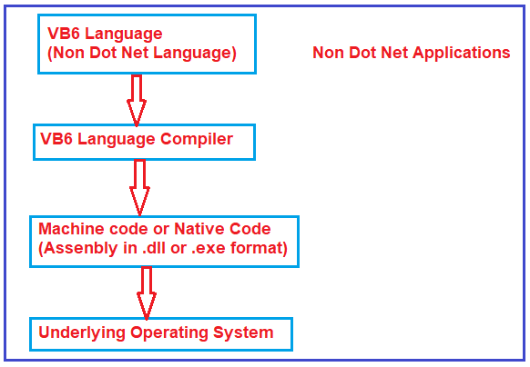
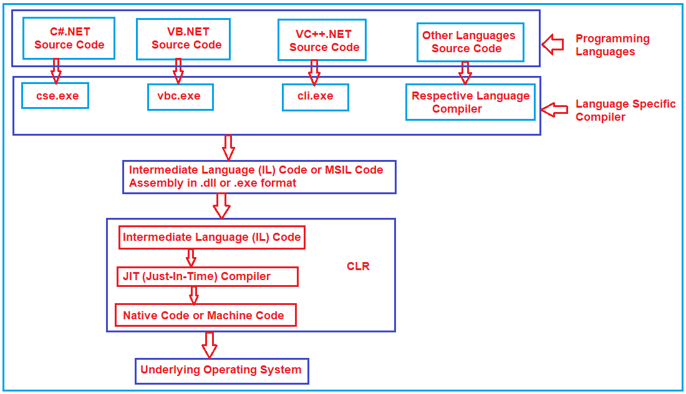

## **جریان فرآیند اجرای برنامه .NET:**

بحث خواهم کرد **.NET** **در این مقاله، من به تفصیل در مورد جریان فرآیند اجرای برنامه** . لطفاً مقاله قبلی ما را که در مورد معماری Common Language Runtime (CLR) بحث می‌کند، مطالعه کنید. به عنوان توسعه‌دهندگان .NET، ما باید بدانیم که چه زمانی یک برنامه ایجاد می‌کنیم، چگونه برنامه کامپایل می‌شود و چگونه چارچوب .NET برنامه را اجرا می‌کند. اما قبل از درک **.NET** **فرآیند اجرای برنامه** ، ابتدا اجازه دهید نحوه اجرای برنامه‌های غیر دات نت مانند برنامه‌های C، VB6 و C++ را درک کنیم.

##### **غیر دات نت** **اجرای برنامه** **فرآیند** :

ما می‌دانیم که کامپیوترها فقط کد سطح ماشین را می‌فهمند. کد سطح ماشین به عنوان کد بومی یا کد دودویی نیز شناخته می‌شود. بنابراین وقتی یک برنامه C، VB6 یا C++ را کامپایل می‌کنیم، کامپایلر زبان، کد منبع زبان را کامپایل می‌کند. این کامپایلر کد بومی ماشین (که کد دودویی نیز نامیده می‌شود) را تولید می‌کند که توسط سیستم عامل اصلی و سخت‌افزار سیستم قابل درک است. فرآیند فوق در تصویر زیر نشان داده شده است.

کد بومی یا کد ماشینی که توسط کامپایلر زبان مربوطه تولید می‌شود، مختص سیستم عاملی است که روی آن تولید شده است. اگر این کد بومی کامپایل شده را بگیریم و سعی کنیم آن را روی سیستم عامل دیگری اجرا کنیم، با شکست مواجه خواهد شد. بنابراین، مشکل این سبک اجرای برنامه این است که از یک پلتفرم به پلتفرم دیگر قابل حمل نیست. این بدان معناست که وابسته به پلتفرم است.

##### **فرآیند اجرای برنامه .NET:**

حال، بیایید فرآیند اجرای برنامه .NET را با جزئیات درک کنیم. با استفاده از .NET، می‌توانیم انواع مختلفی از برنامه‌ها مانند برنامه‌های کنسول، ویندوز، وب و موبایل ایجاد کنیم. صرف نظر از نوع برنامه، وقتی هر برنامه .NET را اجرا می‌کنیم، موارد زیر به ترتیب اتفاق می‌افتند.

کد منبع برنامه .NET به زبان میانی مایکروسافت (MSIL) کامپایل می‌شود که به آن کد زبان میانی (IL) یا زبان میانی مشترک (CIL) نیز گفته می‌شود. هر دو برنامه .NET و غیر DOTNET هنگام کامپایل برنامه، یک اسمبلی تولید می‌کنند. به طور کلی، اسمبلی‌ها بسته به نوع برنامه‌ای که کامپایل کرده‌ایم، پسوند .DLL یا .EXE دارند. به عنوان مثال، اگر یک برنامه Window یا Console را در .NET کامپایل کنیم، یک اسمبلی از نوع .EXE دریافت می‌کنیم، در حالی که وقتی یک پروژه Web یا Class Library را در .NET کامپایل می‌کنیم، یک اسمبلی از نوع .DLL دریافت می‌کنیم.

تفاوت بین اسمبلی .NET و NON-DOTNET این است که اسمبلی .NET یک فرمت زبان میانی است، در حالی که اسمبلی NON-.NET در فرمت کد بومی است.

برنامه‌های غیر دات‌نت می‌توانند مستقیماً روی سیستم عامل اجرا شوند، زیرا اسمبلی NON-DOTNET حاوی کد بومی است، در حالی که برنامه‌های دات‌نت روی یک محیط مجازی به نام **Common Language Runtime (CLR)** اجرا می‌شوند. CLR شامل مؤلفه‌ای به نام **Just-In-Time Compiler (JIT)** است که زبان میانی را به کد بومی تبدیل می‌کند، که توسط سیستم عامل اصلی قابل درک است.

##### **مراحل اجرای برنامه .NET:**

در .NET، اجرای برنامه شامل دو مرحله است. این مراحل به شرح زیر هستند:

در مرحله ۱، کامپایلر زبان مربوطه، کد منبع را به زبان میانی (IL) کامپایل می‌کند. در مرحله ۲و در این مرحله، کامپایلر JIT مربوط به CLR، کد زبان میانی (IL) را به کد بومی (کد ماشین یا کد دودویی) تبدیل می‌کند که سیستم عامل مربوطه می‌تواند آن را اجرا کند. فرآیند فوق در تصویر زیر نشان داده شده است.

از آنجایی که اسمبلی .NET در قالب زبان میانی (IL) است و نه به صورت کد بومی یا ماشین، اسمبلی‌های .NET تا زمانی که پلتفرم مقصد دارای **زمان اجرای زبان مشترک (CLR)** باشد، قابل حمل به هر پلتفرمی هستند. CLR پلتفرم مقصد، کد زبان میانی را به کد بومی یا ماشینی تبدیل می‌کند که سیستم عامل اصلی بتواند آن را درک کند.

کد زبان میانی، کد مدیریت‌شده نیز نامیده می‌شود. دلیل این امر این است که CLR کدی را که درون آن اجرا می‌شود، مدیریت می‌کند. به عنوان مثال، در یک برنامه VB6، توسعه‌دهنده مسئول آزادسازی حافظه مصرف‌شده توسط یک شیء است. اگر یک برنامه‌نویس آزادسازی حافظه را فراموش کند، ممکن است با خطاهای کمبود حافظه مواجه شود. از سوی دیگر، یک برنامه‌نویس .NET نیازی به نگرانی در مورد آزادسازی حافظه مصرف‌شده توسط یک شیء ندارد. مدیریت خودکار حافظه که به عنوان جمع‌آوری زباله نیز شناخته می‌شود، توسط CLR ارائه می‌شود. جدا از جمع‌آوری زباله، CLR مزایای دیگری نیز ارائه می‌دهد که در جلسه بعدی به آنها خواهیم پرداخت. از آنجایی که CLR زبان میانی را مدیریت و اجرا می‌کند، به آن (IL) کد مدیریت‌شده نیز گفته می‌شود.

دات‌نت از زبان‌های برنامه‌نویسی مختلفی مانند سی‌شارپ، وی‌بی، جی‌شارپ و سی‌پلاس‌پلاس پشتیبانی می‌کند. سی‌شارپ، وی‌بی و جی‌شارپ فقط می‌توانند کد مدیریت‌شده (IL) تولید کنند، در حالی که سی‌پلاس‌پلاس می‌تواند هم کد مدیریت‌شده (IL) و هم کد مدیریت‌نشده (کد بومی) تولید کند.

کد native پس از بستن برنامه، به طور دائم در هیچ جایی ذخیره نمی‌شود و دور ریخته می‌شود. وقتی دوباره برنامه را اجرا می‌کنیم، کد native دوباره تولید می‌شود.

برنامه .NET مشابه اجرای برنامه جاوا است. در جاوا، ما بایت‌کدها و JVM (ماشین مجازی جاوا) را داریم در حالی که در .NET ما زبان میانی و CLR (زمان اجرای زبان مشترک) را داریم.