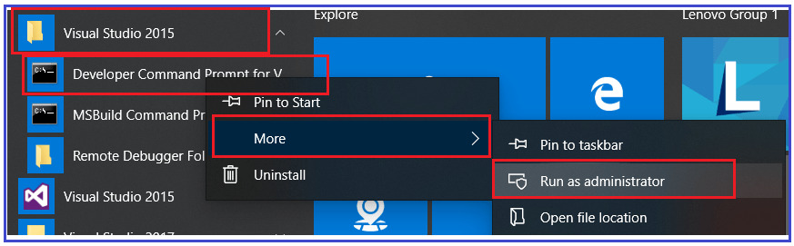
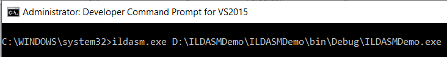
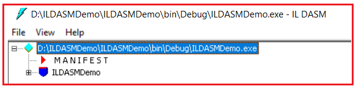
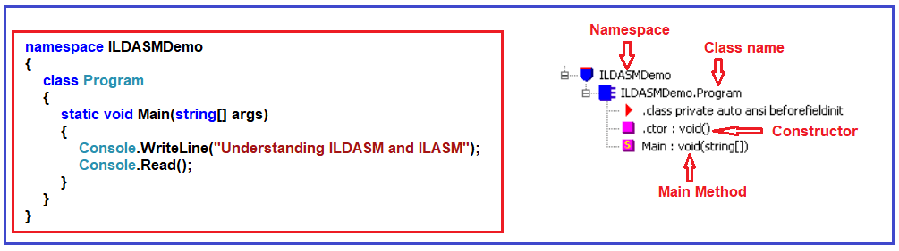
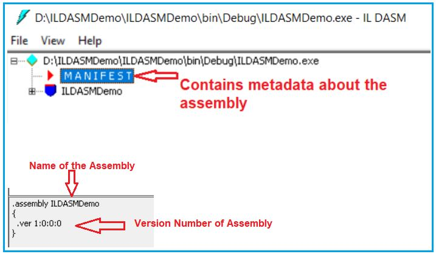
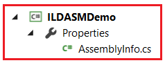
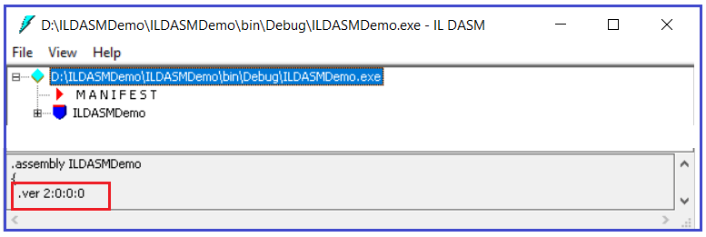
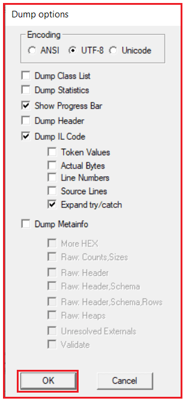

## **زبان سطح متوسط (ILDASM و ILASM) در C#.NET**

مورد بحث قرار خواهم داد **در این مقاله، کد زبان میانی (ILDASM و ILASM) در سی شارپ را** با مثال‌هایی. لطفاً مقاله قبلی ما را بخوانید، جایی که ما به تفصیل در مورد جریان فرآیند اجرای برنامه .NET بحث کردیم. **ILDASM** مخفف Intermediate Language Disassembler و **ILASM** مخفف Intermediate Language Assembler است. به عنوان بخشی از این مقاله، نکات زیر را مورد بحث قرار خواهیم داد و در پایان این مقاله، شما همه چیز را در مورد زبان میانی (IL Code) در سی شارپ خواهید فهمید.

1. **وقتی یک برنامه .NET را کامپایل می‌کنیم چه اتفاقی می‌افتد؟**
2. **درک زبان میانی (کد IL) در سی شارپ؟**
3. **ایلاس‌ام و ایلاس‌ام چیستند؟**
4. **چگونه کد زبان میانی را در سی شارپ مشاهده می‌کنید؟**
5. **مانیفست چیست؟**
6. **چگونه کد زبان میانی را به یک فایل متنی تبدیل کنیم؟**
7. **چگونه می‌توان یک اسمبلی را از یک فایل متنی که شامل manifest و IL است، بازسازی کرد؟**

##### **وقتی یک برنامه .NET را کامپایل می‌کنیم چه اتفاقی می‌افتد؟**

وقتی هر برنامه .NET را کامپایل می‌کنیم، یک اسمبلی با پسوند .DLL یا .EXE تولید می‌کند. برای مثال، اگر یک برنامه ویندوز یا کنسول را کامپایل کنید، یک .EXE دریافت خواهید کرد، در حالی که اگر یک پروژه وب یا کتابخانه کلاس را کامپایل کنید، یک .DLL دریافت خواهید کرد. صرف نظر از اینکه .DLL باشد یا .EXE، یک اسمبلی از دو چیز تشکیل شده است: **زبان مانیفست و زبان میانی** . بیایید با یک مثال بفهمیم که زبان میانی و مانیفست در چارچوب .NET چگونه به نظر می‌رسند.

##### **درک کد زبان میانی (ILDASM و ILASM) در سی شارپ:**

برای درک کد زبان میانی (ILDASM و ILASM) در سی شارپ، اجازه دهید یک برنامه کنسول ساده ایجاد کنیم. پس از ایجاد برنامه کنسول، لطفاً کلاس Program را مطابق شکل زیر تغییر دهید.

```csharp
using System;

namespace ILDASMDemo
{
    class Program
    {
        static void Main(string[] args)
        {
            Console.WriteLine("Understanding ILDASM and ILASM");
            Console.Read();
        }
    }
}
```

حالا، برنامه را بسازید. پس از ساخت برنامه، کد منبع بالا کامپایل شده و کد زبان میانی تولید و در یک اسمبلی بسته‌بندی می‌شود. برای دیدن اسمبلی، کافیست روی پروژه کلیک راست کرده و **در گزینه File Explorer گزینه Open Folder را** انتخاب کنید و سپس به **پوشه bin => Debug** بروید . در این صورت باید یک اسمبلی با پسوند .exe که در تصویر زیر نشان داده شده است را ببینید، زیرا این یک برنامه کنسول است.

 در سی شارپ")

##### **چگونه کد زبان میانی را در چارچوب دات نت مشاهده کنیم؟**

چارچوب دات‌نت ابزاری مفید به نام **ILDASM (Intermediate Language DisAssembler)** برای مشاهده کد زبان میانی در چارچوب دات‌نت ارائه می‌دهد. برای استفاده از ابزار ILDASM، باید مراحل زیر را دنبال کنید. همانطور که در تصویر زیر نشان داده شده است، خط فرمان ویژوال استودیو را در حالت Administrator باز کنید.



پس از باز کردن خط فرمان ویژوال استودیو در حالت ادمین، دستور « **Ildasm.exe C:\\YourDirectoryPath\\YourAssembly.exe** » را تایپ کرده و اینتر را بزنید. در اینجا، باید مسیر exe که فایل اجرایی شما در آن تولید می‌شود را وارد کنید. فایل اجرایی من در مسیر « **D:\\ILDASMDemo\\ILDASMDemo\\bin\\Debug\\ILDASMDemo.exe** » تولید می‌شود، بنابراین کد زیر را در خط فرمان اجرا می‌کنم:



پس از تایپ دستور بالا و فشردن کلید اینتر، باید پنجره ILDASM زیر باز شود.



همانطور که می‌بینید، اسمبلی از دو چیز تشکیل شده است ( **زبان مانیفست و زبان میانی** ). ابتدا کد زبان میانی را بررسی می‌کنیم و سپس به بررسی اینکه مانیفست چیست می‌پردازیم. حال، بیایید ILDASMDemo را گسترش دهیم و آن را با کد خودمان مقایسه کنیم. برای درک بهتر، لطفاً به تصویر زیر نگاهی بیندازید. در ILDASM یک سازنده وجود دارد و این به این دلیل است که به طور پیش‌فرض، چارچوب .NET وقتی هیچ سازنده‌ای در کلاس شما وجود ندارد، یک سازنده پیش‌فرض ارائه می‌دهد. همچنین می‌توانید متد Main را در زبان میانی ببینید.



اکنون، روی متد Main در پنجره‌ی ILDASM دوبار کلیک کنید تا زبان میانی تولید شده برای متد Main را، همانطور که در زیر نشان داده شده است، مشاهده کنید.

 در C#.NET")

##### **مانیفست چیست؟**

مانیفست شامل ابرداده‌هایی در مورد اسمبلی، مانند نام اسمبلی، شماره نسخه اسمبلی، فرهنگ و اطلاعات نام قوی است، همانطور که در تصویر زیر نشان داده شده است.



فراداده همچنین حاوی اطلاعاتی در مورد اسمبلی‌های ارجاع‌شده است. هر ارجاع شامل نام اسمبلی وابسته، فراداده اسمبلی (نسخه، فرهنگ، سیستم عامل و غیره) و کلید عمومی در صورتی که اسمبلی دارای نام قوی باشد، می‌باشد.

##### **چگونه اطلاعات اسمبلی را تغییر دهیم؟**

همچنین می‌توان با استفاده از ویژگی‌ها، برخی از اطلاعات موجود در مانیفست اسمبلی را تغییر داد یا اصلاح کرد. به عنوان مثال، اگر می‌خواهید شماره نسخه را تغییر دهید، باید مراحل زیر را دنبال کنید. **فایل کلاس AssemblyInfo.cs** را که در پوشه Properties قرار دارد، مطابق شکل زیر باز کنید. هر پروژه در .NET دارای یک پوشه properties است.



در این فایل، یک ویژگی به نام ویژگی AssemblyVersion پیدا خواهید کرد که به طور پیش‌فرض روی 1.0.0.0 تنظیم شده است. اکنون، این مقدار را مطابق شکل زیر به 2.0.0.0 تغییر دهید.

 در C#.NET")

حالا، سولوشن را دوباره بسازید. اما قبل از آن، پنجره ILDASM را ببندید؛ در غیر این صورت، با خطا مواجه خواهید شد. پس از بازسازی سولوشن، همانطور که در زیر نشان داده شده است، اسمبلی را با استفاده از همان **ILDASM.exe** در خط فرمان باز کنید.

 در C#.NET")

پس از اجرای دستور بالا، باید اسمبلی باز شود. در پایین، می‌توانید شماره نسخه به‌روز شده اسمبلی را همانطور که در زیر نشان داده شده است، پیدا کنید.



##### **چگونه کد زبان میانی را به یک فایل متنی تبدیل کنیم؟**

اگر می‌خواهید کد زبان میانی را در یک فایل متنی خروجی بگیرید یا ذخیره کنید، باید مراحل زیر را دنبال کنید.

را انتخاب کنید **گزینه File Menu** از **ابزار ILDASM،** و سپس **Dump** . **در پنجره Dump Options** ، روی **دکمه OK کلیک کنید.** ، مطابق شکل زیر



حالا باید نام فایل مورد نظر خود را وارد کنید. من نام فایل را **MyFile** وارد می‌کنم و آن را در **درایو D** ذخیره می‌کنم. حالا در ویندوز اکسپلورر به درایو D بروید و باید فایل MyFile.il را ببینید. حالا MyFile.il را با Notepad باز کنید و باید متادیتای اسمبلی و کد IL را ببینید.

##### **چگونه یک اسمبلی را از یک فایل متنی که شامل manifest و IL است، بازسازی کنیم؟**

اگر می‌خواهید یک اسمبلی را از کد IL بازسازی کنید، باید از ابزاری به نام ILASM.exe استفاده کنید. بنابراین، بیایید یک اسمبلی از فایل (MyFile.il) که ذخیره کرده‌ایم، ایجاد کنیم. برای بازسازی یک اسمبلی، لطفاً مراحل زیر را دنبال کنید.

دستور زیر را در «خط فرمان ویژوال استودیو» تایپ کنید و اینتر را بزنید  
**ILASM.exe مسیر D:\\MyFile.il**  
حالا در ویندوز اکسپلورر به درایو D: بروید، باید MyFile.exe را ببینید. بنابراین، به طور خلاصه، ما از **ILASM.exe** (اسمبلر زبان میانی) برای بازسازی یک اسمبلی از یک فایل متنی که شامل manifest و IL است، استفاده می‌کنیم.