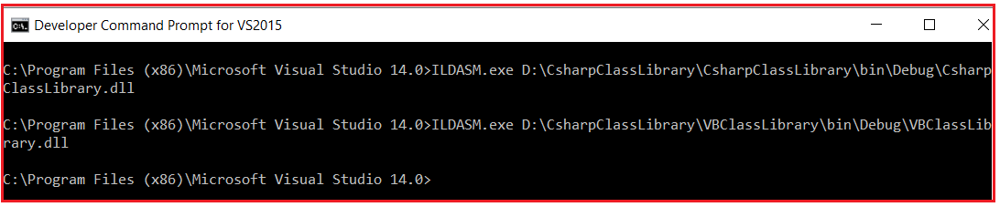

## **سیستم نوع‌بندی مشترک (CTS) در چارچوب دات‌نت**

در این مقاله، قصد دارم در مورد **سیستم نوع‌بندی مشترک (Common Type System) در چارچوب دات‌نت (.NET Framework** با مثال‌ها بحث کنم. لطفاً مقاله قبلی ما را که در آن به زبان میانی (ILDASM و ILASM) در چارچوب دات‌نت پرداختیم، بخوانید. سیستم نوع‌بندی مشترک (CTS) در چارچوب دات‌نت، نحوه اعلان، استفاده و مدیریت انواع داده‌ها را در زمان اجرای زبان مشترک (CLR) تعریف می‌کند. در پایان این مقاله، شما خواهید فهمید که سیستم نوع‌بندی مشترک (CTS) در سی‌شارپ چیست و چگونه CTS در دات‌نت کار می‌کند.

##### **چیست ؟** **سیستم نوع‌بندی رایج در چارچوب دات‌نت**

چارچوب دات‌نت از زبان‌های برنامه‌نویسی زیادی مانند سی‌شارپ، وی‌بی.نت، جی‌شارپ، اف‌شارپ و غیره پشتیبانی می‌کند. هر زبان برنامه‌نویسی نوع داده‌ی مخصوص به خود را دارد. یک نوع داده‌ی یک زبان برنامه‌نویسی توسط زبان‌های برنامه‌نویسی دیگر قابل درک نیست. اما، ممکن است موقعیت‌هایی وجود داشته باشد که نیاز به برقراری ارتباط بین دو زبان برنامه‌نویسی مختلف داشته باشیم. به عنوان مثال، ما باید کدی را به زبان وی‌بی.نت بنویسیم و آن کد ممکن است از زبان سی‌شارپ فراخوانی شود. برای اطمینان از ارتباط روان بین این زبان‌ها، مهم‌ترین چیز این است که آنها باید یک سیستم نوع‌بندی مشترک (CTS) داشته باشند که تضمین می‌کند انواع داده‌های تعریف‌شده در دو زبان مختلف به یک نوع داده‌ی مشترک کامپایل شوند.

CLR در چارچوب .NET انواع داده‌های تمام زبان‌های برنامه‌نویسی را اجرا می‌کند. این امر به این دلیل امکان‌پذیر است که CLR انواع داده‌های خاص خود را دارد که در همه زبان‌های برنامه‌نویسی مشترک هستند. در زمان کامپایل، تمام انواع داده‌های خاص زبان به نوع داده‌های CLR تبدیل می‌شوند. این سیستم نوع داده CLR برای همه زبان‌های برنامه‌نویسی پشتیبانی شده توسط .NET مشترک است و به عنوان سیستم نوع مشترک (CTS) در چارچوب .NET شناخته می‌شود.

##### **مثالی برای درک سیستم نوع‌بندی رایج در چارچوب .NET**

بیایید با یک مثال، سیستم نوع‌بندی مشترک (CTS) را در چارچوب .NET درک کنیم. کاری که قرار است انجام دهیم این است که دو برنامه ایجاد خواهیم کرد. یکی از برنامه‌ها از زبان C# و دیگری از زبان VB.NET استفاده می‌کند. و سپس سعی خواهیم کرد کد IL هر دو برنامه را ببینیم و سپس سعی خواهیم کرد ببینیم CTS چگونه به نظر می‌رسد.

در اینجا ما قصد داریم دو پروژه کتابخانه کلاس ایجاد کنیم. یکی از پروژه های کتابخانه کلاس از زبان C#.NET و دیگری از زبان VB.NET استفاده می کند.

##### **ایجاد پروژه کتابخانه کلاس سی شارپ:**

یک پروژه کتابخانه کلاس با نام **CsharpClassLibrary** ایجاد کنید و از **زبان برنامه‌نویسی C#** استفاده کنید . پس از ایجاد پروژه کتابخانه کلاس C#، یک فایل کلاس با نام **Calculator.cs** اضافه کنید و سپس کد زیر را در آن کپی و جایگذاری کنید.

```csharp
namespace CsharpClassLibrary
{
    public class Calculator
    {
        public int Calculate()
        {
            int a = 10, b = 20;
            int c = a + b;
            return c;
        }
    }
}
```

##### **ایجاد پروژه کتابخانه کلاس VB:**

به همان راه‌حل CsharpClassLibrary، اجازه دهید یک پروژه کتابخانه کلاس دیگر با نام **VBClassLibrary** اما با استفاده **از VB** به عنوان زبان برنامه‌نویسی اضافه کنیم. پس از ایجاد پروژه کتابخانه کلاس VB، یک فایل کلاس با نام **Calculator.cs** به این پروژه اضافه کنید و کد زیر را در آن کپی و جایگذاری کنید.

```vb
Public Class Calculator
    Public Function Calculate() As Integer
        Dim a As Integer = 10
        Dim b As Integer = 10
        Dim c As Integer
        c = a + b
        Return c
    End Function
End Class
```

حالا، سولوشنی را بسازید که باید .dll های مورد نظر را تولید کند. در مقاله قبلی، نحوه استفاده از ابزار ILDASM برای مشاهده جزئیات کد IL را مورد بحث قرار دادیم. بنابراین، بیایید Visual Studio Command Prompt را در حالت Administrative باز کنیم و دو نمونه از **دستور ILDASM.exe** را اجرا کنیم ، یکی برای فایل DLL پروژه کتابخانه کلاس VB و دیگری برای فایل پروژه کتابخانه کلاس C#، همانطور که در تصویر زیر نشان داده شده است.



حال، کد IL مربوط به متد Calculate هر دو پروژه کتابخانه کلاس را همانطور که در تصویر زیر نشان داده شده است، باز می‌کنیم. لطفاً به متغیر عدد صحیح در کد IL که در این مورد int32 است، نگاهی بیندازید. در پروژه کتابخانه کلاس C#، ما از int به عنوان نوع داده برای اعلام متغیرهای a، b و c استفاده می‌کنیم، در حالی که در پروژه کتابخانه کلاس VB، از Integer به عنوان نوع داده برای اعلام متغیرهای a، b و c استفاده می‌کنیم. در نهایت، هر دو نوع داده به یک نوع داده مشترک یعنی int32 کامپایل می‌شوند.

 در چارچوب دات‌نت")

بنابراین، چه کد را در VB.NET بنویسیم و چه در C#.NET، اگر از قوانین یا مشخصات دات نت پیروی کند، در نهایت به یک سیستم نوع داده مشترک (CTS) در چارچوب .NET کامپایل می‌شود که برای همه زبان‌های برنامه‌نویسی پشتیبانی‌شده توسط .NET رایج است. این سیستم نوع داده مشترک توسط CLR ارائه می‌شود و برای همه زبان‌های برنامه‌نویسی پشتیبانی‌شده توسط .NET یکسان است. هنگام کامپایل کد منبع توسط کامپایلر زبان مربوطه، نوع داده مختص زبان را به نوع داده مختص CLR تبدیل می‌کنند. به عنوان مثال، int در C# و Integer در VB پس از کامپایل به Int32 تبدیل می‌شوند و Int32 نوع داده‌ای است که توسط CLR قابل درک است. یا می‌توان گفت Int32 نوع داده مختص CLR است.