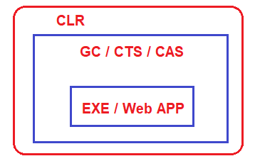
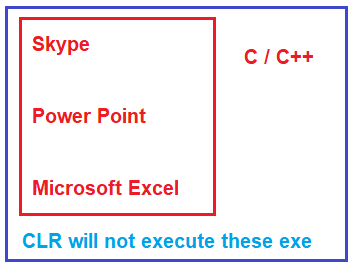
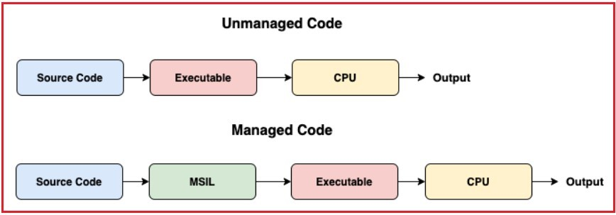

## **کد مدیریت‌شده و مدیریت‌نشده در چارچوب دات‌نت**

در این مقاله، قصد دارم در مورد **کد مدیریت‌شده و مدیریت‌نشده در چارچوب .NET** بحث کنم. لطفاً مقاله قبلی ما را که در آن به تفصیل در مورد مشخصات زبان مشترک (CLS) بحث کردیم، بخوانید. کد مدیریت‌شده به کدی گفته می‌شود که تحت چارچوب .NET طراحی و توسعه داده شده است. کد مدیریت‌نشده به کدی گفته می‌شود که با استفاده از چارچوب .NET نوشته و مدیریت نشده است. در پایان این مقاله، شما خواهید فهمید که کد مدیریت‌شده و کد مدیریت‌نشده چیست و چگونه در چارچوب .NET اجرا می‌شوند.

##### **درک کد مدیریت‌شده و مدیریت‌نشده در چارچوب .NET:**

هر زمان که ما هر فایل اجرایی (EXE) (مثلاً Console Application، Windows Application، Class Library Project و غیره) یا هر DLL (مثلاً Web Application (مثلاً ASP.NET MVC، ASP.NET Web API، ASP.NET و غیره) را در چارچوب دات‌نت با استفاده از ویژوال استودیو و با استفاده از هر زبان برنامه‌نویسی پشتیبانی‌شده توسط دات‌نت مانند C#، VB، F#، J# و غیره) ایجاد می‌کنیم، این برنامه‌ها کاملاً تحت کنترل CLR (Common Language Runtime) اجرا می‌شوند. CLR موتور زمان اجرای برنامه‌های دات‌نت است.

آن اشیاء را پاک می‌کند اگر برنامه‌های شما اشیاء بلااستفاده‌ای داشته باشند، CLR با استفاده از Garbage Collector. اگر برنامه شما بخواهد با برنامه‌های دیگر ارتباط برقرار کند، مطمئن می‌شود که CTS (سیستم نوع مشترک) و CLS (مشخصات زبان مشترک) رعایت می‌شوند. CLR همچنین از **CAS (امنیت دسترسی به کد)** و **CV (تأیید کد)** برای مدیریت امنیت برنامه شما استفاده می‌کند، یعنی بررسی می‌کند که آیا کاربر فعلی حق دسترسی به اسمبلی را دارد یا خیر و آیا اجرای اسمبلی توسط سیستم عامل ایمن است یا خیر. CLR همچنین برنامه شما را بارگذاری و تخلیه می‌کند و غیره. بنابراین، برای درک بهتر، لطفاً به تصویر زیر نگاهی بیندازید.

حالا، فرض کنید شما از فایل‌های اجرایی شخص ثالث دیگری در برنامه‌ی دات‌نت خود مانند اسکایپ، پاورپوینت، مایکروسافت اکسل، واتس‌اپ و غیره استفاده کرده‌اید. این «فایل‌های اجرایی» در دات‌نت ساخته نشده‌اند، بلکه با استفاده از زبان‌های برنامه‌نویسی دیگری مانند C و C++ ساخته شده‌اند.

وقتی از این «فایل‌های اجرایی» (EXE) در برنامه خود استفاده می‌کنید، این فایل‌ها توسط CLR اجرا نخواهند شد. حتی اگر این «فایل‌های اجرایی» را در برنامه‌های دات‌نت اجرا کنید، آنها تحت محیط خودشان اجرا می‌شوند. به عنوان مثال، اگر یک فایل اجرایی با استفاده از C یا C++ توسعه داده شده باشد، آن فایل اجرایی تحت محیط اجرایی C یا C++ اجرا خواهد شد، نه محیط اجرایی دات‌نت. در همین راستا، اگر فایل اجرایی با استفاده از VB6 ایجاد شده باشد، تحت محیط اجرایی VB6 اجرا خواهد شد، نه با استفاده از CLR که محیط اجرایی برای برنامه‌های دات‌نت است.

##### **کد مدیریت‌شده و کد مدیریت‌نشده در چارچوب دات‌نت دقیقاً چیست؟**

کدهایی که تحت کنترل کامل CLR اجرا می‌شوند، کد مدیریت‌شده در چارچوب دات‌نت (.NET Framework) نامیده می‌شوند. این نوع کد (کد مدیریت‌شده) توسط محیط زمان اجرای دات‌نت یعنی CLR اجرا می‌شوند. اگر چارچوب دات‌نت نصب نشده باشد یا محیط زمان اجرای دات‌نت یعنی CLR در دسترس نباشد، این نوع کدها اجرا نخواهند شد. CLR تمام امکانات و ویژگی‌های دات‌نت مانند قابلیت همکاری زبان، مدیریت خودکار حافظه، مکانیسم مدیریت استثنا، امنیت دسترسی به کد، جمع‌آوری زباله و غیره را برای اجرای کد مدیریت‌شده فراهم می‌کند. در این حالت، کد منبع به زبان میانی معروف به IL یا MSIL یا CIL کامپایل می‌شود.

از سوی دیگر، اسکایپ، پاورپوینت و مایکروسافت اکسل نیازی به محیط زمان اجرای .NET ندارند و تحت محیط خودشان اجرا می‌شوند. بنابراین، به طور خلاصه، کدی (EXE، DLL) که تحت کنترل CLR اجرا نمی‌شود، کد مدیریت نشده نامیده می‌شود. CLR هیچ یک از امکانات و ویژگی‌های .NET مانند قابلیت همکاری زبان، مدیریت خودکار حافظه، مکانیسم مدیریت استثنا، امنیت دسترسی به کد، جمع‌آوری زباله و غیره را در اختیار کد مدیریت نشده قرار نمی‌دهد. در این حالت، کد منبع مستقیماً به زبان‌های بومی کامپایل می‌شود.

**نکته:** کد مدیریت‌شده کدی است که توسط CLR (Common Language Runtime) در چارچوب دات‌نت مدیریت می‌شود. در حالی که کد مدیریت‌نشده کدی است که مستقیماً توسط سیستم عامل اجرا می‌شود.

##### **مزایای استفاده از کد مدیریت‌شده چیست؟**

1. این امر امنیت برنامه را بهبود می‌بخشد، به این صورت که بررسی می‌کند آیا کاربر فعلی به اسمبلی دسترسی دارد یا خیر و آیا اجرای اسمبلی توسط سیستم عامل ایمن است یا خیر.
2. هر زمان که یک شیء توسط برنامه استفاده نشود، Garbage Collector به طور خودکار حافظه مربوط به اشیاء استفاده نشده را از بین می‌برد.
3. از مدیریت پیش‌فرض استثنائات پشتیبانی خواهد کرد.

##### **معایب کد مدیریت‌شده چیست؟**

1. عیب اصلی کد مدیریت‌شده در چارچوب دات‌نت این است که ما اجازه نداریم مستقیماً حافظه را تخصیص دهیم، یا نمی‌توانیم دسترسی سطح پایین به معماری پردازنده داشته باشیم. این امر توسط CLR چارچوب دات‌نت مدیریت خواهد شد.

##### **مزایای استفاده از کد مدیریت نشده چیست؟**

1. این دسترسی سطح پایین را برای برنامه نویس فراهم می کند.
2. همچنین دسترسی مستقیم به سخت‌افزار دستگاه را فراهم می‌کند.
3. این کد کمی سریع‌تر از کد مدیریت‌شده است.
4. ما می‌توانیم کد مدیریت نشده را تحت هر محیط و پلتفرمی اجرا کنیم.

##### **معایب کد مدیریت نشده چیست؟**

1. امنیت برنامه را تضمین نمی‌کند.
2. به دلیل دسترسی به تخصیص حافظه، ممکن است مشکلاتی مربوط به نشت حافظه رخ داده باشد.
3. عدم جمع‌آوری خودکار زباله
4. این برنامه از مدیریت پیش‌فرض استثناها پشتیبانی نمی‌کند، توسعه‌دهنده باید این موارد را مدیریت کند.