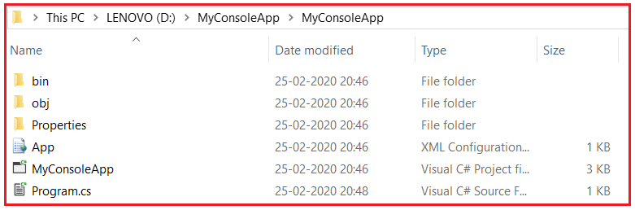
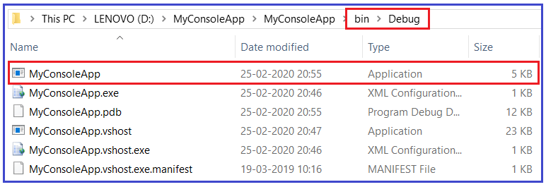
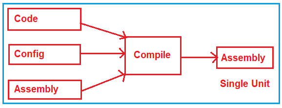
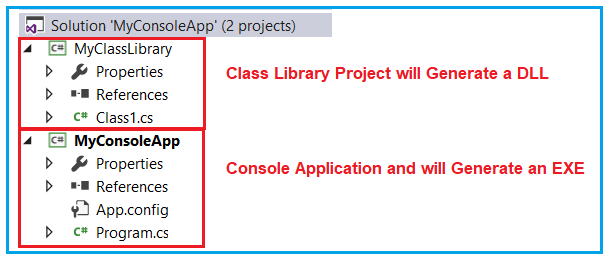
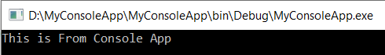
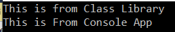

## **فایل اجرایی اسمبلی DLL در چارچوب دات نت**

در این مقاله، قصد دارم در مورد **Assembly DLL و EXE** **در .NET Framework** با مثال‌هایی بحث کنم. لطفاً مقاله قبلی ما را که در آن در مورد کد مدیریت‌شده و مدیریت‌نشده در .NET Framework بحث کردیم، مطالعه کنید. به عنوان بخشی از این مقاله، قصد داریم نکات زیر را به تفصیل مورد بحث قرار دهیم.

1. **اسمبلی در دات نت چیست؟**
2. **انواع اسمبلی‌ها در چارچوب .NET.**
3. **آشنایی با DLL و EXE**
4. **تفاوت بین DLL و EXE در چارچوب .NET چیست؟**

##### **اسمبلی در دات نت چیست؟**

طبق MSDN، اسمبلی‌ها بلوک سازنده برنامه‌های چارچوب دات‌نت هستند. آن‌ها واحد اساسی استقرار را تشکیل می‌دهند. به عبارت ساده، می‌توانیم بگوییم که اسمبلی چیزی جز یک کد دات‌نت از پیش کامپایل شده نیست که می‌تواند توسط CLR (Common Language Runtime) اجرا شود.

بیایید تعریف بالا را با یک مثال درک کنیم. برای درک این موضوع، یک برنامه کنسول ساده با نام MyConsoleApp ایجاد می‌کنیم. پس از ایجاد برنامه کنسول، لطفاً کلاس Program را مطابق شکل زیر تغییر دهید.

```csharp
using System;

namespace MyConsoleApp
{
    class Program
    {
        static void Main(string[] args)
        {
            Console.WriteLine("This is From Console App");
            Console.ReadKey();
        }
    }
}
```

حالا اگر روی پروژه خود کلیک راست کرده و در File Explorer روی Open Folder کلیک کنید، موارد زیادی (کد منبع یعنی فایل کلاس Program.cs، فایل پیکربندی یعنی App، پوشه Properties که حاوی فایل کلاس AssemblyInfo.cs است و غیره) را همانطور که در تصویر زیر نشان داده شده است، خواهید یافت.



اما وقتی برنامه را می‌سازید، تمام موارد فوق را همانطور که در تصویر زیر نشان داده شده است، در یک فایل EXE قرار می‌دهد. می‌توانید این فایل EXE را در **پوشه bin => Debug** پیدا کنید . می‌توانید این فایل واحد یعنی **MyConsoleApp.exe** را کپی کرده و در هر جایی از رایانه خود قرار دهید و از آنجا می‌توانید آن را اجرا کنید.



بنابراین، یک اسمبلی چیزی جز یک واحد استقرار یا یک قطعه کد از پیش کامپایل شده نیست که می‌تواند توسط CLR اجرا شود. برای درک بهتر، لطفاً به نمودار زیر نگاهی بیندازید.



##### **انواع اسمبلی‌ها در چارچوب .NET:**

در چارچوب .NET، دو نوع اسمبلی وجود دارد. آنها به شرح زیر هستند:

1. **EXE (قابل اجرا)**
2. **DLL (کتابخانه پیوند پویا)**

در چارچوب دات‌نت، وقتی یک برنامه کنسول یا یک برنامه ویندوز را کامپایل می‌کنیم، فایل اجرایی (EXE) تولید می‌شود، در حالی که وقتی یک پروژه کتابخانه کلاس یا برنامه ASP.NET Web (MVC یا Web API) را کامپایل می‌کنیم، فایل اجرایی (DLL) تولید می‌شود. در چارچوب دات‌نت، هم فایل‌های اجرایی (EXE) و هم فایل‌های اجرایی (DLL) اسمبلی نامیده می‌شوند.

##### **درک DLL و EXE در چارچوب .NET:**

ما قبلاً یک برنامه کنسول ایجاد کرده‌ایم و می‌بینیم که یک فایل اجرایی (EXE) ایجاد می‌کند. بیایید مثالی از DLL را بررسی کنیم. برای ایجاد یک DLL، یک پروژه کتابخانه کلاس به همان راه‌حل با نام **MyClassLibrary** اضافه می‌کنیم . پس از ایجاد پروژه کتابخانه کلاس، به طور پیش‌فرض یک فایل کلاس با نام Class1 ایجاد می‌شود. بیایید Class1 را مطابق شکل زیر تغییر دهیم.

```csharp
namespace MyClassLibrary
{
    public class Class1
    {
        public string GetData()
        {
            return "This is from Class Library";
        }
    }
}
```

با این کار، اکنون راه‌حل ما شامل دو پروژه است. یکی یک برنامه کنسول و دیگری یک پروژه کتابخانه کلاس است، همانطور که در زیر نشان داده شده است.



خودشان دریافت کنید **حالا، سولوشن را بسازید و باید اسمبلی‌های مربوطه را همانطور که انتظار می‌رود در پوشه‌ی bin => Debug** . حالا، سوالی که باید به ذهنتان خطور کند این است که تفاوت بین DLL و EXE در .NET Framework چیست؟

##### **تفاوت بین DLL و EXE در چارچوب .NET چیست؟**

فایل اجرایی (EXE) در فضای آدرس یا فضای حافظه مخصوص به خود اجرا می‌شود. اگر روی فایل MyConsoleApp.EXE دوبار کلیک کنید، خروجی زیر را خواهید دید. اکنون، این برنامه فضای حافظه خود را از دست داده است.



بدون بستن این پنجره، اگر دوباره روی فایل MyConsoleApp.EXE دوبار کلیک کنید، دوباره اجرا می‌شود و همان خروجی را نمایش می‌دهد. دلیل این امر این است که اکنون هر دو فایل EXE در فضای حافظه خود اجرا می‌شوند. نکته‌ای که باید به خاطر داشته باشید این است که EXE یک فایل اجرایی است و می‌تواند به خودی خود به عنوان یک برنامه اجرا شود.

در مورد DLL، این فایل نمی‌تواند مانند EXE به تنهایی اجرا شود. این بدان معناست که **MyClassLibrary.dll** نمی‌تواند به تنهایی فراخوانی یا اجرا شود. به یک مصرف‌کننده نیاز دارد که قرار است آن را فراخوانی کند. بنابراین، یک DLL در فضای حافظه دیگری اجرا می‌شود. فضای حافظه دیگر می‌تواند یک کنسول، برنامه‌های ویندوز یا برنامه‌های وب باشد که باید فضای حافظه مخصوص به خود را داشته باشند.

برای مثال، می‌توانید DLL را از یک برنامه کنسول فراخوانی کنید. ما یک برنامه کنسول به نام MyConsoleApp داریم و بیایید ببینیم چگونه می‌توان **MyClassLibrary.dll** را از این برنامه کنسول فراخوانی کرد. برای استفاده از MyClassLibrary.dll در داخل MyConsoleApp، ابتدا باید به آن DLL ارجاع دهید. پس از افزودن ارجاع به MyClassLibrary DLL، لطفاً کلاس Program برنامه کنسول را مطابق شکل زیر تغییر دهید.

```csharp
using System;
using MyClassLibrary;

namespace MyConsoleApp
{
    class Program
    {
        static void Main(string[] args)
        {
            // Using MyClassLibrary DLL
            Class1 obj = new Class1();
            Console.WriteLine(obj.GetData());

            Console.WriteLine("This is From Console App");
            Console.ReadKey();
        }
    }
}
```

حالا، برنامه را اجرا کنید و باید خروجی زیر را مشاهده کنید. در اینجا، فایل DLL مربوط به MyClassLibrary در فضای آدرس MyConsoleApp اجرا می‌شود.



بنابراین، به طور خلاصه، تفاوت بین آنها این است که EXE یک فایل اجرایی است و می‌تواند به خودی خود به عنوان یک برنامه اجرا شود در حالی که DLL معمولاً توسط یک EXE یا یک DLL دیگر مصرف می‌شود و ما نمی‌توانیم DLL را مستقیماً اجرا یا استفاده کنیم. حتی یک وب سرور مانند IIS نیز می‌تواند در مورد برنامه‌های وب، DDL را فراخوانی کند.

حالا، سوالی که باید به ذهنتان خطور کند این است که چرا به DLL ها نیاز داریم، چون خودشان فراخوانی نمی‌شوند. دلیل وجود DLL قابلیت استفاده مجدد است. فرض کنید می‌خواهید یک کلاس، یا منطق یا چیز دیگری را در بسیاری از برنامه‌ها داشته باشید، پس به سادگی آن کلاس‌ها و منطق را درون یک DLL قرار دهید و هر جا که لازم بود به آن DLL ارجاع دهید.