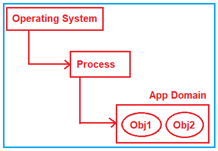
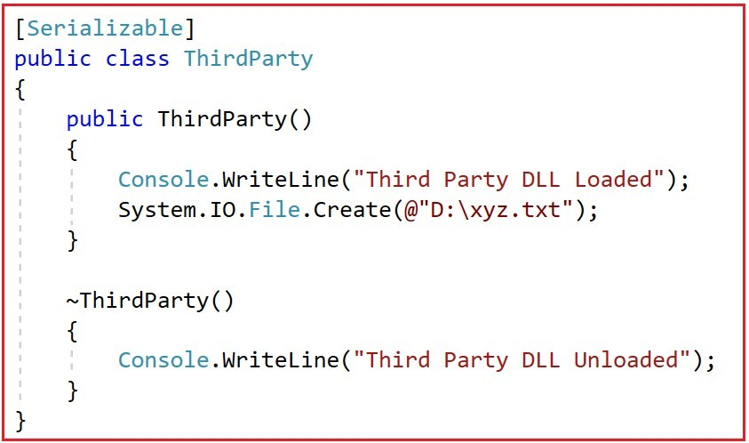
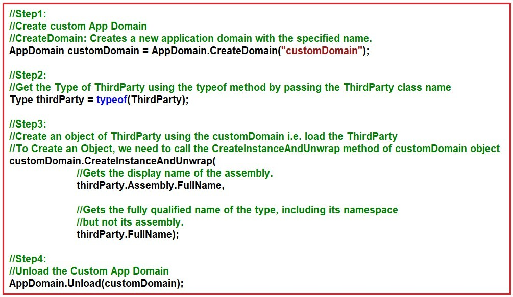
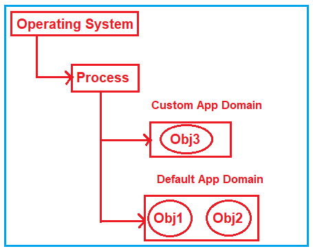
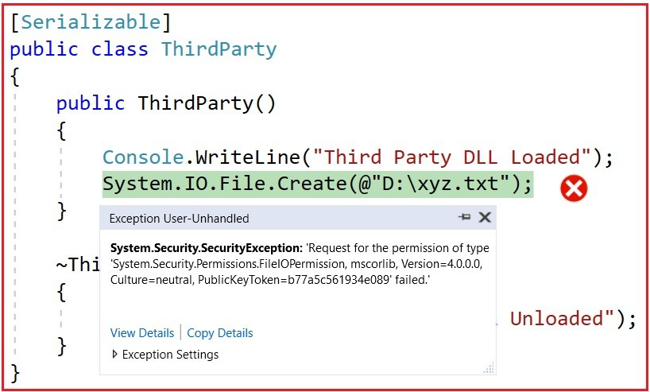
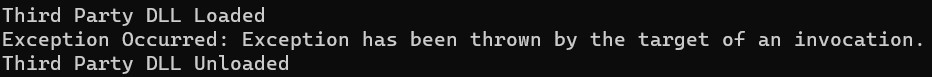

## **دامنه برنامه در چارچوب .NET**

در این مقاله، قصد دارم در مورد **App Domain در .NET Framework** و اینکه در چه سناریوهایی به آنها نیاز داریم، با مثال‌هایی صحبت کنم. لطفاً مقاله قبلی ما را که در آن مورد Assembly، DLL و EXE به طور مفصل در صحبت کردیم، مطالعه کنید. App Domain (Application Domain) در .NET Framework یک کانتینر منطقی ایزوله است که کد .NET در داخل آن اجرا می‌شود. در پایان این مقاله، شما App Domain چیست و نحوه ایجاد یک App Domain سفارشی در .NET Framework را با مثال‌هایی خواهید فهمید.

##### **درک دامنه برنامه در چارچوب .NET:**

بیایید با یک مثال، App Domain را در .NET Framework درک کنیم. لطفاً یک Console Application با استفاده از زبان C# ایجاد کنید و سپس کد زیر را در **فایل کلاس Program.cs** کپی و جایگذاری کنید . این یک برنامه بسیار ساده است. در اینجا ما دو کلاس **MyClass1** و **MyClass2** ایجاد کرده‌ایم . سپس اشیاء هر دو کلاس را در داخل متد Main کلاس Program ایجاد کرده و این دو کلاس را در Console Application بارگذاری می‌کنیم.

```csharp
using System;

namespace AppDomainDemo
{
    class Program
    {
        static void Main(string[] args)
        {
            MyClass1 obj1 = new MyClass1();
            MyClass2 obj2 = new MyClass2();

            Console.Read();
        }
    }

    public class MyClass1
    {
    }

    public class MyClass2
    {
    }
}
```

حالا وقتی برنامه یا فایل اجرایی (EXE) بالا را اجرا می‌کنید، چه اتفاقی در داخل می‌افتد؟ بگذارید در موردش صحبت کنیم. در اینجا، فایل اجرایی (EXE) به عنوان یک فرآیند (Process) درون سیستم عامل اجرا می‌شود. درون فرآیند، ما به طور پیش‌فرض یک دامنه برنامه (App Domain) بارگذاری کرده‌ایم و درون آن دامنه برنامه، هر دو شیء (obj1 و obj2) همانطور که در تصویر زیر نشان داده شده است، در حال اجرا هستند.



**نکته:** به طور پیش‌فرض همیشه یک دامنه‌ی برنامه (App Domain) وجود دارد که کد .NET ما تحت آن اجرا می‌شود.

##### **نیاز به App Domain در برنامه .NET:**

بیایید نیاز به App Domain در برنامه‌های .NET را درک کنیم. فرض کنید می‌خواهید از یک DLL شخص ثالث استفاده کنید. آن DLL را ممکن است از اینترنت یا از هر شخص ثالث دیگری دریافت کنید. در اینجا، شما یک شک دارید و آن دسترسی DLL شخص ثالث به **درایو D:\\** شما است. فرض کنید می‌خواهید از DLL شخص ثالثی که از اینترنت دانلود کرده‌اید برای اهداف گزارش‌گیری استفاده کنید، اما نوعی ویروس وجود دارد که به جای اینکه به عنوان یک ابزار گزارش‌گیری عمل کند، یک فایل در درایو C:/ شما ایجاد می‌کند.

در اینجا، ما هیچ DLL را از اینترنت دانلود نمی‌کنیم، در عوض، یک کلاس مطابق شکل زیر ایجاد خواهیم کرد که به عنوان DLL شخص ثالث عمل خواهد کرد.



حال، اگر شما به سادگی از کلاس ThirdParty با دامنه پیش‌فرض App استفاده کنید، می‌تواند به درایو D:\\ شما دسترسی داشته باشد. بیایید فایل کلاس Program.cs را مطابق شکل زیر تغییر دهیم.

```csharp
using System;

namespace AppDomainDemo
{
    class Program
    {
        static void Main(string[] args)
        {
            // Third Party DLL
            ThirdParty Obj3 = new ThirdParty();

            // Own DLL
            MyClass1 obj1 = new MyClass1();
            MyClass2 obj2 = new MyClass2();

            Console.Read();
        }
    }

    [Serializable]
    public class ThirdParty
    {
        public ThirdParty()
        {
            Console.WriteLine("Third Party DLL Loaded");
            System.IO.File.Create(@"D:\\xyz.txt");
        }

        ~ThirdParty()
        {
            Console.WriteLine("Third Party DLL Unloaded");
        }
    }

    public class MyClass1
    {
    }

    public class MyClass2
    {
    }
}
```

حالا، وقتی کد بالا را اجرا می‌کنید، فایل متنی در درایو D ایجاد می‌شود. اما ما می‌خواهیم دسترسی DLL شخص ثالث را به درایو D خود محدود کنیم. می‌توانیم این کار را با ایجاد یک دامنه برنامه جداگانه برای DLL شخص ثالث انجام دهیم و سپس تنظیماتی را برای آن دامنه برنامه ارائه دهیم تا به درایو D ما دسترسی نداشته باشد.

##### **چگونه یک دامنه برنامه سفارشی در چارچوب .NET ایجاد کنیم؟**

بیایید ببینیم چگونه می‌توانیم دامنه برنامه خودمان را در چارچوب .NET ایجاد کنیم و همچنین ببینیم چگونه می‌توانیم DLL شخص ثالث را درون آن دامنه برنامه سفارشی اجرا کنیم. سپس خواهیم دید که چگونه می‌توانیم مجوز محدود کردن دسترسی به درایو D را فراهم کنیم. لطفاً به کد زیر نگاهی بیندازید که نحوه ایجاد یک دامنه برنامه سفارشی با استفاده از زبان C# را نشان می‌دهد. کد به خودی خود توضیح داده شده است، لطفاً از طریق خط نظر به آن بروید.



حالا که فهمیدید چگونه یک دامنه برنامه سفارشی در سی شارپ ایجاد کنید، بیایید ببینیم حالا می‌خواهیم چه کار کنیم. می‌خواهیم DLL های شخص ثالث را با استفاده از دامنه برنامه سفارشی اجرا کنیم، در حالی که کلاس‌های خودمان را می‌خواهیم درون دامنه برنامه پیش‌فرض اجرا کنیم که در تصویر زیر نشان داده شده است.



کد کامل برای پیاده‌سازی الزام فوق در زیر آمده است. کد زیر خود توضیح است، بنابراین لطفاً برای درک بهتر، خطوط نظرات را مطالعه کنید.

```csharp
using System;

namespace AppDomainDemo
{
    class Program
    {
        static void Main(string[] args)
        {
            // Step1:
            // Create custom App Domain
            // CreateDomain: Creates a new application domain with the specified name.
            AppDomain customDomain = AppDomain.CreateDomain("customDomain");

            // Step2:
            // Get the Type of ThirdParty using the typeof method by passing the ThirdParty class name
            Type thirdParty = typeof(ThirdParty);

            // Step3:
            // Create an object of ThirdParty using the customDomain i.e. load the ThirdParty
            // To Create an Object, we need to call the CreateInstanceAndUnwrap method of customDomain object
            customDomain.CreateInstanceAndUnwrap(
                                  // Gets the display name of the assembly.
                                  thirdParty.Assembly.FullName,

                                  // Gets the fully qualified name of the type, including its namespace
                                  // but not its assembly.
                                  thirdParty.FullName);

            // Step4:
            // Unload the Custom App Domain
            AppDomain.Unload(customDomain);

            // Own DLL
            MyClass1 obj1 = new MyClass1();
            MyClass2 obj2 = new MyClass2();

            Console.Read();
        }
    }

    [Serializable]
    public class ThirdParty
    {
        public ThirdParty()
        {
            Console.WriteLine("Third Party DLL Loaded");
            System.IO.File.Create(@"D:\\xyz.txt");
        }

        ~ThirdParty()
        {
            Console.WriteLine("Third Party DLL Unloaded");
        }
    }

    public class MyClass1
    {
    }

    public class MyClass2
    {
    }
}
```

حالا اگر کد بالا را اجرا کنید، خواهید دید که فایل متنی را در درایو D نیز ایجاد می‌کند. دلیل این امر این است که ما DLL شخص ثالث را با استفاده از یک دامنه برنامه سفارشی اجرا کرده‌ایم، اما تاکنون هیچ منطقی برای محدود کردن دسترسی به درایو D ننوشته‌ایم.

##### **چگونه دسترسی به یک دامنه برنامه سفارشی را در C# به درایو D محدود کنیم؟**

بیایید ببینیم چگونه می‌توانیم دسترسی دامنه برنامه سفارشی به درایو D را محدود کنیم. برای محدود کردن دسترسی دامنه برنامه سفارشی به درایو D، باید یک شیء مجوز ایجاد کنیم و عدم دسترسی به درایو D را محدود کنیم و سپس یک تنظیم برای دامنه برنامه ایجاد کنیم. و در نهایت، باید هنگام ایجاد دامنه برنامه سفارشی از مجوزها و تنظیمات استفاده کنیم. کد کامل در زیر آورده شده است و کد خود توضیح است، بنابراین لطفاً برای درک بهتر، خطوط نظرات را مطالعه کنید.

```csharp
using System;
using System.Security;
using System.Security.Permissions;

namespace AppDomainDemo
{
    class Program
    {
        static void Main(string[] args)
        {
            // Step1: Create Permission object
            var permission = new PermissionSet(PermissionState.None);

            // Permission for the code to run.
            // Execution: Without this permission, Managed Code will not be Executed.
            permission.AddPermission(
                new SecurityPermission(SecurityPermissionFlag.Execution)
                );

            // Set No Access to C Drive,
            // NoAccess: No access to a file or directory.
            permission.AddPermission(
               new FileIOPermission(FileIOPermissionAccess.NoAccess, @"D:\\")
               );

            // Step2: Create setup for App Domain
            var setUp = new AppDomainSetup
            {
                // CurrentDomain: Gets the current application domain
                // SetupInformation: Gets the application domain configuration information
                // ApplicationBase: Gets or sets the name of the directory containing the application.
                ApplicationBase = AppDomain.CurrentDomain.SetupInformation.ApplicationBase
            };

            // Step3: Create custom App Domain
            // Create custom App Domain using the setup and permission
            // CreateDomain: Creates a new application domain with the specified name.
            AppDomain customDomain = AppDomain.CreateDomain("customDomain", null, setUp, permission);

            // Step4:
            // Get the Type of ThirdParty using the typeof method by passing the ThirdParty class name
            Type thirdParty = typeof(ThirdParty);

            // Step5:
            // Create an object of ThirdParty using the customDomain i.e. load the ThirdParty
            // To Create an Object, we need to call the CreateInstanceAndUnwrap method of customDomain object
            customDomain.CreateInstanceAndUnwrap(
                                  // Gets the display name of the assembly.
                                  thirdParty.Assembly.FullName,

                                  // Gets the fully qualified name of the type, including its namespace
                                  // but not its assembly.
                                  thirdParty.FullName);

            // Step6:
            // Unload the Custom App Domain
            AppDomain.Unload(customDomain);

            // Own DLL
            MyClass1 obj1 = new MyClass1();
            MyClass2 obj2 = new MyClass2();

            Console.Read();
        }
    }

    [Serializable]
    public class ThirdParty
    {
        public ThirdParty()
        {
            Console.WriteLine("Third Party DLL Loaded");
            System.IO.File.Create(@"D:\\xyz.txt");
        }

        ~ThirdParty()
        {
            Console.WriteLine("Third Party DLL Unloaded");
        }
    }

    public class MyClass1
    {
    }

    public class MyClass2
    {
    }
}
```

حالا وقتی کد بالا را اجرا می‌کنید، خطی که از آن سعی در دسترسی و ایجاد فایل در درایو D خواهد داشت، با خطای زیر مواجه می‌شود.



اما صرف نظر از استثنا در Custom App Domain، اگر می‌خواهید Default App Domain را اجرا کنید، باید منطق Custom App Domain را همانطور که در کد زیر نشان داده شده است، درون بلوک try-catch قرار دهید.

```csharp
using System;
using System.Security;
using System.Security.Permissions;

namespace AppDomainDemo
{
    class Program
    {
        static void Main(string[] args)
        {
            // Step1: Create Permission object
            var permission = new PermissionSet(PermissionState.None);

            // Permission for the code to run.
            // Execution: Without this permission, Managed Code will not be Executed.
            permission.AddPermission(
                new SecurityPermission(SecurityPermissionFlag.Execution)
                );

            // Set No Access to C Drive,
            // NoAccess: No access to a file or directory.
            permission.AddPermission(
               new FileIOPermission(FileIOPermissionAccess.NoAccess, @"D:\\")
               );

            // Step2: Create setup for App Domain
            var setUp = new AppDomainSetup
            {
                // CurrentDomain: Gets the current application domain
                // SetupInformation: Gets the application domain configuration information
                // ApplicationBase: Gets or sets the name of the directory containing the application.
                ApplicationBase = AppDomain.CurrentDomain.SetupInformation.ApplicationBase
            };

            // Step3: Create custom App Domain
            // Create custom App Domain using the setup and permission
            // CreateDomain: Creates a new application domain with the specified name.
            AppDomain customDomain = AppDomain.CreateDomain("customDomain", null, setUp, permission);

            try
            {
                // Step4:
                // Get the Type of ThirdParty using the typeof method by passing the ThirdParty class name
                Type thirdParty = typeof(ThirdParty);

                // Step5:
                // Create an object of ThirdParty using the customDomain i.e. load the ThirdParty
                // To Create an Object, we need to call the CreateInstanceAndUnwrap method of customDomain object
                customDomain.CreateInstanceAndUnwrap(
                                      // Gets the display name of the assembly.
                                      thirdParty.Assembly.FullName,

                                      // Gets the fully qualified name of the type, including its namespace
                                      // but not its assembly.
                                      thirdParty.FullName);
            }
            catch (Exception Ex)
            {
                Console.WriteLine($"Exception Occurred: {Ex.Message}");
                // Step6:
                // Unload the Custom App Domain
                AppDomain.Unload(customDomain);
            }

            // Own DLL
            MyClass1 obj1 = new MyClass1();
            MyClass2 obj2 = new MyClass2();

            Console.Read();
        }
    }

    [Serializable]
    public class ThirdParty
    {
        public ThirdParty()
        {
            Console.WriteLine("Third Party DLL Loaded");
            System.IO.File.Create(@"D:\\xyz.txt");
        }

        ~ThirdParty()
        {
            Console.WriteLine("Third Party DLL Unloaded");
        }
    }

    public class MyClass1
    {
    }

    public class MyClass2
    {
    }
}
```

###### خروجی:



##### **مزایای استفاده از App Domain در برنامه‌های .NET:**

دامنه برنامه (Application Domain) یک محفظه منطقی ایزوله درون یک فرآیند است. در این ایزوله‌سازی منطقی، می‌توانید کد .NET را به صورت ایزوله بارگذاری و اجرا کنید. مزایای استفاده از دامنه برنامه در ادامه آمده است.

1. شما می‌توانید DLL را درون این کانتینرهای منطقی بارگذاری و تخلیه کنید، بدون اینکه یک کانتینر بر دیگری تأثیر بگذارد. بنابراین، اگر در یک دامنه برنامه مشکلی وجود داشته باشد، می‌توانید آن دامنه برنامه را تخلیه کنید و دامنه برنامه دیگر بدون مشکل کار کند.
2. اگر یک DLL شخص ثالث دارید و به دلایلی به کد شخص ثالث اعتماد ندارید، می‌توانید آن DLL را در یک دامنه برنامه ایزوله با امتیازات کمتر اجرا کنید. برای مثال، می‌توانید بگویید که DLL نمی‌تواند به درایو "D:\\" شما دسترسی داشته باشد. و DLL های دیگری که به آنها اعتماد دارید را می‌توانید با امتیاز کامل در یک دامنه برنامه متفاوت اجرا کنید.
3. شما می‌توانید نسخه‌های مختلف DLL را در هر دامنه برنامه اجرا کنید.