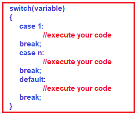
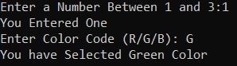

## **دستورات سوئیچ در سی شارپ به همراه مثال**

در این مقاله، قصد دارم در مورد **دستورات Switch در سی شارپ** با مثال صحبت کنم. در پایان این مقاله، شما متوجه خواهید شد که دستور Switch در سی شارپ چیست و چه زمانی و چگونه می‌توان از دستورات Switch در زبان سی شارپ با مثال استفاده کرد.

##### **دستورات سوئیچ در زبان سی شارپ:**

سوئیچ یک کلمه کلیدی در زبان سی شارپ است و با استفاده از این کلمه کلیدی سوئیچ می‌توانیم دستورات انتخاب با چندین بلوک ایجاد کنیم. و بلوک‌های چندگانه را می‌توان با استفاده از کلمه کلیدی case ساخت.

دستورات switch case در سی شارپ جایگزینی برای دستورات if else طولانی هستند که یک متغیر یا عبارت را با چندین مقدار مقایسه می‌کنند. دستور switch یک دستور انشعاب چند طرفه است، به این معنی که راهی آسان برای تغییر اجرا به قسمت‌های مختلف کد بر اساس مقدار عبارت فراهم می‌کند.

##### **چه زمانی باید از دستور switch استفاده کنیم؟**

وقتی چندین گزینه وجود دارد و ما مجبوریم فقط یک گزینه را از بین گزینه‌های موجود بسته به یک شرط واحد انتخاب کنیم، باید از دستور switch استفاده کنیم. بسته به گزینه انتخاب شده، یک کار خاص می‌تواند انجام شود.

##### **سینتکس دستورات Switch در زبان سی شارپ:**

در سی شارپ، دستور Switch یک دستور انشعاب چندراهه است. این دستور، روشی کارآمد برای انتقال اجرا به بخش‌های مختلف یک کد بر اساس مقدار عبارت ارائه می‌دهد. عبارت switch می‌تواند از نوع عدد صحیح مانند int، byte یا short، یا از نوع شمارشی، یا از نوع کاراکتری یا از نوع رشته‌ای باشد. عبارت برای حالات مختلف بررسی می‌شود و حالت منطبق اجرا خواهد شد. در ادامه، سینتکس استفاده از دستور switch case در زبان سی شارپ آمده است.



در سی شارپ، مقادیر تکراری برای حالت‌های مختلف (case) مجاز نیستند. بنابراین، می‌توانید دو دستور case با مقادیر یکسان ایجاد کنید. در صورت تلاش برای این کار، با خطای کامپایل مواجه خواهید شد.

بلوک پیش‌فرض در دستور switch اختیاری است. این بدان معناست که می‌توانید دستورات switch را با بلوک پیش‌فرض ایجاد کنید و بدون هیچ مشکلی اجرا شود.

ما باید از دستور break درون بلوک switch برای خاتمه دادن به اجرای دستور switch استفاده کنیم. این یعنی وقتی دستور break اجرا می‌شود، switch خاتمه می‌یابد و جریان کنترل به خط بعدی پس از دستور switch پرش می‌کند. دستور break اجباری است.

تو در تو کردن دستورات switch مجاز است، به این معنی که می‌توانید دستورات switch را درون یک switch دیگر داشته باشید. با این حال، دستورات switch تو در تو توسط مایکروسافت توصیه نمی‌شود. دلیل این امر این است که برنامه را پیچیده‌تر و خواناتر می‌کند.

##### **مثال برای درک دستور Switch در زبان سی شارپ:**

```csharp
using System;

namespace ControlFlowDemo
{
    class Program
    {
        static void Main(string[] args)
        {
            int x = 2;
            switch (x)
            {
                case 1:
                    Console.WriteLine("Choice is 1");
                    break;
                case 2:
                    Console.WriteLine("Choice is 2");
                    break;
                case 3:
                    Console.WriteLine("Choice is 3");
                    break;
                default:
                    Console.WriteLine("Choice other than 1, 2 and 3");
                    break;
            }
            Console.ReadKey();
        }
    }
}
```

**خروجی: انتخاب ۲ است**

پس از پایان هر بلوک case، لازم است یک دستور break وارد شود. اگر دستور break را وارد نکنیم، با خطای کامپایل مواجه خواهیم شد. اما می‌توانید چندین بلوک case را با یک دستور break ترکیب کنید، اگر و فقط اگر دستور case قبلی هیچ بلوک کدی نداشته باشد. برای درک بهتر، لطفاً به مثال زیر نگاهی بیندازید.

```csharp
using System;

namespace ControlFlowDemo
{
    class Program
    {
        static void Main(string[] args)
        {
            string str = "C#";
            switch (str)
            {
                case "C#":      
                case "Java":
                case "C":
                    Console.WriteLine("It’s a Programming Langauge");
                    break;

                case "MSSQL":
                case "MySQL":
                case "Oracle":
                    Console.WriteLine("It’s a Database");
                    break;

                case "MVC":
                case "WEB API":
                    Console.WriteLine("It’s a Framework");
                    break;

                default:
                    Console.WriteLine("Invalid Input");
                    break;
            }
            Console.ReadKey();
        }
    }
}
```

**خروجی:** **این یک زبان برنامه‌نویسی است**

##### **آیا بلوک پیش‌فرض در دستور Switch اجباری است؟**

خیر، بلوک پیش‌فرض در دستور switch اجباری نیست. اگر بلوک پیش‌فرض را قرار دهید و اگر هر یک از دستورات case اجرا نشوند، فقط بلوک پیش‌فرض اجرا خواهد شد. برای درک بهتر، لطفاً به مثال زیر که در آن بلوک پیش‌فرض نداریم، نگاهی بیندازید.

```csharp
using System;

namespace ControlFlowDemo
{
    class Program
    {
        static void Main(string[] args)
        {
            string str = "C#2";
            Console.WriteLine("Switch Statement Started");
            switch (str)
            {
                case "C#":      
                case "Java":
                case "C":
                    Console.WriteLine("It's a Programming Language");
                    break;

                case "MSSQL":
                case "MySQL":
                case "Oracle":
                    Console.WriteLine("It's a Database");
                    break;

                case "MVC":
                case "WEB API":
                    Console.WriteLine("It's a Framework");
                    break;
            }
            Console.WriteLine("Switch Statement Ended");
            Console.ReadKey();
        }
    }
}
```

###### **خروجی:**

**دستور سوئیچ شروع شد**  
**دستور Switch پایان یافت**

##### **چرا در سی شارپ از دستور Switch به جای دستور if-else استفاده می‌کنیم؟**

ما به جای دستورات if-else از دستور switch استفاده می‌کنیم زیرا یک دستور if-else فقط برای تعداد کمی از ارزیابی‌های منطقی یک مقدار کار می‌کند. اگر از یک دستور if-else برای تعداد بیشتری از شرایط ممکن استفاده کنید، نوشتن آن زمان بیشتری می‌برد و همچنین درک آن دشوار می‌شود. برای درک بهتر، لطفاً به مثال زیر نگاهی بیندازید. در اینجا، ما چندین شرط if-else نوشته‌ایم و در هر شرط، عبارت پیچیده‌ای را نوشته‌ایم که نه تنها شما را گیج می‌کند، بلکه درک آن نیز بسیار دشوار است.

```csharp
using System;

namespace ControlFlowDemo
{
    class Program
    {
        static void Main(string[] args)
        {
            string category;

            // taking topic name
            string topic = "Inheritance";

            if ( topic.Equals("Introduction to C#") ||
                topic.Equals("Variables") ||
                topic.Equals("Data Types"))
            {
                category = "Basic";
            }

            else if (topic.Equals("Loops") ||
                topic.Equals("If ELSE Statements") ||
                topic.Equals("Jump Statements"))
            {
                category = "Control Flow";
            }

            else if (topic.Equals("Inheritance") ||
                topic.Equals("Polymorphism") ||
                topic.Equals("Abstraction") ||
                topic.Equals("Encapsulation"))
            {
                category = "OOPS Concept";
            }
            else
            {
                category = "Invalid";
            }

            Console.Write($"{topic} Category is {category}");
            Console.ReadKey();
        }
    }
}
```

**خروجی: رده وراثت، مفهوم OOPS است**

همانطور که در مثال بالا می‌بینید، کد زیاد طولانی نیست، اما خواندن آن پیچیده به نظر می‌رسد و نوشتن آن زمان بیشتری می‌برد. بنابراین، به جای استفاده از شرط‌های if-else، می‌توانیم از دستور switch نیز برای صرفه‌جویی در زمان استفاده کنیم که فهم آن نیز آسان‌تر است زیرا استفاده از دستور switch خوانایی کد را بهبود می‌بخشد. بیایید مثال قبلی را با استفاده از دستور Switch به زبان C# بازنویسی کنیم.

```csharp
using System;

namespace ControlFlowDemo
{
    class Program
    {
        static void Main(string[] args)
        {
            string category;

            // taking topic name
            string topic = "Inheritance";

            // using switch Statement
            switch (topic)
            {
                case "Introduction to C#":
                case "Variables":
                case "Data Types":
                    category = "Basic";
                    break;
                case "Loops":
                case "If ELSE Statements":
                case "Jump Statements":
                    category = "Control Flow";
                    break;
                case "Inheritance":
                case "Polymorphism":
                case "Abstraction":
                case "Encapsulation":
                    category = "OOPS Concept";
                    break;
                // default case 
                default:
                    category = "Invalid";
                    break;
            }

            Console.Write($"{topic} Category is {category}");
            Console.ReadKey();
        }
    }
}
```

**خروجی: رده وراثت، مفهوم OOPS است**

##### **دستور سوئیچ تو در تو در سی شارپ:**

هر زمان که یک دستور switch را درون یک دستور switch دیگر ایجاد کنیم، به آن دستور switch تو در تو گفته می‌شود و این در C# مجاز است. برای درک این مفهوم، مثالی را بررسی می‌کنیم.

```csharp
using System;

namespace ControlFlowDemo
{
    class Program
    {
        static void Main(string[] args)
        {
            //Ask the user to enter a number between 1 and 3
            Console.Write("Enter a Number Between 1 and 3:");
            int number = Convert.ToInt32(Console.ReadLine());

            //outer Switch Statement
            switch (number)
            {
                case 1:
                    Console.WriteLine("You Entered One");
                    //Ask the user to enter the character R, B, or G
                    Console.Write("Enter Color Code (R/G/B): ");
                    char color = Convert.ToChar(Console.ReadLine());

                    //Inner Switch Statement
                    switch (Char.ToUpper(color))
                    {
                        case 'R':
                            Console.WriteLine("You have Selected Red Color");
                            break;
                        case 'G':
                            Console.WriteLine("You have Selected Green Color");
                            break;
                        case 'B':
                            Console.WriteLine("You have Selected Blue Color");
                            break;
                        default:
                            Console.WriteLine($"You Have Enter Invalid Color Code: {Char.ToUpper(color)}");
                            break;
                    }
                    break;

                case 2:
                    Console.WriteLine("You Entered Two");
                    break;

                case 3:
                    Console.WriteLine("You Entered Three");
                    break;
                default:
                    Console.WriteLine("Invalid Number");
                    break;
            }

            Console.ReadLine();
        }
    }
}
```

###### **خروجی:**



**نکته:** اگرچه استفاده از دستور switch تو در تو مجاز است، اما مایکروسافت استفاده از دستور switch تو در تو را توصیه نمی‌کند. دلیل این امر این است که دستور switch تو در تو، کد شما را پیچیده‌تر و خواناتر می‌کند.

اگرچه دستور switch باعث می‌شود کد نسبت به دستور if…else if تمیزتر به نظر برسد، اما switch محدود به کار با انواع داده‌های محدودی است. دستور switch در C# فقط با موارد زیر کار می‌کند:

1. **انواع داده‌های اولیه: bool، char و integer**
2. **انواع شمارشی (Enum)**
3. **کلاس رشته**
4. **انواع تهی‌پذیر از انواع داده فوق**