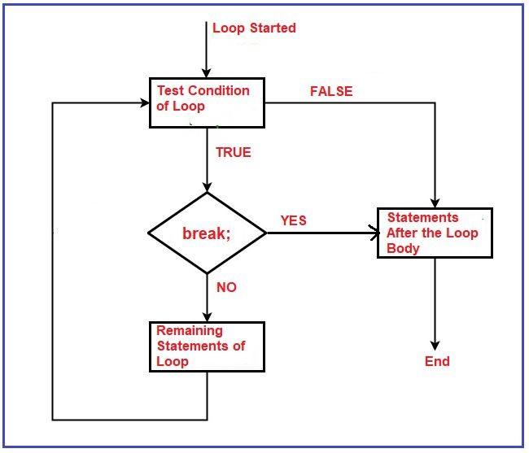
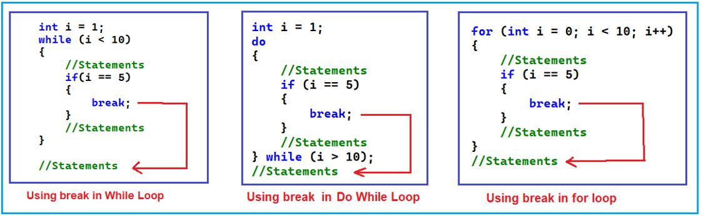
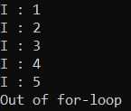
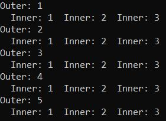
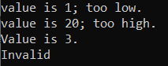

## **دستور break در سی شارپ به همراه مثال**

در این مقاله، قصد دارم **دستور Break را در زبان C#** با مثال بررسی کنم.. قبل از درک دستور Break، در این مقاله، ابتدا در مورد اینکه دستورات Jump چه هستند و چه زمانی و چگونه می‌توان از دستورات Jump در زبان C# استفاده کرد، بحث خواهم کرد و سپس در مورد دستورات Break با مثال بحث خواهم کرد.

##### **دستورات پرش در زبان سی شارپ چیست؟**

دستورات پرش در سی شارپ برای انتقال کنترل از یک نقطه یا مکان یا دستور به نقطه یا مکان یا دستور دیگر در برنامه به دلیل وجود شرایط خاص هنگام اجرای برنامه استفاده می‌شوند.

دستورات پرش در زبان سی شارپ برای تغییر رفتار دستورات شرطی (if، else، switch) و تکراری (for، while و do-while) استفاده می‌شوند. دستورات پرش به ما این امکان را می‌دهند که از یک حلقه خارج شویم و تکرار بعدی را شروع کنیم، یا به طور صریح کنترل برنامه را به مکان مشخصی در برنامه خود منتقل کنیم. سی شارپ از دستورات پرش زیر پشتیبانی می‌کند:

1. **استراحت**
2. **ادامه**
3. **رفتن به**
4. **return (در بخش تابع، دستور return را بررسی خواهیم کرد)**
5. **throw (در بخش مدیریت خطاها، دستور throw را بررسی خواهیم کرد)**

##### **دستور break در زبان سی شارپ:**

در سی شارپ، break یک کلمه کلیدی است. با استفاده از دستور break می‌توانیم بدنه حلقه یا بدنه switch را خاتمه دهیم. مهمترین نکته‌ای که باید در نظر داشته باشید این است که استفاده از دستور break اختیاری است، اما اگر می‌خواهید از آن استفاده کنید، باید دستور break را یا در بدنه حلقه یا در بدنه switch قرار دهید.

حال، سوال این است که چه زمانی باید از دستور break استفاده کنیم؟ پاسخ این است که وقتی حداکثر تعداد تکرار یک حلقه را می‌دانیم، اما اگر شرطی وجود داشته باشد که نیاز به خاتمه دادن به بدنه حلقه داشته باشیم، باید از دستور break استفاده کنیم. ما قبلاً در مورد استفاده از دستور break در switch case بحث کرده‌ایم. در C#، هر دستور case باید با یک دستور break خاتمه یابد، در غیر این صورت با خطای زمان کامپایل مواجه خواهیم شد. وقتی دستور break با یک بلوک case اجرا می‌شود، بلوک switch را خاتمه می‌دهد.

این یعنی دستور Break در سی شارپ راهی آسان برای خروج فوری از یک حلقه (For، While، Do While، Foreach) یا دستور Switch Case فراهم می‌کند. دستور break بلافاصله پس از مواجهه با حلقه، آن را خاتمه می‌دهد. دستور break تقریباً همیشه با دستور if…else در داخل بدنه حلقه استفاده می‌شود. اگر در حال حاضر این موضوع برایتان واضح نیست، نگران نباشید، ما این موارد را در مثال‌های متعدد توضیح خواهیم داد.

**نحو: break;**

##### **فلوچارت دستور break:**



وقتی با دستور break درون بدنه حلقه یا بدنه سوئیچ مواجه می‌شود، بلافاصله اجرای حلقه و سوئیچ را خاتمه می‌دهد و دستوراتی را که بعد از بدنه حلقه یا بدنه سوئیچ وجود دارند اجرا می‌کند. اما اگر دستور break اجرا نشود، دستوراتی که بعد از دستور break وجود دارند اجرا می‌شوند و سپس اجرای آن با تکرار بعدی حلقه ادامه می‌یابد. اگر در حال حاضر این موضوع برایتان واضح نیست، نگران نباشید، ما این را با مثال‌های متعدد درک خواهیم کرد.

##### **دستور break در زبان سی شارپ چگونه کار می‌کند؟**

در دستور شرطی switch case، نحوه استفاده از دستور break را مورد بحث قرار دادیم. حال، بیایید نحوه استفاده از دستور break درون حلقه و نحوه عملکرد دقیق دستور break در C# را درک کنیم. برای درک این موضوع، لطفاً به تصویر زیر نگاهی بیندازید. در اینجا، نحوه استفاده از دستور break درون حلقه‌های do while، while. و for و نحوه عملکرد دقیق دستور break را نشان می‌دهم.



اگر به کد بالا توجه کرده باشید، ما دستور شرطی if را داخل بدنه حلقه نوشته‌ایم و درون بلوک شرط if، دستور break را نوشته‌ایم. بنابراین، وقتی حلقه اجرا می‌شود، در هر تکرار، شرط if بررسی می‌شود و اگر شرط نادرست باشد، دستوراتی که بعد از بلوک if وجود دارند اجرا می‌شوند و تکرار بعدی ادامه می‌یابد. حال، وقتی شرط if درست باشد چه اتفاقی می‌افتد؟ به محض اینکه شرط if به true ارزیابی شود، بلوک if اجرا می‌شود و به محض اینکه دستور break درون بلوک if اجرا شود، بلافاصله حلقه خاتمه می‌یابد و دستوراتی که بعد از بلوک حلقه وجود دارند اجرا می‌شوند.

##### **مثال برای درک دستور break در زبان سی شارپ:**

در مثال زیر، شرطی را برای اجرای حلقه 10 بار، یعنی با شروع از مقدار I از 1 تا 10، تعیین کرده‌ایم. اما نیاز ما این است که وقتی مقدار I برابر با 5 شد، حلقه را خاتمه دهیم. در این حالت، باید شرط if را درون بدنه حلقه بنویسیم و بررسی کنیم که آیا مقدار I فعلی برابر با 5 است یا خیر. اگر برابر با 5 نباشد، اجرای حلقه for را ادامه داده و تکرار بعدی را اجرا می‌کنیم. اما اگر مقدار I برابر با 5 باشد، شرط if مقدار true را برمی‌گرداند و در این صورت، دستور break اجرا می‌شود و پس از اجرای دستور break، بلافاصله بدنه حلقه خاتمه می‌یابد. بنابراین، دستور بعدی که پس از بدنه حلقه وجود دارد، اجرا خواهد شد.

```csharp
using System;

namespace JumpStatementDemo
{
    class Program
    {
        static void Main(string[] args)
        {
            for (int i = 1; i <= 10; i++)
            {
                Console.WriteLine($"I : {i}");
                if (i == 5)
                {
                    break;
                }
            }
            Console.WriteLine("Out of for-loop");

            Console.ReadKey();
        }
    }
}
```

###### **خروجی:**



##### **دستور break در سی شارپ با حلقه داخلی:**

دستور break در سی شارپ، نزدیکترین دستور تکرار در برگیرنده (for، for each، while یا do loop) یا دستور switch را خاتمه می‌دهد. اگر دستور break را درون حلقه تو در تو، یعنی درون حلقه داخلی قرار دهیم، آنگاه دستور break فقط درونی‌ترین حلقه‌ای که شامل آن است را خاتمه می‌دهد.

برای درک بهتر، لطفاً به مثال زیر نگاهی بیندازید. در اینجا، حلقه بیرونی ۵ بار اجرا خواهد شد. باز هم، برای هر تکرار حلقه بیرونی، شرط حلقه داخلی for را طوری نوشته‌ایم که ۵ بار اجرا شود. اما، در داخل بدنه حلقه داخلی، دستور break را با استفاده از شرط if نوشته‌ایم و وقتی مقدار داخلی برابر با ۳ باشد، حلقه داخلی را می‌شکند.

```csharp
using System;

namespace JumpStatementDemo
{
    class Program
    {
        static void Main(string[] args)
        {
            for (int outer = 1; outer <= 5; outer++)
            {
                Console.WriteLine($"Outer: {outer}");
                for (int inner = 1; inner <= 5; inner++)
                {
                    if (inner > 3)
                    {
                        break;
                    }
                    Console.Write($"  Inner: {inner}");
                }
                Console.WriteLine();
            }

            Console.ReadKey();
        }
    }
}
```

نکته‌ای که باید به خاطر داشته باشید این است که دستور break فقط بدنه حلقه داخلی را خاتمه می‌دهد. پس از خاتمه حلقه داخلی، اجرای بدنه حلقه بیرونی ادامه می‌یابد و همچنین با اجرای تکرار بعدی حلقه بیرونی ادامه می‌یابد. با اجرای کد بالا، خروجی زیر را دریافت خواهید کرد.



##### **دستور break به همراه دستورات حلقه و سوئیچ در سی شارپ:**

وقتی از دستور switch درون یک حلقه استفاده می‌کنیم، دستور break در انتهای بخش switch، کنترل‌ها را فقط از دستور switch خارج می‌کند، نه از دستور حلقه. حلقه‌ای که شامل دستور switch است، تحت تأثیر قرار نمی‌گیرد. برای درک بهتر، لطفاً به مثال زیر نگاهی بیندازید.

```csharp
using System;

namespace JumpStatementDemo
{
    class Program
    {
        static void Main(string[] args)
        {
            double[] measurements = { 1, 20, 3, double.NaN };
            foreach (double measurement in measurements)
            {
                switch (measurement)
                {
                    case 1:
                        Console.WriteLine($"value is {measurement}; too low.");
                        break;

                    case 20:
                        Console.WriteLine($"value is {measurement}; too high.");
                        break;

                    case double.NaN:
                        Console.WriteLine("Invalid");
                        break;

                    default:
                        Console.WriteLine($"Value is {measurement}.");
                        break;
                }
            }
            Console.ReadKey();
        }
    }
}
```

###### **خروجی:**



**نکته:** به طور کلی، باید استفاده از دستور break در حلقه‌ها را به حداقل برسانیم. دستور switch در این زمینه یک استثنا است که در آن لازم است بعد از هر case از "دستور break" استفاده شود. در غیر این صورت، ممکن است خطای منطقی رخ دهد. هنگام نوشتن حلقه‌ها، باید سعی کنیم حلقه‌ها را با تست شرط اجرا کنیم و از "دستور break" اجتناب کنیم.

##### **چند سوال چالش برانگیز مربوط به دستور Break در سی شارپ:**

###### **سوال ۱: خروجی برنامه زیر چه خواهد بود؟**

```csharp
using System;

namespace JumpStatementDemo
{
    class Program
    {
        static void Main(string[] args)
        {
            int a = 1;
            while (a <= 10)
            {
                Console.Write($"{a} ");
                if (a > 3)
                    break;
                a++;
            }

            Console.ReadKey();
        }
    }
}
```

**خروجی: ۱ ۲ ۳ ۴**

دلیل این امر این است که هر زمان مقدار a برابر با ۴ شود، آنگاه شرط درست می‌شود و در آن صورت دستور break اجرا خواهد شد. هر زمان که دستور break اجرا شود، کنترل برنامه به طور خودکار به خارج از بدنه حلقه منتقل می‌شود.

###### **سوال ۲: خروجی برنامه زیر چه خواهد بود؟**

```csharp
using System;

namespace JumpStatementDemo
{
    class Program
    {
        static void Main(string[] args)
        {
            int a = 2;
            while (a <= 20)
            {
                Console.Write($"{a} ");
                a += 2;
                if (a >= 8)
                    break;
            }
            Console.ReadKey();
        }
    }
}
```

**خروجی: ۲ ۴ ۶**

###### **سوال ۳: خروجی برنامه زیر چه خواهد بود؟**

```csharp
using System;

namespace JumpStatementDemo
{
    class Program
    {
        static void Main(string[] args)
        {
            int a = 15;
            while (a >= 3)
            {
                a -= 2;
                Console.Write($"{a} ");
                if (a <= 9)
                    break;
            }

            Console.ReadKey();
        }
    }
}
```

**خروجی: ۱۳ ۱۱ ۹**

###### **سوال ۴: خروجی برنامه زیر چه خواهد بود؟**

```csharp
using System;

namespace JumpStatementDemo
{
    class Program
    {
        static void Main(string[] args)
        {
            int a = 15;
            while (a >= 5)
            {
                Console.Write($"{a} ");
                if (a <= 10) ;
                break;
                a -= 2;
            }

            Console.ReadKey();
        }
    }
}
```

**خروجی: ۱۵**

**نکته:** وقتی نقطه ویرگول (;) در انتهای خط قرار می‌گیرد، آنگاه به یک شرط ساختگی تبدیل می‌شود که دستور break مستقیماً خارج از شرط در حلقه قرار می‌گیرد.

###### **سوال ۵: خروجی برنامه زیر چه خواهد بود؟**

```csharp
using System;

namespace JumpStatementDemo
{
    class Program
    {
        static void Main(string[] args)
        {
            int a = 8;
            while (a <= 80) ;
            {
                Console.Write($"{a} ");
                if (a >= 20) ;
                break;
                a += 2;
            }

            Console.ReadKey();
        }
    }
}
```

**خروجی: خطا CS0139 هیچ حلقه‌ی محصوری برای خروج یا ادامه وجود ندارد**

**نکته:** وقتی نقطه ویرگول در انتهای while قرار می‌گیرد، حلقه به یک حلقه‌ی ساختگی تبدیل می‌شود. وقتی حلقه‌ی ساختگی ایجاد می‌شود، کامپایلر بدون هیچ دستوری یک بدنه‌ی جدید ایجاد می‌کند و بدنه‌ی فعلی به صورت outside درمی‌آید، بنابراین break به صورت خودکار به صورت outside درمی‌آید و همانطور که می‌دانیم نمی‌توانیم از break خارج از بدنه‌ی حلقه استفاده کنیم.