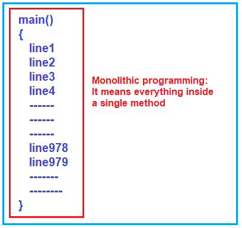
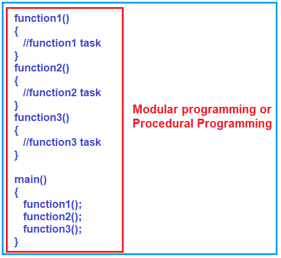
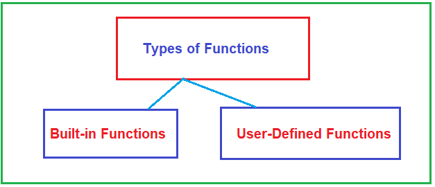
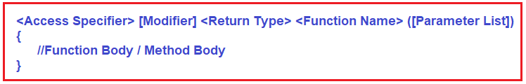
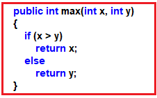
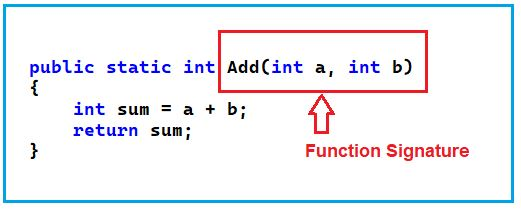
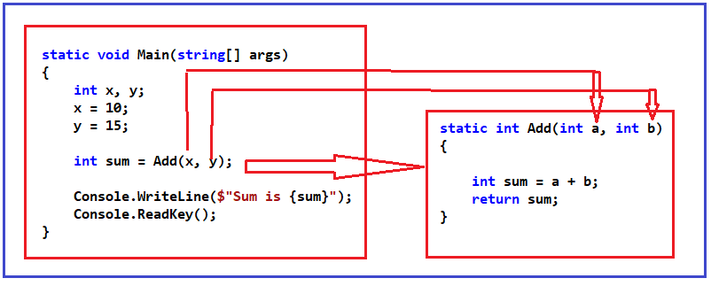
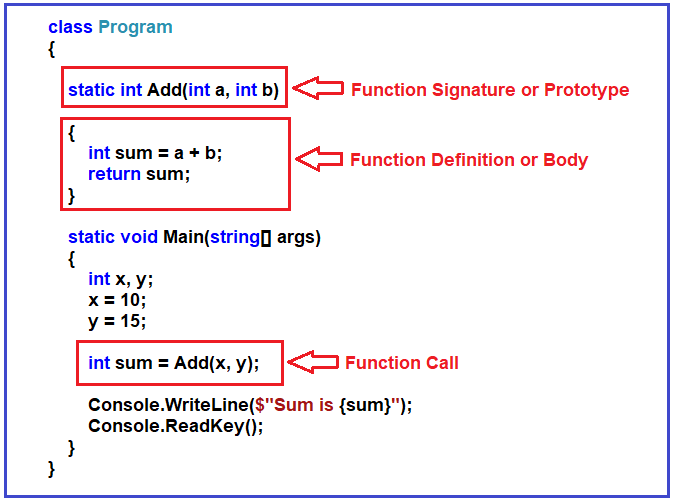
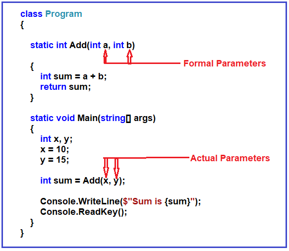
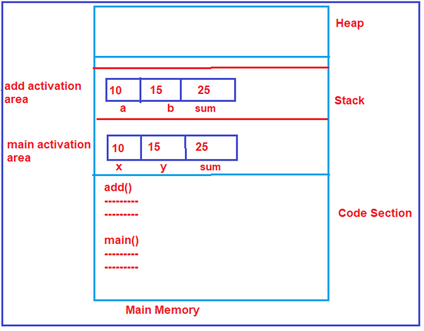

## **توابع در سی شارپ به همراه مثال**

در این مقاله، قصد دارم **توابع در سی شارپ را** با مثال بررسی کنم. در بخشی از این مقاله، شما خواهید فهمید که متدها چه هستند و چه نوع هستند و چگونه می‌توان توابع را در سی شارپ با مثال ایجاد و فراخوانی کرد.

##### **زبان سی شارپ چه وظایفی دارد؟**

یک تابع گروهی از دستورالعمل‌های مرتبط است که یک کار خاص را انجام می‌دهد. این کار می‌تواند کوچک یا بزرگ باشد، اما تابع آن کار را به طور کامل انجام می‌دهد. توابع ورودی‌هایی را به عنوان پارامتر دریافت می‌کنند و نتیجه را به عنوان مقدار بازگشتی برمی‌گردانند. اگر یک تابع بنویسیم، می‌توانیم چندین بار از آن تابع در برنامه استفاده کنیم. این بدان معناست که توابع به ما امکان می‌دهند بدون تایپ مجدد کد، از آن دوباره استفاده کنیم.

##### **چرا به توابع نیاز داریم؟**

بیایید با یک مثال بفهمیم که چرا به توابع نیاز داریم. توابع، ماژول یا روال نیز نامیده می‌شوند. به جای نوشتن یک برنامه اصلی واحد، یعنی همه چیز درون تابع اصلی، می‌توانیم تابع اصلی را به قطعات کوچک و قابل مدیریت تقسیم کنیم و وظایف تکراری یا وظایف کوچکتر را به عنوان یک تابع از هم جدا کنیم.

**برای مثال،** اگر یک برنامه بنویسیم و همه چیز را درون تابع main قرار دهیم، به چنین رویکرد برنامه‌نویسی، برنامه‌نویسی یکپارچه (Monolithic Programming) گفته می‌شود. اگر تابع main شما شامل هزاران خط کد باشد، مدیریت آن بسیار دشوار می‌شود. این در واقع یک رویکرد برنامه‌نویسی خوب نیست.



##### **مشکلات برنامه‌نویسی یکپارچه:**

1. **مشکل اول:** اگر در یک خط خطا وجود داشته باشد، این خطا در کل برنامه یا تابع اصلی (main function) رخ می‌دهد.
2. **مشکل دوم:** ما نمی‌توانیم ۱۰۰۰۰ خط کد را در یک ساعت یا یک روز تمام کنیم؛ ممکن است چند روز طول بکشد و ما باید در طول این مدت همه چیز را به خاطر بسپاریم. فقط در این صورت می‌توانیم تغییرات ایجاد کنیم یا خطوط جدیدی در برنامه بنویسیم. بنابراین، باید کل برنامه را حفظ کنیم.
3. **مشکل سوم:** چند نفر می‌توانند این یک تابع اصلی را بنویسند؟ فقط یک نفر می‌تواند بنویسد. ما نمی‌توانیم آن را به یک کار تیمی تبدیل کنیم و بیش از یک نفر نمی‌تواند روی یک تابع اصلی کار کند. بنابراین، کار را نمی‌توان در یک تیم توزیع کرد.
4. **مشکل چهارم:** وقتی این برنامه خیلی بزرگ می‌شود، ممکن است در بعضی از حافظه‌های کامپیوتر جا شود و ممکن است در بعضی از حافظه‌ها جا نشود. این بستگی به اندازه و سهم سخت‌افزاری کامپیوتری که در حال اجرا دارید، دارد.

بنابراین، اینها معدود مشکلاتی هستند که به دلیل برنامه‌نویسی یکپارچه ایجاد می‌شوند. یکپارچه به این معنی است که همه چیز یک واحد واحد است.

ما ترجیح می‌دهیم برنامه را به قطعات کوچک و قابل مدیریت و قطعات قابل استفاده مجدد تقسیم کنیم. مزیت این کار این است که می‌توانیم به صورت قطعه قطعه توسعه دهیم تا بتوانیم روی یک قطعه کد در یک زمان تمرکز کنیم. نکته دوم این است که قطعات را می‌توان بین تیم برنامه‌نویسان توزیع کرد و آنها می‌توانند برخی از قطعات را توسعه دهند و ما می‌توانیم آنها را با هم جمع کنیم و یک برنامه واحد بسازیم.

بنابراین، فرض کنید برنامه را به وظایف کوچک‌تر، یعنی به بسیاری از توابع کوچک‌تر، تقسیم کنیم و هر تابع یک کار خاص را انجام دهد. در این صورت، چنین نوع برنامه‌نویسی «برنامه‌نویسی ماژولار» یا «برنامه‌نویسی رویه‌ای» نامیده می‌شود و این رویکرد برای توسعه مناسب است.



همانطور که در تصویر بالا نشان داده شده است، تابع اول، یعنی function1()، یک کار خاص را انجام می‌دهد و تابع دیگر، یعنی function2()، یک کار دیگر را انجام می‌دهد و به همین ترتیب، function3() ممکن است یک کار را انجام دهد. بنابراین، به این ترتیب، می‌توانیم کار بزرگتر را به کارهای ساده‌تر و کوچکتر تقسیم کنیم و سپس می‌توانیم همه آنها را با هم در داخل تابع اصلی استفاده کنیم.

در رویکرد برنامه‌نویسی ماژولار، می‌توانید برنامه را به وظایف کوچک‌تر تقسیم کنید، روی وظایف کوچک‌تر تمرکز کنید، آنها را به پایان برسانید و آنها را بی‌نقص کنید. توسعه برنامه برای یک فرد آسان است، حتی اگر بتوانید این پروژه نرم‌افزاری را به تیمی از برنامه‌نویسان تقسیم کنید که در آن هر برنامه‌نویس روی یک یا چند وظیفه کوچک‌تر تمرکز کند.

این رویکرد برنامه‌نویسی به سبک ماژولار، بهره‌وری و همچنین قابلیت استفاده مجدد را افزایش داده است. برای مثال، اگر می‌خواهید منطق تابع function2 سه بار در داخل متد main اجرا شود، باید function2 را سه بار فراخوانی کنید. این بدان معناست که ما از منطق تعریف شده در تابع 2 دوباره استفاده می‌کنیم. به این قابلیت استفاده مجدد می‌گویند.

##### **انواع توابع در سی شارپ:**

اساساً، دو نوع تابع در سی شارپ وجود دارد. آنها به شرح زیر هستند:

1. توابع داخلی
2. توابع تعریف شده توسط کاربر



**نکته:** تابعی که از قبل در چارچوب تعریف شده و برای استفاده توسط توسعه‌دهنده یا برنامه‌نویس در دسترس است، تابع داخلی (Built-in function) نامیده می‌شود، در حالی که اگر تابع توسط توسعه‌دهنده یا برنامه‌نویس به صراحت تعریف شود، تابع تعریف‌شده توسط کاربر (User-defined function) نامیده می‌شود.

##### **مزایای استفاده از توابع کتابخانه استاندارد در زبان سی شارپ:**

1. یکی از مهمترین دلایلی که باید از توابع کتابخانه‌ای یا توابع داخلی استفاده کنید، صرفاً به این دلیل است که آنها کار می‌کنند. این توابع داخلی یا توابع از پیش تعریف شده، مراحل آزمایش متعددی را پشت سر گذاشته‌اند و استفاده از آنها آسان است.
2. توابع داخلی برای عملکرد بهینه شده‌اند. بنابراین، با توابع داخلی عملکرد بهتری خواهید داشت. از آنجایی که این توابع، توابع «کتابخانه استاندارد» هستند، یک گروه اختصاصی از توسعه‌دهندگان دائماً روی آنها کار می‌کنند تا آنها را بهتر کنند.
3. این باعث صرفه‌جویی در زمان توسعه می‌شود. توابع عمومی مانند چاپ روی صفحه، محاسبه جذر و بسیاری موارد دیگر از قبل نوشته شده‌اند. نباید نگران ایجاد مجدد آنها باشید. باید از آنها استفاده کنید و در زمان خود صرفه‌جویی کنید.

##### **مثال برای درک توابع داخلی سی شارپ:**

در مثال زیر، ما از تابع داخلی WriteLine برای چاپ خروجی در پنجره کنسول و از تابع داخلی Sqrt برای بدست آوردن جذر یک عدد داده شده استفاده می‌کنیم.

```csharp
using System;

namespace FunctionDemo
{
    class Program
    {
        static void Main(string[] args)
        {
            int number = 25;
            double squareRoot = Math.Sqrt(number);
            Console.WriteLine($"Square Root of {number} is {squareRoot}");
            Console.ReadKey();
        }
    }
}
```

**خروجی: جذر عدد ۲۵ برابر با ۵ است**

##### **محدودیت‌های توابع از پیش تعریف شده در زبان سی شارپ چیست؟**

تمام توابع از پیش تعریف شده در سی شارپ فقط شامل وظایف محدودی هستند، یعنی اینکه تابع برای چه منظوری طراحی شده است و برای همان منظور باید استفاده شود. بنابراین، هر زمان که یک تابع از پیش تعریف شده نیازهای ما را پشتیبانی نکند، باید به سراغ توابع تعریف شده توسط کاربر برویم.

##### **توابع تعریف شده توسط کاربر در زبان سی شارپ چیست؟**

توابع تعریف‌شده توسط کاربر در سی‌شارپ، توابعی هستند که توسط برنامه‌نویس ایجاد می‌شوند تا بتواند بارها از آنها استفاده کند. این کار پیچیدگی یک برنامه بزرگ را کاهش می‌دهد و کد را بهینه می‌کند. سی‌شارپ به شما امکان می‌دهد توابع را بر اساس نیاز خود تعریف کنید. تابعی که بدنه آن توسط توسعه‌دهنده یا کاربر پیاده‌سازی می‌شود، تابع تعریف‌شده توسط کاربر نامیده می‌شود.

طبق الزامات مشتری یا پروژه، توابعی که ما توسعه می‌دهیم، توابع تعریف‌شده توسط کاربر نامیده می‌شوند. توابع تعریف‌شده توسط کاربر، همیشه توابع مختص مشتری یا توابع مختص پروژه هستند. به عنوان یک برنامه‌نویس، ما کنترل کامل توابع تعریف‌شده توسط کاربر را داریم. به عنوان یک برنامه‌نویس، در صورت لزوم می‌توان رفتار هر تابع تعریف‌شده توسط کاربر را تغییر داد یا اصلاح کرد، زیرا بخش کدنویسی در دسترس است.

##### **مزایای توابع تعریف شده توسط کاربر در سی شارپ:**

1. کد برنامه برای درک، نگهداری و اشکال‌زدایی آسان‌تر خواهد بود.
2. ما می‌توانیم کد را یک بار بنویسیم، و می‌توانیم از کد در جاهای مختلف دوباره استفاده کنیم، یعنی قابلیت استفاده مجدد از کد.
3. کاهش حجم برنامه. با قرار دادن کد تکراری در یک تابع، حجم کد برنامه کاهش می‌یابد.

##### **چگونه یک تابع تعریف شده توسط کاربر در سی شارپ ایجاد کنیم؟**

بیایید ببینیم چگونه یک تابع را در سی شارپ بنویسیم. اول از همه، تابع باید یک **نام** داشته باشد که اجباری است. سپس باید یک **لیست پارامتر** داشته باشد که اختیاری است؛ در نهایت تابع باید یک **نوع بازگشتی** داشته باشد که اجباری است. یک تابع می‌تواند یک مشخص‌کننده دسترسی داشته باشد که اختیاری است و یک اصلاح‌کننده که آن هم اختیاری است. برای درک بهتر، لطفاً به تصویر زیر نگاهی بیندازید.



اینجا،

1. **نام تابع:** اجباری است و نام متد یا تابع را تعریف می‌کند. امضای متد شامل نام متد و لیست پارامترها است. متدها با نامشان شناسایی می‌شوند. قوانین مربوط به نام‌گذاری توابع مشابه قوانین مربوط به نام‌گذاری متغیرها است. همان قوانینی را که باید برای نام‌گذاری توابع نیز رعایت کنید.
2. **لیست پارامترها:** اختیاری است و لیست پارامترها را تعریف می‌کند. تابعی که می‌تواند 0 یا بیشتر پارامتر بگیرد، ممکن است هیچ ورودی‌ای نگیرد.
3. **نوع بازگشتی:** اجباری است و مقدار نوع بازگشتی متد را تعریف می‌کند. یک تابع ممکن است مقداری را برگرداند یا برنگرداند، اما حداکثر می‌تواند یک مقدار را برگرداند. نمی‌تواند چندین مقدار را برگرداند اما می‌تواند چندین مقدار را به عنوان پارامتر بپذیرد. اگر تابع هیچ مقداری را برنگرداند، نوع بازگشتی باید void باشد.
4. **تعیین‌کننده‌ی دسترسی:** اختیاری است و محدوده‌ی متد را تعریف می‌کند. به این معنی که میزان دسترسی به متد، مانند خصوصی، محافظت‌شده، عمومی و غیره را تعریف می‌کند.
5. **اصلاح‌کننده:** اختیاری است و نوع دسترسی متد را تعریف می‌کند. برای مثال، static، virtual، partial، sealed و غیره. اگر متد را با یک اصلاح‌کننده static تعریف کنید، می‌توانید مستقیماً و بدون ایجاد نمونه به آن دسترسی داشته باشید. اگر متد را با اصلاح‌کننده sealed تعریف کنید، این متد تحت کلاس فرزند بازنویسی (override) نخواهد شد. و اگر متد را با اصلاح‌کننده partial تعریف کنید، می‌توانید تعریف متد را به دو بخش تقسیم کنید.
6. **بدنه تابع:** بدنه تابع، کد یا لیستی از دستوراتی را که برای اجرای فراخوانی تابع نیاز دارید، تعریف می‌کند. این بدنه درون آکولاد قرار می‌گیرد.

**نکته:** Access Specifierها و Modifierها یکسان نیستند. Method و Function هر دو یکسان هستند، بنابراین می‌توانیم از اصطلاح Method و Function به جای یکدیگر استفاده کنیم.

##### **مثال برای ایجاد تابع تعریف شده توسط کاربر در سی شارپ:**



در مثال بالا،  
**public** مشخص کننده دسترسی است.  
**int است.** نوع بازگشتی  
**max** نام متد است  
**(int x, int y)** لیست پارامترها است  
و این روش هیچ اصلاح کننده ای ندارد.

##### **امضای تابع (Function Signature) در سی شارپ چیست؟**

در زبان برنامه‌نویسی سی‌شارپ، **امضای متد** از دو چیز تشکیل شده است، یعنی **نام متد** و **لیست پارامترها**. نوع بازگشتی بخشی از امضای متد محسوب نمی‌شود. بعداً در مورد اینکه چرا نوع بازگشتی بخشی از امضای متد محسوب نمی‌شود، بحث خواهیم کرد.

###### **مثال برای درک امضای تابع در سی شارپ:**



##### **دستور return در سی شارپ چیست؟**

دستور return اجرای یک تابع را بلافاصله خاتمه می‌دهد و کنترل را به تابع فراخوانی‌کننده برمی‌گرداند. اجرا در تابع فراخوانی‌کننده، بلافاصله پس از فراخوانی، از سر گرفته می‌شود. دستور return همچنین می‌تواند مقداری را به تابع فراخوانی‌کننده برگرداند. دستور return باعث می‌شود تابع شما خارج شود و مقداری را به فراخوانی‌کننده‌اش برگرداند. به طور کلی، تابع ورودی‌ها را می‌گیرد و مقداری را برمی‌گرداند. دستور return زمانی استفاده می‌شود که یک تابع آماده است تا مقداری را به فراخوانی‌کننده‌اش برگرداند.

##### **چگونه یک متد را در سی شارپ فراخوانی کنیم؟**

وقتی یک متد فراخوانی (فراخوانی) می‌شود، درخواستی برای انجام برخی اقدامات، مانند تنظیم مقدار، چاپ دستورات، انجام برخی محاسبات پیچیده، انجام برخی عملیات پایگاه داده، بازگرداندن برخی داده‌ها و غیره، ارسال می‌شود. کدی که برای فراخوانی یک متد نیاز داریم شامل نام متدی است که باید اجرا شود و هر داده‌ای که متد گیرنده نیاز دارد. داده‌های مورد نیاز برای یک متد در لیست پارامترهای متد مشخص شده است.

وقتی یک متد را فراخوانی می‌کنیم، کنترل به متد فراخوانی‌شده منتقل می‌شود. سپس متد فراخوانی‌شده، کنترل را تحت سه شرط زیر به متد فراخواننده (از جایی که متد را فراخوانی می‌کنیم) برمی‌گرداند.

1. وقتی دستور return اجرا می‌شود.
2. وقتی به متدی می‌رسد که به انتهای آکولاد ختم می‌شود.
3. وقتی استثنایی ایجاد می‌کند که در متد فراخوانی‌شده مدیریت نمی‌شود.

##### **مثال برای درک توابع در زبان سی شارپ:**

بیایید ببینیم چگونه می‌توان یک متد را در سی‌شارپ ایجاد و فراخوانی کرد. در مثال زیر، منطق جمع دو عدد و سپس چاپ نتیجه در پنجره کنسول را پیاده‌سازی کرده‌ایم و منطق را فقط درون متد اصلی نوشته‌ایم.

```csharp
using System;

namespace FunctionDemo
{
    class Program
    {
        static void Main(string[] args)
        {
            int x, y;
            x = 10;
            y = 15;
            int sum = x + y;
            Console.WriteLine($"Sum is {sum}");
            Console.ReadKey();
        }
    }
}
```

همانطور که در کد بالا مشاهده می‌کنید، ابتدا دو متغیر x و y را تعریف می‌کنیم و سپس این دو متغیر را به ترتیب با مقادیر ۱۰ و ۱۵ مقداردهی اولیه می‌کنیم. سپس این دو متغیر را جمع کرده و نتیجه را در متغیر دیگری به نام sum ذخیره می‌کنیم و در نهایت مقدار sum را در کنسول چاپ می‌کنیم که در خروجی قابل مشاهده است. بیایید ببینیم چگونه می‌توانیم همین برنامه را با استفاده از Function بنویسیم. برای درک بهتر، لطفاً به تصویر زیر نگاهی بیندازید.



همانطور که در تصویر بالا مشاهده می‌کنید، ما تابعی به نام Add ایجاد کرده‌ایم که دو پارامتر ورودی a و b از نوع عدد صحیح را دریافت می‌کند. این تابع Add دو عدد صحیح دریافتی را به عنوان پارامترهای ورودی با هم جمع می‌کند، نتیجه را در متغیر sum ذخیره می‌کند و نتیجه را برمی‌گرداند.

حالا تابع اصلی را ببینید. از تابع اصلی، ما تابع Add را فراخوانی می‌کنیم. هنگام فراخوانی تابع Add، دو پارامتر، یعنی x و y، را ارسال می‌کنیم (در واقع، مقادیر ذخیره شده در x و y را ارسال می‌کنیم). مقادیر این پارامترها به متغیرهای a و b می‌روند. سپس تابع Add این دو مقدار را جمع می‌کند و نتیجه را به تابع فراخوانی کننده (تابعی که متد Add از آن فراخوانی می‌شود)، یعنی متد Main، برمی‌گرداند. سپس تابع اصلی نتیجه حاصل از متد Add را در متغیر sum ذخیره می‌کند و نتیجه را در پنجره خروجی چاپ می‌کند.

##### **کد کامل مثال در زیر آمده است:**

```csharp
using System;

namespace FunctionDemo
{
    class Program
    {
        static void Main(string[] args)
        {
            int x, y;
            x = 10;
            y = 15;
            int sum = Add(x, y);
            Console.WriteLine($"Sum is {sum}");
            Console.ReadKey();
        }

        static int Add(int a, int b)
        {
            int sum = a + b;
            return sum;
        }
    }
}
```

##### **بخش‌های مختلف یک تابع در سی شارپ:**

برای درک بخش‌های مختلف یک تابع، لطفاً به تصویر زیر نگاه کنید.



##### **پارامترهای یک تابع چیست؟**

برای درک بهتر پارامترهای تابع، لطفاً به تصویر زیر نگاه کنید.



همانطور که در تصویر بالا مشاهده می‌کنید، ما دو مقدار x و y را به تابع Add ارسال می‌کنیم که دو پارامتر (a و b) می‌گیرد. پارامترهای (x و y) که به تابع Add ارسال می‌کنیم، پارامترهای واقعی (Actual Parameters) نامیده می‌شوند. پارامترهای (a و b) که توسط متد Add دریافت می‌شوند، پارامترهای رسمی (Formal Parameters) نامیده می‌شوند. وقتی متد Add را فراخوانی می‌کنیم، مقادیر پارامترهای واقعی در پارامترهای رسمی کپی می‌شوند. بنابراین، مقدار x، یعنی ۱۰، در a و مقدار y، یعنی ۱۵، در b کپی می‌شوند.

##### **چگونه درون حافظه اصلی کار می‌کند؟**

وقتی برنامه شروع می‌شود، یعنی وقتی متد اصلی اجرای خود را آغاز می‌کند، سه متغیر (x، y و sum) درون پشته، یعنی درون ناحیه فعال‌سازی تابع اصلی، تعریف می‌شوند. سپس به x و y به ترتیب مقادیر 10 و 15 اختصاص داده می‌شود. و سپس، متد اصلی متد Add را فراخوانی می‌کند. پس از فراخوانی متد Add، ناحیه فعال‌سازی مخصوص به آن درون پشته ایجاد می‌شود و متغیرهای مخصوص به خود را خواهد داشت، یعنی متغیرهای a، b و sum درون این ناحیه فعال‌سازی ایجاد می‌شوند. سپس مقدار x یعنی 10 و مقدار y یعنی 15 که به تابع Add ارسال می‌شوند، به ترتیب در متغیرهای a و b کپی می‌شوند. سپس متد Add دو عدد را جمع می‌کند و نتیجه 25 می‌شود که در متغیر sum ذخیره می‌شود و آن نتیجه، یعنی 25، از متد Add برگردانده می‌شود. نتیجه حاصل از متد Add در متغیر sum ذخیره می‌شود و در پنجره کنسول چاپ خواهد شد. برای درک بهتر، لطفاً به تصویر زیر نگاهی بیندازید.



بنابراین، این اتفاقی است که هنگام نوشتن توابع در حافظه اصلی می‌افتد. نکته دیگری که باید به خاطر داشته باشید این است که یک تابع نمی‌تواند به متغیرهای توابع دیگر دسترسی داشته باشد. امیدوارم اصول اولیه توابع در زبان سی شارپ را درک کرده باشید.