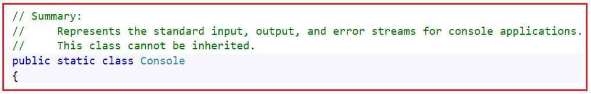
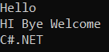
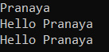
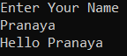
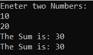
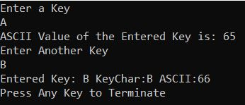
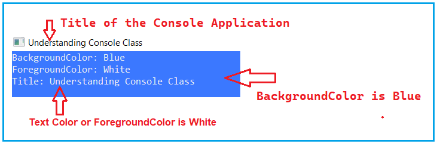
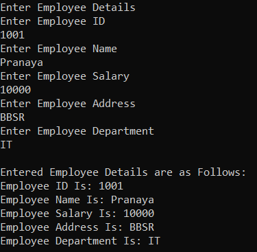
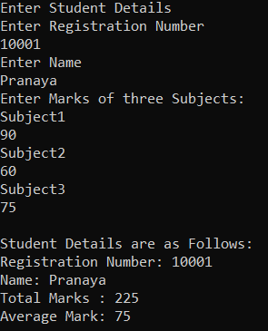

## **متدها و ویژگی‌های کلاس کنسول در سی شارپ**

در این مقاله، قصد دارم **متدها و ویژگی‌های کلاس Console در C# را** با مثال‌هایی مورد بحث قرار دهم.

1. **کلاس کنسول در سی شارپ چیست؟**
2. **ویژگی‌های کلاس کنسول در سی شارپ**
3. **متدهای کلاس کنسول در سی شارپ**
4. **آشنایی با کاربرد متدهای Write و WriteLine در سی شارپ**
5. **برنامه‌ای برای نمایش نحوه چاپ مقدار یک متغیر در یک برنامه کنسول.**
6. **آشنایی با نحوه‌ی استفاده از متدهای ReadLine، ReadKey و Read در زبان برنامه‌نویسی سی‌شارپ**
7. **برنامه‌ای برای نمایش استفاده از ویژگی‌های BackgroundColor، ForegroundColor و Title و متد Beep از کلاس Console.**

##### **کلاس کنسول در سی شارپ چیست؟**

به منظور پیاده‌سازی رابط کاربری در برنامه‌های کنسول، مایکروسافت کلاسی به نام Console را در اختیار ما قرار داده است. کلاس Console در فضای نام System موجود است. این کلاس Console متدها و ویژگی‌هایی را ارائه می‌دهد که با استفاده از آنها می‌توانیم رابط کاربری را در یک برنامه کنسول پیاده‌سازی کنیم.

به عبارت دیگر، اگر بخواهیم با پنجره کنسول کار کنیم، چه برای گرفتن ورودی از کاربر و چه برای نمایش خروجی، در سی شارپ به ما کنسول ارائه می‌شود.

طبق مستندات مایکروسافت، کلاس Console نشان‌دهنده‌ی جریان‌های ورودی، خروجی و خطای استاندارد برای برنامه‌های کنسول است و این کلاس را نمی‌توان به ارث برد زیرا یک کلاس استاتیک است، یعنی همانطور که در تصویر زیر نشان داده شده است، به صورت استاتیک اعلام شده است.



کلاس استاتیک در سی شارپ فقط شامل اعضای استاتیک است، یعنی تمام ویژگی‌ها و متدهای موجود در کلاس Console استاتیک هستند. بنابراین، می‌توانیم با استفاده از نام کلاس Console به همه این اعضا دسترسی داشته باشیم، یعنی برای دسترسی به این اعضا نیازی به نمونه کلاس Console نداریم.

##### **ویژگی‌های کلاس کنسول در سی شارپ:**

کلاس Console ویژگی‌های زیادی دارد. برخی از آنها به شرح زیر است:

1. **عنوان** : عنوانی را که قرار است در نوار عنوان کنسول نمایش داده شود، دریافت یا تنظیم می‌کند. رشته‌ای را که قرار است در نوار عنوان کنسول نمایش داده شود، برمی‌گرداند. حداکثر طول رشته عنوان ۲۴۵۰۰ کاراکتر است.
2. **BackgroundColor** : رنگ پس‌زمینه کنسول را دریافت یا تنظیم می‌کند. مقداری را برمی‌گرداند که رنگ پس‌زمینه کنسول را مشخص می‌کند؛ یعنی رنگی که پشت هر کاراکتر ظاهر می‌شود. مقدار پیش‌فرض مشکی است.
3. **ForegroundColor** : رنگ پیش‌زمینه کنسول را دریافت یا تنظیم می‌کند. این تابع یک ConsoleColor برمی‌گرداند که رنگ پیش‌زمینه کنسول را مشخص می‌کند؛ یعنی رنگ هر کاراکتری که نمایش داده می‌شود. مقدار پیش‌فرض خاکستری است.
4. **CursorSize** : ارتفاع مکان‌نما را در یک سلول کاراکتری دریافت یا تنظیم می‌کند. اندازه مکان‌نما را که به صورت درصدی از ارتفاع یک سلول کاراکتری بیان می‌شود، برمی‌گرداند. مقدار این ویژگی از ۱ تا ۱۰۰ متغیر است.

##### **متدهای کلاس کنسول در سی شارپ:**

متدهای زیادی در کلاس Console وجود دارد. برخی از آنها به شرح زیر هستند:

1. **Clear():** برای پاک کردن بافر کنسول و پنجره کنسول مربوطه از اطلاعات نمایش داده شده استفاده می‌شود. به عبارت ساده، برای پاک کردن صفحه نمایش استفاده می‌شود.
2. **Beep():** این متد صدای بوق را از طریق بلندگوی کنسول پخش می‌کند. این بدان معناست که در زمان اجرا، صدای بوق را با استفاده از بلندگوی کامپیوتر پخش می‌کند.
3. **ResetColor():** این متد برای تنظیم رنگ‌های پیش‌زمینه و پس‌زمینه کنسول به حالت پیش‌فرضشان استفاده می‌شود.
4. **Write(“string”):** این متد برای نوشتن مقدار رشته‌ای مشخص شده در جریان خروجی استاندارد استفاده می‌شود.
5. **WriteLine(“string”):** این متد برای نوشتن مقدار رشته مشخص شده، به دنبال آن پایان دهنده خط فعلی، در جریان خروجی استاندارد استفاده می‌شود. این بدان معناست که این متد مشابه متد write است اما پس از چاپ پیام، مکان نما را به طور خودکار به خط بعدی منتقل می‌کند.
6. **Write(variable):** این متد برای نوشتن مقدار متغیر داده شده در جریان خروجی استاندارد استفاده می‌شود.
7. **WriteLine(variable):** این متد برای نوشتن مقدار متغیر داده شده در جریان خروجی استاندارد به همراه انتقال مکان نما به خط بعدی پس از چاپ مقدار متغیر استفاده می‌شود.
8. **Read():** این متد یک کاراکتر واحد را از صفحه کلید می‌خواند و مقدار ASCII آن را برمی‌گرداند. نوع داده باید int باشد زیرا مقدار ASCII را برمی‌گرداند.
9. **ReadLine():** این متد یک مقدار رشته‌ای را از صفحه‌کلید می‌خواند و فقط مقدار وارد شده را برمی‌گرداند. از آنجایی که مقدار رشته‌ای وارد شده را برمی‌گرداند، نوع داده (DataType) نیز رشته‌ای خواهد بود.
10. **ReadKey():** این متد یک کاراکتر واحد را از صفحه کلید می‌خواند و اطلاعات آن کاراکتر مانند کلید وارد شده و مقدار ASCII متناظر آن را برمی‌گرداند. نوع داده باید ConsoleKeyInfo باشد که شامل اطلاعات کلید وارد شده است.

##### **مثالی برای نمایش نحوه‌ی استفاده از متدهای Write و WriteLine در سی شارپ:**

کد مثال زیر نیازی به توضیح ندارد، بنابراین لطفاً خطوط نظرات را مطالعه کنید.


``` csharp
//Program to show the use of WriteLine and Write Method
//First Import the System namespace as the
//Console class belongs to System namespace
using System;
namespace MyFirstProject
{
    internal class Program
    {
        static void Main(string[] args)
        {
            //We can access WriteLine and Write method using class name
            //as these methods are static

            //WriteLine Method Print the value and move the cursor to the next line
            Console.WriteLine("Hello");
            //Write Method Print the value and stay in the same line
            Console.Write("HI ");
            //Write Method Print the value and stay in the same line
            Console.Write("Bye ");
            //WriteLine Method Print the value and move the cursor to the next line
            Console.WriteLine("Welcome");
            //Write Method Print the value and stay in the same line
            Console.Write("C#.NET ");
            Console.ReadKey();
        }
    }
}
```

###### **خروجی:**



##### **مثالی برای نمایش نحوه چاپ مقدار یک متغیر در سی شارپ.**

در مثال زیر، روش‌های مختلف چاپ مقدار یک متغیر در زبان سی‌شارپ را نشان می‌دهم.


```csharp
//Program to show how to print the value of a variable 
using System;
namespace MyFirstProject
{
    internal class Program
    {
        static void Main(string[] args)
        {
            string name = "Pranaya";
            Console.WriteLine(name);
            Console.WriteLine("Hello " + name);
            Console.Write($"Hello {name}");
            Console.ReadKey();
        }
    }
}
```

###### **خروجی:**



##### **خواندن مقدار از کاربر در سی شارپ:**

حال، بیایید بفهمیم که چگونه می‌توان با استفاده از زبان C#، مقدار را از کاربر در یک برنامه کنسول خواند. در اینجا، ما از متد ReadLine() برای خواندن مقادیر در زمان اجرا استفاده خواهیم کرد. مثال زیر نحوه خواندن مقدار در زمان اجرا در یک برنامه کنسول در C# با استفاده از متد ReadLine را نشان می‌دهد.


```csharp
//Program to show how to read value at runtime
using System;
namespace MyFirstProject
{
    internal class Program
    {
        static void Main(string[] args)
        {
            //Giving one message to the user to enter his name
            Console.WriteLine("Enter Your Name");

            //ReadLine method reads a string value from the keyboard 
            string name = Console.ReadLine();

            //Printing the entered string in the console
            Console.WriteLine($"Hello {name}");
            Console.ReadKey();
        }
    }
}
```
###### **خروجی:**



##### **چگونه اعداد صحیح را در C# از کلمه کلیدی می‌خوانید؟**

هر زمان که با استفاده از متد ReadLine چیزی را چه رشته‌ای و چه عددی از کلمه کلیدی وارد کنیم، جریان ورودی آن را به عنوان یک رشته در نظر می‌گیرد. بنابراین، می‌توانیم مقادیر ورودی را مستقیماً در یک متغیر رشته‌ای ذخیره کنیم. اگر می‌خواهید مقادیر ورودی را در متغیرهای عدد صحیح ذخیره کنید، باید مقادیر رشته‌ای را به مقادیر عدد صحیح تبدیل کنیم. برای درک بهتر، لطفاً به مثال زیر نگاهی بیندازید. در اینجا، از کاربر می‌خواهیم دو عدد صحیح وارد کند و سپس آن اعداد صحیح را به عنوان رشته در نظر می‌گیریم و سپس رشته را به اعداد صحیح تبدیل می‌کنیم و سپس آن دو عدد صحیح را با هم جمع می‌کنیم و نتیجه را در پنجره کنسول نشان می‌دهیم.


```csharp
//Program to show how to read integer values
using System;
namespace MyFirstProject
{
    internal class Program
    {
        static void Main(string[] args)
        {
            Console.WriteLine("Eneter two Numbers:");

            //Converting string to Integer
            int Number1 = Convert.ToInt32(Console.ReadLine());

            //Converting string to Integer
            int Number2 = Convert.ToInt32(Console.ReadLine());

            int Result = Number1 + Number2;
            Console.WriteLine($"The Sum is: {Result}");
            Console.WriteLine($"The Sum is: {Number1 + Number2}");
            Console.ReadKey();
        }
    }
}
```
###### **خروجی:**



**نکته:** متد ReadLine همیشه مقدار را به شکل رشته می‌پذیرد. بنابراین، باید مقادیر را به نوع مناسب تبدیل کنیم. در مثال بالا، ما با استفاده از **متد Convert.ToInt** مقادیر را به نوع عدد صحیح تبدیل می‌کنیم . در مقالات بعدی به تفصیل در مورد این متد صحبت خواهیم کرد.

##### **مثال برای درک ReadKey و متد Read در سی شارپ:**

متد Read به شما امکان می‌دهد یک کاراکتر وارد کنید و مقدار ASCII آن کاراکتر را برمی‌گرداند. متد ReadKey همچنین به شما امکان می‌دهد یک کلید وارد کنید و اطلاعات کلید مانند کلیدی که فشار داده‌اید، مقدار ASCII آن کلید چیست و غیره را برمی‌گرداند. برای درک بهتر، لطفاً به مثال زیر نگاهی بیندازید.


```csharp
using System;
namespace MyFirstProject
{
    internal class Program
    {
        static void Main(string[] args)
        {
            Console.WriteLine("Enter a Key");
            int var1 = Console.Read();
            Console.WriteLine($"ASCII Value of the Entered Key is: {var1}");

            Console.WriteLine("Enter Another Key");
            ConsoleKeyInfo var2 = Console.ReadKey();
            Console.WriteLine($"\nEntered Key: {var2.Key} KeyChar:{var2.KeyChar} ASCII:{(int)var2.KeyChar}");

            Console.WriteLine("Press Any Key to Terminate");
            Console.ReadKey();
        }
    }
}
```
###### **خروجی:**



##### **مثال برای درک ویژگی‌های کلاس کنسول:**

حال، برنامه‌ای خواهیم نوشت که نحوه‌ی استفاده از ویژگی‌های BackgroundColor، ForegroundColor، Beep و Title کلاس Console در سی‌شارپ را نشان می‌دهد. ویژگی BackgroundColor رنگ پس‌زمینه‌ی کنسول و ویژگی ForegroundColor رنگ متن را تعیین می‌کند. ویژگی Title برای تنظیم عنوان برنامه‌ی Console و متد Beep برای ایجاد صدای بوق با استفاده از بلندگوی کامپیوتر استفاده می‌شود. برای درک بهتر، لطفاً به مثال زیر نگاهی بیندازید.


```csharp
//Program to show the use of Console Class Properties and Beep Method
using System;
namespace MyFirstProject
{
    internal class Program
    {
        static void Main(string[] args)
        {
            Console.BackgroundColor = ConsoleColor.Blue;
            Console.ForegroundColor = ConsoleColor.White;
            Console.Title = "Understanding Console Class";
            Console.WriteLine("BackgroundColor: Blue");
            Console.WriteLine("ForegroundColor: White");
            Console.WriteLine("Title: Understanding Console Class");

            //It will make Beep Sound
            Console.Beep();

            Console.ReadKey();
        }
    }
}
```

###### **خروجی:**



##### **مثال پیچیده برای درک کلاس کنسول:**

حالا، یک برنامه خواهیم نوشت که اطلاعات کارمند مانند EmployeeId، Name، Salary، Address و Department را دریافت کند و سپس اطلاعات پذیرفته شده را در پنجره کنسول چاپ کند.

```csharp
//Program to show the use of Console Class
using System;
namespace MyFirstProject
{
    internal class Program
    {
        static void Main(string[] args)
        {
            //Ask User to Enter the Employee Details
            Console.WriteLine("Enter Employee Details");

            Console.WriteLine("Enter Employee ID");
            int EmployeeID = Convert.ToInt32(Console.ReadLine());
            Console.WriteLine("Enter Employee Name");
            string Name = Console.ReadLine();
            Console.WriteLine("Enter Employee Salary");
            int Salary = Convert.ToInt32(Console.ReadLine());
            Console.WriteLine("Enter Employee Address");
            string Address = Console.ReadLine();
            Console.WriteLine("Enter Employee Department");
            string Department = Console.ReadLine();

            //Display the Entered Employee Details
            Console.WriteLine("\nEntered Employee Details are as Follows:");
            Console.WriteLine($"Employee ID Is: {EmployeeID}");
            Console.WriteLine($"Employee Name Is: {Name}");
            Console.WriteLine($"Employee Salary Is: {Salary}");
            Console.WriteLine($"Employee Address Is: {Address}");
            Console.WriteLine($"Employee Department Is: {Department}");
            Console.ReadKey();
        }
    }
}
```
###### **خروجی:**



##### **مثال برای نمایش نمره دانش‌آموز با استفاده از متدهای کلاس کنسول:**

برنامه‌ای بنویسید که شماره دانشجویی، نام، نمره ۱، نمره ۲، نمره ۳ را وارد کند و نمره کل و میانگین نمرات را محاسبه کند و سپس مشخصات دانشجو را در کنسول چاپ کند.


```csharp
using System;
namespace MyFirstProject
{
    internal class Program
    {
        static void Main(string[] args)
        {
            //Ask the user to Enter Student Details
            Console.WriteLine("Enter Student Details");
            Console.WriteLine("Enter Registration Number");
            int RegdNumber = Convert.ToInt32(Console.ReadLine());
            Console.WriteLine("Enter Name");
            string Name = Console.ReadLine();
            Console.WriteLine("Enter Marks of three Subjects:");
            Console.WriteLine("Subject1");
            int Mark1 = Convert.ToInt32(Console.ReadLine());
            Console.WriteLine("Subject2");
            int Mark2 = Convert.ToInt32(Console.ReadLine());
            Console.WriteLine("Subject3");
            int Mark3 = Convert.ToInt32(Console.ReadLine());

            int TotalMarks = Mark1 + Mark2 + Mark3;
            int AverageMark = TotalMarks / 3;

            //Display the Student Details
            Console.WriteLine("\nStudent Details are as Follows:");
            Console.WriteLine($"Registration Number: {RegdNumber}");
            Console.WriteLine($"Name: {Name}");
            Console.WriteLine($"Total Marks : {TotalMarks}");
            Console.WriteLine($"Average Mark: {AverageMark}");
            Console.ReadKey();
        }
    }
}
```

###### **خروجی:**

