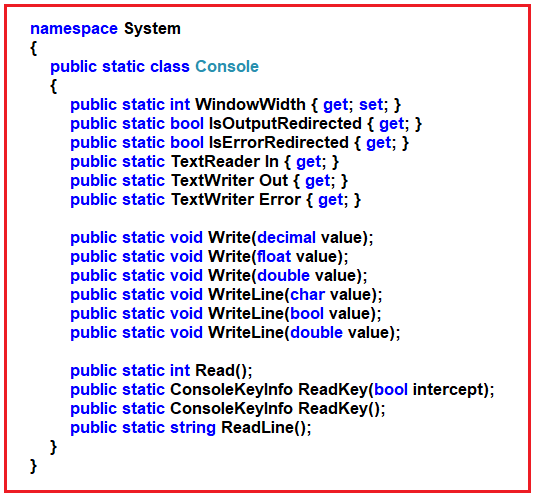
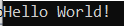
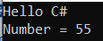
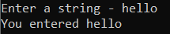
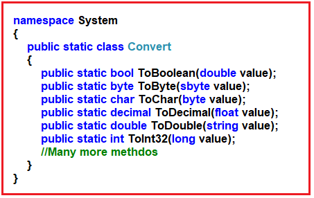
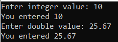

## **ورودی و خروجی کاربر در سی شارپ به همراه مثال**

در این مقاله، قصد دارم **ورودی و خروجی کاربر در سی شارپ را** با مثال‌هایی مورد بحث قرار دهم. در پایان این مقاله، شما نحوه دریافت ورودی از کاربر و نمایش خروجی به کاربران در برنامه کنسول سی شارپ را خواهید آموخت.

##### **کلاس کنسول در سی شارپ**

یک کلاس واقعاً مفید که ورودی کاربر را مدیریت می‌کند، کلاس Console نام دارد. کلاس Console در فضای نام "System" وجود دارد. بنابراین، ابتدا، این فضای نام System را به برنامه خود وارد می‌کنیم. همچنین بایت‌ها (از جریان ورودی) را با استفاده از مجموعه کاراکتر پیش‌فرض پلتفرم به کاراکتر تبدیل می‌کند. برای استفاده از کلاس Console، باید آن را در کد خود ارجاع دهید. این کار با کلمه کلیدی using انجام می‌شود.

**با استفاده از سیستم؛**

دستور **using System;** باید درست بالای دستور Class یا بالای namespace قرار گیرد: سینتکس آن در زیر آمده است.

```csharp
using System;

namespace FirstProgram
{
    class Program
    {
        static void Main(string[] args)
        {
        }
    }
}
```

**یا**

```csharp
namespace FirstProgram
{
    using System;
    class Program
    {
        static void Main(string[] args)
        {
        }
    }
}
```

این به کامپایلر سی شارپ می‌گوید که شما می‌خواهید از کلاس Console که در **فضای نام System** قرار دارد استفاده کنید. این کلاس Console تعدادی متد داخلی ارائه می‌دهد که می‌توانیم از آنها برای دریافت ورودی کاربر و همچنین چاپ خروجی در پنجره Console استفاده کنیم. اگر به تعریف کلاس Console بروید، خواهید دید که تمام متدها و ویژگی‌ها به صورت استاتیک تعریف شده‌اند. این بدان معناست که بدون ایجاد یک شیء، فقط با استفاده از نام کلاس می‌توانیم به اعضای کلاس Console دسترسی داشته باشیم.



##### **خروجی در سی شارپ:**

برای چاپ چیزی در کنسول، می‌توانیم از دو روش زیر استفاده کنیم.

**System.Console.WriteLine()**  
**System.Console.Write()**

در اینجا، System فضای نام، Console کلاس درون فضای نام System است، و WriteLine و Write متدهای استاتیک کلاس Console هستند. نسخه‌های overload شده‌ی زیادی از متدهای Write و WriteLine در Console وجود دارد. اجازه دهید در مورد آنها بحث کنیم.

##### **مثال‌هایی برای چاپ یک رشته در کنسول در سی شارپ**

بیایید یک مثال ساده برای چاپ یک رشته در پنجره کنسول در سی شارپ ببینیم.

```csharp
using System;

namespace FirstProgram
{
    class Program
    {
        static void Main(string[] args)
        {
            Console.WriteLine("Hello World!");
        }
    }
}
```

با اجرای کد بالا، خروجی زیر در کنسول نمایش داده می‌شود.



##### **تفاوت بین متد WriteLine() و Write() از کلاس Console در سی شارپ**

تفاوت اصلی بین متد WriteLine() و Write() از کلاس Console در C# این است که متد Write() فقط رشته‌ای که به آن ارائه شده را چاپ می‌کند، در حالی که متد WriteLine() رشته را چاپ کرده و به ابتدای خط بعدی نیز می‌رود. برای درک تفاوت بین متد WriteLine() و Write() یک مثال ارائه می‌دهیم.

##### **مثالی برای درک کاربرد WriteLine() و متد Write() در سی شارپ.**

```csharp
using System;

namespace FirstProgram
{
    class Program
    {
        static void Main(string[] args)
        {
            Console.WriteLine("Prints on ");
            Console.WriteLine("New line");

            Console.Write("Prints on ");
            Console.Write("Same line");
        }
    }
}
```

با اجرای کد بالا، خروجی زیر در کنسول نمایش داده می‌شود.

 و Write() از کلاس Console در سی شارپ")

##### **چاپ متغیرها و لیترال‌ها با استفاده از متدهای WriteLine() و Write() در سی شارپ**

متدهای WriteLine() و Write() از کلاس Console در C# نیز می‌توانند برای چاپ متغیرها و لیترال‌ها استفاده شوند. اجازه دهید یک مثال بزنیم تا ببینیم چگونه می‌توانیم از متدهای WriteLine() و Write() برای چاپ متغیرها و لیترال‌ها در C# استفاده کنیم.

##### **مثال چاپ متغیرها و لیترال‌ها با استفاده از متدهای WriteLine() و Write() در سی شارپ.**

```csharp
using System;

namespace FirstProgram
{
    class Program
    {
        static void Main(string[] args)
        {
            //Printing Variable
            int number = 10;
            Console.WriteLine(number);

            // Printing Literal
            Console.WriteLine(50.05);
        }
    }
}
```

با اجرای کد بالا، خروجی زیر در کنسول نمایش داده می‌شود.

 و Write() در سی شارپ")

##### **ترکیب دو رشته با استفاده از عملگر + و چاپ آنها در سی شارپ**

رشته‌ها همچنین می‌توانند با استفاده از عملگر + هنگام چاپ در داخل متدهای WriteLine() و Write() در سی‌شارپ، با هم ترکیب یا الحاق شوند. اجازه دهید این موضوع را با یک مثال درک کنیم.

##### **مثال چاپ رشته الحاق شده با استفاده از عملگر + در سی شارپ**

```csharp
using System;

namespace FirstProgram
{
    class Program
    {
        static void Main(string[] args)
        {
            int number = 55;
            Console.WriteLine("Hello " + "C#");
            Console.WriteLine("Number = " + number);
        }
    }
}
```

با اجرای کد بالا، خروجی زیر در کنسول نمایش داده می‌شود.



##### **چاپ رشته‌های به هم پیوسته با استفاده از رشته قالب‌بندی شده در سی شارپ**

یک جایگزین بهتر برای چاپ رشته‌های به هم پیوسته، استفاده از یک رشته قالب‌بندی شده به جای عملگر + در سی‌شارپ است. در مورد رشته‌های قالب‌بندی شده، باید از placeholders برای متغیرها استفاده کنیم.

برای مثال، خط زیر،  
**Console.WriteLine(“Number = ” + number);**  
می‌تواند به عنوان جایگزین شود،  
**Console.WriteLine(“Number = {0}”, number);**

در اینجا، {0} جای‌نگهدارنده‌ی متغیر number است که با مقدار عدد جایگزین می‌شود. از آنجایی که فقط از یک متغیر استفاده می‌شود، بنابراین فقط یک جای‌نگهدارنده وجود دارد. می‌توان از چندین متغیر در رشته‌ی قالب‌بندی‌شده استفاده کرد. این را در مثال خود خواهیم دید.

##### **مثال چاپ رشته‌های به هم پیوسته با استفاده از قالب‌بندی رشته در سی‌شارپ**

در مثال زیر، {0} با number1، {1} با number2 و {2} با sum جایگزین شده است. این رویکرد برای چاپ خروجی، خواناتر و کم‌خطاتر از استفاده از عملگر + است.

```csharp
using System;

namespace FirstProgram
{
    class Program
    {
        static void Main(string[] args)
        {
            int number1 = 15, number2 = 20, sum;
            sum = number1 + number2;
            Console.WriteLine("{0} + {1} = {2}", number1, number2, sum);
        }
    }
}
```

**خروجی: ۱۵ + ۲۰ = ۳۵**

##### **ورودی کاربر در سی شارپ**

در سی شارپ، ساده‌ترین روش برای دریافت ورودی از کاربر، استفاده از متد ReadLine() از کلاس Console است. با این حال، Read() و ReadKey() نیز برای دریافت ورودی از کاربر در دسترس هستند. آنها نیز در کلاس Console گنجانده شده‌اند. مهمترین نکته این است که هر سه این متدها، متدهای استاتیک کلاس Console هستند و از این رو می‌توانیم این متدها را با استفاده از نام کلاس فراخوانی کنیم.

##### **مثال دریافت ورودی رشته‌ای از کاربر در سی شارپ:**

```csharp
using System;

namespace FirstProgram
{
    class Program
    {
        static void Main(string[] args)
        {
            string str;
            Console.Write("Enter a string - ");
            str = Console.ReadLine();
            Console.WriteLine($"You entered {str}");
        }
    }
}
```

###### **خروجی:**



##### **تفاوت بین متدهای ReadLine()، Read() و ReadKey() در سی شارپ:**

تفاوت بین متدهای ReadLine()، Read() و ReadKey() در سی شارپ به شرح زیر است:

1. تابع ReadLine(): متد ReadLine() از کلاس Console در سی شارپ، خط بعدی ورودی را از جریان ورودی استاندارد می‌خواند. این متد همان رشته را برمی‌گرداند.
2. متد ()Read از کلاس Console در سی شارپ، کاراکتر بعدی را از جریان ورودی استاندارد می‌خواند. این متد مقدار ASCII کاراکتر را برمی‌گرداند.
3. ReadKey(): متد ReadKey() از کلاس Console در C# کلید بعدی فشرده شده توسط کاربر را دریافت می‌کند. این متد معمولاً برای نگه داشتن صفحه نمایش تا زمانی که کاربر کلیدی را فشار دهد، استفاده می‌شود.

گرفته‌ام را نیز آورده‌ام **[در ادامه تفاوت‌هایی که از Stack Overflow](https://stackoverflow.com/questions/6825943/difference-between-console-read-and-console-readline)** :

ReadKey() (یک کاراکتر برمی‌گرداند): فقط یک کاراکتر واحد را از جریان ورودی استاندارد یا خط فرمان می‌خواند. معمولاً زمانی استفاده می‌شود که در کنسول گزینه‌هایی برای انتخاب به کاربر می‌دهید، مانند انتخاب A، B یا C. مثال بارز دیگر، فشردن Y یا n برای ادامه است.

ReadLine() (یک رشته برمی‌گرداند): یا Console.Readline() یک خط از جریان ورودی استاندارد یا خط فرمان را می‌خواند. به عنوان مثال، می‌توان از آن برای درخواست نام یا سن از کاربر استفاده کرد. این تابع تمام کاراکترها را تا زمانی که ما کلید Enter را فشار دهیم، می‌خواند.

Read() (یک عدد صحیح برمی‌گرداند): یا Console.Read() فقط یک کاراکتر از جریان ورودی استاندارد می‌خواند. مشابه ReadKey است با این تفاوت که یک عدد صحیح برمی‌گرداند. کاراکتر بعدی را از جریان ورودی برمی‌گرداند، یا اگر کاراکتر دیگری برای خواندن وجود نداشته باشد (-1) برمی‌گرداند.

**نکته:** تابع Console.Read() فقط کاراکتر بعدی را از ورودی استاندارد می‌خواند و Console.ReadLine() خط بعدی کاراکترها را از جریان ورودی استاندارد می‌خواند. ورودی استاندارد در مورد برنامه کنسول، ورودی از کلمات تایپ شده توسط کاربر در رابط کاربری کنسول برنامه شما است.

##### **مثالی برای نشان دادن تفاوت بین متدهای Read() و ReadKey() در سی شارپ**

```csharp
using System;

namespace FirstProgram
{
    class Program
    {
        static void Main(string[] args)
        {
            int userInput;

            Console.WriteLine("Press any key to continue...");
            Console.ReadKey();
            Console.WriteLine();

            Console.Write("Input using Read() - ");
            userInput = Console.Read();
            Console.WriteLine("Ascii Value = {0}", userInput);
        }
    }
}
```

###### **خروجی:**

 و ReadKey() در سی شارپ")

از این خروجی، باید نحوه‌ی عملکرد متدهای ReadKey() و Read() مشخص باشد. هنگام استفاده از ReadKey()، به محض فشردن کلید، آن کلید روی صفحه نمایش داده می‌شود. هنگام استفاده از Read()، یک خط کامل طول می‌کشد اما فقط مقدار ASCII اولین کاراکتر را برمی‌گرداند. از این رو، عدد ۱۰۴ (مقدار ASCII کاراکتر h) در کنسول چاپ می‌شود.

##### **خواندن اعداد صحیح و اعشاری (مقادیر عددی)**

در سی شارپ، خواندن یک کاراکتر یا رشته بسیار آسان است. تنها کاری که باید انجام دهیم این است که متدهای مربوطه مانند Read، ReadKey و ReadLine را در صورت نیاز فراخوانی کنیم. اما هنگام خواندن مقادیر عددی، این کار به این سادگی نیست. در اینجا، از همان متد ReadLine() که برای دریافت مقادیر رشته‌ای استفاده کردیم، استفاده خواهیم کرد. اما از آنجایی که متد ReadLine() ورودی را به عنوان رشته دریافت می‌کند، باید آن را طبق نیاز خود به یک نوع عدد صحیح یا اعشاری تبدیل کنیم. ساده‌ترین روش برای تبدیل ورودی کاربر به نوع عدد صحیح یا اعشاری، استفاده از متدهای کلاس Convert است.

##### **مثال خواندن مقادیر عددی از کاربر با استفاده از کلاس Convert در سی شارپ:**

```csharp
using System;

namespace FirstProgram
{
    class Program
    {
        static void Main(string[] args)
        {
            string userInput;
            int intVal;
            double doubleVal;

            Console.Write("Enter integer value: ");
            userInput = Console.ReadLine();
            // Converts to integer type
            intVal = Convert.ToInt32(userInput);
            Console.WriteLine("You entered {0}", intVal);

            Console.Write("Enter double value: ");
            userInput = Console.ReadLine();
            // Converts to double type
            doubleVal = Convert.ToDouble(userInput);
            Console.WriteLine("You entered {0}", doubleVal);
        }
    }
}
```

###### **خروجی:**


**نکته:** متدهای ToInt32() و ToDouble() از کلاس Convert، ورودی رشته‌ای را به ترتیب به نوع عدد صحیح و نوع double تبدیل می‌کنند. به طور مشابه، می‌توانید ورودی را به انواع دیگر تبدیل کنید. اگر به تعریف کلاس Convert بروید، لیست متدهای تبدیل را همانطور که در تصویر زیر نشان داده شده است، خواهید یافت.



##### **روش دیگر برای خواندن مقادیر عددی در سی شارپ:**

```csharp
using System;

namespace FirstProgram
{
    class Program
    {
        static void Main(string[] args)
        {
            Console.Write("Enter integer value: ");
            int intVal = Convert.ToInt32(Console.ReadLine());
            Console.WriteLine("You entered {0}", intVal);

            Console.Write("Enter double value: ");
            double doubleVal = Convert.ToDouble(Console.ReadLine());
            Console.WriteLine("You entered {0}", doubleVal);
        }
    }
}
```

###### **خروجی:**

