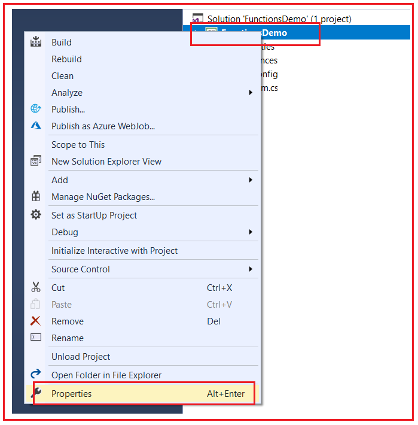
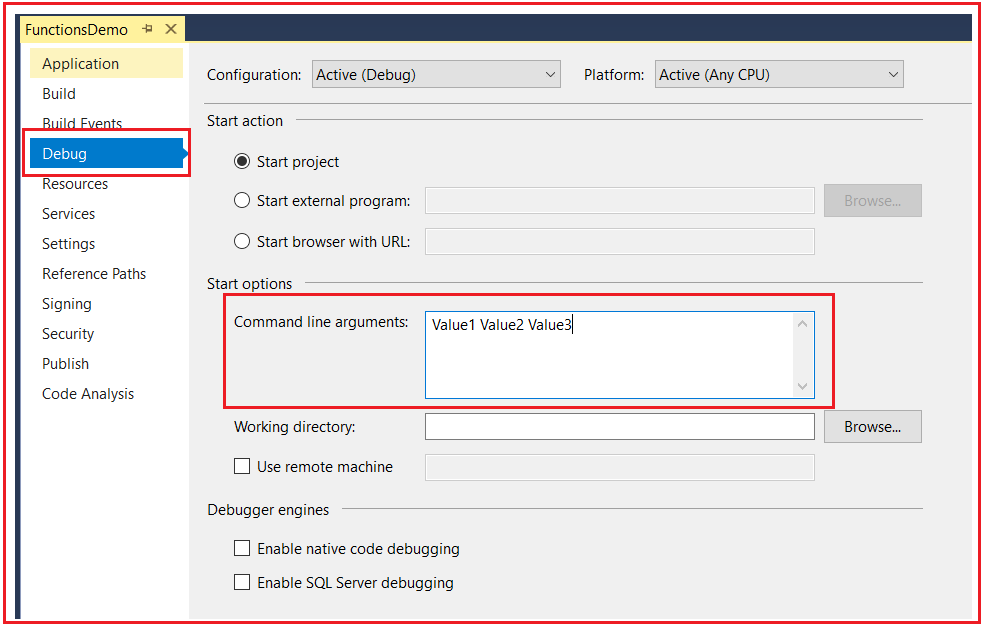
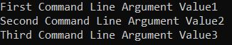
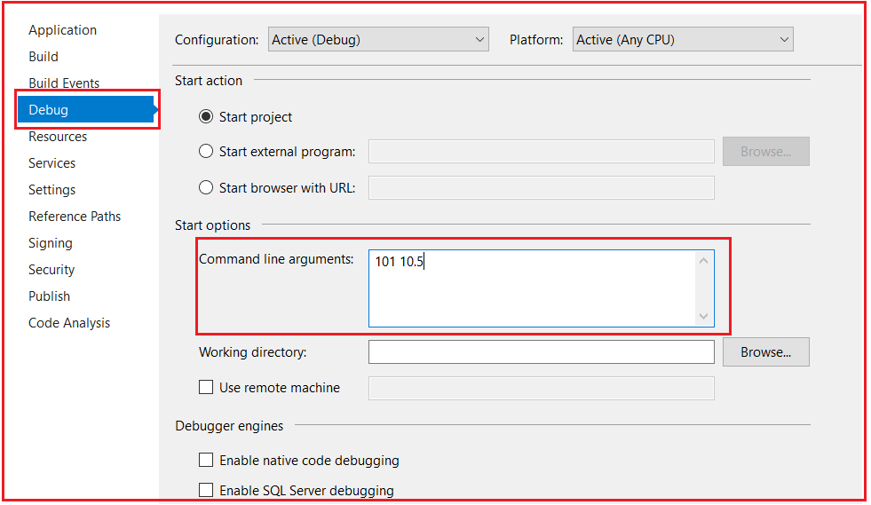
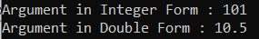
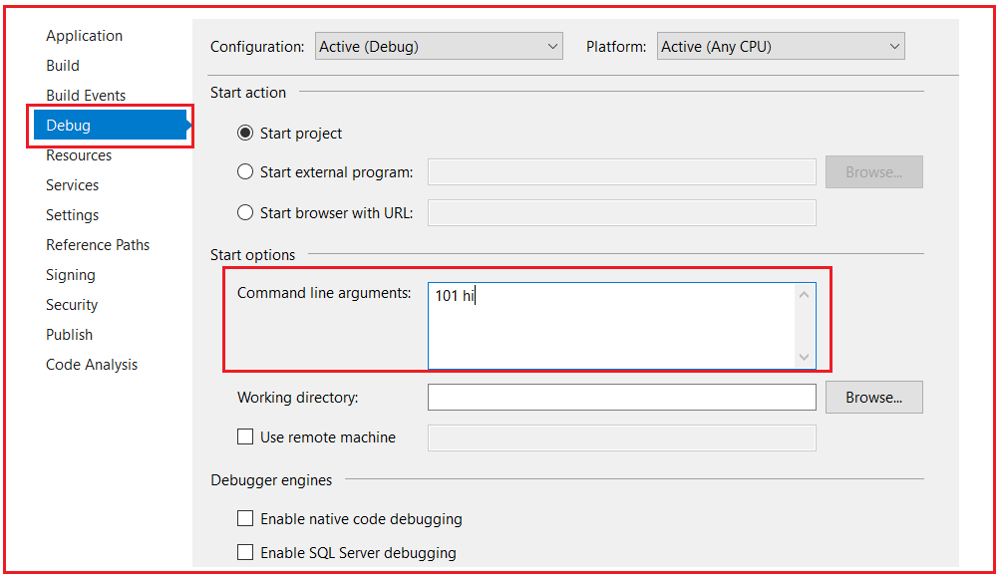
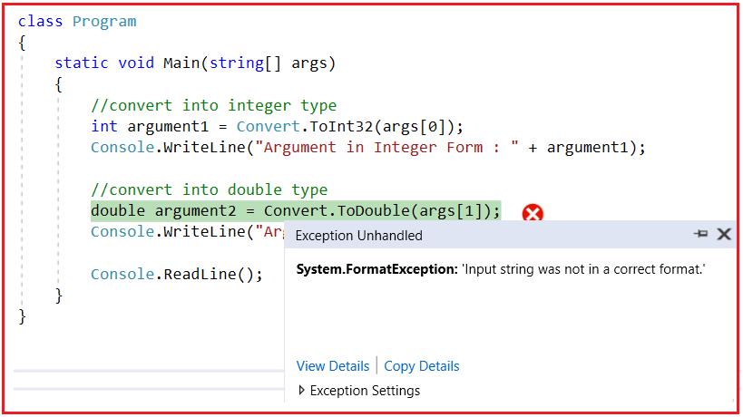

## **آرگومان‌های خط فرمان در سی شارپ به همراه مثال**

در این مقاله، قصد دارم **آرگومان‌های خط فرمان در سی‌شارپ را** مورد بحث قرار دهم.

##### **آرگومان‌های خط فرمان در سی شارپ:**

می‌دانیم که می‌توانیم پارامترها را به عنوان آرگومان به یک تابع ارسال کنیم، اما در مورد **متد Main(string[] args)** چطور ؟ آیا می‌توانیم پارامترها را در C# به متد Main() ارسال کنیم؟ بله، می‌توانیم پارامترها را به متد Main() ارسال کنیم و این کار از طریق آرگومان‌های خط فرمان در C# امکان‌پذیر است. آرگومان‌هایی که توسط کاربر یا برنامه‌نویس به متد Main() ارسال می‌شوند، در C# به عنوان آرگومان‌های خط فرمان شناخته می‌شوند.

متد Main() نقطه شروع اجرای برنامه است. مهمترین نکته‌ای که باید به خاطر داشته باشید این است که متد main هیچ پارامتری را از هیچ متدی نمی‌پذیرد. پارامترها را فقط از طریق خط فرمان می‌پذیرد. اگر به امضای متد Main توجه کنید، یک پارامتر از نوع آرایه رشته‌ای دارد که می‌تواند n تعداد پارامتر را در زمان اجرا بپذیرد. در Main(string[] args)، args یک آرایه از نوع رشته‌ای است که می‌تواند پارامترهای بی‌شماری را در خود نگه دارد.

##### **ارسال آرگومان‌های خط فرمان در سی شارپ با استفاده از ویژوال استودیو:**

یک برنامه کنسول جدید ایجاد کنید و سپس فایل کلاس Program.cs را به صورت زیر تغییر دهید:

```csharp
using System;

namespace FirstProgram
{
    class Program
    {
        static void Main(string[] args)
        {
            Console.WriteLine($"First Command Line Argument {args[0]}");
            Console.WriteLine($"Second Command Line Argument {args[1]}");
            Console.WriteLine($"Third Command Line Argument {args[2]}");

            Console.ReadLine();
        }
    }
}
```

اگر توجه کرده باشید، مثال بالا حداقل سه پارامتر را که باید توسط متد Main ارائه شوند، استثنا می‌کند. حال، اگر برنامه را اجرا کنید، با خطای System.IndexOutOfRangeException: 'Index was outside the bounds of the array' در زمان اجرا مواجه خواهید شد.


و این منطقی است. زیرا ما هیچ پارامتری ارائه نکرده‌ایم و در برنامه، آرایه رشته‌ای هیچ عنصری ندارد، خالی است و ما سعی داریم به عناصر آرایه دسترسی پیدا کنیم. حال، سوال این است که چگونه می‌توانیم آرگومان‌ها را به متد Main ارسال کنیم. پاسخ با استفاده از خط فرمان است. بیایید ببینیم چگونه می‌توانیم این کار را با استفاده از ویژوال استودیو انجام دهیم.

##### **ارسال آرگومان‌های خط فرمان به متد Main با استفاده از ویژوال استودیو:**

پنجره Properties را باز کنید. برای باز کردن پنجره Properties، روی پروژه در solution explorer کلیک راست کرده و سپس همانطور که در تصویر زیر نشان داده شده است، روی منوی Properties کلیک کنید.



از پنجره Properties، تب debug را انتخاب کنید و در کادر متنی Command Line Arguments، مقادیری را که می‌خواهید به متد Main منتقل کنید، با یک فاصله از هم جدا کنید. همانطور که در مثال ما، ما سه مقدار را در آرایه رشته‌ای استثنا کردیم، بنابراین در اینجا سه ​​مقدار را در کادر متنی Command Line Arguments قرار می‌دهم، همانطور که در تصویر زیر نشان داده شده است.



در اینجا Value1 در args[0]، Value2 در args[1] و Value3 در args[2] ذخیره می‌شوند. اکنون، تغییرات را ذخیره کرده و برنامه را اجرا کنید. خروجی زیر را در پنجره Console دریافت خواهید کرد.



##### **نکات مهم:**

1. آرگومان‌های خط فرمان در آرایه رشته‌ای، یعنی پارامتر args از متد Main، ذخیره می‌شوند.
2. به طور کلی، آرگومان‌های خط فرمان برای مشخص کردن اطلاعات پیکربندی هنگام اجرای برنامه شما استفاده می‌شوند.
3. اطلاعات به صورت رشته ارسال می‌شوند.
4. هیچ محدودیتی در تعداد آرگومان‌های خط فرمان وجود ندارد. می‌توانید 0 یا n عدد آرگومان خط فرمان ارسال کنید.

##### **ارسال آرگومان‌های عددی خط فرمان در سی شارپ**

در سی شارپ، آرگومان‌های خط فرمان همیشه به صورت رشته ذخیره می‌شوند و همیشه با فاصله از هم جدا می‌شوند. متد Main() هر برنامه سی شارپ فقط می‌تواند آرگومان‌های رشته‌ای را بپذیرد. اگر یک برنامه نیاز به پشتیبانی از آرگومان خط فرمان عددی داشته باشد، چه کاری باید انجام دهید؟ شما باید عدد عددی را به صورت رشته ارسال کنید و در برنامه خود، مسئولیت تبدیل آن رشته به عددی بر عهده شماست. و از این رو می‌توان آرگومان‌های عددی را از طریق خط فرمان ارسال کرد. با این حال، می‌توانیم بعداً آرگومان‌های رشته‌ای را به مقادیر عددی تبدیل کنیم.

##### **مثال ارسال آرگومان‌های عددی خط فرمان در سی شارپ**

```csharp
using System;

namespace FirstProgram
{
    class Program
    {
        static void Main(string[] args)
        {
            //convert into integer type
            int argument1 = Convert.ToInt32(args[0]);
            Console.WriteLine("Argument in Integer Form : " + argument1);

            //convert into double type
            double argument2 = Convert.ToDouble(args[1]);
            Console.WriteLine("Argument in Double Form : " + argument2);
            
            Console.ReadLine();
        }
    }
}
```

حالا، پنجره Properties=>Debug را همانطور که در تصویر زیر نشان داده شده است، تغییر دهید.



حالا تغییرات را ذخیره کنید و برنامه را اجرا کنید، خروجی زیر را دریافت خواهید کرد.



##### **اگر مقدار به نوع مشخص شده تبدیل نشود چه اتفاقی می‌افتد؟**

اگر آرگومان‌ها نتوانند به مقدار عددی مشخص شده تبدیل شوند، خطای **System.FormatException: 'رشته ورودی در قالب صحیحی نبود'** را دریافت خواهیم کرد.

بیایید مقادیر آرگومان‌های خط فرمان را همانطور که در تصویر زیر نشان داده شده است تغییر دهیم. در اینجا آرگومان دوم از نوع رشته است که نمی‌توان آن را به double تبدیل کرد.



حالا تغییرات را ذخیره کنید و برنامه را اجرا کنید. با خطای زمان اجرای زیر مواجه خواهید شد.


