## **رشته در سی شارپ به همراه مثال**

در این مقاله، قصد دارم **رشته‌ها را در سی‌شارپ** با مثال‌ها مورد بحث قرار دهم. به عنوان یک توسعه‌دهنده، درک مفهوم رشته‌ها در سی‌شارپ بسیار مهم است و من مطمئنم که شما در تمام پروژه‌های خود از رشته استفاده می‌کنید. اما از نقطه نظر عملکرد، نکات زیادی وجود دارد که باید بدانید. بنابراین، به عنوان بخشی از این مقاله، قصد داریم نکات زیر را با جزئیات و مثال‌ها مورد بحث قرار دهیم.

1. **رشته‌ها از نوع‌های مرجع هستند**
2. **درک تفاوت بین رشته (کوچک) در مقابل رشته (بزرگ).**
3. **رشته‌ها تغییرناپذیر هستند.**
4. **چگونه می‌توانیم با استفاده از String intern عملکرد را بهبود بخشیم؟**
5. **StringBuilder برای الحاق.**
6. **چرا رشته‌ها را تغییرناپذیر می‌کنند؟**

##### **رشته چیست؟**

در سی شارپ، رشته یک شیء از کلاس String است که دنباله ای از کاراکترها را نشان می دهد. ما می توانیم عملیات زیادی مانند الحاق، مقایسه، گرفتن زیررشته، جستجو، برش، جایگزینی و غیره را روی رشته ها انجام دهیم.

##### **رشته‌ها در سی‌شارپ از نوع‌های ارجاعی هستند:**

رشته‌ها در سی‌شارپ از نوع ارجاعی هستند، یعنی نوع داده معمولی نیستند یا می‌توان گفت مانند سایر انواع داده اولیه نیستند. برای مثال، اگر برخی متغیرها را با استفاده از نوع داده int یا double همانطور که در زیر نشان داده شده است تعریف کنیم.

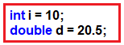

سپس اگر روی نوع داده کلیک راست کرده و به بخش تعریف بروید، خواهید دید که آنها از نوع struct هستند، همانطور که در تصویر زیر نشان داده شده است. struct به این معنی است که آنها از نوع value type هستند.

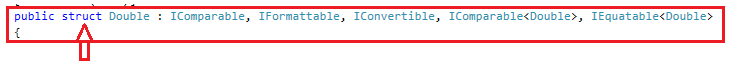

از طرف دیگر، اگر متغیری با نوع داده رشته‌ای مانند زیر تعریف کنید.


سپس اگر روی نوع داده‌ی رشته‌ای کلیک راست کرده و روی go to definition کلیک کنید، خواهید دید که یک کلاس است. کلاس به معنی نوع داده‌ی مرجع است.


بنابراین، اولین نکته‌ای که باید به خاطر داشته باشید این است که رشته‌ها از نوع ارجاعی هستند در حالی که سایر انواع داده‌های اولیه از نوع ساختار (struct) هستند، یعنی از نوع مقداری در سی‌شارپ.

##### **تفاوت بین رشته (بزرگ) و رشته (کوچک) در سی شارپ چیست؟**

در سی شارپ، می‌توانید از رشته به دو روش استفاده کنید. می‌توانید از S بزرگ (یعنی String) یا از s کوچک (یعنی string) همانطور که در تصویر زیر نشان داده شده است، برای رشته استفاده کنید.

 در مقابل رشته (کوچک) در سی شارپ")

حالا سوالی که باید به ذهنتان خطور کند این است که تفاوت بین این دو (رشته در مقابل String) در C# چیست. بیایید این را درک کنیم. رشته کوچک در واقع یک نام مستعار String (رشته بزرگ) است. اگر روی رشته کوچک کلیک راست کنید و به تعریف بروید، خواهید دید که نام کلاس واقعی یک رشته بزرگ است، یعنی String، همانطور که در تصویر زیر نشان داده شده است.


شما می‌توانید از هر یک از آنها یعنی رشته یا String استفاده کنید. اما طبق قرارداد نامگذاری، هنگام ایجاد یک متغیر از رشته کوچک (یعنی string) استفاده کنید و هر زمان که می‌خواهید متدهایی را روی رشته فراخوانی کنید، از رشته بزرگ (یعنی String) همانطور که در تصویر زیر نشان داده شده است، استفاده کنید.


##### **رشته‌ها در سی شارپ تغییرناپذیر هستند:**

قبل از اینکه بفهمیم رشته‌ها تغییرناپذیر هستند، ابتدا باید دو اصطلاح Mutable و Immutable را درک کنیم. Mutable به معنی قابل تغییر است در حالی که Immutable به معنی غیرقابل تغییر است. رشته‌های C# به معنی تغییرناپذیر هستند، یعنی رشته‌های C# قابل تغییر نیستند. اجازه دهید این موضوع را با یک مثال درک کنیم.

لطفاً به تصویر زیر نگاهی بیندازید. وقتی دستور اول اجرا می‌شود، یک شیء ایجاد می‌کند و مقدار DotNet را به آن اختصاص می‌دهد. اما وقتی دستور دوم اجرا می‌شود، شیء اول را نادیده نمی‌گیرد، اجازه می‌دهد شیء اول برای جمع‌آوری زباله (garbage collection) آنجا باشد و یک شیء جدید ایجاد می‌کند و مقدار Tutorials را به آن اختصاص می‌دهد.

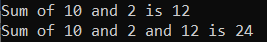

بنابراین، وقتی دو دستور بالا اجرا می‌شوند، به صورت داخلی دو مکان حافظه ایجاد می‌شوند. وقتی دستور اول اجرا می‌شود، یک شیء ایجاد می‌شود که مقدار DotNet را نگه می‌دارد و آن شیء توسط متغیر str ارجاع داده می‌شود. وقتی دستور دوم اجرا می‌شود، یک شیء دیگر ایجاد می‌شود که مقدار Tutorials را نگه می‌دارد و اکنون متغیر str به این شیء تازه ایجاد شده اشاره می‌کند. و شیء اول آنجا خواهد بود و برای جمع‌آوری زباله در دسترس خواهد بود. بنابراین، نکته‌ای که باید به خاطر داشته باشید این است که هر بار که یک مقدار جدید به متغیر رشته‌ای اختصاص می‌دهیم، یک شیء جدید ایجاد می‌شود و آن شیء جدید توسط متغیر رشته‌ای ارجاع داده می‌شود و اشیاء قدیمی‌تر برای جمع‌آوری زباله در آنجا خواهند بود و به همین دلیل است که رشته‌های گفته شده در C# تغییرناپذیر هستند.

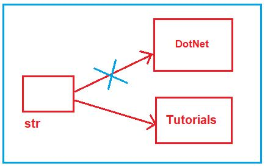

اما در مورد نوع مقداری اینطور نیست. برای مثال، لطفاً به دو دستور زیر نگاهی بیندازید. وقتی دستور اول اجرا می‌شود، یک مکان حافظه ایجاد می‌شود و مقدار ۱۰۰ به آن اختصاص داده می‌شود و وقتی دستور دوم اجرا می‌شود، مکان حافظه جدیدی ایجاد نمی‌شود، بلکه مقدار همان مکان حافظه را بازنویسی می‌کند.

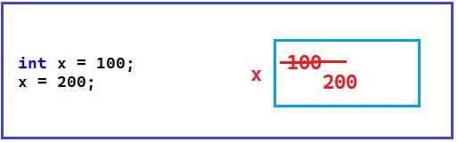

**نکته:** نکته‌ای که باید به خاطر داشته باشید این است که در نوع داده‌ی value، می‌توانید مقدار همان مکان حافظه را تغییر دهید و از این رو به آنها **Mutable گفته می‌شود.** اما در نوع داده‌ی string، نمی‌توانید مقدار یک مکان حافظه را تغییر دهید و از این رو به رشته‌ها Immutable گفته می‌شود **.**

##### **مثالی برای** **اثبات** **تغییرناپذیری رشته‌ها در سی‌شارپ:**

بیایید مثالی بزنیم تا بفهمیم رشته‌های سی‌شارپ تغییرناپذیر هستند. لطفاً کد زیر را کپی و جایگذاری کنید. همانطور که در اینجا می‌بینید، ما یک حلقه سنگین داریم. به عنوان بخشی از حلقه، مقداری را به متغیر رشته‌ای str اختصاص می‌دهیم. در اینجا، ما از GUID برای تولید یک مقدار جدید استفاده می‌کنیم و هر بار یک مقدار جدید ایجاد می‌کند و آن را به متغیر str اختصاص می‌دهد. دوباره، ما از Stopwatch برای بررسی مدت زمان اجرای حلقه استفاده می‌کنیم.

```csharp
using System;
using System.Diagnostics;

namespace StringDemo
{
    class Program
    {
        static void Main(string[] args)
        {
            string str = "";
            Console.WriteLine("Loop Started");
            var stopwatch = new Stopwatch();

            stopwatch.Start();
            for (int i = 0; i < 30000000; i++)
            {
                 str = Guid.NewGuid().ToString();
            }
            stopwatch.Stop();

            Console.WriteLine("Loop Ended");
            Console.WriteLine("Loop Exceution Time in MS :" + stopwatch.ElapsedMilliseconds);

            Console.ReadKey();
        }
    }
}
```

**خروجی:** وقتی برنامه را اجرا می‌کنید، خروجی زیر را دریافت خواهید کرد. زمان ممکن است در دستگاه شما متفاوت باشد.

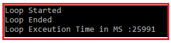

همانطور که در خروجی بالا مشاهده می‌کنید، اجرای حلقه تقریباً ۲۶۰۰۰ میلی‌ثانیه طول کشیده است. هر بار که حلقه اجرا می‌شود، یک شیء رشته‌ای جدید ایجاد می‌کند و مقدار جدیدی به آن اختصاص می‌دهد. دلیل این امر این است که رشته‌ها در سی‌شارپ تغییرناپذیر هستند.

##### **مثال استفاده از عدد صحیح در سی شارپ:**

در مثال سی شارپ زیر، به جای یک رشته، از یک متغیر عدد صحیح استفاده می‌کنیم. از آنجایی که اعداد صحیح تغییرناپذیر نیستند، بنابراین هر بار که حلقه اجرا می‌شود، یک مکان حافظه جدید ایجاد نمی‌شود، بلکه از همان مکان حافظه استفاده کرده و مقدار آن را به‌روزرسانی می‌کند.

```csharp
using System;
using System.Diagnostics;

namespace StringDemo
{
    class Program
    {
        static void Main(string[] args)
        {
            int ctr =0;
            Console.WriteLine("Loop Started");
            var stopwatch = new Stopwatch();

            stopwatch.Start();
            for (int i = 0; i < 30000000; i++)
            {
                ctr = ctr + 1;
            }
            stopwatch.Stop();

            Console.WriteLine("Loop Ended");
            Console.WriteLine("Loop Exceution Time in MS :" + stopwatch.ElapsedMilliseconds);

            Console.ReadKey();
        }
    }
}
```

###### **خروجی:**

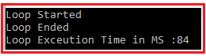

همانطور که در خروجی بالا مشاهده می‌کنید، اجرای حلقه فقط ۸۴ میلی‌ثانیه طول کشیده است.

##### **مثال: رشته با مقدار یکسان در سی شارپ**

بیایید با یک مثال در سی شارپ، بفهمیم اگر بارها و بارها مقدار یکسانی را به متغیر رشته‌ای اختصاص دهیم، چه اتفاقی می‌افتد. همانطور که در مثال زیر می‌بینید، که دقیقاً مشابه مثال اول است، اما در اینجا به جای استفاده از GUID، یک مقدار ثابت را به متغیر رشته‌ای str اختصاص می‌دهیم.

```csharp
using System;
using System.Diagnostics;

namespace StringDemo
{
    class Program
    {
        static void Main(string[] args)
        {
            string str = "";
            Console.WriteLine("Loop Started");
            var stopwatch = new Stopwatch();

            stopwatch.Start();
            for (int i = 0; i < 30000000; i++)
            {
                str ="DotNet Tutorials";
            }
            stopwatch.Stop();

            Console.WriteLine("Loop Ended");
            Console.WriteLine("Loop Exceution Time in MS :" + stopwatch.ElapsedMilliseconds);

            Console.ReadKey();
        }
    }
}
```

###### **خروجی:**

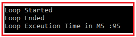

همانطور که در خروجی بالا می‌بینید، این کار فقط ۹۵ میلی‌ثانیه طول کشید. دلیلش این است که در این حالت، هر بار که حلقه اجرا می‌شود، اشیاء جدید ایجاد نمی‌شوند. حال، سوالی که باید به ذهنتان خطور کند این است که چرا؟ پاسخ، **کارآموز رشته‌ای (String intern)** است . بنابراین، بیایید کارآموز رشته‌ای (string interning) را با جزئیات بررسی کنیم.

##### **کارآموز رشته در سی شارپ:**

کارآموز **رشته‌ای در سی‌شارپ** فرآیندی است که اگر مقدار یکسان باشد، از همان مکان حافظه استفاده می‌کند. در مثال ما، وقتی حلقه برای اولین بار اجرا می‌شود، یک شیء جدید ایجاد می‌کند و مقدار « **آموزش‌های دات‌نت** » را به آن اختصاص می‌دهد. وقتی حلقه 2 را اجرا می‌کند <sup>و </sup> قبل از ایجاد یک شیء جدید، بررسی می‌کند که آیا مقدار « **آموزش‌های دات‌نت** » از قبل در حافظه وجود دارد یا خیر، اگر وجود داشته باشد، از آن مکان حافظه استفاده می‌کند، در غیر این صورت یک مکان حافظه جدید ایجاد می‌کند. این چیزی جز یادگیری رشته‌ای در سی‌شارپ نیست.

بنابراین، اگر شما یک حلقه for را اجرا می‌کنید و مقدار یکسانی را بارها و بارها به آن اختصاص می‌دهید، از اینترینگ رشته برای بهبود عملکرد استفاده می‌کند. در این حالت، به جای ایجاد یک شیء جدید، از همان مکان حافظه استفاده می‌کند. اما وقتی مقدار تغییر می‌کند، یک شیء جدید ایجاد می‌کند و مقدار را به شیء جدید اختصاص می‌دهد.

##### **StringBuilder برای الحاق در سی شارپ:**

همانطور که قبلاً بحث کردیم، اگر مقدار تغییر کند، هر بار یک شیء جدید در سی شارپ ایجاد می‌شود و این به دلیل رفتار تغییرناپذیری رشته است. رفتار تغییرناپذیری رشته در سی شارپ می‌تواند در هنگام الحاق رشته بسیار بسیار خطرناک باشد. بیایید الحاق رشته در سی شارپ را با یک مثال درک کنیم و مشکل را درک کنیم. در مثال زیر، ما رشته را با استفاده از حلقه for الحاق می‌کنیم.

```csharp
using System;
using System.Diagnostics;

namespace StringDemo
{
    class Program
    {
        static void Main(string[] args)
        {
            string str = "";
            Console.WriteLine("Loop Started");
            var stopwatch = new Stopwatch();

            stopwatch.Start();
            for (int i = 0; i < 30000; i++)
            {
                str ="DotNet Tutorials" + str;
            }
            stopwatch.Stop();

            Console.WriteLine("Loop Ended");
            Console.WriteLine("Loop Exceution Time in MS :" + stopwatch.ElapsedMilliseconds);

            Console.ReadKey();
        }
    }
}
```

###### **خروجی:**

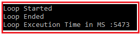

همانطور که در تصویر بالا مشاهده می‌کنید، اجرای حلقه تقریباً ۵۴۷۳ میلی‌ثانیه طول کشید. برای درک نحوه اجرای حلقه، لطفاً به تصویر زیر نگاهی بیندازید. حلقه برای اولین بار اجرا می‌شود، یک مکان حافظه جدید ایجاد می‌کند و مقدار "DotNet Tutorials" را ذخیره می‌کند. برای بار دوم، یک مکان حافظه جدید (شیء تازه) ایجاد می‌کند و مقدار "DotNet Tutorials DotNet Tutorials" را ذخیره می‌کند و مکان حافظه اول برای جمع‌آوری زباله (garbage collection) استفاده می‌شود. و همین روند ادامه خواهد یافت، یعنی هر بار که حلقه اجرا می‌شود، یک مکان حافظه جدید ایجاد می‌شود و مکان‌های قبلی برای جمع‌آوری زباله (garbage collection) استفاده می‌شوند.

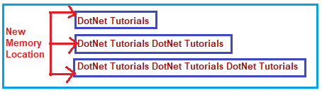

برای حل **مشکل الحاق رشته در سی شارپ** ، چارچوب دات نت **کلاس StringBuilder** را ارائه می‌دهد . همانطور که از نام آن پیداست، کلاس سازنده رشته در سی شارپ برای ساخت یک رشته با الحاق رشته‌ها استفاده می‌شود. اگر از سازنده رشته استفاده کنید، هر بار که چیزی را به متغیر رشته در سی شارپ الحاق می‌کنید، اشیاء جدید ایجاد نمی‌شوند.

##### **مثال استفاده از StringBuilder در سی شارپ:**

بیایید بفهمیم که چگونه **بر مشکل الحاق رشته‌ها در سی‌شارپ** با استفاده از **کلاس StringBuilder** غلبه کنیم . در مثال زیر، ما از کلاس StringBuilder برای الحاق رشته‌ها استفاده می‌کنیم. در اینجا، ابتدا یک نمونه از کلاس StringBuilder ایجاد می‌کنیم و سپس از **Append** متد **کلاس StringBuilder** برای الحاق رشته استفاده می‌کنیم.

```csharp
using System;
using System.Diagnostics;
using System.Text;

namespace StringDemo
{
    class Program
    {
        static void Main(string[] args)
        {
            StringBuilder stringBuilder = new StringBuilder();
            Console.WriteLine("Loop Started");
            var stopwatch = new Stopwatch();

            stopwatch.Start();
            for (int i = 0; i < 30000; i++)
            {
                stringBuilder.Append("DotNet Tutorials");
            }
            stopwatch.Stop();

            Console.WriteLine("Loop Ended");
            Console.WriteLine("Loop Exceution Time in MS :" + stopwatch.ElapsedMilliseconds);

            Console.ReadKey();
        }
    }
}
```

###### **خروجی:**

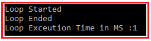

همانطور که در خروجی بالا مشاهده می‌کنید، الحاق رشته فقط ۱ میلی‌ثانیه طول کشید، در حالی که این زمان برای رشته ۵۴۷۳ میلی‌ثانیه است. دلیل این امر این است که هر بار که حلقه for اجرا می‌شود، اشیاء جدیدی ایجاد نمی‌کند، بلکه از همان مکان حافظه، یعنی همان شیء قدیمی، استفاده می‌کند که عملکرد برنامه را به طرز چشمگیری بهبود می‌بخشد.

##### **چرا رشته‌ها در سی‌شارپ تغییرناپذیر (Immutable) می‌شوند؟**

حالا سوال این است که چرا در سی شارپ رشته‌ها را تغییرناپذیر (Immutable) کرده‌اند. **آن‌ها رشته‌ها را برای ایمنی نخ (Thread Safety) تغییرناپذیر کرده‌اند** . موقعیتی را تصور کنید که نخ‌های زیادی دارید و همه نخ‌ها می‌خواهند شیء رشته‌ای یکسانی را همانطور که در تصویر زیر نشان داده شده است، دستکاری کنند. اگر رشته‌ها تغییرپذیر باشند، ما با مشکلات ایمنی نخ مواجه خواهیم شد.

 تعریف شده‌اند؟")

اگر در مورد ایمنی نخ تازه‌کار هستید، اکیداً توصیه می‌کنم مقاله زیر را بخوانید، جایی که به تفصیل در مورد نخ و ایمنی نخ بحث کرده‌ایم.