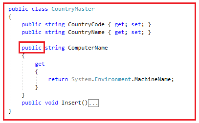
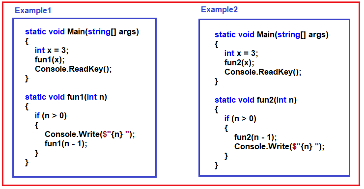
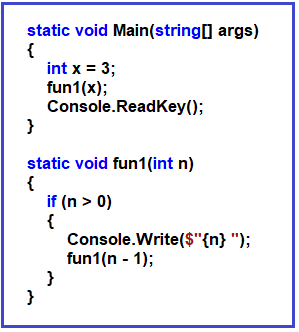

## **کلمه کلیدی استاتیک در سی شارپ به همراه مثال**

در این مقاله، قصد دارم **به همراه مثال‌هایی، در مورد اینکه چرا به کلمه کلیدی Static در سی‌شارپ نیاز داریم** بحث کنم. در پایان این مقاله، مطمئنم که نیاز و کاربرد دقیق کلمه کلیدی Static در سی‌شارپ را با مثال‌ها درک خواهید کرد.

##### **چرا در سی شارپ به کلمه کلیدی استاتیک نیاز داریم؟**

اگر این سوال را از هر توسعه‌دهنده‌ای بپرسید، احتمالاً به شما پاسخ می‌دهد که کلمه کلیدی static در الگوی طراحی Factory، الگوی طراحی Singleton و همچنین برای اشتراک‌گذاری داده‌ها و غیره استفاده می‌شود. اما من فکر می‌کنم کلمه کلیدی static برای سه هدف اساسی استفاده می‌شود. و در این مقاله، ما این سه هدف را به تفصیل مورد بحث قرار خواهیم داد. امیدوارم از این مقاله لذت ببرید.

##### **مثال برای درک کلمه کلیدی Static در سی شارپ:**

بیایید با یک مثال، نیاز و کاربرد کلمه کلیدی Static در سی شارپ را درک کنیم. ابتدا، یک برنامه کنسول با نام StaticKeyowrdDemo ایجاد کنید.

##### **CountryMaster.cs:**

پس از ایجاد برنامه کنسول، یک فایل کلاس با نام **CountryMaster.cs** ایجاد کنید و سپس کد زیر را در آن کپی و جایگذاری کنید. در اینجا ما کلاس CountryMaster را با سه ویژگی و یک متد ایجاد کرده‌ایم. ویژگی CountryCode قرار است نمادهای سه حرفی کشور مانند IND را در خود نگه دارد در حالی که ویژگی CountryName نام کامل کشور مانند India را در خود نگه می‌دارد. ویژگی ComputerName منطق بازیابی نام دستگاه فعلی را دارد. متد Insert رکورد کشور را در پایگاه داده وارد می‌کند و هنگام وارد کردن آن، از ویژگی ComputerName نیز برای تشخیص اینکه این رکورد از کدام رایانه وارد می‌شود، استفاده می‌کند.

```csharp
namespace StaticKeyowrdDemo
{
    public class CountryMaster
    {
        public string CountryCode { get; set; }
        public string CountryName { get; set; }
        private string ComputerName
        {
            get
            {
                return System.Environment.MachineName;
            }
        }
        public void Insert()
        {
            //Logic to Insert the Country Details into the Database
            //ComputerName property tells from which computer the Record is being Inserted
        }
    }
}
```

##### **Customer.cs**

حالا، یک فایل کلاس جدید با نام **Customer.cs** ایجاد کنید و سپس کد زیر را در آن کپی و جایگذاری کنید.

```csharp
namespace StaticKeyowrdDemo
{
    public class Customer
    {
        public string CustomerCode { get; set; }
        public string CustomerName { get; set; }
        private string MachineName = "";
        private bool IsEmpty(string value)
        {
            if(value.Length > 0)
            {
                return true;
            }
            return false;
        }        
        public void Insert()
        {
            if(IsEmpty(CustomerCode) && IsEmpty(CustomerName))
            {
                //Insert the data
            }
        }
    }
}
```

##### **توضیح کد بالا:**

در کد بالا، ویژگی CustomerCode قرار است کد سه حرفی مشتری، مثلاً AB1، را در خود نگه دارد، در حالی که ویژگی CustomerName نام مشتری، مثلاً Pranaya، را در خود نگه می‌دارد. متد IsEmpty یک مقدار را می‌پذیرد و سپس بررسی می‌کند که آیا مقدار خالی است یا خیر. اگر خالی نباشد، مقدار true را برمی‌گرداند و در غیر این صورت مقدار false را برمی‌گرداند. متد Insert به سادگی بررسی می‌کند که آیا CustomerCode و CustomerName هر دو خالی نیستند، سپس رکورد مشتری را در پایگاه داده وارد می‌کند.

در اینجا، مشکل از متغیر MachineName است. MachineName باید نام رایانه فعلی را هنگام درج داده‌های مشتری در پایگاه داده داشته باشد تا بتوانیم پیگیری کنیم که این داده‌های مشتری از کدام دستگاه درج شده است.

اگر به خاطر داشته باشید، کلاس CountryMaster منطق بازیابی نام کامپیوتر را دارد. به جای نوشتن منطق تکراری در اینجا، باید از منطقی که از قبل در کلاس CountryMaster نوشته شده است استفاده کنیم تا از دوباره نویسی همان کد جلوگیری کنیم.

اگر ویژگی ComputerName را در کلاس CountryMaster بررسی کنید، خواهید دید که خصوصی (private) است. بنابراین، برای استفاده از آن ویژگی در داخل کلاس Customer، قبل از هر چیز، باید آن ویژگی را همانطور که در تصویر زیر نشان داده شده است، به عمومی (public) تغییر دهیم.



دوباره، هنگام درج رکورد CountryMaster در پایگاه داده، باید بررسی کنیم که هر دو ویژگی CountryCode و CountryName خالی نباشند. برای بررسی خالی بودن یا نبودن، بهتر است از متد IsEmpty که درون کلاس Customer تعریف شده است استفاده کنیم، نه اینکه دوباره همان منطق را اینجا بنویسیم. علاوه بر این، اگر توجه کرده باشید، متد IsEmpty کلاس Customer خصوصی است. بنابراین، برای استفاده از متد IsEmpty درون کلاس CountryMaster، باید مشخص‌کننده دسترسی متد IsEmpty را همانطور که در تصویر زیر نشان داده شده است، به public تغییر دهیم.


کلاس CountryMaster منطقی برای بازیابی نام کامپیوتر دارد و ما می‌خواهیم از آن منطق در کلاس Customer استفاده کنیم، بنابراین ویژگی ComputerName را عمومی کردیم. به طور مشابه، کلاس Customer منطق بررسی خالی بودن یا نبودن یک مقدار را دارد و ما همچنین می‌خواهیم این منطق در کلاس CountryMaster نیز وجود داشته باشد، بنابراین متد IsEmpty را عمومی کردیم. تا زمانی که این کار را انجام دهیم، اصل OOPs را نقض کرده‌ایم.

##### **چگونه ما اصل OOPs را نقض می‌کنیم؟**

بیایید بفهمیم که چگونه اصل OOPs را در کد خود نقض می‌کنیم. حال، لطفاً کلاس Program را مطابق شکل زیر تغییر دهید. پس از ایجاد شیء کلاس Customer، و هنگامی که نام شیء و عملگر نقطه را می‌نویسید، سیستم هوشمند تمام اعضای عمومی کلاس Customer را مطابق تصویر زیر به شما نشان می‌دهد.


همانطور که در تصویر بالا مشاهده می‌کنید، ما متدهای CustomerCode، CustomerName، Insert و IsEmpty را نمایش داده‌ایم. این یک نقض آشکار از اصل انتزاع OOPs است. انتزاع به معنای نمایش فقط آنچه لازم است است. بنابراین، شخص خارجی که از کلاس شما استفاده می‌کند، باید متد CustomerCode، CustomerName و Insert را ببیند و مصرف کند. اما نباید متد IsEmpty را ببیند. متد IsEmpty برای استفاده داخلی است، یعنی توسط سایر متدهای داخلی کلاس استفاده می‌شود و نه توسط مصرف‌کننده کلاس. در این حالت، کلاس Program مصرف‌کننده کلاس Customer است، یعنی کلاس Program قرار است کلاس Customer را مصرف کند. از آنجایی که ما متد IsEmpty را به صورت عمومی (public) تعریف می‌کنیم، اصل OOPs را نقض می‌کنیم.

به همین ترتیب، ما با شیء CountryMaster نیز اصل انتزاع را نقض می‌کنیم، زیرا ویژگی ComputerName را در معرض دنیای خارجی قرار می‌دهیم. ویژگی ComputerName برای استفاده داخلی است. یعنی هنگام درج داده‌ها، منطق دریافت نام کامپیوتر و ذخیره آن در پایگاه داده را خواهد داشت. اما، در اینجا مصرف‌کننده کلاس CountryMaster نیز می‌تواند به ویژگی ComputerName دسترسی پیدا کند، آن را تنظیم و دریافت کند، همانطور که در تصویر زیر نشان داده شده است. ویژگی ComputerName فقط برای استفاده داخلی است.



**نکته:** با استفاده از موارد فوق، ما به قابلیت استفاده مجدد از کد (استفاده مجدد از متدهای ComputerName و IsEmpty) دست می‌یابیم، اما اصل OOPS را نقض می‌کنیم.

##### **مشکل فوق را چگونه حل کنیم؟**

چگونگی حل مشکل فوق به این معنی است که چگونه می‌توانیم بدون نقض اصول OOP به قابلیت استفاده مجدد از کد دست یابیم. برای دستیابی به هر دو، بیایید یک کلاس جدید اضافه کنیم و سپس آن دو تابع را به آن کلاس منتقل کنیم. یک فایل کلاس با نام **CommonTask.cs**   ایجاد کنید و سپس کد زیر را در آن کپی و جایگذاری کنید.

```csharp
namespace StaticKeyowrdDemo
{
    public class CommonTask
    {
        public bool IsEmpty(string value)
        {
            if (value.Length > 0)
            {
                return true;
            }
            return false;
        }
        public string GetComputerName()
        {
            return System.Environment.MachineName;
        }
    }
}
```

حالا، لطفاً متد IsEmpty() را از کلاس Customer و ویژگی ComputerName را از کلاس CountryMaster حذف کنید. اکنون هر دو منطقی که اصل OOPs را نقض می‌کنند به **کلاس CommonTask** منتقل شده‌اند .

##### **اصلاح کلاس مشتری:**

حالا کلاس Customer را مطابق شکل زیر تغییر دهید. همانطور که می‌بینید، در سازنده، یک نمونه از کلاس CommonTask ایجاد می‌کنیم و سپس مقدار متغیر خصوصی MachineName را تنظیم می‌کنیم. و در داخل متد Insert، یک نمونه از کلاس CommonTask ایجاد می‌کنیم و متد IsEmpty را فراخوانی می‌کنیم.

```csharp
namespace StaticKeyowrdDemo
{
    public class Customer
    {
        public string CustomerCode { get; set; }
        public string CustomerName { get; set; }
        private string MachineName = "";

        public Customer()
        {
            CommonTask commonTask = new CommonTask();
            MachineName = commonTask.ComputerName;
        }

        public void Insert()
        {
            CommonTask commonTask = new CommonTask();
            if (!commonTask.IsEmpty(CustomerCode) && !commonTask.IsEmpty(CustomerName))
            {
                //Insert the data
            }
        }
    }
}
```

##### **اصلاح کلاس CountryMaster:**

لطفاً کلاس CountryMaster را مطابق شکل زیر تغییر دهید. در اینجا، ما نمونه‌ای از CommonTask ایجاد کردیم و سپس متدهای ComputerName Property و IsEmpty را فراخوانی کردیم.

```csharp
namespace StaticKeyowrdDemo
{
    public class CountryMaster
    {
        public string CountryCode { get; set; }
        public string CountryName { get; set; }
        private string ComputerName
        {
            get
            {
                CommonTask commonTask = new CommonTask();
                return commonTask.ComputerName;
            }
        }

        public void Insert()
        {
            CommonTask commonTask = new CommonTask();
            if (!commonTask.IsEmpty(CountryCode) && !commonTask.IsEmpty(CountryName))
            {
                //Logic to Insert the Country Details into the Database
                //ComputerName property tells from which computer the Record is being Inserted
            }
        }
    }
}
```

از آنجایی که ما متد IsEmpty و ویژگی ComputerName را در کلاس CommonTask متمرکز کردیم، می‌توانیم از این ویژگی و روش در هر دو کلاس Customer و CountryMaster استفاده کنیم. راه حل بالا به نظر مناسب می‌رسد زیرا اصل OOPs را نقض نمی‌کند و همچنین قابلیت استفاده مجدد از کد را فراهم می‌کند و امیدوارم بسیاری از شما نیز با آن موافق باشید. اما مشکلی نیز وجود دارد.

##### **مشکل راه حل بالا چیه؟**

برای درک مشکل، ابتدا کلاس CommonTask را به خوبی تجزیه و تحلیل می‌کنیم. لطفاً به نکات زیر در مورد کلاس CommonTask نگاهی بیندازید.

1. این کلاس CommonTask مجموعه‌ای از متدها و ویژگی‌های نامرتبط است که به یکدیگر ارتباطی ندارند. از آنجایی که این کلاس دارای متدها، ویژگی‌ها یا منطق نامرتبط است، هیچ شیء دنیای واقعی را نشان نمی‌دهد.
2. از آنجایی که این کلاس هیچ شیء واقعی را نشان نمی‌دهد، بنابراین هیچ یک از اصول برنامه‌نویسی شیءگرا (وراثت، انتزاع، چندریختی، کپسوله‌سازی) نباید روی این کلاس CommonTask اعمال شود.
3. بنابراین، به عبارت ساده، می‌توانیم بگوییم که این یک کلاس ثابت است، یعنی کلاسی با رفتار ثابت. یعنی رفتار آن را نمی‌توان با ارث‌بری تغییر داد و رفتار آن را نمی‌توان با استفاده از چندریختی استاتیک یا پویا، چندریختی کرد. بنابراین، می‌توانیم بگوییم که این کلاس یک کلاس ثابت یا کلاس استاتیک است.

##### **چگونه از وراثت، انتزاع یا اصل OOP در یک کلاس اجتناب کنیم؟**

پاسخ استفاده از کلمه کلیدی static است. بنابراین، کاری که باید انجام دهیم این است که کلاس CommonTask را با استفاده از کلمه کلیدی static به صورت static علامت گذاری کنیم. وقتی یک کلاس را به صورت static علامت گذاری می‌کنیم، همه چیز درون کلاس نیز باید static باشد. این بدان معناست که، همراه با کلاس CommonTask، باید متد IsEmpty و ویژگی ComputerName را نیز به صورت static علامت گذاری کنیم. بنابراین، کلاس CommonTask را مطابق شکل زیر تغییر دهید.

```csharp
namespace StaticKeyowrdDemo
{
    public static class CommonTask
    {
        public static bool IsEmpty(string value)
        {
            if (value.Length > 0)
            {
                return true;
            }
            return false;
        }

        public static string ComputerName
        {
            get
            {
                return System.Environment.MachineName;
            }
        }
    }
}
```

وقتی کلاس را استاتیک می‌کنید، دیگر نمی‌توانید هیچ نوع اصول OOP را اعمال کنید، حتی نمی‌توانید از **کلمه کلیدی new** با کلاس استاتیک برای ایجاد یک نمونه استفاده کنید، بلکه باید **متد IsEmpty** و **ویژگی ComputerName** را با استفاده مستقیم از نام کلاس فراخوانی کنید. به طور داخلی، فقط یک نمونه از کلاس استاتیک به محض شروع اجرای کلاس توسط CLR ایجاد می‌شود و همان نمونه توسط همه کلاینت‌ها ارائه می‌شود.

##### **کلاس مشتری را تغییر دهید:**

حالا کلاس Customer را مطابق شکل زیر تغییر دهید. همانطور که می‌بینید، اکنون ما **ویژگی ComputerName** و **متد IsEmpty** را با استفاده از نام کلاس یعنی **CommonTask** مستقیماً و بدون ایجاد هیچ نمونه‌ای فراخوانی می‌کنیم.

```csharp
namespace StaticKeyowrdDemo
{
    public class Customer
    {
        public string CustomerCode { get; set; }
        public string CustomerName { get; set; }
        private string MachineName = "";

        public Customer()
        {
            MachineName = CommonTask.GetComputerName();
        }
        
        public void Insert()
        {
            if(!CommonTask.IsEmpty(CustomerCode) && !CommonTask.IsEmpty(CustomerName))
            {
                //Insert the data
            }
        }
    }
}
```

##### **کلاس CountryMaster را تغییر دهید:**

را مطابق شکل زیر تغییر دهید **کلاس CountryMaster** . همانطور که در کد زیر مشاهده می‌کنید، ما **ویژگی ComputerName** و **متد IsEmpty** را با استفاده از نام کلاس یعنی **CommonTask** مستقیماً و بدون ایجاد هیچ نمونه‌ای فراخوانی می‌کنیم.

```csharp
namespace StaticKeyowrdDemo
{
    public class CountryMaster
    {
        public string CountryCode { get; set; }
        public string CountryName { get; set; }
        private string ComputerName
        {
            get
            {
                return CommonTask.GetComputerName();
            }
        }

        public void Insert()
        {
            if (!CommonTask.IsEmpty(CountryCode) && !CommonTask.IsEmpty(CountryName))
            {
                //Insert the data
            }
        }
    }
}
```

##### **چگونه کلاس استاتیک در سی شارپ نمونه سازی می شود؟**

ما نمی‌توانیم هیچ یک از اصول OOP مانند وراثت، چندریختی، کپسوله‌سازی و انتزاع را بر روی کلاس استاتیک اعمال کنیم. اما در نهایت، این یک کلاس است. و حداقل برای استفاده از یک کلاس باید نمونه‌سازی شود. زیرا پس از نمونه‌سازی، فقط اعضای استاتیک حافظه تخصیص می‌یابند. تا زمانی که حافظه تخصیص داده نشود، نمی‌توانیم به آنها دسترسی داشته باشیم. بنابراین، اگر کلاس استاتیک نمونه‌سازی نشود، نمی‌توانیم متدها و ویژگی‌هایی را که درون کلاس استاتیک وجود دارند، فراخوانی کنیم. حال بیایید ببینیم که نمونه‌سازی چگونه در داخل یک کلاس استاتیک انجام می‌شود، یعنی در مثال ما، **کلاس CommonTask** است .

CLR (Common Language Runtime) به صورت داخلی تنها یک نمونه از **کلاس CommonTask** ایجاد می‌کند ، صرف نظر از اینکه چند بار از **کلاس Customer** و **CountryMaster** فراخوانی شده‌اند . و این نمونه برای اولین بار زمانی ایجاد می‌شود که ما از **کلاس CommonTask** استفاده می‌کنیم . برای درک بهتر، لطفاً به تصویر زیر نگاهی بیندازید.



با توجه به رفتار تک نمونه‌ای، از کلاس استاتیک برای اشتراک‌گذاری داده‌های مشترک نیز استفاده خواهد شد.