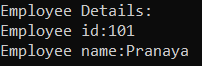
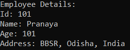
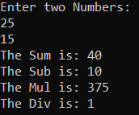
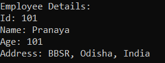
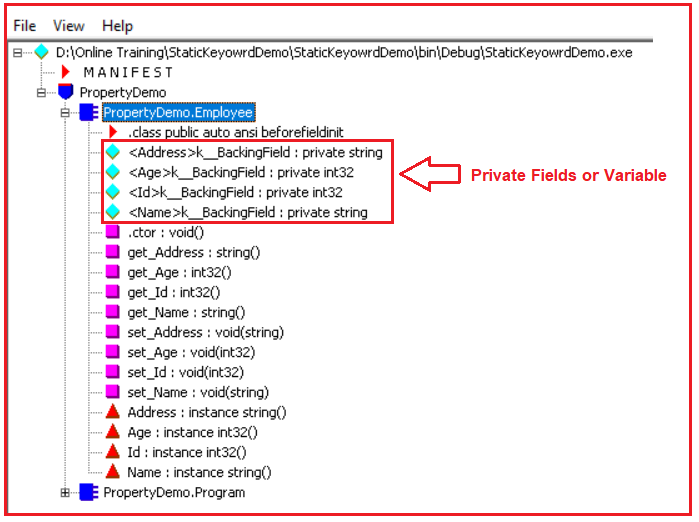
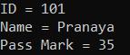
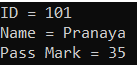

## **خواص در سی شارپ به همراه مثال**

در این مقاله، قصد دارم **ویژگی‌ها (Properties) در سی‌شارپ** به همراه مثال‌ها، صحبت کنم. در بخشی از این مقاله، قصد داریم نکات زیر در رابطه با ویژگی‌ها را به تفصیل مورد بحث قرار دهیم.

1. **چرا در سی شارپ به Property ها نیاز داریم؟**
2. **یک ویژگی (Property) در سی شارپ چیست؟**
3. **اکسسوری‌ها در سی شارپ چیستند؟**
4. **Set Accessor چیست؟**
5. **Get Accessor چیست؟**
6. **انواع مختلف ویژگی‌های پشتیبانی شده توسط C#.NET کدامند؟**
7. **خاصیت فقط خواندنی چیست؟**
8. **خاصیت Write Only چیست؟**
9. **خاصیت خواندن و نوشتن چیست؟**
10. **مزایای استفاده از Propertyها در سی شارپ چیست؟**
11. **اصلاحگر دسترسی پیش‌فرض Accessors در C# چیست؟**
12. **دسترسی‌های متقارن و نامتقارن در سی شارپ چیست؟**
13. **ویژگی‌های پیاده‌سازی خودکار در سی‌شارپ چیستند؟**
14. **چرا در برنامه‌های بلادرنگ به Properties نیاز داریم؟ با یک مثال توضیح دهید.**

##### **چرا در سی شارپ به Property ها نیاز داریم؟**

برای کپسوله‌سازی و محافظت از اعضای داده (یعنی فیلدها یا متغیرها) یک کلاس، در سی شارپ از ویژگی‌ها (properties) استفاده می‌کنیم. ویژگی‌ها در سی شارپ به عنوان مکانیزمی برای تنظیم و دریافت مقادیر اعضای داده یک کلاس خارج از آن کلاس استفاده می‌شوند. اگر یک کلاس حاوی مقداری در خود باشد و اگر بخواهیم به آن مقادیر خارج از آن کلاس دسترسی داشته باشیم، می‌توانیم به دو روش مختلف به آن مقادیر دسترسی پیدا کنیم. این دو روش به شرح زیر هستند:

1. با ذخیره کردن مقدار تحت یک متغیر عمومی، می‌توانیم به مقدار خارج از کلاس دسترسی مستقیم داشته باشیم.
2. با ذخیره آن مقدار در یک متغیر خصوصی، می‌توانیم با تعریف یک ویژگی برای آن متغیر، به آن مقدار در خارج از کلاس نیز دسترسی بدهیم.

##### **یک ویژگی (Property) در سی شارپ چیست؟**

یک ویژگی (Property) در سی شارپ (C#) عضوی از یک کلاس است که برای تنظیم و دریافت داده‌ها از یک فیلد داده (یعنی متغیر) از یک کلاس استفاده می‌شود. مهمترین نکته‌ای که باید به خاطر داشته باشید این است که یک ویژگی در سی شارپ هرگز برای ذخیره هیچ داده‌ای استفاده نمی‌شود، بلکه فقط به عنوان یک رابط یا واسطه برای انتقال داده‌ها عمل می‌کند. ما از ویژگی‌ها (Properties) به عنوان اعضای داده عمومی یک کلاس استفاده می‌کنیم، اما در واقع آنها متدهای خاصی به نام accessors هستند.

##### **اکسسوری‌ها در سی شارپ چیستند؟**

ارزیاب‌ها چیزی جز متدهای خاصی نیستند که برای تنظیم و دریافت مقادیر از عضو داده‌ی اصلی (یعنی متغیر) یک کلاس استفاده می‌شوند. ارزیاب‌ها دو نوع هستند. آن‌ها به شرح زیر هستند:

1. **تنظیم لوازم جانبی**
2. **دسترسی را دریافت کنید**

##### **Set Accessor چیست؟**

از **set** accessor برای تنظیم داده‌ها (یعنی مقدار) در یک فیلد داده، یعنی متغیری از یک کلاس، استفاده می‌شود. این set accessor شامل یک متغیر ثابت به نام **value** است . هر زمان که ما این ویژگی را برای تنظیم داده‌ها فراخوانی می‌کنیم، هر داده‌ای (مقداری) که ارائه می‌دهیم، به طور پیش‌فرض در متغیری به نام **value** ذخیره می‌شود . با استفاده از set accessor، نمی‌توانیم داده‌ها را دریافت کنیم.

**نحو:** **تنظیم {Data_Field_Name = value;}**

##### **دریافت دسترسی چیست؟**

تابع دسترسی get برای دریافت داده‌ها از فیلد داده (یعنی متغیر یک کلاس) استفاده می‌شود. با استفاده از تابع دسترسی get، ما فقط می‌توانیم داده‌ها را دریافت کنیم، نمی‌توانیم داده‌ها را تنظیم کنیم.

**نحو:** **دریافت {return Data_Field_Name;}**

##### **مثال برای درک ویژگی‌ها در سی شارپ:**

در مثال زیر، نحوه استفاده از Properties در سی شارپ را به شما نشان داده‌ام. در اینجا، ما دو کلاس به نام‌های Employee و Program ایجاد کرده‌ایم و می‌خواهیم به اعضای داده کلاس Employee در داخل کلاس Program دسترسی داشته باشیم. در کلاس Employee، دو عضو داده private (یعنی **_EmpId** و **_EmpName** ) ایجاد کرده‌ایم تا شناسه و نام Employee را نگه دارند و از آنجایی که این دو متغیر را private علامت‌گذاری کرده‌ایم، نمی‌توانیم مستقیماً از خارج از کلاس Employee به این دو عضو دسترسی داشته باشیم. نمی‌توانیم مستقیماً از کلاس Program به آنها دسترسی داشته باشیم. سپس برای این دو عضو داده، دو property عمومی به نام‌های **EmpId** و **EmpName** ایجاد کرده‌ایم تا به ترتیب شناسه و نام Employee را دریافت و تنظیم کنند. نکته‌ای که باید به خاطر داشته باشید این است که propertyها قرار نیست مقدار را ذخیره کنند، بلکه فقط مقادیر را منتقل می‌کنند. متغیرها قرار است داده‌ها را ذخیره کنند. علاوه بر این، کد مثال زیر خود توضیح است، بنابراین لطفاً از طریق خط نظرات به آن بپردازید.

```csharp
using System;

namespace PropertyDemo
{
    public class Employee
    {
        //Private Data Members
        private int _EmpId;
        private string _EmpName;

        //Public Properties
        public int EmpId
        {
            //The Set Accessor is used to set the _EmpId private variable value
            set
            {
                _EmpId = value;
            }
            //The Get Accessor is used to return the _EmpId private variable value
            get
            {
                return _EmpId;
            }
        }
        public string EmpName
        {
            //The Set Accessor is used to set the _EmpName private variable value
            set
            {
                _EmpName = value;
            }
            //The Get Accessor is used to return the _EmpName private variable value
            get
            {
                return _EmpName;
            }
        }
    }
    class Program
    {
        static void Main(string[] args)
        {
            Employee employee = new Employee();
            //We cannot access the private data members
            //So, using public properties (SET Accessor) we are setting
            //the values of private data members
            employee.EmpId = 101;
            employee.EmpName = "Pranaya";

            //Using public properties (Get Accessor) we are Getting
            //the values of private data members
            Console.WriteLine("Employee Details:");
            Console.WriteLine("Employee id:" + employee.EmpId);
            Console.WriteLine("Employee name:" + employee.EmpName);
            Console.ReadKey();
        }
    }
}
```

###### **خروجی:**



حال، ممکن است یک سوال داشته باشید. چرا متغیرها را عمومی (public) تعریف نمی‌کنیم؟ چرا متغیرها را به صورت خصوصی (private) ایجاد می‌کنیم و چرا برای آنها ویژگی‌های عمومی (public) ایجاد می‌کنیم؟ پاسخ، دستیابی به اصل کپسوله‌سازی (Encapsulation Principle) است. این موضوع را به طور مفصل هنگام بحث در مورد **اصل کپسوله‌سازی در سی‌شارپ (C#)** بررسی خواهیم کرد .

##### **انواع مختلف ویژگی‌های پشتیبانی شده توسط C#.NET چیست؟**

سی شارپ دات نت از چهار نوع ویژگی پشتیبانی می‌کند. آنها به شرح زیر هستند.

1. **خاصیت فقط خواندنی**
2. **فقط نوشتن ویژگی**
3. **خواندن نوشتن ویژگی**
4. **ویژگی پیاده‌سازی خودکار**

بیایید هر یک از ویژگی‌های فوق را با مثال‌هایی به تفصیل بررسی کنیم.

##### **خاصیت فقط خواندنی در سی شارپ چیست؟**

ویژگی فقط خواندنی (Read-Only Property) برای خواندن داده‌ها از فیلد داده استفاده می‌شود، یعنی داده‌های یک متغیر را می‌خواند. با استفاده از این ویژگی فقط خواندنی، نمی‌توانیم داده‌ها را در فیلد داده قرار دهیم. این ویژگی فقط شامل یک accessor خواهد بود، یعنی get accessor.  
**نحو:**  
**نوع داده AccessModifier نام ویژگی**  
**{**  
**دریافت {return DataFieldName;}**  
**}**

##### **خاصیت فقط نوشتن (Write only Property) در سی شارپ چیست؟**

ویژگی فقط نوشتن (Write-Only Property) برای نوشتن داده‌ها در فیلد داده استفاده می‌شود، یعنی داده‌ها را در متغیری از یک کلاس می‌نویسیم. با استفاده از این ویژگی فقط نوشتن، نمی‌توانیم داده‌ها را از فیلد داده بخوانیم. این ویژگی فقط شامل یک accessor خواهد بود، یعنی set accessor.  
**نحو:**  
**نوع داده AccessModifier نام ویژگی**  
**{**  
**تنظیم {DataFieldName = value;}**  
**}**

##### **خاصیت خواندن و نوشتن (Read Write) در سی شارپ چیست؟**

ویژگی خواندن-نوشتن (Read-Write Property) برای خواندن داده‌ها از فیلد داده و همچنین نوشتن داده‌ها در فیلد داده یک کلاس استفاده می‌شود. این ویژگی شامل دو accessor به نام‌های set و get خواهد بود. accessor set برای تنظیم یا نوشتن مقدار در یک فیلد داده و accessor get برای خواندن داده‌ها از یک متغیر استفاده می‌شود.  
**نحو:**  
**نوع داده AccessModifier نام ویژگی**  
**{**  
**تنظیم {DataFieldName = value;}**  
**دریافت {return DataFieldName;}**  
**}**

**نکته:** هر زمان که برای یک متغیر، ویژگی (property) ایجاد می‌کنیم، نوع داده‌ی ویژگی باید با نوع داده‌ی متغیر یکسان باشد. یک ویژگی هرگز نمی‌تواند هیچ آرگومانی بپذیرد.

##### **مثالی برای درک ویژگی خواندن و نوشتن در سی شارپ**

در مثال زیر، درون کلاس Employee، چهار متغیر خصوصی ایجاد کرده‌ایم و برای هر متغیر خصوصی، ویژگی‌های عمومی ایجاد کرده‌ایم. و هر ویژگی را با دسترسی‌های set و get ایجاد کرده‌ایم که آنها را به ویژگی‌های خواندنی و نوشتنی تبدیل می‌کند و با استفاده از این ویژگی‌ها می‌توانیم عملیات خواندنی و نوشتنی را انجام دهیم. نکته‌ای که باید به خاطر داشته باشید این است که نوع داده ویژگی و داده‌های متغیرهای مربوطه باید یکسان باشند، در غیر این صورت با خطای زمان کامپایل مواجه خواهید شد. سپس از متد Main، یک نمونه از کلاس Employee ایجاد می‌کنیم و سپس با استفاده از ویژگی‌های عمومی، مقادیر دریافتی را تنظیم می‌کنیم.

```csharp
using System;

namespace PropertyDemo
{
    public class Employee
    {
        //Private Data Members
        private int _EmpId, _Age;
        private string _EmpName, _Address;

        //Public Properties
        public int EmpId
        {
            //The Set Accessor is used to set the _EmpId private variable value
            set
            {
                _EmpId = value;
            }
            //The Get Accessor is used to return the _EmpId private variable value
            get
            {
                return _EmpId;
            }
        }

        public int Age
        {
            //The Set Accessor is used to set the _Age private variable value
            set
            {
                _Age = value;
            }
            //The Get Accessor is used to return the _Age private variable value
            get
            {
                return _Age;
            }
        }
        public string EmpName
        {
            //The Set Accessor is used to set the _EmpName private variable value
            set
            {
                _EmpName = value;
            }
            //The Get Accessor is used to return the _EmpName private variable value
            get
            {
                return _EmpName;
            }
        }
        public string Address
        {
            //The Set Accessor is used to set the _Address private variable value
            set
            {
                _Address = value;
            }
            //The Get Accessor is used to return the _Address private variable value
            get
            {
                return _Address;
            }
        }
    }
    class Program
    {
        static void Main(string[] args)
        {
            Employee employee = new Employee();
            //We cannot access the private data members
            //So, using public properties (SET Accessor) we are setting
            //the values of private data members
            employee.EmpId = 101;
            employee.Age = 101;
            employee.EmpName = "Pranaya";
            employee.Address = "BBSR, Odisha, India";

            //Using public properties (Get Accessor) we are Getting
            //the values of private data members
            Console.WriteLine("Employee Details:");
            Console.WriteLine($"Id: {employee.EmpId}");
            Console.WriteLine($"Name: {employee.EmpName}");
            Console.WriteLine($"Age: {employee.Age}");
            Console.WriteLine($"Address: {employee.Address}");
            Console.ReadKey();
        }
    }
}
```

###### **خروجی:**



در مثال بالا، فیلدهای داده یا متغیرهای کلاس Employee را به صورت private تعریف کردیم. در نتیجه، این فیلدهای داده یا متغیرها مستقیماً از خارج از کلاس Employee قابل دسترسی نیستند. بنابراین، در اینجا، در کلاس Program که خارج از کلاس Employee است، داده‌ها را با کمک ویژگی‌ها به داخل فیلد داده یا متغیرها منتقل کردیم.

##### **مثالی برای درک ویژگی‌های فقط خواندنی و فقط نوشتنی در سی شارپ:**

در مثال زیر، درون کلاس Calculator، سه متغیر خصوصی ایجاد کرده‌ایم. سپس برای این سه متغیر خصوصی، دو ویژگی فقط نوشتنی (ویژگی با دسترسی set) برای متغیرهای _Number1 و _Number2 و یک ویژگی فقط خواندنی (ویژگی با دسترسی get) برای متغیر _Result ایجاد کرده‌ایم. با استفاده از ویژگی فقط نوشتنی، فقط می‌توانیم مقادیر را تنظیم کنیم و با استفاده از ویژگی فقط خواندنی، می‌توانیم مقدار را دریافت کنیم. سپس از متد Main کلاس Program، یک نمونه از کلاس Calculator ایجاد می‌کنیم و به ویژگی‌های فقط خواندنی و فقط نوشتنی دسترسی پیدا می‌کنیم.

```csharp
using System;

namespace PropertyDemo
{
    public class Calculator
    {
        int _Number1, _Number2, _Result;

        //Write-Only Properties
        //Only Set Accessor, No Get Accessor
        public int SetNumber1
        {
            set
            {
                _Number1 = value;
            }
        }
        public int SetNumber2
        {
            set
            {
                _Number2 = value;
            }
        }

        //Read-Only Property
        //Only Get Accessor, No Set Accessor
        public int GetResult
        {
            get
            {
                return _Result;
            }
        }
        public void Add()
        {
            _Result = _Number1 + _Number2;
        }
        public void Sub()
        {
            _Result = _Number1 - _Number2;
        }
        public void Mul()
        {
            _Result = _Number1 * _Number2;
        }
        public void Div()
        {
            _Result = _Number1 / _Number2;
        }
    }
    class Program
    {
        static void Main(string[] args)
        {
            Calculator calculator = new Calculator();
            Console.WriteLine("Enter two Numbers:");
            calculator.SetNumber1 = int.Parse(Console.ReadLine());
            calculator.SetNumber2 = int.Parse(Console.ReadLine());

            calculator.Add();
            Console.WriteLine($"The Sum is: {calculator.GetResult}");

            calculator.Sub();
            Console.WriteLine($"The Sub is: {calculator.GetResult}");

            calculator.Mul();
            Console.WriteLine($"The Mul is: {calculator.GetResult}");

            calculator.Div();
            Console.WriteLine($"The Div is: {calculator.GetResult}");
            Console.ReadKey();
        }
    }
}
```

###### **خروجی:**



##### **مزایای استفاده از Property ها در سی شارپ چیست؟**

1. ویژگی‌ها (Properties) انتزاع (abstraction) را برای فیلدهای داده فراهم می‌کنند.
2. آنها همچنین امنیت فیلدهای داده را فراهم می‌کنند.
3. ویژگی‌ها همچنین می‌توانند داده‌ها را قبل از ذخیره در فیلدهای داده، اعتبارسنجی کنند.

نکات فوق را با مثال‌های عملی توضیح خواهم داد.

##### **مشخص کننده دسترسی پیش فرض Accessors در C# چیست؟**

مشخص‌کننده‌ی دسترسی پیش‌فرض برای accessor همان مشخص‌کننده‌ی دسترسی برای property است. برای مثال:  
**شناسه عمومی از نوع عدد صحیح (EmpId)**  
**{**  
**تنظیم** **{** **_EmpId = value؛** **}**  
**دریافت** **{** **return _EmpId؛** **}**  
**}**  
در مثال بالا، ویژگی Empid به صورت عمومی تعریف شده است. بنابراین، تابع دسترسی set و get نیز عمومی خواهند بود. اگر ویژگی خصوصی باشد، هر دو تابع دسترسی set و get نیز خصوصی خواهند بود.

##### **اکسسوری‌های متقارن و نامتقارن در سی شارپ چیستند؟**

اگر مشخص‌کننده‌ی دسترسیِ accessorها (هم get و هم set) در یک مشخص‌کننده‌ی دسترسیِ property یکسان باشند، accessorها به عنوان accessorهای متقارن شناخته می‌شوند. از سوی دیگر، اگر مشخص‌کننده‌ی دسترسی accessorها با مشخص‌کننده‌ی دسترسیِ property یکسان نباشد، accessorها به عنوان accessorهای نامتقارن شناخته می‌شوند. به عنوان مثال:

**شناسه عمومی از نوع عدد صحیح (EmpId)**  
**{**  
**مجموعه محافظت‌شده** **{** **_EmpId = value؛** **}**  
**دریافت** **{** **return _EmpId؛** **}**  
**}**

در ویژگی فوق، تابع دسترسی set به صورت protected تعریف شده است در حالی که تابع دسترسی get به صورت پیش‌فرض public است، بنابراین به عنوان asymmetric شناخته می‌شوند. به طور کلی، توابع دسترسی نامتقارن در فرآیند ارث‌بری استفاده می‌شوند. ما این موضوع را به طور مفصل در مبحث **اصول شیءگرایی**  ارث‌بری در سی‌شارپ بررسی خواهیم کرد.

همچنین می‌توانیم ویژگی فقط خواندنی را با استفاده از دو accessor به صورت زیر بنویسیم.  
**شناسه عمومی از نوع عدد صحیح (EmpId)**  
**{**  
**مجموعه خصوصی** **{** **_EmpId = value؛** **}**  
**دریافت** **{** **return _EmpId؛** **}**  
**}**

همچنین می‌توانیم ویژگی Write only را با استفاده از دو accessor به صورت زیر بنویسیم.  
**شناسه عمومی از نوع عدد صحیح (EmpId)**  
**{**  
**تنظیم** **{** **_EmpId = value؛** **}**  
**خصوصی دریافت کنید** **{** **return _EmpId؛** **}**  
**}**

**نکته:** نکته‌ای که باید به خاطر داشته باشید این است که وقتی accessor را به صورت private تعریف می‌کنید، دیگر نمی‌توانید از خارج از کلاس به آن accessor دسترسی داشته باشید.

##### **ویژگی‌های پیاده‌سازی خودکار در سی‌شارپ چیستند؟**

اگر هنگام تنظیم و دریافت داده‌ها از یک فیلد داده، یعنی از یک متغیر از یک کلاس، منطق اضافی ندارید، می‌توانید از ویژگی‌های پیاده‌سازی خودکار که به عنوان بخشی از C# 3.0 معرفی شده‌اند، استفاده کنید. ویژگی پیاده‌سازی خودکار در C# میزان کدی را که باید بنویسیم کاهش می‌دهد. وقتی از ویژگی‌های پیاده‌سازی خودکار استفاده می‌کنیم، کامپایلر C# به طور ضمنی یک فیلد یا متغیر خصوصی و ناشناس برای آن ویژگی در پشت صحنه ایجاد می‌کند که قرار است داده‌ها را در خود نگه دارد.  
**سینتکس: Access_specifier نوع داده Property_Name { get; set; }**  
**مثال: public int A { get; set; }**

##### **مثالی برای درک ویژگی‌های پیاده‌سازی خودکار در سی‌شارپ:**

در مثال زیر، من استفاده از ویژگی‌های پیاده‌سازی خودکار (Auto Implemented Properties) را در سی‌شارپ نشان می‌دهم. لطفاً به کلاس Employee توجه کنید. در کلاس Employee، ما هیچ فیلد داده یا متغیر خصوصی برای نگهداری داده‌ها ایجاد نکرده‌ایم. اما چهار ویژگی پیاده‌سازی خودکار (Auto Implemented Properties) ایجاد کرده‌ایم. وقتی ویژگی‌های پیاده‌سازی خودکار را ایجاد می‌کنیم، در پشت صحنه، کامپایلر فیلد ناشناس خصوصی را برای هر ویژگی برای نگهداری داده‌ها ایجاد می‌کند.

```csharp
using System;

namespace PropertyDemo
{
    public class Employee
    {
        public int Id { get; set; }
        public int Age { get; set; }
        public string Name { get; set; }
        public string Address { get; set; }

    }
    class Program
    {
        static void Main(string[] args)
        {
            Employee employee = new Employee();
            employee.Id = 101;
            employee.Age = 101;
            employee.Name = "Pranaya";
            employee.Address = "BBSR, Odisha, India";

            Console.WriteLine("Employee Details:");
            Console.WriteLine($"Id: {employee.Id}");
            Console.WriteLine($"Name: {employee.Name}");
            Console.WriteLine($"Age: {employee.Age}");
            Console.WriteLine($"Address: {employee.Address}");
            Console.ReadKey();
        }
    }
}
```

###### **خروجی:**



حال، اگر کد IL کلاس Employee را با استفاده از ابزار ILDASM تأیید کنید، خواهید دید که چهار متغیر خصوصی در پشت صحنه توسط کامپایلر ایجاد می‌شوند، همانطور که در تصویر زیر نشان داده شده است.



##### **چرا در برنامه‌های بلادرنگ سی‌شارپ به ویژگی‌ها (Properties) نیاز داریم؟**

اعلام فیلدها یا متغیرهای کلاس به صورت عمومی (public) و افشای آن فیلدها یا متغیرها به دنیای خارج (که به معنای خارج از کلاس است) کار بدی است زیرا ما هیچ کنترلی بر آنچه اختصاص داده می‌شود و آنچه بازگردانده می‌شود، نداریم. بیایید این موضوع را با یک مثال درک کنیم.

```csharp
using System;

namespace PropertyDemo
{
    public class Student
    {
        public int ID;
        public string Name;
        public int PassMark;
    }
    class Program
    {
        static void Main(string[] args)
        {
            Student student = new Student();
            student.ID = -100;
            student.Name = null;
            student.PassMark = 0;
            Console.WriteLine($"ID = {student.ID}, Name = {student.Name}, PassMark = {student.PassMark}");
            Console.ReadKey();
        }
    }
}
```

###### خروجی:

 نیاز داریم؟")

##### **مشکلات مربوط به فیلدهای عمومی فوق به شرح زیر است**

1. 1. مقدار شناسه (ID) همیشه باید یک عدد غیر منفی باشد.
		2. نام را نمی‌توان روی NULL تنظیم کرد.
		3. اگر نام دانش‌آموزی وجود ندارد، باید عبارت «بدون نام» را برگردانیم.
		4. مقدار PassMark همیشه باید فقط خواندنی باشد.

زبان‌های برنامه‌نویسی مانند C++ و جاوا این ویژگی مفهومی را ندارند و چنین زبان‌های برنامه‌نویسی از متدهای getter و setter برای کپسوله‌سازی و محافظت از فیلدها استفاده می‌کنند.

##### **مثال استفاده از متدهای Setter و Getter در سی شارپ:**

بیایید مثال قبلی را با استفاده از متدهای setter و getter بازنویسی کنیم تا به الزامات فوق دست یابیم. برای هر متغیر یا فیلد داده، باید متدهای setter یا getter را مطابق با الزامات خود بنویسیم. در اینجا، ما متدهای setter و getter را برای متغیرهای _ID و _Name نوشته‌ایم تا مقادیر ID و Name را تنظیم و دریافت کنند. از سوی دیگر، ما فقط متدهای getter را برای متغیر _PassMark داریم، بنابراین از خارج از کلاس، نمی‌توانیم مقدار PassMark را تنظیم کنیم. مجدداً، درون ویژگی‌های setter و getter، منطقی برای اعتبارسنجی داده‌ها قبل از ذخیره و بازگشت نیز نوشته‌ایم.

```csharp
using System;

namespace PropertyDemo
{
    public class Student
    {
        private int _ID;
        private string _Name;
        private int _PassMark = 35;
        public void SetID(int ID)
        {
            if (ID < 0)
            {
                throw new Exception("ID value should be greater than zero");
            }
            _ID = ID;
        }
        public int GetID()
        {
            return _ID;
        }
        public void SetName(string Name)
        {
            if (string.IsNullOrEmpty(Name))
            {
                throw new Exception("Name should not be empty");
            }
            _Name = Name;
        }
        public string GetName()
        {
            if (string.IsNullOrEmpty(_Name))
            {
                return "No Name";
            }
            return _Name;
        }
        public int GetPassMark()
        {
            return _PassMark;
        }
    }
    class Program
    {
        static void Main(string[] args)
        {
            Student student = new Student();
            student.SetID(101);
            student.SetName("Pranaya");
            
            Console.WriteLine($"ID = {student.GetID()}");
            Console.WriteLine($"Name = {student.GetName()}");
            Console.WriteLine($"Pass Mark = {student.GetPassMark()}");
            Console.ReadKey();
        }
    }
}
```

###### **خروجی:**



##### **مثال استفاده از ویژگی‌ها در سی شارپ:**

مزیت ویژگی‌ها نسبت به متدهای سنتی getter() و setter() این است که می‌توانیم به آنها دسترسی داشته باشیم زیرا آنها فیلدهای عمومی هستند، نه متد. بیایید همان برنامه را با استفاده از ویژگی‌ها بازنویسی کنیم تا به همان الزامات برسیم.

```csharp
using System;

namespace PropertyDemo
{
    public class Student
    {
        private int _ID;
        private string _Name;
        private int _PassMark = 35;
        public int ID
        {
            set
            {
                if (value < 0)
                {
                    throw new Exception("ID value should be greater than zero");
                }
                _ID = value;
            }
            get
            {
                return _ID;
            }
        }
        public string Name
        {
            set
            {
                if (string.IsNullOrEmpty(value))
                {
                    throw new Exception("Name should not be empty");
                }
                _Name = value;
            }
            get
            {
                return string.IsNullOrEmpty(_Name) ? "No Name" : _Name;
            }
        }
        public int PassMark
        {
            get
            {
                return _PassMark;
            }
        }
    }
    class Program
    {
        static void Main(string[] args)
        {
            Student student = new Student();
            student.ID = 101;
            student.Name = "Pranaya";
            
            Console.WriteLine($"ID = {student.ID}");
            Console.WriteLine($"Name = {student.Name}");
            Console.WriteLine($"Pass Mark = {student.PassMark}");
            Console.ReadKey();
        }
    }
}
```

###### **خروجی:**

