## انواع داده در سی شارپ با مثال

در این مقاله، قصد دارم **انواع داده در سی شارپ را** با مثال‌هایی مورد بحث قرار دهم. به عنوان یک توسعه‌دهنده، درک نوع داده در سی شارپ بسیار مهم است. دلیل این امر این است که شما باید تصمیم بگیرید از کدام نوع داده برای یک نوع خاص از مقدار استفاده کنید.

##### **انواع داده:**

حالا بیایید بفهمیم انواع داده‌های مختلف موجود در دات‌نت چیست و کدام نوع داده در سی‌شارپ در چه سناریویی مناسب است. دلیل اینکه می‌خواهم روی این موضوع تمرکز کنم این است که اغلب اوقات توسعه‌دهندگان دات‌نت از انواع داده‌های محدودی استفاده می‌کنند. خواهید دید که اغلب اوقات به عنوان یک توسعه‌دهنده دات‌نت، ما با استفاده از انواع داده‌های int، bool، double، string و Datetime آشنا هستیم. این پنج نوع داده بیشتر توسط توسعه‌دهندگان دات‌نت استفاده می‌شوند. به دلیل استفاده محدود از انواع داده‌ها، از نظر بهینه‌سازی و عملکرد ضرر می‌کنیم. بنابراین، در پایان این مقاله، شما خواهید فهمید که انواع داده‌های مختلف موجود در دات‌نت چیست و در کدام سناریو باید از کدام نوع داده استفاده کنید.

##### **چرا در سی شارپ به انواع داده نیاز داریم؟**

انواع داده در سی شارپ اساساً برای ذخیره موقت داده‌ها در کامپیوتر از طریق یک برنامه استفاده می‌شوند. در دنیای واقعی، ما انواع مختلفی از داده‌ها مانند اعداد صحیح، اعداد اعشاری، کاراکترها، بولی، رشته‌ها و غیره داریم. برای ذخیره همه این انواع مختلف داده‌ها در یک برنامه برای انجام عملیات مربوط به تجارت، به انواع داده نیاز داریم.

##### **نوع داده در سی شارپ چیست؟**

انواع داده چیزی است که اطلاعاتی در مورد ... می‌دهد.

1. **اندازه**   مکان حافظه.
2. محدوده **داده‌هایی**   که می‌توانند در آن مکان حافظه ذخیره شوند
3. ممکن **عملیات قانونی** که می‌توانند در آن مکان حافظه انجام شوند.
4. چه **نوع نتایجی** از یک عبارت حاصل می‌شود وقتی این نوع‌ها درون آن عبارت استفاده شوند؟

کلمه کلیدی که تمام اطلاعات فوق را ارائه می‌دهد، نوع داده در سی شارپ نامیده می‌شود.

##### **انواع مختلف انواع داده موجود در سی شارپ چیست؟**

نوع داده در سی شارپ، نوع داده‌ای را که یک متغیر می‌تواند ذخیره کند، مشخص می‌کند، مانند عدد صحیح، عدد اعشاری، بولی، کاراکتری، رشته‌ای و غیره. نمودار زیر انواع مختلف انواع داده موجود در سی شارپ را نشان می‌دهد.

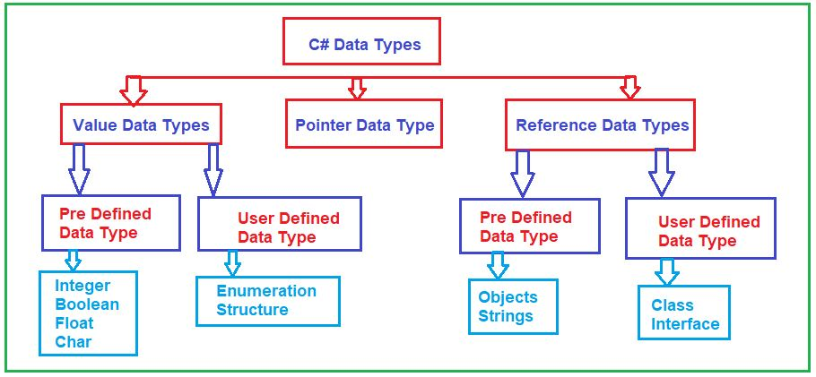

سه نوع داده در زبان سی شارپ وجود دارد.

1. **انواع داده‌های مقداری**
2. **انواع داده‌های مرجع**
3. **انواع داده اشاره‌گر**

بیایید هر یک از این انواع داده را با جزئیات مورد بحث قرار دهیم

##### **نوع داده مقداری (Value Data Type) در سی شارپ چیست؟**

نوع داده‌ای که مقدار را مستقیماً در حافظه ذخیره می‌کند، در سی‌شارپ، نوع داده مقداری (Value Data Type) نامیده می‌شود. مثال‌های آن عبارتند از int، char، boolean و float که به ترتیب اعداد، حروف الفبا، true/false و اعداد اعشاری را ذخیره می‌کنند. اگر تعریف این نوع داده‌ها را بررسی کنید، خواهید دید که نوع همه این نوع داده‌ها struct خواهد بود. و struct یک نوع مقداری در سی‌شارپ است. انواع داده مقداری در سی‌شارپ نیز به دو نوع طبقه‌بندی می‌شوند که در ادامه آمده است.

1. **انواع داده‌های از پیش تعریف‌شده** \- مثال شامل عدد صحیح، بولی، بولی، بلند، دوبل، اعشاری و غیره است.
2. **انواع داده تعریف‌شده توسط کاربر** \- مثال شامل ساختار، شمارش و غیره می‌شود.

قبل از اینکه نحوه استفاده از انواع داده در زبان برنامه‌نویسی خود را بفهمیم، ابتدا اجازه دهید نحوه نمایش داده‌ها در یک کامپیوتر را درک کنیم.

##### **چگونه داده‌ها در کامپیوتر نمایش داده می‌شوند؟**

قبل از اینکه به بحث در مورد نحوه استفاده از انواع داده بپردازیم، ابتدا باید بفهمیم که داده‌ها چگونه در کامپیوتر نمایش داده می‌شوند؟ بیایید این را درک کنیم. لطفاً به نمودار زیر نگاهی بیندازید. ببینید، روی هارد دیسک کامپیوتر شما، مقداری داده دارید، مثلاً A. این داده‌ها می‌توانند در قالب‌های مختلفی باشند، می‌توانند یک تصویر باشند، می‌توانند یک الفبا باشند، می‌توانند رقم باشند، می‌توانند یک فایل PDF باشند و غیره. فرض کنید که مقداری داده به نام A دارید. اکنون، می‌دانیم که کامپیوتر فقط می‌تواند اعداد دودویی یعنی ۰ و ۱ را درک کند. بنابراین، حرف A در کامپیوتر به صورت ۸ بیت نمایش داده می‌شود، یعنی ۰۱۰۰۰۰۰۱ (۶۵ مقدار ASCII است و از این رو عدد اعشاری ۶۵ به معادل دودویی آن یعنی ۰۱۰۰۰۰۰۱ تبدیل می‌شود). بنابراین، ۰ و ۱ها بیت نامیده می‌شوند. بنابراین، برای ذخیره هر داده‌ای در کامپیوتر، به این قالب ۸ بیتی نیاز داریم. و این ۸ بیت کامل، یک بایت نامیده می‌شود. حال، به عنوان یک توسعه‌دهنده دات نت، نمایش داده‌ها در قالب دودویی یعنی با استفاده از ۰ و ۱ برای ما بسیار دشوار است. بنابراین، در اینجا، در زبان سی شارپ می‌توانیم از قالب اعشاری استفاده کنیم. کاری که می‌توانیم انجام دهیم این است که قالب دودویی را به اعشاری تبدیل می‌کنیم و کامپیوتر به صورت داخلی قالب اعشاری را به قالب بایت (قالب دودویی) نگاشت می‌کند و سپس با استفاده از بایت می‌توانیم داده‌ها را نمایش دهیم. بنابراین، می‌توانید مشاهده کنید که نمایش بایتی عدد اعشاری ۶۵ به صورت ۰۱۰۰۰۰۱ است.

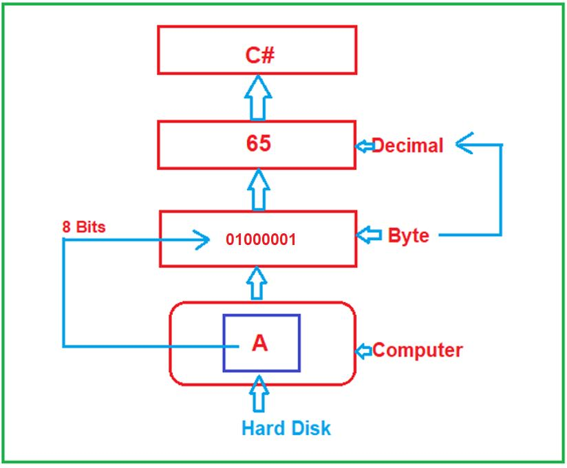

حالا، بیایید ادامه دهیم و سعی کنیم انواع داده‌های مختلف ارائه شده توسط چارچوب دات‌نت را که با زبان برنامه‌نویسی سی‌شارپ استفاده می‌شوند، درک کنیم.

##### **نوع داده بایت در سی شارپ چیست؟**

این یک نوع داده .NET است که برای نمایش یک **عدد صحیح بدون علامت 8 بیتی** استفاده می‌شود . بنابراین، در اینجا، ممکن است یک سوال داشته باشید، **منظور از بدون علامت چیست؟** بدون علامت فقط به معنای مقادیر مثبت است. از آنجایی که نشان دهنده یک عدد صحیح بدون علامت 8 بیتی است، بنابراین می‌تواند 2 را ذخیره کند. <sup>۸ </sup> یعنی ۲۵۶ عدد. از آنجایی که فقط اعداد مثبت را ذخیره می‌کند، بنابراین حداقل مقداری که می‌تواند ذخیره کند ۰ و حداکثر مقداری که می‌تواند ذخیره کند ۲۵۵ است. حال، اگر به تعریف بایت بروید، موارد زیر را خواهید دید.

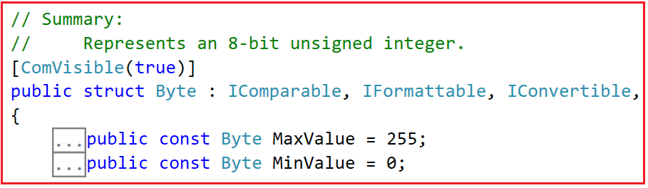

حال، اگر می‌خواهید مقادیر مثبت و منفی را ذخیره کنید، باید از نوع داده بایت علامت‌دار یعنی SByte استفاده کنید. این نوع داده SByte یک عدد صحیح علامت‌دار ۸ بیتی را نشان می‌دهد. در این صورت حداکثر و حداقل مقادیر چه خواهند بود؟ به یاد داشته باشید وقتی یک نوع داده علامت‌دار است، می‌تواند مقادیر مثبت و منفی را در خود نگه دارد. در این صورت، حداکثر باید بر دو تقسیم شود، یعنی ۲۵۶/۲ که می‌شود ۱۲۸. بنابراین، ۱۲۸ عدد مثبت و ۱۲۸ عدد منفی را ذخیره می‌کند. بنابراین، در این حالت، اعداد مثبت از ۰ تا ۱۲۷ و اعداد منفی از -۱ تا -۱۲۸ خواهند بود. برای درک بهتر، لطفاً به تعریف نوع داده SByte مراجعه کنید و موارد زیر را مشاهده خواهید کرد.

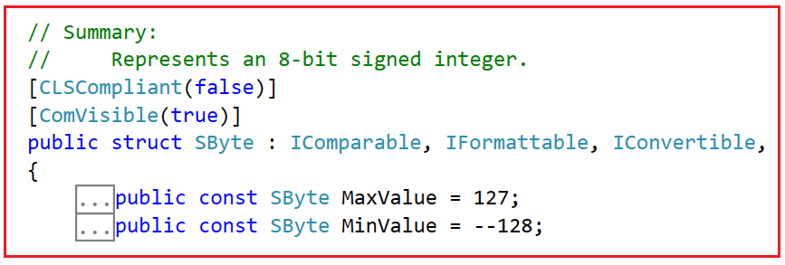

##### **کد اسکی:**

برای درک دقیق نوع داده بایت، باید چیزی به نام کد ASCII را درک کنیم. برای درک کدهای ASCII لطفاً از لینک زیر دیدن کنید. ASCII مخفف عبارت American Standard Code for Information Interchange (کد استاندارد آمریکایی برای تبادل اطلاعات) است.

[**https://www.cs.cmu.edu/~pattis/15-1XX/common/handouts/ascii.html**](https://www.cs.cmu.edu/~pattis/15-1XX/common/handouts/ascii.html)

وقتی از سایت بالا بازدید می‌کنید، جدول زیر را مشاهده خواهید کرد که عدد اعشاری و کاراکتر یا نماد معادل آن را نشان می‌دهد.

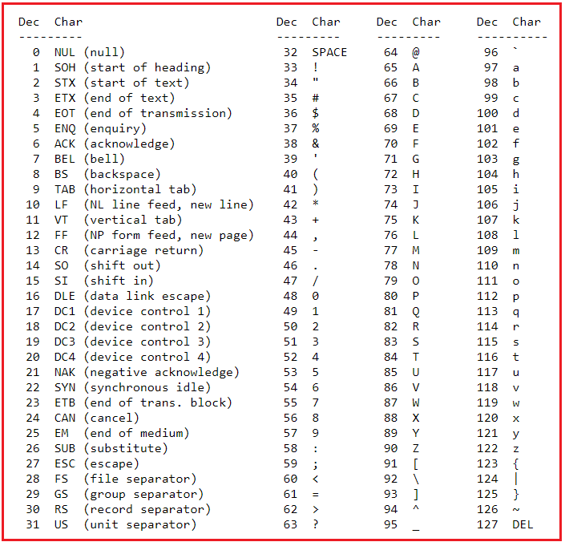

ما قبلاً در مورد نحوه تبدیل اعداد دهدهی به دودویی بحث کرده‌ایم. حال، فرض کنید می‌خواهید عدد دهدهی ۶۶ را ذخیره کنید که نمایش دودویی آن یعنی ۱۰۰۰۰۱۰ است. و در جدول بالا می‌توانید ببینید که حرف بزرگ B معادل کاراکتری ۶۶ است.

##### **مثال برای درک انواع داده Byte و SByte در سی شارپ:**

لطفاً برای درک نوع داده Byte و SByte در سی شارپ، به مثال زیر نگاهی بیندازید. کد مثال زیر نیازی به توضیح ندارد، بنابراین لطفاً خطوط توضیح را مطالعه کنید. در مثال زیر، نشان می‌دهیم که چه مقدار یا داده‌ای را می‌توانیم ذخیره کنیم و چه مقدار را نمی‌توانیم ذخیره کنیم و همچنین حداکثر و حداقل مقداری را که می‌توانیم در متغیر Byte و SByte ذخیره کنیم، و همچنین اندازه انواع داده Byte و SByte را نشان می‌دهیم. همچنین اندازه نوع داده byte را با استفاده از عملگر sizeof چاپ می‌کنیم.

``` csharp
using System;
namespace DataTypesDemo
{
    class Program
    {
        static void Main(string[] args)
        {
            byte b1 = 66;
            //You cannot store negative number using byte data type.
            //The following statement will give compile time error
            //byte b2 = -100;

            //The following Statement will give compile time error
            //The maximum value you can store in a byte variable is 255
            //byte b3 = 256;

            Console.WriteLine($"Decimal: {b1}");
            Console.WriteLine($"ASCII Equivalent Character of {b1} is {(char)b1}");
            Console.WriteLine($"Byte Min Value:{sbyte.MinValue} and Max Value:{sbyte.MaxValue}");
            Console.WriteLine($"Byte Size:{sizeof(sbyte)} Byte");
            
            sbyte sb1 = 66;
            //You can store negative number using sbyte data type.
            //The following statement will not give compile time error
            sbyte sb2 = -100;

            //The following Statement will give compile time error
            //The maximum value you can store in a sbyte variable is 128
            //sbyte sb3 = 128;

            //The following Statement will give compile time error
            //The minimum value you can store in a sbyte variable is -128
            //sbyte sb4 = -129;

            Console.WriteLine($"\nDecimal: {sb1}");
            Console.WriteLine($"ASCII Equivalent Character of {sb1} is {(char)sb1}");
            Console.WriteLine($"ASCII Equivalent Character of {sb2} is {(char)sb2}");
            Console.WriteLine($"SByte Min Value:{sbyte.MinValue} and Max Value:{sbyte.MaxValue}");
            Console.WriteLine($"SByte Size:{sizeof(sbyte)} Byte");

            Console.ReadKey();
        }
    }
}
```
###### **خروجی:**

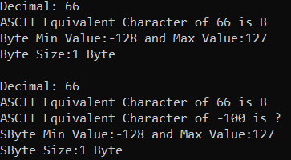

**نکته:** مهمترین نکته‌ای که باید به خاطر داشته باشید این است که اگر می‌خواهید اعداد صحیح بدون علامت ۱ بایتی را نمایش دهید، باید از نوع داده Byte در C# استفاده کنید. به عبارت دیگر، می‌توانیم بگوییم که اگر می‌خواهید اعداد از ۰ تا حداکثر ۲۵۵ یا مقدار ASCII این اعداد را ذخیره کنید، باید از نوع داده Byte در .NET Framework استفاده کنید. و اگر می‌خواهید اعداد از -۱۲۸ تا ۱۲۷ یا مقادیر ASCII معادل آنها را ذخیره کنید، باید از نوع داده SByte استفاده کنید.

##### **نوع داده char در سی شارپ چیست؟**

char یک نوع داده با طول ۲ بایت است که می‌تواند شامل داده‌های یونیکد باشد. یونیکد چیست؟ یونیکد استانداردی برای رمزگذاری و رمزگشایی کاراکتر برای رایانه‌ها است. ما می‌توانیم از قالب‌های مختلف رمزگذاری یونیکد مانند UTF-8(8-bit)، UTF-16(16-bit) و غیره استفاده کنیم. طبق تعریف char، یک کاراکتر را به عنوان یک واحد کد UTF-16 نشان می‌دهد. UTF-16 به معنای طول ۱۶ بیتی است که چیزی جز ۲ بایت نیست.

باز هم، این یک نوع داده علامت‌دار است، به این معنی که فقط می‌تواند اعداد مثبت را ذخیره کند. اگر به تعریف نوع داده char بروید، حداکثر و حداقل مقادیر را به شرح زیر مشاهده خواهید کرد.

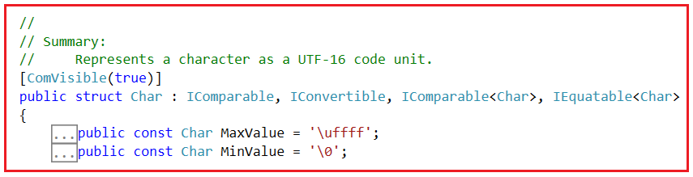

در اینجا، نماد ASCII '\\uffff' نشان دهنده 65535 و '\\0' نشان دهنده 0 است. از آنجایی که char طولی معادل 2 بایت دارد، بنابراین شامل 2 خواهد بود. <sup>۱۶ </sup> اعداد، یعنی ۶۵۵۳۶. بنابراین، حداقل عدد ۰ و حداکثر عدد ۶۵۵۳۵ است. برای درک بهتر، لطفاً به مثال زیر نگاهی بیندازید.

``` csharp
using System;
namespace DataTypesDemo
{
    class Program
    {
        static void Main(string[] args)
        {
            char ch = 'B';
            Console.WriteLine($"Char: {ch}");
            Console.WriteLine($"Equivalent Number: {(byte)ch}");
            Console.WriteLine($"Char Minimum: {(int)char.MinValue} and Maximum: {(int)char.MaxValue}");
            Console.WriteLine($"Char Size: {sizeof(char)} Byte");

            Console.ReadKey();
        }
    }
}
```

###### **خروجی:**

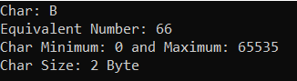

حالا، ممکن است یک سوال برایتان پیش بیاید. در اینجا، ما حرف B را با استفاده از نوع داده char نمایش می‌دهیم که ۲ بایت فضا اشغال می‌کند. همچنین می‌توانیم این حرف B را با استفاده از نوع داده byte نمایش دهیم که ۱ بایت فضا اشغال می‌کند. حال، اگر بایت و char یک کار را انجام می‌دهند، پس چرا به نوع داده char نیاز داریم که ۱ بایت حافظه اضافی اشغال می‌کند؟

##### **چرا نوع داده char در سی شارپ؟**

ببینید، با استفاده از نوع داده byte ما فقط می‌توانیم حداکثر ۲۵۶ کاراکتر یا به عبارت دیگر مقادیر ASCII را نمایش دهیم. Byte حداکثر ۲۵۶ نماد/کاراکتر را در خود جای می‌دهد، پس از ۲۵۶ نماد/کاراکتر، اگر بخواهیم نمادهای اضافی مانند الفبای هندی، الفبای چینی یا برخی نمادهای خاص که جزئی از کاراکترهای ASCII نیستند را ذخیره کنیم، با نوع داده byte این کار امکان‌پذیر نیست، زیرا ما از قبل حداکثر نمادها یا کاراکترها را ذخیره کرده‌ایم. بنابراین، char یک نمایش کاراکتر یونیکد است، طول آن ۲ بایت است و از این رو می‌توانیم نمادهای منطقه‌ای، نمادهای اضافی و کاراکترهای ویژه را با استفاده از نوع داده char در C# ذخیره کنیم.

بنابراین، به عبارت دیگر، اگر از نمایش ASCII استفاده می‌کنید، نوع داده بایت مناسب است. اما اگر در حال توسعه یک برنامه چندزبانه هستید، باید از نوع داده char استفاده کنید. برنامه چندزبانه به برنامه‌هایی گفته می‌شود که از چندین زبان مانند هندی، چینی، انگلیسی، اسپانیایی و غیره پشتیبانی می‌کنند.

حال، ممکن است شما یک استدلال مخالف داشته باشید که چرا همیشه از نوع داده char به جای نوع داده byte استفاده نکنیم، زیرا char دو بایت است و می‌تواند تمام نمادهای موجود در جهان را ذخیره کند. پس چرا باید از نوع داده byte استفاده کنم؟ حال، به یاد داشته باشید که char اساساً برای نمایش کاراکترهای یونیکد استفاده می‌شود. و وقتی داده‌های char را می‌خوانیم، به صورت داخلی نوعی تبدیل انجام می‌دهد. و برخی سناریوها وجود دارد که شما نمی‌خواهید چنین نوع تبدیل یا رمزگذاری را انجام دهید.

فرض کنید یک فایل تصویر خام دارید. فایل تصویر خام هیچ ارتباطی با آن تبدیل‌ها ندارد. در سناریوهایی مانند این، می‌توانیم از نوع داده Byte استفاده کنیم. چیزی به نام آرایه بایت وجود دارد که می‌توانید در موقعیت‌هایی مانند این از آن استفاده کنید.

بنابراین، نوع داده byte برای خواندن داده‌های خام یا داده‌های دودویی یا داده‌ها بدون انجام هیچ نوع تبدیل یا کدگذاری مناسب است. و نوع داده char برای نمایش یا ارائه داده‌های چندزبانه یا داده‌های یونیکد به کاربر نهایی مناسب است.

برای مشاهده لیست کاراکترهای UNICODE، لطفاً به سایت زیر مراجعه کنید.

[**https://en.wikipedia.org/wiki/List\_of\_Unicode\_characters**](https://en.wikipedia.org/wiki/List_of_Unicode_characters)

##### **نوع داده رشته‌ای در سی شارپ:**

در مثال قبلی، ما در مورد نوع داده char صحبت کردیم که در آن یک کاراکتر واحد را ذخیره می‌کنیم. حال، اگر سعی کنم چندین کاراکتر را به یک نوع داده char اضافه کنم، همانطور که در تصویر زیر نشان داده شده است، با خطای زمان کامپایل مواجه خواهم شد.

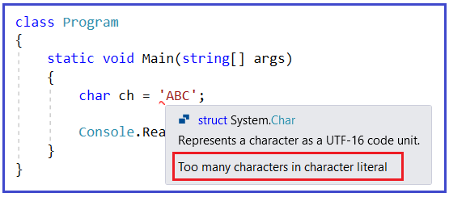

همانطور که می‌بینید، در اینجا با خطای **Too many characters in character literal** مواجه می‌شویم . این بدان معناست که شما نمی‌توانید چندین کاراکتر را در character literal ذخیره کنید. اگر می‌خواهید چندین کاراکتر را ذخیره کنید، باید از نوع داده string در C# همانطور که در مثال زیر نشان داده شده است استفاده کنید.

``` csharp
using System;
namespace DataTypesDemo
{
    class Program
    {
        static void Main(string[] args)
        {
            string str = "ABC";
            Console.ReadKey();
        }
    }
}
```


یک رشته چیزی جز مجموعه‌ای از انواع داده char نیست. حال، ممکن است یک سوال داشته باشید، چگونه اندازه یک رشته را بدانیم؟ بسیار ساده است، ابتدا باید طول رشته را بدانید، یعنی چند کاراکتر در آن وجود دارد و سپس باید طول را در اندازه نوع داده char ضرب کنید زیرا یک رشته چیزی جز مجموعه‌ای از انواع داده char نیست. برای درک بهتر، لطفاً به مثال زیر نگاهی بیندازید.

``` csharp
using System;
namespace DataTypesDemo
{
    class Program
    {
        static void Main(string[] args)
        {
            string str = "ABC";
            var howManyBytes = str.Length * sizeof(Char);

            Console.WriteLine($"str Value: {str}");
            Console.WriteLine($"str Size: {howManyBytes}");

            Console.ReadKey();
        }
    }
}
```
###### **خروجی:**

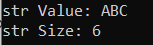

در سی شارپ، رشته یک نوع داده از نوع مرجع است. حال اگر به تعریف نوع داده رشته بروید، خواهید دید که این نوع، همانطور که در تصویر زیر نشان داده شده است، یک کلاس خواهد بود و کلاس چیزی جز یک نوع مرجع در سی شارپ نیست.

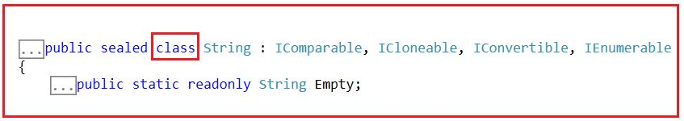

**توجه:** در مقاله بعدی، درباره رشته‌ها بیشتر بحث خواهیم کرد، مانند اینکه چرا [**رشته‌ها**](https://dotnettutorials.net/lesson/string-in-csharp/) از نوع مرجع هستند، درک تفاوت بین رشته (کوچک) در مقابل رشته (بزرگ)، چرا رشته‌ها تغییرناپذیر هستند، کارآموز رشته چیست، StringBuilder در مقابل String برای الحاق، توابع و ویژگی‌های رشته و غیره.

##### **انواع داده عددی در سی شارپ:**

تا اینجا، ما در مورد انواع داده Byte، SByte، Char و String صحبت کردیم که قرار است داده‌های متنی را ذخیره کنند. به عبارت دیگر، می‌توانند داده‌های عددی و غیرعددی را ذخیره کنند. با استفاده از Byte و SByte می‌توانیم کاراکترهای ASCII (مقدار اعشاری کاراکترهای ASCII) را ذخیره کنیم. با استفاده از نوع داده Char می‌توانیم کاراکترهای Unicode (مقدار اعشاری کاراکترهای Unicode) را ذخیره کنیم و با استفاده از string می‌توانیم داده‌های متنی را ذخیره کنیم.

حالا، بیایید ادامه دهیم و سعی کنیم بفهمیم که چگونه فقط داده‌های عددی را ذخیره کنیم. ببینید، ما دو نوع داده عددی داریم. یکی با عدد دارای نقطه اعشار و دیگری با عدد بدون نقطه اعشار.

##### **اعداد بدون اعشار:**

در این دسته، چارچوب دات‌نت سه نوع داده ارائه می‌دهد. آنها به شرح زیر هستند:

1. **عددی علامت‌دار ۱۶ بیتی: مثال: Int16**
2. **عددی علامت‌دار ۳۲ بیتی: مثال: Int32**
3. **عددی علامت‌دار ۶۴ بیتی: مثال: Int64**

از آنجایی که انواع داده فوق از نوع علامت‌دار هستند، می‌توانند اعداد مثبت و منفی را ذخیره کنند. بسته به نوع داده، اندازه‌ای که می‌توانند در خود نگه دارند متفاوت خواهد بود.

##### **عددی علامت‌دار ۱۶ بیتی (Int16)**

از آنجایی که ۱۶ بیتی است، بنابراین ۲ را ذخیره خواهد کرد. <sup>۱۶ </sup> اعداد، یعنی ۶۵۵۳۶. از آنجایی که علامت‌دار است، قرار است هم مقادیر مثبت و هم مقادیر منفی را ذخیره کند. بنابراین، باید ۶۵۵۳۶ را بر ۲ تقسیم کنیم، یعنی ۳۲,۷۶۸. بنابراین، قرار است ۳۲۷۶۸ عدد مثبت و همچنین ۳۲۷۶۸ عدد منفی را ذخیره کند. بنابراین، اعداد مثبت از ۰ تا ۳۲۷۶۷ و اعداد منفی از -۱ تا -۳۲۷۶۸ شروع می‌شوند. بنابراین، حداقل مقداری که این نوع داده می‌تواند در خود نگه دارد -۳۲۷۶۸ و حداکثر مقداری که این نوع داده می‌تواند در خود نگه دارد ۳۲۷۶۷ است. اگر به تعریف Int16 بروید، موارد زیر را خواهید دید.

")

##### **عددی علامت‌دار ۳۲ بیتی (Int32)**

از آنجایی که ۳۲ بیتی است، بنابراین ۲ را ذخیره خواهد کرد. <sup>۳۲ </sup> اعداد، یعنی ۴,۲۹۴,۹۶۷,۲۹۶. از آنجایی که علامت‌دار است، هم مقادیر مثبت و هم مقادیر منفی را ذخیره می‌کند. بنابراین، باید ۴,۲۹۴,۹۶۷,۲۹۶ را بر ۲ تقسیم کنیم، یعنی ۲,۱۴,۷۴,۸۳,۶۴۸. بنابراین، قرار است ۲,۱۴,۷۴,۸۳,۶۴۸ عدد مثبت و همچنین ۲,۱۴,۷۴,۸۳,۶۴۸ عدد منفی را ذخیره کند. بنابراین، اعداد مثبت از ۰ تا ۲,۱۴,۷۴,۸۳,۶۴۷ و اعداد منفی از -۱ تا -۲,۱۴,۷۴,۸۳,۶۴۸ شروع می‌شوند. بنابراین، حداقل مقداری که این نوع داده می‌تواند در خود نگه دارد -۲,۱۴,۷۴,۸۳,۶۴۸ و حداکثر مقداری که این نوع داده می‌تواند در خود نگه دارد ۲,۱۴,۷۴,۸۳,۶۴۷ است. اگر به تعریف Int32 بروید، موارد زیر را خواهید دید.

")

##### **عددی علامت‌دار ۶۴ بیتی (Int64)**

از آنجایی که ۶۴ بیتی است، بنابراین ۲ عدد را ذخیره خواهد کرد. <sup>۶۴ </sup> اعداد. از آنجایی که علامت‌دار است، قرار است هم مقادیر مثبت و هم مقادیر منفی را ذخیره کند. من در اینجا محدوده‌ها را نشان نمی‌دهم زیرا مقادیر بسیار بزرگ خواهند بود. اگر به تعریف Int64 بروید، موارد زیر را خواهید دید.

")

نکته: اگر می‌خواهید حداکثر مقدار و حداقل مقدار نوع داده عددی (Numeric) را بدانید، باید از ثابت‌های فیلد MaxValue و MinValue استفاده کنید. اگر می‌خواهید اندازه نوع داده را بر حسب بایت بدانید، می‌توانید از تابع sizeof استفاده کنید و به این تابع، باید نوع داده (نوع داده مقداری، نه نوع داده مرجع) را ارسال کنیم.

##### **مثال برای درک انواع داده عددی بدون اعشاری:**

``` csharp
using System;
namespace DataTypesDemo
{
    class Program
    {
        static void Main(string[] args)
        {
            Int16 num1 = 123;
            Int32 num2 = 456;
            Int64 num3 = 789;

            Console.WriteLine($"Int16 Min Value:{Int16.MinValue} and Max Value:{Int16.MaxValue}");
            Console.WriteLine($"Int16 Size:{sizeof(Int16)} Byte");

            Console.WriteLine($"Int32 Min Value:{Int32.MinValue} and Max Value:{Int32.MaxValue}");
            Console.WriteLine($"Int32 Size:{sizeof(Int32)} Byte");

            Console.WriteLine($"Int64 Min Value:{Int64.MinValue} and Max Value:{Int64.MaxValue}");
            Console.WriteLine($"Int64 Size:{sizeof(Int64)} Byte");

            Console.ReadKey();
        }
    }
}
```

###### **خروجی:**

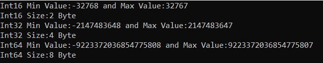

نکته مهم دیگری که باید به خاطر داشته باشید این است که این سه نوع داده می‌توانند نام‌های دیگری نیز داشته باشند. برای مثال، Int16 می‌تواند به عنوان یک نوع داده short، Int32 می‌تواند به عنوان یک نوع داده int و Int64 می‌توانند به عنوان یک نوع داده long استفاده شوند.

بنابراین، در برنامه ما، اگر از نوع داده short استفاده کنیم، به این معنی است که Int16 یعنی ۱۶ بیتی علامت‌دار عددی است. بنابراین، می‌توانیم در کد خود از Int16 یا short استفاده کنیم و هر دو یکسان خواهند بود. به طور مشابه، اگر از نوع داده int استفاده کنیم، به این معنی است که از Int32 یعنی ۳۲ بیتی علامت‌دار عددی استفاده می‌کنیم. بنابراین، می‌توانیم در کد برنامه خود از Int32 یا int استفاده کنیم و هر دو یکسان خواهند بود. و در نهایت، اگر از long استفاده کنیم، به این معنی است که از ۶۴ بیتی علامت‌دار عددی استفاده می‌کنیم. بنابراین، می‌توانیم در کد خود از Int64 یا long استفاده کنیم که یکسان خواهد بود. برای درک بهتر، لطفاً به مثال زیر نگاهی بیندازید.

``` csharp
using System;
namespace DataTypesDemo
{
    class Program
    {
        static void Main(string[] args)
        {
            //Int16 num1 = 123;
            short num1 = 123;
            //Int32 num2 = 456;
            int num2 = 456;
            // Int64 num3 = 789;
            long num3 = 789;

            Console.WriteLine($"short Min Value:{short.MinValue} and Max Value:{short.MaxValue}");
            Console.WriteLine($"short Size:{sizeof(short)} Byte");

            Console.WriteLine($"int Min Value:{int.MinValue} and Max Value:{int.MaxValue}");
            Console.WriteLine($"int Size:{sizeof(int)} Byte");

            Console.WriteLine($"long Min Value:{long.MinValue} and Max Value:{long.MaxValue}");
            Console.WriteLine($"long Size:{sizeof(long)} Byte");

            Console.ReadKey();
        }
    }
}
```

###### **خروجی:**

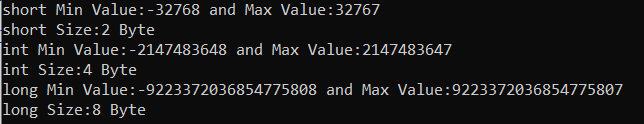

حال، اگر بخواهید فقط اعداد مثبت را ذخیره کنید، چه می‌شود؟ چارچوب دات‌نت نسخه‌های بدون علامت هر یک از این انواع داده را نیز ارائه می‌دهد. به عنوان مثال، برای Int16، UInt16، برای Int32، UInt32 و برای Int64، UInt64 وجود دارد. به طور مشابه، برای نوع داده کوتاه، ushort، برای نوع داده int، uint و برای نوع داده بلند، ulong داریم. این انواع داده بدون علامت فقط مقادیر مثبت را ذخیره می‌کنند. اندازه این انواع داده بدون علامت، همان اندازه نوع داده علامت‌دار آنها خواهد بود. برای درک بهتر، لطفاً به مثال زیر نگاهی بیندازید.

``` csharp
using System;
namespace DataTypesDemo
{
    class Program
    {
        static void Main(string[] args)
        {
            //UInt16 num1 = 123;
            ushort num1 = 123;
            
            //UInt32 num2 = 456;
            uint num2 = 456;

            // UInt64 num3 = 789;
            ulong num3 = 789;

            Console.WriteLine($"ushort Min Value:{ushort.MinValue} and Max Value:{ushort.MaxValue}");
            Console.WriteLine($"short Size:{sizeof(ushort)} Byte");

            Console.WriteLine($"uint Min Value:{uint.MinValue} and Max Value:{uint.MaxValue}");
            Console.WriteLine($"uint Size:{sizeof(uint)} Byte");

            Console.WriteLine($"ulong Min Value:{ulong.MinValue} and Max Value:{ulong.MaxValue}");
            Console.WriteLine($"ulong Size:{sizeof(ulong)} Byte");

            Console.ReadKey();
        }
    }
}
```
###### **خروجی:**

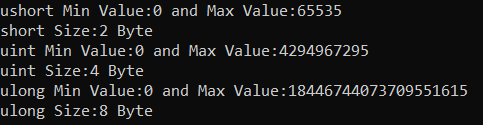

همانطور که در خروجی بالا مشاهده می‌کنید، مقدار حداقل همه این انواع داده بدون علامت ۰ است، به این معنی که آنها فقط اعداد مثبت را بدون نقطه اعشار ذخیره می‌کنند. می‌توانید ببینید که وقتی از نوع داده بدون علامت استفاده می‌کنیم، تقسیم بر ۲ وجود ندارد، که در مورد نوع داده عددی علامت‌دار صدق می‌کند.

##### **چه زمانی از نوع داده Signed و چه زمانی از نوع داده unsigned در سی شارپ استفاده کنیم؟**

ببینید، اگر می‌خواهید فقط اعداد مثبت را ذخیره کنید، توصیه می‌شود از نوع داده بدون علامت استفاده کنید، زیرا با **نوع داده کوتاه** علامت‌دار، حداکثر عدد مثبتی که می‌توانید ذخیره کنید **۳۲۷۶۷** است ، اما با نوع داده بدون علامت **ushort،** حداکثر عدد مثبتی که می‌توانید ذخیره کنید **۶۵۵۳۵** است . بنابراین، با استفاده از همان ۲ بایت حافظه، با ushort، این شانس را داریم که عدد مثبت بزرگتری را در مقایسه با نوع داده کوتاه عدد مثبت ذخیره کنیم و در مورد int و unit، long و ulong نیز همینطور خواهد بود. اگر می‌خواهید هم اعداد مثبت و هم اعداد منفی را ذخیره کنید، باید از نوع داده علامت‌دار استفاده کنید.

##### **اعداد اعشاری در سی شارپ:**

باز هم، در اعداد اعشاری، سه نوع داده در اختیار ما قرار می‌گیرد. آنها به شرح زیر هستند:

1. **تک** (عدد ممیز شناور با دقت تک)
2. **دابل** (عدد اعشاری با دقت مضاعف)
3. **اعشاری** (نشان دهنده یک عدد اعشاری با ممیز شناور)

نوع داده Single، ۴ بایت، Double، ۸ بایت و Decimal، ۱۶ بایت از حافظه را اشغال می‌کند. برای درک بهتر، لطفاً به مثال زیر نگاهی بیندازید. برای ایجاد یک مقدار Single، باید پسوند f را در انتهای عدد اضافه کنیم، به طور مشابه، اگر می‌خواهید یک مقدار Decimal ایجاد کنید، باید مقدار را با m (بزرگ یا کوچک بودن آن مهم نیست) پسوند دهید. اگر هیچ پسوندی اضافه نکنید، مقدار به طور پیش‌فرض double خواهد بود.

``` csharp
using System;
namespace DataTypesDemo
{
    class Program
    {
        static void Main(string[] args)
        {
            Single a = 1.123f;
            Double b = 1.456;
            Decimal c = 1.789M;
            
            Console.WriteLine($"Single Size:{sizeof(Single)} Byte");
            Console.WriteLine($"Single Min Value:{Single.MinValue} and Max Value:{Single.MaxValue}");

            Console.WriteLine($"Double Size:{sizeof(Double)} Byte");
            Console.WriteLine($"Double Min Value:{Double.MinValue} and Max Value:{Double.MaxValue}");

            Console.WriteLine($"Decimal Size:{sizeof(Decimal)} Byte");
            Console.WriteLine($"Decimal Min Value:{Decimal.MinValue} and Max Value:{Decimal.MaxValue}");

            Console.ReadKey();
        }
    }
}
```

###### **خروجی:**

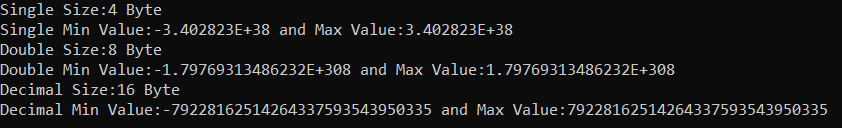

به جای Single، Double و Decimal، می‌توانید از نام اختصاری این نوع داده‌ها نیز استفاده کنید، مانند float برای Single، double برای Double و decimal برای Decimal. در مثال زیر از نام‌های اختصاری انواع داده‌های Single، Double و Decimal فوق با استفاده از زبان C# استفاده شده است.

``` csharp
using System;
namespace DataTypesDemo
{
    class Program
    {
        static void Main(string[] args)
        {
            float a = 1.123f;
            double b = 1.456;
            decimal c = 1.789m;
            
            Console.WriteLine($"float Size:{sizeof(float)} Byte");
            Console.WriteLine($"float Min Value:{float.MinValue} and Max Value:{float.MaxValue}");

            Console.WriteLine($"double Size:{sizeof(double)} Byte");
            Console.WriteLine($"double Min Value:{double.MinValue} and Max Value:{double.MaxValue}");

            Console.WriteLine($"decimal Size:{sizeof(decimal)} Byte");
            Console.WriteLine($"decimal Min Value:{decimal.MinValue} and Max Value:{decimal.MaxValue}");

            Console.ReadKey();
        }
    }
}
```
###### **خروجی:**

، دوتایی (Double) و اعشاری (Decimal)")

##### **مقایسه بین اعداد اعشاری (Float)، دوتایی (Double) و اعشاری (Decimal):**

###### **اندازه:**

1. نوع داده Float از ۴ بایت یا ۳۲ بیت برای نمایش داده‌ها استفاده می‌کند.
2. دابل از ۸ بایت یا ۶۴ بیت برای نمایش داده‌ها استفاده می‌کند.
3. اعداد اعشاری از ۱۶ بایت یا ۱۲۸ بیت برای نمایش داده‌ها استفاده می‌کنند.

###### **محدوده:**

1. مقدار اعشاری (float) تقریباً از ‎-3.402823E+38‎ تا ‎3.402823E+38‎ متغیر است.
2. مقدار double تقریباً از ‎-1.79769313486232E+308‎ تا ‎1.79769313486232E+308‎ متغیر است.
3. مقدار اعشاری تقریباً از -79228162514264337593543950335 تا 79228162514264337593543950335 متغیر است.

###### **دقت:**

1. نوع داده‌ی Float، داده‌هایی با عدد اعشاری با دقت تکی را نشان می‌دهد.
2. نوع داده‌ی Double، داده‌هایی با اعداد اعشاری با دقت مضاعف را نشان می‌دهد.
3. اعشاری (Decimal) داده‌هایی با اعداد اعشاری با ممیز شناور را نشان می‌دهد.

###### **دقت:**

1. دقت نوع داده Float از نوع داده Double و Decimal کمتر است.
2. نوع داده‌ی Double از نوع Float دقیق‌تر است، اما از نوع داده‌ی Decimal دقت کمتری دارد.
3. عدد اعشاری (Decimal) از عدد اعشاری (Float) و عدد دوتایی (Double) دقیق‌تر است.

###### **مثال برای درک دقت:**

اگر از نوع اعشاری (float) استفاده کنید، حداکثر ۷ رقم، اگر از نوع دابل (double) استفاده کنید، حداکثر ۱۵ رقم و اگر از نوع اعشاری (decimal) استفاده کنید، حداکثر ۲۹ رقم چاپ خواهد شد. برای درک بهتر، لطفاً به مثال زیر که دقت انواع داده اعشاری (float)، دابل (double) و اعشاری (decimal) را در زبان سی شارپ نشان می‌دهد، نگاهی بیندازید.

``` csharp
using System;
namespace DataTypesDemo
{
    class Program
    {
        static void Main(string[] args)
        {
            float a = 1.78986380830029492956829698978655434342477f; //7 digits Maximum
            double b = 1.78986380830029492956829698978655434342477; //15 digits Maximum
            decimal c = 1.78986380830029492956829698978655434342477m; //29 digits Maximum

            Console.WriteLine(a);
            Console.WriteLine(b);
            Console.WriteLine(c);

            Console.ReadKey();
        }
    }
}
```

###### **خروجی:**

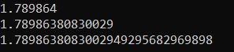

##### **آیا انتخاب نوع داده مهم است؟**

ببینید، ما می‌توانیم یک عدد صحیح کوچک را در یک نوع داده short ذخیره کنیم، حتی می‌توانیم همان عدد صحیح کوچک را در یک نوع داده decimal ذخیره کنیم. حالا، ممکن است فکر کنید که نوع داده decimal یا long محدوده بزرگتری از مقادیر را می‌پذیرد، بنابراین من همیشه از این نوع داده‌ها استفاده خواهم کرد. آیا اصلاً مهم است؟ بله. مهم است. چه چیزی مهم است؟ عملکرد.

بیایید با یک مثال بفهمیم که انواع داده‌ها چگونه بر عملکرد برنامه در زبان سی‌شارپ تأثیر می‌گذارند. لطفاً به مثال زیر نگاهی بیندازید. در اینجا، من دو حلقه ایجاد می‌کنم که ۱۰۰۰۰۰ بار اجرا خواهند شد. به عنوان بخشی از حلقه for اول، از یک نوع داده short برای ایجاد و مقداردهی اولیه سه متغیر با عدد ۱۰۰ استفاده می‌کنم. در حلقه for دوم، از نوع داده decimal برای ایجاد و مقداردهی اولیه سه متغیر با عدد ۱۰۰ استفاده می‌کنم. علاوه بر این، از StopWatch برای اندازه‌گیری زمان صرف شده توسط هر حلقه استفاده می‌کنم.

``` csharp
using System;
using System.Diagnostics;

namespace DataTypesDemo
{
    class Program
    {
        static void Main(string[] args)
        {
            Stopwatch stopwatch1 = new Stopwatch();
            stopwatch1.Start();
            for(int i = 0; i <= 10000000; i++)
            {
                short s1 = 100;
                short s2 = 100;
                short s3 = 100;
            }
            stopwatch1.Stop();
            Console.WriteLine($"short took : {stopwatch1.ElapsedMilliseconds} MS");

            Stopwatch stopwatch2 = new Stopwatch();
            stopwatch2.Start();
            for (int i = 0; i <= 10000000; i++)
            {
                decimal s1 = 100;
                decimal s2 = 100;
                decimal s3 = 100;
            }
            stopwatch2.Stop();
            Console.WriteLine($"decimal took : {stopwatch2.ElapsedMilliseconds} MS");

            Console.ReadKey();
        }
    }
}
```

###### **خروجی:**

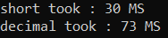

بنابراین، همانطور که می‌بینید، short در مقایسه با ۷۳ میلی‌ثانیه با اعشار، ۳۰ میلی‌ثانیه زمان برد. بنابراین، مهم است که برای دستیابی به عملکرد بهتر، نوع داده مناسب را در توسعه برنامه خود انتخاب کنید.

##### **چگونه اندازه انواع داده از پیش تعریف شده را در سی شارپ بدست آوریم؟**

اگر می‌خواهید اندازه واقعی انواع داده از پیش تعریف شده یا داخلی را بدانید، می‌توانید از **متد sizeof** استفاده کنید . بیایید این موضوع را با یک مثال درک کنیم. مثال زیر اندازه انواع داده از پیش تعریف شده مختلف را در C# به دست می‌آورد.

``` csharp
using System;
namespace DataTypesDemo
{
    class Program
    {
        static void Main(string[] args)
        {
            Console.WriteLine($"Size of Byte: {sizeof(byte)}");
            Console.WriteLine($"Size of Integer: {sizeof(int)}");
            Console.WriteLine($"Size of Character: {sizeof(char)}");
            Console.WriteLine($"Size of Float: {sizeof(float)}");
            Console.WriteLine($"Size of Long: {sizeof(long)}");
            Console.WriteLine($"Size of Double: {sizeof(double)}");
            Console.WriteLine($"Size of Bool: {sizeof(bool)}");
            Console.ReadKey();
        }
    }
}
```

###### **خروجی:**

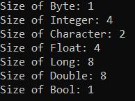

##### **چگونه حداقل و حداکثر محدوده مقادیر انواع داده داخلی را در سی شارپ بدست آوریم؟**

اگر می‌خواهید حداکثر و حداقل محدوده‌ی انواع داده‌های عددی را بدانید، می‌توانید از ثابت‌های MinValue و MaxValue استفاده کنید. اگر به تعریف هر نوع داده‌ی عددی بروید، این دو ثابت را خواهید دید که حداکثر و حداقل محدوده‌ی مقادیری را که آن نوع داده می‌تواند در خود نگه دارد، در خود نگه می‌دارند. برای درک بهتر، لطفاً به مثال زیر نگاهی بیندازید. در مثال زیر، ما از ثابت‌های MinValue و MaxValue برای بدست آوردن حداکثر و حداقل محدوده‌ی مقادیر آن نوع داده استفاده می‌کنیم.

``` csharp
using System;
namespace DataTypesDemo
{
    class Program
    {
        static void Main(string[] args)
        {
            Console.WriteLine($"Byte => Minimum Range:{byte.MinValue} and Maximum Range:{byte.MaxValue}");
            Console.WriteLine($"Integer => Minimum Range:{int.MinValue} and Maximum Range:{int.MaxValue}");
            Console.WriteLine($"Float => Minimum Range:{float.MinValue} and Maximum Range:{float.MaxValue}");
            Console.WriteLine($"Long => Minimum Range:{long.MinValue} and Maximum Range:{long.MaxValue}");
            Console.WriteLine($"Double => Minimum Range:{double.MinValue} and Maximum Range:{double.MaxValue}");
            Console.ReadKey();
        }
    }
}
```

###### **خروجی:**

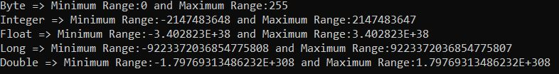

##### **چگونه مقادیر پیش‌فرض انواع داده‌ی داخلی را در سی‌شارپ دریافت کنیم؟**

هر نوع داده‌ی داخلی یک مقدار پیش‌فرض دارد. مقدار پیش‌فرض تمام انواع عددی 0، نوع بولی false و نوع کاراکتری '\\0' است. می‌توانید از default(typename) برای دانستن مقدار پیش‌فرض یک نوع داده در سی‌شارپ استفاده کنید. برای درک بهتر، لطفاً به مثال زیر نگاهی بیندازید.

``` csharp
using System;
namespace DataTypesDemo
{
    class Program
    {
        static void Main(string[] args)
        {
            Console.WriteLine($"Default Value of Byte: {default(byte)} ");
            Console.WriteLine($"Default Value of Integer: {default(int)}");
            Console.WriteLine($"Default Value of Float: {default(float)}");
            Console.WriteLine($"Default Value of Long: {default(long)}");
            Console.WriteLine($"Default Value of Double: {default(double)}");
            Console.WriteLine($"Default Value of Character: {default(char)}");
            Console.WriteLine($"Default Value of Boolean: {default(bool)}");
            Console.ReadKey();
        }
    }
}
```
###### **خروجی:**

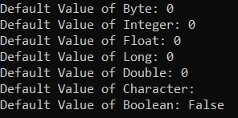

##### **نوع داده مرجع در سی شارپ چیست؟**

نوع داده‌ای که برای ذخیره مرجع یک متغیر استفاده می‌شود، نوع داده مرجع (Reference Data Type) نامیده می‌شود. به عبارت دیگر، می‌توان گفت که انواع داده مرجع، داده‌های واقعی ذخیره شده در یک متغیر را ذخیره نمی‌کنند، بلکه مرجع متغیرها را ذخیره می‌کنند. ما در مقاله بعدی در مورد این مفهوم بحث خواهیم کرد. مجدداً، انواع داده مرجع به دو نوع طبقه‌بندی می‌شوند. آنها به شرح زیر هستند.

1. **انواع از پیش تعریف شده \-** مثال‌ها شامل اشیاء، رشته‌ها و دینامیک‌ها هستند.
2. **انواع تعریف‌شده توسط کاربر** \- مثال‌ها شامل کلاس‌ها و رابط‌ها هستند.

##### **نوع اشاره گر در سی شارپ چیست؟**

اشاره‌گر در زبان سی‌شارپ یک متغیر است، همچنین به عنوان یک مکان‌یاب یا نشانگر شناخته می‌شود که به آدرسی از یک مقدار اشاره می‌کند، به این معنی که متغیرهای نوع اشاره‌گر، آدرس حافظه نوع دیگری را ذخیره می‌کنند. برای دریافت جزئیات اشاره‌گر، دو نماد آمپرسند (&) و ستاره (\*) داریم.

1. **علامت & (&):** به عنوان عملگر آدرس شناخته می‌شود. برای تعیین آدرس یک متغیر استفاده می‌شود.
2. **ستاره (\*):** همچنین به عنوان عملگر غیرمستقیم شناخته می‌شود. برای دسترسی به مقدار یک آدرس استفاده می‌شود.

برای درک بهتر، لطفاً به مثال زیر که نحوه‌ی استفاده از نوع داده‌ی Pointer در سی‌شارپ را نشان می‌دهد، نگاهی بیندازید. برای اجرای برنامه‌ی زیر، باید از حالت ناامن (unsafe mode) استفاده کنید. برای انجام این کار، به قسمت ویژگی‌های پروژه‌ی خود بروید و در قسمت ساخت (Build)، گزینه‌ی «اجازه دادن به کد ناامن» (Allow unsafe code) را تیک بزنید.

``` csharp 
using System;
namespace DataTypesDemo
{
    class Program
    {
        static void Main(string[] args)
        {
            unsafe
            {
                // declare a variable
                int number = 10;

                // store variable number address location in pointer variable ptr
                int* ptr = &number;
                Console.WriteLine($"Value :{number}");
                Console.WriteLine($"Address :{(int)ptr}");
                Console.ReadKey();
            }
        }
    }
}
```

###### **خروجی:**

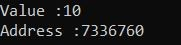