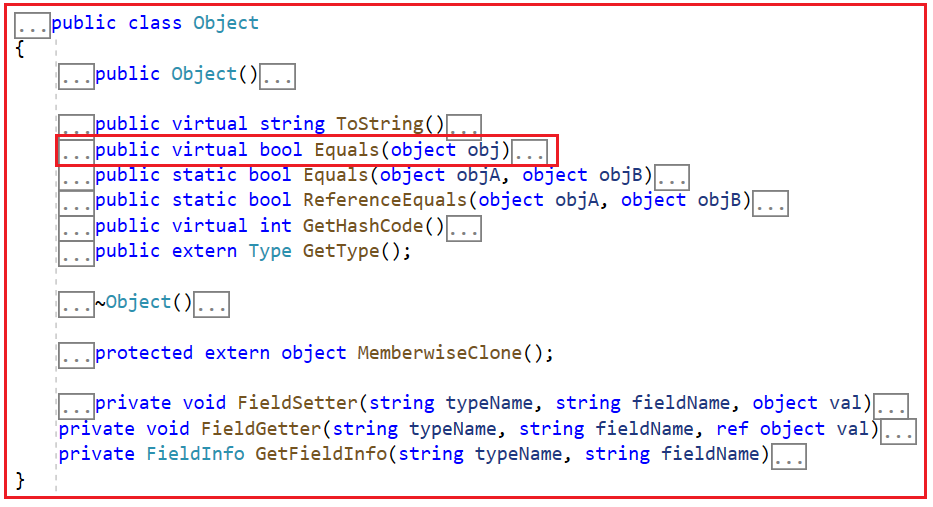
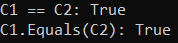
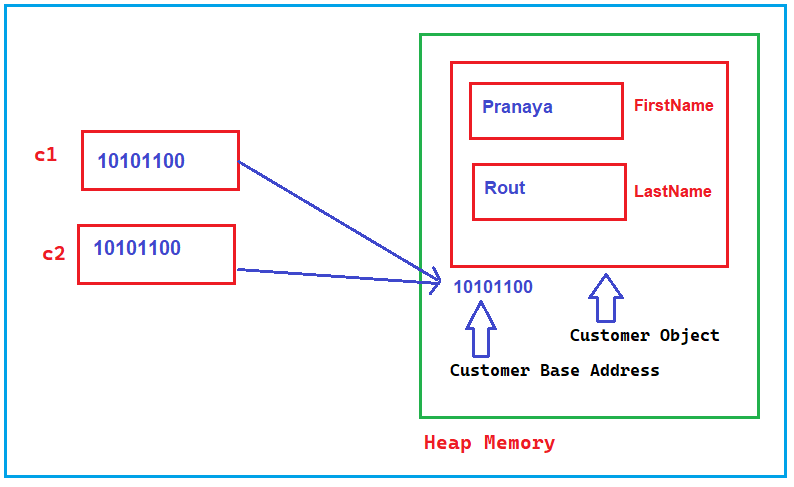
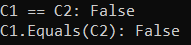
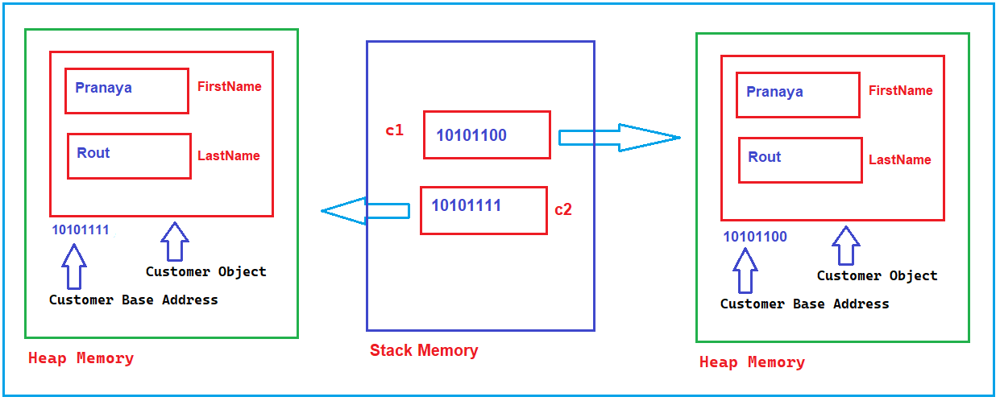
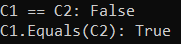
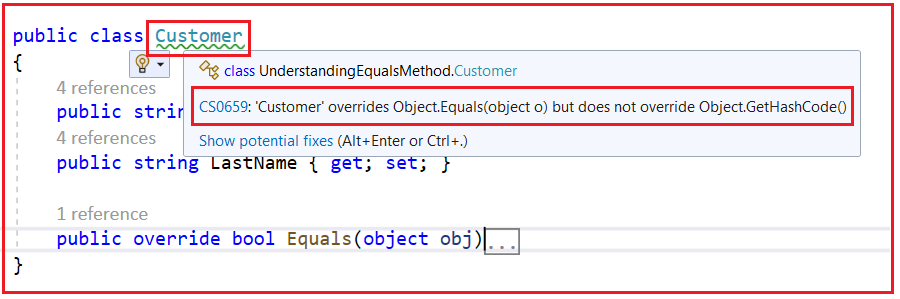
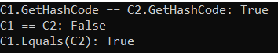

## **نادیده گرفتن متد Equals در سی شارپ به همراه مثال**

در این مقاله، قصد دارم **به همراه مثال‌هایی، در مورد اینکه چرا باید متد Equals را در سی‌شارپ لغو کنیم،** در سی‌شارپ بحث کردیم، مطالعه کنید بحث کنم. به عنوان بخشی از این مقاله، قصد داریم در مورد نکات زیر بحث کنیم.

1. **درک متد Equals از کلاس Object در سی شارپ؟**
2. **تفاوت بین عملگر "==" و متد Equals() در سی شارپ را درک می‌کنید؟**
3. **چرا باید متد Equals() را در سی شارپ override کنیم؟**
4. **چگونه می‌توانیم متد Equals را در سی شارپ با مثال‌ها لغو کنیم؟**

##### **متد Equals در سی شارپ چیست؟**

Equals یک متد مجازی است که در کلاس Object تعریف شده است و این متد برای همه انواع .NET در دسترس است زیرا Object کلاس پایه همه انواع .NET است.



از آنجایی که Equals یک متد مجازی است، می‌توانیم این متد را در کلاس‌های خود نیز بازنویسی کنیم. امضای این متد در ادامه آمده است.

1. **public virtual bool Equals(object obj) :** این متد برای تعیین اینکه آیا شیء مشخص شده با شیء فعلی برابر است یا خیر، استفاده می‌شود. در اینجا، پارامتر obj شیء مورد نظر برای مقایسه با شیء فعلی را مشخص می‌کند. اگر شیء مشخص شده با شیء فعلی برابر باشد، مقدار true و در غیر این صورت، مقدار false را برمی‌گرداند.

قبل از اینکه بفهمیم چگونه و چه زمانی override کنیم، ابتدا اجازه دهید تفاوت بین عملگر == و متد Equals در سی شارپ را درک کنیم.

##### **تفاوت بین عملگر "==" و متد Equals() در سی شارپ:**

همانطور که قبلاً در مورد هر نوع داده در .NET بحث کردیم، به طور مستقیم یا غیرمستقیم از کلاس Object ارث‌بری می‌کند. بنابراین، متد مجازی Equals() که پیاده‌سازی پیش‌فرضی در کلاس Object دارد، از طریق ارث‌بری در هر نوع داده .NET (اعم از نوع اولیه و مرجع) نیز موجود است.

در مثال زیر، متغیرهای Number1 و Number2 اعداد صحیح هستند. بنابراین، هر دو متد == و Equals() مقدار true را برمی‌گردانند، زیرا Number1 و Number2 هر دو متغیر مقدار یکسانی دارند، یعنی 10. اعداد صحیح از نوع مقداری هستند و مستقیماً مقدار را در خود نگه می‌دارند، و از این رو در این مورد نتیجه true می‌شود.

```csharp
using System;

namespace UnderstandingEqualsMethod
{
    public class Program
    {
        public static void Main()
        {
            int Number1 = 10;
            int Number2 = 10;
            Console.WriteLine($"Number1 == Number2: {Number1 == Number2}");
            Console.WriteLine($"Number1.Equals(Number2): {Number1.Equals(Number2)}");
            Console.ReadKey();
        }
    }
}
```

###### **خروجی:**

 در سی شارپ")

نمودار زیر معماری حافظه برنامه فوق را نشان می‌دهد. از آنجایی که عدد صحیح یک نوع مقداری است، بنابراین آنها مستقیماً مقدار را در خود نگه می‌دارند و در این حالت، هم عملگر == و هم متد Equals مقادیر را بررسی کرده و آنها را TRUE تشخیص می‌دهند.

 در سی شارپ")

##### **روش تساوی و عملگر == با نوع شمارشی در سی شارپ:**

در مثال زیر، ما دو enum را با هم مقایسه می‌کنیم و هم **عملگر ==** و هم **متد Equals()** را برمی‌گردانند **مقدار true** ، زیرا هر دو enum مربوط به direction1 و direction2 دارای مقدار صحیح یکسانی، یعنی ۱، هستند. باز هم، Enumها از نوع مقداری هستند و به جای آدرس مرجع، مقدار را در خود نگه می‌دارند.

```csharp
using System;

namespace UnderstandingEqualsMethod
{
    public class Program
    {
        public static void Main()
        {
            Direction direction1 = Direction.East;
            Direction direction2 = Direction.East;
            Console.WriteLine(direction1 == direction2);
            Console.WriteLine(direction1.Equals(direction2));
            Console.ReadKey();
        }
    }
    public enum Direction
    {
        East = 1,
        West = 2,
        North = 3,
        South = 4
    }
}
```

###### **خروجی:**

 در سی شارپ")

##### **روش تساوی و عملگر ==** **با نوع مرجع در سی شارپ:**

اگر نوع از نوع مرجع باشد، به طور پیش‌فرض هم عملگر == و هم متد Equals برابری مرجع را بررسی می‌کنند، در حالی که می‌توانیم این رفتار پیش‌فرض متد Equals() را با بازنویسی آن برای بررسی برابری مقادیر تغییر دهیم. اگر در حال حاضر این موضوع برایتان واضح نیست، نگران نباشید، بگذارید با یک مثال آن را درک کنیم.

در مثال زیر، C1 و C2 دو متغیر مرجع شیء متفاوت از کلاس Customer هستند. اما هر دو به یک شیء اشاره می‌کنند. مهمترین نکته‌ای که باید در نظر داشته باشید این است که متغیرهای مرجع با اشیاء متفاوت هستند. متغیرهای مرجع در حافظه پشته ایجاد می‌شوند و به اشیاء واقعی که در حافظه heap ذخیره می‌شوند، اشاره می‌کنند.

از آنجایی که C1 و C2 هر دو به یک شیء اشاره دارند، برابری مرجع و برابری مقدار صحیح است. برابری مقدار به این معنی است که دو شیء حاوی مقادیر یکسانی هستند. در این مثال، شیء واقعی فقط یکی است، بنابراین بدیهی است که مقادیر نیز برابر هستند. اگر دو شیء دارای برابری مرجع باشند، آنگاه برابری مقدار نیز دارند، اما برابری مقدار، برابری مرجع را تضمین نمی‌کند.

```csharp
using System;

namespace UnderstandingEqualsMethod
{
    public class Program
    {
        public static void Main()
        {
            Customer C1 = new Customer();
            C1.FirstName = "Pranaya";
            C1.LastName = "Rout";
            Customer C2 = C1;
            Console.WriteLine($"C1 == C2: {C1 == C2}");
            Console.WriteLine($"C1.Equals(C2): {C1.Equals(C2)}");
            Console.ReadKey();
        }
    }
    public class Customer
    {
        public string FirstName { get; set; }
        public string LastName { get; set; }
    }
}
```

###### **خروجی:**



نمودار زیر معماری حافظه برنامه فوق را نشان می‌دهد. در این حالت، شیء مشتری واقعی در داخل حافظه Heap ایجاد می‌شود و در حافظه Stack، دو متغیر مرجع مشتری ایجاد می‌شوند و هر دو به آدرس پایه شیء مشتری یکسانی اشاره می‌کنند. از آنجایی که هر دو C1 و C2 دارای مرجع شیء مشتری یکسانی هستند، بنابراین، هم عملگر == و هم متد Equals، ارجاعات را بررسی کرده و آن را TRUE تشخیص می‌دهند.



در مثال زیر، **عملگر ==** را برمی‌گرداند **مقدار False** . این منطقی است زیرا C1 و C2 به اشیاء مختلفی اشاره می‌کنند. با این حال، **متد Equals()** نیز مقدار false را برمی‌گرداند، با وجود اینکه مقادیر C1 و C2 یکسان هستند و این به این دلیل است که متد Equals به طور پیش‌فرض برابری مرجع را بررسی می‌کند.

```csharp
using System;

namespace UnderstandingEqualsMethod
{
    public class Program
    {
        public static void Main()
        {
            Customer C1 = new Customer();
            C1.FirstName = "Pranaya";
            C1.LastName = "Rout";
            Customer C2 = new Customer();
            C2.FirstName = "Pranaya";
            C2.LastName = "Rout";
            Console.WriteLine($"C1 == C2: {C1 == C2}");
            Console.WriteLine($"C1.Equals(C2): {C1.Equals(C2)}");
            Console.ReadKey();
        }
    }
    public class Customer
    {
        public string FirstName { get; set; }
        public string LastName { get; set; }
    }
}
```

###### **خروجی:**



نمودار زیر معماری حافظه برنامه فوق را نشان می‌دهد. در این حالت، ما دو شیء Customer را در داخل حافظه Heap ایجاد کرده‌ایم و در حافظه Stack، دو متغیر مرجع customer داریم و هر دو به اشیاء customer متفاوتی اشاره می‌کنند. از آنجایی که هر دو C1 و C2 دارای ارجاعات شیء customer متفاوتی هستند، بنابراین، هر دو عملگر == و متد Equals ارجاعات را بررسی کرده و آن را FALSE تشخیص می‌دهند.



حال اگر می‌خواهید متد Equals به جای آدرس مرجع، مقادیر ذخیره شده در داخل شیء را بررسی کند، باید متد Equals را در داخل کلاس Customer بازنویسی کنیم و اگر مقدار برابر بود، باید مقدار TRUE را برگردانیم.

##### **بازنویسی متد Equals از کلاس شیء در سی شارپ:**

در مثال زیر، متد Equals() از کلاس Object را درون کلاس Customer بازنویسی می‌کنیم. هنگام بازنویسی **متد Equals()** ، مطمئن شوید که شیء ارسالی تهی (null) نباشد و بتوان آن را به نوعی که مقایسه می‌کنید تبدیل کرد. هنگام بازنویسی **Equals()** ، باید GetHashCode() را نیز بازنویسی کنید، در غیر این صورت با اخطار کامپایلر مواجه خواهید شد.

```csharp
using System;

namespace UnderstandingEqualsMethod
{
    public class Program
    {
        public static void Main()
        {
            Customer C1 = new Customer();
            C1.FirstName = "Pranaya";
            C1.LastName = "Rout";
            Customer C2 = new Customer();
            C2.FirstName = "Pranaya";
            C2.LastName = "Rout";
            Console.WriteLine($"C1 == C2: {C1 == C2}");
            Console.WriteLine($"C1.Equals(C2): {C1.Equals(C2)}");
            Console.ReadKey();
        }
    }
    public class Customer
    {
        public string FirstName { get; set; }
        public string LastName { get; set; }
        public override bool Equals(object obj)
        {
            // If the passed object is null, return False
            if (obj == null)
            {
                return false;
            }
            // If the passed object is not Customer Type, return False
            if (!(obj is Customer))
            {
                return false;
            }
            return (this.FirstName == ((Customer)obj).FirstName)
                && (this.LastName == ((Customer)obj).LastName);
        }
    }
}
```

###### **خروجی:**



اکنون، متد Equals آدرس مرجع را بررسی نمی‌کند، بلکه نام و نام خانوادگی هر دو شیء را بررسی می‌کند و اگر یکسان باشد، مقدار TRUE را برمی‌گرداند، در غیر این صورت FALSE را برمی‌گرداند. علاوه بر این، اگر به کلاس Customer نگاه کنید، همانطور که در تصویر زیر نشان داده شده است، یک هشدار نشان می‌دهد.



در اینجا، کامپایلر ایراد می‌گیرد که شما باید متد Equals را در کلاس Customer بازنویسی کنید، اما شما متد GetHashCode را بازنویسی نکرده‌اید. بنابراین، بازنویسی متد GetHashCode اجباری نیست، اما اگر در حال بازنویسی متد Equals در C# هستید، توصیه می‌شود متد GetHashCode را نیز بازنویسی کنید. حتی با استفاده از متد GetHashCode، می‌توانیم بررسی کنیم که آیا دو شیء برابر هستند یا خیر، که در مثال زیر نشان داده شده است.

```csharp
using System;

namespace UnderstandingObjectClassMethods
{
    public class Program
    {
        public static void Main()
        {
            Customer C1 = new Customer();
            C1.FirstName = "Pranaya";
            C1.LastName = "Rout";
            Customer C2 = new Customer();
            C2.FirstName = "Pranaya";
            C2.LastName = "Rout";
            var hashcode1 = C1.GetHashCode();
            var hashcode2 = C2.GetHashCode();
            Console.WriteLine($"C1.GetHashCode == C2.GetHashCode:{hashcode1 == hashcode2}");
            Console.WriteLine($"C1 == C2:{C1 == C2}");
            Console.WriteLine($"C1.Equals(C2):{C1.Equals(C2)}");
            Console.ReadKey();
        }
    }
    public class Customer
    {
        public string FirstName { get; set; }
        public string LastName { get; set; }
        public override bool Equals(object obj)
        {
            // If the passed object is null
            if (obj == null)
            {
                return false;
            }
            if (!(obj is Customer))
            {
                return false;
            }
            return (this.FirstName == ((Customer)obj).FirstName)
                && (this.LastName == ((Customer)obj).LastName);
        }
        //Overriding the GetHashCode method
        //GetHashCode method generates hashcode for the current object
        public override int GetHashCode()
        {
            //Performing BIT wise OR Operation on the generated hashcode values
            //If the corresponding bits are different, it gives 1.
            //If the corresponding bits are the same, it gives 0.
            return FirstName.GetHashCode() ^ LastName.GetHashCode();
        }
    }
}
```

###### **خروجی:**

