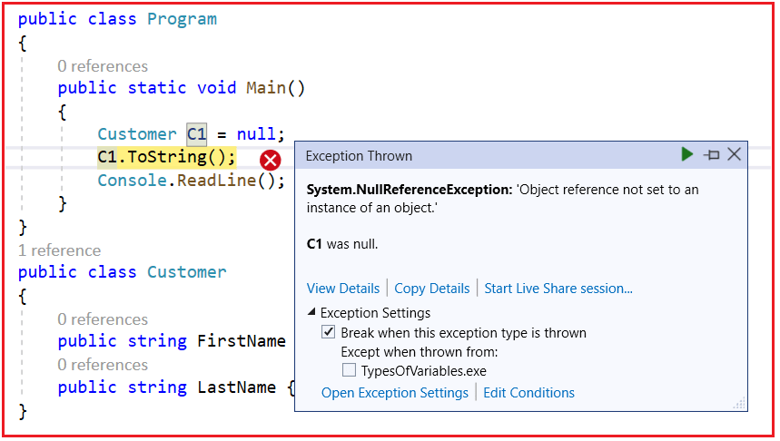
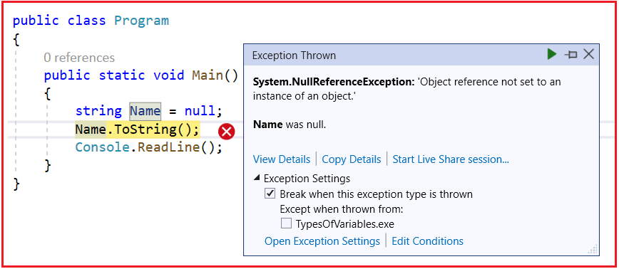

## **تفاوت بین Convert.ToString و متد ToString در سی شارپ**

در این مقاله، قصد دارم **تفاوت بین متد Convert.ToString و ToString را در سی شارپ** با مثال بررسی کنم. 

##### **Convert.ToString و متد ToString در سی شارپ**

هر دوی این متدها برای تبدیل یک مقدار به رشته استفاده می‌شوند. تفاوت این است که **متد Convert.ToString()** مقدار null را مدیریت می‌کند در حالی که **متد ToString()** در سی شارپ مقدار null را مدیریت نمی‌کند.

تعریف کنید در سی شارپ اگر یک متغیر رشته‌ای تعریف کنید و **هیچ مقداری به آن متغیر اختصاص ندهید**، به طور پیش‌فرض آن متغیر **مقدار null** می‌گیرد. در چنین حالتی، اگر از **متد ToString()** استفاده کنید، برنامه شما خطای **Null Reference Exception** را صادر می‌کند. از طرف دیگر، اگر از **متد Convert.ToString()** استفاده کنید، برنامه شما خطایی صادر نمی‌کند.

###### **بگذارید تفاوت بین این دو روش را با یک مثال درک کنیم.**

```csharp
using System;

namespace UnderstandingToStringMethod
{
    public class Program
    {
        public static void Main()
        {
            Customer C1 = null;
            C1.ToString();
            Console.ReadLine();
        }
    }
    public class Customer
    {
        public string FirstName { get; set; }
        public string LastName { get; set; }
    }
}
```

**وقتی برنامه را اجرا می‌کنید، خطای زیر را به شما می‌دهد**



دلیل این امر آن است که **متد ToString()** در سی‌شارپ انتظار دارد شیء‌ای که روی آن فراخوانی می‌شود، NULL نباشد. در مثال ما، شیء **C1 برابر با Null است** و ما **ToString()** را روی **شیء NULL** فراخوانی می‌کنیم، بنابراین **خطای NULL Reference** رخ می‌دهد.

##### **بگذارید مثال دیگری را ببینیم.**

```csharp
using System;

namespace UnderstandingToStringMethod
{
    public class Program
    {
        public static void Main()
        {
            String Name = null;
            Name.ToString();
            Console.ReadLine();
        }
    }
}
```

وقتی برنامه‌ی فوق را اجرا می‌کنیم، همان **خطای NULL Reference Exception** را که در زیر نشان داده شده است، به ما می‌دهد.



دلیل این امر آن است که متغیر Name برابر با Null است و ما در حال فراخوانی متد ToString() هستیم. بیایید ببینیم وقتی از **متد Convert.Tostring()** با دو مثال بالا استفاده می‌کنیم، چه اتفاقی می‌افتد.

```csharp
using System;

namespace UnderstandingObjectClassMethods
{
    public class Program
    {
        public static void Main()
        {
            Customer C1 = null;
            Convert.ToString(C1);

            String Name = null;
            Convert.ToString(Name);

            Console.WriteLine("No Error");
            Console.ReadLine();
        }
    }
    public class Customer
    {
        public string FirstName { get; set; }
        public string LastName { get; set; }
    }
}
```

حالا، با تغییرات بالا، برنامه را اجرا کنید و باید بدون هیچ خطایی اجرا شود. به طور خلاصه، **متد Convert.ToString()** مقدار null را مدیریت می‌کند، در حالی که **متد ToString()** مقدار Null را مدیریت نمی‌کند و یک استثنا ایجاد می‌کند. بنابراین، همیشه یک تمرین برنامه‌نویسی خوب این است که از **متد Convert.ToString()** استفاده کنید که مقادیر Null را مدیریت می‌کند و استفاده از آن نیز ایمن است.