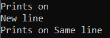

## **کلمات کلیدی علامت زده شده و علامت نزده شده در سی شارپ**

در این مقاله، قصد دارم در مورد نیاز و کاربرد **کلمات کلیدی Checked و Unchecked در سی شارپ** با مثال‌هایی بحث کنم. سی شارپ کلمات کلیدی checked و unchecked را ارائه می‌دهد که برای مدیریت استثنائات از نوع صحیح استفاده می‌شوند.

##### **چرا در سی شارپ به کلمات کلیدی علامت گذاری شده (Checked) و علامت گذاری نشده (Unchecked) نیاز داریم؟**

طبق MSDN، **کلمه کلیدی Checked در سی شارپ** برای فعال کردن صریح بررسی سرریز برای عملیات و تبدیل‌های حسابی از نوع صحیح استفاده می‌شود. کلمه **کلیدی Unchecked در سی شارپ** برای جلوگیری از بررسی سرریز برای عملیات و تبدیل‌های حسابی از نوع صحیح استفاده می‌شود.

در اینجا، بررسی سرریز به این معنی است که وقتی مقدار هر نوع صحیح از محدوده آن فراتر می‌رود، هیچ استثنایی ایجاد نمی‌کند، در عوض نتایج غیرمنتظره یا بی‌ارزشی به ما می‌دهد. اگر در حال حاضر این موضوع برایتان واضح نیست، نگران نباشید، سعی می‌کنیم دو نکته فوق را با مثال‌هایی درک کنیم.

##### **مثال:**

ابتدا، یک برنامه کنسول ایجاد کنید. حال، برای اهداف نمایشی، بیایید نوع داده " **int** " را در نظر بگیریم و ببینیم حداکثر مقداری که می‌تواند در خود نگه دارد چیست. برای انجام این کار، لطفاً کلاس Program را مطابق شکل زیر تغییر دهید.

```csharp
using System;

namespace CheckedUncheckedDemo
{
    class Program
    {
        static void Main(string[] args)
        {
            Console.WriteLine(int.MaxValue);
            Console.ReadLine();
        }
    }
}
```

**خروجی: ۲۱۴۷۴۸۳۶۴۷**

##### **مثال بدون کلمه کلیدی Checked در سی شارپ:**

حالا، بیایید ببینیم کلمه کلیدی checked کجا می‌تواند به ما در مفیدتر کردن کدتان کمک کند. در مثال زیر، می‌توانید ببینید که ما سه متغیر عدد صحیح داریم. متغیرهای عدد صحیح a و b حداکثر مقداری را که یک عدد صحیح می‌تواند داشته باشد، در خود نگه می‌دارند. سپس ما به سادگی اعداد صحیح a و b را با هم جمع می‌کنیم و آنها را در متغیر عدد صحیح سوم iec ذخیره می‌کنیم.

```csharp
using System;

namespace CheckedUncheckedDemo
{
    class Program
    {
        static void Main(string[] args)
        {
            int a = 2147483647;
            int b = 2147483647;

            int c = a + b;

            Console.WriteLine(c);
            Console.ReadLine();
        }
    }
}
```

حالا برنامه را اجرا کنید و خروجی را ببینید.

**خروجی: \-2**

همانطور که می‌بینید، عدد -۲ نمایش داده می‌شود، اما این چیزی نیست که ما انتظار داشتیم. چیزی که ما انتظار داریم یک خطا (سرریز) یا استثنا است. اینجاست که کلمه کلیدی Checked به ما کمک می‌کند تا به این هدف برسیم و استثنای سرریز را ایجاد کنیم.

##### **مثالی برای درک کلمه کلیدی checked در سی شارپ**

مثال کد زیر از کلمه کلیدی checked استفاده می‌کند. از آنجایی که ما از کلمه کلیدی checked استفاده می‌کنیم، باید به جای نمایش -۲، خطای زمان اجرا ایجاد کند.

```csharp
using System;

namespace CheckedUncheckedDemo
{
    class Program
    {
        static void Main(string[] args)
        {
            int a = 2147483647;
            int b = 2147483647;

            int c = checked(a + b);

            Console.WriteLine(c);
            Console.ReadLine();
        }
    }
}
```

حالا، وقتی برنامه را اجرا می‌کنید، همانطور که انتظار می‌رود، باید خطای OverflowException زیر را دریافت کنید.


به عبارت ساده، می‌توان گفت که کلمه کلیدی checked در سناریوهایی استفاده می‌شود که می‌خواهید مطمئن شوید نوع داده سمت چپ شما دچار سرریز نمی‌شود.

##### **کلمه کلیدی بررسی نشده در سی شارپ:**

بیایید نیاز و کاربرد کلمه کلیدی unchecked در سی شارپ را درک کنیم. کلمه کلیدی unchecked تقریباً مشابه رفتار پیش‌فرض کامپایلر رفتار می‌کند.

بیایید نکته‌ی بالا را اثبات کنیم. بنابراین، کلاس Program را مطابق شکل زیر تغییر دهید و سپس خروجی را ببینید.

```csharp
using System;

namespace CheckedUncheckedDemo
{
    class Program
    {
        static void Main(string[] args)
        {
            int a = 2147483647;
            int b = 2147483647;

            int c = unchecked(a + b);

            Console.WriteLine(c);
            Console.ReadLine();
        }
    }
}
```

همانطور که در کد بالا نشان داده شده است، ما فقط کلمه کلیدی unchecked را قبل از عبارت حسابی متغیر c اضافه کرده‌ایم. اکنون، برنامه خود را اجرا کنید و باید خروجی زیر را دریافت کنید..

###### **خروجی: \-2**

بنابراین این ثابت می‌کند که کلمه کلیدی unchecked تقریباً مانند کامپایلر پیش‌فرض عمل می‌کند. حال سوالی که باید به ذهن شما خطور کند این است که وقتی کامپایلر پیش‌فرض مانند کلمه کلیدی unchecked عمل می‌کند، پس کاربرد دقیق آن چیست؟

حالا، بیایید یک مثال ساده ببینیم تا نیاز دقیق به کلمه کلیدی unchecked در سی شارپ را درک کنیم. لطفاً کلاس Program را مطابق شکل زیر تغییر دهید.

```csharp
using System;

namespace CheckedUncheckedDemo
{
    class Program
    {
        static void Main(string[] args)
        {
            const int a = 2147483647;
            const int b = 2147483647;

            int c = a + b;

            Console.WriteLine(c);
            Console.ReadLine();
        }
    }
}
```

همانطور که در کد بالا می‌بینید، ما متغیرهای a و b را از نوع const int تعریف کرده‌ایم. حال، وقتی سعی می‌کنید پروژه را کامپایل کنید، باید خطای زمان کامپایل زیر را دریافت کنید.


اگر می‌خواهید از این رفتار اجتناب کنید، باید از کلمه کلیدی unchecked در C# استفاده کنید. لطفاً کلاس Program را مطابق شکل زیر تغییر دهید که به شما در دستیابی به این کار کمک می‌کند.

```csharp
using System;

namespace CheckedUncheckedDemo
{
    class Program
    {
        static void Main(string[] args)
        {
            const int a = 2147483647;
            const int b = 2147483647;

            int c = unchecked(a + b);

            Console.WriteLine(c);
            Console.ReadLine();
        }
    }
}
```

حالا، وقتی این کد را کامپایل می‌کنید، خواهید دید که کامپایلر هیچ خطایی نمی‌دهد، همانطور که در تصویر زیر نشان داده شده است.

