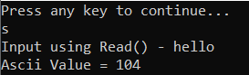
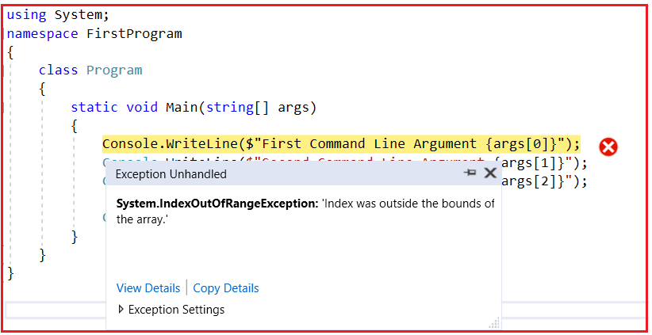

## **Stack و Heap در .net  با مثال**

در این مقاله، من **به همراه مثال‌هایی در مورد حافظه Stack و Heap در برنامه‌های .NET** بحث خواهم کرد. در بخشی از این مقاله، ابتدا در مورد اتفاقاتی که هنگام تعریف متغیری از نوع مقداری و نوع مرجع رخ می‌دهد، بحث خواهیم کرد. سپس، به جلو خواهیم رفت و دو مفهوم مهم، یعنی حافظه stack و heap، را یاد خواهیم گرفت و در مورد انواع مقداری و نوع مرجع صحبت خواهیم کرد.

##### **وقتی یک متغیر را در یک برنامه .NET تعریف می‌کنیم، چه اتفاقی در داخل آن می‌افتد؟**

وقتی یک متغیر را در یک برنامه .NET تعریف می‌کنیم، مقداری از حافظه RAM به آن اختصاص داده می‌شود. حافظه‌ای که در RAM به آن اختصاص داده می‌شود، شامل سه بخش است:

1. **نام متغیر،**
2. **نوع داده متغیر، و**
3. **مقدار متغیر.**

برای درک بهتر، لطفاً به تصویر زیر نگاهی بیندازید. در اینجا، ما یک متغیر از نوع int تعریف کرده و مقدار 101 را به آن اختصاص داده‌ایم.

تصویر بالا یک نمای کلی از آنچه در حافظه اتفاق می‌افتد را نشان می‌دهد. اما بسته به نوع داده (یعنی بسته به نوع مقدار و نوع مرجع)، حافظه ممکن است در پشته یا در حافظه هیپ اختصاص داده شود.

##### **آشنایی با حافظه پشته (Stack) و حافظه هیپ (Heap) در سی شارپ (C#):**

دو نوع تخصیص حافظه برای متغیرهایی که در برنامه .NET ایجاد کرده‌ایم وجود دارد، یعنی حافظه Stack و حافظه Heap. بیایید حافظه Stack و Heap را با یک مثال درک کنیم. برای درک حافظه Stack و Heap، لطفاً به کد زیر نگاهی بیندازید و بیایید بفهمیم که در واقع چه اتفاقی در کد زیر به صورت داخلی می‌افتد.

 و حافظه هیپ (Heap) در دات نت (.NET)")

همانطور که در تصویر بالا مشاهده می‌کنید، SomeMethod سه دستور دارد. بیایید دستور به دستور نحوه اجرای داخلی چیزها را بررسی کنیم.

##### **بیانیه ۱:**

وقتی اولین دستور اجرا می‌شود، کامپایلر مقداری از حافظه را در پشته (Stack) اختصاص می‌دهد. حافظه پشته مسئول پیگیری حافظه در حال اجرا مورد نیاز در برنامه شماست. برای درک بهتر، لطفاً به تصویر زیر نگاهی بیندازید.

##### **بیانیه ۲:**

وقتی دستور دوم اجرا می‌شود، این تخصیص حافظه (تخصیص حافظه برای متغیر y) را روی تخصیص حافظه اول (تخصیص حافظه برای متغیر x) قرار می‌دهد. می‌توانید پشته را به عنوان مجموعه‌ای از بشقاب‌ها یا ظروف که روی هم قرار گرفته‌اند در نظر بگیرید. لطفاً برای درک بهتر به نمودار زیر نگاهی بیندازید.

تخصیص و آزادسازی حافظه پشته در دات‌نت از اصل «آخرین ورودی، اولین خروجی» استفاده می‌کند. به عبارت دیگر، می‌توان گفت که تخصیص و آزادسازی حافظه فقط در یک انتهای حافظه، یعنی بالای پشته، انجام می‌شود.

##### **بیانیه ۳:**

در دستور سوم، ما یک شیء از نوع SomeClass ایجاد کرده‌ایم. وقتی دستور سوم اجرا می‌شود، به صورت داخلی یک اشاره‌گر روی حافظه پشته ایجاد می‌کند و شیء واقعی در یک مکان حافظه متفاوت به نام حافظه Heap ذخیره می‌شود. مکان حافظه Heap حافظه در حال اجرا را ردیابی نمی‌کند. Heap برای تخصیص حافظه پویا استفاده می‌شود. برای درک بهتر، لطفاً به تصویر زیر نگاهی بیندازید.

**نکته:** اشاره‌گرهای مرجع روی پشته تخصیص داده می‌شوند. عبارت **SomeClass cls1** هیچ حافظه‌ای را برای نمونه‌ای از **SomeClass** تخصیص نمی‌دهد. فقط یک متغیر با نام cls1 را در پشته تخصیص می‌دهد و مقدار آن را null قرار می‌دهد. وقتی به کلمه کلیدی new می‌رسد، حافظه را در هیپ تخصیص می‌دهد.

##### **وقتی متد اجرای خود را کامل می‌کند چه اتفاقی می‌افتد؟**

وقتی سه دستور اجرا می‌شوند، کنترل از متد خارج می‌شود. وقتی از کنترل انتهایی، یعنی علامت «}» در انتهای آکولاد، عبور می‌کند، تمام متغیرهای حافظه ایجاد شده در پشته را پاک می‌کند. حافظه را به روش «LIFO» از پشته خارج می‌کند. برای درک بهتر، لطفاً به تصویر زیر نگاهی بیندازید.

این کار حافظه Heap را از حالت تخصیص خارج نمی‌کند. بعداً، حافظه Heap توسط garbage collector از حالت تخصیص خارج می‌شود. حال، ممکن است یک سوال در ذهنتان داشته باشید: چرا دو نوع حافظه؟ آیا نمی‌توانیم همه چیز را فقط به یک نوع حافظه اختصاص دهیم؟

##### **چرا ما دو نوع حافظه داریم؟**

در سی شارپ، انواع داده‌های اولیه، مانند int، double، bool و غیره، یک مقدار واحد را در خود نگه می‌دارند. از سوی دیگر، انواع داده‌های مرجع یا انواع داده‌های شیء پیچیده هستند، یعنی یک نوع داده شیء یا نوع داده مرجع می‌تواند به اشیاء دیگر و سایر انواع داده‌های اولیه ارجاع داشته باشد.

بنابراین، نوع داده مرجع، ارجاعاتی به چندین مقدار دیگر را در خود نگه می‌دارد و هر یک از آنها باید در حافظه ذخیره شوند. انواع شیء به حافظه پویا نیاز دارند، در حالی که انواع داده اولیه به حافظه استاتیک نیاز دارند. لطفاً برای درک بهتر به تصویر زیر نگاهی بیندازید.

 داریم؟")

##### **انواع مقداری و انواع ارجاعی در C#.NET**

همانطور که مفهوم Stack و Heap را درک کردیم، حال بیایید به جلو برویم و مفهوم انواع مقداری (Value Type) و انواع ارجاعی (Reference Type) را در C# درک کنیم. انواع مقداری (Value Type) انواعی هستند که هم داده و هم حافظه را در یک مکان نگه می‌دارند. از سوی دیگر، نوع ارجاعی (Reference Type) نوعی است که دارای یک اشاره‌گر است که به مکان واقعی حافظه اشاره می‌کند.

##### **آشنایی با نوع مقداری در سی شارپ:**

بگذارید نوع مقداری را با یک مثال درک کنیم. لطفاً به تصویر زیر نگاهی بیندازید. همانطور که در تصویر مشاهده می‌کنید، ابتدا یک متغیر عدد صحیح با نام x ایجاد می‌کنیم و سپس مقدار صحیح x را به متغیر عدد صحیح دیگری با نام y اختصاص می‌دهیم. در این حالت، تخصیص حافظه برای این دو متغیر در داخل حافظه پشته انجام می‌شود.

در دات‌نت، وقتی مقدار یک متغیر عدد صحیح را به متغیر عدد صحیح دیگری اختصاص می‌دهیم، یک کپی کاملاً متفاوت در حافظه پشته ایجاد می‌شود. این همان چیزی است که می‌توانید در تصویر بالا مشاهده کنید. بنابراین، اگر مقدار یک متغیر را تغییر دهید، متغیر دیگر تحت تأثیر قرار نمی‌گیرد. در دات‌نت، به این نوع داده‌ها، انواع مقداری (Value Types) گفته می‌شود. بنابراین، bool، byte، char، decimal، double، enum، float، long، sbyte، int، short، ulong، struct، uint، ushort نمونه‌هایی از انواع مقداری هستند.

##### **آشنایی با نوع ارجاعی (Reference Type) در سی شارپ (C#):**

بگذارید با یک مثال، نوع ارجاعی (reference type) را درک کنیم. لطفاً به تصویر زیر نگاهی بیندازید. در اینجا، ابتدا یک شیء، یعنی obj1، ایجاد می‌کنیم و سپس این شیء را به شیء دیگری، یعنی obj2، اختصاص می‌دهیم. در این حالت، هر دو متغیر ارجاعی (obj1 و obj2) به یک مکان حافظه اشاره می‌کنند.

 در سی شارپ")

در این حالت، وقتی یکی از آنها را تغییر می‌دهید، شیء دیگر نیز تحت تأثیر قرار می‌گیرد. این نوع از انواع داده در دات‌نت، انواع مرجع (Reference Types) نامیده می‌شوند. بنابراین، کلاس، رابط (interface)، شیء (object)، رشته (string) و نماینده (delegate) نمونه‌هایی از انواع مرجع (Reference Types) هستند.

##### **حافظه Heap چگونه آزاد می‌شود؟**

تخصیص حافظه در پشته زمانی که کنترل از متد خارج می‌شود، یعنی زمانی که اجرای متد کامل می‌شود، آزاد می‌شود. از سوی دیگر، تخصیص حافظه که در هیپ انجام می‌شود، باید توسط زباله‌روب آزاد شود.

وقتی یک شیء ذخیره شده در هیپ دیگر استفاده نمی‌شود، به این معنی است که شیء هیچ اشاره مرجعی ندارد. در این صورت، شیء واجد شرایط جمع‌آوری زباله است. جمع‌آوری زباله در مقطعی این شیء را از هیپ خارج می‌کند.

##### **نکات کلیدی حافظه پشته:**

- **تخصیص:** حافظه پشته برای تخصیص حافظه استاتیک و متغیرهای محلی اختصاص داده شده است. این حافظه توسط CPU مدیریت می‌شود و آن را سریع‌تر و کارآمدتر می‌کند.
- **کاربرد:** وقتی یک متد فراخوانی می‌شود، یک بلوک حافظه (یک قاب پشته) در پشته برای متغیرها و پارامترهای محلی آن اختصاص داده می‌شود. وقتی فراخوانی متد برمی‌گردد، بلوک بلااستفاده می‌شود و می‌تواند برای فراخوانی متد بعدی مورد استفاده قرار گیرد.
- **طول عمر:** متغیرهای ذخیره شده در پشته فقط در طول عمر فراخوانی متد در دسترس هستند.
- **نوع داده:** انواع مقداری را در سی شارپ ذخیره می‌کند. این شامل انواع داده‌های اولیه (مانند int، double، char)، ساختارها و ارجاعات به اشیاء (خود ارجاعات، نه اشیاء) می‌شود.

##### **نکات کلیدی حافظه هیپ:**

- **تخصیص:** حافظه هیپ برای تخصیص پویای حافظه استفاده می‌شود که شامل اشیاء و ساختارهای داده پیچیده‌ای است که به انعطاف‌پذیری بیشتری نیاز دارند و توسط garbage collector در دات‌نت مدیریت می‌شوند.
- **نحوه‌ی استفاده:** اشیاء روی هیپ (heap) تخصیص داده می‌شوند و حافظه در زمان اجرا مدیریت می‌شود. اشیاء جدید با استفاده از کلمه کلیدی new ایجاد می‌شوند و وقتی اشیاء دیگر مورد استفاده قرار نمی‌گیرند، garbage collector به طور خودکار حافظه هیپ را آزاد می‌کند.
- **طول عمر:** اشیاء روی هیپ از زمان ایجاد تا زمانی که دیگر استفاده نشوند و زباله‌روب شوند، زنده می‌مانند.
- **نوع داده:** انواع ارجاعی مانند اشیاء، آرایه‌ها و نمونه‌های کلاس را ذخیره می‌کند.

##### **تفاوت‌های کلیدی بین حافظه پشته و سر در .NET:**

- **مدیریت:** حافظه پشته به طور خودکار توسط سیستم مدیریت می‌شود، در حالی که حافظه هیپ به صورت پویا توسط جمع‌آوری‌کننده زباله تخصیص داده و آزاد می‌شود.
- **سرعت:** حافظه پشته به دلیل سازماندهی و نحوه مدیریت آن، عموماً سریع‌تر از حافظه هیپ است.
- **اندازه:** پشته بر اساس رشته (thread) محدودیت‌های اندازه دارد، اما هیپ می‌تواند به صورت پویا در صورت نیاز (محدود به حافظه موجود سیستم) رشد کند.
- **دسترسی:** دسترسی به حافظه پشته (Stack Memory) سرراست‌تر و سریع‌تر است، در حالی که حافظه هیپ (Heap Memory) نیاز به مدیریت پیچیده‌تری دارد.
- **ذخیره‌سازی:** انواع مقداری در حافظه پشته (stack memory) ذخیره می‌شوند، در حالی که انواع ارجاعی (reference types) در حافظه هیپ (heap memory) ذخیره می‌شوند.
