## **جعبه‌بندی و باز کردن جعبه در سی‌شارپ به همراه مثال**

در این مقاله، من در مورد **Boxing و Unboxing در سی شارپ** با مثال صحبت خواهم کرد. Boxing و Unboxing دو مفهوم اساسی در سی شارپ هستند که با تبدیل بین انواع مقداری و مرجع سروکار دارند. درک این مفاهیم بسیار مهم است زیرا بر عملکرد و استفاده از حافظه تأثیر می‌گذارند.

بنابراین، کاری که در این مقاله انجام خواهیم داد این است که ابتدا سعی خواهیم کرد Boxing و Unboxing را با مثال‌هایی درک کنیم. سپس، خواهیم دید که کد IL چگونه به نظر می‌رسد و در نهایت، پیامدهای عملکرد به دلیل boxing و unboxing را در برنامه C# بررسی خواهیم کرد.

##### **جعبه‌بندی و باز کردن جعبه در سی‌شارپ:**

**جعبه‌بندی:** جعبه‌بندی فرآیند تبدیل یک نوع مقداری (مانند int، double، struct) به یک نوع مرجع (شیء) است. وقتی یک نوع مقداری جعبه‌بندی می‌شود، یک شیء جدید به هیپ اختصاص داده می‌شود و مقدار در آن کپی می‌شود.

**باز کردن جعبه (Unboxing):** باز کردن جعبه فرآیند معکوس باز کردن جعبه است، که در آن یک مقدار از یک شیء استخراج می‌شود. این شامل تبدیل صریح یک نوع مرجع (شیء) به یک نوع مقدار است. این عملیات همچنین شامل یک عملیات کپی است، که در آن مقدار از هیپ به پشته کپی می‌شود.

بیایید Boxing و Unboxing را در سی شارپ با یک مثال درک کنیم. لطفاً به کد زیر نگاهی بیندازید.

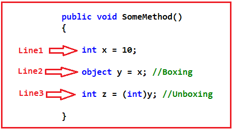

متد فوق شامل سه خط کد است. حال، بیایید بفهمیم هنگام اجرای هر خط کد چه اتفاقی می‌افتد.

##### **خط اول: int x = 10;**

وقتی این دستور اجرا شود، یک متغیر صحیح x در حافظه Stack با مقدار 10 ایجاد می‌شود. برای درک بهتر، لطفاً به نمودار زیر نگاهی بیندازید.

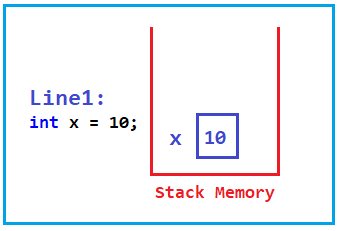

##### **خط ۲: object y = x;**

هنگام اجرای این دستور، مقدار x، یعنی 10، را به یک نوع داده شیء منتقل می‌کنیم. اگر به خاطر داشته باشید، شیء، کلاس والد برای همه کلاس‌ها در چارچوب .NET است. وقتی یک نوع مقدار را به یک نوع مرجع منتقل می‌کنیم، به آن Boxing گفته می‌شود. بنابراین، در اینجا ما نوع مقدار صحیح x را به نوع مرجع شیء y منتقل می‌کنیم، بنابراین در اینجا boxing را انجام می‌دهیم.

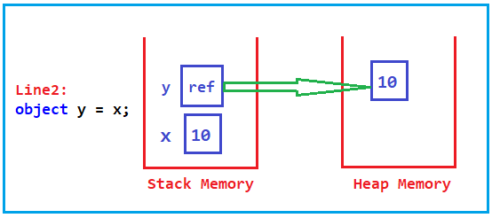

بنابراین، وقتی یک نوع مقداری را به یک نوع مرجع منتقل می‌کنیم یا یک نوع مقداری را به یک نوع مرجع تنظیم می‌کنیم، به آن Boxing در C# می‌گویند.

##### **خط ۳: int z = (int)y;**

هنگام اجرای این دستور، ما با انجام تبدیل نوع، مقدار شیء را به یک نوع داده صحیح منتقل می‌کنیم. وقتی یک نوع مرجع را به یک نوع مقداری منتقل می‌کنیم، به آن Unboxing می‌گویند. بنابراین، ما مقدار نوع مرجع، یعنی y، را به یک نوع عدد صحیح، یعنی z، منتقل می‌کنیم، بنابراین در اینجا Unboxing را انجام می‌دهیم.

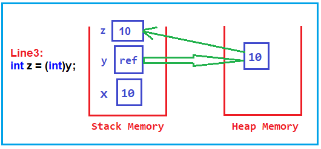

بنابراین، وقتی یک نوع ارجاعی را به یک نوع مقداری منتقل می‌کنیم یا آن را روی یک نوع مقداری تنظیم می‌کنیم، در سی شارپ به آن Unboxing می‌گویند.

**نکته:** Boxing به این معنی است که شما یک نوع مقداری را روی یک نوع مرجع تنظیم می‌کنید، و Unboxing به این معنی است که یک نوع مرجع را روی یک نوع مقداری تنظیم می‌کنید.

##### **مثال برای درک Boxing و Unboxing در سی شارپ:**

حالا، یک مثال ساده ایجاد می‌کنیم که Boxing و Unboxing را با استفاده از زبان C# پیاده‌سازی می‌کند و سپس خواهیم دید که کد IL چگونه به نظر می‌رسد. بنابراین، یک برنامه کنسول ایجاد کنید و سپس کلاس Program را به صورت زیر تغییر دهید:

```csharp
namespace BoxingUnboxingDemo
{
    class Program
    {
        static void Main(string[] args)
        {
            int x = 10;
            object y = x; //Boxing
            int z = (int)y; //Unboxing
        }
    }
}
```

حالا، سولوشن را بسازید و مطمئن شوید که فایل EXE تولید شده است. در مورد من، فایل EXE در مسیر زیر تولید می‌شود.

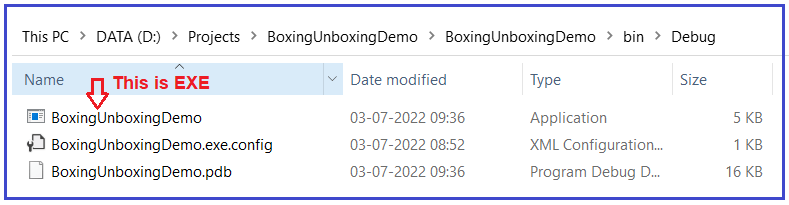

حالا، خط فرمان ویژوال استودیو را باز کنید، ILDASM را تایپ کنید و همانطور که در تصویر زیر نشان داده شده است، دکمه اینتر را فشار دهید.

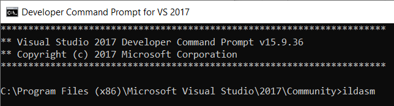

پس از فشردن دکمه‌ی اینتر، پنجره‌ی ILDASM مطابق تصویر زیر باز می‌شود.

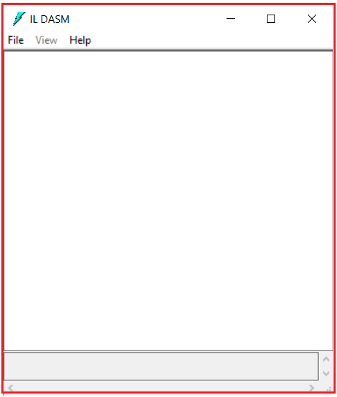

حالا، فایل EXE را با استفاده از ILDASM باز کنید. برای انجام این کار، همانطور که در تصویر زیر نشان داده شده است، از منوی زمینه، File => Open را انتخاب کنید.

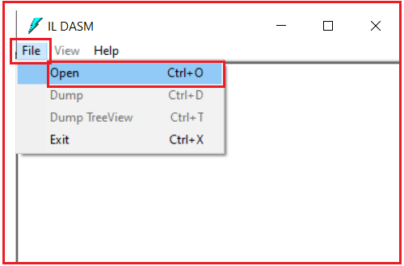

پنجره انتخاب فایل اجرایی (EXE) باز می‌شود. فایل اجرایی (EXE) را از این پنجره انتخاب کنید و مطابق تصویر زیر، روی دکمه باز کردن (Open) کلیک کنید.

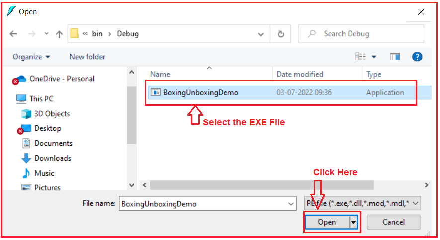

حالا می‌توانید ببینید که فایل EXE در پنجره ILDASM بارگذاری شده است. می‌توانید با کلیک بر روی دکمه بعلاوه، بخش مورد نظر را گسترش دهید. بنابراین، پس از گسترش، تصویر زیر را مشاهده خواهید کرد.

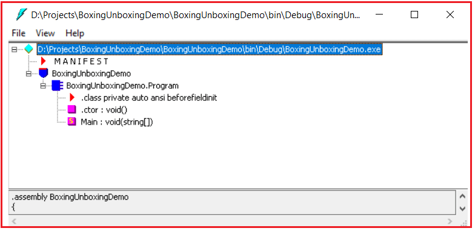

اگر به خاطر داشته باشید، ما کد خود را درون متد Main نوشتیم. بنابراین، برای مشاهده کد IL، روی متد Main دوبار کلیک کنید.

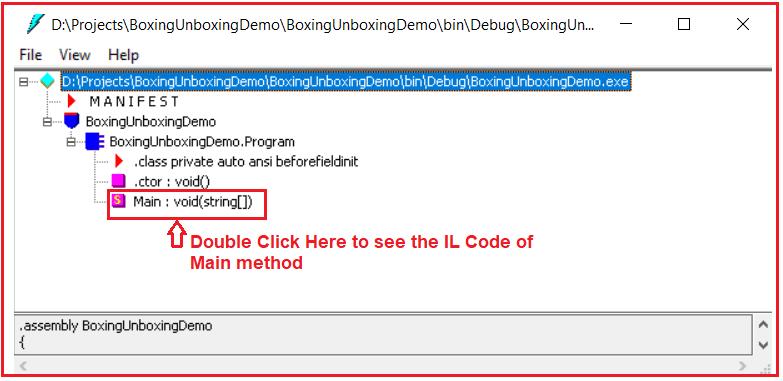

پس از دوبار کلیک کردن، کد IL زیر از متد Main را مشاهده خواهید کرد.

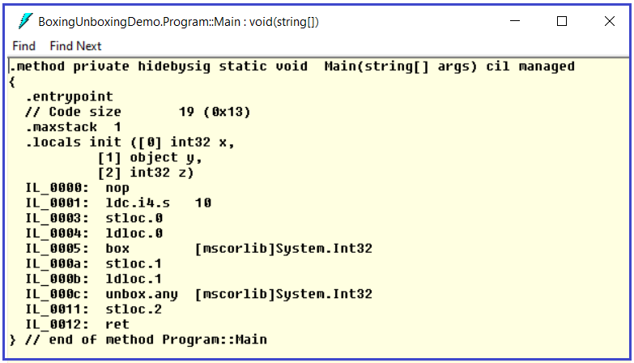

حالا اگر به کد IL نگاه کنید، خواهید دید که چیزی به نام box وجود دارد که چیزی جز boxing نیست، و چیزی به نام unbox که چیزی جز unboxing نیست. همچنین می‌توانید ببینید که کد IL برای Boxing و Unboxing در C# چگونه به نظر می‌رسد. برای درک بهتر، لطفاً به تصویر زیر نگاهی بیندازید.

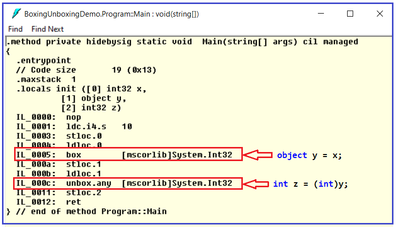

خب، تا اینجا، ما دیدیم که boxing و unboxing در سی‌شارپ چیست و کد IL برای boxing و unboxing چگونه است. بیایید جلوتر برویم و ببینیم که آیا هنگام انجام boxing و unboxing، یعنی وقتی یک نوع مقداری را به یک نوع مرجع و از یک نوع مرجع به یک نوع مقداری منتقل می‌کنیم، تأثیری بر عملکرد وجود دارد یا خیر.

##### **تأثیر عملکرد Boxing در سی شارپ:**

بیایید ابتدا مفهوم عملکرد Boxing را در C# بررسی کنیم. لطفاً به مثال زیر نگاهی بیندازید. در مثال زیر، ما دو متد ایجاد کرده‌ایم، یعنی Boxing و WithoutBoxing. در متد Boxing، ما boxing را انجام می‌دهیم، یعنی یک نوع مقداری را به یک نوع مرجع منتقل می‌کنیم، و در متد WithoutBoxing، ما boxing یا unboxing را انجام نمی‌دهیم، یعنی یک انتساب ساده انجام می‌دهیم. سپس، از متد Main، هر دو متد را با استفاده از دو حلقه for مختلف فراخوانی می‌کنیم. و هر دو حلقه قرار است **۱۰۰۰۰۰۰** بار اجرا شوند. علاوه بر این، برای اندازه‌گیری زمان، از StopWatch استفاده می‌کنیم.

```csharp
using System;
using System.Diagnostics;

namespace BoxingUnboxingDemo
{
    class Program
    {
        static void Main(string[] args)
        {
            Stopwatch stopwatch1 = new Stopwatch();
            stopwatch1.Start();
            for(int i = 1; i<= 1000000; i++)
            {
                Boxing();
            }
            
            stopwatch1.Stop();
            Console.WriteLine($"Boxing took: {stopwatch1.ElapsedMilliseconds} MS");

            Stopwatch stopwatch2 = new Stopwatch();
            stopwatch2.Start();
            for (int i = 1; i <= 1000000; i++)
            {
                WithoutBoxing();
            }
            stopwatch2.Stop();
            Console.WriteLine($"Without Boxing took: {stopwatch2.ElapsedMilliseconds} MS");
            Console.ReadKey();
        }

        //With Boxing
        public static void Boxing()
        {
            int i = 100;
            object j = i; //Boxing
        }

        //Without Boxing
        public static void WithoutBoxing()
        {
            int i = 100;
            int j = i; //No Boxing and No Unboxing
        }
    }
}
```

###### **خروجی:**

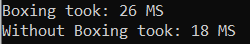

همانطور که در تصویر بالا مشاهده می‌کنید، Boxing روی دستگاه من ۲۶ میلی‌ثانیه طول کشید، در حالی که بدون boxing، ۱۸ میلی‌ثانیه طول کشید. این بدان معناست که اگر از boxing استفاده کنید، در C# افت عملکرد وجود دارد.

##### **تأثیر عملکرد Unboxing در سی شارپ:**

حال، بیایید مفهوم عملکرد Unboxing را در C# بررسی کنیم. لطفاً به مثال زیر نگاهی بیندازید. در مثال زیر، ما دو متد ایجاد کرده‌ایم، یعنی Unboxing و WithoutBoxingAndUnboxing. در متد Unboxing، ما unboxing را انجام می‌دهیم، یعنی یک نوع مرجع را به یک نوع مقداری منتقل می‌کنیم. در متد WithoutBoxingAndUnboxing، ما boxing یا unboxing را انجام نمی‌دهیم، یعنی یک انتساب ساده انجام می‌دهیم. سپس، از متد Main، هر دو متد را با استفاده از دو حلقه for مختلف فراخوانی می‌کنیم. و هر دو حلقه قرار است **۱۰۰۰۰۰۰** بار اجرا شوند. علاوه بر این، برای اندازه‌گیری زمان، از StopWatch استفاده می‌کنیم.

```csharp
using System;
using System.Diagnostics;

namespace BoxingUnboxingDemo
{
    class Program
    {
        static void Main(string[] args)
        {
            Stopwatch stopwatch1 = new Stopwatch();
            stopwatch1.Start();
            for(int i = 1; i<= 1000000; i++)
            {
                Unboxing();
            }
            
            stopwatch1.Stop();
            Console.WriteLine($"Unboxing took: {stopwatch1.ElapsedMilliseconds} MS");

            Stopwatch stopwatch2 = new Stopwatch();
            stopwatch2.Start();
            for (int i = 1; i <= 1000000; i++)
            {
                WithoutBoxingAndUnboxing();
            }
            stopwatch2.Stop();
            Console.WriteLine($"WithoutBoxingAndUnboxing took: {stopwatch2.ElapsedMilliseconds} MS");
            Console.ReadKey();
        }

        //With Unboxing
        public static void Unboxing()
        {
            object j = 100;
            int i = (int) j; //Unboxing
        }

        //Without Boxing
        public static void WithoutBoxingAndUnboxing()
        {
            int i = 100;
            int j = i; //No Boxing and No Unboxing
        }
    }
}
```

###### **خروجی:**

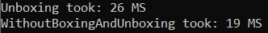

در خروجی بالا می‌توانید ببینید که Unboxing روی دستگاه من ۲۶ میلی‌ثانیه طول کشید در حالی که WithoutBoxingAndUnboxing 19 میلی‌ثانیه طول کشید. این بدان معناست که اگر از Unboxing استفاده کنید، در C# افت عملکرد وجود دارد.

**نکته:** ما همیشه باید از Boxing و Unboxing در سی شارپ به دلیل کاهش عملکرد در توسعه برنامه، اجتناب کنیم.

##### **نکات کلیدی مربوط به Boxing و Unboxing در سی شارپ:**

- **ملاحظات عملکردی:** عملیات Boxing و Unboxing از نظر محاسباتی پرهزینه هستند. این عملیات شامل تخصیص حافظه و کپی کردن می‌شوند و بر عملکرد، به ویژه در حلقه‌های تنگ یا سناریوهای با کارایی بالا، تأثیر می‌گذارند.
- **استفاده از حافظه:** Boxing حافظه را روی هیپ اختصاص می‌دهد که می‌تواند منجر به افزایش استفاده از حافظه شود و ممکن است باعث شود عملیات جمع‌آوری زباله (garbage collection) بیشتر انجام شود.
- **ایمنی نوع:** Unboxing نیاز به تبدیل نوع صریح دارد و اگر نوع‌ها مطابقت نداشته باشند، در زمان اجرا خطای InvalidCastException رخ می‌دهد.
- **استفاده در مجموعه‌ها:** قبل از معرفی ژنریک‌ها در .NET 2.0، مجموعه‌هایی مانند ArrayList فقط می‌توانستند اشیاء را ذخیره کنند، بنابراین انواع مقادیر هنگام اضافه شدن به این مجموعه‌ها در جعبه قرار می‌گرفتند. با ژنریک‌ها (List<T>، Dictionary<TKey، TValue>)، می‌توان از جعبه‌بندی اجتناب کرد زیرا مجموعه‌ها می‌توانند انواع مقادیر خاصی را ذخیره کنند.
 
 **بهترین شیوه‌ها:**

- **از Boxing و Unboxing غیرضروری خودداری کنید:** به انواع داده‌های خود، به خصوص در کدهایی که از نظر عملکرد حیاتی هستند، توجه داشته باشید تا از Boxing و Unboxing غیرضروری جلوگیری کنید.
- **استفاده از Generics:** برای جلوگیری از دسته‌بندی انواع مقادیر، مجموعه‌های Generic را به مجموعه‌های غیر Generic ترجیح دهید.
- **درک جعبه‌بندی ضمنی:** از موقعیت‌هایی که جعبه‌بندی می‌تواند به صورت ضمنی رخ دهد، مانند ارسال یک نوع مقدار به متدی که یک شیء را می‌پذیرد، آگاه باشید.