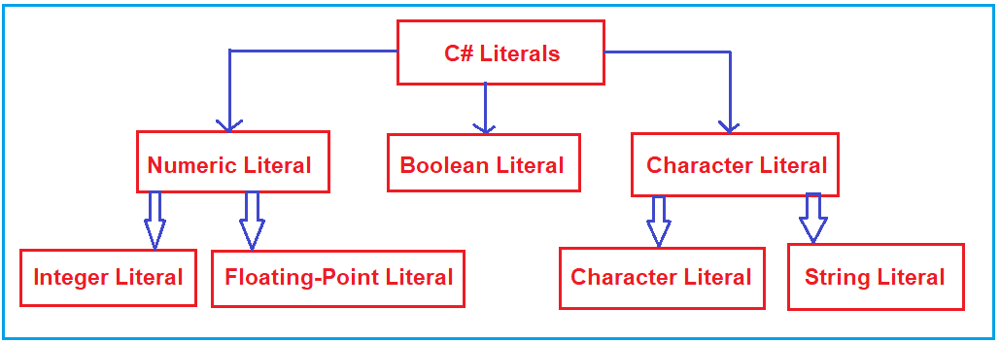
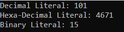
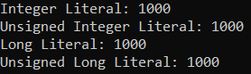
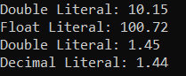
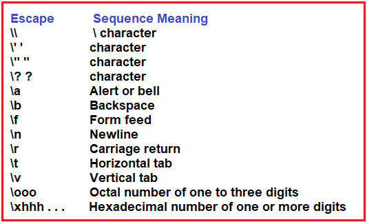
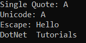
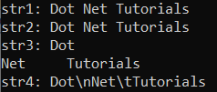
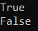
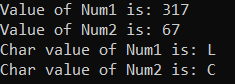

## **لیترال‌ها در سی شارپ به همراه مثال**

در این مقاله، قصد دارم در مورد **لیترال‌ها در سی‌شارپ** با مثال‌ها صحبت کنم.  در پایان این مقاله، شما خواهید فهمید که لیترال‌ها چه هستند و چه زمانی و چگونه می‌توان از لیترال‌ها در برنامه‌های سی‌شارپ استفاده کرد.

##### **لیترال‌ها در سی شارپ**

لیترال‌ها در سی‌شارپ مقادیر ثابت (یا مقادیر کدگذاری‌شده‌ی سخت) هستند که به متغیر شما داده می‌شوند و این مقادیر در طول اجرای برنامه قابل تغییر نیستند.

1. مقادیر ثابت در سی شارپ لیترال (Literal) نامیده می‌شوند.
2. لیترال مقداری است که توسط متغیرها استفاده می‌شود.

برای مثال، **int x = 100;** در اینجا **x** یک **متغیر** و **100** است **یک عدد حقیقی** .

##### **انواع لیترال‌ها در سی شارپ**



همانطور که در تصویر بالا مشاهده می‌کنید، حروف تعریف به طور کلی به پنج دسته زیر طبقه‌بندی می‌شوند.

1. **لیترال‌های عدد صحیح**
2. **لیترال‌های ممیز شناور**
3. **حروف الفبای کاراکتری**
4. **لیترال‌های رشته‌ای**
5. **لیترال‌های بولی**

بیایید هر یک از این لیترال‌ها را در سی‌شارپ با مثال بررسی کنیم.

##### **لیترال‌های عدد صحیح در سی شارپ:**

لیترال‌های عدد صحیح در سی‌شارپ برای نوشتن مقادیری از نوع int، uint، long، ulong و غیره استفاده می‌شوند. می‌توانیم لیترال‌های عدد صحیح را به شکل اعشاری، دودویی یا هگزادسیمال نمایش دهیم. در اینجا، باید از یک پیشوند استفاده کنیم تا مشخص کنیم که لیترال عدد صحیح از نوع دودویی (با پیشوند 0b) است یا هگزادسیمال (0X). برای اعداد اعشاری نیازی به پیشوند نیست.

به طور پیش‌فرض، هر لیترال عدد صحیح از نوع int است. برای انواع داده Integral (byte، short، int، long)، می‌توانیم لیترال‌ها یا مقادیر ثابت را به 3 روش زیر مشخص کنیم:

1. **اعشاری (مبنای ۱۰):**   ارقام ۰ تا ۹ در این نوع مجاز هستند. برای نوع اعشاری لیترال نیازی به پیشوند نیست. مثال: **int x=101;**
2. **هگزا-دهدهی (مبنای ۱۶):**   ارقام ۰ تا ۹ و همچنین کاراکترهای af در این فرم مجاز هستند. علاوه بر این، می‌توان از هر دو کاراکتر حروف بزرگ و کوچک استفاده کرد. سی‌شارپ در اینجا یک استثنا قائل می‌شود، یعنی همانطور که می‌دانیم سی‌شارپ یک زبان برنامه‌نویسی حساس به حروف بزرگ و کوچک است، اما در اینجا سی‌شارپ به حروف بزرگ و کوچک حساس نیست. در اینجا، عدد هگزادسیمال باید با پیشوند 0X یا 0x و پسوند Face شروع شود. مثال: **int x = 0X123F;**
3. **دودویی (0 و 1):**   در این فرم، ارقام مجاز فقط 1 و 0 هستند. عدد دودویی باید با پیشوند 0b شروع شود. مثال: **int x = 0b1111;**

**نکته:** در سی‌شارپ هیچ لیترال عدد اکتال وجود ندارد. در بسیاری از وب‌سایت‌ها، خواهید دید که در عدد اکتال، ارقام ۰ تا ۷ مجاز هستند و عدد اکتال همیشه باید پیشوند ۰ داشته باشد. مثال: **int x=0146;** اما این اشتباه است. در سی‌شارپ، نمایش عدد اکتال امکان‌پذیر نیست. به لینک Stack Overflow زیر مراجعه کنید.

[**https://stackoverflow.com/questions/4247037/octal-equivalent-in-c-sharp**](https://stackoverflow.com/questions/4247037/octal-equivalent-in-c-sharp)

##### **مثالی برای درک لیترال‌های عدد صحیح در زبان سی شارپ**

``` csharp
using System;
namespace LiteralsDemo
{
    class Program
    {
        static void Main(string[] args)
        {
            // Decimal literal
            //Allowed Digits: 0 to 9
            int a = 101; //No suffix is required

            // Hexa-Decimal Literal
            //Allowed Digits: 0 to 9 and Character a to f
            int c = 0x123f; //Prefix with 0x, and suffix with f

            //Binary literal
            //Allowed Digits: 0 to 1
            int d = 0b1111; // //Prefix with 0b

            Console.WriteLine($"Decimal Literal: {a}");
            Console.WriteLine($"Hexa-Decimal Literal: {c}");
            Console.WriteLine($"Binary Literal: {d}");

            Console.ReadKey();
        }
    }
}
```

###### **خروجی:**



برای آشنایی با نحوه تبدیل اعداد هگزادسیمال به دسیمال، لطفاً به وب‌سایت زیر مراجعه کنید.

[**https://calculator.name/baseconvert/decimal/hexadecimal/**](https://calculator.name/baseconvert/decimal/hexadecimal/)

یک پسوند همچنین می‌تواند با اعداد صحیح استفاده شود، مانند U یا u که برای اعداد بدون علامت و l یا L برای اعداد طولانی استفاده می‌شوند. برای درک بهتر، لطفاً به مثال زیر نگاهی بیندازید.

``` csharp
using System;
namespace LiteralsDemo
{
    class Program
    {
        static void Main(string[] args)
        {
            int a = 1000; //Integer
            uint b = 1000U; //Unsigned Integer
            long c = 1000L; //Long
            ulong d = 1000UL; //Unsigned Long
            
            Console.WriteLine($"Integer Literal: {a}");
            Console.WriteLine($"Unsigned Integer Literal: {b}");
            Console.WriteLine($"Long Literal: {c}");
            Console.WriteLine($"Unsigned Long Literal: {d}");

            Console.ReadKey();
        }
    }
}
```
###### **خروجی:**



##### **لیترال‌های ممیز شناور در سی شارپ:**

لیترال‌های موجود در سی‌شارپ که دارای یک بخش صحیح و یک نقطه اعشار هستند، به عنوان لیترال‌های Floating-Point شناخته می‌شوند، یعنی اعداد با اعشار. لیترال‌های Floating-Point برای نوشتن مقادیری از نوع float، double و decimal استفاده می‌شوند.

به طور پیش‌فرض، هر لیترال ممیز شناور از نوع double است و از این رو نمی‌توانیم مقادیر را مستقیماً به متغیرهای float و decimal اختصاص دهیم. اگر می‌خواهید مقادیری را به یک متغیر float اختصاص دهید، باید پسوند f را در انتهای لیترال ممیز شناور اضافه کنید. به طور مشابه، اگر می‌خواهید مقادیری را به یک متغیر decimal اختصاص دهید، باید پسوند m یا M را در انتهای لیترال ممیز شناور اضافه کنید. اگر لیترال ممیز شناور را با چیزی پسوند نکنید، لیترال ممیز شناور به طور پیش‌فرض double خواهد بود. حتی، اگر بخواهید، می‌توانید لیترال ممیز شناور را به طور صریح به عنوان نوع double با پسوند d یا D مشخص کنید، البته این قرارداد الزامی نیست.

##### **مثال برای درک لیترال‌های ممیز شناور در سی شارپ:**

``` csharp
using System;
namespace LiteralsDemo
{
    class Program
    {
        static void Main(string[] args)
        {
            //Double Literal
            double a = 10.15; //By Default Floating Point Literal is double

            //Float Literal
            float b = 100.72F; //Suffix with F

            //Double Literal
            double c = 1.45D; //Suffix with D

            //Decimal Literal
            decimal d = 1.44M; //Suffix with M
            
            Console.WriteLine($"Double Literal: {a}");
            Console.WriteLine($"Float Literal: {b}");
            Console.WriteLine($"Double Literal: {c}");
            Console.WriteLine($"Decimal Literal: {d}");
            
            Console.ReadKey();
        }
    }
}
```
###### **خروجی:**



##### **لیترال‌های کاراکتری در سی شارپ:**

لیترال‌های کاراکتری در سی‌شارپ داخل تک‌کوتیشن قرار می‌گیرند، برای مثال 'a'، و می‌توانند در یک متغیر ساده از نوع داده char ذخیره شوند. یک لیترال کاراکتری می‌تواند یک کاراکتر ساده برای مثال ' **a'** ، یک توالی escape برای مثال **'\\t'** یا یک کاراکتر جهانی برای مثال **'\\u02B0'** باشد . بنابراین، برای انواع داده‌های کاراکتری می‌توانیم لیترال‌های کاراکتری را به 3 روش مشخص کنیم. آنها به شرح زیر هستند:

###### **۱. کاراکترهای لیترال با استفاده از نقل قول تکی:**

می‌توانیم با استفاده از یک علامت نقل قول، لیترال‌های کاراکتری را برای نوع داده char به عنوان یک کاراکتر واحد مشخص کنیم.  
**مثال: char ch = 'A';**

###### **۲. حروف الفبا با استفاده از نمایش یونیکد:**

می‌توانیم حروف کاراکتری را با استفاده از نمایش یونیکد '\\uXXXX' مشخص کنیم که در آن XXXX چهار عدد هگزادسیمال است.  
**مثال: char ch = '\\u0041';**   // در اینجا /u0041 نشان دهنده A است. لطفاً برای مشاهده لیست کاراکترهای یونیکد، لینک زیر را بررسی کنید.  
[**https://en.wikipedia.org/wiki/List\_of\_Unicode\_characters**](https://en.wikipedia.org/wiki/List_of_Unicode_characters)

###### **۳. لیترال‌های کاراکتری با استفاده از توالی Escape:**

هر کاراکتر escape در سی شارپ می‌تواند به عنوان یک کاراکتر تحت‌اللفظی مشخص شود.  
**مثال: char ch = '\\n';**  
کاراکترهای خاصی در سی شارپ وجود دارند که وقتی قبل از آنها یک بک اسلش قرار می‌گیرد، معنای خاصی پیدا می‌کنند که برای نمایش آن استفاده می‌شوند. به عنوان مثال، خط جدید (\\n) و تب (\\t). در زیر لیستی از برخی از کاراکترهای توالی فرار موجود در سی شارپ آمده است.



##### **مثال برای درک لیترال‌های کاراکتری در سی شارپ:**

``` csharp
using System;
namespace LiteralsDemo
{
    class Program
    {
        static void Main(string[] args)
        {
            //Character literal using single quote
            char ch1 = 'A';
            Console.WriteLine("Single Quote: " + ch1);

            //Character literal using Unicode representation
            char ch2 = '\u0041';
            Console.WriteLine("Unicode: " + ch2);

            //Character literal using Escape character
            Console.WriteLine("Escape: Hello\nDotNet\tTutorials");

            Console.ReadKey();
        }
    }
}
```
###### **خروجی:**



##### **لیترال‌های رشته‌ای در سی‌شارپ:**

لیترال‌هایی در سی‌شارپ که بین دو علامت نقل قول ( **” “** ) قرار می‌گیرند یا با **@” “** شروع می‌شوند ، به عنوان لیترال‌های رشته‌ای شناخته می‌شوند. در سی‌شارپ، می‌توانیم لیترال‌های رشته‌ای را به دو روش نمایش دهیم. آن‌ها به شرح زیر هستند:

1. **رشته‌های ادبی معمولی:** یک رشته ادبی معمولی در سی‌شارپ شامل صفر یا چند کاراکتر است که در علامت نقل قول قرار گرفته‌اند، برای مثال، **"Dot Net Tutorials"** و ممکن است شامل توالی‌های escape ساده مانند **"Dot\\nNet\\tTutorials"** و توالی‌های escape یونیکد باشد.
2. **رشته‌های تحت‌اللفظی کلامی:** یک رشته تحت‌اللفظی کلامی با یک کاراکتر @ شروع می‌شود و به دنبال آن یک علامت نقل قول دوتایی قرار می‌گیرد که ممکن است شامل صفر یا چند کاراکتر باشد و با یک علامت نقل قول دوتایی پایان می‌یابد. آن‌ها می‌توانند کاراکترها یا توالی‌های گریز را ذخیره کنند، به عنوان مثال، **@”Dot\\nNet\\tTutorials”** . در این حالت، توالی‌ها یا کاراکترهای گریز به همان شکلی که در خروجی هستند چاپ می‌شوند.

##### **مثال برای درک لیترال‌های رشته‌ای در سی‌شارپ:**

``` csharp
using System;
namespace LiteralsDemo
{
    class Program
    {
        static void Main(string[] args)
        {
            string str1 = "Dot Net Tutorials";
            string str2 = @"Dot Net Tutorials";

            string str3 = "Dot\nNet\tTutorials";
            string str4 = @"Dot\nNet\tTutorials";

            Console.WriteLine($"str1: {str1}");
            Console.WriteLine($"str2: {str2}");
            Console.WriteLine($"str3: {str3}");
            Console.WriteLine($"str4: {str4}");

            Console.ReadKey();
        }
    }
}
```
###### **خروجی:**



##### **لیترال‌های بولی در سی شارپ:**

فقط دو مقدار برای لیترال‌های بولی مجاز است، یعنی درست و نادرست. لیترال‌های بولی ساده هستند. یک مقدار بولی فقط می‌تواند دو مقدار منطقی داشته باشد، درست و نادرست. مقادیر درست و نادرست به هیچ نمایش عددی تبدیل نمی‌شوند. لیترال درست در سی شارپ برابر با ۱ نیست، و لیترال نادرست نیز برابر با ۰ نیست.

**مثال:**  
**بولی b1 = درست؛**  
**بولی b2 = نادرست؛**  
**بولی b3 = 0; //خطا**  
**بولی b4 = 1; //خطا**

نکته: مقادیر true و false اختصاص داده شده باید فقط با حروف کوچک باشند، در غیر این صورت با خطای زمان کامپایل مواجه خواهید شد. موارد زیر مجاز نیستند.  
**مقدار bool b1 = درست؛ // خطا**  
**bool b2 = False; // خطا**  
**مقدار bool b1 = TRUE; // خطا**  
**مقدار bool b2 = FALSE; // خطا**

##### **مثال برای درک لیترال‌های بولی در سی شارپ:**

``` csharp
using System;
namespace LiteralsDemo
{
    class Program
    {
        static void Main(string[] args)
        {
            bool b1 = true;
            bool b2 = false;
            // bool b3 = 0; //Error
            // bool b4 = 1; //Error 

            Console.WriteLine(b1);
            Console.WriteLine(b2);
            Console.ReadKey();
        }
    }
}
```
###### **خروجی:**



##### **لیترال‌های دودویی در سی شارپ:**

متغیر دودویی برای ذخیره مقدار دودویی در یک متغیر استفاده می‌شود. و اگر می‌خواهید یک متغیر دودویی ایجاد کنید، باید مقدار دودویی را با پیشوند 0b شروع کنید. و در اینجا، فقط می‌توانید از 0 و 1 استفاده کنید. اگر از هر عدد دیگری استفاده کنید، با خطای زمان کامپایل مواجه خواهید شد.  
**عدد صحیح num1 = 0b10001; // مجاز**  
**عدد صحیح num2 = 0b1000145; //خطا**  
در اینجا وقتی کامپایلر مقدار 0b را در متغیر می‌بیند، به طور خودکار با این متغیر به عنوان یک متغیر باینری رفتار می‌کند.

##### **مثال برای درک لیترال‌های دودویی:**

``` csharp
using System;
namespace LiteralsDemo
{
    class Program
    {
        static void Main(string[] args)
        {
            // Creating binary literals by prefixing with 0b
            int Num1 = 0b100111101;
            int Num2 = 0b01000011;
            //int num3 = 0b100134; //Error

            Console.WriteLine($"Value of Num1 is: {Num1}");
            Console.WriteLine($"Value of Num2 is: {Num2}");
            Console.WriteLine($"Char value of Num1 is: {Convert.ToChar(Num1)}");
            Console.WriteLine($"Char value of Num2 is: {Convert.ToChar(Num2)}");

            Console.ReadKey();
        }
    }
}
```
###### **خروجی:**



**نکته:** ویژگی Binary Literals در سی شارپ به ما این امکان را می‌دهد که با مقادیر دودویی در برنامه‌های سی شارپ کار کنیم. با استفاده از این ویژگی، می‌توانیم مقادیر دودویی را در متغیرها ذخیره کنیم. سی شارپ 0b لیترال برای ایجاد مقادیر دودویی ارائه می‌دهد. کامپایلر سی شارپ این لیترال‌ها را تشخیص می‌دهد و با مقادیر بر اساس آنها رفتار می‌کند.