## **تبدیل نوع در سی شارپ به همراه مثال**

در این مقاله، قصد دارم به بحث **تبدیل نوع (Type Casting) در سی شارپ** به همراه مثال بپردازم.  در پایان این مقاله، شما خواهید فهمید که تبدیل نوع چیست و چرا، و چه زمانی باید از تبدیل نوع در برنامه‌های سی شارپ به همراه مثال استفاده کرد.

##### **تبدیل نوع (Type Casting) در سی شارپ چیست؟**

به عبارت ساده، می‌توان گفت که تبدیل نوع (Type Casting) یا تبدیل نوع (Type Conversion) در سی شارپ فرآیندی برای تغییر مقدار یک نوع داده به نوع داده دیگر است. تبدیل نوع تنها در صورتی امکان‌پذیر است که هر دو نوع داده با یکدیگر سازگار باشند، در غیر این صورت با خطای زمان کامپایل مواجه خواهیم شد که می‌گوید **نمی‌توان به طور ضمنی یک نوع را به نوع دیگر تبدیل کرد** .

با توجه به نیازهای تجاری ما، ممکن است نیاز به تغییر نوع داده داشته باشیم. در زمان کامپایل، کامپایلر C# از نوع استاتیک پیروی می‌کرد، یعنی پس از تعریف یک متغیر، نمی‌توانیم دوباره آن را تعریف کنیم.

بگذارید این را با یک مثال درک کنیم. در اینجا، ما یک متغیر از نوع داده int ایجاد می‌کنیم. ما نمی‌توانیم مقدار رشته را به طور ضمنی به int تبدیل کنیم. بنابراین، اگر متغیر "a" را از نوع int تعریف کنیم، نمی‌توانیم مقدار رشته Hello را به آن اختصاص دهیم.

**عدد صحیح a؛**  
**a = “Hello”; // خطای CS0029: نمی‌توان به طور ضمنی نوع رشته را به عدد صحیح تبدیل کرد**

با این حال، ممکن است با شرایطی مواجه شویم که نیاز به کپی کردن مقدار یک متغیر در متغیر دیگر یا پارامتر متد از نوع دیگر باشد. برای مثال، ما یک متغیر عدد صحیح داریم و باید آن را به پارامتر متدی که نوع آن double است، ارسال کنیم.

بنابراین، فرآیند تبدیل مقدار یک نوع داده **(int، float، double و غیره)** به نوع داده دیگر **(int، float، double و غیره)** به عنوان تبدیل نوع یا typecasting شناخته می‌شود.

##### **انواع تبدیل نوع در سی شارپ**

تبدیل نوع یا typecasting به صورت خودکار توسط کامپایلر انجام می‌شود یا حتی به عنوان یک توسعه‌دهنده می‌توانیم آن را به صورت صریح نیز انجام دهیم و از این رو typecasting در C# به دو نوع طبقه‌بندی می‌شود. آنها به شرح زیر هستند:

1. **تبدیل نوع ضمنی**
2. **تبدیل نوع صریح**

##### **تبدیل ضمنی یا تبدیل نوع ضمنی / تبدیل نوع خودکار در سی شارپ**

تبدیل ضمنی یا Implicit Type Casting در سی شارپ به صورت خودکار توسط کامپایلر انجام می‌شود و در این حالت، هیچ داده‌ای از دست نخواهد رفت. در اینجا، Typecasting یا تبدیل نوع از یک نوع داده کوچکتر به یک نوع داده بزرگتر انجام می‌شود. این نوع تبدیل نوع ایمن است.

در تبدیل نوع ضمنی، کامپایلر به طور خودکار یک نوع را به نوع دیگر تبدیل می‌کند. به طور کلی، در مورد تبدیل نوع ضمنی، انواع داده کوچک‌تر مانند int (با حجم حافظه کمتر) به طور خودکار به انواع داده بزرگ‌تر مانند long (با حجم حافظه بیشتر) تبدیل می‌شوند.

**تبدیل نوع ضمنی زمانی اتفاق می‌افتد که:** 

1. این دو نوع داده با هم سازگار هستند.
2. وقتی مقداری از یک نوع داده کوچکتر را به یک نوع داده بزرگتر اختصاص می‌دهیم.

برای مثال، در سی شارپ، انواع داده‌های عددی مانند byte، short، int، long، double، float، decimal و غیره با یکدیگر سازگار هستند، اما هیچ تبدیل خودکاری از نوع عددی به نوع char یا نوع Boolean پشتیبانی نمی‌شود. همچنین، char و bool با یکدیگر سازگار نیستند. بنابراین، قبل از تبدیل، کامپایلر ابتدا سازگاری نوع را بررسی می‌کند و سپس تصمیم می‌گیرد که آیا تبدیل خوب است یا خطایی ایجاد می‌کند.

**نمودار زیر انواع تبدیل ضمنی پشتیبانی شده توسط سی شارپ را نشان می‌دهد:**

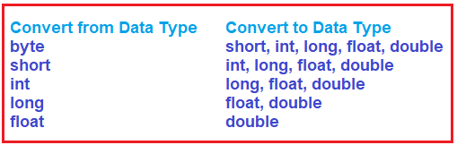

##### **مثالی برای درک تبدیل ضمنی یا تبدیل نوع ضمنی در سی شارپ**

بیایید تبدیل نوع ضمنی در سی شارپ را با یک مثال درک کنیم. در مثال زیر، یک متغیر عدد صحیح با نام numInt ایجاد کرده‌ایم، یعنی int **numInt = 1500;.** لطفاً به خط **double numDouble = numInt;** توجه کنید. در اینجا، ما مقدار متغیر نوع int را به یک متغیر نوع double اختصاص می‌دهیم. در این حالت، کامپایلر به طور خودکار مقدار نوع int را به نوع double تبدیل می‌کند. دلیل این امر این است که هر دو int و double از نوع عددی هستند و از این رو این نوع‌ها با هم سازگار هستند. و علاوه بر این، int 4 بایت حافظه و double 8 بایت حافظه می‌گیرد و از این رو مشکلی برای ذخیره 4 بایت داده در یک مکان 8 بایتی حافظه وجود ندارد. همچنین، در اینجا از متد GetType() برای بررسی نوع داده متغیرهای numInt و numDouble استفاده کرده‌ایم و همچنین از تابع sizeof برای بررسی اندازه نوع داده int و double استفاده می‌کنیم.

``` csharp
using System;
namespace TypeCastingDemo
{
    class Program
    {
        static void Main(string[] args)
        {
            int numInt = 1500;

            //Get type of numInt
            Type numIntType = numInt.GetType();

            // Implicit Conversion
            double numDouble = numInt;

            //Get type of numDouble
            Type numDoubleType = numDouble.GetType();

            // Value Before Conversion
            Console.WriteLine($"numInt value: {numInt}" );
            Console.WriteLine($"numInt Type: {numIntType}");
            Console.WriteLine($"Int Size: {sizeof(int)} Bytes");

            // Value After Conversion
            Console.WriteLine($"numDouble value: {numDouble}");
            Console.WriteLine($"numDouble Type: {numDoubleType}");
            Console.WriteLine($"double Size: {sizeof(double)} Bytes");

            Console.ReadKey();
        }
    }
}
```

###### **خروجی:**

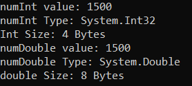

**نکته:** در تبدیل نوع ضمنی، انواع کوچکتر به انواع داده بزرگتر تبدیل می‌شوند و از این رو، در طول تبدیل هیچ داده‌ای از دست نمی‌رود.

##### **تبدیل صریح یا تبدیل نوع صریح در سی شارپ**

اگر می‌خواهید نوع داده بزرگ را در سی‌شارپ به نوع داده کوچک تبدیل کنید، باید همین کار را به طور صریح با استفاده از عملگر تبدیل نوع (cast) انجام دهید. تبدیل صریح یا تبدیل نوع صریح در سی‌شارپ با استفاده از عملگر تبدیل انجام می‌شود. این شامل تبدیل انواع داده بزرگتر به انواع داده کوچکتر است. در مورد تبدیل صریح یا تبدیل نوع صریح، احتمال از دست رفتن داده‌ها یا عدم موفقیت تبدیل به دلایلی وجود دارد. این یک نوع تبدیل ناامن است.

در تبدیل نوع صریح، ما به طور صریح یک نوع داده را به نوع داده دیگری تبدیل می‌کنیم. در این حالت، انواع داده بزرگتر مانند double یا long (با حجم حافظه بزرگ) به انواع داده کوچکتر مانند int، byte، short، float و غیره (با حجم حافظه کوچک) تبدیل می‌شوند.

##### **مثالی برای درک تبدیل صریح یا تبدیل نوع صریح در سی شارپ**

وقتی نوع‌ها با یکدیگر سازگار نباشند، با خطاهای کامپایل مواجه خواهید شد. برای مثال، اختصاص دادن یک مقدار double به یک نوع داده int منجر به خطای زمان کامپایل می‌شود، همانطور که در مثال زیر نشان داده شده است.

``` csharp
using System;
namespace TypeCastingDemo
{
    class Program
    {
        static void Main(string[] args)
        {
            double numDouble = 1.23;

            // Explicit Type Casting
            int numInt = numDouble;

            // Value Before Conversion
            Console.WriteLine("Original double Value: " + numDouble);

            // Value After Conversion
            Console.WriteLine("Converted int Value: " + numInt);
            Console.ReadKey();
        }
    }
}
```
###### **خروجی:**

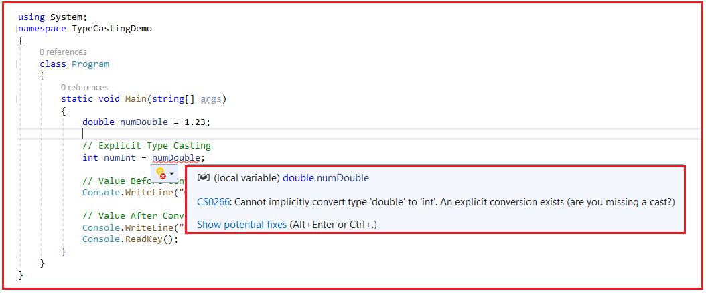

همانطور که می‌بینید، در تصویر بالا، خطای کامپایل با عنوان « **نمی‌توان نوع 'double' را به 'int' تبدیل کرد» می‌دهد. یک تبدیل صریح وجود دارد (آیا تبدیل نوع داده را از قلم انداخته‌اید؟) .** این برنامه هم خطا می‌دهد و هم پیشنهاد می‌دهد که آیا تبدیل نوع داده را از قلم انداخته‌اید. این بدان معناست که اگر این نوع تبدیل را می‌خواهید، باید صریحاً از عملگر تبدیل نوع داده استفاده کنید.

بنابراین، اگر بخواهیم مقداری از یک نوع داده بزرگتر را به یک نوع داده کوچکتر اختصاص دهیم، باید تبدیل نوع صریح را در سی شارپ انجام دهید. این برای انواع داده سازگار که تبدیل نوع خودکار توسط کامپایلر امکان‌پذیر نیست، مفید است. ببینید، چه تبدیل نوع ضمنی باشد و چه تبدیل نوع صریح، انواع نوع باید سازگار باشند، در این صورت فقط تبدیل نوع امکان‌پذیر خواهد بود.

در مثال زیر، ما یک متغیر از نوع double با نام numDouble ایجاد کرده‌ایم، یعنی **double numDouble = 1.23** ;. به خط int numInt = (int)numDouble; توجه کنید. **در اینجا** ، **(int)** یک عبارت تبدیل نوع داده است که به صراحت مقدار نوع double یعنی 1.23 را به نوع int تبدیل می‌کند.

``` csharp
using System;
namespace TypeCastingDemo
{
    class Program
    {
        static void Main(string[] args)
        {
            double numDouble = 1.23;

            // Explicit Type Casting
            int numInt = (int)numDouble;

            // Value Before Conversion
            Console.WriteLine("Original double Value: " + numDouble);

            // Value After Conversion
            Console.WriteLine("Converted int Value: " + numInt);
            Console.ReadKey();
        }
    }
}
```
###### **خروجی:**

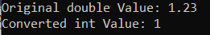

در اینجا، می‌توانید ببینید که مقدار اصلی ۱.۲۳ است در حالی که مقدار تبدیل شده ۱ است. این بدان معناست که ما در طول تبدیل نوع، مقداری از داده‌ها را از دست داده‌ایم. دلیل این امر این است که ما به صراحت نوع داده بزرگتر double را به نوع داده کوچکتر int تبدیل می‌کنیم.

##### **آیا همیشه هنگام تبدیل یک نوع بزرگتر به نوع کوچکتر در C#، داده‌ها را از دست می‌دهیم؟**

پاسخ خیر است. اساساً به مقداری که تبدیل می‌کنیم و اندازه نوع داده‌ای که قرار است مقدار تبدیل‌شده را در خود ذخیره کند، بستگی دارد. برای درک بهتر، لطفاً به کد زیر نگاهی بیندازید.

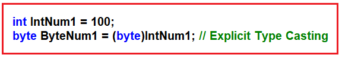

در مورد فوق، هیچ داده‌ای را از دست نخواهیم داد. دلیل این امر این است که متغیر عدد صحیح مقدار ۱۰۰ را در خود نگه می‌دارد و در نوع داده بایت، می‌توانیم مقادیر ۰ تا ۲۵۵ را ذخیره کنیم و ۱۰۰ در این محدوده قرار می‌گیرد و از این رو هیچ داده‌ای از دست نمی‌رود. حال، کد زیر را مشاهده کنید.

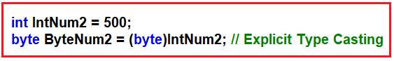

در مورد بالا، داده‌ها را از دست خواهیم داد. دلیل این امر این است که متغیر عدد صحیح مقدار ۵۰۰ را در خود نگه می‌دارد و در نوع داده بایت، می‌توانیم مقادیر ۰ تا ۲۵۵ را ذخیره کنیم و ۵۰۰ در این محدوده قرار نمی‌گیرد و از این رو داده‌ها از دست می‌روند. کد کامل مثال در زیر آورده شده است.

``` csharp
using System;
namespace TypeCastingDemo
{
    class Program
    {
        static void Main(string[] args)
        {
            int IntNum1 = 100;
            byte ByteNum1 = (byte)IntNum1; // Explicit Type Casting
            // Printing the Original Value and Converted Value
            Console.WriteLine($"Original Value:{IntNum1} and Converted Value:{ByteNum1}");

            int IntNum2 = 500;
            byte ByteNum2 = (byte)IntNum2; // Explicit Type Casting
            // Printing the Original Value and Converted Value
            Console.WriteLine($"Original Value:{IntNum2} and Converted Value:{ByteNum2}");
            Console.ReadKey();
        }
    }
}
```
###### **خروجی:**

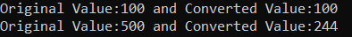

همانطور که در تصویر خروجی بالا مشاهده می‌کنید، برای تبدیل اول، هیچ داده‌ای از دست نرفته است، اما در تبدیل دوم، داده از دست رفته است، یعنی مقدار اولیه ۵۰۰ و مقدار تبدیل شده ۲۴۴.

##### **تبدیل با متدهای کمکی در سی شارپ:**  

حال، لطفاً به مثال زیر توجه کنید. در اینجا، ما یک متغیر رشته‌ای داریم که مقدار ۱۰۰ را در خود نگه می‌دارد و سعی می‌کنیم آن مقدار را به یک نوع عدد صحیح تبدیل کنیم. اما این کار با عملگر تبدیل نوع امکان‌پذیر نیست. زیرا عملگر تبدیل نوع ابتدا سازگاری نوع را بررسی می‌کند و متوجه می‌شود که رشته و عدد صحیح با یکدیگر سازگار نیستند، زیرا رشته برای ذخیره داده‌های متنی استفاده می‌شود که شامل هر دو نوع الفبایی و عددی است و عدد صحیح فقط شامل داده‌های عددی است.

``` csharp
using System;
namespace TypeCastingDemo
{
    class Program
    {
        static void Main(string[] args)
        {
            string str= "100";
            int i1 = (int)str;

            Console.ReadKey();
        }
    }
}
```

وقتی سعی می‌کنید کد بالا را اجرا کنید، با خطای کامپایل زیر مواجه خواهید شد.

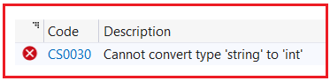

بنابراین، برای تبدیل بین انواع ناسازگار مانند **عدد صحیح** و **رشته،** چارچوب .NET کلاس Convert، متد Parse و متد TryParse را در اختیار ما قرار داده است. بیایید این موارد را یک به یک درک کنیم و ببینیم چگونه می‌توانیم انواع ناسازگار را در C# با مثال تبدیل کنیم.

##### **تبدیل متدهای کمکی کلاس در سی شارپ:**

کلاس Convert متدهای زیر را برای تبدیل یک مقدار به یک نوع خاص ارائه می‌دهد. متدهای زیر صرف نظر از سازگاری نوع، مقدار را تبدیل می‌کنند. به این معنی که اگر انواع سازگار باشند، تبدیل انجام می‌شود و اگر انواع سازگار نباشند، باز هم سعی در تبدیل خواهد شد.

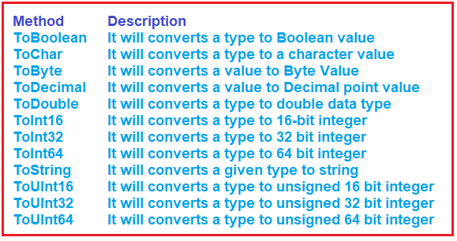

برای مثال، اگر می‌خواهید یک رشته را به نوع Int تبدیل کنید، باید از **Convert.ToInt16** یا **Convert.ToInt32** یا **Convert.ToInt64** استفاده کنید . این متدهای کمکی به عنوان متدهای استاتیک درون کلاس Convert پیاده‌سازی شده‌اند و از این رو می‌توانید مستقیماً به آنها دسترسی داشته باشید. برای درک بهتر، لطفاً به مثال زیر نگاهی بیندازید.

``` csharp
using System;
namespace TypeCastingDemo
{
    class Program
    {
        static void Main(string[] args)
        {
            string str = "100";
            int i1 = Convert.ToInt32(str); //Converting string to Integer

            double d = 123.45;
            int i2 = Convert.ToInt32(d); //Converting double to Integer

            float f = 45.678F;
            string str2 = Convert.ToString(f); //Converting float to string

            Console.WriteLine($"Original value str: {str} and Converted Value i1:{i1}");
            Console.WriteLine($"Original value d: {d} and Converted Value i2:{i2}");
            Console.WriteLine($"Original value f: {f} and Converted Value str2:{str2}");
            Console.ReadKey();
        }
    }
}
```

###### **خروجی:**

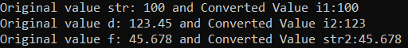

وقتی از متد کمکی کلاس Convert برای تبدیل یک مقدار به یک نوع خاص استفاده می‌کنیم، اگر نوع‌ها سازگار نباشند، در زمان کامپایل هیچ خطایی به شما نمایش داده نمی‌شود. در زمان اجرا، سعی می‌کند مقدار را به آن نوع خاص تبدیل کند و اگر مقدار سازگار باشد، تبدیل انجام می‌شود و اگر مقدار سازگار نباشد، خطای زمان اجرا نمایش داده می‌شود. برای درک بهتر، لطفاً به مثال زیر نگاهی بیندازید.

``` csharp
using System;
namespace TypeCastingDemo
{
    class Program
    {
        static void Main(string[] args)
        {
            string str = "Hello";
            int i1 = Convert.ToInt32(str); //Converting string to Integer

            Console.WriteLine($"Original value str: {str} and Converted Value i1:{i1}");
            
            Console.ReadKey();
        }
    }
}
```

وقتی کد بالا را اجرا می‌کنیم، خطای زمان اجرای زیر را دریافت خواهیم کرد. دلیل این امر این است که در زمان اجرا سعی می‌کند مقدار Hello را به نوع عدد صحیح تبدیل کند که امکان‌پذیر نیست و از این رو خطای زمان اجرای زیر را خواهیم داشت.

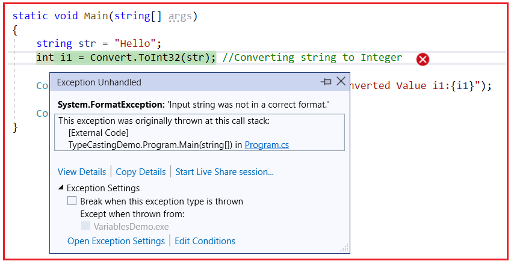

##### **تبدیل نوع با استفاده از متد Parse() در سی شارپ**

در سی شارپ، می‌توانیم از متد داخلی Parse() برای انجام تبدیل نوع نیز استفاده کنیم. بنابراین، هنگام انجام تبدیل نوع بین انواع ناسازگار مانند int و string، می‌توانیم از متد Parse() مانند متدهای کمکی کلاس Convert نیز استفاده کنیم. حال، اگر به تعریف انواع داده مقداری داخلی مانند int، short، long، bool و غیره بروید، خواهید دید که متد Parse به عنوان یک متد استاتیک در آن نوع داده‌های مقداری داخلی پیاده‌سازی شده است. بنابراین، با استفاده از نوع داخلی، می‌توانیم متد Parse را فراخوانی کنیم.

برای درک بهتر، لطفاً به مثال زیر نگاهی بیندازید. در مثال زیر، ما دو تبدیل نوع ناسازگار انجام می‌دهیم. ابتدا، مقدار رشته‌ای ۱۰۰ را به نوع عدد صحیح تبدیل می‌کنیم و در تبدیل دوم، رشته را به نوع بولی تبدیل می‌کنیم.

``` csharp
using System;
namespace TypeCastingDemo
{
    class Program
    {
        static void Main(string[] args)
        {
            string str1 = "100";
            //Converting string to int type
            int i = int.Parse(str1);
            Console.WriteLine($"Original String value: {str1} and Converted int value: {i}");

            string str2 = "TRUE";
            //Converting string to boolean type
            bool b= bool.Parse(str2);
            Console.WriteLine($"Original String value: {str2} and Converted bool value: {b}");
            Console.ReadKey();
        }
    }
}
```

حالا، وقتی کد بالا را اجرا می‌کنید، خروجی زیر را دریافت خواهید کرد. در اینجا، مقادیر با نوع سازگار هستند، یعنی مقدار ۱۰۰ با نوع int سازگار است و مقدار TRUE با نوع bool سازگار است و از این رو در زمان اجرا، این تبدیل نوع‌ها با موفقیت انجام شده است.

 در سی شارپ")

مانند متد کمکی کلاس Convert، در زمان اجرا، اگر مقدار با نوع مقصد سازگار نباشد، خطای زمان اجرا نیز دریافت خواهید کرد. برای درک بهتر، لطفاً به مثال زیر نگاهی بیندازید که در آن سعی داریم مقدار رشته‌ای Hello را در متغیر عدد صحیح ذخیره کنیم.

``` csharp
using System;
namespace TypeCastingDemo
{
    class Program
    {
        static void Main(string[] args)
        {
            string str1 = "Hello";
            //Converting string to int type
            int i = int.Parse(str1);
            Console.WriteLine($"Original String value: {str1} and Converted int value: {i}");

            Console.ReadKey();
        }
    }
}
```
###### **خروجی:**

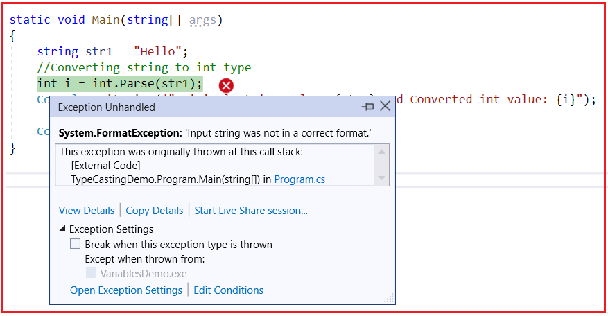

##### **استفاده از متد TryParse در سی شارپ:**

وقتی از متد Parse استفاده می‌کنیم، اگر تبدیل در زمان اجرا امکان‌پذیر نباشد، با یک استثنا مواجه می‌شویم که چیز خوبی نیست. زیرا اگر تبدیل امکان‌پذیر نباشد، باید اطلاعاتی را به کاربر نشان دهیم و سپس ادامه دهیم. برای انجام این کار، کلاس نوع مقداری داخلی در C# با متد TryParse ارائه شده است. بیایید ببینیم چگونه از متد TryParse در C# استفاده کنیم. فرض کنید می‌خواهیم یک رشته را به یک نوع عدد صحیح تبدیل کنیم، می‌توانیم از متد TryParse به شرح زیر استفاده کنیم.

**bool IsConverted = int.TryParse("100", out int I1); (مبدل عددی عدد صحیح I1 به عدد صحیح)**

در اینجا، کاری که متد TryParse انجام می‌دهد این است که سعی می‌کند مقدار رشته‌ای ۱۰۰ را به یک نوع عدد صحیح تبدیل کند. اگر تبدیل موفقیت‌آمیز باشد، دو کار انجام می‌دهد. اول، مقدار تبدیل‌شده را در متغیر I1 ذخیره می‌کند و سپس مقدار true را برمی‌گرداند. از طرف دیگر، اگر تبدیل ناموفق باشد، چیزی در متغیر I1 ذخیره نمی‌کند و مقدار false را برمی‌گرداند.

بگذارید این را با یک مثال درک کنیم. در مثال زیر، تبدیل اول موفقیت‌آمیز است و از این رو مقدار true را برمی‌گرداند و مقدار تبدیل‌شده ۱۰۰ را در متغیر I1 ذخیره می‌کند. در تبدیل دوم، تبدیل ناموفق بوده و از این رو چیزی در متغیر I2 ذخیره نمی‌کند و این بار مقدار false را برمی‌گرداند.

``` csharp
using System;
namespace TypeCastingDemo
{
    class Program
    {
        static void Main(string[] args)
        {
            string str1 = "100";
            bool IsConverted1 = int.TryParse(str1, out int I1);
            if (IsConverted1)
            {
                Console.WriteLine($"Original String value: {str1} and Converted int value: {I1}");
            }
            else
            {
                Console.WriteLine($"Try Parse Failed to Convert {str1} to integer");
            }

            string str2 = "Hello";
            bool IsConverted2 = int.TryParse(str2, out int I2);
            if (IsConverted2)
            {
                Console.WriteLine($"Original String value: {str2} and Converted int value: {I2}");
            }
            else
            {
                Console.WriteLine($"Try Parse Failed to Convert {str2} to integer");
            }

            Console.ReadKey();
        }
    }
}
```

###### **خروجی:**

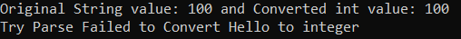