## **متغیرها در سی شارپ به همراه مثال**

در این مقاله، قصد دارم **متغیرها را در سی شارپ** با مثال بررسی کنم.. در پایان این مقاله، خواهید فهمید که چرا به متغیرها نیاز داریم، دقیقاً متغیر چیست و انواع مختلف متغیرهایی که می‌توانیم درون یک کلاس ایجاد کنیم چیست؟ نقش و مسئولیت هر نوع متغیر چیست؟

##### **آشنایی با متغیرها در زبان سی شارپ:**

دلیل اجرای یک برنامه به معنای پردازش اطلاعات یا داده‌ها است. به عنوان مثال، یک برنامه بانکی. آنها در حال اجرای یک برنامه یا یک تراکنش هستند. در حین اجرای تراکنش، کاری که آنها در واقع انجام می‌دهند این است که داده‌ها را پردازش می‌کنند، مانند پردازش شماره حساب، نام حساب، موجودی و غیره.

هر زمان که ما در حال پردازش داده‌ها یا اطلاعات هستیم، داده‌ها یا اطلاعات باید در مکانی باشند. و ما آن مکان را مکان حافظه می‌نامیم. هر رایانه‌ای مکان‌هایی در حافظه دارد و هر مکان حافظه با یک آدرس مشخص می‌شود. کافیست چیدمان صندلی‌ها را در یک سالن سینما به عنوان مکان‌های حافظه در نظر بگیرید.

بنابراین، هر مکان حافظه در کامپیوتر با یک آدرس مشخص می‌شود. برای درک بهتر، لطفاً به تصویر زیر نگاهی بیندازید. همانطور که در تصویر زیر مشاهده می‌کنید، ۱۲۸، ۵۷۲، ۱۰۲۴، ۵۰۹۸ و غیره آدرس‌های حافظه یک به یک هستند. می‌توانیم با همه آدرس‌ها به عنوان مقادیر صحیح مثبت رفتار کنیم.

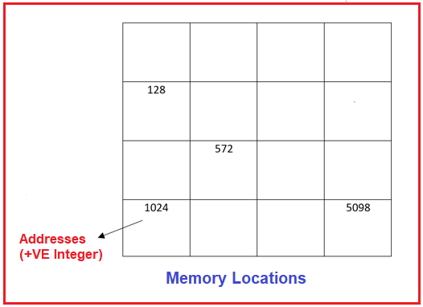

##### **رابطه بین متغیرها و مکان‌های حافظه چیست؟**

فرض کنید می‌خواهم مقدار ۱۰ را در مکان‌های حافظه کامپیوتر ذخیره کنم. یک کلاس درس را در نظر بگیرید، هیچ محدودیتی برای محل نشستن دانش‌آموزان وجود ندارد. این بدان معناست که دانش‌آموزان به صورت تصادفی در مکان‌های مختلف قرار می‌گیرند و می‌نشینند. به همین ترتیب، مقدار ۱۰ که می‌خواهیم در مکان‌های حافظه کامپیوتر ذخیره کنیم نیز به صورت تصادفی در یک مکان خاص حافظه ذخیره می‌شود. برای درک بهتر، لطفاً به تصویر زیر نگاهی بیندازید.

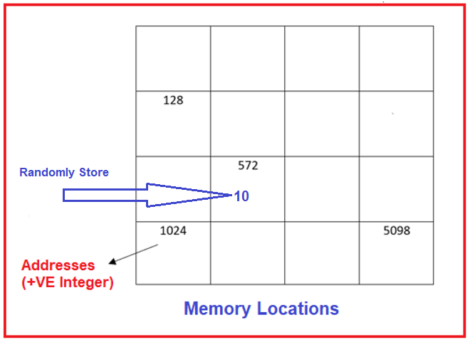

##### **چگونه به داده‌ها دسترسی پیدا کنیم؟**

حالا، می‌خواهم به داده‌ها، مثلاً مقدار ۱۰، دسترسی پیدا کنم و فقط می‌خواهم آن اطلاعات را چاپ کنم. پس چگونه می‌توانیم چاپ کنیم؟ نحوه چاپ داده‌ها به این معنی است که با مشکلاتی روبرو خواهیم شد. دلیل آن این است که داده‌ها در کدام مکان‌های حافظه ذخیره شده‌اند که نمی‌توانیم آنها را شناسایی کنیم زیرا آن داده‌ها به صورت تصادفی در یک مکان خاص حافظه ذخیره می‌شوند. بنابراین، در اینجا دسترسی به مکان حافظه پس از ذخیره اطلاعات بسیار دشوار می‌شود. بنابراین، کاری که قبل از ذخیره اطلاعات باید انجام دهیم این است که باید هویت مکانی از حافظه را که قرار است داده‌ها در آن ذخیره شوند، تنظیم کنید.

##### **چگونه می‌توانیم Identity را روی مکان‌های حافظه تنظیم کنیم؟**

ما می‌توانیم هویت مکان حافظه را با استفاده از متغیرها یا می‌توان گفت شناسه‌ها تعیین کنیم. در زیر سینتکس تعریف یک متغیر با تعیین هویت مکان حافظه در زبان سی شارپ آمده است. ابتدا باید نوع داده و به دنبال آن شناسه را بنویسیم.

**نحو: شناسه نوع داده؛**

**مثال: int a;** // در اینجا int نوع داده است و شناسه می‌تواند هر نامی باشد و در اینجا آن را به عنوان a تنظیم می‌کنیم. بنابراین، هر زمان که یک متغیر را تعریف می‌کنیم، حافظه به آن اختصاص داده می‌شود. همانطور که در تصویر زیر نشان داده شده است، هویت به یک مکان حافظه اختصاص داده می‌شود.

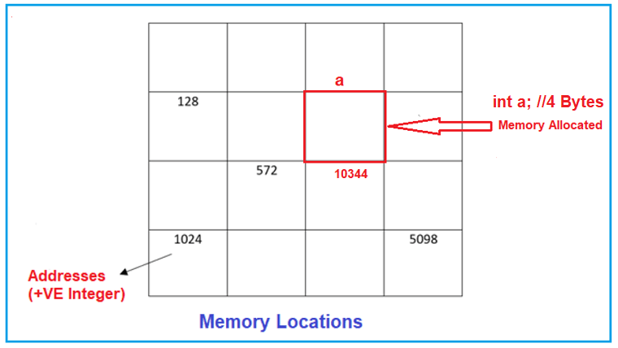

در اینجا «a» یک مکان حافظه نامگذاری شده به مکان ۱۰۳۴۴ است. بعداً می‌توانیم عنصری را در آن مکان حافظه که با شناسه «a» مشخص می‌شود، به صورت زیر ذخیره کنیم.

**a = 10;** // در اینجا، مقدار 10 است و ما این مقدار را در مکانی از حافظه قرار می‌دهیم که همانطور که در تصویر زیر نشان داده شده است، با "a" مشخص شده است.

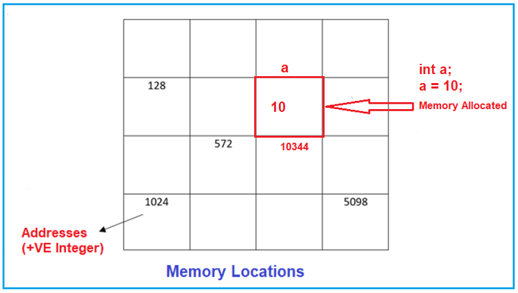

برای مثال، در سینماها، هر صندلی شماره منحصر به فردی دارد و وقتی شما وارد می‌شوید، روی صندلی خاصی که به شما اختصاص داده شده است، می‌نشینید. بعداً اگر بخواهند به آن دسترسی پیدا کنند، به راحتی می‌توانند به آن دسترسی پیدا کنند.

##### **متغیر در زبان سی شارپ چیست؟**

نامی که برای هر مکان حافظه کامپیوتر داده می‌شود، متغیر نامیده می‌شود. هدف از متغیر، ارائه نامی به مکانی از حافظه است که در آن مقداری داده ذخیره می‌کنیم. کاربر از طریق نام متغیر به داده‌ها دسترسی پیدا می‌کند و کامپایلر از طریق آدرس حافظه به داده‌ها دسترسی پیدا می‌کند. بنابراین، متغیر مکانی نامگذاری شده در حافظه کامپیوتر است که یک برنامه می‌تواند داده‌ها را در آن ذخیره کند.

##### **قوانین تعریف متغیر در سی شارپ:**

1. نام متغیر باید با یک حرف یا زیرخط شروع شود.
2. متغیرها در سی شارپ به حروف کوچک و بزرگ حساس هستند
3. آنها را می‌توان با اعداد و حروف ساخت.
4. هیچ نماد خاصی به جز زیرخط (\_) مجاز نیست.
5. sum، Height، \_value، و abc123 و غیره نمونه‌هایی از نام متغیر هستند.

##### **چگونه یک متغیر را در سی شارپ تعریف کنیم؟**

سینتکس تعریف متغیر در سی شارپ به صورت زیر است:  
**نحو: type\_data variable\_name;**  
در اینجا، data\_type نوع داده‌ای است که قرار است در متغیر ذخیره شود و variable\_name نامی است که به آن متغیر داده می‌شود.

**مثال: int age;**  
در اینجا، نوع داده int و age نام متغیر است که در آن متغیر age فقط می‌تواند یک مقدار صحیح را در خود نگه دارد.

##### **چگونه یک متغیر را در سی شارپ مقداردهی اولیه کنیم؟**

سینتکس مقداردهی اولیه متغیر در سی شارپ به صورت زیر است:  
**نحو: data\_type variable\_name = value;**  
در اینجا، data\_type نوع داده‌ای است که قرار است در متغیر ذخیره شود، variable\_name نامی است که به متغیر داده می‌شود و value مقدار اولیه‌ای است که در متغیر ذخیره می‌شود.

**مثال: int age = 20;**  
در اینجا، int نوع داده و age نام متغیر است که در آن 20 مقدار صحیح ذخیره شده در متغیر age است.

##### **انواع متغیرها در یک کلاس در سی شارپ:**

حال، بیایید انواع مختلف متغیرهایی که یک کلاس می‌تواند داشته باشد و رفتار آنها را درک کنیم. اساساً، چهار نوع متغیر وجود دارد که می‌توانیم درون یک کلاس در C# تعریف کنیم. آنها به شرح زیر هستند:

1. **متغیر غیر استاتیک/نمونه**
2. **متغیر استاتیک**
3. **متغیر ثابت**
4. **متغیر فقط خواندنی**

رفتار همه این متغیرهای مختلف متفاوت خواهد بود. بیایید هر یک از این متغیرها را در سی شارپ درک کنیم.

##### **متغیرهای استاتیک و غیر استاتیک در سی شارپ**

اگر یک متغیر را به طور صریح با استفاده از اصلاحگر static تعریف کنیم، آن را متغیر static می‌نامیم و بقیه متغیرها، متغیرهای non-static هستند. باز هم، اگر یک متغیر را داخل یک بلوک static تعریف کنیم، آن متغیر نیز یک متغیر static است. و اگر یک متغیر را داخل یک بلوک non-static تعریف کنیم، آن متغیر non-static می‌شود.

برای درک بهتر، لطفاً به مثال زیر نگاهی بیندازید. در مثال زیر، ما سه متغیر تعریف کرده‌ایم. متغیر x یک متغیر ایستا است زیرا با استفاده از اصلاحگر static تعریف شده است. متغیر y به طور پیش‌فرض غیر ایستا است و متغیر z ایستا است زیرا درون یک بلوک static تعریف شده است. از آنجایی که متد Main یک متد ایستا است، متغیرهای تعریف شده درون متد Main نیز ایستا خواهند بود.

```csharp
using System;

namespace TypesOfVariables
{
    internal class Program
    {
        static int x; //Static Variable
        int y; //Non-Static or Instance Variable
        static void Main(string[] args)
        {
            int z; //Static Variable
        }
    }
}
```

حالا، بیایید سعی کنیم مقدار x و y را درون متد Main چاپ کنیم. مقدار x را برابر با ۱۰۰ و مقدار y را برابر با ۲۰۰ قرار می‌دهیم. در اینجا، می‌توانید مقدار x را مستقیماً درون متد Main چاپ کنید. اما نمی‌توانید مقدار y را مستقیماً درون متد Main چاپ کنید.

```csharp
using System;

namespace TypesOfVariables
{
    internal class Program
    {
        static int x = 100; //Static Variable
        int y = 200; //Non-Static or Instance Variable

        static void Main(string[] args)
        {
            Console.WriteLine($"x value: {x}");
            Console.Read();
        }
    }
}
```

**خروجی: مقدار x: ۱۰۰**

حال، بیایید سعی کنیم مقدار y را نیز مستقیماً چاپ کنیم. اگر سعی کنیم مقدار y را مستقیماً چاپ کنیم، با خطای زمان کامپایل مواجه می‌شویم که می‌گوید **برای فیلد، متد یا ویژگی غیراستاتیک 'Program.y' به یک مرجع شیء نیاز است** . برای درک بهتر، لطفاً به مثال زیر نگاهی بیندازید. در اینجا، ما سعی داریم مقادیر x و y را مستقیماً چاپ کنیم.

```csharp
using System;

namespace TypesOfVariables
{
    internal class Program
    {
        static int x = 100; //Static Variable
        int y = 200; //Non-Static or Instance Variable

        static void Main(string[] args)
        {
            Console.WriteLine($"x value: {x}");
            Console.WriteLine($"y value: {y}"); // Error
            Console.Read();
        }
    }
}
```

وقتی سعی می‌کنید کد بالا را اجرا کنید، با خطای زمان کامپایل زیر مواجه خواهید شد.

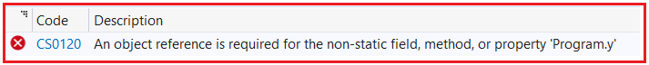

دلیل این امر این است که حافظه برای متغیر y فقط زمانی ایجاد می‌شود که ما یک نمونه از کلاس Program و برای هر نمونه ایجاد کنیم. اما x نیازی به نمونه از کلاس ندارد. دلیل این امر این است که یک متغیر استاتیک بلافاصله پس از شروع اجرای کلاس مقداردهی اولیه می‌شود.

بنابراین، تا زمانی که نمونه‌ای از کلاس Program ایجاد نکنیم، حافظه‌ای برای متغیر y اختصاص داده نخواهد شد و تا زمانی که حافظه‌ای برای متغیر y اختصاص داده نشود، نمی‌توانیم به آن دسترسی داشته باشیم. بنابراین، به محض اینکه نمونه‌ای از کلاس Program ایجاد کنیم، حافظه برای متغیر y اختصاص داده می‌شود و فقط پس از آن می‌توانیم به متغیر y دسترسی داشته باشیم.

در مثال زیر، ما یک نمونه از کلاس Program ایجاد می‌کنیم و با استفاده از آن نمونه به متغیر y دسترسی پیدا می‌کنیم. اما مستقیماً به متغیر x دسترسی داریم.

```csharp
using System;

namespace TypesOfVariables
{
    internal class Program
    {
        static int x = 100; //Static Variable
        int y = 200; //Non-Static or Instance Variable

        static void Main(string[] args)
        {
            Console.WriteLine($"x value: {x}");
            Program obj = new Program();
            Console.WriteLine($"y value: {obj.y}");
            Console.Read();
        }
    }
}
```

حالا، وقتی کد بالا را اجرا می‌کنید، خواهید دید که هر دو مقدار x و y را همانطور که در تصویر زیر نشان داده شده است، چاپ می‌کند.

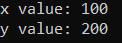

**نکته:** اولین نکته‌ای که باید به خاطر داشته باشید این است که هنگام کار با متغیرهای استاتیک و غیر استاتیک، اعضای استاتیک یک کلاس برای مقداردهی اولیه و اجرا به نمونه‌ای از کلاس نیاز ندارند، در حالی که اعضای غیر استاتیک یک کلاس برای مقداردهی اولیه و اجرا به نمونه‌ای از کلاس نیاز دارند.

##### **چه زمانی متغیرهای استاتیک و غیر استاتیک در سی شارپ مقداردهی اولیه می‌شوند؟**

متغیرهای استاتیک یک کلاس بلافاصله پس از شروع اجرای کلاس مقداردهی اولیه می‌شوند در حالی که متغیرهای غیر استاتیک یا متغیرهای نمونه فقط پس از ایجاد نمونه کلاس و همچنین هر بار که نمونه‌ای از کلاس ایجاد می‌شود، مقداردهی اولیه می‌شوند.

نقطه‌ای که اجرای یک کلاس را شروع می‌کنیم تا نقطه‌ای که اجرای یک کلاس را پایان می‌دهیم، چرخه حیات یک کلاس نامیده می‌شود. در چرخه حیات یک کلاس، متغیرهای استاتیک یک بار و فقط یک بار مقداردهی اولیه می‌شوند در حالی که متغیرهای غیر استاتیک یا نمونه اگر هیچ نمونه‌ای ایجاد نشود، 0 بار و اگر n نمونه ایجاد شود، n بار مقداردهی اولیه می‌شوند.

بگذارید این را با یک مثال درک کنیم. لطفاً به کد زیر نگاهی بیندازید. در اینجا، ما دو بار نمونه کلاس Program را ایجاد می‌کنیم.

```csharp
using System;

namespace TypesOfVariables
{
    internal class Program
    {
        static int x = 100; //Static Variable
        int y = 200; //Non-Static or Instance Variable

        static void Main(string[] args)
        {
            Console.WriteLine($"x value: {x}");
            Program obj1 = new Program();
            Program obj2 = new Program();
            Console.WriteLine($"obj1 y value: {obj1.y}");
            Console.WriteLine($"obj2 y value: {obj2.y}");
            Console.Read();
        }
    }
}
```

در مثال بالا، به محض شروع اجرای برنامه، حافظه به متغیر استاتیک x اختصاص داده می‌شود. سپس ما دو بار نمونه‌ای از کلاس Program ایجاد کردیم، به این معنی که حافظه برای متغیر y دو بار اختصاص داده شده است. یک بار برای نمونه obj1 و یک بار برای نمونه obj2. برای درک بهتر، لطفاً به نمودار زیر که معماری حافظه مثال بالا را نشان می‌دهد، نگاهی بیندازید.

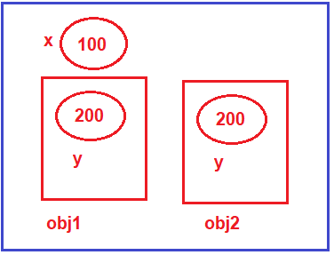

همانطور که در تصویر بالا مشاهده می‌کنید، متغیر استاتیک x فقط یک بار و متغیر غیر استاتیک y دو بار ایجاد می‌شود، زیرا ما دو بار نمونه‌ای از کلاس Program ایجاد می‌کنیم.

##### **مقداردهی اولیه متغیرهای غیر استاتیک از طریق سازنده کلاس در سی شارپ:**

وقتی ما در حال ایجاد یک نمونه از یک کلاس هستیم، فراخوانی سازنده (constructor) وجود دارد و از این رو می‌توانیم متغیرهای نمونه یا متغیرهای غیر استاتیک را نیز از طریق سازنده کلاس مقداردهی اولیه کنیم.

در مثال قبلی، هر دو شیء مقدار y یکسانی دارند، یعنی ۱۰۰. حال، اگر بخواهید، می‌توانید با استفاده از سازنده، مقادیر مختلفی را به متغیر y ارائه دهید. اجازه دهید این موضوع را با یک مثال درک کنیم. در مثال زیر، ما یک سازنده ایجاد کرده‌ایم که یک پارامتر عدد صحیح می‌گیرد و این مقدار پارامتر را به متغیر غیر استاتیک y اختصاص می‌دهیم. علاوه بر این، هنگام ایجاد نمونه در داخل متد Main، مقادیر مختلفی را ارسال می‌کنیم. اکنون، هر مقداری که ارسال کنیم، در داخل متغیر غیر استاتیک y ذخیره خواهد شد.

```csharp
using System;

namespace TypesOfVariables
{
    internal class Program
    {
        static int x = 100; //Static Variable
        int y = 200; //Non-Static or Instance Variable

        //Class Constructor
        public Program(int a)
        {
            y = a;
        }

        static void Main(string[] args)
        {
            Console.WriteLine($"x value: {x}");
            Program obj1 = new Program(300);
            Program obj2 = new Program(400);
            Console.WriteLine($"obj1 y value: {obj1.y}");
            Console.WriteLine($"obj2 y value: {obj2.y}");
            Console.Read();
        }
    }
}
```

###### **خروجی:**

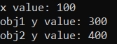

اکنون، در حافظه، مقدار y برای obj1 برابر با ۳۰۰ و برای obj2 برابر با ۴۰۰ خواهد بود. اما مقدار x همان ۱۰۰ خواهد بود. برای درک بهتر، لطفاً به تصویر زیر نگاهی بیندازید.

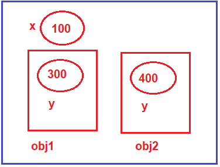

حال، ممکن است یک سوال داشته باشید، آیا می‌توانیم متغیر استاتیک را از طریق سازنده مقداردهی اولیه کنیم؟ پاسخ بله است. می‌توانیم متغیر استاتیک را از طریق سازنده مقداردهی اولیه کنیم. اما هر بار که مقداردهی اولیه را انجام می‌دهیم، مقدار متغیر استاتیک با مقدار جدید جایگزین می‌شود. برای درک بهتر، لطفاً به مثال زیر نگاهی بیندازید. در مثال زیر، ما متغیر استاتیک را از طریق سازنده کلاس مقداردهی اولیه می‌کنیم. به عنوان بخشی از سازنده، ما هر دو متغیر x و y را با مقدار a مقداردهی اولیه می‌کنیم.

```csharp
using System;

namespace TypesOfVariables
{
    internal class Program
    {
        static int x = 100; //Static Variable
        int y = 200; //Non-Static or Instance Variable

        //Class Constructor
        public Program(int a)
        {
            y = a; //Initializing non-static variable
            x = a; //Initializing static variable
        }

        static void Main(string[] args)
        {
            Console.WriteLine($"x value: {x}"); //x = 100

            Program obj1 = new Program(300);
            Console.WriteLine($"obj1 y value: {obj1.y}");
            Console.WriteLine($"x value: {x}"); //x = 300

            Program obj2 = new Program(400);
            Console.WriteLine($"obj2 y value: {obj2.y}");
            Console.WriteLine($"x value: {x}"); //x = 400
            Console.Read();
        }
    }
}
```

###### **خروجی:**

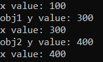

برای درک بهتر، لطفاً به نمودار زیر نگاهی بیندازید.

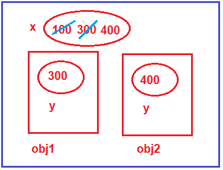

بنابراین، نکته‌ای که باید به خاطر داشته باشید این است که اگر متغیر استاتیک را از طریق سازنده مقداردهی اولیه می‌کنید، برای هر بار اجرای سازنده، مقدار موجود متغیر استاتیک نادیده گرفته می‌شود. بنابراین، به طور کلی، ما هرگز متغیرهای استاتیک را از طریق سازنده مقداردهی اولیه نمی‌کنیم. اگر اصلاً می‌خواهید متغیر را از طریق سازنده مقداردهی اولیه کنید، آن متغیر را غیر استاتیک کنید.

##### **تفاوت بین متغیرهای استاتیک و غیر استاتیک در سی شارپ**

1. در مورد متغیر نمونه، هر شیء کپی مخصوص به خود را خواهد داشت در حالی که ما فقط می‌توانیم یک کپی از یک متغیر استاتیک داشته باشیم، صرف نظر از اینکه چند شیء ایجاد می‌کنیم.
2. در سی شارپ، تغییرات اعمال شده در متغیر نمونه با استفاده از یک شیء در اشیاء دیگر منعکس نمی‌شود زیرا هر شیء کپی خود را از متغیر نمونه دارد. در مورد متغیرهای استاتیک، تغییرات اعمال شده در یک شیء در اشیاء دیگر منعکس می‌شود زیرا متغیرهای استاتیک برای همه اشیاء یک کلاس مشترک هستند.
3. ما می‌توانیم به متغیرهای نمونه از طریق ارجاع به شیء دسترسی داشته باشیم در حالی که متغیرهای استاتیک را می‌توان مستقیماً با استفاده از نام کلاس در سی شارپ دسترسی پیدا کرد.
4. در چرخه حیات یک کلاس، یک متغیر استاتیک فقط یک بار مقداردهی اولیه می‌شود، در حالی که متغیرهای نمونه اگر هیچ نمونه‌ای ایجاد نشود، 0 بار و اگر n تعداد نمونه ایجاد شود، n بار مقداردهی اولیه می‌شوند.

###### **متغیرهای نمونه/غیر استاتیک در سی شارپ**

1. **محدوده متغیر نمونه:** در کل کلاس به جز متدهای استاتیک.
2. **طول عمر متغیر نمونه:** تا زمانی که شیء در حافظه موجود باشد.

###### **متغیرهای استاتیک در سی شارپ**

1. **محدوده متغیر استاتیک** : در کل کلاس.
2. **طول عمر متغیر استاتیک** : تا پایان برنامه.

##### **متغیرهای ثابت در سی شارپ:**

در سی شارپ، اگر یک متغیر را با استفاده از کلمه کلیدی const تعریف کنیم، آن متغیر یک متغیر ثابت است و مقدار متغیر ثابت پس از تعریف آن قابل تغییر نیست. بنابراین، مقداردهی اولیه متغیر ثابت فقط در زمان تعریف آن الزامی است. فرض کنید می‌خواهید یک PI ثابت را در برنامه خود تعریف کنید، می‌توانید ثابت را به صورت زیر تعریف کنید:

**const float PI = 3.14f;**

اگر در زمان تعریف متغیر const، آن را مقداردهی اولیه نکنید، همانطور که در تصویر زیر نشان داده شده است، با خطای کامپایلر مواجه خواهید شد.

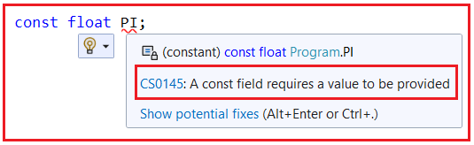

همانطور که می‌بینید، گفته شده است که **یک فیلد const نیاز به ارائه یک مقدار دارد،** به این معنی که هنگام تعریف یک ثابت، مقداردهی اولیه متغیر ثابت الزامی است.

**نکته:** متغیرهای ثابت فقط و فقط یک بار ایجاد می‌شوند. دلیل این امر این است که ما نمی‌توانیم مقادیر ثابت را پس از تعریف آن یک بار تغییر دهیم، در این صورت اگر امکان ایجاد چندین کپی از متغیر ثابت وجود داشته باشد، همه آن کپی‌ها مقدار یکسانی را ذخیره می‌کنند که به معنای اتلاف حافظه است. بنابراین، وقتی نمی‌توانیم یک مقدار را تغییر دهیم، اگر چندین بار یک کپی مشابه ایجاد کنیم، در واقع منابع را هدر داده‌ایم.

رفتار یک متغیر ثابت مشابه رفتار متغیرهای استاتیک است، یعنی یک بار و فقط یک بار در چرخه حیات کلاس مقداردهی اولیه می‌شود و برای مقداردهی اولیه یا اجرا به نمونه‌ای از کلاس نیاز ندارد. برای درک بهتر، لطفاً به مثال زیر نگاهی بیندازید. کد زیر خود توضیح است، بنابراین لطفاً خطوط کامنت را مطالعه کنید.

```csharp
using System;

namespace TypesOfVariables
{
    internal class Program
    {
        const float PI = 3.14f; //Constant Variable
        static int x = 100; //Static Variable
        //We are going to initialize variable y through constructor
        int y; //Non-Static or Instance Variable

        //Constructor
        public Program(int a)
        {
            //Initializing non-static variable
            y = a;
        }

        static void Main(string[] args)
        {
            //Accessing the static variable without instance
            Console.WriteLine($"x value: {x}");
            //Accessing the constant variable without instance
            Console.WriteLine($"PI value: {PI}");

            Program obj1 = new Program(300);
            Program obj2 = new Program(400);
            //Accessing Non-Static variable using instance
            Console.WriteLine($"obj1 y value: {obj1.y}");
            Console.WriteLine($"obj2 y value: {obj2.y}");
            Console.Read();
        }
    }
}
```

###### **خروجی:**

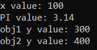

نمودار زیر نمایش حافظه مثال بالا را نشان می‌دهد.

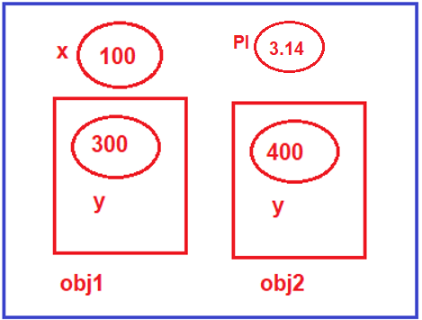

حال، ممکن است یک سوال برای شما پیش بیاید، اگر هم static و هم constant رفتار یکسانی دارند، پس تفاوت‌های بین آنها چیست؟

##### **تفاوت بین متغیر استاتیک و ثابت در سی شارپ:**

تنها تفاوت بین متغیر استاتیک و ثابت این است که متغیرهای استاتیک را می‌توان تغییر داد در حالی که متغیرهای ثابت در C# پس از تعریف قابل تغییر نیستند. برای درک بهتر، لطفاً به مثال زیر نگاهی بیندازید. در مثال زیر، درون متد Main، ما سعی می‌کنیم مقدار x استاتیک و مقدار PI ثابت را تغییر دهیم.

```csharp
using System;

namespace TypesOfVariables
{
    internal class Program
    {
        const float PI = 3.14f; //Constant Variable
        static int x = 100; //Static Variable
        int y; //Non-Static or Instance Variable

        //Constructor
        public Program(int a)
        {
            //Initializing non-static variable
            y = a;
        }

        static void Main(string[] args)
        {
            //Accessing the static variable without instance
            Console.WriteLine($"x value: {x}");
            //Accessing the constant variable without instance
            Console.WriteLine($"PI value: {PI}");

            x = 700; //Modifying Static Variable
            // PI = 3.15f; //Trying to Modify the Constant Variable, Error

            Program obj1 = new Program(300);
            Program obj2 = new Program(400);
            //Accessing Non-Static variable using instance
            Console.WriteLine($"obj1 y value: {obj1.y}");
            Console.WriteLine($"obj2 y value: {obj2.y}");
            Console.Read();
        }
    }
}
```

حالا وقتی کد بالا رو اجرا کنید، با خطای زیر مواجه میشید.

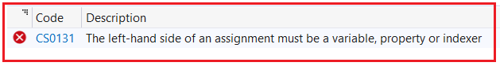

همانطور که در تصویر بالا می‌بینید، به وضوح گفته شده است که **سمت چپ یک انتساب باید یک متغیر، ویژگی یا اندیس‌گذار باشد** . اما در اینجا، یک ثابت است و از این رو با خطای کامپایل مواجه می‌شویم.

##### **متغیرهای فقط خواندنی در سی شارپ**

وقتی یک متغیر را با استفاده از کلمه کلیدی readonly تعریف می‌کنیم، آن متغیر به عنوان یک متغیر فقط خواندنی شناخته می‌شود و این متغیرها را نمی‌توان مانند ثابت‌ها تغییر داد، اما پس از مقداردهی اولیه. این بدان معناست که مقداردهی اولیه یک متغیر فقط خواندنی در زمان تعریف آن اجباری نیست، بلکه می‌توان آنها را تحت سازنده نیز مقداردهی اولیه کرد. این بدان معناست که می‌توانیم مقدار متغیر فقط خواندنی را فقط درون یک سازنده تغییر دهیم.

رفتار متغیرهای فقط خواندنی مشابه رفتار متغیرهای غیر استاتیک در سی شارپ خواهد بود، یعنی فقط پس از ایجاد نمونه از کلاس و یک بار برای هر نمونه از کلاس که ایجاد می‌شود، مقداردهی اولیه می‌شوند. یعنی می‌توانیم آن را به عنوان یک متغیر غیر استاتیک در نظر بگیریم و برای دسترسی به متغیرهای فقط خواندنی به یک نمونه نیاز داریم.

##### **مثال برای درک متغیرهای فقط خواندنی در سی شارپ:**

در مثال زیر، متغیر فقط خواندنی z با هیچ مقداری مقداردهی اولیه نشده است، اما وقتی مقدار متغیر را چاپ می‌کنیم، مقدار پیش‌فرض int یعنی ۰ نمایش داده می‌شود.

```csharp
using System;

namespace TypesOfVariables
{
    internal class Program
    {
        const float PI = 3.14f; //Constant Variable
        static int x = 100; //Static Variable
        //We are going to initialize variable y through constructor
        int y; //Non-Static or Instance Variable
        readonly int z; //Readonly Variable

        //Constructor
        public Program(int a)
        {
            //Initializing non-static variable
            y = a;
        }

        static void Main(string[] args)
        {
            //Accessing the static variable without instance
            Console.WriteLine($"x value: {x}");
            //Accessing the constant variable without instance
            Console.WriteLine($"PI value: {PI}");

            Program obj1 = new Program(300);
            Program obj2 = new Program(400);
            //Accessing Non-Static variable using instance
            Console.WriteLine($"obj1 y value: {obj1.y} and Readonly z value: {obj1.z}");
            Console.WriteLine($"obj2 y value: {obj2.y} and Readonly z value: {obj2.z}");
            Console.Read();
        }
    }
}
```

###### **خروجی:**

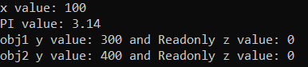

در مثال زیر، ما متغیر فقط خواندنی را از طریق سازنده کلاس مقداردهی اولیه می‌کنیم. اکنون، سازنده دو پارامتر می‌گیرد. پارامتر اول متغیر غیر استاتیک و پارامتر دوم متغیر فقط خواندنی را مقداردهی اولیه می‌کند. بنابراین، هنگام ایجاد نمونه، باید دو مقدار صحیح را به تابع سازنده منتقل کنیم.

```csharp
using System;

namespace TypesOfVariables
{
    internal class Program
    {
        const float PI = 3.14f; //Constant Variable
        static int x = 100; //Static Variable
        //We are going to initialize variable y through constructor
        int y; //Non-Static or Instance Variable
        readonly int z; //Readonly Variable

        //Constructor
        public Program(int a, int b)
        {
            //Initializing non-static variable
            y = a;
            //Initializing Readonly variable
            z = b;
        }

        static void Main(string[] args)
        {
            //Accessing the static variable without instance
            Console.WriteLine($"x value: {x}");
            //Accessing the constant variable without instance
            Console.WriteLine($"PI value: {PI}");

            Program obj1 = new Program(300, 45);
            Program obj2 = new Program(400, 55);
            //Accessing Non-Static variable using instance
            Console.WriteLine($"obj1 y value: {obj1.y} and Readonly z value: {obj1.z}");
            Console.WriteLine($"obj2 y value: {obj2.y} and Readonly z value: {obj2.z}");
            Console.Read();
        }
    }
}
```

###### **خروجی:**

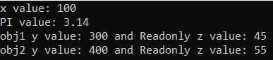

برای درک بهتر مثال بالا، لطفاً به نمودار زیر که نمایش حافظه را نشان می‌دهد، نگاهی بیندازید.

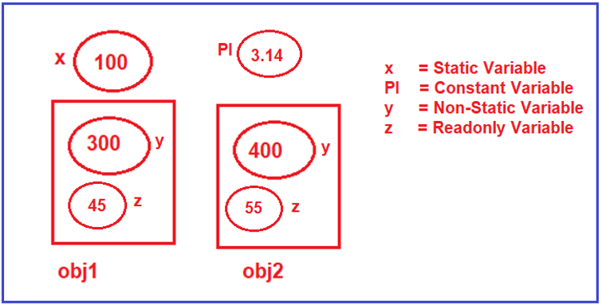

حالا، دوباره ممکن است یک سوال داشته باشید، اگر هر دو نوع داده‌ی غیر استاتیک و فقط خواندنی رفتار یکسانی دارند، پس تفاوت بین آنها چیست؟

##### **تفاوت بین غیر استاتیک و فقط خواندنی در سی شارپ:**

تنها تفاوت بین یک متغیر غیر استاتیک و فقط خواندنی این است که پس از مقداردهی اولیه، می‌توانید مقدار متغیر غیر استاتیک را تغییر دهید اما نمی‌توانید مقدار متغیر فقط خواندنی را تغییر دهید. بگذارید این را ثابت کنیم. در مثال زیر، پس از ایجاد اولین نمونه، سعی داریم مقدار متغیر غیر استاتیک y و فقط خواندنی z را تغییر دهیم.

```csharp
using System;

namespace TypesOfVariables
{
    internal class Program
    {
        const float PI = 3.14f; //Constant Variable
        static int x = 100; //Static Variable
        //We are going to initialize variable y through constructor
        int y; //Non-Static or Instance Variable
        readonly int z; //Readonly Variable

        //Constructor
        public Program(int a, int b)
        {
            //Initializing non-static variable
            y = a;
            //Initializing Readonly variable
            z = b;
        }

        static void Main(string[] args)
        {
            //Accessing the static variable without instance
            Console.WriteLine($"x value: {x}");
            //Accessing the constant variable without instance
            Console.WriteLine($"PI value: {PI}");

            Program obj1 = new Program(300, 45);
            //Accessing Non-Static variable using instance
            Console.WriteLine($"obj1 y value: {obj1.y} and Readonly z value: {obj1.z}");

            obj1.y = 500; //Modifying Non-Static Variable
            // obj1.z = 400; //Trying to Modify Readonly Variable, Getting Error

            Console.Read();
        }
    }
}
```

وقتی سعی می‌کنید کد بالا را اجرا کنید، با خطای کامپایل زیر مواجه خواهید شد.

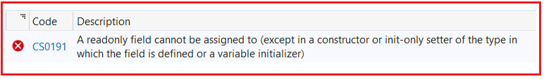

همانطور که در تصویر بالا مشاهده می‌کنید، به وضوح می‌گوید که **نمی‌توان به یک فیلد فقط خواندنی مقدار داد (به جز در یک سازنده یا تنظیم‌کننده فقط اولیه از نوعی که فیلد در آن تعریف شده است یا یک مقداردهی اولیه متغیر)** . این بدان معناست که شما فقط می‌توانید یک متغیر فقط خواندنی را در زمان تعریف آن یا از طریق یک سازنده مقداردهی اولیه کنید. و در اینجا، ما سعی می‌کنیم مقدار فقط خواندنی را درون متد Main تغییر دهیم و از این رو خطای کامپایل دریافت می‌کنیم.

##### **تفاوت بین متغیر ثابت و فقط خواندنی در C# چیست؟**

تفاوت بین یک متغیر ثابت و فقط خواندنی در سی شارپ این است که یک متغیر ثابت، یک مقدار ثابت برای کل کلاس است در حالی که فقط خواندنی، یک مقدار ثابت مختص به یک نمونه از کلاس و برای هر نمونه است.

##### **متغیرهای محلی در سی شارپ:**

متغیرهای محلی در سی شارپ درون متد یک کلاس تعریف می‌شوند. دامنه متغیر محلی محدود به متد است، به این معنی که نمی‌توانید از خارج از متد به آن دسترسی داشته باشید. مقداردهی اولیه متغیر محلی اجباری است.

1. **محدوده متغیرهای محلی:** درون بلوکی که در آن تعریف شده‌اند.
2. **طول عمر متغیر محلی:** تا زمانی که کنترل، بلوکی را که در آن تعریف شده است، ترک کند.

##### **مثال برای درک متغیرهای محلی در سی شارپ:**

```csharp
using System;

namespace TypesOfVariables
{
    internal class Program
    {
        static void Main(string[] args)
        {
            Console.Read();
        }

        public void NonStaticBlock()
        {
            // به طور پیش‌فرض، هر متغیر محلی غیر استاتیک خواهد بود
            // محدوده فقط به این متد محدود می‌شود
            int x = 100;
        }

        public static void StaticBlock()
        {
            // به طور پیش‌فرض، هر متغیر محلی استاتیک خواهد بود
            // محدوده فقط به این متد محدود می‌شود
            int y = 100;
        }
    }
}
```