## **عملگرها در سی شارپ به همراه مثال**

در این مقاله، قصد دارم در مورد **عملگرها در سی شارپ** با مثال صحبت کنم. بخوانید. عملگرها پایه و اساس هر زبان برنامه‌نویسی هستند. بنابراین، عملکرد زبان سی شارپ بدون استفاده از عملگرها ناقص است. در پایان این مقاله، شما خواهید فهمید که عملگرها چه هستند و چه زمانی و چگونه می‌توان از آنها در برنامه‌های سی شارپ با مثال استفاده کرد.

##### **عملگرها در سی شارپ چیستند؟**

عملگرها در سی شارپ نمادهایی هستند که برای انجام عملیات روی عملوندها استفاده می‌شوند. برای مثال، عبارت **2 + 3 = 5** را در نظر بگیرید ، در اینجا **2 و 3 عملوند هستند** و **\+ و = عملگر نامیده می‌شوند** . بنابراین، عملگرها در سی شارپ برای دستکاری متغیرها و مقادیر در یک برنامه استفاده می‌شوند.

**int x = 10, y = 20;**  
**int result1 = x + y;** //عملگر دستکاری متغیرها، که در آن x و y متغیر و + عملگر است.  
**int result2 = 10 + 20;** // عملگر دستکاری مقادیر، که در آن 10 و 20 مقدار و + عملگر است.

**نکته:** در مثال بالا، x، y، 10 و 20 عملوند نامیده می‌شوند. بنابراین، عملوند می‌تواند متغیر یا مقدار باشد.

##### **انواع عملگرها در سی شارپ:**

عملگرها بر اساس نوع عملیاتی که روی عملوندها در زبان سی شارپ انجام می‌دهند، طبقه‌بندی می‌شوند. آنها به شرح زیر هستند:

1. **عملگرهای حسابی**
2. **عملگرهای رابطه‌ای**
3. **عملگرهای منطقی**
4. **عملگرهای بیتی**
5. **عملگرهای انتساب**
6. **عملگرهای یگانی یا**
7. **عملگر سه‌تایی یا عملگر شرطی**

در سی شارپ، عملگرها را می‌توان بر اساس تعداد عملوندها نیز طبقه‌بندی کرد:

1. **عملگر یگانه (Unary Operator** ): عملگری که برای انجام عملیات به یک عملوند (متغیر یا مقدار) نیاز دارد، عملگر یگانه نامیده می‌شود.
2. **عملگر دودویی (Binary Operator** ): به عملگری که برای انجام عملیات به دو عملوند (متغیر یا مقدار) نیاز دارد، عملگر دودویی (Binary Operator) می‌گویند.
3. **عملگر سه‌تایی** : عملگری که برای انجام عملیات به سه عملوند (متغیر یا مقدار) نیاز دارد، عملگر سه‌تایی نامیده می‌شود. عملگر سه‌تایی، عملگر شرطی نیز نامیده می‌شود.

برای درک بهتر انواع مختلف عملگرهای پشتیبانی شده در زبان برنامه نویسی سی شارپ، لطفاً به تصویر زیر نگاهی بیندازید.

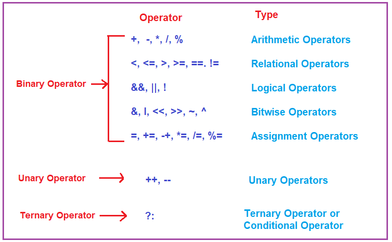

##### **عملگرهای محاسباتی در سی شارپ**

عملگرهای حسابی در سی شارپ برای انجام عملیات حسابی/ریاضی مانند جمع، تفریق، ضرب، تقسیم و غیره روی عملوندها استفاده می‌شوند. عملگرهای زیر در این دسته قرار می‌گیرند.

**عملگر جمع (+):**  
عملگر + دو عملوند را جمع می‌کند. از آنجایی که این عملگر با دو عملوند کار می‌کند، بنابراین، این عملگر + (به‌علاوه) به دسته عملگرهای دودویی تعلق دارد. عملگر + مقدار عملوند سمت چپ را با مقدار عملوند سمت راست جمع می‌کند و نتیجه را برمی‌گرداند. برای مثال:  
**int a=10;**  
**int b=5;**  
**int c = a+b; //15, در اینجا، مقادیر عملوند a و b یعنی 10 + 5 را جمع می‌کند.**

**عملگر تفریق (-):**  
عملگر – دو عملوند را از هم کم می‌کند. از آنجایی که این عملگر با دو عملوند کار می‌کند، بنابراین، این عملگر – (منها) به دسته عملگرهای دودویی تعلق دارد. عملگر منها مقدار عملوند سمت چپ را از مقدار عملوند سمت راست کم می‌کند و نتیجه را برمی‌گرداند. برای مثال:  
**int a=10;**  
**int b=5;**  
**int c = a-b; //5، در اینجا، b را از a کم می‌کند، یعنی 10 - 5**

**عملگر ضرب (\*):**  
عملگر \* (ضرب) دو عملوند را در هم ضرب می‌کند. از آنجایی که این عملگر با دو عملوند کار می‌کند، بنابراین، این عملگر \* (ضرب) به دسته عملگرهای دودویی تعلق دارد. عملگر ضرب، مقدار عملوند سمت چپ را در مقدار عملوند سمت راست ضرب می‌کند و نتیجه را برمی‌گرداند. برای مثال:  
**int a=10;**  
**int b=5;**  
**int c=a\*b; //50، در اینجا، a را در bi ضرب می‌کند، یعنی 10 \* 5**

**عملگر تقسیم (/):**  
عملگر / (تقسیم) دو عملوند را بر هم تقسیم می‌کند. از آنجایی که این عملگر با دو عملوند کار می‌کند، بنابراین، این عملگر / (تقسیم) به دسته عملگرهای دودویی تعلق دارد. عملگر تقسیم، مقدار عملوند سمت چپ را بر مقدار عملوند سمت راست تقسیم می‌کند و نتیجه را برمی‌گرداند. برای مثال:  
**int a=10;**  
**int b=5;**  
**int c=a/b; //2، در اینجا، 10 بر 5 تقسیم می‌شود.**

**عملگر مدول (%):**  
عملگر % (Modulos) باقیمانده تقسیم عملوند اول بر دوم را برمی‌گرداند. از آنجایی که این عملگر با دو عملوند کار می‌کند، بنابراین، این عملگر % (Modulos) به دسته عملگر دودویی تعلق دارد. به عنوان مثال:  
**int a=10;**  
**int b=5;**  
**int c=a%b; //0‎، در اینجا، 10 را بر 5 تقسیم می‌کند و باقیمانده را برمی‌گرداند که در این مورد 0 است.**

##### **مثال برای درک عملگرهای حسابی در سی شارپ:**

در مثال زیر، نحوه استفاده از عملگرهای حسابی با عملوندهایی که متغیر هستند را نشان می‌دهم. در اینجا، Num1 و Num2 متغیر هستند و تمام عملگرهای حسابی روی این دو متغیر کار می‌کنند.

```csharp
using System;

namespace OperatorsDemo
{
    class Program
    {
        static void Main(string[] args)
        {
            int Result;
            int Num1 = 20, Num2 = 10;

            // Addition Operation
            Result = (Num1 + Num2);
            Console.WriteLine($"Addition Operator: {Result}");

            // Subtraction Operation
            Result = (Num1 - Num2);
            Console.WriteLine($"Subtraction Operator: {Result}");

            // Multiplication Operation
            Result = (Num1 * Num2);
            Console.WriteLine($"Multiplication Operator: {Result}");

            // Division Operation
            Result = (Num1 / Num2);
            Console.WriteLine($"Division Operator: {Result}");

            // Modulo Operation
            Result = (Num1 % Num2);
            Console.WriteLine($"Modulo Operator: {Result}");

            Console.ReadKey();
        }
    }
}
```

###### **خروجی:**

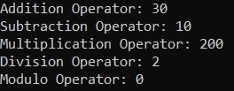

در مثال زیر، نحوه استفاده از عملگرهای حسابی با عملوندها که مقادیر هستند را نشان می‌دهم. در اینجا، 10 و 20 مقادیر هستند و تمام عملگرهای حسابی روی این دو مقدار کار می‌کنند.

```csharp
using System;

namespace OperatorsDemo
{
    class Program
    {
        static void Main(string[] args)
        {
            int Result;
            // int Num1 = 20, Num2 = 10;

            // Addition Operation
            Result = 20 + 10;
            Console.WriteLine($"Addition Operator: {Result}");

            // Subtraction Operation
            Result = 20 - 10;
            Console.WriteLine($"Subtraction Operator: {Result}");

            // Multiplication Operation
            Result = 20 * 10;
            Console.WriteLine($"Multiplication Operator: {Result}");

            // Division Operation
            Result = 20 / 10;
            Console.WriteLine($"Division Operator: {Result}");

            // Modulo Operation
            Result = 20 % 10;
            Console.WriteLine($"Modulo Operator: {Result}");

            Console.ReadKey();
        }
    }
}
```

###### **خروجی:**


**نکته:** نکته‌ای که باید به خاطر داشته باشید این است که عملگری که روی عملوندها کار می‌کند و خود عملوند می‌تواند متغیر یا مقدار باشد و همچنین می‌تواند ترکیبی از هر دو باشد.

##### **Assignment Operators in C#:**

عملگرهای انتساب در سی شارپ برای اختصاص دادن یک مقدار به یک متغیر استفاده می‌شوند. عملوند سمت چپ عملگر انتساب، یک متغیر است و عملوند سمت راست عملگر انتساب می‌تواند یک مقدار یا عبارتی باشد که باید مقداری را برگرداند و آن مقدار قرار است به متغیر سمت چپ اختصاص داده شود.

مهمترین نکته‌ای که باید در نظر داشته باشید این است که مقدار سمت راست باید از همان نوع داده‌ای باشد که متغیر سمت چپ دارد، در غیر این صورت با خطای زمان کامپایل مواجه خواهید شد. انواع مختلف عملگرهای انتسابی پشتیبانی شده در زبان سی شارپ به شرح زیر است:

###### **انتساب ساده (=):**

این عملگر برای اختصاص مقدار عملوند سمت راست به عملوند سمت چپ، یعنی به یک متغیر، استفاده می‌شود.  
**برای مثال:**  
**int a=10;**  
**int b=20;**  
**char ch = 'a';**  
**a=a+4; //(a=10+4)**  
**b=b-4; //(b=20-4)**

###### **اضافه کردن تکلیف (+=):**

این عملگر ترکیبی از عملگرهای + و = است. از آن برای جمع کردن مقدار عملوند سمت چپ با مقدار عملوند سمت راست و سپس اختصاص نتیجه به متغیر سمت چپ استفاده می‌شود.  
**برای مثال:**  
**int a=5;**  
**int b=6;**  
**a += b; //a=a+b; یعنی (a += b) را می‌توان به صورت (a = a + b) نوشت.**

###### **تفریق انتساب (-=):**

این عملگر ترکیبی از عملگرهای – و = است. از آن برای کم کردن مقدار عملوند سمت راست از مقدار عملوند سمت چپ و سپس اختصاص نتیجه به متغیر سمت چپ استفاده می‌شود.  
**برای مثال:**  
**int a=10;**  
**int b=5;**  
**a -= b; //a=a-b; یعنی (a -= b) را می‌توان به صورت (a = a – b) نوشت.**

###### **انتساب ضرب (\*=):**

این عملگر ترکیبی از عملگرهای \* و = است. از آن برای ضرب مقدار عملوند سمت چپ در مقدار عملوند سمت راست و سپس اختصاص نتیجه به متغیر سمت چپ استفاده می‌شود.  
**برای مثال:**  
**int a=10;**  
**int b=5;**  
**a *= b; //a=a*b; یعنی (a *= b) را می‌توان به صورت (a = a * b) نوشت.**

###### **تخصیص تقسیم (/=):**

این عملگر ترکیبی از عملگرهای / و = است. از آن برای تقسیم مقدار عملوند سمت چپ بر مقدار عملوند سمت راست و سپس اختصاص نتیجه به متغیر سمت چپ استفاده می‌شود.  
**برای مثال:**  
**int a=10;**  
**int b=5;**  
**a /= b; //a=a/b; یعنی (a /= b) را می‌توان به صورت (a = a / b) نوشت.**

###### **انتساب مدول (%=):**

این عملگر ترکیبی از عملگرهای % و = است. از آن برای تقسیم مقدار عملوند سمت چپ بر مقدار عملوند سمت راست استفاده می‌شود و سپس باقیمانده این تقسیم را به متغیر سمت چپ اختصاص می‌دهد.  
**برای مثال:**  
**int a=10;**  
**int b=5;**  
**a %= b; //a=a%b; یعنی (a %= b) را می‌توان به صورت (a = a % b) نوشت.**

##### **مثال برای درک عملگرهای انتساب در سی شارپ:**

```csharp
using System;

namespace OperatorsDemo
{
    class Program
    {
        static void Main(string[] args)
        {
            // Initialize variable x using Simple Assignment Operator "="
            int x = 15;

            x += 10;  //It means x = x + 10 i.e. 15 + 10 = 25
            Console.WriteLine($"Add Assignment Operator: {x}");

            // initialize variable x again
            x = 20;
            x -= 5;  //It means x = x - 5 i.e. 20 - 5 = 15
            Console.WriteLine($"Subtract Assignment Operator: {x}");

            // initialize variable x again
            x = 15;
            x *= 5; //It means x = x * 5  i.e. 15 * 5 = 75
            Console.WriteLine($"Multiply Assignment Operator: {x}");

            // initialize variable x again
            x = 25;
            x /= 5; //It means x = x / 5 i.e. 25 / 5 = 5
            Console.WriteLine($"Division Assignment Operator: {x}");

            // initialize variable x again
            x = 25;
            x %= 5; //It means x = x % 5 i.e. 25 % 5 = 0
            Console.WriteLine($"Modulo Assignment Operator: {x}");

            Console.ReadKey();
        }
    }
}
```

###### **خروجی:**

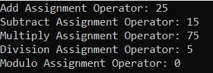

##### **عملگرهای رابطه‌ای در سی شارپ:**

عملگرهای رابطه‌ای در سی‌شارپ به عنوان عملگرهای مقایسه‌ای نیز شناخته می‌شوند. این عملگرها رابطه بین دو عملوند را تعیین می‌کنند و نتایج بولی، یعنی درست یا نادرست بودن پس از مقایسه را برمی‌گردانند. انواع مختلف عملگرهای رابطه‌ای پشتیبانی شده توسط سی‌شارپ به شرح زیر است.

###### **برابر با (==):**

این عملگر برای برگرداندن مقدار عملوند سمت چپ در صورتی که برابر با مقدار عملوند سمت راست باشد، مقدار درست (true) را برمی‌گرداند. برای مثال، 5==3 برابر با نادرست (false) ارزیابی می‌شود. بنابراین، این عملگر مساوی بودن (==) بررسی می‌کند که آیا دو مقدار عملوند داده شده برابر هستند یا خیر. اگر برابر باشد، مقدار درست (true) را برمی‌گرداند، در غیر این صورت مقدار نادرست (false) را برمی‌گرداند.

###### **برابر نیست با (!=):**

این عملگر برای برگرداندن مقدار عملوند سمت چپ در صورتی که با مقدار عملوند سمت راست برابر نباشد، مقدار درست (true) را برمی‌گرداند. برای مثال، 5!=3 برابر با درست (true) ارزیابی می‌شود. بنابراین، این عملگر مساوی نبودن با (!=) بررسی می‌کند که آیا دو مقدار عملوند داده شده برابر هستند یا خیر. اگر برابر باشد، مقدار نادرست (false) را برمی‌گرداند و در غیر این صورت مقدار درست (true) را برمی‌گرداند.

###### **کمتر از (<):**

این عملگر برای برگرداندن مقدار عملوند سمت چپ در صورتی که کمتر از مقدار عملوند سمت راست باشد، مقدار درست (true) را برمی‌گرداند. برای مثال، 5<3 به عنوان نادرست (false) ارزیابی می‌شود. بنابراین، این عملگر کوچکتر از (<) بررسی می‌کند که آیا مقدار عملوند اول کمتر از مقدار عملوند دوم است یا خیر. اگر چنین باشد، مقدار درست (true) را برمی‌گرداند، در غیر این صورت مقدار نادرست (false) را برمی‌گرداند.

###### **کوچکتر یا مساوی (<=):**

این عملگر برای برگرداندن مقدار عملوند سمت چپ در صورتی که کوچکتر یا مساوی مقدار عملوند سمت راست باشد، مقدار درست (true) را برمی‌گرداند. برای مثال، 5<=5 به عنوان درست ارزیابی می‌شود. بنابراین، این عملگر کوچکتر یا مساوی (<=) بررسی می‌کند که آیا مقدار عملوند اول کوچکتر یا مساوی مقدار عملوند دوم است یا خیر. در این صورت مقدار درست (true) را برمی‌گرداند، در غیر این صورت مقدار نادرست (false) را برمی‌گرداند.

###### **بزرگتر از (>):**

این عملگر برای برگرداندن مقدار true در صورتی که مقدار عملوند سمت چپ بزرگتر از مقدار عملوند سمت راست باشد، استفاده می‌شود. برای مثال، 5>3 به عنوان true ارزیابی می‌شود. بنابراین، این عملگر بزرگتر از (>) بررسی می‌کند که آیا مقدار عملوند اول بزرگتر از مقدار عملوند دوم است یا خیر. در صورت بزرگتر بودن، true را برمی‌گرداند، در غیر این صورت false را برمی‌گرداند.

###### **بزرگتر یا مساوی (>=):**

این عملگر برای برگرداندن مقدار عملوند سمت چپ در صورتی که بزرگتر یا مساوی مقدار عملوند سمت راست باشد، مقدار درست (true) را برمی‌گرداند. برای مثال، 5>=5 به عنوان درست ارزیابی می‌شود. بنابراین، این عملگر بزرگتر یا مساوی (>=) بررسی می‌کند که آیا مقدار عملوند اول بزرگتر یا مساوی مقدار عملوند دوم است یا خیر. در این صورت، مقدار درست (true) را برمی‌گرداند، در غیر این صورت مقدار نادرست (false) را برمی‌گرداند.

##### **مثال برای درک عملگرهای رابطه‌ای در سی شارپ:**

```csharp
using System;

namespace OperatorsDemo
{
    class Program
    {
        static void Main(string[] args)
        {
            bool Result;
            int Num1 = 5, Num2 = 10;

            // Equal to Operator
            Result = (Num1 == Num2);
            Console.WriteLine("Equal (=) to Operator: " + Result);

            // Greater than Operator
            Result = (Num1 > Num2);
            Console.WriteLine("Greater (<) than Operator: " + Result);

            // Less than Operator
            Result = (Num1 < Num2);
            Console.WriteLine("Less than (>) Operator: " + Result);

            // Greater than Equal to Operator
            Result = (Num1 >= Num2);
            Console.WriteLine("Greater than or Equal to (>=) Operator: " + Result);

            // Less than Equal to Operator
            Result = (Num1 <= Num2);
            Console.WriteLine("Lesser than or Equal to (<=) Operator: " + Result);

            // Not Equal To Operator
            Result = (Num1 != Num2);
            Console.WriteLine("Not Equal to (!=) Operator: " + Result);

            Console.ReadKey();
        }
    }
}
```

###### **خروجی:**

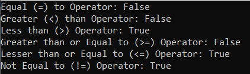

##### **عملگرهای منطقی در سی شارپ:**

عملگرهای منطقی عمدتاً در دستورات شرطی و حلقه‌ها برای ارزیابی یک شرط استفاده می‌شوند. این عملگرها با عبارات بولی کار می‌کنند. انواع مختلف عملگرهای منطقی پشتیبانی شده در سی شارپ به شرح زیر است:

##### **یای منطقی (||):**

این عملگر برای برگرداندن مقدار درست در صورتی که هر یک از عبارات بولی درست باشد، استفاده می‌شود. برای مثال، false || true برابر با درست ارزیابی می‌شود. این بدان معناست که عملگر Logical OR (||) زمانی مقدار درست را برمی‌گرداند که یکی (یا هر دو) شرط در عبارت برقرار باشد. در غیر این صورت، مقدار نادرست را برمی‌گرداند. برای مثال، a || b اگر یکی از a یا b درست باشد، مقدار درست را برمی‌گرداند. همچنین، زمانی که هر دو a و b درست باشند، مقدار درست را برمی‌گرداند.

##### **و منطقی (&&):**

این عملگر برای برگرداندن مقدار درست در صورتی که همه عبارات بولی درست باشند، استفاده می‌شود. برای مثال، false && true برابر با false ارزیابی می‌شود. این بدان معناست که عملگر منطقی AND (&&) زمانی مقدار درست را برمی‌گرداند که هر دو شرط در عبارت برقرار باشند. در غیر این صورت، مقدار نادرست را برمی‌گرداند. برای مثال، a && b فقط زمانی مقدار درست را برمی‌گرداند که هر دو a و b درست باشند.

##### **نه منطقی (!):**

این عملگر برای برگرداندن مقدار true در صورتی که شرط موجود در عبارت برقرار نباشد، استفاده می‌شود. در غیر این صورت، مقدار false را برمی‌گرداند. برای مثال، !a در صورتی که a نادرست باشد، مقدار true را برمی‌گرداند.

##### **مثال برای درک عملگرهای منطقی در سی شارپ:**

```csharp
using System;

namespace OperatorsDemo
{
    class Program
    {
        static void Main(string[] args)
        {
            bool x = true, y = false, z;

            //Logical AND operator
            z = x && y;
            Console.WriteLine("Logical AND Operator (&&) : " + z);

            //Logical OR operator
            z = x || y;
            Console.WriteLine("Logical OR Operator (||) : " + z);

            //Logical NOT operator
            z = !x;
            Console.WriteLine("Logical NOT Operator (!) : " + z);

            Console.ReadKey();
        }
    }
}
```

###### **خروجی:**

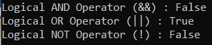

##### **عملگرهای بیتی در سی شارپ:**

عملگرهای بیتی در سی شارپ پردازش بیت به بیت را انجام می‌دهند. آن‌ها می‌توانند با هر یک از **انواع اعداد صحیح (short، int، long، ushort، uint، ulong، byte)** استفاده شوند . انواع مختلف عملگرهای بیتی پشتیبانی شده در سی شارپ به شرح زیر است.

###### **یای بیتی (|)**

عملگر بیتی OR با | نمایش داده می‌شود. این عملگر عملیات بیتی OR را روی بیت‌های متناظر دو عملوند درگیر در عملیات انجام می‌دهد. اگر هر یک از بیت‌ها ۱ باشد، ۱ برمی‌گرداند. در غیر این صورت، ۰ برمی‌گرداند.  
برای مثال،  
**int a=12, b=25;**  
**int Result = a | b; //29**  
**چگونه؟**  
۱۲ عدد دودویی: **0000100**  
۲۵ عدد دودویی: **00011001**  
عملیات بیتی OR بین ۱۲ و ۲۵:  
**0001100**  
**00011001**  
**========**  
**0001101 (عدد اعشاری آن ۲۹ است)**  
**نکته** : اگر عملوندها از نوع bool باشند، عملگر بیتی OR معادل عملگر منطقی OR بین آنهاست.

###### **و بیتی (&):**

عملگر بیتی OR با & نمایش داده می‌شود. این عملگر عملیات بیتی AND را روی بیت‌های متناظر دو عملوند درگیر در عملیات انجام می‌دهد. اگر هر دو بیت ۱ باشند، ۱ برمی‌گرداند. اگر هیچ‌کدام از بیت‌ها ۱ نباشند، ۰ برمی‌گرداند.  
برای مثال،  
**int a=12, b=25;**  
**int Result = a & b; //8**  
چگونه؟  
۱۲ عدد دودویی: 0000100  
۲۵ عدد دودویی: 00011001  
عملیات بیتی AND بین ۱۲ و ۲۵:  
**0001100**  
**00011001**  
**========**
00001000 (عدد اعشاری آن ۸ است)
نکته : اگر عملوندها از نوع bool باشند، عملگر بیتی AND معادل عملگر منطقی AND بین آنهاست.

###### **XOR بیتی (^):**

عملگر بیتی OR با ^ نمایش داده می‌شود. این عملگر یک عملیات بیتی XOR روی بیت‌های متناظر دو عملوند انجام می‌دهد. اگر بیت‌های متناظر متفاوت باشند، مقدار ۱ و اگر بیت‌های متناظر یکسان باشند، مقدار ۰ را برمی‌گرداند.  
برای مثال،  
**int a=12, b=25;**  
**int Result = a ^ b; //21**  
چگونه؟  
۱۲ عدد دودویی: 0000100  
۲۵ عدد دودویی: 00011001  
عملیات بیتی AND بین ۱۲ و ۲۵:  
**0001100**  
00011001  
00010101 (عدد اعشاری آن ۲۱ است)

##### **مثال برای درک عملگرهای بیتی در سی شارپ:**

```csharp
using System;

namespace OperatorsDemo
{
    class Program
    {
        static void Main(string[] args)
        {
            int a = 12, b = 25, Result;

            // Bitwise AND Operator
            Result = a & b;
            Console.WriteLine($"Bitwise AND: {Result}");

            // Bitwise OR Operator
            Result = a | b;
            Console.WriteLine($"Bitwise OR: {Result}");

            // Bitwise XOR Operator
            Result = a ^ b;
            Console.WriteLine($"Bitwise XOR: {Result}");

            Console.ReadKey();
        }
    }
}
```

###### **خروجی:**

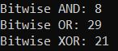

در مثال بالا، ما از عملگرهای بیتی (BIT) با نوع داده صحیح استفاده می‌کنیم و از این رو عملیات بیتی را انجام می‌دهد. اما اگر از عملگرهای بیتی با نوع داده بولی استفاده کنیم، این عملگرهای بیتی AND، OR و XOR مانند عملیات منطقی AND و OR رفتار می‌کنند. برای درک بهتر، لطفاً به مثال زیر نگاهی بیندازید. در مثال زیر، ما از عملگرهای بیتی روی عملوندهای بولی استفاده می‌کنیم و از این رو آنها عملیات منطقی AND، OR و XOR را انجام می‌دهند.

```csharp
using System;

namespace OperatorsDemo
{
    class Program
    {
        static void Main(string[] args)
        {
            bool a = true, b = false, Result;

            // Bitwise AND Operator
            Result = a & b;
            Console.WriteLine($"Bitwise AND: {Result}");

            // Bitwise OR Operator
            Result = a | b;
            Console.WriteLine($"Bitwise OR: {Result}");

            // Bitwise XOR Operator
            Result = a ^ b;
            Console.WriteLine($"Bitwise XOR: {Result}");

            Console.ReadKey();
        }
    }
}
```

###### **خروجی:**

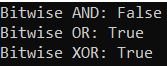

**نکته:** نکته‌ای که باید هنگام کار با عملگرهای بیتی به خاطر داشته باشید این است که بسته به عملوندی که روی آن کار می‌کنند، رفتار آنها تغییر می‌کند. به این معنی که اگر با عملوندهای صحیح کار می‌کنند، مانند عملگرهای بیتی عمل می‌کنند و نتیجه را به صورت عدد صحیح برمی‌گردانند و اگر با عملوندهای بولی کار می‌کنند، مانند عملگرهای منطقی عمل می‌کنند و نتیجه را به صورت بولی برمی‌گردانند.

##### **عملگرهای یگانی در سی شارپ:**

عملگرهای Unary در سی شارپ فقط به یک عملوند نیاز دارند. آنها برای افزایش یا کاهش یک مقدار استفاده می‌شوند. دو نوع عملگر Unary وجود دارد. آنها به شرح زیر هستند:

1. **عملگرهای افزایشی (++): مثال: (++x، x++)**
2. **عملگرهای کاهش (–): مثال: (–x، x–)**

##### **عملگر افزایش (++) در زبان سی شارپ:**

عملگر افزایشی (++) یک عملگر تکی است. فقط روی یک عملوند عمل می‌کند. باز هم، به دو نوع طبقه‌بندی می‌شود:

1. **عملگر پس از افزایش**
2. **عملگر پیش افزایشی**

##### **عملگرهای افزایش پس از اعمال:**

عملگرهای افزایش پس از عملگرهایی هستند که به عنوان پسوند برای متغیر آن استفاده می‌شوند. این عملگرها بعد از متغیر قرار می‌گیرند. برای مثال، a++ مقدار متغیر a را نیز 1 واحد افزایش می‌دهد.

**نحو:** **variable++;**  
**مثال:** **x++;**

##### **عملگرهای پیش افزایشی:**

عملگرهای پیش افزایشی، عملگرهایی هستند که به عنوان پیشوند برای متغیر آن استفاده می‌شوند. این عملگرها قبل از متغیر قرار می‌گیرند. برای مثال، ++a مقدار متغیر a را 1 واحد افزایش می‌دهد.

**نحو:** **++variable;**  
**مثال:** **++x;**

##### **عملگرهای کاهشی در زبان سی شارپ:**

عملگر کاهش (-) یک عملگر یگانی است. در هر زمان یک مقدار می‌گیرد. این عملگر نیز به دو نوع طبقه‌بندی می‌شود. آنها به شرح زیر هستند:

1. **عملگر کاهش پس از کسر**
2. **عملگر پیش کاهشی**

##### **عملگرهای کاهش پس از کسر:**

عملگرهای پس از کاهش، عملگرهایی هستند که به عنوان پسوند برای متغیر خود استفاده می‌شوند. این عملگرها بعد از متغیر قرار می‌گیرند. برای مثال، a- مقدار متغیر a را نیز ۱ واحد کاهش می‌دهد.

**نحو:** **variable--;**  
**مثال:** **x--;**

##### **عملگرهای پیش کاهشی:**

عملگرهای پیش کاهشی، عملگرهایی هستند که پیشوند متغیر خود هستند. این عملگرها قبل از متغیر قرار می‌گیرند. برای مثال، –a مقدار متغیر a را ۱ واحد کاهش می‌دهد.

**نحو:** **--variable;**  
**مثال:** **--x;**

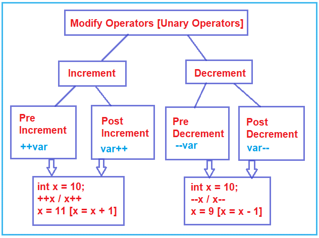

**نکته:** عملگر افزایش به معنی افزایش ۱ واحدی مقدار متغیر و عملگر کاهش به معنی کاهش ۱ واحدی مقدار متغیر است.

##### **مثال برای درک عملگرهای افزایشی در زبان سی شارپ:**

```csharp
using System;

namespace OperatorsDemo
{
    class Program
    {
        static void Main(string[] args)
        {
            // Post-Increment
            int x = 10;
            // Result1 is assigned 10 only,
            // x is not updated yet
            int Result1 = x++;
            //x becomes 11 now
            Console.WriteLine("x is {0} and Result1 is {1}", x, Result1);

            // Pre-Increment 
            int y = 10;
            int Result2 = ++y;
            //y and Result2 have same values = 11
            Console.WriteLine("y is {0} and Result2 is {1}", y, Result2);

            Console.ReadKey();
        }
    }
}
```

###### **خروجی:**

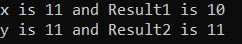

##### **مثال برای درک عملگرهای کاهشی در زبان سی شارپ:**

```csharp
using System;

namespace OperatorsDemo
{
    class Program
    {
        static void Main(string[] args)
        {
            // Post-Decrement
            int x = 10;
            // Result1 is assigned 10 only,
            // x is not yet updated
            int Result1 = x--;
            //x becomes 9 now
            Console.WriteLine("x is {0} and Result1 is {1}", x, Result1);

            // Pre-Decrement 
            int y = 10;
            int Result2 = --y;
            //y and Result2 have same values i.e. 9
            Console.WriteLine("y is {0} and Result2 is {1}", y, Result2);

            Console.ReadKey();
        }
    }
}
```

###### خروجی:

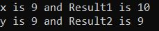

##### **پنج گام برای درک نحوه عملکرد عملگرهای یگانی در سی شارپ**

می‌بینم که بسیاری از دانش‌آموزان و توسعه‌دهندگان هنگام استفاده از عملگرهای افزایشی و کاهشی در یک عبارت، دچار سردرگمی می‌شوند. برای اینکه بفهمید عملگرهای ++ و — دقیقاً چگونه در C# کار می‌کنند، باید 5 مرحله ساده را دنبال کنیم. این مراحل در نمودار زیر نشان داده شده است.

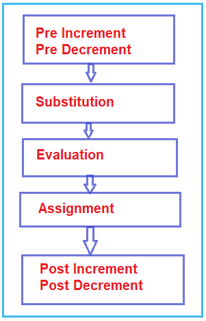

1. **مرحله ۱:** اگر مقداری پیش‌افزایش یا پیش‌کاهش در عبارت وجود داشته باشد، آن باید ابتدا اجرا شود.
2. **مرحله ۲:** مرحله دوم، جایگزینی مقادیر در عبارت است.
3. **مرحله ۳:** در مرحله سوم باید عبارت را ارزیابی کنیم.
4. **مرحله ۴: در** مرحله چهارم، تکلیف باید انجام شود.
5. **مرحله ۵:** مرحله آخر، انجام عملیات پس از افزایش یا پس از کاهش است.

حال، اگر هنوز در مورد پنج مرحله فوق شک دارید، نگران نباشید، برای درک بهتر این مرحله، چند مثال خواهیم دید.

##### **مثال برای درک عملگرهای افزایشی و کاهشی در زبان سی شارپ:**

بیایید یک مثال پیچیده برای درک این مفهوم ببینیم. لطفاً به مثال زیر نگاهی بیندازید. در اینجا، ما سه متغیر x، y و z را تعریف می‌کنیم و سپس عبارت را به صورت z = x++ * –y ارزیابی می‌کنیم؛ در نهایت، مقدار x، y و z را در کنسول چاپ می‌کنیم.

```csharp
using System;

namespace OperatorsDemo
{
    class Program
    {
        static void Main(string[] args)
        {
            int x = 10, y = 20, z;
            z = x++ * --y;
            Console.WriteLine($"x={x}, y={y}, z={z}");
            Console.ReadKey();
        }
    }
}
```

بیایید عبارت **z = x++ * –y** را با دنبال کردن 5 مرحله بالا ارزیابی کنیم:

1. مرحله اول **پیش‌افزایش یا پیش‌کاهش** است . آیا پیش‌افزایش یا پیش‌کاهشی در عبارت وجود دارد؟ هیچ پیش‌افزایشی وجود ندارد اما یک پیش‌کاهش در عبارت وجود دارد، یعنی –y. بنابراین، آن عملگر پیش‌کاهش را اجرا کنید که مقدار y را ۱ واحد کاهش می‌دهد، یعنی حالا y می‌شود ۱۹.
2. مرحله دوم **جایگزینی** است . بنابراین، مقادیر x و y را جایگزین کنید. این بدان معناست که x با 10 و y با 19 جایگزین خواهد شد.
3. مرحله سوم **ارزیابی** است . بنابراین، عبارت 10 * 19 = 190 را ارزیابی کنید.
4. مرحله چهارم، **تخصیص** است . بنابراین، مقدار ارزیابی شده را به متغیر داده شده اختصاص دهید، یعنی ۱۹۰ به z اختصاص داده خواهد شد. بنابراین، اکنون مقدار z برابر با ۱۹۰ می‌شود.
5. مرحله آخر **، پس‌افزایش و پس‌کاهش** است . آیا در عبارت، پس‌افزایش یا پس‌کاهش وجود دارد؟ پس‌کاهشی وجود ندارد، اما در عبارت، یعنی x++، پس‌افزایشی وجود دارد. بنابراین، آن پس‌افزایش را اجرا کنید که مقدار x را ۱ واحد افزایش می‌دهد، یعنی x برابر با ۱۱ می‌شود.

بنابراین، وقتی برنامه‌ی فوق را اجرا می‌کنید، مقادیر x، y و z به ترتیب ۱۱، ۱۹ و ۱۹۰ چاپ می‌شوند.

توجه: مایکروسافت استفاده از عملگرهای ++ یا — را در داخل یک عبارت پیچیده مانند مثال بالا توصیه نمی‌کند. دلیل این امر این است که اگر چندین بار در یک عبارت از عملگر ++ یا — روی یک متغیر مشابه استفاده کنیم، نمی‌توانیم خروجی را پیش‌بینی کنیم. بنابراین، اگر فقط می‌خواهید مقدار یک متغیر را ۱ واحد افزایش دهید یا ۱ واحد کاهش دهید، در آن سناریو باید از این عملگرهای افزایش یا کاهش استفاده کنید. یکی از سناریوهای ایده‌آل که در آن نیاز به استفاده از عملگر افزایش یا کاهش دارید، درون یک حلقه است. حلقه چیست، چرا حلقه، و متغیر شمارنده چیست؟ ما در مقالات بعدی خود در مورد این موضوع بحث خواهیم کرد، اما اکنون فقط به مثال زیر نگاهی بیندازید، که در آن از حلقه for و عملگر افزایش استفاده می‌کنم.

```csharp
using System;

namespace OperatorsDemo
{
    class Program
    {
        static void Main(string[] args)
        {
            for (int i = 0; i < 10; i++)
            {
                Console.WriteLine(i);
            }
            Console.ReadKey();
        }
    }
}
```

##### **عملگر سه‌تایی در سی شارپ:**

عملگر سه‌تایی در سی‌شارپ به عنوان عملگر شرطی ( **?** :) نیز شناخته می‌شود. در واقع، این عملگر، خلاصه‌شده‌ی دستور if-else است. به این دلیل سه‌تایی نامیده می‌شود که دارای سه عملوند یا آرگومان است. آرگومان اول یک آرگومان مقایسه‌ای، آرگومان دوم نتیجه‌ی یک مقایسه‌ی درست و آرگومان سوم نتیجه‌ی یک مقایسه‌ی نادرست است.

**نحو: شرط? first_expression : second_expression;**

عبارت بالا به این معنی است که ابتدا باید شرط را ارزیابی کنیم. اگر شرط درست باشد، عبارت اول اجرا شده و نتیجه می‌شود و اگر شرط نادرست باشد، عبارت دوم اجرا شده و نتیجه می‌شود.

##### **مثال برای درک عملگر سه‌تایی در سی‌شارپ:**

```csharp
using System;

namespace OperatorsDemo
{
    class Program
    {
        static void Main(string[] args)
        {
            int a = 20, b = 10, res;
            res = ((a > b) ? a : b);
            Console.WriteLine("Result = " + res);

            Console.ReadKey();
        }
    }
}
```

**خروجی: نتیجه = ۲۰**