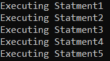
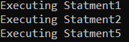
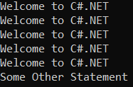
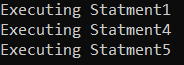
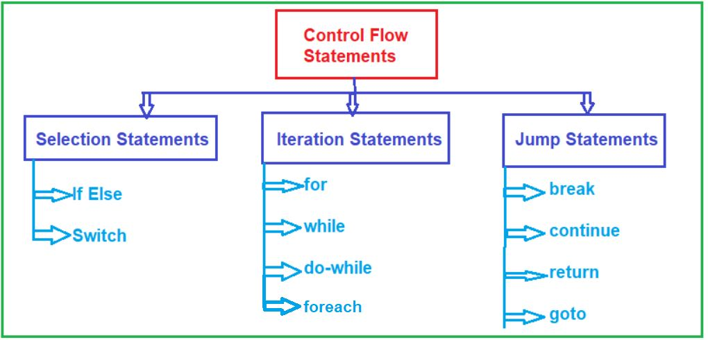

## **دستورات جریان کنترل در سی شارپ**

در این مقاله، قصد دارم **به همراه مثال، دستورات جریان کنترلی در سی شارپ را** مورد بحث قرار دهم. در پایان این مقاله، شما با دستورات کنترلی، نوع آنها و زمان و نحوه استفاده از دستورات کنترلی در سی شارپ با مثال آشنا خواهید شد.

##### **دستورات جریان کنترل در سی شارپ:**

دستورات کنترل جریان در سی شارپ، دستوراتی هستند که جریان اجرای برنامه را تغییر می‌دهند و کنترل بهتری را برای برنامه‌نویس بر روی جریان اجرا فراهم می‌کنند. دستورات کنترل جریان برای نوشتن برنامه‌های بهتر و پیچیده‌تر مفید هستند. یک برنامه از بالا به پایین اجرا می‌شود، مگر زمانی که از دستورات کنترلی استفاده کنیم. ما می‌توانیم ترتیب اجرای برنامه را بر اساس منطق و مقادیر کنترل کنیم.

به‌طورکلی، دستورات درون برنامه‌ی سی‌شارپ ما از بالا به پایین و به ترتیبی که ظاهر می‌شوند، اجرا می‌شوند. دستورات کنترل جریان، جریان اجرا را با پیاده‌سازی تصمیم‌گیری، حلقه‌سازی و شاخه‌بندی در برنامه‌ی ما تغییر می‌دهند یا متوقف می‌کنند تا بلوک‌های خاصی از کد را بر اساس شرایط اجرا کنند.

##### **مثال برای درک دستورات جریان کنترل در سی شارپ:**

به طور پیش‌فرض، وقتی در یک برنامه دستوراتی می‌نویسیم، دستورات به ترتیب از بالا به پایین و خط به خط اجرا می‌شوند. برای مثال، در برنامه زیر پنج دستور نوشته‌ایم. حال اگر برنامه زیر را اجرا کنید، دستورات یکی یکی از بالا به پایین اجرا می‌شوند. این یعنی ابتدا دستور ۱، سپس دستور ۲، سپس دستور ۳، ​​سپس دستور ۴ و در نهایت دستور ۵ اجرا می‌شوند.

```csharp
using System;

namespace ControlFlowDemo
{
    class Program
    {
        static void Main(string[] args)
        {
            Console.WriteLine("Executing Statment1");
            Console.WriteLine("Executing Statment2");
            Console.WriteLine("Executing Statment3");
            Console.WriteLine("Executing Statment4");
            Console.WriteLine("Executing Statment5");
            Console.ReadKey();
        }
    }
}
```

###### **خروجی:**



همچنین در زبان برنامه‌نویسی سی‌شارپ می‌توان اجرای برنامه را تغییر داد. به این معنی که به جای اجرای متوالی دستورات، می‌توانیم ترتیب اجرا را تغییر دهیم. در صورت تمایل، می‌توانیم بر اساس برخی شرایط، از اجرای برخی دستورات صرف نظر کنیم. در صورت تمایل، می‌توانیم از یک دستور به دستور دیگر در داخل برنامه پرش کنیم، مثلاً از دستور ۱ به دستور ۴. حتی اگر بخواهیم، ​​می‌توانیم برخی از دستورات را چندین بار اجرا کنیم. و این به دلیل دستورات کنترل جریان در سی‌شارپ امکان‌پذیر است.

در مثال زیر، دستوراتی که داخل بلوک if نوشته شده‌اند اجرا می‌شوند و دستوراتی که داخل بلوک else نوشته شده‌اند، نادیده گرفته می‌شوند. اما دستوراتی که بعد از بلوک if قرار دارند، اجرا خواهند شد. در اینجا، ما از دستور جریان کنترلی if-else استفاده می‌کنیم.

```csharp
using System;

namespace ControlFlowDemo
{
    class Program
    {
        static void Main(string[] args)
        {
            if (10 > 5)
            {
                Console.WriteLine("Executing Statment1");
                Console.WriteLine("Executing Statment2");
            }
            else
            {
                Console.WriteLine("Executing Statment3");
                Console.WriteLine("Executing Statment4");
            }

            Console.WriteLine("Executing Statment5");
            Console.ReadKey();
        }
    }
}
```

###### **خروجی:**



در مثال زیر، ما به طور مکرر دستوری را که درون بلوک حلقه for قرار دارد، ۵ بار اجرا می‌کنیم. پس از ۵ بار اجرای بدنه حلقه، از حلقه خارج شده و دستور دیگر را فقط یک بار اجرا می‌کند. این امر به دلیل وجود دستور شرطی حلقه امکان‌پذیر است.

```csharp
using System;

namespace ControlFlowDemo
{
    class Program
    {
        static void Main(string[] args)
        {
            for (int i = 0; i < 5; i++)
            {
                Console.WriteLine("Welcome to C#.NET");
            }

            Console.WriteLine("Some Other Statement");
            Console.ReadKey();
        }
    }
}
```

###### **خروجی:**



در مثال زیر، پس از اجرای دستور ۱، کنترل با پرش از دستور ۲ و دستور ۳ به دستور ۴ پرش می‌کند. در اینجا، ما از دستور کنترل goto استفاده می‌کنیم.

```csharp
using System;

namespace ControlFlowDemo
{
    class Program
    {
        static void Main(string[] args)
        {
            Console.WriteLine("Executing Statment1");
            goto statement4; // پرش به برچسب statement4

            Console.WriteLine("Executing Statment2");
            Console.WriteLine("Executing Statment3");

            statement4: // برچسب
            Console.WriteLine("Executing Statment4");
            Console.WriteLine("Executing Statment5");
            Console.ReadKey();
        }
    }
}
```

###### **خروجی:**



در سه مثال بالا، ما از دستورات جریان کنترلی برای کنترل جریان اجرای برنامه استفاده کرده‌ایم یا می‌توانید جریان اجرای برنامه را تغییر دهید.

##### **انواع دستورات جریان کنترل در سی شارپ:**

در زبان سی شارپ، دستورات کنترل جریان به سه دسته زیر تقسیم می‌شوند:

1. **دستورات انتخاب یا دستورات شاخه‌بندی:** (مثال‌ها: if-else، switch case، if-else تو در تو، if-else نردبانی)
2. **دستورات تکرار یا دستورات حلقه:** (مثال‌ها: حلقه while، حلقه do-while، حلقه for-loop و حلقه foreach)
3. **دستورات پرشی** : (مثال‌ها: break، continue، return، goto)

برای درک بهتر، لطفاً به نمودار زیر که طبقه‌بندی دستورات جریان کنترل مختلف را نشان می‌دهد، نگاهی بیندازید.



**نکته:** دستورات کنترل جریان برای نوشتن برنامه‌های قدرتمند با تکرار بخش‌های مهم برنامه و انتخاب بین بخش‌های اختیاری یک برنامه استفاده می‌شوند.