## **دستورات If-Else در سی شارپ به همراه مثال**

در این مقاله، قصد دارم در مورد **دستورات If-Else در سی شارپ** با مثال صحبت کنم. دستورات If-Else متعلق به دسته دستورات انتخاب یا دستورات شاخه بندی هستند. بنابراین، قبل از درک دستورات if-else، ابتدا بیایید بفهمیم دستورات انتخاب یا شاخه بندی در زبان سی شارپ چیستند.

##### **دستورات کنترل جریان انتخاب یا شاخه بندی در سی شارپ چیست؟**

به آن «دستورات تصمیم‌گیری» نیز گفته می‌شود. تصمیم‌گیری در یک زبان برنامه‌نویسی بسیار شبیه به تصمیم‌گیری در زندگی واقعی است. به عنوان مثال، ممکن است موقعیتی داشته باشید که در آن تصمیم بگیرید که آیا به دفتر بروید یا می‌خواهید برای تماشای فیلم به سینما بروید. و شرط این است که اگر باران ببارد، به تئاتر می‌روم و اگر باران نبارد، به دفتر می‌روم. بنابراین، شرط باران است و بر اساس باران، شما تصمیم می‌گیرید که چه کاری باید انجام دهید.

در برنامه‌نویسی نیز، با موقعیت‌هایی مواجه می‌شویم که می‌خواهیم یک بلوک کد خاص در صورت برآورده شدن یک شرط اجرا شود. دستورات تصمیم‌گیری در سی‌شارپ به ما این امکان را می‌دهند که بر اساس نتیجه یک شرط، تصمیم‌گیری کنیم. اگر شرط برقرار باشد، ممکن است لازم باشد قطعه کدی را اجرا کنیم و اگر شرط برقرار نباشد، ممکن است لازم باشد قطعه کد دیگری را اجرا کنیم.

دستورات انتخاب یا شاخه‌بندی یا تصمیم‌گیری در سی‌شارپ به ما این امکان را می‌دهند که جریان اجرای برنامه را بر اساس برخی شرایط کنترل کنیم. این دستورات بخش‌های مختلفی از کد را بسته به یک شرط خاص اجرا می‌کنند. دستورات انتخاب را می‌توان به دسته‌های زیر تقسیم کرد:

1. دستورات شرطی if-else (در این مقاله به آنها خواهم پرداخت)
2. در مورد آنها بحث خواهم کرد **دستورات سوئیچ (در مقاله بعدی )**

##### **دستور if در زبان سی شارپ:**

این تابع، بلوکی از دستورات (یک یا چند دستورالعمل) را اجرا می‌کند، زمانی که شرط موجود در بلوک if درست باشد و زمانی که شرط نادرست باشد، از اجرای بلوک if صرف نظر می‌کند. استفاده از بلوک else در سی شارپ اختیاری است. در ادامه، سینتکس استفاده از بلوک if در زبان سی شارپ آمده است.

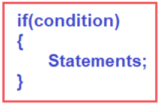

##### **نمودار جریان بلوک If:**

بیایید بفهمیم که چگونه جریان اجرای بلوک if را با استفاده از یک نمودار جریان نمایش خواهیم داد. نقطه شروع با نماد بیضی نشان داده می‌شود. و جریان از شرط خواهد بود و شرط با شکل لوزی نمایش داده می‌شود. در اینجا، ابتدا باید شرط را بررسی کنیم. و برای هر شرط، دو گزینه وجود دارد، یعنی اگر شرایط موفقیت‌آمیز باشند (شرط درست است) و اگر شرایط شکست بخورند (شرط نادرست است). این بدان معناست که دو وضعیت وجود دارد، یعنی درست و نادرست.

فرض کنید شرط درست باشد، آنگاه تمام دستوراتی که درون بلوک if تعریف شده‌اند اجرا می‌شوند. و دستوراتی که ما در نمودار جریان با کمک نماد متوازی‌الاضلاع نمایش می‌دهیم. و پس از اجرای دستورات، کنترل به پایان می‌رسد. فرض کنید شرط نادرست باشد، آنگاه بدون اجرای هیچ دستوری درون بلوک if، کنترل به پایان می‌رسد. برای درک بهتر، لطفاً به نمودار زیر که نمودار جریان دستور شرطی if را نشان می‌دهد، نگاهی بیندازید.

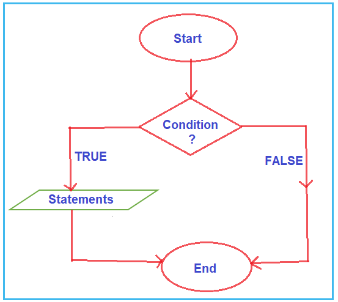

**نکته:** در اینجا، بلوک دستورات فقط زمانی اجرا می‌شود که شرط درست باشد. و اگر شرط نادرست باشد، از اجرای دستورات صرف نظر می‌کند.

##### **مثال برای درک بلوک if در سی شارپ:**

بیایید برنامه‌ای بنویسیم که با استفاده از دستور if در زبان سی‌شارپ، بررسی کند که آیا عدد بزرگتر از ۱۰ است یا خیر. در اینجا، عدد را از کاربر می‌گیریم و سپس با استفاده از دستور if در زبان سی‌شارپ، بررسی می‌کنیم که آیا آن عدد بزرگتر از ۱۰ است یا خیر.

برنامه‌ی زیر دقیقاً همین کار را انجام می‌دهد. در برنامه‌ی زیر، درون متد main، یک متغیر عدد صحیح یعنی number تعریف می‌کنیم و سپس ورودی را از کاربر می‌گیریم و آن را در متغیر number ذخیره می‌کنیم. پس از خواندن ورودی، بررسی می‌کنیم که آیا عدد داده شده بزرگتر از 10 است یا خیر. اگر عدد > 10 باشد، شرط درست است و در این صورت، دو دستور موجود در بلوک if اجرا می‌شوند، در غیر این صورت اگر شرط نادرست باشد، دستورات بلوک if نادیده گرفته می‌شوند.

```csharp
using System;

namespace ControlFlowDemo
{
    class Program
    {
        static void Main(string[] args)
        {
            int number;
            Console.WriteLine("Enter a Number: ");
            number = Convert.ToInt32(Console.ReadLine());
            if (number > 10)
            {
                Console.WriteLine($"{number} is greater than 10 ");
                Console.WriteLine("End of if block");
            }
            Console.WriteLine("End of Main Method");
            Console.ReadKey();
        }
    }
}
```

###### **خروجی:**

اگر عدد ۱۵ را به عنوان ورودی بگیریم، اگر ۱۵ > ۱۰ باشد، به این معنی است که شرط درست است و سپس دستور if اجرا می‌شود.

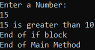

اگر عدد ۵ را به عنوان ورودی بگیریم، ۵ > ۱۰ به این معنی است که شرط نادرست است، سپس دستورات بلوک if نادیده گرفته می‌شوند.

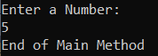

##### **دستور if بدون آکولاد در زبان سی شارپ**

در اعلان بلوک if، اگر از بلوک‌های {} (آکولاد) برای مشخص کردن دستورات استفاده نکنیم، فقط اولین دستور به عنوان دستور بلوک if در نظر گرفته می‌شود. برای درک این موضوع، لطفاً به مثال زیر نگاهی بیندازید.

```csharp
using System;

namespace ControlFlowDemo
{
    class Program
    {
        static void Main(string[] args)
        {
            int number;
            Console.WriteLine("Enter a Number: ");
            number = Convert.ToInt32(Console.ReadLine());
            if (number > 10)
                Console.WriteLine($"{number} is greater than 10 ");
            Console.WriteLine("End of Main Method");
            Console.ReadKey();
        }
    }
}
```

همانطور که می‌بینید، در مثال بالا، ما آکولادها را برای تعریف بلوک if مشخص نکرده‌ایم. در این حالت، فقط اولین دستوری که بعد از بلوک if ظاهر می‌شود، به عنوان دستور بلوک if در نظر گرفته می‌شود. دستور دوم بخشی از بلوک if نخواهد بود. برای درک بهتر، لطفاً به تصویر زیر نگاهی بیندازید. دستوری که به رنگ قرمز است متعلق به بلوک if خواهد بود و دستوری که به رنگ مشکی است متعلق به بلوک if نیست.

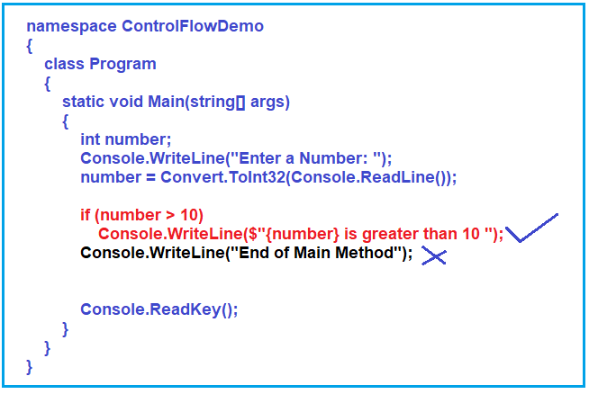

بنابراین، وقتی برنامه‌ی بالا را اجرا می‌کنید، صرف نظر از شرط، عبارت مشکی همیشه اجرا می‌شود زیرا بخشی از بلوک if نیست. عبارت قرمز فقط زمانی اجرا می‌شود که شرط if درست باشد. برای درک بهتر، لطفاً به تصویر زیر نگاهی بیندازید.

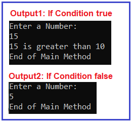

**نکته:** نکته‌ای که باید در نظر داشته باشید این است که اگر یک دستور برای بلوک if دارید، می‌توانید آن دستور را یا با استفاده از آکولاد یا بدون استفاده از آکولاد نمایش دهید. اما اگر بیش از یک دستور در بلوک if دارید، استفاده از آکولاد الزامی است. من دوست دارم در برنامه‌نویسی‌ام از آکولاد استفاده کنم، حتی اگر شرط if شامل یک دستور باشد. آکولاد به صراحت مشخص می‌کند که بلوک if از کجا شروع شده و در کجا پایان یافته است.

##### **دستورات if else در زبان سی شارپ:**

بلوک If-Else در زبان سی شارپ برای ارائه برخی اطلاعات اختیاری در صورت نادرست بودن شرط داده شده در بلوک if استفاده می‌شود. این بدان معناست که اگر شرط درست باشد، دستورات بلوک if اجرا می‌شوند و اگر شرط نادرست باشد، دستورات بلوک else اجرا می‌شوند.

بنابراین، به عبارت ساده، می‌توان گفت که اگر بخواهیم برخی دستورات را در صورت درست بودن شرط اجرا کنیم و همچنین بخواهیم برخی دستورات دیگر را در صورت نادرست بودن شرط اجرا کنیم، در این صورت، باید از دستورات شرطی IF-ELSE در C# استفاده کنیم. در زیر سینتکس استفاده از بلوک IF ELSE در زبان C# آمده است.

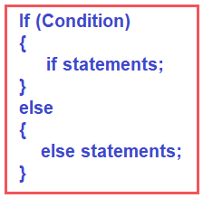

**نکته:** نکته‌ای که باید به خاطر داشته باشید این است که فقط یک بلوک از دستورات، یعنی بلوک if یا بلوک else، در یک زمان اجرا می‌شود. بنابراین، اگر شرط TRUE باشد، دستورات بلوک if اجرا می‌شوند و اگر شرط FALSE باشد، دستورات بلوک else اجرا می‌شوند.

##### **آیا استفاده از بلوک else اجباری است؟**

خیر، استفاده از بلوک else اجباری نیست. این یک بلوک اختیاری است. شما فقط می‌توانید از بلوک if نیز استفاده کنید. اگر می‌خواهید در صورت عدم موفقیت شرط، اطلاعاتی ارائه دهید، باید از این بلوک else اختیاری استفاده کنید.

##### **نمودار جریان بلوک If-Else:**

نمودار جریان بلوک if-else تقریباً مشابه بلوک if است. در این حالت، وقتی شرط درست باشد، دستورات بلوک if اجرا می‌شوند و وقتی شرط نادرست باشد، دستورات بلوک else اجرا می‌شوند. برای درک بهتر، لطفاً به تصویر زیر که نمودار جریان بلوک if-else را نشان می‌دهد، نگاهی بیندازید.

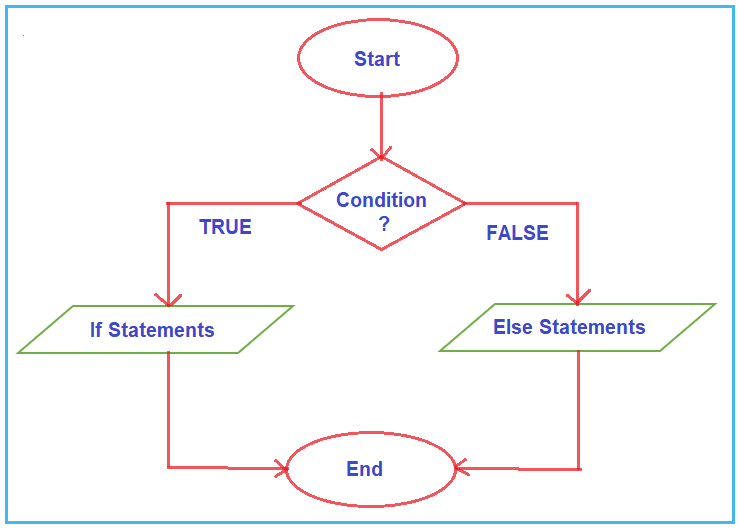

**نکته:** در زبان برنامه‌نویسی سی‌شارپ، **if** و **else** کلمات رزرو شده هستند. این بدان معناست که شما نمی‌توانید از این دو کلمه کلیدی برای نامگذاری هیچ متغیر، ویژگی، کلاس، متد و غیره استفاده کنید. عبارات یا شرایط مشخص شده در بلوک if می‌توانند یک عبارت یا شرط رابطه‌ای یا بولی باشند که به TRUE یا FALSE ارزیابی می‌شوند. حال بیایید چند مثال برای درک دستورات شرطی if-else ببینیم.

##### **مثال برای درک دستور IF-ELSE در سی شارپ:**

بیایید برنامه‌ای بنویسیم که با استفاده از دستورات if-else در زبان سی شارپ، زوج یا فرد بودن یک عدد را بررسی کند. در اینجا عدد ورودی را از کاربر دریافت می‌کنیم و سپس با استفاده از دستور if-else در زبان سی شارپ، زوج یا فرد بودن آن عدد را بررسی می‌کنیم. برنامه زیر دقیقاً همین کار را انجام می‌دهد.

```csharp
using System;

namespace ControlFlowDemo
{
    class Program
    {
        static void Main(string[] args)
        {
            Console.WriteLine("Enter a Number: ");
            int number = Convert.ToInt32(Console.ReadLine());
            if (number % 2 == 0)
            {
                Console.WriteLine($"{number} is an Even Number");
            }
            else
            {
                Console.WriteLine($"{number} is an Odd Number");
            }

            Console.ReadKey();
        }
    }
}
```

در برنامه بالا، درون متد main، یک متغیر عدد صحیح یعنی number تعریف می‌کنیم و سپس ورودی را از کاربر می‌خوانیم و مقدار را در متغیر number ذخیره می‌کنیم. پس از خواندن ورودی، بررسی می‌کنیم که آیا عدد داده شده زوج است یا فرد. عدد زوج، عددی است که بر ۲ بخش‌پذیر است. اگر عدد % 2 برابر با ۰ باشد، شرط if درست است و در این صورت، پیامی مبنی بر زوج بودن عدد و اگر شرط نادرست باشد، پیامی مبنی بر فرد بودن عدد چاپ می‌کنیم.

**برای مثال،**

اگر عدد ۱۶ را به عنوان ورودی بگیریم، ۱۶%۲ == ۰ به این معنی است که شرط درست است، سپس دستور بلوک if اجرا می‌شود. و خروجی این خواهد بود که ۱۶ یک عدد زوج است.

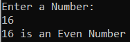

اگر عدد ۱۳ را به عنوان ورودی بگیریم، ۱۳%۲ == ۰ به این معنی است که شرط نادرست است، سپس دستورات بلوک else اجرا می‌شوند. و خروجی این خواهد بود که ۱۳ یک عدد فرد است.

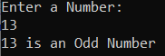

##### **بلوک‌های If و Else بدون آکولاد در زبان برنامه‌نویسی سی‌شارپ**

در اعلان بلوک if یا بلوک else if، از آکولاد {} برای مشخص کردن دستورات استفاده نکنیم، در این صورت فقط اولین دستور به عنوان بلوک if یا بلوک else در نظر گرفته می‌شود. اجازه دهید این موضوع را با یک مثال درک کنیم. لطفاً به کد زیر نگاهی بیندازید.

```csharp
using System;

namespace ControlFlowDemo
{
    class Program
    {
        static void Main(string[] args)
        {
            int number = 10;
            if (number == 10)
                Console.WriteLine("Hi"); //This Statement belongs to IF Block
            else
                Console.WriteLine("Hello"); //This Statement belongs to ELSE Block
            Console.WriteLine("Bye");

            Console.ReadKey();
        }
    }
}
```

همانطور که می‌بینید، در مثال بالا، هنگام ایجاد بلوک‌های if و else، آکولاد را مشخص نکرده‌ایم. بنابراین، در این حالت، اولین دستور `Console.WriteLine` که پیام Hi را چاپ می‌کند، به بلوک if تعلق خواهد داشت. بعد از دستور else، دو دستور `Console.WriteLine` داریم. در اینجا، دستور `Console.WriteLine` بعدی که پیام Hello را چاپ می‌کند، فقط به بلوک else تعلق دارد. دستور `Console.WriteLine` که پیام bye را چاپ می‌کند، به بلوک else تعلق ندارد. حال، اگر برنامه فوق را اجرا کنید، خروجی زیر را دریافت خواهید کرد.

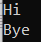

حال، اگر عبارت Hello را درون بلوک if جایگزین کنیم، با خطای ERROR مواجه خواهیم شد. دلیل این امر این است که بیش از یک عبارت بدون آکولاد اجرا نمی‌شود. یک عبارت درون بلوک if اجرا خواهد شد. برای درک بهتر، لطفاً به مثال زیر نگاهی بیندازید.

```csharp
using System;

namespace ControlFlowDemo
{
    class Program
    {
        static void Main(string[] args)
        {
            int number = 10;
            if (number == 10)
                Console.WriteLine("Hi");
                Console.WriteLine("Hello"); // This line is NOT part of if block
            else // Error: else without previous if
                Console.WriteLine("Bye");

            Console.ReadKey();
        }
    }
}
```

اگر بخواهیم بیش از یک دستور را اجرا کنیم، باید از آکولاد استفاده کنیم و تمام دستورات داخل آکولاد قرار می‌گیرند. کد زیر به خوبی کار می‌کند. در اینجا، ما از آکولاد در بلوک if استفاده کرده‌ایم.

```csharp
using System;

namespace ControlFlowDemo
{
    class Program
    {
        static void Main(string[] args)
        {
            int number = 10;
            if (number == 10)
            {
                Console.WriteLine("Hi");
                Console.WriteLine("Hello");
            }
            else
                Console.WriteLine("Bye");

            Console.ReadKey();
        }
    }
}
```

**نکته:** برای هر عبارت شرطی if، بلوک else اختیاری است. اما برای هر بلوک else، بلوک if اجباری است. هدف از **عبارت 'if'** در یک برنامه، ایجاد مسیرهای اجرایی متعدد برای ورودی‌های مختلف کاربر و تعاملی‌تر کردن آن است!

##### **دستورات If-Else تو در تو در زبان سی شارپ:**

وقتی یک دستور if-else درون بدنه یک if یا else دیگر قرار می‌گیرد، به آن if-else تو در تو گفته می‌شود. دستورات IF-ELSE تو در تو زمانی استفاده می‌شوند که می‌خواهیم یک شرط را فقط در صورتی بررسی کنیم که شرط وابسته قبلی درست یا نادرست باشد.

##### **بلوک اگر تو در تو چیست؟**

بلوک if تو در تو به معنی تعریف بلوک if درون بلوک if دیگر است. همچنین می‌توانیم بلوک if را درون بلوک‌های else تعریف کنیم. بسته به الزامات منطقی، می‌توانیم از بلوک if تو در تو یا درون بلوک if یا درون else استفاده کنیم. لطفاً به تصویر زیر که روش‌های مختلف استفاده از بلوک if تو در تو در زبان C# را نشان می‌دهد، نگاهی بیندازید.

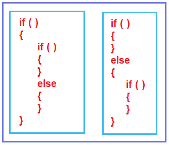

حالا، یک مثال می‌زنیم و سعی می‌کنیم نمودار جریان را درک کنیم. ما از سینتکس زیر استفاده می‌کنیم. در اینجا، یک بلوک if-else درون بلوک if و همچنین یک بلوک if-else درون بلوک else داریم.

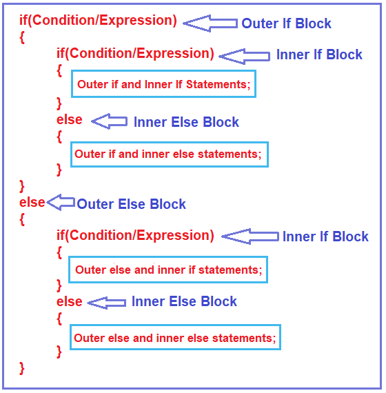

بیایید کد بالا را بفهمیم.

1. **شرط ۱:** ابتدا، شرط if اول یعنی شرط if بیرونی را بررسی می‌کند و اگر درست باشد، بلوک else بیرونی خاتمه می‌یابد. بنابراین، کنترل به داخل بلوک if اول یا بیرونی منتقل می‌شود. سپس دوباره شرط if درونی را بررسی می‌کند و اگر شرط if درونی درست باشد، بلوک else درونی خاتمه می‌یابد. بنابراین، در این حالت، دستورات بلوک if بیرونی و if درونی اجرا می‌شوند.
2. **شرط ۲:** حال، اگر شرط بیرونی if درست باشد، اما شرط درونی if نادرست باشد، بلوک درونی if خاتمه می‌یابد. بنابراین، در این حالت، دستورات بلوک بیرونی if و درونی else اجرا می‌شوند.
3. **شرط ۳:** حال، اگر شرط if بیرونی نادرست باشد، بلوک if بیرونی خاتمه می‌یابد و کنترل به بلوک else بیرونی منتقل می‌شود. و در داخل بلوک else بیرونی، دوباره شرط if درونی بررسی می‌شود و اگر شرط if درونی درست باشد، بلوک else درونی خاتمه می‌یابد. بنابراین، در این حالت، دستورات بلوک else بیرونی و if درونی اجرا می‌شوند.
4. **شرط ۴:** حال، اگر شرط بیرونی if نادرست باشد و همچنین شرط if درون بلوک‌های بیرونی else نیز ناموفق باشد، بلوک if خاتمه می‌یابد. و در این حالت، دستورات بلوک بیرونی else و درونی else اجرا می‌شوند. اینگونه است که دستورات در nested if اجرا می‌شوند. اکنون نمودار جریان بلوک‌های nested if را خواهیم دید.

##### **نمودار جریان بلوک‌های If – Else تو در تو در زبان سی شارپ:**

لطفاً به نمودار زیر که نمودار جریان دستور if-else تو در تو را نشان می‌دهد، نگاهی بیندازید.

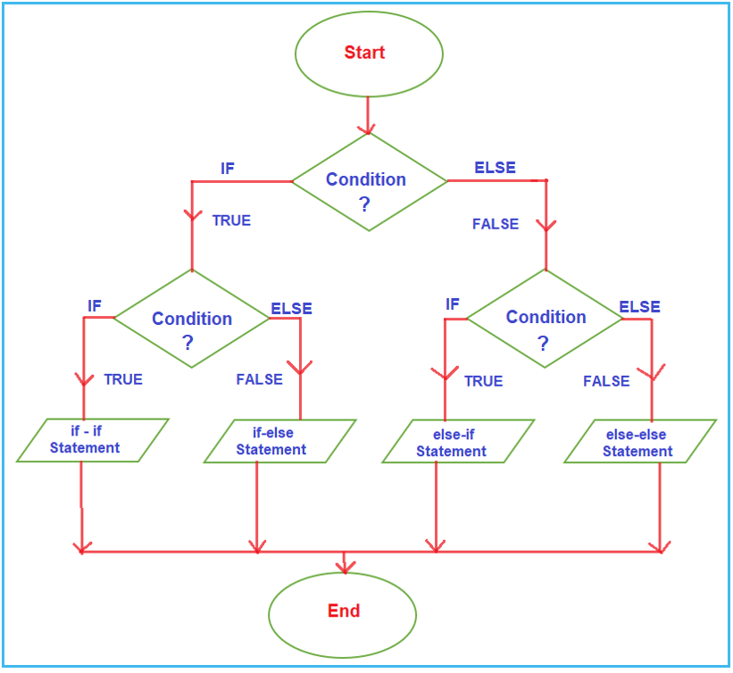

ابتدا، شرط if بیرونی را بررسی می‌کند و اگر شرط if بیرونی درست باشد، کنترل به داخل می‌آید و شرط if درونی را بررسی می‌کند و اگر شرط if درونی درست باشد، دستورات بلوک if بیرونی و دستورات بلوک if درونی اجرا می‌شوند. و پس از اجرا، به پایان می‌رسد.

فرض کنید، شرط if بیرونی درست باشد اما شرط if درونی ناموفق باشد، آنگاه دستورات بلوک if بیرونی و دستورات بلوک else درونی اجرا می‌شوند. و هنگامی که دستور اجرا شد، به پایان می‌رسد.

فرض کنید، شرط if بیرونی ناموفق باشد، آنگاه کنترل مستقیماً به بلوک else می‌رود و شرط if درونی را بررسی می‌کند. و دوباره، برای شرط if درونی دو گزینه وجود دارد. اگر شرط if درونی درست باشد، بلوک else بیرونی و دستور بلوک if درونی اجرا می‌شود، و اگر شرط if درونی نادرست باشد، دستورات بلوک else بیرونی و بلوک else درونی اجرا می‌شود و سپس به پایان می‌رسد.

##### **مثالی برای درک دستورات IF-ELSE تو در تو در زبان سی شارپ:**

در مثال زیر، ما با استفاده از عبارات IF-ELSE تو در تو، بزرگترین عدد بین سه عدد را پیدا می‌کنیم.

```csharp
using System;

namespace ControlFlowDemo
{
    class Program
    {
        static void Main(string[] args)
        {
            int a = 15, b = 25, c = 10;
            int LargestNumber = 0;

            if (a > b)
            {
                Console.WriteLine($"Outer IF Block");
                if (a > c)
                {
                    Console.WriteLine($"Outer IF - Inner IF Block");
                    LargestNumber = a;
                }
                else
                {
                    Console.WriteLine($"Outer IF - Inner ELSE Block");
                    LargestNumber = c;
                }
            }
            else
            {
                Console.WriteLine($"Outer ELSE Block");
                if (b > c)
                {
                    Console.WriteLine($"Outer ELSE - Inner IF Block");
                    LargestNumber = b;
                }
                else
                {
                    Console.WriteLine($"Outer ELSE - Inner ELSE Block");
                    LargestNumber = c;
                }
            }

            Console.WriteLine($"The Largest Number is: {LargestNumber}");

            Console.ReadKey();
        }
    }
}
```

###### **خروجی:**

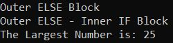

همانطور که در مقاله قبلی خود بحث کردیم، گاهی اوقات می‌توان دستور if-else را به یک شرط سه‌تایی تبدیل کرد. بیایید مثال بالا را با استفاده از عملگر سه‌تایی بازنویسی کنیم تا بزرگترین عدد بین سه عدد را پیدا کنیم.

```csharp
using System;

namespace ControlFlowDemo
{
    class Program
    {
        static void Main(string[] args)
        {
            int a = 15, b = 25, c = 10;
            int LargestNumber = 0;

            Console.WriteLine($"a={a}, b={b}, c={c}");
            LargestNumber = (a > b) ? ((a > c) ? (a) : (c)) : ((b > c) ? (b) : (c));

            Console.WriteLine($"The Largest Number is: {LargestNumber}");

            Console.ReadKey();
        }
    }
}
```

###### **خروجی:**

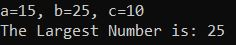

##### **دستورات نردبانی if-else در زبان سی شارپ:**

در دستورات نردبانی if-else، یکی از دستورات بسته به درستی یا نادرستی شرط‌ها اجرا می‌شود. اگر شرط ۱ درست باشد، دستور ۱ اجرا می‌شود و اگر شرط ۲ درست باشد، دستور ۲ اجرا می‌شود و به همین ترتیب ادامه می‌یابد. اما اگر همه شرط‌ها نادرست باشند، آخرین دستور یعنی دستور بلوک else اجرا می‌شود. دستورات if-else در سی شارپ از بالا به پایین اجرا می‌شوند. به محض اینکه یکی از شرط‌های کنترل کننده if درست باشد، دستور مرتبط با آن بلوک if اجرا می‌شود و بقیه مراحل نردبان else-if در سی شارپ نادیده گرفته می‌شود. اگر هیچ یک از شرط‌ها درست نباشند، دستور else آخر اجرا می‌شود.

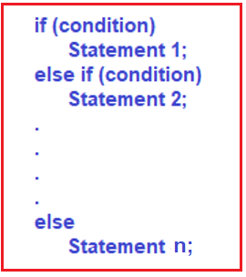

##### **مثالی برای درک دستورات نردبانی If-Else در زبان سی شارپ:**

```csharp
using System;

namespace ControlFlowDemo
{
    class Program
    {
        static void Main(string[] args)
        {
            int i = 20;
            if (i == 10)
            {
                Console.WriteLine("i is 10");
            }
            else if (i == 15)
            {
                Console.WriteLine("i is 15");
            }
            else if (i == 20)
            {
                Console.WriteLine("i is 20");
            }
            else
            {
                Console.WriteLine("i is not present");
            }

            Console.ReadKey();
        }
    }
}
```

**خروجی: i برابر با ۲۰ است**