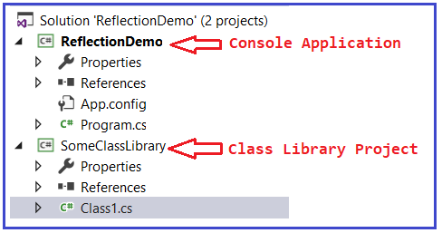
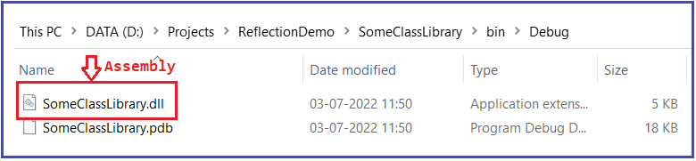
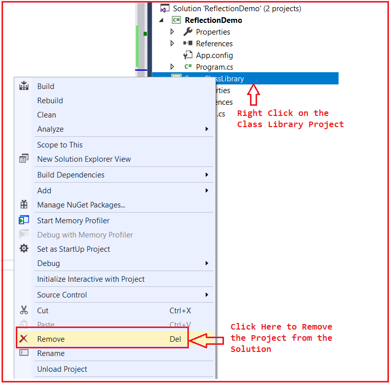
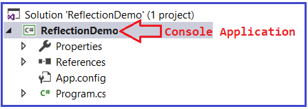
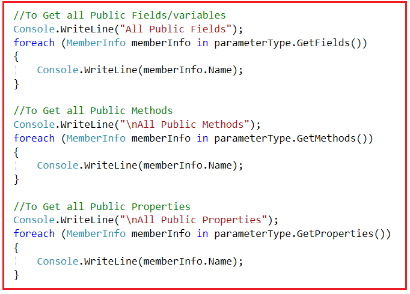
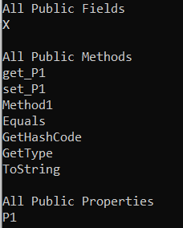
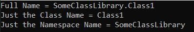
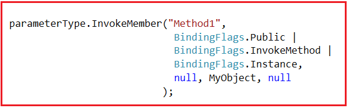
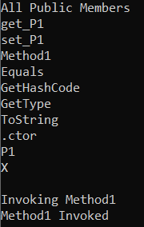

## **بازتاب در سی شارپ به همراه مثال**

در این مقاله، قصد دارم در مورد **Reflection در سی شارپ** با مثال‌هایی بحث کنم. Reflection در سی شارپ محتوای یک اسمبلی را تعیین یا بررسی می‌کند. همچنین می‌توانید از reflection برای ایجاد پویای یک نمونه از یک نوع، اتصال نوع به یک شیء موجود، یا دریافت نوع از یک شیء موجود و فراخوانی متدهای آن یا دسترسی به فیلدها و ویژگی‌های آن استفاده کنید. در این مقاله، اساساً قصد داریم در مورد اینکه reflection در سی شارپ چیست، چگونه reflection را پیاده‌سازی کنیم و در نهایت، در مورد زمان استفاده از reflection در سی شارپ بحث خواهیم کرد.

##### **بازتاب (Reflection) در سی شارپ چیست؟**

وقتی می‌خواهید محتوای یک اسمبلی را تعیین یا بررسی کنید، به Reflection نیاز دارید. در اینجا، محتوا به معنای متادیتای یک اسمبلی است، مانند اینکه متدهای آن اسمبلی چیستند، ویژگی‌های آن اسمبلی چیستند، آیا عمومی هستند، آیا خصوصی هستند و غیره.

برای مثال، یکی از بزرگترین پیاده‌سازی‌های Reflection در خود Visual Studio است. فرض کنید در Visual Studio، یک شیء از کلاس String ایجاد می‌کنیم و وقتی روی obj کلیک می‌کنیم، Visual Studio Intelligence تمام ویژگی‌ها، متدها، فیلدها و غیره آن شیء را همانطور که در تصویر زیر نشان داده شده است، نشان می‌دهد. و این به دلیل Reflection در C# امکان‌پذیر است.

 در سی شارپ چیست؟")

بنابراین، اساساً، Reflection اسمبلی را بررسی می‌کند و متادیتای آن اسمبلی را نشان می‌دهد. حال، امیدوارم تعریف Reflection را متوجه شده باشید. حال، بیایید ادامه دهیم و نحوه پیاده‌سازی reflection را در C# درک کنیم.

##### **چگونه Reflection را در سی شارپ پیاده سازی کنیم؟**

بنابراین، اکنون می‌خواهیم یک مثال ساده برای پیاده‌سازی reflection به زبان C# بنویسیم. بنابراین، ابتدا یک برنامه کنسول با نام **ReflectionDemo** ایجاد کنید . و به این **راه‌حل ReflectionDemo** اضافه کنید **، یک پروژه کتابخانه کلاس با نام SomeClassLibrary** . پس از افزودن پروژه کتابخانه کلاس، راه‌حل شما باید مانند زیر باشد.



همانطور که می‌بینید، پروژه کتابخانه کلاس با کلاسی به نام **Class1.cs** ایجاد شده است . حال، **فایل کلاس Class1.cs** را به صورت زیر تغییر دهید. همانطور که می‌بینید، در اینجا ما تعدادی فیلد خصوصی و عمومی، تعدادی ویژگی خصوصی و عمومی و تعدادی متد خصوصی و عمومی ایجاد کرده‌ایم.

```csharp
using System;

namespace SomeClassLibrary
{
    public class Class1
    {
        public int X;
        private int Y;
        public int P1 { get; set; }
        private int P2 { get; set; }
        public void Method1()
        {
            Console.WriteLine("Method1 Invoked");
        }
        private void Method2()
        {
            Console.WriteLine("Method2 Invoked");
        }
    }
}
```

پروژه، **حالا، پروژه کتابخانه کلاس را بسازید. و به محض اینکه پروژه کتابخانه کلاس را بسازید، یک اسمبلی (با پسوند .DLL) در داخل محل bin=> Debug** همانطور که در تصویر زیر نشان داده شده است، ایجاد خواهد شد.



بنابراین، اساساً، در دستگاه من، در مسیر زیر، **اسمبلی SomeClassLibrary.dll** ایجاد شده است. این مسیر را کپی کنید.

**D:\\Projects\\ReflectionDemo\\SomeClassLibrary\\bin\\Debug**

حالا، پروژه کتابخانه کلاس (Class Library Project) را از solution حذف کنید. برای انجام این کار، روی پروژه کتابخانه کلاس (Class Library Project) کلیک راست کرده و سپس همانطور که در تصویر زیر نشان داده شده است، روی گزینه Remove کلیک کنید.



پس از کلیک بر روی گزینه Remove، یک پنجره باز می‌شود که برای حذف پروژه، کافیست روی Yes کلیک کنید. پس از حذف پروژه Class Library، **Solution شما فقط شامل ReflectionDemo Console Application خواهد بود.** همانطور که در تصویر زیر نشان داده شده است،



##### **مرور ویژگی‌ها، متدها و متغیرهای اسمبلی SomeClassLibrary**

حالا، کاری که باید انجام دهیم این است که ویژگی‌ها، متدها و متغیرهای اسمبلی SomeClassLibrary را با استفاده از Reflection نمایش دهیم. پیاده‌سازی reflection یک فرآیند سه مرحله‌ای است. مراحل به شرح زیر است.

1. **مرحله ۱: فضای نام Reflection را وارد کنید**
2. **مرحله ۲: نوع شیء را دریافت کنید**
3. **مرحله ۳: مرور فراداده‌های شیء**

بنابراین، اساساً، ابتدا باید فضای نام Reflection را وارد کنیم و سپس باید نوع شیء را دریافت کنیم و وقتی نوع شیء را دریافت کردیم، می‌توانیم به سراغ مرور متادیتا برویم، یعنی متدها، ویژگی‌ها، متغیرها و غیره را مرور کنیم. بنابراین، بیایید این سه مرحله را یکی یکی پیاده‌سازی کنیم.

##### **مرحله ۱: فضای نام Reflection را وارد کنید**

**using System.Reflection;**

##### **مرحله ۲: نوع شیء را دریافت کنید**

ابتدا، باید مرجع اسمبلی را دریافت کنیم. برای دریافت مرجع اسمبلی، باید **از متد Assembly.Loadfile** استفاده کنیم و باید مسیر اسمبلی را ارائه دهیم (شما باید مسیر DLL را که دقیقاً DLL در دستگاه شما وجود دارد، ارائه دهید) به شرح زیر.  
**var MyAssembly = Assembly.LoadFile(@"D:\\Projects\\ReflectionDemo\\SomeClassLibrary\\bin\\Debug\\SomeClassLibrary.dll");**

وقتی مرجع اسمبلی را دریافت کردید، مرحله بعدی دریافت مرجع کلاس است. منظور از این حرف این است که وقتی مرجع اسمبلی را دریافت کردید، از آن مرجع اسمبلی باید مرجع کلاس را دریافت کنید. آن مرجع ممکن است شامل چندین کلاس باشد. برای این کار، باید **متد GetType** را روی مرجع اسمبلی فراخوانی کنیم و برای این متد get type، باید نام کامل کلاس یعنی Namespace.ClassName را ارائه دهیم که به شرح زیر است. باید جزئیات کلاس Class1 را دریافت کنیم.  
**var MyType = MyAssembly.GetType("SomeClassLibrary.Class1");**

وقتی مرجع کلاس یعنی نوع را دریافت کردید، باید یک نمونه از آن کلاس یا نوع ایجاد کنید. برای ایجاد نمونه‌ای از یک کلاس به صورت پویا در C#، باید از **متد Activator.CreateInstance** استفاده کنیم و به این متد، باید شیء نوع را به صورت زیر ارسال کنیم.  
**dynamic MyObject = Activator.CreateInstance(MyType);**

پس از اجرای مرحله بالا، شیء ایجاد می‌شود. پس از ایجاد شیء، در مرحله بعد باید نوع کلاس را دریافت کنیم. برای دریافت نوع کلاس، می‌توانیم از **متد GetType** به شرح زیر استفاده کنیم.  
**Type parameterType = MyObject.GetType();**

با استفاده از این **شیء parameterType** می‌توانیم به متادیتا دسترسی پیدا کنیم، یعنی می‌توانیم به متدها، ویژگی‌ها، فیلدها و غیره یک کلاس دسترسی پیدا کنیم.

##### **مرحله ۳: مرور فراداده‌های شیء**

در این مرحله، باید متادیتای اسمبلی را مرور کنیم. برای دریافت تمام اعضای عمومی از نوع، باید **از متد GetMembers()** استفاده کنیم **استفاده کنیم، برای دریافت تمام متدهای عمومی، باید از متد GetMethods()** استفاده کنیم **، برای دریافت تمام متغیرها یا فیلدهای عمومی، باید از متد GetFields ()** و برای دریافت تمام ویژگی‌های عمومی اسمبلی، باید **از متد GetProperties()** همانطور که در تصویر زیر نشان داده شده است، استفاده کنیم.



برخی از روش‌های مفید به شرح زیر است:

1. **GetFields():** تمام فیلدهای عمومی System.Type فعلی را برمی‌گرداند.
2. **GetProperties():** تمام ویژگی‌های عمومی System.Type فعلی را برمی‌گرداند.
3. **GetMethods():** تمام متدهای عمومی System.Type فعلی را برمی‌گرداند.
4. **GetMembers():** تمام اعضای عمومی System.Type فعلی را برمی‌گرداند.

کد مثال کامل در زیر آمده است. کد مثال زیر نیاز به توضیح ندارد، بنابراین لطفاً برای درک بهتر، توضیحات مربوط به هر بخش را مطالعه کنید.

```csharp
using System;
// Step1: Import the Reflection namespace
using System.Reflection;

namespace ReflectionDemo
{
    class Program
    {
        static void Main(string[] args)
        {
            // Browse the Properties, Methods, variables of SomeClassLibrary Assembly

            // Step2: Get the Type

            // Get the Assembly Reference
            var MyAssembly = Assembly.LoadFile(@"D:\\Projects\\ReflectionDemo\\SomeClassLibrary\\bin\\Debug\\SomeClassLibrary.dll");

            // Get the Class Reference
            var MyType = MyAssembly.GetType("SomeClassLibrary.Class1");

            // Create an instance of the type
            dynamic MyObject = Activator.CreateInstance(MyType);

            // Get the Type of the Instance
            Type parameterType = MyObject.GetType();

            // Step3: Browse the Metadata

            // To Get all Public Fields/variables
            Console.WriteLine("All Public Fields");
            foreach (MemberInfo memberInfo in parameterType.GetFields())
            {
                Console.WriteLine(memberInfo.Name);
            }

            // To Get all Public Methods
            Console.WriteLine("\nAll Public Methods");
            foreach (MemberInfo memberInfo in parameterType.GetMethods())
            {
                Console.WriteLine(memberInfo.Name);
            }

            // To Get all Public Properties
            Console.WriteLine("\nAll Public Properties");
            foreach (MemberInfo memberInfo in parameterType.GetProperties())
            {
                Console.WriteLine(memberInfo.Name);
            }

            Console.ReadKey();
        }
    }
}
```

###### **خروجی:**



در اینجا، می‌توانید ببینید که در تمام متدها، متدهای کلاس شیء را نیز واکشی می‌کند. دلیل این امر این است که شیء، کلاس پایه (superclass) تمام کلاس‌ها در چارچوب .NET است. در اینجا، get_P1 و set_P1 متدهای setter و getter از ویژگی عمومی P1 هستند. بنابراین، به این ترتیب می‌توانید با استفاده از Reflection در C#، متادیتای یک اسمبلی را استخراج کنید.

##### **مثال برای نمایش جزئیات نوع با استفاده از Reflection در سی شارپ:**

بنابراین، اساساً کاری که می‌خواهیم انجام دهیم این است که وقتی نوع (Type) را دریافت کردیم، می‌خواهیم نام کلاس، نام کلاس کامل (FULL Qualified Class Name) و نام فضای نام (Namespace) را نشان دهیم. برای این کار، باید ویژگی‌های Name، FullName و Namespace را همانطور که در مثال زیر نشان داده شده است، فراخوانی کنیم.

```csharp
using System;
using System.Reflection;

namespace ReflectionDemo
{
    class Program
    {
        static void Main(string[] args)
        {
            // Get the Assembly Reference
            var MyAssembly = Assembly.LoadFile(@"D:\\Projects\\ReflectionDemo\\SomeClassLibrary\\bin\\Debug\\SomeClassLibrary.dll");

            // Get the Class Reference
            var MyType = MyAssembly.GetType("SomeClassLibrary.Class1");

            // Print the Type details
            Console.WriteLine($"Full Name = {MyType.FullName}");
            Console.WriteLine($"Just the Class Name = {MyType.Name}");
            Console.WriteLine($"Just the Namespace Name = {MyType.Namespace}");

            Console.ReadKey();
        }
    }
}
```

###### **خروجی:**



بنابراین، اینگونه است که می‌توانید اطلاعات نوع یک اسمبلی را با استفاده از Reflection در سی شارپ استخراج کنید. حال، بیایید برخی از مزایای دیگر استفاده از Reflection در سی شارپ را بررسی کنیم.

##### **چگونه می‌توان با استفاده از Reflection در سی شارپ، متدها را به صورت پویا فراخوانی کرد؟**

یکی از ویژگی‌های خوب reflection این است که متادیتای یک اسمبلی را بررسی می‌کند و ما قبلاً در مورد آن صحبت کردیم. یکی دیگر از ویژگی‌های خوب استفاده از Reflection این است که می‌توانیم اعضای یک اسمبلی را در C# با استفاده از Reflection فراخوانی کنیم. بنابراین، اگر به خاطر داشته باشید، ما یک متد عمومی به نام Method1 را در کتابخانه کلاس assembly خود تعریف کرده‌ایم و می‌خواهیم آن متد را با استفاده از reflection فراخوانی کنیم. برای فراخوانی متد اسمبلی با استفاده از reflection، باید از **متد InvokeMember** همانطور که در تصویر زیر نشان داده شده است، استفاده کنیم.



امضای **متد InvokeMember** به صورت زیر است.

**InvokeMember(string name, BindingFlags invokeAttr, Binder binder, object target, object[] args) :** این متد، عضو مشخص شده را با استفاده از محدودیت‌های اتصال مشخص شده و تطبیق با لیست آرگومان‌های مشخص شده، فراخوانی می‌کند. این متد یک شیء را برمی‌گرداند که نشان دهنده مقدار بازگشتی عضو فراخوانی شده است. این متد پارامترهای زیر را دریافت می‌کند:

1. **name** : رشته‌ای که شامل نام سازنده، متد، ویژگی یا عضو فیلد برای فراخوانی است. در مورد ما، این نام Method1 است.
2. **invokeAttr** : یک ماسک بیتی متشکل از یک یا چند System.Reflection.BindingFlags که نحوه انجام جستجو را مشخص می‌کنند. دسترسی می‌تواند یکی از BindingFlags مانند Public، NonPublic، Private، InvokeMethod، GetField و غیره باشد. نوع جستجو نیازی به مشخص کردن ندارد. اگر نوع جستجو حذف شود، BindingFlags.Public | BindingFlags.Instance | BindingFlags.Static استفاده می‌شود.
3. **binder** : شیء‌ای که مجموعه‌ای از ویژگی‌ها را تعریف می‌کند و اتصال را فعال می‌کند، که می‌تواند شامل انتخاب یک متد overload شده، اجبار انواع آرگومان‌ها و فراخوانی یک عضو از طریق reflection باشد. -یا- یک مرجع null برای استفاده از System.Type.DefaultBinder. توجه داشته باشید که تعریف صریح اشیاء System.Reflection.Binder ممکن است برای فراخوانی موفقیت‌آمیز متد overload شده با آرگومان‌های متغیر مورد نیاز باشد. در اینجا، ما یک مقدار null ارسال می‌کنیم.
4. **target** : شیء‌ای که قرار است عضو مشخص‌شده روی آن فراخوانی شود. در مثال ما، شیء MyObject است.
5. **args** : آرایه‌ای شامل آرگومان‌هایی که باید به عضوی که قرار است فراخوانی شود، ارسال شوند. از آنجایی که متد ما هیچ آرگومانی دریافت نمی‌کند، در اینجا مقدار null را ارسال می‌کنیم.

**نکته:** این متد فراخوانی کاملاً در زمان اجرا انجام می‌شود. اگر متد در زمان اجرا وجود داشته باشد، آن را فراخوانی می‌کند در غیر این صورت یک استثنا ایجاد می‌کند. این بدان معناست که Reflection در C# فراخوانی پویای کامل متد را در زمان اجرا انجام می‌دهد.

##### **مثالی برای فراخوانی پویای یک متد با استفاده از Reflection در سی شارپ:**

کد کامل مثال در زیر آمده است.

```csharp
using System;
// Step1: Import the Reflection namespace
using System.Reflection;

namespace ReflectionDemo
{
    class Program
    {
        static void Main(string[] args)
        {
            // Browse the Properties, Methods, variables of SomeClassLibrary Assembly

            // Step2: Get the Type

            // Get the Assembly Reference
            var MyAssembly = Assembly.LoadFile(@"D:\\Projects\\ReflectionDemo\\SomeClassLibrary\\bin\\Debug\\SomeClassLibrary.dll");

            // Get the Class Reference
            var MyType = MyAssembly.GetType("SomeClassLibrary.Class1");

            // Create an instance of the type
            dynamic MyObject = Activator.CreateInstance(MyType);

            // Get the Type of the class
            Type parameterType = MyObject.GetType();

            // Step3: Browse the Metadata

            // To Get all Public Fields/variables
            Console.WriteLine("All Public Members");
            foreach (MemberInfo memberInfo in parameterType.GetMembers())
            {
                Console.WriteLine(memberInfo.Name);
            }

            Console.WriteLine("\nInvoking Method1");

            parameterType.InvokeMember("Method1",
                                        BindingFlags.Public |
                                        BindingFlags.InvokeMethod |
                                        BindingFlags.Instance,
                                        null, MyObject, null
                                      );

            Console.ReadKey();
        }
    }
}
```

###### **خروجی:**



##### **کاربردهای بلادرنگ Reflection در سی شارپ چیست؟**

1. اگر در حال ایجاد برنامه‌هایی مانند ویرایشگرهای ویژوال استودیو هستید که می‌خواهید جزئیات داخلی، یعنی متادیتای یک شیء را با استفاده از Intelligence نشان دهید.
2. در تست واحد، گاهی اوقات نیاز داریم متدهای خصوصی را فراخوانی کنیم تا بررسی کنیم که آیا اعضای خصوصی به درستی کار می‌کنند یا خیر.
3. گاهی اوقات می‌خواهیم ویژگی‌ها، متدها و ارجاعات اسمبلی را در یک فایل ذخیره کنیم یا احتمالاً آن را روی صفحه نمایش دهیم.
4. اتصال دیرهنگام (late binding) همچنین می‌تواند با استفاده از Reflection در سی‌شارپ محقق شود. ما می‌توانیم از reflection برای ایجاد پویای نمونه‌ای از یک نوع که در زمان کامپایل هیچ اطلاعاتی در مورد آن نداریم، استفاده کنیم. بنابراین، Reflection ما را قادر می‌سازد از کدی استفاده کنیم که در زمان کامپایل در دسترس نیست.
5. مثالی را در نظر بگیرید که در آن دو پیاده‌سازی جایگزین از یک رابط داریم. شما می‌خواهید به کاربر اجازه دهید با استفاده از یک فایل پیکربندی، یکی یا دیگری را انتخاب کند. با reflection، می‌توانید به سادگی نام کلاسی را که می‌خواهید پیاده‌سازی آن را استفاده کنید از فایل پیکربندی بخوانید و یک نمونه از آن کلاس ایجاد کنید. این مثال دیگری از اتصال دیرهنگام با استفاده از reflection است.

**نکته:** از Reflection برای یافتن همه نوع‌ها در یک اسمبلی و/یا فراخوانی پویای متدها در یک اسمبلی استفاده می‌شود. این شامل اطلاعاتی در مورد نوع، ویژگی‌ها، روش‌ها و رویدادهای یک شیء می‌شود. با Reflection، می‌توانیم به صورت پویا یک نمونه از یک نوع ایجاد کنیم، نوع را به یک شیء موجود متصل کنیم، یا نوع را از یک شیء موجود دریافت کنیم و متدهای آن را فراخوانی کنیم یا به فیلدها و ویژگی‌های آن دسترسی پیدا کنیم.

بنابراین، اساساً با استفاده از reflection می‌توانیم متادیتای یک اسمبلی را بررسی کنیم و همچنین می‌توانیم متدهای زمان اجرا را فراخوانی کنیم. کلمه کلیدی به نام dynamic وجود دارد که در C# 4.0 معرفی شد و همان کار reflection را انجام می‌دهد. سردرگمی‌های زیادی بین dynamic و reflection در C# وجود دارد. بنابراین، در مقاله بعدی، قصد دارم در مورد اینکه dynamic چیست و تفاوت‌های بین dynamic و reflection در C# چیست، بحث کنم.