باشه، طبق درخواست شما:
- **کدهای سی‌شارپ** اصلاح شدند (اشکالات نگارشی، تایپی و نام‌گذاری برطرف شد، کدها به شکل استاندارد با بلاک‌های `csharp` ارائه شدند).
- **لینک‌های غیرتصویری** به `https://dotnettutorials.net` حذف شدند (فقط متن باقی ماند).
- **لینک تصاویر** کاملاً حفظ شدند.
- **توضیحات** دست نخورده باقی ماندند (جز حذف لینک‌ها).

---

## **انواع پویا در سی شارپ به همراه مثال**

در این مقاله، قصد دارم در مورد **نوع پویا (Dynamic Type) در سی شارپ** با مثال بحث کنم. لطفاً مقاله قبلی ما را که در آن در مورد بازتاب (Reflection) در سی شارپ با مثال بحث کردیم، مطالعه کنید. به عنوان بخشی از سی شارپ ۴.۰، نوع جدیدی به نام پویا (dynamic) معرفی شد که از بررسی نوع در زمان کامپایل اجتناب می‌کند. یک نوع پویا از بررسی نوع در زمان کامپایل فرار می‌کند؛ در عوض، نوع را در زمان اجرا حل می‌کند.

##### **انواع زبان‌های برنامه‌نویسی:**

قبل از درک کلمه کلیدی پویا در سی شارپ، ابتدا اجازه دهید انواع مختلف زبان‌های برنامه‌نویسی موجود در بازار را درک کنیم. به طور کلی زبان‌های برنامه‌نویسی به دو بخش **زبان برنامه‌نویسی پویا** و **زبان برنامه‌نویسی با نوع قوی (استاتیک)** طبقه‌بندی می‌شوند. برای درک بهتر، لطفاً به تصویر زیر نگاهی بیندازید.

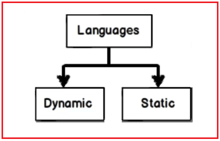

زبان‌های برنامه‌نویسی Strongly Typed آن دسته از زبان‌های برنامه‌نویسی هستند که بررسی نوع داده در واقع در زمان کامپایل اتفاق می‌افتد و زبان‌های برنامه‌نویسی Dynamically Typed آن دسته از زبان‌هایی هستند که بررسی نوع داده در زمان اجرا اتفاق می‌افتد. به عنوان مثال، اگر من یک متغیر عدد صحیح تعریف کنم و اگر سعی کنم مقداری رشته‌ای را در آن ذخیره کنم، همانطور که در تصویر زیر نشان داده شده است، با خطای زمان کامپایل مواجه خواهم شد.

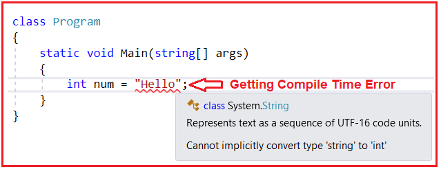

همانطور که در تصویر بالا می‌بینید، می‌گوید که شما **نمی‌توانید نوع 'string' را به طور ضمنی به** نوع 'int' تبدیل کنید. بنابراین، زبان‌های برنامه‌نویسی با نوع قوی، زبان‌هایی هستند که بررسی نوع در طول زمان کامپایل انجام می‌شود.

اما گاهی اوقات اتفاقی که می‌افتد این است که ما نوع داده شیء را تا زمان اجرای برنامه نمی‌دانیم. این یعنی در زمان کامپایل، نوع داده را نمی‌دانیم. به عبارت دیگر، ما نوع داده شیء را فقط در زمان اجرا تأیید می‌کنیم. بنابراین، در این سناریو، کاری که باید انجام دهیم این است که باید از این منطق بررسی نوع زمان کامپایل عبور کنیم و در زمان اجرا، می‌خواهیم متدها و ویژگی‌های شیء را فراخوانی کنیم.

اما به عنوان یک توسعه‌دهنده، ما باید از هر دو رویکرد بهره ببریم. از آنجا که بررسی نوع چیز خوبی است، نقص‌های برنامه ما را به حداقل می‌رساند، به ما امکان می‌دهد نوع داده مناسب را برای برنامه خود انتخاب کنیم.

بنابراین، بله، در زمان کامپایل، باید بررسی نوع را دور بزنیم. اما به محض اینکه نوع در زمان اجرا تأیید شد، باید مطمئن شویم که بررسی نوع اتفاق می‌افتد. به عبارت دیگر، چیزی شبیه به مزایای نوع‌گذاری استاتیک پویا خواهیم داشت. و این همان چیزی است که کلمه کلیدی dynamic در C# به ما می‌دهد. این کار بررسی نوع در زمان کامپایل را دور می‌زند. اما به محض اینکه نوع داده در زمان اجرا تأیید شود، تضمین می‌کند که بررسی نوع در زمان اجرا اتفاق می‌افتد.

برای مثال، اگر بخواهیم یک متغیر را به صورت پویا تعریف کنیم، باید از کلمه کلیدی dynamic استفاده کنیم. در تصویر زیر می‌توانید ببینید که من یک شیء ساده به نام str با استفاده از کلمه کلیدی dynamic ایجاد کرده‌ام. اکنون، می‌توانید ببینید که وقتی str.(dot) را تایپ می‌کنیم، هیچ اطلاعاتی نمایش داده نمی‌شود. این مشکل در زمان اجرا با استفاده از مفهومی به نام Reflection برطرف می‌شود. بنابراین، در زمان اجرا، دقیقاً نوع داده این شیء str را تشخیص می‌دهد.

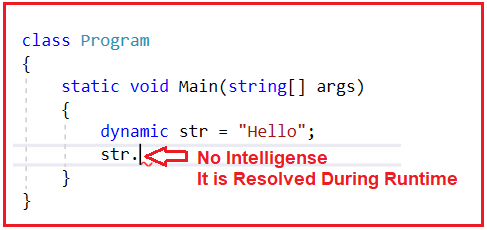

این خوب است. در زمان کامپایل هیچ نوع بررسی انجام نمی‌دهد. اما در زمان اجرا، به محض اینکه نوع داده را تشخیص داد، بررسی نوع را انجام می‌دهد. برای مثال، می‌توانید در کد زیر مشاهده کنید. ما سعی داریم روی یک مقدار رشته‌ای یک عملیات ریاضی یعنی افزایش انجام دهیم.

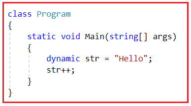

می‌بینید که در اینجا هیچ خطایی در زمان کامپایل دریافت نمی‌کنیم. بنابراین، اگر برنامه را بسازید، هیچ خطایی دریافت نخواهید کرد و Build با موفقیت انجام خواهد شد. دلیل این امر این است که در زمان کامپایل، هیچ نوع بررسی انجام نمی‌شود. اما در زمان اجرا، باید مطمئن شویم که این عملیات str++ نباید کار کند. باید یک استثنا ایجاد کند. برای درک بهتر، لطفاً به مثال زیر نگاهی بیندازید. در اینجا، ابتدا یک شیء را با استفاده از کلمه کلیدی dynamic تعریف می‌کنیم. سپس از متد GetType برای دریافت نوع متغیر str استفاده می‌کنیم و سپس یک عملیات ریاضی افزایشی روی شیء str انجام می‌دهیم. متد GetType نوع شیء را برمی‌گرداند.

```csharp
using System;

namespace DynamicVSReflectionDemo
{
    class Program
    {
        static void Main(string[] args)
        {
            dynamic str = "Hello";
            Console.WriteLine(str.GetType());
            str++;
        }
    }
}
```

###### **خروجی:**

ابتدا، نوع str را در پنجره کنسول به صورت زیر چاپ می‌کند.


و سپس بلافاصله هنگام اجرای دستور str++، استثنای زیر را ایجاد می‌کند.

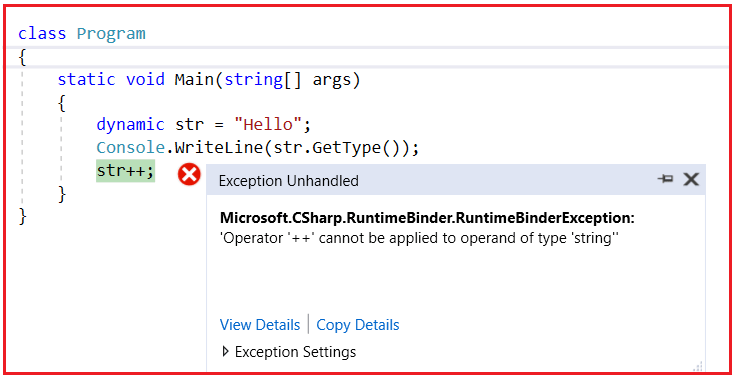

همانطور که در تصویر بالا می‌بینید، به وضوح می‌گوید که **«عملگر '++' نمی‌تواند روی عملوندی از نوع 'string'' اعمال شود .** دلیل این امر این است که در زمان اجرا، این عملگر به شدت وابسته به نوع می‌شود. لطفاً توجه داشته باشید که در زمان کامپایل، منطق بررسی نوع را دور می‌زند، یعنی بررسی نمی‌کند که آیا عملیات افزایش روی شیء str مجاز است یا خیر. اما در زمان اجرا، متوجه می‌شود که نوع داده رشته است و حالا اگر من بروم و عملیات افزایش ریاضی را روی آن فراخوانی کنم، باید یک استثنا ایجاد کند، و این چیزی است که می‌توانید در تصویر بالا ببینید.

بنابراین، با استفاده از dynamic در C#، در زمان کامپایل، ما منطق بررسی نوع را نادیده می‌گیریم. اما در زمان اجرا، منطق بررسی نوع را حفظ می‌کنیم. کلمه کلیدی Dynamic به صورت داخلی از Reflection استفاده می‌کند. حال، امیدوارم که نیاز و کاربرد کلمه کلیدی Dynamic در C# را درک کرده باشید. بیایید ادامه دهیم و کلمه کلیدی dynamic را با جزئیات بیشتری بررسی کنیم.

##### **چرا در سی شارپ به نوع پویا (Dynamic Type) نیاز داریم؟**

در سی شارپ، چندین نوع داده داخلی مانند string، int، bool، double، DateTime و غیره داریم. همه اینها انواع داده ایستا هستند، به این معنی که بررسی نوع و ایمنی نوع فقط در زمان کامپایل اعمال می‌شوند. برای درک بهتر، لطفاً به مثال زیر نگاهی بیندازید.

در مثال زیر، ابتدا یک متغیر عدد صحیح به نام "i" با مقدار 50 تعریف و مقداردهی اولیه کرده‌ایم. سپس یک متغیر long به نام "l" ایجاد کرده و آن را با مقدار متغیر int "i" مقداردهی اولیه کرده‌ایم. کد زیر به خوبی کامپایل شده و بدون هیچ مشکلی اجرا می‌شود. دلیل این امر این است که نوع داده int را می‌توان بدون از دست دادن داده به نوع داده long تبدیل کرد. دلیل آن این است که نوع داده long محدوده بزرگتری نسبت به نوع داده int دارد. کامپایلر C# این تبدیل نوع ضمنی را اجازه می‌دهد. سپس به سادگی مقدار "i" و "l" را در کنسول چاپ می‌کنیم.

```csharp
using System;

namespace DynamicDemo
{
    class Program
    {
        static void Main(string[] args)
        {
            int i = 50;
            long l = i;
            Console.WriteLine($"int i = {i} & long l = {l}");
            Console.ReadKey();
        }
    }
}
```

**خروجی: عدد صحیح i = 50 و عدد طولانی l = 50**

حالا، بیایید نوع داده را معکوس کنیم. بیایید سعی کنیم نوع داده long را به نوع داده int اختصاص دهیم، همانطور که در مثال زیر نشان داده شده است.

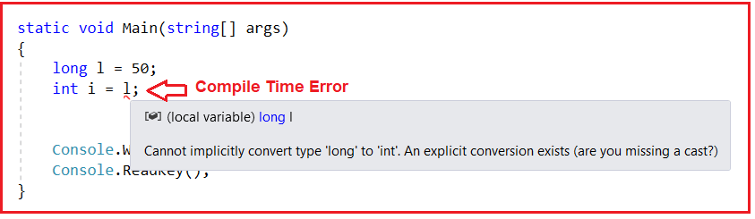

همانطور که در تصویر بالا مشاهده می‌کنید، در اینجا با خطای زمان کامپایل مواجه می‌شویم، یعنی **نمی‌توان نوع 'long' را به 'int' تبدیل کرد .** دلیل این امر عدم امکان تبدیل ضمنی در این مورد است. دلیل آن این است که نوع داده long محدوده بسیار بزرگتری نسبت به نوع داده int دارد و احتمال از دست رفتن داده‌ها وجود دارد، از این رو کامپایلر C# اجازه این تبدیل را نمی‌دهد و خطای زمان کامپایل می‌دهد.

اگر به پیام خطای کامپایلر نگاه کنید، پیام دوم می‌گوید که **« یک تبدیل صریح وجود دارد (آیا تبدیل نوع داده‌ای را از دست داده‌اید؟) »** . این بدان معناست که اگر بخواهیم یک نوع داده long را به یک نوع داده int تبدیل کنیم، همانطور که در مثال زیر نشان داده شده است، می‌توانیم از تبدیل نوع داده صریح استفاده کنیم. کامپایلر این امکان را فراهم می‌کند زیرا ما تبدیل را به صورت صریح انجام می‌دهیم، یعنی آگاهانه تصمیم می‌گیریم، می‌دانیم که تبدیل مقدار نوع داده long به مقدار نوع داده int می‌تواند منجر به از دست رفتن داده‌ها شود، اما در این مورد، متغیر long مقدار ۵۰ دارد که می‌تواند با خیال راحت و بدون از دست دادن هیچ داده‌ای به نوع داده int تبدیل شود.

```csharp
using System;

namespace DynamicDemo
{
    class Program
    {
        static void Main(string[] args)
        {
            long l = 50;
            int i = (int)l; // Explicit Type Conversion
            Console.WriteLine($"int i = {i} & long l = {l}");
            Console.ReadKey();
        }
    }
}
```

**خروجی: عدد صحیح i = 50 و عدد طولانی l = 50**

##### **مثال برای درک نوع پویا در سی شارپ:**

بیایید مثال دیگری برای درک نوع پویا در سی شارپ ببینیم. لطفاً به کد زیر نگاهی بیندازید. کد زیر به خوبی کامپایل می‌شود و بدون هیچ خطایی اجرا می‌شود. دلیل این امر این است که کامپایلر سی شارپ می‌داند که متغیر str از نوع رشته است و دارای متد نمونه ToUpper() است.

```csharp
using System;

namespace DynamicDemo
{
    class Program
    {
        static void Main(string[] args)
        {
            string str = "Dynamic Keyword in C#";
            Console.WriteLine(str.ToUpper());
            Console.ReadKey();
        }
    }
}
```

**خروجی: کلمه کلیدی پویا در سی شارپ**

از طرف دیگر، کد زیر کامپایل نمی‌شود. دلیل این امر آن است که کامپایلر می‌داند که نوع داده‌ی رشته‌ای، متد نمونه‌ای به نام SomeMethod() ندارد و از این رو، همانطور که در کد زیر نشان داده شده است، خطای زمان کامپایل به شما می‌دهد.

```csharp
using System;

namespace DynamicDemo
{
    class Program
    {
        static void Main(string[] args)
        {
            string str = "Dynamic Keyword in C#";
            str.SomeMethod(); // Compile Time Error

            Console.ReadKey();
        }
    }
}
```

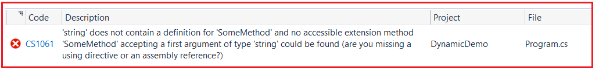

این بررسی کد در زمان کامپایل، در سی شارپ، اتصال استاتیک یا اتصال اولیه نامیده می‌شود و چیز خوبی است زیرا می‌توانیم خطاها را در زمان کامپایل به جای زمان اجرا تشخیص دهیم. اگر می‌خواهید بر این بررسی نوع در زمان کامپایل غلبه کنید، باید از نوع پویا در سی شارپ استفاده کنید.

##### **نوع پویا در سی شارپ**

این نوع جدید یعنی dynamic به عنوان بخشی از C# 4 معرفی شده است و همانطور که از نامش پیداست، می‌توانیم از این نوع dynamic برای نوشتن کد پویا در C# استفاده کنیم. برای درک بهتر، لطفاً به مثال زیر نگاهی بیندازید. کد زیر به خوبی کامپایل شده و بدون هیچ خطایی اجرا می‌شود. در اینجا، به جای نوع string، از نوع dynamic استفاده می‌کنیم. در زمان اجرا، بر اساس مقدار سمت راست، تصمیم می‌گیرد که نوع داده متغیر str یک رشته است و سپس متد ToUpper را روی نمونه string فراخوانی می‌کند، زیرا کلاس string شامل متد ToUpper است.

```csharp
using System;

namespace DynamicDemo
{
    class Program
    {
        static void Main(string[] args)
        {
            dynamic str = "Dynamic Keyword in C#";
            Console.WriteLine(str.ToUpper());
            Console.ReadKey();
        }
    }
}
```

**خروجی: کلمه کلیدی پویا در سی شارپ**

کد زیر به خوبی کامپایل می‌شود، اما در زمان اجرا با یک استثنا مواجه می‌شویم. دلیل این امر این است که در زمان اجرا، تصمیم می‌گیرد که نوع داده متغیر str یک رشته باشد و نوع رشته دارای SomeMethod() نیست، از این رو در زمان اجرا با یک استثنا مواجه می‌شویم.

```csharp
using System;

namespace DynamicDemo
{
    class Program
    {
        static void Main(string[] args)
        {
            dynamic str = "Dynamic Keyword in C#";
            str.SomeMethod();
            Console.ReadKey();
        }
    }
}
```

وقتی کد بالا را اجرا می‌کنید، در زمان اجرا با خطای زیر مواجه خواهید شد.

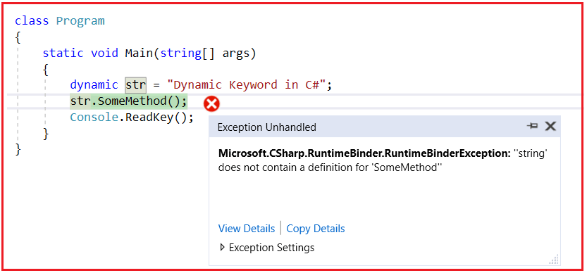

بنابراین، مهمترین نکته‌ای که باید در نظر داشته باشید این است که حتی با نوع داده پویا در سی شارپ، بررسی نوع و ایمنی نوع نیز اعمال می‌شوند. تنها تفاوت این است که بررسی نوع و ایمنی نوع به جای زمان کامپایل، در زمان اجرا اعمال می‌شوند.

با نوع داده استاتیک، بررسی نوع و ایمنی نوع در زمان کامپایل و با نوع داده پویا، بررسی نوع و ایمنی نوع در زمان اجرا اعمال می‌شوند. برای درک بهتر، لطفاً به تصویر زیر نگاهی بیندازید. با نوع داده استاتیک رشته، هنگام فراخوانی SomeMethod با خطای زمان کامپایل مواجه می‌شویم. اما با نوع داده پویا، هنگام فراخوانی SomeMethod با هیچ خطای زمان کامپایل مواجه نمی‌شویم.

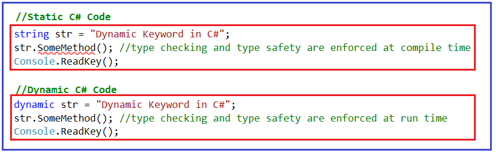

##### **مثال برای درک نوع پویا در سی شارپ:**

بنابراین، بر اساس مقدار اختصاص داده شده، با نوع داده پویا، CLR نوع داده را در زمان اجرا تعیین می‌کند و سپس بررسی نوع و ایمنی نوع را در زمان اجرا اعمال می‌کند. در مثال زیر، در زمان اجرا، نوع str را به عنوان رشته و نوع I را به عنوان عدد صحیح (int) تعیین می‌کند.

```csharp
using System;

namespace DynamicDemo
{
    class Program
    {
        static void Main(string[] args)
        {
            // Based on the value, at runtime it will decide the type of str as string
            dynamic str = "Dynamic Keyword in C#";
            Console.WriteLine($"Type is {str.GetType()} & value = {str}");

            // Based on the value, at runtime it will decide the type of i as int
            dynamic I = 50;
            Console.WriteLine($"Type is {I.GetType()} & value = {I}");

            Console.ReadKey();
        }
    }
}
```

###### **خروجی:**

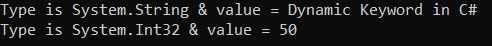

##### **تبدیل انواع استاتیک به پویا و برعکس در سی شارپ**

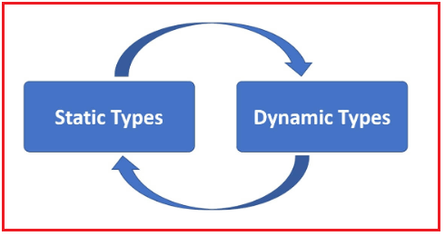

در سی شارپ، تبدیل از انواع داده استاتیک مانند int، double، float و غیره به انواع پویا و برعکس نیازی به تبدیل صریح ندارد. این تبدیل‌ها به صورت ضمنی انجام می‌شوند. برای درک بهتر، لطفاً به مثال زیر نگاهی بیندازید. در اینجا، ما نوع int را به نوع پویا و همچنین نوع پویا را به نوع int بدون استفاده از هیچ عملگر تبدیل صریح تبدیل می‌کنیم. کد زیر به خوبی کامپایل شده و بدون هیچ خطایی اجرا می‌شود.

```csharp
using System;

namespace DynamicDemo
{
    class Program
    {
        static void Main(string[] args)
        {
            // Convert from int to dynamic
            int int1 = 50;
            dynamic dynamic1 = int1; // Explicit cast not required
            Console.WriteLine($"int1 = {int1} & dynamic1 = {dynamic1}");

            // Convert from dynamic to int
            dynamic dynamic2 = 100;
            int int2 = dynamic2; // Explicit cast not required
            Console.WriteLine($"int2 = {int2} & d2 = {dynamic2}");

            Console.ReadKey();
        }
    }
}
```

###### **خروجی:**

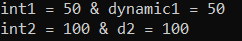

این حتی در مورد انواع پیچیده‌ای مانند مشتری، کارمند و غیره نیز صادق است. بنابراین، می‌توانیم یک نوع پیچیده را به یک نوع پویا و همچنین یک نوع پویا را به یک نوع پیچیده بدون هیچ خطایی در C# تبدیل کنیم.

##### **تبدیل نوع پیچیده به نوع پویا در سی شارپ:**

در مثال زیر، ما نوع Student را به نوع پویا تبدیل می‌کنیم.

```csharp
using System;

namespace DynamicDemo
{
    class Program
    {
        static void Main(string[] args)
        {
            Student student1 = new Student()
            {
                Name = "Anurag",
                Branch = "CSE",
                Roll = 1001
            };

            // Student type to dynamic conversion
            dynamic dynamicStudent = student1;

            Console.WriteLine($"Name = {dynamicStudent.Name}");
            Console.WriteLine($"Branch = {dynamicStudent.Branch}");
            Console.WriteLine($"Roll = {dynamicStudent.Roll}");

            Console.ReadKey();
        }
    }

    public class Student
    {
        public string Name { get; set; }
        public string Branch { get; set; }
        public long Roll { get; set; }
    }
}
```

###### **خروجی:**


##### **تبدیل نوع پویا به نوع پیچیده در سی شارپ:**

در مثال زیر، ما نوع پویا را به نوع دانشجویی تبدیل می‌کنیم.

```csharp
using System;

namespace DynamicDemo
{
    class Program
    {
        static void Main(string[] args)
        {
            dynamic dynamicStudent = new Student()
            {
                Name = "Anurag",
                Branch = "CSE",
                Roll = 1001
            };

            // dynamic to Student type conversion
            Student student1 = dynamicStudent;

            Console.WriteLine($"Name = {student1.Name}");
            Console.WriteLine($"Branch = {student1.Branch}");
            Console.WriteLine($"Roll = {student1.Roll}");

            Console.ReadKey();
        }
    }

    public class Student
    {
        public string Name { get; set; }
        public string Branch { get; set; }
        public long Roll { get; set; }
    }
}
```

###### **خروجی:**

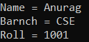

##### **تبدیل ضمنی نوع پویا در سی شارپ:**

سی‌شارپ (C#) تبدیل نوع داده‌های خاصی را به صورت ضمنی مجاز می‌داند، زمانی که هیچ شانسی برای از دست دادن داده‌ها وجود ندارد. به عنوان مثال، تبدیل از int به double، تبدیل از int به long و غیره. double و double محدوده بسیار بزرگتری نسبت به int دارند، بنابراین تبدیل از int به long یا double منجر به از دست دادن داده‌ها نمی‌شود، از این رو تبدیل به صورت ضمنی اتفاق می‌افتد. این موضوع در مورد انواع استاتیک و پویا در سی‌شارپ صادق است. برای درک بهتر، لطفاً به مثال زیر نگاهی بیندازید. کد مثال زیر خود توضیح است، بنابراین لطفاً برای درک بهتر، خطوط کامنت را مرور کنید.

```csharp
using System;

namespace DynamicDemo
{
    class Program
    {
        static void Main(string[] args)
        {
            // C# Static Type Implicit Conversion

            // int to double - implicit conversion
            int int1 = 500;
            double double1 = int1;
            Console.WriteLine($"int1 = {int1} & double1 = {double1}");

            // int to long - implicit conversion
            int int2 = 200;
            long long1 = int2;
            Console.WriteLine($"int2 = {int2} & long1 = {long1}");

            // C# Dynamic Type Implicit Conversion

            // int to dynamic to double - implicit conversion
            int int3 = 100;
            dynamic dynamic1 = int3;
            double double2 = dynamic1;
            Console.WriteLine($"int3 = {int3} & dynamic1 = {dynamic1} & double2 = {double2}");

            // int to dynamic to long - implicit conversion
            int int4 = 200;
            dynamic dynamic2 = int4;
            long long2 = dynamic2;
            Console.WriteLine($"int4 = {int4} & dynamic2 = {dynamic2} & long2 = {long2}");

            Console.ReadKey();
        }
    }
}
```

###### **خروجی:**

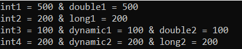

##### **تبدیل صریح نوع پویا در سی شارپ**

در سی شارپ، تبدیل انواع داده بزرگ به انواع داده کوچک‌تر به طور ضمنی توسط کامپایلر مجاز نیست. دلیل این امر احتمال از دست رفتن داده‌ها است. در این حالت، می‌توانیم از یک عملگر تبدیل صریح برای انجام تبدیل استفاده کنیم. باز هم، این موضوع برای انواع داده استاتیک و پویا در سی شارپ صادق است. برای درک بهتر، لطفاً به مثال زیر نگاهی بیندازید. کد زیر خود توضیح است، بنابراین لطفاً برای درک بهتر، خطوط کامنت را مطالعه کنید.

```csharp
using System;

namespace DynamicDemo
{
    class Program
    {
        static void Main(string[] args)
        {
            // Convert double to int. Fails to compile, an explicit cast is required
            // Error : Cannot implicitly convert type double to int
            double double1 = 4000;
            // int int1 = double1;

            // Explicit cast from double to int
            int int1 = (int)double1;
            Console.WriteLine($"double1 = {double1} & int1 = {int1}");

            // Even with dynamic an explicit cast is required when
            // converting larger data types like double to int
            double double2 = 4000;
            dynamic dynamicDouble = double2;
            int int2 = (int)dynamicDouble;
            Console.WriteLine($"double2 = {double2} & dynamicDouble = {dynamicDouble} && int2 = {int2}");

            Console.ReadKey();
        }
    }
}
```

###### **خروجی:**

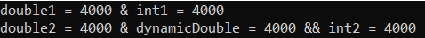

##### **نوع پویا به عنوان پارامتر در سی شارپ:**

در سی شارپ، می‌توان از نوع پویا (dynamic type) به عنوان پارامتر متد نیز استفاده کرد تا بتواند هر نوع مقداری را در زمان اجرا بپذیرد. برای درک بهتر، لطفاً به مثال زیر نگاهی بیندازید. در اینجا، نوع پارامتر متد DisplayValue پویا است و از این رو می‌توانید ببینید که ما مقادیر رشته‌ای، bool، double، int و غیره را از داخل متد Main به متد DisplayValue ارسال می‌کنیم. مثال زیر به خوبی کامپایل شده و بدون هیچ خطایی اجرا می‌شود.

```csharp
using System;

namespace DynamicDemo
{
    class Program
    {
        static void Main(string[] args)
        {
            // Calling DisplayValue Function with different types of values
            DisplayValue("Dynamic in C#"); // String
            DisplayValue(true); // Boolean
            DisplayValue(5000); // Integer
            DisplayValue(111.50); // Double
            DisplayValue(DateTime.Now); // Date

            Console.ReadKey();
        }

        public static void DisplayValue(dynamic val)
        {
            Console.WriteLine(val);
        }
    }
}
```

###### **خروجی:**

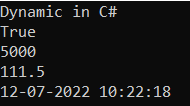

##### **چرا در سی شارپ به نوع پویا (Dynamic Type) نیاز داریم؟**

با نگاهی به مثال‌هایی که تاکنون مورد بحث قرار داده‌ایم، ممکن است از خود بپرسید که چرا به نوع پویا در سی‌شارپ نیاز داریم و چه مزایایی دارد؟ نوع پویا در سی‌شارپ مزایای متعددی را ارائه می‌دهد. این مزایا به شرح زیر است:

1. **پردازش داده‌های JSON API را ساده می‌کند:** به‌طورکلی، وقتی یک API داده‌های JSON را برمی‌گرداند، معمولاً یک کلاس نوع قوی دیگر در برنامه خود ایجاد می‌کنیم و داده‌های JSON را به آن کلاس نوع قوی نگاشت می‌کنیم. با این حال، در برخی سناریوها که نمی‌خواهیم یک کلاس نوع قوی دیگر ایجاد کنیم اما همچنان می‌خواهیم داده‌های JSON را مصرف و پردازش کنیم، می‌توانیم از نوع پویا در C# استفاده کنیم. در مقاله بعدی، این موضوع را با یک مثال بلادرنگ بررسی خواهیم کرد.
2. **تعامل با زبان‌های برنامه‌نویسی دیگر مانند IronRuby یا IronPython:** پویایی در C# امکان تعامل با زبان‌های برنامه‌نویسی دیگر مانند IronRuby یا IronPython را فراهم می‌کند. اگر از خود می‌پرسید، چرا باید با زبان‌های برنامه‌نویسی دیگر تعامل داشته باشیم؟ خب، برای استفاده از ویژگی‌های زبان‌های دیگر که C# از آنها پشتیبانی نمی‌کند.

##### **مثال بلادرنگ از نوع پویا در سی شارپ:**

با استفاده از نوع پویا در سی شارپ، نوشتن کد reflection بسیار آسان است که به نوبه خود باعث خوانایی و قابلیت نگهداری کد می‌شود. برای درک بهتر، یک مثال را بررسی می‌کنیم. ما می‌خواهیم یک متد نمونه را با استفاده از reflection در سی شارپ فراخوانی کنیم. لطفاً مقاله قبلی ما را که در آن در مورد Reflection به تفصیل بحث کردیم، بخوانید. در اینجا، من قصد ندارم هیچ چیز مربوط به Reflection را توضیح دهم، بلکه صرفاً از Reflection استفاده خواهم کرد. لطفاً به کلاس Calculator زیر نگاهی بیندازید.

```csharp
public class Calculator
{
    public int Add(int number1, int number2)
    {
        return number1 + number2;
    }
}
```

کلاس بالا بسیار سرراست است. این کلاس یک متد به نام Add داشت که دو پارامتر عدد صحیح می‌گرفت و متد Add مجموع دو عدد ورودی را برمی‌گرداند. حال، می‌خواهیم متد Add بالا را با استفاده از Reflection فراخوانی کنیم. برای فراخوانی متد Add بالا با استفاده از Reflection باید کد زیر را بنویسیم.

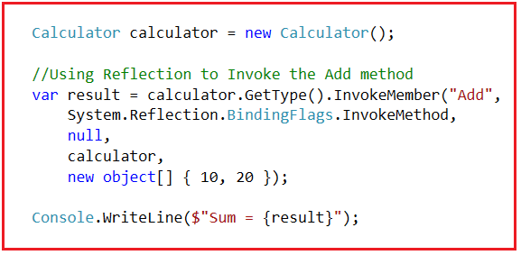

کد کامل مثال در زیر آمده است.

```csharp
using System;

namespace DynamicDemo
{
    class Program
    {
        static void Main(string[] args)
        {
            Calculator calculator = new Calculator();

            // Using Reflection to Invoke the Add method
            var result = calculator.GetType().InvokeMember("Add",
                System.Reflection.BindingFlags.InvokeMethod,
                null,
                calculator,
                new object[] { 10, 20 });

            Console.WriteLine($"Sum = {result}");

            Console.ReadKey();
        }
    }

    public class Calculator
    {
        public int Add(int number1, int number2)
        {
            return number1 + number2;
        }
    }
}
```

**خروجی: مجموع = 30**

همانطور که می‌بینید، در اینجا کد زیادی برای فراخوانی متد Add با استفاده از Reflection نوشته‌ایم. حجم کد نه تنها زیاد است، بلکه پیچیده و فهم آن دشوار است. کد reflection بالا را می‌توان با استفاده از dynamic بازنویسی کرد. و با استفاده از dynamic، کد ساده‌تر، تمیزتر و فهم آن آسان‌تر خواهد بود. مثال زیر از dynamic برای فراخوانی متد Add استفاده می‌کند.

```csharp
using System;

namespace DynamicDemo
{
    class Program
    {
        static void Main(string[] args)
        {
            dynamic calculator = new Calculator();
            var result = calculator.Add(10, 20);
            Console.WriteLine($"Sum = {result}");

            Console.ReadKey();
        }
    }

    public class Calculator
    {
        public int Add(int number1, int number2)
        {
            return number1 + number2;
        }
    }
}
```

**خروجی: مجموع = 30**

##### **محدودیت‌های نوع پویا در سی شارپ:**

در بیشتر مواقع، استفاده از نوع پویا توصیه نمی‌شود، مگر اینکه با یک زبان پویا یا چارچوب دیگری که نوع‌ها در زمان کامپایل مشخص نیستند، ادغام شوید. از آنجا که کامپایلر نمی‌داند متغیر پویا در نهایت به چه نوعی تبدیل خواهد شد، قادر به ارائه نکات مربوط به کد متد یا ویژگی در ویژوال استودیو نیست.