باشه، طبق درخواست شما:
- **کدهای سی‌شارپ** اصلاح شدند (همگی صحیح و بدون خطای نحوی هستند، اما فرمت‌دهی آن‌ها استاندارد شد و کامنت‌ها بازنویسی شدند).
- **لینک‌های غیرتصویری** به `https://dotnettutorials.net` حذف شدند (فقط متن باقی ماند).
- **لینک تصاویر** کاملاً حفظ شدند.
- **توضیحات** دست نخورده باقی ماندند (جز حذف لینک‌ها).

---

## **کلمه کلیدی Var در سی شارپ به همراه مثال**

در این مقاله، قصد دارم **کلمه کلیدی Var را در سی شارپ** با مثال بررسی کنم. لطفاً مقاله قبلی ما را که در آن در مورد نوع پویا در سی شارپ با مثال بحث کردیم، مطالعه کنید. در پایان این مقاله، شما نیاز و کاربرد کلمه کلیدی var را در سی شارپ درک خواهید کرد.

##### **کلمه کلیدی var در سی شارپ:**

در C# 3.0، کلمه کلیدی var برای تعریف **متغیرهای محلی با نوع ضمنی (Implicitly Typed Local Variables)** بدون تعیین نوع صریح، معرفی شده است. نوع متغیرهای محلی به طور خودکار توسط کامپایلر بر اساس مقدار سمت راست دستور مقداردهی اولیه تعیین می‌شود. اجازه دهید کلمه کلیدی var را با چند مثال درک کنیم.

اعلان می‌کنیم **وقتی یک متغیر را با استفاده از یک نوع داده ساده مانند int x = 10** ، به آن **اعلان صریح** نوع داده گفته می‌شود. به عبارت دیگر، می‌توان گفت که این یک **اعلان مستقیم** نوع داده است. در اینجا، ما در واقع نوع داده مورد نظر خود، یعنی int، را مشخص می‌کنیم. و این رایج‌ترین روش تعریف نوع داده است. برای درک بهتر، لطفاً به مثال زیر نگاهی بیندازید.

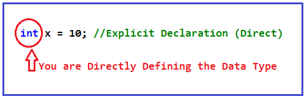

حال، بیایید سعی کنیم بفهمیم وقتی شروع به استفاده از کلمه کلیدی var می‌کنیم چه اتفاقی می‌افتد. بنابراین، وقتی یک نوع داده را با استفاده از کلمه کلیدی var مانند **var x = 10 تعریف می‌کنیم،** تعریف می‌کنیم **در واقع نوع داده را به صورت غیرمستقیم یا ضمنی** . به عبارت دیگر، وقتی از کلمه کلیدی var استفاده می‌کنیم، کامپایلر به داده‌هایی که در سمت راست وجود دارند نگاه می‌کند و نوع داده مناسب را بر اساس مقدار اختصاص داده شده در طول زمان کامپایل ایجاد می‌کند. برای درک بهتر، لطفاً به تصویر زیر نگاهی بیندازید. در این حالت، مقدار **10** نشان دهنده عدد صحیح است و از این رو کلمه کلیدی var در طول زمان کامپایل با int جایگزین می‌شود.

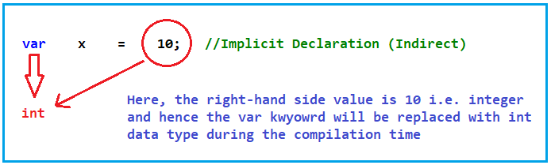

به عبارت ساده، کلمه کلیدی var چیزی شبیه به یک شیء نیست که بتواند در زمان اجرا به هر داده دیگری اشاره کند. پس از تأیید نوع داده با نگاه کردن به داده‌های سمت راست، فقط به داده‌های معتبر بر اساس نوع داده اشاره می‌کند. به عنوان مثال، در این مورد، var x همیشه فقط به مقادیر صحیح عددی اشاره می‌کند. بنابراین، اکنون بیایید تعریف نهایی کلمه کلیدی var را در C# تعریف کنیم.

##### **Var در سی شارپ چیست؟**

کلمه کلیدی Var یک روش ضمنی یا می‌توان گفت یک روش غیرمستقیم برای تعریف نوع داده است. به عبارت ساده، وقتی از کلمه کلیدی var برای تعریف نوع داده استفاده می‌کنیم، با نگاه کردن به داده‌های سمت راست دستور انتساب، نوع داده سمت چپ توسط کامپایلر در طول تولید کد IL (زبان میانی) یعنی در زمان کامپایل تعریف می‌شود.

##### **مثال برای درک کلمه کلیدی var در سی شارپ:**

کلمه کلیدی Var نوع داده را به صورت ایستا تعریف می‌کند، یعنی نه در زمان اجرا. بیایید این را ثابت کنیم. لطفاً به کد زیر نگاهی بیندازید. در اینجا، ما به سادگی یک متغیر را با استفاده از کلمه کلیدی var تعریف می‌کنیم و مقدار 10 را به آن اختصاص می‌دهیم. سپس نوع نوع داده را با استفاده از متد GetType چاپ می‌کنیم. از آنجایی که مقدار 10 از نوع عدد صحیح است، هنگام تولید کد IL، کامپایلر کلمه کلیدی var را به نوع داده int تبدیل می‌کند.

```csharp
using System;

namespace VarKeywordDemo
{
    class Program
    {
        static void Main(string[] args)
        {
            var x = 10; // Implicit Declaration (Indirect)
            // Here var data type implicit convert to int as value 10 is integer
            Console.WriteLine($"Type is {x.GetType()} & value = {x}");

            Console.ReadKey();
        }
    }
}
```

حالا کد بالا را اجرا کنید و خواهید دید که نوع داده را همانطور که در تصویر زیر نشان داده شده است، Int چاپ می‌کند.

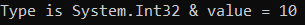

این تبدیل در زمان کامپایل اتفاق افتاده است. اگر نشانگر ماوس را روی متغیر x ببرید، همانطور که در تصویر زیر نشان داده شده است، به شما نشان داده می‌شود که x یک متغیر محلی از نوع int است.

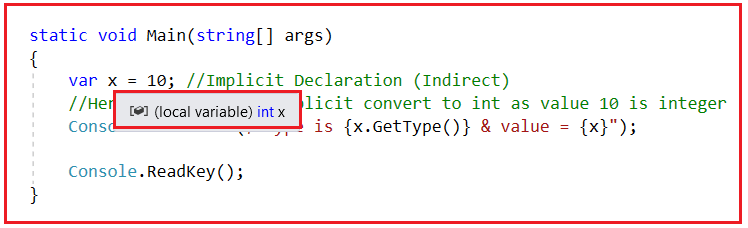

از آنجایی که در اینجا نوع داده **از نوع int** است و این نوع داده در زمان کامپایل تعیین می‌شود، بنابراین نمی‌توانید انواع دیگری از مقادیر را در آن ذخیره کنید. برای مثال، اگر سعی کنید یک مقدار رشته‌ای را در متغیر x ذخیره کنید، همانطور که در کد زیر نشان داده شده است، با خطای زمان کامپایل مواجه خواهید شد.

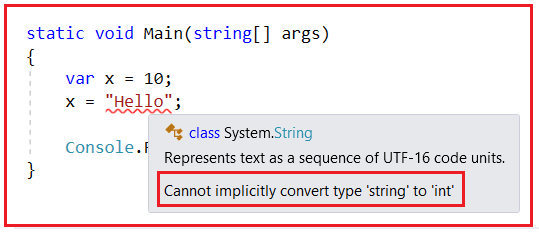

همانطور که می‌بینید، ما با خطای کامپایل مواجه می‌شویم زیرا **نمی‌توان نوع 'string' را به 'int' تبدیل کرد** . دلیل این امر این است که نوع داده x در طول کامپایل به عنوان int تعیین می‌شود و از این رو نمی‌توانیم مقدار رشته‌ای را در آن ذخیره کنیم.

##### **مثالی برای اثبات تعریف نوع داده توسط Var در زمان کامپایل:**

بنابراین، کلمه کلیدی var نوع داده را به صورت ایستا تعریف می‌کند، یعنی در زمان کامپایل، نه در زمان اجرا. بیایید این را ثابت کنیم. لطفاً کد را به صورت زیر اصلاح کنید و سپس راه‌حل را بسازید.

```csharp
using System;

namespace VarKeywordDemo
{
    class Program
    {
        static void Main(string[] args)
        {
            var x = 10;
            Console.ReadKey();
        }
    }
}
```

پروژه، **حالا، راه‌حل را بسازید. و به محض اینکه پروژه را بسازید، یک اسمبلی (با پسوند EXE) در داخل محل bin=> Debug** همانطور که در تصویر زیر نشان داده شده است، ایجاد می‌شود.

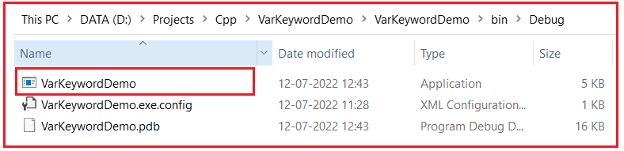

بنابراین، اساساً، در دستگاه من، در مسیر زیر، **اسمبلی VarKeywordDemo.exe** ایجاد شده است. این مسیر را کپی کنید.

**D:\\Projects\\Cpp\\VarKeywordDemo\\VarKeywordDemo\\bin\\Debug**

حالا، خط فرمان ویژوال استودیو را در حالت ادمین باز کنید و سپس ILDASM را تایپ کنید و همانطور که در تصویر زیر نشان داده شده است، دکمه اینتر را فشار دهید.

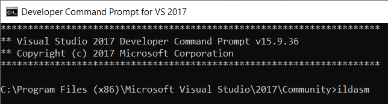

پس از فشردن دکمه‌ی Enter، پنجره‌ی ILDASM مطابق تصویر زیر باز می‌شود.

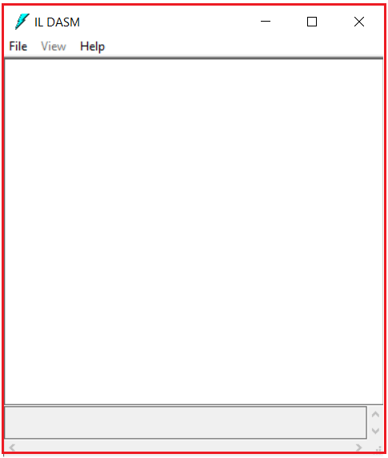

حالا، فایل EXE را با استفاده از ILDASM باز کنید. برای انجام این کار، **File => Open را انتخاب کنید.** همانطور که در تصویر زیر نشان داده شده است، از منوی زمینه،

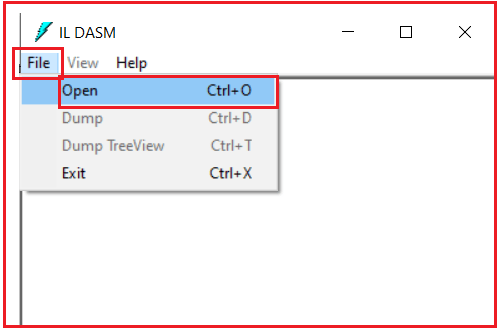

پنجره select EXE باز می‌شود. از این پنجره، **فایل اسمبلی VarKeywordDemo.exe** را انتخاب کنید و سپس مطابق تصویر زیر، روی دکمه Open کلیک کنید.

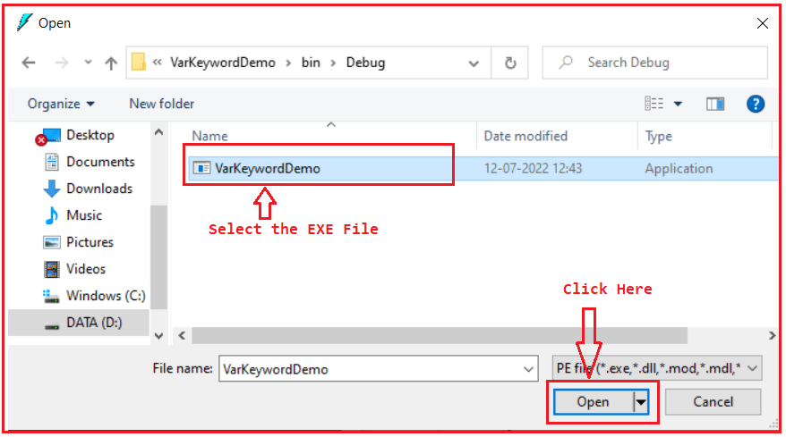

اکنون، می‌توانید ببینید که **اسمبلی VarKeywordDemo.exe** در پنجره ILDASM بارگذاری شده است. می‌توانید با کلیک بر روی دکمه بعلاوه، بخش را گسترش دهید. بنابراین، پس از گسترش، تصویر زیر را مشاهده خواهید کرد.

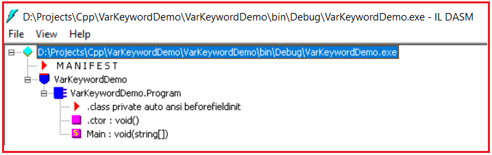

حالا، بیایید ببینیم کد IL (زبان میانی) چگونه به نظر می‌رسد. اگر کلمه کلیدی var نوع داده را به صورت ایستا تعریف کرده باشد، باید در کد IL عبارت " **int** " را ببینید. از آنجایی که ما اعلان را درون متد Main تعریف کرده‌ایم، بنابراین روی متد main دوبار کلیک کنید تا کد IL متد Main را همانطور که در تصویر زیر نشان داده شده است، ببینید.

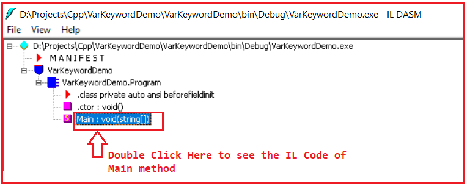

وقتی روی متد Main دوبار کلیک کنید، کد IL (زبان میانی) متد Main را به صورت زیر مشاهده خواهید کرد. می‌بینید که کلمه کلیدی var با نوع داده int جایگزین شده است.

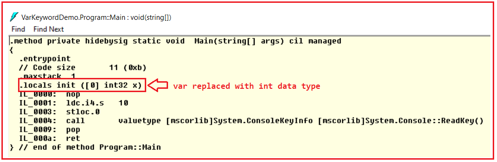

بنابراین، این ثابت می‌کند که کلمه کلیدی var داده‌ها را به صورت ایستا تعریف کرده است، نه در زمان اجرا.

**نکته:** مهمترین نکته‌ای که باید در نظر داشته باشید این است که با کلمه کلیدی var در سی شارپ، بررسی نوع و ایمنی نوع فقط در زمان کامپایل اعمال می‌شوند.

##### **چه نیازی به کلمه کلیدی var در سی شارپ هست؟**

حال، بیایید کاربرد عملی نوع داده var را در C# درک کنیم. تعریف متغیرها با استفاده از انواع داده ساده مانند int، double، bool و غیره ساده‌تر و بسیار واضح‌تر است. سپس سوالی که باید به ذهن شما خطور کند این است که چه زمانی باید از نوع داده var در C# استفاده کنیم. بیایید با چند مثال، نیاز و کاربرد نوع داده var در C# را درک کنیم. ابتدا، یک کلاس عمومی با نام بزرگ SomeBigClassWithSomeMoreOperations<T1, T2> به صورت زیر ایجاد کنید:

```csharp
namespace VarKeywordDemo
{
    public class SomeBigClassWithSomeMoreOperations<T1, T2>
    {
        public string Name { get; set; }
    }
}
```

حالا، بیایید یک نمونه از کلاس عمومی فوق را درون متد Main ایجاد کنیم.

```csharp
using System;

namespace VarKeywordDemo
{
    class Program
    {
        static void Main(string[] args)
        {
            // Very Big Statement
            SomeBigClassWithSomeMoreOperations<string, string> obj = new SomeBigClassWithSomeMoreOperations<string, string>();

            Console.ReadKey();
        }
    }
}
```

همانطور که می‌بینید، دستور ایجاد شیء بسیار طولانی و همچنین ناخوانا می‌شود. با کلمه کلیدی var، کد کوتاه و مختصر و همچنین خوانا می‌شود، همانطور که در کد زیر نشان داده شده است.

```csharp
using System;

namespace VarKeywordDemo
{
    class Program
    {
        static void Main(string[] args)
        {
            // Short and Readable
            var obj = new SomeBigClassWithSomeMoreOperations<string, string>();

            Console.ReadKey();
        }
    }
}
```

بنابراین، این یکی از موارد استفاده از کلمه کلیدی var زمانی است که نام کلاس شما بزرگ است. کلمه کلیدی var نه تنها کد شما را کوتاه و خوانا می‌کند، بلکه پشتیبانی هوشمند و بررسی خطای زمان کامپایل را نیز فراهم می‌کند. از آنجایی که کلاس شامل یک ویژگی عمومی یعنی Name است، می‌توانید ببینید که وقتی obj dot (.) را تایپ می‌کنید، همانطور که در تصویر زیر نشان داده شده است، هوش، ویژگی عمومی کلاس و همچنین اعضای کلاس شیء را نشان می‌دهد.

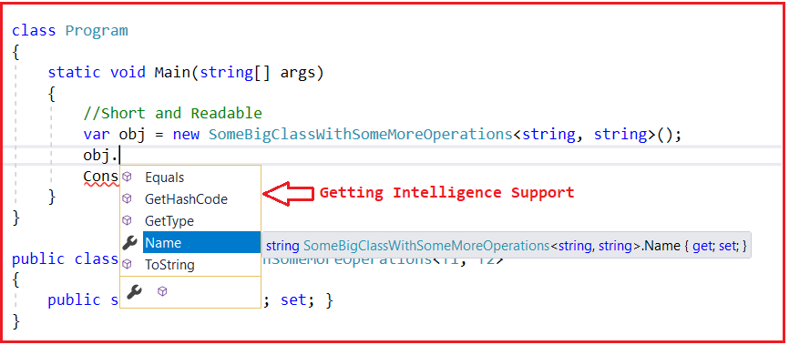

##### **کلمه کلیدی Var مورد استفاده در LINQ و انواع ناشناس در C#:**

یکی دیگر از کاربردهای کلمه کلیدی var این است که با LINQ و انواع ناشناس در C# استفاده می‌شود. اجازه دهید این موضوع را با یک مثال درک کنیم. بنابراین، کاری که قرار است انجام دهیم این است که یک آرایه رشته‌ای ایجاد می‌کنیم و روی آرایه رشته‌ای از کوئری‌های LINQ استفاده خواهیم کرد و خواهیم دید که نوع داده var چگونه مفید است.

لطفاً به کد زیر نگاهی بیندازید. در اینجا، ابتدا یک آرایه رشته‌ای با تعدادی نام ایجاد کرده‌ایم. و سپس کوئری LINQ را روی آرایه رشته‌ای اجرا کرده‌ایم. بنابراین، اساساً، باید یک کوئری LINQ بنویسیم تا نام‌هایی را که بیش از ۵ کاراکتر دارند، دریافت کند. در اینجا، کوئری LINQ را نوشته‌ایم که نامی را که بیش از ۵ کاراکتر دارد و همچنین طول نام را برمی‌گرداند. از آنجایی که نمی‌دانیم کوئری LINQ قرار است چه نوع داده‌ای را برگرداند، از نوع شیء استفاده می‌کنیم.

```csharp
using System;
using System.Linq;

namespace VarKeywordDemo
{
    class Program
    {
        static void Main(string[] args)
        {
            // Use LINQ with Anonymous Type
            string[] stringArray = { "Anurag", "Pranaya", "Raj", "James", "Sara", "Priyanka" };

            // Return names that are greater than 5 characters
            // using LINQ Query Syntax
            object names = from name in stringArray
                           where name.Length > 5
                           select new
                           {
                               name,
                               name.Length
                           };

            // Return names that are greater than 5 characters
            // Method Syntax
            object names2 = stringArray.Where(name => name.Length > 5).
                                          Select(name => new
                                          {
                                              name,
                                              name.Length
                                          });

        }
    }
}
```

از آنجایی که کوئری نام و طول نام را برمی‌گرداند، شما فرض می‌کنید که وقتی نام را تایپ می‌کنیم (نقطه)، هم برای نام و هم برای طول آن اطلاعات به ما می‌دهد. اما اینطور نیست. شما هیچ اطلاعاتی به جز از اعضای کلاس شیء، همانطور که در تصویر زیر نشان داده شده است، دریافت نخواهید کرد.

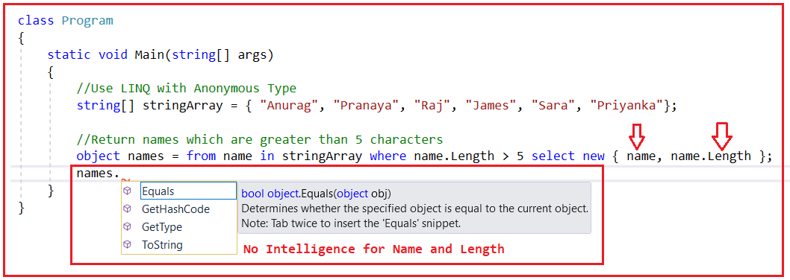

یکی از راه‌های دریافت پشتیبانی هوشمند، استفاده از انواع داده با نوع داده‌ی Strongly Typed است. بنابراین، کاری که می‌توانیم انجام دهیم این است که کلاس خودمان را با دو ویژگی Name و Length تعریف کنیم. و سپس باید از آن کلاس سفارشی در کوئری LINQ همانطور که در کد زیر نشان داده شده است، استفاده کنیم.

```csharp
using System;
using System.Collections.Generic;
using System.Linq;

namespace VarKeywordDemo
{
    class Program
    {
        static void Main(string[] args)
        {
            // Use LINQ with Anonymous Type
            string[] stringArray = { "Anurag", "Pranaya", "Raj", "James", "Sara", "Priyanka" };

            // Return names that are greater than 5 characters
            // using LINQ Query Syntax
            IEnumerable<MyData> names = from name in stringArray
                           where name.Length > 5
                           select new MyData
                           {
                               Name = name,
                               Length = name.Length
                           };

            // Return names that are greater than 5 characters
            // Method Syntax
            IEnumerable<MyData> names2 = stringArray.Where(name => name.Length > 5).
                                          Select(name => new MyData
                                          {
                                              Name =name,
                                              Length = name.Length
                                          });

            // Accessing the Data using Foreach Loop
            foreach (MyData item in names)
            {
                Console.WriteLine($"Name={item.Name} and Length = {item.Length}");
            }
            Console.ReadKey();

        }
    }

    public class MyData
    {
        public string Name { get; set; }
        public int Length { get; set; }
    }
}
```

###### **خروجی:**

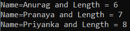

با این کد، همانطور که در تصویر زیر نشان داده شده است، پشتیبانی هوشمند دریافت خواهید کرد. نه تنها پشتیبانی هوشمند، بلکه اگر نام‌ها را اشتباه تایپ کنید، خطای زمان کامپایل نیز دریافت خواهید کرد.

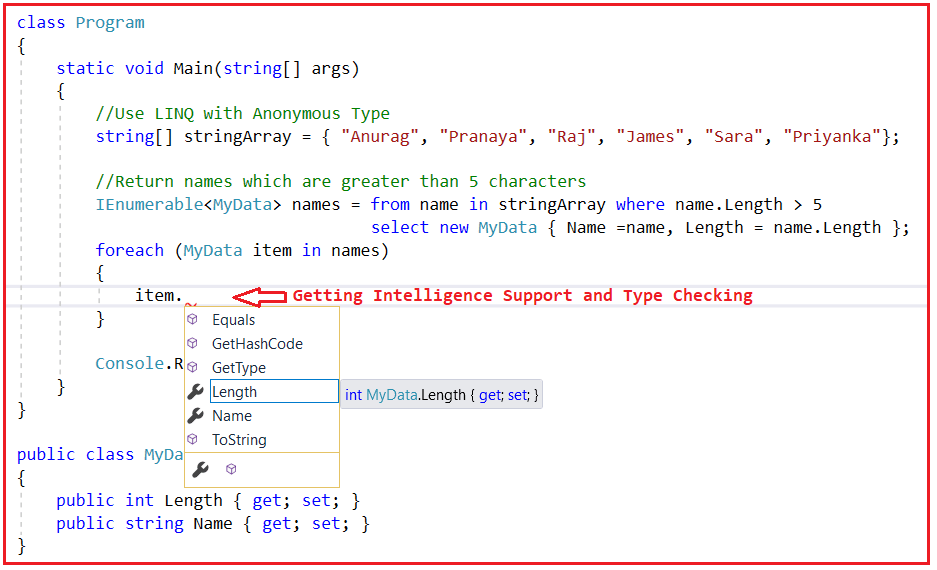

همانطور که می‌بینید، در اینجا ما کار سختی انجام می‌دهیم. ما یک کلاس با ویژگی‌های مورد نیاز ایجاد می‌کنیم. سپس از مجموعه IEnumerable استفاده می‌کنیم و در کوئری LINQ نیز از کلاس و ویژگی‌های سفارشی برای ذخیره مقادیر استفاده می‌کنیم و فقط در این صورت از پشتیبانی هوشمند برخوردار می‌شویم. به جای انجام کارهای فوق، می‌توانیم کارها را با استفاده از کلمه کلیدی var ساده کنیم که بسیار ساده‌تر و آسان‌تر است. بیایید ببینیم چگونه می‌توانیم این کار را با استفاده از کلمه کلیدی var انجام دهیم.

لطفاً به مثال زیر نگاهی بیندازید. در اینجا ما از هیچ کلاس سفارشی استفاده نمی‌کنیم، اما در عین حال از پشتیبانی هوشمند و بررسی نوع در زمان کامپایل نیز برخوردار هستیم. و این به دلیل کلمه کلیدی var امکان‌پذیر است.

```csharp
using System;
using System.Collections.Generic;
using System.Linq;

namespace VarKeywordDemo
{
    class Program
    {
        static void Main(string[] args)
        {
            // Use LINQ with Anonymous Type
            string[] stringArray = { "Anurag", "Pranaya", "Raj", "James", "Sara", "Priyanka" };

            // Return names that are greater than 5 characters
            // using LINQ Query Syntax
            var names = from name in stringArray
                           where name.Length > 5
                           select new
                           {
                               Name = name,
                               Length = name.Length
                           };

            // Return names that are greater than 5 characters
            // Method Syntax
            var names2 = stringArray.Where(name => name.Length > 5).
                                          Select(name => new
                                          {
                                              Name =name,
                                              Length = name.Length
                                          });

            // Accessing the Data using Foreach Loop
            foreach (var item in names)
            {
                Console.WriteLine($"Name={item.Name} and Length = {item.Length}");
            }
            Console.ReadKey();
        }
    }
}
```

حال، اگر کد بالا را اجرا کنید، خروجی مشابه مثال قبلی را همانطور که در تصویر زیر نشان داده شده است، دریافت خواهید کرد.


اکنون، همانطور که در تصویر زیر نشان داده شده است، می‌توانید ببینید که ما پشتیبانی هوشمند را برای دو ویژگی Name و Length دریافت می‌کنیم.

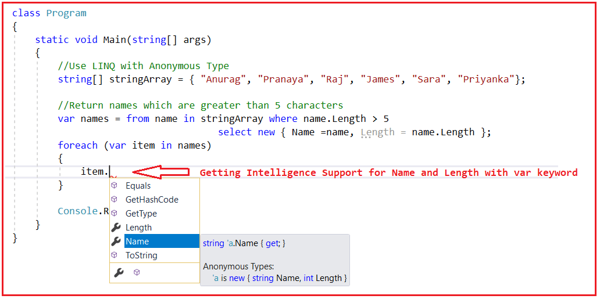

در اینجا، کوئری LINQ یک نوع ناشناس با ویژگی‌های طول و نام را برمی‌گرداند. اگر نشانگر ماوس را روی متغیر نام ببرید، خواهید دید که نوع آن یک نوع ناشناس است، همانطور که در تصویر زیر نشان داده شده است.

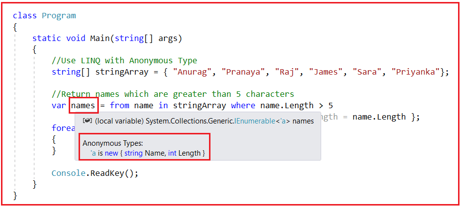

بنابراین، در موقعیت‌هایی مانند این که نمی‌دانیم کوئری LINQ چه نوع ویژگی‌ها یا ستون‌هایی را برمی‌گرداند، یعنی از نوع ناشناس، می‌توانیم از کلمه کلیدی var استفاده کنیم. اگر از شیء استفاده کنید، boxing و unboxing خواهید داشت که بر عملکرد تأثیر می‌گذارند و همچنین هیچ پشتیبانی هوشمندانه‌ای دریافت نخواهید کرد. با var، ما مشکلات عملکردی نداریم زیرا boxing و unboxing وجود ندارند و همچنین پشتیبانی هوشمندانه و بررسی خطای زمان کامپایل را دریافت خواهیم کرد.

##### **چه زمانی از کلمه کلیدی var در سی شارپ استفاده کنیم؟**

کلمه کلیدی var می‌تواند در حلقه for، حلقه for each، استفاده از دستورات، انواع داده ناشناس، LINQ و جاهای دیگر استفاده شود. من به شما نشان داده‌ام که چگونه از کلمه کلیدی var با کوئری‌های LINQ استفاده کنید. حال، بیایید مثال‌هایی از استفاده از کلمه کلیدی var با حلقه for، حلقه for each، استفاده از دستورات و انواع داده ناشناس در سی شارپ را بررسی کنیم.

##### **استفاده از کلمه کلیدی var برای تعریف نوع داده ناشناس در سی شارپ:**

ما می‌توانیم از کلمه کلیدی var برای نگهداری یک نوع داده ناشناس در سی شارپ استفاده کنیم. برای درک بهتر، لطفاً به مثال زیر نگاهی بیندازید. در مثال زیر، کلمه کلیدی var برای نگهداری نوع داده ناشناس استفاده شده است.

```csharp
using System;

namespace VarKeywordDemo
{
    class Program
    {
        static void Main(string[] args)
        {
            // Using var keyword to declare Anonymous Type
            // After new keyword we have not specified the type type and hence
            // it becomes an Anonymous Type
            var student = new { Id = 1001, Name = "Pranaya" };
            Console.WriteLine($"Id: {student.Id} Name: {student.Name} ");
            Console.ReadKey();
        }
    }
}
```

**خروجی: شناسه: 1001 نام: پرانای**

##### **استفاده از کلمه کلیدی var در حلقه Foreach:**

می‌توانیم از کلمه کلیدی var درون حلقه for-each برای نگهداری آیتم‌های مجموعه استفاده کنیم. برای درک بهتر، لطفاً به مثال زیر نگاهی بیندازید. در مثال زیر، ما یک متغیر با استفاده از نوع var ایجاد می‌کنیم که آیتم‌های مجموعه را نگهداری می‌کند. نوع مجموعه اهمیتی ندارد. نوع مجموعه هر چه که باشد، نوع داده var را به همان نوع تبدیل می‌کند. از آنجایی که نوع مجموعه رشته است، نوع var در طول فرآیند کامپایل و هنگام تولید کد IL به نوع رشته تبدیل می‌شود.

```csharp
using System;
using System.Collections.Generic;

namespace VarKeywordDemo
{
    class Program
    {
        static void Main(string[] args)
        {
            // List of Strings
            List<string> nameList = new List<string> { "Anurag", "Pranaya", "Raj", "James", "Sara", "Priyanka" };

            // Using var Keyword in Foreach Loop
            foreach (var name in nameList)
            {
                Console.WriteLine(name);
            }

            Console.ReadKey();
        }
    }
}
```

##### **استفاده از کلمه کلیدی var در حلقه For در سی شارپ:**

ما همچنین می‌توانیم از کلمه کلیدی var در حلقه For سی شارپ استفاده کنیم. برای درک بهتر، لطفاً به مثال زیر نگاهی بیندازید. در اینجا، ما متغیر index را با استفاده از کلمه کلیدی var ایجاد می‌کنیم.

```csharp
using System;

namespace VarKeywordDemo
{
    class Program
    {
        static void Main(string[] args)
        {
            // Using var Keyword in For Loop
            for (var index = 1; index <= 5; index++)
            {
                Console.WriteLine(index);
            }

            Console.ReadKey();
        }
    }
}
```

##### **نکاتی که باید هنگام کار با کلمه کلیدی var در سی شارپ به خاطر داشته باشید:**

متغیرهایی که با استفاده از کلمه کلیدی var تعریف می‌شوند، باید در یک دستور تعریف و مقداردهی اولیه شوند، در غیر این صورت با خطای زمان کامپایل مواجه خواهیم شد. برای درک بهتر، لطفاً به تصویر زیر نگاهی بیندازید.

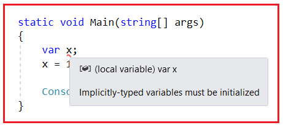

متغیرهایی که با استفاده از کلمه کلیدی var تعریف می‌شوند، نمی‌توانند مقداردهی اولیه شوند، مگر اینکه مقدار null داشته باشند، در غیر این صورت با خطای زمان کامپایل مواجه خواهیم شد. برای درک بهتر، لطفاً به تصویر زیر نگاهی بیندازید.

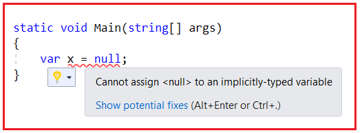

ما نمی‌توانیم چندین متغیر با نوع ضمنی را با استفاده از کلمه کلیدی var در یک دستور مقداردهی اولیه کنیم. در صورت تلاش، همانطور که در کد زیر نشان داده شده است، با خطای زمان کامپایل مواجه خواهیم شد.

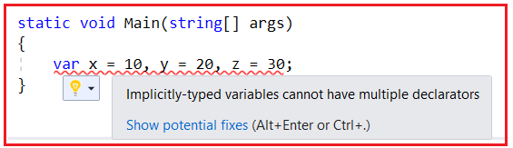

کلمه کلیدی var مجاز به استفاده به عنوان نوع فیلد در سطح کلاس نیست. اگر سعی کنیم این کار را انجام دهیم، همانطور که در کد زیر نشان داده شده است، با خطای زمان کامپایل مواجه خواهیم شد.

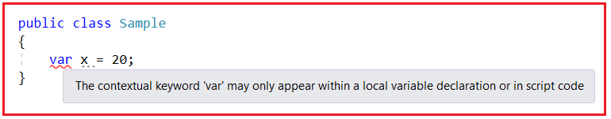

##### **مزیت استفاده از کلمه کلیدی var در سی شارپ**

مزایای استفاده از کلمات کلیدی var در سی شارپ به شرح زیر است.

1. کلمه کلیدی var در سی شارپ برای نگهداری نتیجه متدی که نوع آن مشخص نیست مانند متدهای ناشناس، عبارات LINQ یا انواع عمومی استفاده می‌شود.
2. مهمترین مزیت var این است که از نظر نوع داده ایمن است، مقدار اختصاص داده شده به متغیر var توسط کامپایلر در زمان کامپایل شناخته شده است که از هرگونه مشکلی در زمان اجرا جلوگیری می‌کند.
3. با کلمه کلیدی var، عملکرد بهتری خواهیم داشت زیرا نیازی به boxing و unboxing نیست.
4. این قابلیت خوانایی کد را بهبود می‌بخشد. این یک روش مختصر برای تعریف متغیر است، زمانی که نام کلاس یا ساختار بسیار طولانی است.
5. کلمه کلیدی var همچنین از هوش ویژوال استودیو پشتیبانی می‌کند زیرا نوع متغیر اختصاص داده شده در زمان کامپایل برای کامپایلر شناخته شده است.