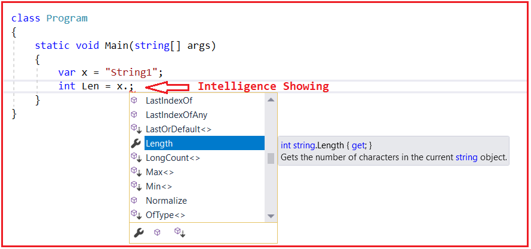
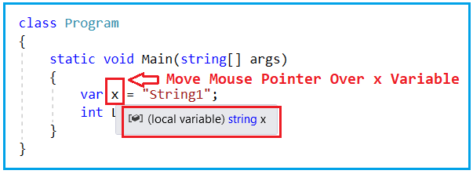
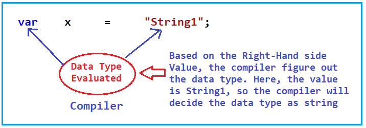
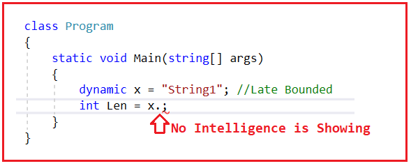
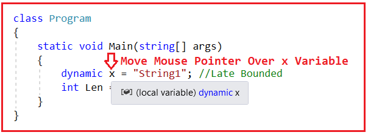
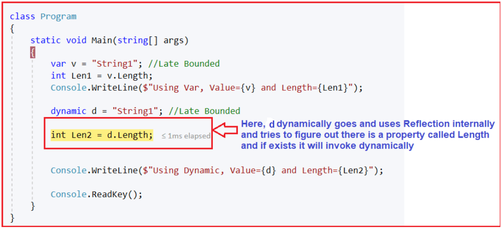
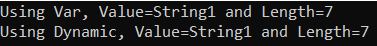
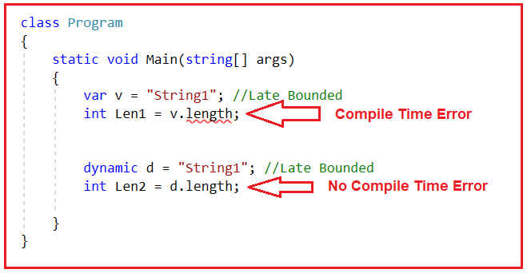
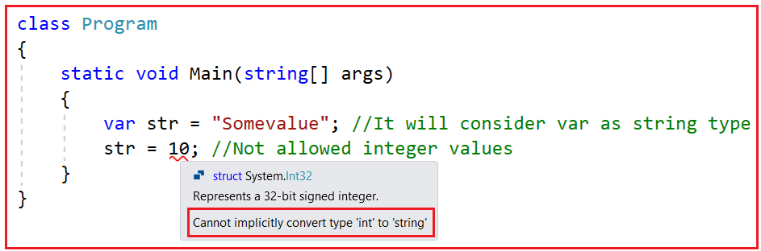
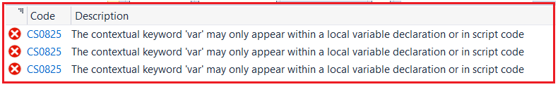

## **مقایسه‌ی Var و Dynamic در سی شارپ به همراه مثال**

در این مقاله، قصد دارم **Var در مقابل Dynamic را در C#** با مثال‌هایی مورد بحث قرار دهم. قبل از ادامه این مقاله، اکیداً توصیه می‌کنم مقالات کلمه کلیدی Dynamic در C# و کلمه کلیدی VAR در C# ما را مطالعه کنید. در پایان این مقاله، تفاوت‌های بین VAR و Dynamic، زمان استفاده از VAR و زمان استفاده از Dynamic در C# را با مثال‌هایی خواهید فهمید.

##### **وار در مقابل داینامیک در سی شارپ**

به عبارت ساده، می‌توان گفت که var محدود به اوایل (early bounded) است (به عبارت دیگر، به صورت ایستا بررسی می‌شود) در حالی که Dynamic محدود به اواخر (late bounded) است (به عبارت دیگر، در زمان اجرا بررسی می‌شود) یا می‌توان گفت که به صورت پویا ارزیابی می‌شود. بیایید تفاوت‌های بین کلمات کلیدی Var و Dynamic را در C# با مثال‌هایی درک کنیم.

لطفاً به مثال زیر نگاهی بیندازید. در اینجا، من یک متغیر به نام x را با استفاده از کلمه کلیدی var تعریف کرده‌ام و مقدار string1 را به آن اختصاص داده‌ام. سپس یک متغیر عدد صحیح به نام Len تعریف کرده‌ام که طول متغیر x را در خود نگه می‌دارد. در اینجا، من ویژگی Length را روی شیء x فراخوانی می‌کنم.

```csharp
namespace VarVSDynamicDemo
{
    class Program
    {
        static void Main(string[] args)
        {
            var x = "String1"; // Early Bounded
            int Len = x.Length;
        }
    }
}
```

اولین چیزی که باید اینجا به آن توجه کنید این است که وقتی x و نقطه (.) را تایپ می‌کنیم، متوجه خواهید شد که هوش (intelligence) در حال آمدن است و می‌توانید ویژگی طول (Length) را همانطور که در تصویر زیر نشان داده شده است، ببینید.



و اگر نشانگر ماوس را روی متغیر x ببرید، خواهید دید که می‌گوید x یک متغیر محلی است که نوع داده آن رشته است، همانطور که در تصویر زیر نشان داده شده است.



بنابراین، به عبارت دیگر، کامپایلر در زمان کامپایل متوجه می‌شود که نوع داده متغیر x از نوع رشته است. در این حالت، کامپایلر به داده‌های سمت راست (یعنی string1) نگاه می‌کند و نوع داده x را به عنوان یک رشته تشخیص می‌دهد، زیرا داده‌های سمت راست یک داده رشته‌ای هستند. برای درک بهتر، لطفاً به تصویر زیر نگاهی بیندازید.



کلمه کلیدی Var به صورت ایستا یا محدود شده اولیه عمل می‌کند. به این معنی که در زمانی که ما کد را با استفاده از کلمه کلیدی var می‌نویسیم و آن را کامپایل می‌کنیم، کامپایلر نوع داده را می‌داند.

بیایید همین کار را با استفاده از نوع داده پویا در سی شارپ انجام دهیم. مثال زیر همان مثال قبلی است، با این تفاوت که در اینجا، ما از کلمه کلیدی پویا به جای کلمه کلیدی var استفاده می‌کنیم. بنابراین، در اینجا، من یک متغیر به نام x با استفاده از کلمه کلیدی پویا تعریف کرده‌ام و مقدار string1 را به آن اختصاص داده‌ام. سپس یک متغیر عدد صحیح Len تعریف کرده‌ام که طول متغیر x را در خود نگه می‌دارد. در اینجا، من ویژگی Length را روی شیء x فراخوانی می‌کنم.

```csharp
namespace VarVSDynamicDemo
{
    class Program
    {
        static void Main(string[] args)
        {
            dynamic x = "String1"; // Late Bounded
            int Len = x.Length;
        }
    }
}
```

اولین چیزی که باید در اینجا به آن توجه کنید این است که وقتی x و نقطه (.) را تایپ می‌کنیم، هیچ اطلاعاتی دریافت نمی‌کنیم و نمی‌توانیم ویژگی Length یا هیچ ویژگی یا متد دیگری را ببینیم، همانطور که در تصویر زیر نشان داده شده است.



و اگر اشاره‌گر ماوس را روی متغیر x ببرید، خواهید دید که می‌گوید x یک متغیر محلی است که نوع داده آن پویا است، همانطور که در تصویر زیر نشان داده شده است. این بدان معناست که هنوز نوع داده متغیر x را تشخیص نمی‌دهد.



##### **مثال برای درک کلمات کلیدی Var و Dynamic در سی شارپ:**

حالا، بیایید کد زیر را در حالت اشکال‌زدایی اجرا کنیم.

```csharp
using System;

namespace VarVSDynamicDemo
{
    class Program
    {
        static void Main(string[] args)
        {
            var v = "String1"; // Early Bounded
            int Len1 = v.Length;
            Console.WriteLine($"Using Var, Value={v} and Length={Len1}");

            dynamic d = "String1"; // Late Bounded
            int Len2 = d.Length;
            Console.WriteLine($"Using Dynamic, Value={d} and Length={Len2}");

            Console.ReadKey();
        }
    }
}
```

اجرای دستورات با استفاده از کلمه کلیدی var ساده است. دلیل این امر آن است که اتصال ویژگی، یعنی فراخوانی ویژگی Length روی شیء v، در زمان کامپایل محدود می‌شود. دلیل این امر آن است که کامپایلر ویژگی‌ای به نام Length را به عنوان موجود در کلاس String تشخیص می‌دهد. اما در مورد نوع پویا این‌طور نیست. بنابراین، اتفاقی که با انواع پویا می‌افتد این است که در زمان اجرا، متغیر d به صورت پویا از reflection داخلی استفاده می‌کند و سعی می‌کند ویژگی Length را به صورت پویا فراخوانی کند. اگر ویژگی وجود داشته باشد، اجرا می‌شود؛ اگر وجود نداشته باشد، یک استثنای زمان اجرا ایجاد می‌شود. در مثال ما، ویژگی Length در کلاس string وجود دارد و آن ویژگی را اجرا می‌کند.



بنابراین، وقتی کد بالا را اجرا کنید، همانطور که انتظار می‌رود، خروجی زیر را دریافت خواهید کرد.



حالا، بیایید یک اشتباه کوچک مرتکب شویم. به جای Length (L بزرگ)، از length (l کوچک) استفاده کنیم و ببینیم چه اتفاقی می‌افتد. ببینید، با کلمه کلیدی var، بلافاصله یک خطای زمان کامپایل دریافت می‌کنیم. با این حال، با کلمه کلیدی dynamic، با هیچ خطای زمان کامپایل مواجه نمی‌شویم. دلیل این امر این است که اتصال در زمان کامپایل اتفاق نیفتاده است. با اتصال پویا، این اتفاق فقط در زمان اجرا رخ می‌دهد.



بیایید سعی کنیم از حرف بزرگ L با کلمه کلیدی var و از حرف کوچک l با کلمه کلیدی dynamic، همانطور که در زیر نشان داده شده است، استفاده کنیم و سپس برنامه را اجرا کنیم.

```csharp
using System;

namespace VarVSDynamicDemo
{
    class Program
    {
        static void Main(string[] args)
        {
            var v = "String1"; // Early Bounded
            int Len1 = v.Length;

            dynamic d = "String1"; // Late Bounded
            int Len2 = d.length;
        }
    }
}
```

می‌توانید مشاهده کنید که هیچ خطای کامپایلی دریافت نمی‌کنیم. اما وقتی کد را اجرا می‌کنیم، با خطای Runtime Exception زیر مواجه می‌شویم. دلیل این امر این است که در زمان اجرا، d به صورت داخلی از مکانیزم Reflection برای فراخوانی ویژگی length از کلاس string استفاده می‌کند. اما در کلاس string، ویژگی length وجود ندارد (با یک l کوچک)، بنابراین خطای زمان اجرا رخ می‌دهد.

 و پویا (dynamic) در سی شارپ")

بنابراین، تفاوت بین کلمات کلیدی var و dynamic در C# این است که var محدود به اوایل (Early Bounded) است (به صورت ایستا بررسی می‌شود، یا می‌توان گفت در زمان کامپایل بررسی می‌شود)، در حالی که dynamic محدود به اواخر (Late Bounded) است (متدها، ویژگی‌ها، نوع، همه چیز فقط در زمان اجرا بررسی می‌شود).

##### **آیا می‌توانیم با استفاده از Var و Dynamic در سی شارپ، ویژگی‌ها (Properties) را تعریف کنیم؟**

در سی شارپ، می‌توانیم از dynamic برای تعریف ویژگی‌ها استفاده کنیم، اما نمی‌توانیم از کلمه کلیدی var استفاده کنیم. دلیل این امر این است که، همانطور که قبلاً بحث کردیم، 'var' فقط می‌تواند برای تعریف متغیرهای محلی درون یک تابع استفاده شود و ویژگی‌ها اعضای کلاس هستند. از این رو، نمی‌توانیم ویژگی‌ها را با استفاده از کلمه کلیدی var در سی شارپ تعریف کنیم.

 را تعریف کنیم؟")

**نکته:** مهمترین نکته‌ای که باید به خاطر داشته باشید این است که کلمه کلیدی dynamic از reflection در پشت صحنه استفاده می‌کند. با در نظر گرفتن این نکته، بیایید ادامه دهیم و ببینیم با کلمات کلیدی var و dynamic در C# چه کارهایی می‌توانیم و چه کارهایی نمی‌توانیم انجام دهیم.

##### آیا می‌توانیم نوع مقدار را پس از انتساب به یک متغیر تغییر دهیم و آیا در سی شارپ پویا است؟

var اجازه تغییر نوع مقدار اختصاص داده شده را نمی‌دهد. این بدان معناست که اگر یک مقدار صحیح را به یک متغیر var اختصاص دهیم، نمی‌توانیم یک رشته یا نوع دیگری از مقدار را اختصاص دهیم. دلیل این امر این است که 'var' پس از اختصاص یک مقدار صحیح، به عنوان یک نوع صحیح در نظر گرفته می‌شود. و از این رو، پس از آن، انواع دیگر مقادیر را مجاز نمی‌داند. برای درک بهتر، لطفاً به مثال زیر مراجعه کنید.



اما این کار با نوع داده پویا در سی شارپ امکان‌پذیر است. انواع داده پویا اجازه می‌دهند نوع مقدار اختصاص داده شده تغییر کند. این بدان معناست که اگر یک مقدار صحیح به یک متغیر var اختصاص دهیم، می‌توانیم یک مقدار رشته‌ای یا نوع دیگری از مقدار را نیز اختصاص دهیم. دلیل این امر این است که نوع متغیر در زمان اجرا تعیین می‌شود و بر اساس مقدار سمت راست، نوع نیز تغییر می‌کند. برای درک بهتر، لطفاً به مثال زیر مراجعه کنید. این همان مثال قبلی است و در اینجا ما با هیچ خطای کامپایل یا خطای زمان اجرا مواجه نمی‌شویم.

```csharp
using System;

namespace VarVSDynamicDemo
{
    class Program
    {
        static void Main(string[] args)
        {
            dynamic str = "Somevalue"; // It will consider str as string type at Runtime
            Console.WriteLine(str.GetType());
            str = 10; // str type changed from string to int type at Runtime
            Console.WriteLine(str.GetType());
            Console.ReadKey();
        }
    }
}
```

###### **خروجی:**

**System.String**  
**System.Int32**

##### **آیا می‌توانیم از var و dynamic به عنوان نوع بازگشتی تابع یا پارامتر در C# استفاده کنیم؟**

ما نمی‌توانیم از کلمه کلیدی var نه به عنوان نوع بازگشتی یک تابع و نه به عنوان یک تابع یا پارامتر یک تابع در سی شارپ استفاده کنیم. کلمه کلیدی var در سی شارپ فقط می‌تواند به عنوان یک متغیر محلی درون یک تابع استفاده شود. اگر سعی کنیم از کلمه کلیدی var به عنوان پارامتر متد یا نوع بازگشتی متد استفاده کنیم، با خطای زمان کامپایل مواجه خواهیم شد.

برای درک بهتر، لطفاً به مثال زیر مراجعه کنید. در اینجا، ما سعی داریم از var به عنوان نوع بازگشتی SomeMethod و همچنین از var به عنوان پارامترهای SomeMethod استفاده کنیم.

```csharp
using System;

namespace VarVSDynamicDemo
{
    class Program
    {
        static void Main(string[] args)
        {
        }

        static var SomeMethod(var x, var y)
        {
            return x + y;
        }
    }
}
```

وقتی کد بالا را کامپایل می‌کنید، با خطای کامپایل زیر مواجه خواهید شد.



همانطور که می‌بینید، به وضوح می‌گوید که شما فقط می‌توانید از var به عنوان یک متغیر محلی استفاده کنید. این بدان معناست که نمی‌توانید از var برای نوع بازگشتی متد یا پارامتر متد استفاده کنید. حال، بیایید همان مثال را با استفاده از کلمه کلیدی dynamic به صورت زیر بازنویسی کنیم. در اینجا، در مثال زیر، می‌توانید ببینید که ما از 'dynamic' به عنوان نوع بازگشتی SomeMethod و کلمه کلیدی 'dynamic' برای اعلام پارامترهای متد SomeMethod استفاده می‌کنیم.

```csharp
using System;

namespace VarVSDynamicDemo
{
    class Program
    {
        static void Main(string[] args)
        {
            Console.WriteLine(SomeMethod(10, 20));
            Console.ReadKey();
        }

        static dynamic SomeMethod(dynamic x, dynamic y)
        {
            return x + y;
        }
    }
}
```

**خروجی: 30**

حالا، با کلمه کلیدی dynamic در سی شارپ، هیچ خطای کامپایل یا خطای زمان اجرا دریافت نمی‌کنیم. این یعنی می‌توانیم از 'dynamic' به عنوان یک متغیر محلی، به عنوان نوع بازگشتی متد و همچنین به عنوان پارامتر متد استفاده کنیم. این یکی از بزرگترین تفاوت‌های بین کلمات کلیدی var و dynamic در سی شارپ است.

##### **تفاوت‌های بین Var و Dynamic در سی شارپ:**

حالا، بیایید تفاوت‌های بین var و dynamic را در C# خلاصه کنیم. تفاوت‌ها به شرح زیر هستند:

##### **متغیر در سی شارپ**

1. یک متغیر var به عنوان یک متغیر با نوع استاتیک شناخته می‌شود، به این معنی که نوع داده این متغیرها در زمان کامپایل، بر اساس نوع مقداری که با آن مقداردهی اولیه شده‌اند، شناسایی می‌شود.
2. var در سی شارپ به عنوان بخشی از سی شارپ ۳.۰ معرفی شد.
3. در مورد var، نوع داده متغیر فقط در زمان کامپایل توسط کامپایلر شناسایی می‌شود.
4. در مورد var، مقداردهی اولیه متغیر در زمان تعریف آن الزامی است تا کامپایلر نوع داده متغیر را بر اساس مقدار سمت راست اختصاص داده شده به آن بداند.
5. اگر متغیر در زمان تعریف مقداردهی اولیه نشود، خطا می‌دهد.
6. ما در ویژوال استودیو پشتیبانی اطلاعاتی دریافت خواهیم کرد.
7. در سی شارپ نمی‌توان از Var برای اعلان پارامترهای متد و نوع بازگشتی متد استفاده کرد. فقط می‌توان از آن به عنوان اعلان متغیر محلی درون یک تابع استفاده کرد.
8. متغیر Var از نوع محدود شده اولیه است. این بدان معناست که کامپایلر نوع متغیر تعریف شده را در زمان کامپایل تعیین می‌کند.

##### **پویا در سی شارپ**

1. متغیر پویا به عنوان یک متغیر با نوع پویا شناخته می‌شود، به این معنی که نوع داده این متغیرها در زمان اجرا شناسایی می‌شود، که این کار بر اساس نوع مقداری که این متغیرها با آن مقداردهی اولیه شده‌اند، انجام می‌شود.
2. دینامیک در سی شارپ در نسخه ۴.۰ سی شارپ معرفی شد.
3. در حالت پویا، نوع داده متغیر توسط CLR در زمان اجرا شناسایی می‌شود.
4. در مورد پویا، مقداردهی اولیه متغیر در زمان تعریف آن الزامی نیست.
5. اگر متغیر در زمان تعریف مقداردهی اولیه نشود، خطایی ایجاد نمی‌کند.
6. ما هیچ پشتیبانی اطلاعاتی در ویژوال استودیو دریافت نخواهیم کرد.
7. از Dynamic می‌توان برای اعلان پارامترهای متد و نوع بازگشتی متد در سی‌شارپ استفاده کرد. همچنین می‌توان از آن به عنوان اعلان متغیر محلی درون یک تابع استفاده کرد.
8. پویا (Dynamic) با تأخیر محدود می‌شود. این بدان معناست که CLR نوع متغیر اعلام شده را در زمان اجرا تعیین می‌کند.