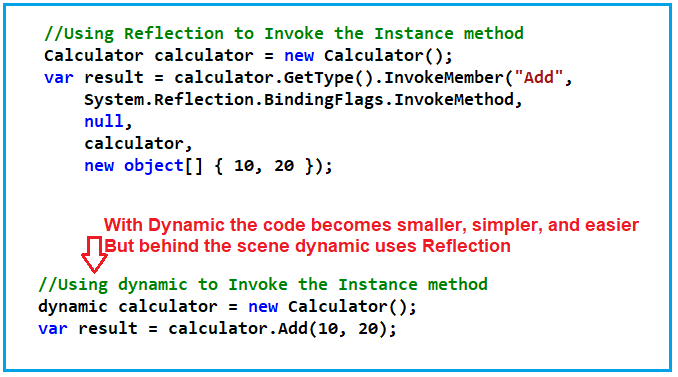
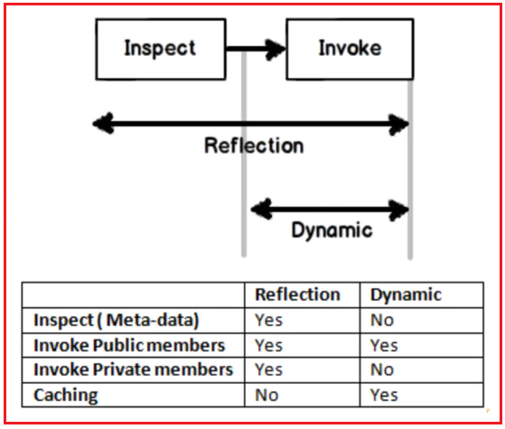

## **دینامیک در مقابل بازتاب در سی شارپ به همراه مثال**

در این مقاله، قصد دارم **Dynamic در مقابل Reflection در C# را** با مثال‌هایی مورد بحث قرار دهم. لطفاً قبل از ادامه این مقاله، مقالات Dynamic در C# و Reflection در C# ما را که در آنها مفهوم Dynamic و Reflection را به تفصیل توضیح داده‌ایم، مطالعه کنید. در اینجا، در این مقاله، قصد ندارم توضیح دهم که Dynamic چیست و Reflection چیست، بلکه بر بحث در مورد تفاوت‌های بین Dynamic و Reflection در C# تمرکز خواهم کرد.

##### **دینامیک در مقابل بازتاب در سی شارپ:**

بیایید با یک مثال تفاوت‌های بین Dynamic و Reflection در سی‌شارپ را درک کنیم. با Dynamic در سی‌شارپ، نوشتن کد Reflection بسیار آسان است که به نوبه خود باعث می‌شود کد خواناتر و قابل نگهداری‌تر باشد.

برای درک بهتر، مثالی را بررسی می‌کنیم. می‌خواهیم یک متد نمونه را ابتدا با استفاده از reflection فراخوانی کنیم و سپس همان متد نمونه را با استفاده از dynamic در C# فراخوانی خواهیم کرد. لطفاً به کلاس Calculator زیر نگاهی بیندازید.

```csharp
public class Calculator
{
    public int Add(int number1, int number2)
    {
        return number1 + number2;
    }
}
```

این یک کلاس بسیار ساده است. این کلاس یک متد به نام Add دارد که دو پارامتر عدد صحیح می‌گیرد و سپس این متد مجموع دو عدد ورودی را برمی‌گرداند. حال، می‌خواهیم متد Add فوق را با استفاده از Reflections و همچنین Dynamic فراخوانی کنیم. ابتدا متد Add فوق را با استفاده از Reflection فراخوانی می‌کنیم. کد مثال زیر نحوه فراخوانی متد Add فوق را با استفاده از Reflection در سی شارپ نشان می‌دهد.


می‌توانید تعداد کدهایی که باید برای فراخوانی متد Add از کلاس Calculator با استفاده از Reflection در سی‌شارپ بنویسیم را مشاهده کنید. مثال کامل در زیر آمده است.

```csharp
using System;

namespace DynamicVSReflectionDemo
{
    class Program
    {
        static void Main(string[] args)
        {
            Calculator calculator = new Calculator();

            // Using Reflection to Invoke the Add method
            var result = calculator.GetType().InvokeMember("Add",
                System.Reflection.BindingFlags.InvokeMethod,
                null,
                calculator,
                new object[] { 10, 20 });

            Console.WriteLine($"Sum = {result}");
            Console.ReadKey();
        }
    }

    public class Calculator
    {
        public int Add(int number1, int number2)
        {
            return number1 + number2;
        }
    }
}
```

**خروجی: مجموع = 30**

همانطور که می‌بینید، در اینجا کد زیادی برای فراخوانی متد Add با استفاده از Reflection نوشته‌ایم. حجم کد نه تنها زیاد است، بلکه کاملاً پیچیده و همچنین فهم آن دشوار است. کد reflection بالا را می‌توان با استفاده از dynamic در C# بازنویسی کرد. با استفاده از dynamic، کد ساده‌تر، تمیزتر و فهم آن آسان‌تر خواهد بود. مثال زیر نحوه استفاده از dynamic برای فراخوانی متد Add از کلاس Calculator را نشان می‌دهد.

```csharp
using System;

namespace DynamicVSReflectionDemo
{
    class Program
    {
        static void Main(string[] args)
        {
            // Using dynamic to Invoke the Add method
            dynamic calculator = new Calculator();
            var result = calculator.Add(10, 20);
            Console.WriteLine($"Sum = {result}");
            Console.ReadKey();
        }
    }

    public class Calculator
    {
        public int Add(int number1, int number2)
        {
            return number1 + number2;
        }
    }
}
```

**خروجی: مجموع = 30**

##### **تفاوت‌های Reflection و Dynamic در سی شارپ:**

اولین و مهمترین تفاوت این است که استفاده از dynamic در مقایسه با reflection بسیار ساده، کم کدتر و به راحتی قابل فهم است. برای درک بهتر، لطفاً به تصویر زیر نگاهی بیندازید که نحوه فراخوانی یک متد نمونه با استفاده از Reflection و Dynamic در C# را نشان می‌دهد.



هم dynamic و هم reflection از فراخوانی پویا استفاده می‌کنند. بنابراین، باید بفهمیم که در چه سناریوهایی باید از dynamic و در چه سناریوهای دیگری باید از reflection استفاده کنیم. برای درک این موضوع، لطفاً به نمودار زیر نگاهی بیندازید.



اولین نکته‌ای که باید به خاطر داشته باشید این است که کلمه کلیدی dynamic به صورت داخلی از چارچوب Reflection استفاده می‌کند. Reflection دو کار انجام می‌دهد. اول، متادیتا را بررسی می‌کند. یعنی متدها، ویژگی‌ها و فیلدهای اسمبلی را تعیین می‌کند. و نکته دوم این است که با استفاده از reflection می‌توانیم آن متدها، ویژگی‌ها، فیلدها و غیره را به صورت پویا نیز فراخوانی کنیم. از طرف دیگر، کلمه کلیدی dynamic فقط فراخوانی انجام می‌دهد، بازرسی انجام نمی‌دهد.

بنابراین، بزرگترین تفاوت بین dynamic و reflection این است که اگر در مورد بررسی متادیتا صحبت می‌کنید، باید از Reflection استفاده کنید. اما اگر در حال فراخوانی متدها، ویژگی‌ها، فیلدها و غیره از یک شیء هستید، باید از کلمه کلیدی dynamic در C# استفاده کنید.

1. **بازرسی متادیتا:** Reflection می‌تواند متادیتا را بررسی کند اما dynamic نمی‌تواند متادیتای یک اسمبلی را بررسی کند.
2. **فراخوانی اعضای عمومی:** می‌توانیم اعضای عمومی یک شیء را با استفاده از هر دو روش reflection و dynamic فراخوانی کنیم. استفاده از dynamic به دلیل سادگی و سهولت استفاده توصیه می‌شود.
3. **فراخوانی اعضای خصوصی:** ما می‌توانیم اعضای خصوصی یک شیء را با استفاده از reflection فراخوانی کنیم اما نمی‌توانیم اعضای خصوصی یک شیء را با استفاده از dynamic فراخوانی کنیم.
4. **ذخیره سازی:** ما می‌توانیم با استفاده از dynamic ذخیره کنیم اما با reflection نه.

**نکته:** بنابراین، وقتی می‌خواهید متادیتا را بررسی کنید و اعضای خصوصی را فراخوانی کنید، از reflection استفاده کنید. وقتی می‌خواهید اعضای عمومی را فراخوانی کنید و از caching استفاده کنید، از dynamic استفاده کنید.