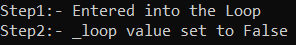
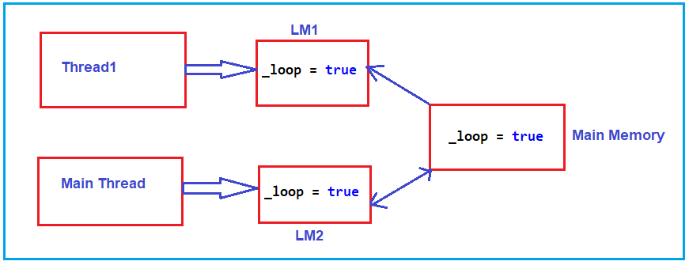
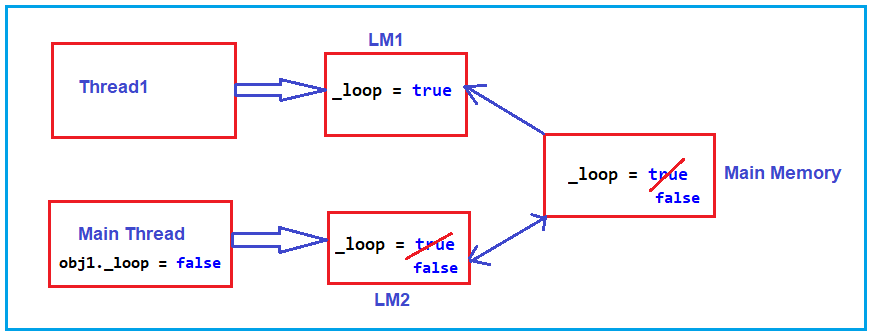
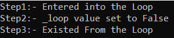
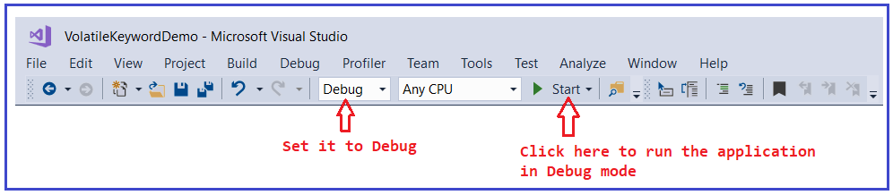
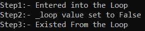

## **کلمه کلیدی volatile در سی شارپ به همراه مثال**

در این مقاله، قصد دارم **کلمه کلیدی Volatile را در سی شارپ** با مثال بررسی کنم. لطفاً مقاله قبلی ما را که در آن در مورد Dynamic VS Reflection در سی شارپ با مثال بحث کردیم، مطالعه کنید.

##### **کلمه کلیدی volatile در سی شارپ**

کلمه کلیدی Volatile در سی شارپ یکی از کلمات کلیدی است که در مورد آن بحث نشده است. همچنین می‌توان گفت که کلمه کلیدی ناشناخته یا کلمه کلیدی ناآشنا در زبان سی شارپ است. بیش از 95٪ مواقع، هرگز از این کلمه کلیدی استفاده نخواهید کرد. اما در صورتی که در حال توسعه برنامه‌های چند رشته‌ای هستید و اگر می‌خواهید همزمانی را به شیوه‌ای بهتر مدیریت کنید، می‌توانید از این کلمه کلیدی volatile استفاده کنید.

طبق گفته MSDM، کلمه کلیدی volatile نشان می‌دهد که یک فیلد ممکن است توسط چندین thread که همزمان در حال اجرا هستند، تغییر کند. کامپایلر، سیستم زمان اجرا و حتی سخت‌افزار ممکن است به دلایل عملکردی، خواندن‌ها و نوشتن‌ها در مکان‌های حافظه را دوباره مرتب کنند. فیلدهایی که volatile اعلام می‌شوند، از انواع خاصی از بهینه‌سازی‌ها مستثنی هستند. بیایید با یک مثال، نیاز و کاربرد کلمه کلیدی volatile در C# را درک کنیم.

##### **مثال برای درک کلمه کلیدی Volatile در سی شارپ:**

برای درک کلمه کلیدی Volatile در سی شارپ، ابتدا به بررسی مشکلی که به دلیل مشکلات همزمانی در برنامه‌های چند رشته‌ای با آن مواجه هستیم، خواهیم پرداخت. و سپس خواهیم دید که چگونه این کلمه کلیدی volatile به ما در حل مشکلات همزمانی در برنامه‌های چند رشته‌ای کمک می‌کند. برای درک بهتر مشکلات همزمانی، لطفاً به نمونه کد زیر نگاهی بیندازید.

```csharp
using System;
using System.Threading;

namespace VolatileKeywordDemo
{
    class Program
    {
        // Loop Variable
        private bool _loop = true;

        static void Main(string[] args)
        {
            // Calling the SomeMethod in a Multi-threaded manner
            Program obj1 = new Program();
            Thread thread1 = new Thread(SomeMethod);
            thread1.Start(obj1);

            // Pauses for 20 MS
            Thread.Sleep(20);

            // Setting the _loop value as false
            obj1._loop = false;
            Console.WriteLine("Step2:- _loop value set to False");
            Console.ReadKey();
        }

        // Simple Method
        public static void SomeMethod(object obj1)
        {
            Program obj = (Program)obj1;
            Console.WriteLine("Step1:- Entered into the Loop");
            while (obj._loop)
            {

            }
            Console.WriteLine("Step3:- Existed From the Loop");
        }
    }
}
```

در اینجا، ابتدا یک متغیر حلقه بولی به نام _loop ایجاد کردیم که مقدار آن روی true تنظیم شده است. سپس یک متد ساده به نام SomeMethod ایجاد کردیم. این متد SomeMethod یک شیء می‌گیرد و آن شیء چیزی جز شیء کلاس Program نیست و از این رو شیء را به نوع Program تبدیل نوع می‌کنیم و کاری که این متد انجام می‌دهد این است که یک حلقه while بی‌نهایت را اجرا می‌کند، یعنی تا زمانی که متغیر حلقه _loop نادرست شود. به طور پیش‌فرض، وقتی برنامه در حال مقداردهی اولیه است، متغیر _loop را روی true تنظیم می‌کنیم.

سپس این SomeMethod را به صورت چند نخی از داخل متد Main فراخوانی می‌کنیم. بنابراین، کاری که ما داخل متد Main انجام می‌دهیم این است که ابتدا یک شیء از کلاس Program ایجاد می‌کنیم، سپس یک نمونه thread ایجاد می‌کنیم و به سازنده Thread، SomeMethod را ارسال می‌کنیم، یعنی این thread ما SomeMethod را هنگام فراخوانی متد Start اجرا خواهد کرد. علاوه بر این، می‌توانید به متد Start توجه کنید که ما شیء کلاس Program را ارسال می‌کنیم. به محض فراخوانی متد Start، SomeMethod شروع به اجرا می‌کند و به عنوان بخشی از SomeMethod، حلقه نامحدود while اجرا می‌شود.

به محض اینکه برنامه شروع به اجرای SomeMethod می‌کند، برنامه به مدت 20 میلی‌ثانیه متوقف می‌شود. و بعد از 20 ثانیه، در واقع مقدار متغیر _loop را روی False تنظیم می‌کنیم. و در اینجا انتظار داریم به محض اینکه متغیر _loop برابر با false شود، حلقه while که درون SomeMethod در حال اجرا است، خارج شود و عبارت **Step3:- Existed From the Loop** در کنسول چاپ شود. دلیل این امر این است که هر دو روی یک شیء کار می‌کنند و شیء از طریق ارجاع است. بنابراین، انتظار داریم خروجی برنامه به شرح زیر باشد:

**Step1:- Entered into the Loop**  
**Step2:- _loop value set to False**  
**Step3:- Existed From the Loop**

حالا، بیایید کد بالا را در حالت انتشار اجرا کنیم و خروجی را ببینیم. اینکه چرا می‌گویم حالت انتشار، در ادامه‌ی این مقاله توضیح خواهم داد. برای اجرای برنامه در حالت انتشار، باید گزینه‌ی اجرا را در ویرایشگر ویژوال استودیو، همانطور که در تصویر زیر نشان داده شده است، روی انتشار تنظیم کنید.


زمانی که اجرای برنامه را در حالت انتشار (Release mode) شروع کنید، خروجی زیر را دریافت خواهید کرد.



همانطور که در تصویر خروجی بالا مشاهده می‌کنید، وارد حلقه می‌شود و پس از 20 میلی‌ثانیه مقدار متغیر _loop را روی false تنظیم می‌کند. اما حتی پس از تنظیم مقدار حلقه روی False، حلقه while خارج نمی‌شود. این بدان معناست که thread (thread1) هنوز فکر می‌کند که مقدار متغیر _loop درست است. این بدان معناست که مقداری که ما درون متد Main تنظیم کرده‌ایم (تنظیم متغیر _loop روی False) درون thread1 (یعنی درون SomeMethod) منعکس نمی‌شود.

##### **چرا با این مشکلات همزمانی مواجه هستیم؟**

برای درک اینکه چرا با این مشکلات همزمانی مواجه هستیم، باید معماری حافظه برنامه فوق را درک کنیم. لطفاً به نمودار زیر توجه کنید. در اینجا، ما دو نخ داریم، یکی نخ اصلی که برنامه ما شامل متد Main را اجرا می‌کند و دیگری نخ دوم که SomeMethod را اجرا می‌کند. و متغیر _loop در حافظه اصلی ذخیره می‌شود و این متغیر توسط هر دو نخ قابل دسترسی است. حافظه اصلی مقدار متغیر _loop را پیگیری می‌کند. در اینجا، نخ اصلی مقدار _loop را روی True تنظیم می‌کند. بنابراین، در داخل حافظه اصلی، مقدار متغیر _loop برابر با True خواهد بود.

ببینید، برای بهبود کارایی، این نخ‌ها مستقیماً به حافظه اصلی دسترسی ندارند، بلکه حافظه محلی خود را دارند که با حافظه اصلی همگام‌سازی شده است. فرض کنید حافظه محلی نخ ۱، LM1 و حافظه محلی نخ اصلی، LM2 است. این حافظه‌های محلی آن متغیر حلقه را خواهند داشت. و یک همگام‌سازی اینجا و آنجا بین حافظه اصلی و حافظه محلی نخ‌ها اتفاق می‌افتد.

خیر، در ابتدا، وقتی اجرای برنامه شروع شد، مقدار متغیر _loop را روی True تنظیم کرد. بنابراین، مقدار متغیر _loop در داخل حافظه اصلی و همچنین در داخل حافظه محلی thread1 و همچنین حافظه محلی thread اصلی، همانطور که در تصویر زیر نشان داده شده است، true خواهد بود.



حالا، وقتی برنامه‌ای که thread2 را اجرا می‌کند مقدار _loop را بررسی می‌کند و متوجه می‌شود که مقدار درست است، حلقه while را اجرا می‌کند. پس از مدتی، thread اصلی مقادیر _loop را روی false تنظیم می‌کند. این کار مقدار _loop حافظه محلی خود را روی false تنظیم می‌کند و همچنین مقدار _loop در حافظه اصلی را همانطور که در تصویر زیر نشان داده شده است، false می‌کند.



همانطور که می‌بینید حافظه محلی Thread1 به‌روزرسانی نشده است. بنابراین، Threadf1 هنوز به مقدار قدیمی دسترسی دارد. دلیل این امر این است که حافظه محلی Thread1 و حافظه اصلی، همگام‌سازی نشده‌اند. به همین دلیل، داده‌های به‌روزرسانی‌شده توسط Thread اصلی برای Thread1 قابل مشاهده نبود.

##### **چگونه مشکل فوق را حل کنیم؟**

از آنجایی که حافظه محلی و حافظه اصلی با هم هماهنگ نیستند، گاهی اوقات نتایج نامعتبر یا نتایج غیرمنتظره‌ای دریافت خواهیم کرد. حال، سوال این است که چگونه مشکل فوق را حل کنیم. راه حل این مشکل چیست؟ چگونه می‌توانیم مطمئن شویم که وقتی Thread1 به متغیر _loop (درون حافظه محلی LM1) دسترسی پیدا می‌کند، باید متغیر _loop را با حافظه اصلی همگام‌سازی کنیم؟ اینجاست که باید از کلمه کلیدی volatile در C# استفاده کنیم.

بگذارید متغیر _loop را با کلمه کلیدی volatile همانطور که در مثال زیر نشان داده شده است، علامت گذاری کنیم.

```csharp
using System;
using System.Threading;

namespace VolatileKeywordDemo
{
    class Program
    {
        // Loop Variable
        private volatile bool _loop = true;

        static void Main(string[] args)
        {
            // Calling the SomeMethod in a Multi-threaded manner
            Program obj1 = new Program();
            Thread thread1 = new Thread(SomeMethod);
            thread1.Start(obj1);

            // Pauses for 20 MS
            Thread.Sleep(20);

            // Setting the _loop value as false
            obj1._loop = false;
            Console.WriteLine("Step2:- _loop value set to False");
            Console.ReadKey();
        }

        // Simple Method
        public static void SomeMethod(object obj1)
        {
            Program obj = (Program)obj1;
            Console.WriteLine("Step1:- Entered into the Loop");
            while (obj._loop)
            {

            }
            Console.WriteLine("Step3:- Existed From the Loop");
        }
    }
}
```

بنابراین، وقتی متغیر _loop را به عنوان volatile علامت‌گذاری می‌کنیم، اتفاقی که می‌افتد این است که هر زمان حلقه while به این متغیر _loop دسترسی پیدا کند، ابتدا داده‌های این متغیر _loop حافظه محلی را با داده‌های متغیر _loop حافظه اصلی همگام‌سازی می‌کند و سپس حلقه را اجرا می‌کند. حال، اگر کد بالا را اجرا کنید، خروجی مورد انتظار را همانطور که در تصویر زیر نشان داده شده است، دریافت خواهید کرد.



بنابراین، هنگام انجام برنامه‌های چند رشته‌ای و به خصوص هنگام دسترسی به داده‌هایی که همزمان توسط رشته‌های مختلف به‌روزرسانی می‌شوند و می‌خواهید آن داده‌های به‌روزرسانی‌شده توسط رشته‌های دیگر استفاده شوند، باید از کلمه کلیدی volatile استفاده کنید. کلمه کلیدی volatile تضمین می‌کند که داده‌هایی که به آنها دسترسی دارید به‌روز هستند یا می‌توان گفت که با حافظه اصلی همگام‌سازی شده‌اند.

**نکته:** هم در سی‌شارپ و هم در جاوا، کلمه کلیدی volatile به کامپایلر می‌گوید که مقدار متغیر هرگز نباید ذخیره شود زیرا ممکن است مقدار آن خارج از محدوده خود برنامه تغییر کند. در این صورت کامپایلر از هرگونه بهینه‌سازی که ممکن است در صورت تغییر متغیر «خارج از کنترل آن» منجر به مشکل شود، جلوگیری می‌کند.

##### **چرا برنامه را در حالت Release اجرا می‌کنیم؟**

ببینید، به طور پیش‌فرض، Debug شامل اطلاعات اشکال‌زدایی در فایل‌های کامپایل شده است (که امکان اشکال‌زدایی آسان را فراهم می‌کند) در حالی که release معمولاً بهینه‌سازی‌ها را فعال می‌کند. بنابراین، وقتی در حال توسعه یک برنامه هستید، برای اشکال‌زدایی آسان باید از Debug استفاده کنید. اما، هنگام استقرار برنامه روی سرور، برای عملکرد بهتر باید فایل‌ها را در حالت release منتشر کنیم.

##### **من گیج شده‌ام.**

حتی من هم کمی در مورد کلمه کلیدی volatile و اجرای برنامه با استفاده از حالت اشکال‌زدایی (debug mode) گیج شده‌ام. اگر برنامه فوق را در حالت اشکال‌زدایی و بدون استفاده از کلمه کلیدی volatile اجرا کنید، خروجی مورد انتظار را دریافت خواهید کرد. بیایید کد را به صورت زیر اصلاح کنیم. در اینجا، ما از کلمه کلیدی volatile استفاده نمی‌کنیم.

```csharp
using System;
using System.Threading;

namespace VolatileKeywordDemo
{
    class Program
    {
        // Loop Variable
        private bool _loop = true;

        static void Main(string[] args)
        {
            // Calling the SomeMethod in a Multi-threaded manner
            Program obj1 = new Program();
            Thread thread1 = new Thread(SomeMethod);
            thread1.Start(obj1);

            // Pauses for 20 MS
            Thread.Sleep(20);

            // Setting the _loop value as false
            obj1._loop = false;
            Console.WriteLine("Step2:- _loop value set to False");
            Console.ReadKey();
        }

        // Simple Method
        public static void SomeMethod(object obj1)
        {
            Program obj = (Program)obj1;
            Console.WriteLine("Step1:- Entered into the Loop");
            while (obj._loop)
            {

            }
            Console.WriteLine("Step3:- Existed From the Loop");
        }
    }
}
```

حالا، کد بالا را در حالت اشکال‌زدایی (Debug mode) اجرا می‌کنیم، همانطور که در تصویر زیر نشان داده شده است.



حالا، وقتی برنامه را در حالت اشکال‌زدایی اجرا کنید، خروجی زیر را دریافت خواهید کرد.



همانطور که می‌بینید، در اینجا خروجی مطابق انتظار دریافت می‌کنیم. با این حال، من به دنبال دلیل این هستم که چرا این در حالت اشکال‌زدایی به خوبی کار می‌کند، اما در حالت انتشار کار نمی‌کند. به محض اینکه دلیل را پیدا کردم، آن را اینجا به‌روزرسانی خواهم کرد. در همین حال، اگر دلیل این اتفاق را پیدا کردید، لطفاً آن را در بخش نظرات بنویسید.