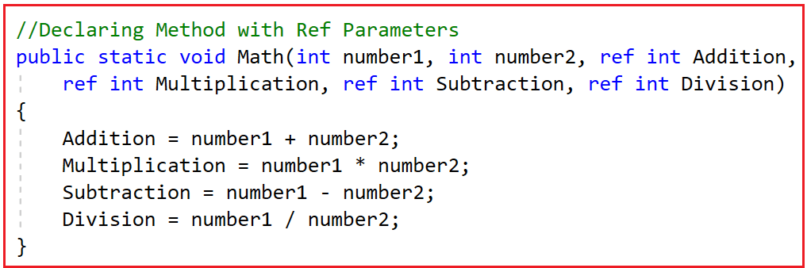
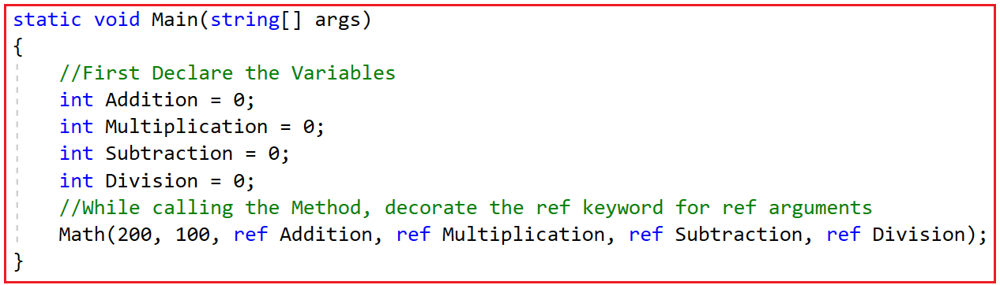
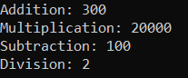
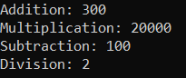
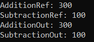
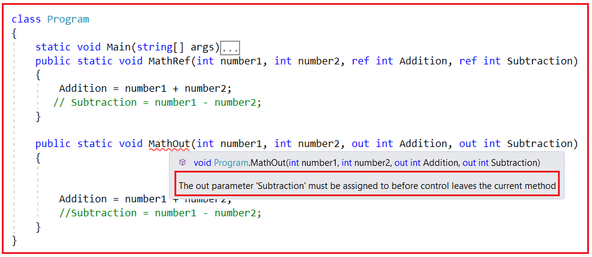
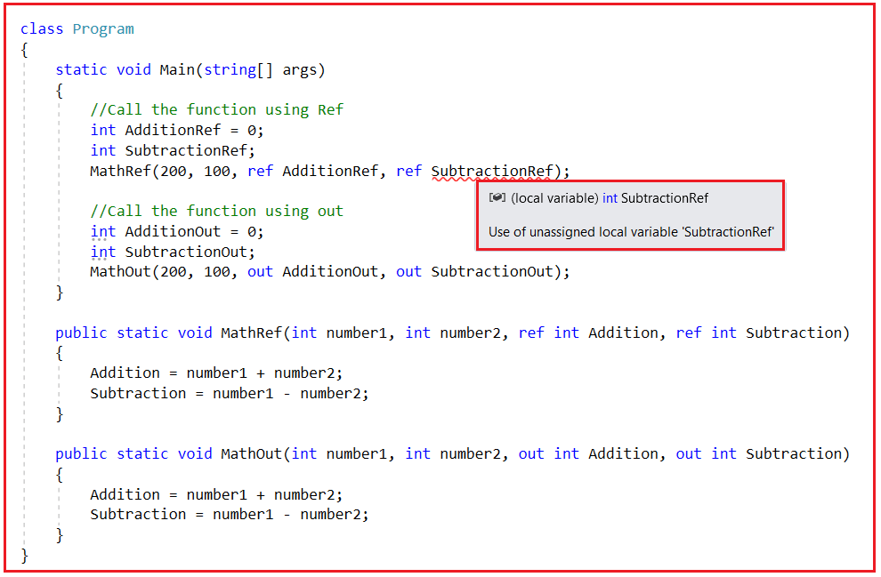

## **کلمات کلیدی Ref و Out در سی شارپ به همراه مثال**

در این مقاله، قصد دارم **کلمات کلیدی Ref و Out را در سی شارپ** به همراه مثال بررسی کنم. لطفاً مقاله قبلی ما را که در آن به بررسی کلمه کلیدی Volatile در سی شارپ به همراه مثال پرداختیم، مطالعه کنید. دو کلمه کلیدی در سی شارپ وجود دارد، یعنی Ref و Out و اکثر توسعه‌دهندگان در مورد این دو کلمه کلیدی دچار سردرگمی می‌شوند. بنابراین، در پایان این مقاله، خواهید فهمید که این کلمات کلیدی در چه مواردی مفید هستند و چگونه می‌توان از آنها در سی شارپ به همراه مثال استفاده کرد.

##### **کلمات کلیدی Ref در مقابل Out در سی شارپ:**

کلمات کلیدی REF و OUT در سی شارپ برای ارسال آرگومان‌ها به یک متد به عنوان نوع مرجع استفاده می‌شوند. به طور پیش‌فرض، آرگومان‌ها به صورت مقدار به متد ارسال می‌شوند. با استفاده از این کلمات کلیدی REF و OUT در سی شارپ، می‌توانیم آرگومان‌ها را به صورت مرجع ارسال کنیم. در این حالت، هرگونه تغییری که در این آرگومان‌ها در بدنه متد ایجاد شود، هنگام بازگشت کنترل به متد فراخواننده، در آن متغیرها منعکس خواهد شد.

برای درک اصول کلمات کلیدی REF و OUT در سی شارپ، لطفاً به مثال زیر نگاهی بیندازید. در اینجا، می‌توانید ببینید که ما یک تابع به نام Math ایجاد کرده‌ایم. این تابع Math دو پارامتر صحیح می‌گیرد و سپس این تابع این دو عدد را جمع می‌کند و نتیجه را برمی‌گرداند. و از متد Main، ما تابع Math را فراخوانی می‌کنیم و سپس نتیجه‌ای را که توسط تابع Math برگردانده می‌شود، در کنسول چاپ می‌کنیم.

```csharp
using System;

namespace RefvsOutDemo
{
    class Program
    {
        static void Main(string[] args)
        {
            int Result = Math(100, 200);
            Console.WriteLine($"Result: {Result}");
            Console.ReadKey();
        }

        public static int Math(int number1, int number2)
        {
            return number1 + number2;
        }
    }
}
```

**خروجی: نتیجه: ۳۰۰**

حالا، نیاز من این است که وقتی تابع Math را فراخوانی می‌کنم، بخواهم جمع، ضرب، تفریق و تقسیم دو عدد ارسالی به این تابع را برگردانم. اما، همانطور که می‌دانید، در هر نقطه از زمان، فقط می‌توان یک مقدار واحد را از یک تابع در C# برگرداند، یعنی فقط یک خروجی از یک تابع.

اگر به تابع Math نگاه کنید، نوع بازگشتی آن int است، به این معنی که فقط یک مقدار را در هر نقطه زمانی مشخص برمی‌گرداند. حال، چگونه می‌توانیم چندین مقدار مانند نتایج جمع، ضرب، تفریق و تقسیم دو عدد را برگردانیم؟ بنابراین، در موقعیت‌هایی مانند این، باید از پارامترهای out و ref در C# استفاده کنیم.

##### **مثال استفاده از REF برای برگرداندن چندین خروجی از یک تابع در سی شارپ:**

حال، ابتدا ببینیم که چگونه کلمه کلیدی ref می‌تواند به ما در ارائه چندین خروجی از یک تابع در C# کمک کند. بنابراین، برای بازگرداندن چهار مقدار (جمع، ضرب، تفریق و تقسیم دو عدد داده شده) از تابع Math، تابع Math باید چهار پارامتر جدا از دو پارامتر ورودی بپذیرد و پارامترها باید با کلمه کلیدی ref تعریف شوند. و سپس باید مقادیر را در این پارامترهای ref همانطور که در کد زیر نشان داده شده است، تنظیم کنیم. تابع Math را به صورت زیر تغییر دهید. از آنجایی که ما خروجی را با استفاده از پارامتر ref برمی‌گردانیم، نوع بازگشتی این متد را به void تغییر دادیم.



حال، از متد Main، هنگام فراخوانی تابع Math فوق، علاوه بر دو عدد صحیح، باید چهار آرگومان ref از نوع عدد صحیح نیز ارسال کنیم. برای انجام این کار، ابتدا باید چهار متغیر عدد صحیح تعریف کنیم. بنابراین در اینجا چهار متغیر جمع، ضرب، تفریق و تقسیم تعریف کرده‌ایم. سپس باید این چهار متغیر را به تابع Math ارسال کنیم و تابع Math مقادیر به‌روزرسانی‌شده برای این متغیرها را به ما می‌دهد. برای اینکه مقادیر به‌روزرسانی‌شده را در این متغیرها ذخیره کنیم، هنگام ارسال این متغیرها به تابع Math، مجدداً باید از کلمه کلیدی ref همانطور که در تصویر زیر نشان داده شده است، استفاده کنیم.



حالا، متغیر Addition جمع دو عددی که به تابع Math ارسال کردیم را نگه می‌دارد. به طور مشابه، متغیر Multiplication حاصل ضرب دو عددی که به تابع Math ارسال کردیم را به ما می‌دهد و همین کار را برای تقسیم و تفریق نیز انجام می‌دهد.

بنابراین، آنچه در واقع اتفاق می‌افتد این است که وقتی متغیر ref را درون تابع Math به‌روزرسانی می‌کنیم، در واقع همان را درون تابع Main نیز به‌روزرسانی می‌کند. برای مثال، اگر متغیر Addition را درون تابع Math به‌روزرسانی کنیم، در واقع متغیر Addition موجود در متد Main نیز به‌روزرسانی می‌شود. و همین امر برای ضرب، تفریق و تقسیم نیز صادق است. کد کامل مثال در زیر آورده شده است. کد مثال زیر خود توضیح است، بنابراین لطفاً برای درک بهتر، خطوط کامنت را مطالعه کنید.

```csharp
using System;

namespace RefvsOutDemo
{
    class Program
    {
        static void Main(string[] args)
        {
            // First Declare the Variables
            int Addition = 0;
            int Multiplication = 0;
            int Subtraction = 0;
            int Division = 0;

            // While calling the Method, decorate the ref keyword for ref arguments
            // Addition, Multiplication, Subtraction, and Division variables values will be updated by Math Function
            Math(200, 100, ref Addition, ref Multiplication, ref Subtraction, ref Division);

            Console.WriteLine($"Addition: {Addition}");
            Console.WriteLine($"Multiplication: {Multiplication}");
            Console.WriteLine($"Subtraction: {Subtraction}");
            Console.WriteLine($"Division: {Division}");

            Console.ReadKey();
        }

        // Declaring Method with Ref Parameters
        public static void Math(int number1, int number2, ref int Addition,
            ref int Multiplication, ref int Subtraction, ref int Division)
        {
            Addition = number1 + number2; // This will Update the Addition variable Declared in Main Method
            Multiplication = number1 * number2; // This will Update the Multiplication variable Declared in Main Method
            Subtraction = number1 - number2; // This will Update the Subtraction variable Declared in Main Method
            Division = number1 / number2; // This will Update the Division variable Declared in Main Method
        }
    }
}
```

###### **خروجی:**



بنابراین، می‌توانید در اینجا مشاهده کنید که با استفاده از پارامتر ref چگونه می‌توانیم چندین خروجی از یک تابع واحد در سی شارپ دریافت کنیم.

##### **نکات مهم:**

در اینجا، ما پارامتر را از نوع مقداری ارسال می‌کنیم. این بدان معناست که از int، float، Boolean و غیره برای ایجاد متغیرهای نوع مقداری استفاده می‌شود. ما از قبل مفهوم مکانیزم فراخوانی با مقدار (Call by Value Mechanism) در C# را می‌دانیم. در مورد نوع مقداری، یک کپی متفاوت از متغیرها به متد فراخوانی‌کننده ارسال می‌شود. اگر در متد فراخوانی‌کننده تغییری ایجاد کنید، بر همان متغیرهای اصلی تأثیری نخواهد گذاشت. اما از آنجا که ما در اینجا از کلمه کلیدی ref قبل از نام آرگومان استفاده می‌کنیم، در واقع یک اشاره‌گر را ارسال می‌کنیم که به متغیرهای اصلی اشاره می‌کند. بنابراین، تغییر مقادیر با استفاده از یک اشاره‌گر در واقع تغییر مقادیر متغیرهای اصلی است. این چیزی جز مکانیزم فراخوانی با ارجاع (Call By Reference Mechanism) در C# نیست.

##### **مثال استفاده از پارامتر Out برای برگرداندن چندین خروجی از یک تابع در سی شارپ:**

ابتدا اجازه دهید مثال را بررسی کنیم و سپس مفهوم پارامتر OUT را در C# درک خواهیم کرد. لطفاً به مثال زیر نگاهی بیندازید. این همان مثال قبلی است، با این تفاوت که به جای ref، در اینجا از کلمه کلیدی OUT استفاده کرده‌ایم.

```csharp
using System;

namespace RefvsOutDemo
{
    class Program
    {
        static void Main(string[] args)
        {
            // First Declare the Variables
            int Addition = 0;
            int Multiplication = 0;
            int Subtraction = 0;
            int Division = 0;

            // While calling the Method, decorate the out keyword for out arguments
            // Addition, Multiplication, Subtraction, and Division variables values will be updated by Math Function
            Math(200, 100, out Addition, out Multiplication, out Subtraction, out Division);

            Console.WriteLine($"Addition: {Addition}");
            Console.WriteLine($"Multiplication: {Multiplication}");
            Console.WriteLine($"Subtraction: {Subtraction}");
            Console.WriteLine($"Division: {Division}");

            Console.ReadKey();
        }

        // Declaring Method with out Parameters
        public static void Math(int number1, int number2, out int Addition,
            out int Multiplication, out int Subtraction, out int Division)
        {
            Addition = number1 + number2; // This will Update the Addition variable Declared in Main Method
            Multiplication = number1 * number2; // This will Update the Multiplication variable Declared in Main Method
            Subtraction = number1 - number2; // This will Update the Subtraction variable Declared in Main Method
            Division = number1 / number2; // This will Update the Division variable Declared in Main Method
        }
    }
}
```

###### **خروجی:**



بسیار خب. ما نتیجه یکسانی می‌گیریم. این یعنی با استفاده از out، مقادیر به‌روزرسانی‌شده را از تابع Math نیز دریافت می‌کنیم. بنابراین، عملکرد آن بسیار شبیه به پارامتر ref است. حال، متداول‌ترین سوال مصاحبه این است که تفاوت‌های بین out و ref در C# چیست؟

##### **تفاوت بین کلمات کلیدی OUT و REF در سی شارپ چیست؟**

بنابراین، اولین نکته‌ای که باید به خاطر داشته باشید این است که وقتی می‌خواهید چندین خروجی از یک تابع داشته باشید، باید از پارامترهای ref و out در سی شارپ استفاده کنید. اگر به out و ref نگاه کنید، هر دو کار مشابهی را انجام می‌دهند. پس تفاوت‌های بین آنها چیست؟ بیایید با یک مثال تفاوت‌ها را درک کنیم. لطفاً به مثال زیر نگاهی بیندازید. کد زیر همان کدی است که قبلاً در دو مثال قبلی توضیح داده‌ایم.

```csharp
using System;

namespace RefvsOutDemo
{
    class Program
    {
        static void Main(string[] args)
        {
            // Calling the Method with the REF arguments
            int AdditionRef = 0;
            int SubtractionRef = 0;
            MathRef(200, 100, ref AdditionRef, ref SubtractionRef);
            Console.WriteLine($"AdditionRef: {AdditionRef}");
            Console.WriteLine($"SubtractionRef: {SubtractionRef}");

            // Call the Method with the OUT arguments
            int AdditionOut = 0;
            int SubtractionOut = 0;
            MathOut(200, 100, out AdditionOut, out SubtractionOut);
            Console.WriteLine($"AdditionOut: {AdditionOut}");
            Console.WriteLine($"SubtractionOut: {SubtractionOut}");

            Console.ReadKey();
        }

        // Creating Method with Ref Parameters
        public static void MathRef(int number1, int number2, ref int Addition, ref int Subtraction)
        {
            Addition = number1 + number2; // This will Update the Addition variable inside the Main method
            Subtraction = number1 - number2; // This will Update the Subtraction variable inside the Main method
        }

        // Creating Method with out Parameters
        public static void MathOut(int number1, int number2, out int Addition, out int Subtraction)
        {
            Addition = number1 + number2; // This will Update the Addition variable inside the Main method
            Subtraction = number1 - number2; // This will Update the Subtraction variable inside the Main method
        }
    }
}
```

###### **خروجی:**



عالی. خروجی مطابق انتظار.

##### **تفاوت ۱:** **به‌روزرسانی متغیرهای Ref و Out درون متد**

وقتی متدی را با متغیر «out» فراخوانی می‌کنیم، متد باید متغیر out را درون تابع به‌روزرسانی کند و این کار اجباری است. اما اگر از متغیر ref استفاده می‌کنید، این کار اجباری نیست. برای مثال، لطفاً به کد زیر نگاهی بیندازید. در اینجا، ما در حال کامنت‌گذاری روی دومین عبارت به‌روزرسانی درون هر دو تابع MathRef و MathOut هستیم. اگر توجه کنید، درون تابع MathRef هیچ خطای زمان کامپایلی دریافت نمی‌کنیم. اما درون متد MathOut، یک خطای زمان کامپایل دریافت می‌کنیم که می‌گوید: **«پارامتر out 'Subtraction' باید قبل از اینکه کنترل از متد فعلی خارج شود، به آن اختصاص داده شود»** همانطور که در زیر نشان داده شده است.



بنابراین، اولین نکته‌ای که باید در نظر داشته باشید این است که اگر در حال تعریف متغیرهای out هستید، مقداردهی اولیه یا به‌روزرسانی متغیرهای out درون بدنه متد اجباری یا الزامی است، در غیر این صورت با خطای کامپایلر مواجه خواهیم شد. اما با ref، به‌روزرسانی متغیر ref درون یک متد اختیاری است.

##### **تفاوت ۲: مقداردهی اولیه متغیرهای Ref و Out هنگام ارسال به متد**

وقتی پارامتر ref را به عنوان آرگومان ارسال می‌کنیم، لازم است قبل از ارسال آن به متد، پارامتر ref را مقداردهی اولیه کنیم، در غیر این صورت با خطای زمان کامپایل مواجه خواهیم شد. دلیل این امر این است که با پارامتر ref، به‌روزرسانی مقدار درون متد اختیاری است. بنابراین، قبل از ارسال پارامتر ref، باید مقداردهی اولیه شود. از سوی دیگر، مقداردهی اولیه پارامتر out اختیاری است. اگر پارامتر out را مقداردهی اولیه نمی‌کنید، مشکلی نیست، زیرا پارامتر out به طور اجباری درون متد مقداردهی اولیه یا به‌روزرسانی می‌شود. برای درک بهتر، لطفاً به کد زیر نگاهی بیندازید. در اینجا، ما پارامتر دوم را مقداردهی اولیه نمی‌کنیم. برای پارامتر SubtractionOut، هیچ خطایی دریافت نمی‌کنیم، اما برای SubtractionRef، همانطور که در زیر نشان داده شده است، با خطای کامپایلر مواجه می‌شویم که می‌گوید: « **استفاده از متغیر محلی بدون تخصیص 'SubtractionRef'»** .



بنابراین، نکته مهم دوم که باید در نظر داشته باشید این است که مقداردهی اولیه پارامتر ref قبل از ارسال چنین متغیرهایی به متد اجباری است، در حالی که مقداردهی اولیه متغیرهای out-parameter در C# اختیاری است.

**نکته:** نکته‌ای که باید به خاطر داشته باشید این است که کلمه کلیدی ref برای ارسال داده به صورت دو طرفه و کلمه کلیدی out برای ارسال داده فقط به صورت یک طرفه، یعنی بازگرداندن داده، استفاده می‌شود.

##### **چه زمانی از پارامترهای REF در سی شارپ استفاده کنیم؟**

وقتی می‌خواهید مقداری را به تابع ارسال کنید و انتظار دارید که این مقادیر توسط تابع تغییر داده یا به‌روزرسانی شوند و به شما بازگردانده شوند، باید از پارامترهای ref استفاده کنید. برای درک بهتر این موضوع، لطفاً به مثال زیر نگاهی بیندازید. در اینجا، ما یک تابع به نام AddTen داریم. این تابع یک پارامتر عدد صحیح می‌گیرد و مقدار آن را 10 واحد افزایش می‌دهد. بنابراین، در چنین موقعیت‌هایی، باید از پارامتر ref استفاده کنید. بنابراین، شما مقداری را ارسال می‌کنید و انتظار دارید که آن مقدار توسط تابع تغییر کند.

```csharp
using System;

namespace RefvsOutDemo
{
    class Program
    {
        static void Main(string[] args)
        {
            // Use of Ref in C#
            int Number = 10;
            AddTen(ref Number);
            Console.WriteLine(Number);
            Console.ReadKey();
        }

        public static void AddTen(ref int Number)
        {
            Number = Number + 10;
        }
    }
}
```

در سی شارپ، وقتی تعدادی مقدار دارید و می‌خواهید این مقادیر توسط تابع فراخوانی‌کننده تغییر داده شوند و آن مقادیر تغییر یافته را به شما برگردانند، باید از ref استفاده کنید.

##### **چه زمانی از پارامتر OUT در سی شارپ استفاده کنیم؟**

با پارامتر OUT، ما فقط انتظار خروجی از متد را داریم. ما نمی‌خواهیم هیچ ورودی بدهیم. بنابراین، وقتی نمی‌خواهیم هیچ مقداری را به تابع ارسال کنیم و انتظار داریم که تابع باید و حتماً متغیر را به‌روزرسانی کند و مقدار را برگرداند، باید از پارامتر out استفاده کنیم. برای درک بهتر، لطفاً به مثال زیر نگاهی بیندازید. در اینجا، ما دو عدد صحیح را به تابع Add ارسال می‌کنیم و انتظار داریم که تابع Add پارامتر Result out را به‌روزرسانی کند.

```csharp
using System;

namespace RefvsOutDemo
{
    class Program
    {
        static void Main(string[] args)
        {
            // Use of out in C#
            int Result;
            Add(10, 20, out Result);
            Console.WriteLine(Result);
            Console.ReadKey();
        }

        public static void Add(int num1, int num2, out int Result)
        {
            Result = num1 + num2;
        }
    }
}
```

##### **تغییرات پارامتر OUT در C# 7:**

پارامتر Out در سی شارپ هرگز مقداری را در تعریف متد حمل نمی‌کند. بنابراین، نیازی به مقداردهی اولیه پارامتر out هنگام تعریف آن نیست. بنابراین، در اینجا مقداردهی اولیه پارامتر out بی‌فایده است. دلیل این امر این است که پارامتر out قرار است توسط متد مقداردهی اولیه شود. حال ممکن است یک سوال در ذهن شما ایجاد شود، اگر نیازی به مقداردهی اولیه متغیرهای out نیست، پس چرا باید استفاده از آنها را به دو بخش تقسیم کنیم؟ ابتدا متغیر را تعریف کنید و سپس با استفاده از کلمه کلیدی ref، متغیر را به تابع ارسال کنید.

با معرفی C# 7، اکنون می‌توان پارامترهای out را مستقیماً درون متد تعریف کرد. بنابراین، برنامه فوق را می‌توان به صورت زیر بازنویسی کرد و همان خروجی را نیز ارائه می‌دهد. در اینجا، می‌توانید ببینید که ما مستقیماً متغیر را در زمان فراخوانی متد تعریف می‌کنیم، یعنی **Add(10, 20, out int Number);.** این امر نیاز به تقسیم استفاده از متغیر out در C# به دو بخش را از بین می‌برد.

```csharp
using System;

namespace RefvsOutDemo
{
    class Program
    {
        static void Main(string[] args)
        {
            // Use of out in C#
            Add(10, 20, out int Number);
            Console.WriteLine(Number);
            Console.ReadKey();
        }

        public static void Add(int num1, int num2, out int Result)
        {
            Result = num1 + num2;
        }
    }
}
```