باشه، طبق درخواست شما:
- **کدهای سی‌شارپ** اصلاح شدند (اشکالات نگارشی و نحوی برطرف شدند).
- **لینک‌های غیرتصویری** به `https://dotnettutorials.net` حذف شدند (فقط متن باقی ماند).
- **لینک تصاویر** کاملاً حفظ شدند.
- **توضیحات** دست نخورده باقی ماندند (جز حذف لینک‌ها).

---

## **نحوه ایجاد** **پارامترهای** **اختیاری در سی شارپ به همراه مثال**

در این مقاله، قصد دارم در مورد **نحوه ایجاد پارامترهای اختیاری در سی شارپ** با مثال صحبت کنم. لطفاً مقاله قبلی ما را که در آن در مورد AutoMapperها در سی شارپ بحث کردیم، مطالعه کنید. این سوال همچنین یکی از سوالات متداول مصاحبه است. بنابراین در اینجا گزینه‌های مختلفی را که در سی شارپ برای اختیاری کردن پارامترهای متد موجود است، مورد بحث قرار خواهیم داد.

##### **پارامترهای اختیاری در سی شارپ چیست؟**

به طور پیش‌فرض، تمام پارامترهای یک متد الزامی هستند. اما در C# 4.0، مفهوم پارامترهای اختیاری (Optional Parameters) معرفی شد که به توسعه‌دهندگان اجازه می‌دهد پارامترها را به صورت اختیاری تعریف کنند. این بدان معناست که اگر این آرگومان‌ها ارسال نشوند، از اجرا حذف می‌شوند. پارامترهای اختیاری اجباری نیستند.

همانطور که از نامش پیداست، پارامترهای اختیاری، پارامترهای اجباری نیستند، بلکه اختیاری هستند. در سی شارپ، می‌توانیم از پارامترهای اختیاری در داخل متدها، سازنده‌ها، شاخص‌ها و نماینده‌ها استفاده کنیم. هر پارامتر اختیاری در سی شارپ شامل یک مقدار پیش‌فرض است که بخشی از تعریف آن است. و اگر هیچ مقداری برای پارامترهای اختیاری ارسال نکنیم، مقدار پیش‌فرض خود را می‌گیرد.

**نکته:** نکته‌ای که باید به خاطر داشته باشید این است که پارامترهای اختیاری همیشه در انتهای لیست پارامترها تعریف می‌شوند.

##### **چگونه پارامترهای اختیاری را در سی شارپ تعریف کنیم؟**

ما می‌توانیم پارامترهای متد را در سی شارپ به روش‌های مختلفی مانند زیر اختیاری کنیم.

1. **استفاده از آرایه پارامتر**
2. **سربارگذاری متد**
3. **پارامترهای پیش‌فرض را مشخص کنید**
4. **استفاده از OptionalAttribute**

بنابراین، بیایید همه این گزینه‌ها را یک به یک با مثال‌هایی بررسی کنیم.

##### **استفاده از آرایه پارامتر برای ایجاد پارامتر اختیاری در سی شارپ:**

بیایید با یک مثال نحوه‌ی اختیاری کردن پارامترهای متد با استفاده از Parameter Array در سی‌شارپ را درک کنیم. متد ADDNumbers زیر را در نظر بگیرید. در اینجا، ما پارامترهای اول و دوم را به عنوان اعداد صحیح اعلام می‌کنیم و پارامتر سوم یک آرایه پارامتری است، یعنی params object[].

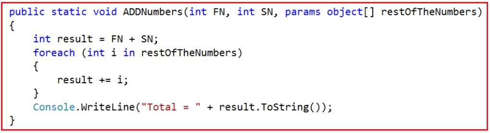

متد ADDNumbers فوق به کاربر اجازه می‌دهد تا دو یا چند عدد را اضافه کند. پارامترهای FN و SN پارامترهای اجباری هستند در حالی که پارامتر restOfTheNumbers اختیاری است. اگر کاربر بخواهد فقط دو عدد را اضافه کند، می‌تواند متد را مطابق شکل زیر فراخوانی کند.
**ADDNumbers(10, 20);**
از طرف دیگر، اگر کاربر بخواهد ۵ عدد را جمع کند، می‌تواند متد را به دو روش زیر فراخوانی کند.
**ADDNumbers(10, 20, 30, 40, 50);**
**یا**
**ADDNumbers(10, 20, new object[]{30, 40, 50});**

آرایه پارامتر باید آخرین پارامتر در لیست پارامترهای رسمی باشد. تابع زیر به عنوان آرایه پارامتر کامپایل نمی‌شود، نه آخرین پارامتر لیست پارامترها.

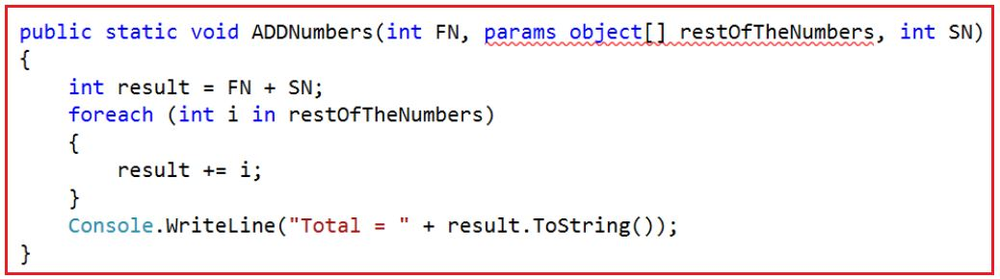

##### **مثال برای درک آرایه پارامتر برای ایجاد پارامتر اختیاری در سی شارپ:**

در مثال زیر، ما متد ADDNumbers را برای جمع دو یا چند عدد صحیح ایجاد می‌کنیم. در لیست پارامترهای متد ADDNumbers، دو پارامتر اول اجباری و پارامتر آخر اختیاری است. و برای آن پارامتر اختیاری، می‌توانیم 0 یا n مقدار ارسال کنیم. همانطور که در مثال زیر نشان داده شده است، ما متد ADDNumbers را با ارسال دو و پنج آرگومان فراخوانی می‌کنیم.

```csharp
using System;

namespace OptionalParameter
{
    class Program
    {
        static void Main(string[] args)
        {
            ADDNumbers(10, 20);
            ADDNumbers(10, 20, 30, 40);
            ADDNumbers(10, 20, new object[] { 30, 40, 50 });
            Console.ReadLine();
        }

        public static void ADDNumbers(int FN, int SN, params object[] restOfTheNumbers)
        {
            int result = FN + SN;
            foreach (int i in restOfTheNumbers)
            {
                result += i;
            }
            Console.WriteLine("Total = " + result.ToString());
        }
    }
}
```

###### **خروجی:**

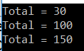

##### **استفاده از سربارگذاری متد برای ایجاد پارامتر اختیاری در سی شارپ:**

بیایید بفهمیم که چگونه می‌توان پارامترهای متد را با استفاده از سربارگذاری متد در سی‌شارپ اختیاری کرد. بیایید متد زیر را ایجاد کنیم که هر تعداد عدد صحیح را جمع می‌کند. در اینجا، دو پارامتر اول را به عنوان عدد صحیح و پارامتر سوم را به عنوان یک آرایه عدد صحیح ایجاد کردیم. دو پارامتر اول اجباری هستند و در مورد پارامتر سوم، اگر نمی‌خواهید هیچ مقداری ارسال کنید، کافیست مقدار null را ارسال کنید.

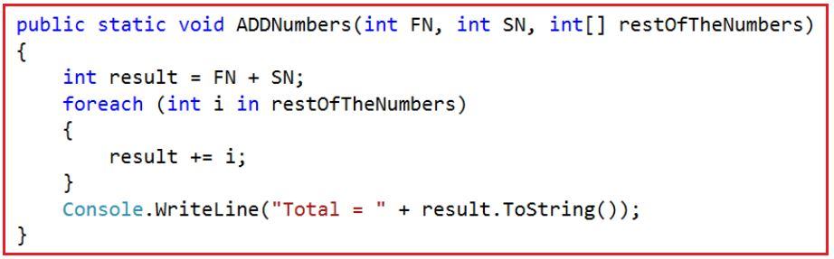

اگر می‌خواهید ۵ عدد صحیح، مثلاً ۱۰، ۲۰، ۳۰، ۴۰ و ۵۰ را با هم جمع کنید، باید متد را به صورت زیر فراخوانی کنید.
**ADDNumbers(10, 20, new int[]{30, 40, 50});**
در حال حاضر هر سه پارامتر متد اجباری هستند. حال اگر بخواهم فقط دو عدد را جمع کنم، باید متد را به صورت زیر فراخوانی کنم.
**ADDNumbers(10, 20, null);**
توجه داشته باشید که در اینجا مقدار null را به عنوان آرگومان برای پارامتر سوم ارسال می‌کنم. می‌توانیم با سربارگذاری تابع ADDNumbers() که دو پارامتر می‌گیرد، همانطور که در زیر نشان داده شده است، پارامتر سوم را اختیاری کنیم.

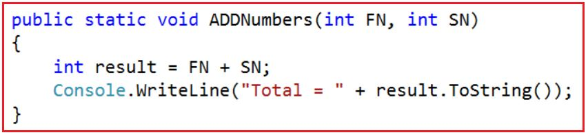

حالا، ما دو نسخه سربارگذاری شده از تابع ADDNumbers() داریم. اگر بخواهیم فقط دو عدد را با هم جمع کنیم، می‌توانیم از نسخه سربارگذاری شده تابع ADDNumbers() استفاده کنیم که دو پارامتر به شرح زیر می‌گیرد.
**ADDNumbers(10, 20);**
به طور مشابه، اگر بخواهیم ۳ عدد یا بیشتر را جمع کنیم، می‌توانیم از نسخه سربارگذاری شده دیگر تابع ADDNumbers() استفاده کنیم که ۳ پارامتر به شرح زیر می‌گیرد.
**ADDNumbers(10, 20, new int[] { 30, 40 });**

##### **مثال برای درک سربارگذاری متد برای ایجاد پارامتر اختیاری در سی شارپ:**

در مثال زیر ما از مفهوم سربارگذاری متد (Method Overloading) برای اختیاری کردن پارامترهای متد استفاده می‌کنیم. همانطور که می‌بینید، دو نسخه سربارگذاری شده از متد ADDNumbers ایجاد کرده‌ایم. یک نسخه سربارگذاری شده دو پارامتر می‌گیرد که قرار است دو عدد صحیح را جمع کند و نسخه سربارگذاری شده دیگر سه پارامتر می‌گیرد که قرار است بیش از دو عدد صحیح را جمع کند.

```csharp
using System;

namespace OptionalParameter
{
    class Program
    {
        static void Main(string[] args)
        {
            ADDNumbers(10, 20);
            ADDNumbers(10, 20, new int[] { 30, 40, 50 });

            Console.ReadLine();
        }

        public static void ADDNumbers(int FN, int SN, int[] restOfTheNumbers)
        {
            int result = FN + SN;
            foreach (int i in restOfTheNumbers)
            {
                result += i;
            }
            Console.WriteLine("Total = " + result.ToString());
        }

        public static void ADDNumbers(int FN, int SN)
        {
            int result = FN + SN;
            Console.WriteLine("Total = " + result.ToString());
        }
    }
}
```

###### **خروجی:**

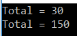

##### **اختیاری کردن پارامترهای متد با تعیین پارامترهای پیش‌فرض در سی شارپ:**

بیایید بفهمیم که چگونه پارامترهای پیش‌فرض را برای اختیاری کردن پارامترهای متد make در سی‌شارپ مشخص کنیم. می‌توانیم با تعیین مقدار پیش‌فرض برای پارامتر نشان داده شده در تصویر زیر، پارامتر متد را اختیاری کنیم. همانطور که در تصویر زیر مشاهده می‌کنید، پارامتر سوم را با تعیین مقدار پیش‌فرض null اختیاری کرده‌ایم. در اینجا، پارامترهای اول و دوم پارامترهای اجباری هستند در حالی که پارامتر سوم یک پارامتر اختیاری است.

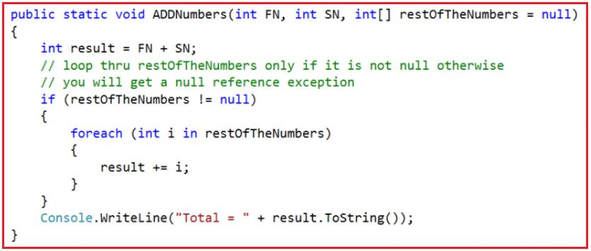

از آنجایی که برای پارامتر سوم مقدار پیش‌فرض تعیین کرده‌ایم، اکنون این پارامتر اختیاری می‌شود. بنابراین، اگر بخواهیم فقط ۲ عدد را جمع کنیم، می‌توانیم متد را به صورت زیر فراخوانی کنیم.
**ADDNumbers(10, 20);**
از طرف دیگر، اگر بخواهیم ۳ عدد یا بیشتر را جمع کنیم، می‌توانیم متد ADDNumbers() را به صورت زیر فراخوانی کنیم.
**ADDNumbers(10, 20, new int[] { 30, 40 });**
پارامترهای اختیاری در سی شارپ باید بعد از تمام پارامترهای الزامی ظاهر شوند. متد زیر کامپایل نخواهد شد. دلیل این امر این است که ما پارامتر restOfTheNumbers را اختیاری قرار می‌دهیم، اما قبل از پارامترهای الزامی "SN" ظاهر می‌شود.

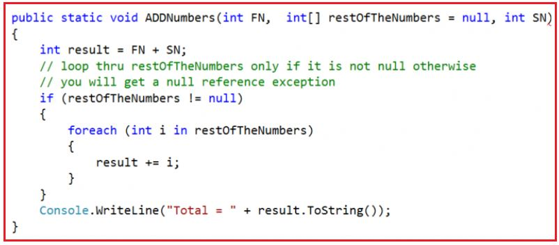

##### **مثال برای درک** **پارامترهای متد اختیاری با تعیین پارامترهای پیش‌فرض** **:**

در مثال زیر، ما پارامترهای متد را با مشخص کردن مقدار پیش‌فرض پارامتر هنگام تعریف پارامتر، اختیاری می‌کنیم. همانطور که می‌بینید، متد ADDNumbers سه پارامتر می‌گیرد. دو پارامتر اول اجباری و پارامتر آخر اختیاری است زیرا ما مقدار پیش‌فرض را برای پارامتر سوم تعیین می‌کنیم.

```csharp
using System;

namespace OptionalParameter
{
    class Program
    {
        static void Main(string[] args)
        {
            // Adding two Integer Numbers
            ADDNumbers(10, 20);

            // Adding Five Integer Numbers
            ADDNumbers(10, 20, new int[] { 30, 40, 50 });

            Console.ReadLine();
        }

        public static void ADDNumbers(int FN, int SN, int[] restOfTheNumbers = null)
        {
            int result = FN + SN;
            // Loop through the restOfTheNumbers only if it is not null
            // else we will get runtime error
            if (restOfTheNumbers != null)
            {
                foreach (int i in restOfTheNumbers)
                {
                    result += i;
                }
            }

            Console.WriteLine("Total = " + result.ToString());
        }
    }
}
```

##### **پارامترهای نامگذاری شده در سی شارپ:**

پارامترهای نامگذاری شده در سی شارپ به توسعه دهندگان این امکان را می دهند که آرگومان های متد را با نام پارامترها ارسال کنند. برای درک بهتر، لطفاً به کد زیر نگاهی بیندازید. در روش زیر، پارامترهای "b" و "c" اختیاری هستند.

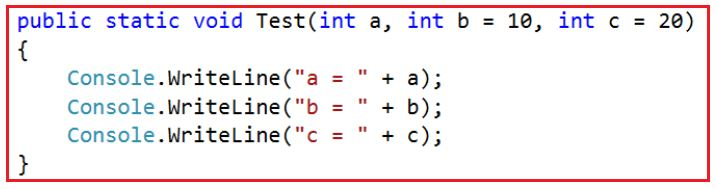

وقتی متد بالا را همانطور که در زیر نشان داده شده است فراخوانی می‌کنیم، به طور پیش‌فرض عدد ۱ به عنوان آرگومان برای پارامتر a و عدد ۲ به عنوان آرگومان برای پارامتر b ارسال می‌شود.
**Test(1, 2);**

قصد من این است که عدد ۲ را به عنوان آرگومان برای پارامتر c ارسال کنم. برای رسیدن به این هدف، می‌توانیم از پارامترهای نامگذاری شده، همانطور که در زیر نشان داده شده است، استفاده کنیم. توجه داشته باشید که من نام پارامتری را که مقدار ۲ برای آن ارسال می‌شود، مشخص کرده‌ام.
**Test(1, c: 2);**

##### **مثال برای درک پارامترهای نامگذاری شده در سی شارپ:**

مثال کامل در زیر آورده شده است. در مثال زیر، ما از پارامتر نامگذاری شده هنگام ارسال آرگومان برای متد استفاده می‌کنیم. با پارامتر نامگذاری شده، ترتیب ارسال مقدار مهم نیست.

```csharp
using System;

namespace NamedParameter
{
    class Program
    {
        static void Main(string[] args)
        {
            // Using Named Parameter while calling Method
            Test(1, 2); // a = 1 and b = 2 and c = 20 by default value
            Test(1, c: 2); // a = 1 and b = 10 by default and c = 2

            // Order is not Important with Named Parameter
            Test(b: 1, c: 2, a: 10);
            Console.ReadLine();
        }

        public static void Test(int a, int b = 10, int c = 20)
        {
            Console.WriteLine($"a = {a}, b = {b}, c= {c}");
        }
    }
}
```

###### **خروجی:**

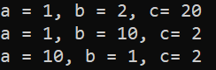

##### **نحوه اختیاری کردن پارامتر با استفاده از OptionalAttribute در سی شارپ:**

بیایید بفهمیم که چگونه می‌توان پارامترهای متد را با استفاده از **OptionalAttribute** در C# که در **فضای نام System.Runtime.InteropServices** موجود است، اختیاری کرد. لطفاً به تابع زیر نگاهی بیندازید. در اینجا، پارامتر سوم را با ویژگی Optional تزئین می‌کنیم که این پارامتر را اختیاری می‌کند.

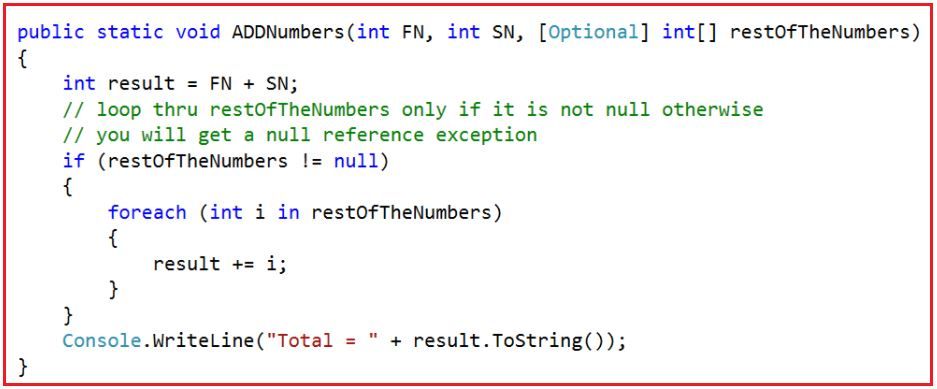

در اینجا ما با استفاده از ویژگی [Optional]، restOfTheNumbers را اختیاری می‌کنیم. حال، اگر بخواهیم فقط ۲ عدد را جمع کنیم، می‌توانیم متد ADDNumbers را به صورت زیر فراخوانی کنیم.
**ADDNumbers(10, 20);**
از طرف دیگر، اگر می‌خواهید ۳ عدد یا بیشتر را جمع کنید، می‌توانید متد ADDNumbers() را به صورت زیر فراخوانی کنید.
**ADDNumbers(10, 20, new int[] { 30, 40 });**

###### **مثال کامل در زیر آورده شده است.**

```csharp
using System;
using System.Runtime.InteropServices;

namespace OptionalParameter
{
    class Program
    {
        static void Main(string[] args)
        {
            ADDNumbers(10, 20);
            ADDNumbers(10, 20, new int[] { 30, 40, 50 });

            Console.ReadLine();
        }

        public static void ADDNumbers(int FN, int SN, [Optional] int[] restOfTheNumbers)
        {
            int result = FN + SN;
            // loop thru restOfTheNumbers only if it is not null otherwise
            // you will get a null reference exception
            if (restOfTheNumbers != null)
            {
                foreach (int i in restOfTheNumbers)
                {
                    result += i;
                }
            }
            Console.WriteLine("Total = " + result.ToString());
        }
    }
}
```

###### **خروجی:**

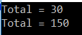