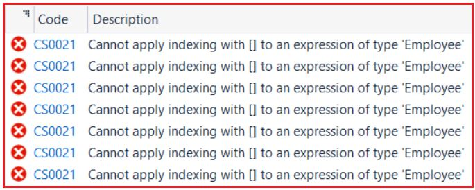
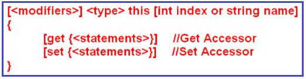
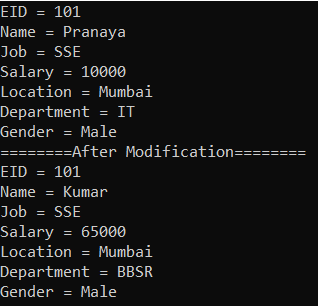
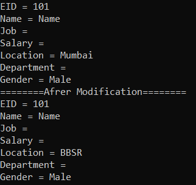
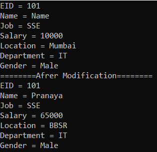

## **اندیس‌گذارها در سی‌شارپ به همراه مثال**

در این مقاله، قصد دارم در مورد **Indexerها در سی شارپ** به همراه مثال‌هایی بحث کنم. لطفاً مقاله قبلی ما را که در آن در مورد نحوه ایجاد پارامترهای اختیاری در سی شارپ بحث کردیم، مطالعه کنید. به عنوان بخشی از این مقاله، در مورد اینکه Indexerها چه هستند و چگونه می‌توان آنها را در سی شارپ ایجاد و استفاده کرد، بحث خواهیم کرد.

##### **اندیس‌گذارها در سی‌شارپ چیستند؟**

اندیس‌گذار در سی‌شارپ (C#) یک ویژگی از کلاس است که به ما امکان دسترسی به یک متغیر عضو از یک کلاس را با استفاده از ویژگی‌های یک آرایه می‌دهد. این بدان معناست که اندیس‌گذارها در سی‌شارپ اعضای یک کلاس هستند و اگر اندیس‌گذارها را در یک کلاس تعریف کنیم، آن کلاس مانند یک آرایه مجازی رفتار می‌کند.

بنابراین، اندیس‌گذارها در سی‌شارپ به نمونه‌هایی از یک کلاس اجازه می‌دهند درست مانند آرایه‌ها اندیس‌گذاری شوند. مقدار اندیس‌گذاری شده را می‌توان بدون مشخص کردن صریح نوع یا عضو نمونه، تنظیم یا بازیابی کرد. اگر در حال حاضر این موضوع برایتان واضح نیست، نگران نباشید، ما این مفهوم را با مثال‌هایی درک خواهیم کرد.

##### **مثالی برای درک Indexer ها در سی شارپ**

بیایید با یک مثال، Indexers را در C# درک کنیم. یک برنامه کنسول جدید با نام IndexersDemo ایجاد کنید. سپس یک فایل کلاس جدید با نام **Employee.cs** ایجاد کنید و کد زیر را در آن کپی و جایگذاری کنید. کلاس زیر بسیار سرراست است. ما فقط برخی از ویژگی‌ها را اعلام می‌کنیم و آنها را از طریق سازنده کلاس مقداردهی اولیه می‌کنیم.

```csharp
namespace IndexersDemo
{
    public class Employee
    {
        //Declare the Properties
        public int ID { get; set; }
        public string Name { get; set; }
        public string Job { get; set; }
        public double Salary { get; set; }
        public string Location { get; set; }
        public string Department { get; set; }
        public string Gender { get; set; }

        //Initialize the Properties through Constructor
        public Employee(int ID, string Name, string Job, int Salary, string Location,
                        string Department, string Gender)
        {
            this.ID = ID;
            this.Name = Name;
            this.Job = Job;
            this.Salary = Salary;
            this.Location = Location;
            this.Department = Department;
            this.Gender = Gender;
        }
    }
}
```

بیایید سعی کنیم یک نمونه از کلاس Employee بالا ایجاد کنیم و سعی کنیم شیء employee را مانند یک آرایه مصرف کنیم. بیایید متد Main کلاس Program را مانند زیر تغییر دهیم. همانطور که در کد زیر مشاهده می‌کنید، ابتدا یک نمونه از کلاس Employee ایجاد می‌کنیم و سپس سعی می‌کنیم با استفاده از موقعیت‌های اندیس به داده‌های Employee دسترسی پیدا کنیم.

```csharp
using System;

namespace IndexersDemo
{
    class Program
    {
        static void Main(string[] args)
        {
            //Creating the Employee instance
            Employee emp = new Employee(101, "Pranaya", "SSE", 10000, "Mumbai", "IT", "Male");

            //Accessing Employee Properties using Indexers i.e. using Index positions
            Console.WriteLine("EID = " + emp[0]);
            Console.WriteLine("Name = " + emp[1]);
            Console.WriteLine("Job = " + emp[2]);
            Console.WriteLine("Salary = " + emp[3]);
            Console.WriteLine("Location = " + emp[4]);
            Console.WriteLine("Department = " + emp[5]);
            Console.WriteLine("Gender = " + emp[6]);

            Console.ReadLine();
        }
    }
}
```

**حالا وقتی سعی می‌کنید برنامه را بسازید، با خطای زیر مواجه خواهید شد.**



دلیل این امر این است که ما نمی‌توانیم اندیس‌گذاری را مستقیماً روی یک کلاس اعمال کنیم. ما می‌توانیم اندیس‌گذاری را روی یک آرایه انجام دهیم اما نمی‌توانیم همین کار را با یک کلاس تعریف‌شده توسط کاربر مانند Employee انجام دهیم. یک آرایه یک کلاس از پیش تعریف‌شده است و تمام منطق برای اندیس‌گذاری در آن کلاس پیاده‌سازی شده است تا بتوانیم با استفاده از اندیس‌ها به آنها دسترسی داشته باشیم. اما Employee یک کلاس تعریف‌شده توسط کاربر است و ما هیچ منطقی برای دسترسی به کلاس مانند یک آرایه پیاده‌سازی نکرده‌ایم.

اگر می‌خواهید مانند یک آرایه به کلاس دسترسی داشته باشید، ابتدا باید یک اندیس‌گذار (indexer) در کلاس تعریف کنید. پس از تعریف اندیس‌گذار در کلاس، می‌توانید با استفاده از اندیس‌گذار به مقادیر کلاس دسترسی پیدا کنید.

##### **چگونه یک Indexer در سی شارپ تعریف کنیم؟**

در سی شارپ، برای تعریف یک Indexer در یک کلاس تعریف شده توسط کاربر، باید از سینتکس زیر استفاده کنید.



بیایید سینتکس بالا را درک کنیم:

1. **اصلاح‌کننده‌ها (Modifiers)** : اصلاح‌کننده‌ها چیزی جز مشخص‌کننده‌های دسترسی مانند public، private، protected، internal و غیره نیستند.
2. **نوع** : در کلاس ما، از آنجایی که با مقادیر از نوع عدد صحیح (ID)، رشته (نام، شغل، دپارتمان، موقعیت مکانی و جنسیت) و نوع مضاعف (حقوق) سروکار داریم، بنابراین در اینجا باید از نوع به عنوان یک شیء (Object) استفاده کنیم زیرا نوع شیء می‌تواند هر نوع مقداری را برگرداند.
3. **این** : این کلمه کلیدی می‌گوید که ما در حال تعریف یک شاخص‌گذار روی کلاس فعلی هستیم، در این مورد، کلاس فعلی Employee است.
4. **اندیس عدد صحیح یا نام رشته:** اندیس عدد صحیح یا نام رشته برای تعیین اینکه آیا می‌خواهید با استفاده از موقعیت اندیس عدد صحیح به مقادیر دسترسی پیدا کنید یا با استفاده از نام رشته، استفاده می‌شود.
5. **Get و Set:** از تابع دسترسی get برای برگرداندن مقدار و از تابع دسترسی set برای اختصاص دادن مقدار استفاده می‌شود.

**نکته:** اگر سینتکس بالا در حال حاضر برایتان واضح نیست، نگران نباشید، وقتی مثال را بررسی کنیم، قطعاً نحوه ایجاد و استفاده از Indexer در سی شارپ را خواهید فهمید.

##### **مثال برای درک Indexer ها در سی شارپ:**

بیایید یک Indexer روی کلاس Employee برای هر دو accessor get و set ایجاد کنیم. لطفاً **Employee.cs** فایل کلاس را مطابق شکل زیر تغییر دهید . در اینجا، ما یک Indexer با استفاده از **موقعیت شاخص int** ایجاد می‌کنیم تا بتوانیم با استفاده از موقعیت شاخص عدد صحیح آن به عناصر دسترسی پیدا کنیم. بعداً به شما نشان خواهم داد که چگونه Indexer را با استفاده از نام رشته ایجاد کنید. در مورد accessor set، پارامتر "value" به طور ضمنی مقدار اختصاص داده شده را در خود نگه می‌دارد.

```csharp
using System;

namespace IndexersDemo
{
    public class Employee
    {
        //Declare the Properties
        public int ID { get; set; }
        public string Name { get; set; }
        public string Job { get; set; }
        public double Salary { get; set; }
        public string Location { get; set; }
        public string Department { get; set; }
        public string Gender { get; set; }

        //Initialize the Properties through Constructor
        public Employee(int ID, string Name, string Job, int Salary, string Location,
                        string Department, string Gender)
        {
            this.ID = ID;
            this.Name = Name;
            this.Job = Job;
            this.Salary = Salary;
            this.Location = Location;
            this.Department = Department;
            this.Gender = Gender;
        }

        //Creating the Indexer using Integer Index Position
        public object this[int index]
        {
            //Get accessor is used for returning a value
            get
            {
                //based in the index position, return the appropriate property value
                if (index == 0)
                    return ID;
                else if (index == 1)
                    return Name;
                else if (index == 2)
                    return Job;
                else if (index == 3)
                    return Salary;
                else if (index == 4)
                    return Location;
                else if (index == 5)
                    return Department;
                else if (index == 6)
                    return Gender;
                else
                    return null;
            }
            //Set accessor is used to assigning a value
            set
            {
                //based in the index position, set the appropriate property value
                if (index == 0)
                    ID = Convert.ToInt32(value);
                else if (index == 1)
                    Name = value.ToString();
                else if (index == 2)
                    Job = value.ToString();
                else if (index == 3)
                    Salary = Convert.ToDouble(value);
                else if (index == 4)
                    Location = value.ToString();
                else if (index == 5)
                    Department = value.ToString();
                else if (index == 6)
                    Gender = value.ToString();
            }
        }
    }
}
```

حالا، بیایید سعی کنیم به مقادیر مانند یک آرایه دسترسی پیدا کنیم، و همچنین سعی کنیم مقادیر را مانند یک آرایه تغییر دهیم. بنابراین، لطفاً متد Main کلاس Program را مطابق شکل زیر تغییر دهید.

```csharp
using System;

namespace IndexersDemo
{
    class Program
    {
        static void Main(string[] args)
        {
            //Create an Instance of the Employee Class
            Employee emp = new Employee(101, "Pranaya", "SSE", 10000, "Mumbai", "IT", "Male");

            //Access the Employee Object using Indexer i.e. using Integer Index Position
            Console.WriteLine("EID = " + emp[0]);
            Console.WriteLine("Name = " + emp[1]);
            Console.WriteLine("Job = " + emp[2]);
            Console.WriteLine("Salary = " + emp[3]);
            Console.WriteLine("Location = " + emp[4]);
            Console.WriteLine("Department = " + emp[5]);
            Console.WriteLine("Gender = " + emp[6]);

            //Set the Employee Object using Indexer i.e. using Integer Index Position
            emp[1] = "Kumar";
            emp[3] = 65000;
            emp[5] = "BBSR";

            Console.WriteLine("========After Modification========");
            //Access the Employee Object using Indexer i.e. using Integer Index Position
            Console.WriteLine("EID = " + emp[0]);
            Console.WriteLine("Name = " + emp[1]);
            Console.WriteLine("Job = " + emp[2]);
            Console.WriteLine("Salary = " + emp[3]);
            Console.WriteLine("Location = " + emp[4]);
            Console.WriteLine("Department = " + emp[5]);
            Console.WriteLine("Gender = " + emp[6]);

            Console.ReadLine();
        }
    }
}
```

###### **خروجی:**



##### **ایجاد اندیس‌گذار رشته در سی شارپ**

در حالت بلادرنگ، ممکن است ویژگی‌های بیشتری داشته باشیم و دسترسی به مقادیر با استفاده از موقعیت اندیس عدد صحیح بسیار دشوار باشد. بنابراین در چنین مواردی، اغلب اوقات باید با استفاده از نام ویژگی به مقادیر دسترسی پیدا کنیم. برای انجام این کار، باید از یک نام رشته‌ای به جای یک اندیس‌گذار از نوع عدد صحیح استفاده کنیم. بنابراین بیایید کلاس Employee را مطابق شکل زیر تغییر دهیم تا از نام رشته‌ای به عنوان اندیس‌گذار استفاده کند.

```csharp
using System;

namespace IndexersDemo
{
    public class Employee
    {
        //Declare the Properties
        public int ID { get; set; }
        public string Name { get; set; }
        public string Job { get; set; }
        public double Salary { get; set; }
        public string Location { get; set; }
        public string Department { get; set; }
        public string Gender { get; set; }

        //Initialize the Properties through Constructor
        public Employee(int ID, string Name, string Job, int Salary, string Location,
                        string Department, string Gender)
        {
            this.ID = ID;
            this.Name = Name;
            this.Job = Job;
            this.Salary = Salary;
            this.Location = Location;
            this.Department = Department;
            this.Gender = Gender;
        }

        //Creating the Indexer using string Index name
        public object this[string Name]
        {
            //Get accessor is used for returning a value
            get
            {
                //based in the index name, return the appropriate property value
                if (Name == "ID")
                    return ID;
                else if (Name == "Name")
                    return Name;
                else if (Name == "Job")
                    return Job;
                else if (Name == "Salary")
                    return Salary;
                else if (Name == "Location")
                    return Location;
                else if (Name == "Department")
                    return Department;
                else if (Name == "Gender")
                    return Gender;
                else
                    return null;
            }
            //Set accessor is used to assigning a value
            set
            {
                //based in the index name, set the appropriate property value
                if (Name == "ID")
                    ID = Convert.ToInt32(value);
                else if (Name == "Name")
                    Name = value.ToString();
                else if (Name == "Job")
                    Job = value.ToString();
                else if (Name == "Salary")
                    Salary = Convert.ToDouble(value);
                else if (Name == "Location")
                    Location = value.ToString();
                else if (Name == "Department")
                    Department = value.ToString();
                else if (Name == "Gender")
                    Gender = value.ToString();
            }
        }
    }
}
```

**در مرحله بعد، متد Main از کلاس Program را مطابق شکل زیر تغییر دهید تا از String Indexer که درون کلاس Employee ایجاد کرده‌ایم، استفاده کند.**

```csharp
using System;

namespace IndexersDemo
{
    class Program
    {
        static void Main(string[] args)
        {
            //Create an Instance of the Employee Class
            Employee emp = new Employee(101, "Pranaya", "SSE", 10000, "Mumbai", "IT", "Male");

            //Access the Employee Object using Indexer i.e. using string Index name
            Console.WriteLine("EID = " + emp["ID"]);
            Console.WriteLine("Name = " + emp["Name"]);
            Console.WriteLine("Job = " + emp["job"]);
            Console.WriteLine("Salary = " + emp["salary"]);
            Console.WriteLine("Location = " + emp["Location"]);
            Console.WriteLine("Department = " + emp["department"]);
            Console.WriteLine("Gender = " + emp["Gender"]);

            //Set the Employee Object using Indexer i.e. using string Index name
            emp["Name"] = "Kumar";
            emp["salary"] = 65000;
            emp["Location"] = "BBSR";

            Console.WriteLine("========After Modification========");

            //Access the Employee Object using Indexer i.e. using string Index name
            Console.WriteLine("EID = " + emp["ID"]);
            Console.WriteLine("Name = " + emp["Name"]);
            Console.WriteLine("Job = " + emp["job"]);
            Console.WriteLine("Salary = " + emp["salary"]);
            Console.WriteLine("Location = " + emp["Location"]);
            Console.WriteLine("Department = " + emp["department"]);
            Console.WriteLine("Gender = " + emp["Gender"]);

            Console.ReadLine();
        }
    }
}
```

###### **خروجی:**



همانطور که می‌بینید، ما داده‌های مربوط به ویژگی‌های شغل، حقوق و دپارتمان را دریافت نمی‌کنیم. دلیل این امر این است که شاخص‌ها در C# به حروف بزرگ و کوچک حساس هستند. برای دریافت یا تنظیم صحیح داده‌ها، یا باید نام شاخص را به حروف بزرگ یا کوچک تبدیل کنیم یا باید از نام رشته‌ای شاخص به درستی استفاده کنیم. برای انجام این کار، کلاس Employee را مطابق شکل زیر تغییر دهید و در اینجا نام شاخص را به حروف بزرگ تبدیل می‌کنیم.

```csharp
using System;

namespace IndexersDemo
{
    public class Employee
    {
        //Declare the Properties
        public int ID { get; set; }
        public string Name { get; set; }
        public string Job { get; set; }
        public double Salary { get; set; }
        public string Location { get; set; }
        public string Department { get; set; }
        public string Gender { get; set; }

        //Initialize the Properties through Constructor
        public Employee(int ID, string Name, string Job, int Salary, string Location,
                        string Department, string Gender)
        {
            this.ID = ID;
            this.Name = Name;
            this.Job = Job;
            this.Salary = Salary;
            this.Location = Location;
            this.Department = Department;
            this.Gender = Gender;
        }

        //Creating the Indexer using string Index name
        public object this[string Name]
        {
            //Get accessor is used for returning a value
            get
            {
                //based in the index name, return the appropriate property value
                if (Name.ToUpper() == "ID")
                    return ID;
                else if (Name.ToUpper() == "NAME")
                    return Name;
                else if (Name.ToUpper() == "JOB")
                    return Job;
                else if (Name.ToUpper() == "SALARY")
                    return Salary;
                else if (Name.ToUpper() == "LOCATION")
                    return Location;
                else if (Name.ToUpper() == "DEPARTMENT")
                    return Department;
                else if (Name.ToUpper() == "GENDER")
                    return Gender;
                else
                    return null;
            }
            //Set accessor is used to assigning a value
            set
            {
                //based in the index name, set the appropriate property value
                if (Name.ToUpper() == "ID")
                    ID = Convert.ToInt32(value);
                else if (Name.ToUpper() == "NAME")
                    Name = value.ToString();
                else if (Name.ToUpper() == "JOB")
                    Job = value.ToString();
                else if (Name.ToUpper() == "SALARY")
                    Salary = Convert.ToDouble(value);
                else if (Name.ToUpper() == "LOCATION")
                    Location = value.ToString();
                else if (Name.ToUpper() == "DEPARTMENT")
                    Department = value.ToString();
                else if (Name.ToUpper() == "GENDER")
                    Gender = value.ToString();
            }
        }
    }
}
```

اکنون، با اعمال تغییرات فوق، برنامه را اجرا کنید و خروجی مورد انتظار را دریافت خواهید کرد.

##### **سربارگذاری شاخص‌گذار در سی‌شارپ:**

همچنین در سی شارپ می‌توان اندیس‌گذارها را در یک کلاس overload کرد. این بدان معناست که می‌توانیم چندین اندیس‌گذار را در یک کلاس با انواع داده مختلف برای اندیس تعریف کنیم. برای درک بهتر، لطفاً فایل کلاس Employee.cs را به صورت زیر تغییر دهید. همانطور که در کد زیر مشاهده می‌کنید، در اینجا دو اندیس‌گذار با اندیس از نوع int و همچنین اندیس از نوع string داریم.

```csharp
using System;

namespace IndexersDemo
{
    public class Employee
    {
        //Declare the Properties
        public int ID { get; set; }
        public string Name { get; set; }
        public string Job { get; set; }
        public double Salary { get; set; }
        public string Location { get; set; }
        public string Department { get; set; }
        public string Gender { get; set; }

        //Initialize the Properties through Constructor
        public Employee(int ID, string Name, string Job, int Salary, string Location,
                        string Department, string Gender)
        {
            this.ID = ID;
            this.Name = Name;
            this.Job = Job;
            this.Salary = Salary;
            this.Location = Location;
            this.Department = Department;
            this.Gender = Gender;
        }

        //Creating the Indexer using Integer Index Position
        public object this[int index]
        {
            //Get accessor is used for returning a value
            get
            {
                //based in the index position, return the appropriate property value
                if (index == 0)
                    return ID;
                else if (index == 1)
                    return Name;
                else if (index == 2)
                    return Job;
                else if (index == 3)
                    return Salary;
                else if (index == 4)
                    return Location;
                else if (index == 5)
                    return Department;
                else if (index == 6)
                    return Gender;
                else
                    return null;
            }
            //Set accessor is used to assigning a value
            set
            {
                //based in the index position, set the appropriate property value
                if (index == 0)
                    ID = Convert.ToInt32(value);
                else if (index == 1)
                    Name = value.ToString();
                else if (index == 2)
                    Job = value.ToString();
                else if (index == 3)
                    Salary = Convert.ToDouble(value);
                else if (index == 4)
                    Location = value.ToString();
                else if (index == 5)
                    Department = value.ToString();
                else if (index == 6)
                    Gender = value.ToString();
            }
        }

        //Creating the Indexer using string Index name
        public object this[string Name]
        {
            //Get accessor is used for returning a value
            get
            {
                //based in the index name, return the appropriate property value
                if (Name.ToUpper() == "ID")
                    return ID;
                else if (Name.ToUpper() == "NAME")
                    return Name;
                else if (Name.ToUpper() == "JOB")
                    return Job;
                else if (Name.ToUpper() == "SALARY")
                    return Salary;
                else if (Name.ToUpper() == "LOCATION")
                    return Location;
                else if (Name.ToUpper() == "DEPARTMENT")
                    return Department;
                else if (Name.ToUpper() == "GENDER")
                    return Gender;
                else
                    return null;
            }
            //Set accessor is used to assigning a value
            set
            {
                //based in the index name, set the appropriate property value
                if (Name.ToUpper() == "ID")
                    ID = Convert.ToInt32(value);
                else if (Name.ToUpper() == "NAME")
                    Name = value.ToString();
                else if (Name.ToUpper() == "JOB")
                    Job = value.ToString();
                else if (Name.ToUpper() == "SALARY")
                    Salary = Convert.ToDouble(value);
                else if (Name.ToUpper() == "LOCATION")
                    Location = value.ToString();
                else if (Name.ToUpper() == "DEPARTMENT")
                    Department = value.ToString();
                else if (Name.ToUpper() == "GENDER")
                    Gender = value.ToString();
            }
        }
    }
}
```

سپس متد اصلی کلاس Program را مطابق شکل زیر تغییر دهید. در کد زیر، ما یک نمونه از کلاس Employee ایجاد کرده‌ایم و با استفاده از اندیس‌های رشته‌ای و عدد صحیح به شیء Employee دسترسی پیدا می‌کنیم.

```csharp
using System;

namespace IndexersDemo
{
    class Program
    {
        static void Main(string[] args)
        {
            //Create an Instance of the Employee Class
            Employee emp = new Employee(101, "Pranaya", "SSE", 10000, "Mumbai", "IT", "Male");

            //Access the Employee Object using Indexer i.e. using string Index name
            Console.WriteLine("EID = " + emp["ID"]);
            Console.WriteLine("Name = " + emp["Name"]);
            Console.WriteLine("Job = " + emp["job"]);
            Console.WriteLine("Salary = " + emp["salary"]);
            Console.WriteLine("Location = " + emp["Location"]);
            Console.WriteLine("Department = " + emp["department"]);
            Console.WriteLine("Gender = " + emp["Gender"]);

            //Set the Employee Object using Indexer i.e. using string Index name
            emp["Name"] = "Kumar";
            emp["salary"] = 65000;
            emp["Location"] = "BBSR";

            Console.WriteLine("========After Modification========");

            //Access the Employee Object using Indexer i.e. using Integer Index Position
            Console.WriteLine("EID = " + emp[0]);
            Console.WriteLine("Name = " + emp[1]);
            Console.WriteLine("Job = " + emp[2]);
            Console.WriteLine("Salary = " + emp[3]);
            Console.WriteLine("Location = " + emp[4]);
            Console.WriteLine("Department = " + emp[5]);
            Console.WriteLine("Gender = " + emp[6]);

            Console.ReadLine();
        }
    }
}
```

###### **خروجی:**

