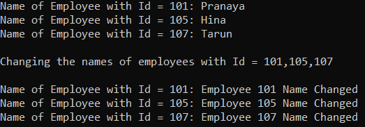
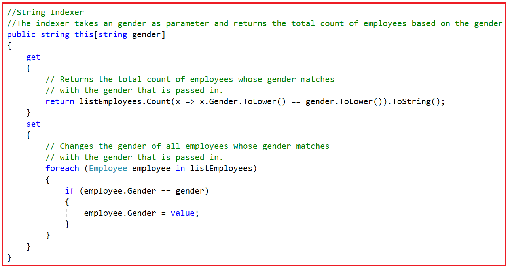
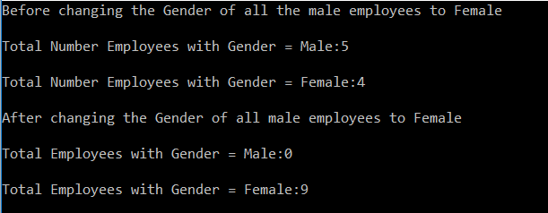

## **مثال بلادرنگ Indexers در سی شارپ**

در این مقاله، قصد دارم به بررسی **مثال‌های بلادرنگ Indexerها در سی‌شارپ** بپردازم. لطفاً مقاله‌ی قبلی ما را که در آن به بررسی چیستی Indexerها و نحوه‌ی ایجاد و استفاده از Indexerها در سی‌شارپ به همراه مثال پرداختیم، مطالعه کنید. همانطور که در مقاله‌ی قبلی خود بحث کردیم، Indexer عضوی از یک کلاس است که امکان اندیس‌گذاری یک شیء (یعنی نمونه) را مانند یک آرایه فراهم می‌کند.

##### **مثال بلادرنگ Indexer در سی شارپ:**

بیایید با یک مثال بلادرنگ در سی شارپ، Indexer ها را درک کنیم. ابتدا یک فایل کلاس با نام **Employee.cs** ایجاد کنید و سپس کد زیر را کپی و در آن جایگذاری کنید. این یک کلاس بسیار ساده است که چهار ویژگی دارد.

```csharp
namespace IndexersDemo
{
    public class Employee
    {
        public int EmployeeId { get; set; }
        public string Name { get; set; }
        public string Gender { get; set; }
        public double Salary { get; set; }
    }
}
```

سپس، یک فایل کلاس دیگر با نام **Company.cs** ایجاد کنید و سپس کد زیر را در کلاس کپی و جایگذاری کنید. در کد زیر، ابتدا یک متغیر به نام listEmployees برای نگهداری لیستی از Employees ایجاد می‌کنیم. در سازنده کلاس، با اضافه کردن کارمندان به لیست، متغیر listEmployees را مقداردهی اولیه می‌کنیم. سپس با استفاده از کلمه کلیدی **this یک شاخص عدد صحیح ایجاد می‌کنیم.** شاخص، employeeId را به عنوان پارامتر می‌گیرد و نام کارمند را برمی‌گرداند. درست مانند ویژگی‌ها، شاخص‌ها هم accessorهای get و set دارند. accessor get برای برگرداندن مقدار استفاده می‌شود در حالی که accessor set برای اختصاص یک مقدار استفاده می‌شود. کد مثال زیر خود توضیح است، بنابراین لطفاً برای درک بهتر، خطوط کامنت را مطالعه کنید.

```csharp
using System.Collections.Generic;
using System.Linq;

namespace IndexersDemo
{
    public class Company
    {
        // Create a variable to hold list of Employees
        private List<Employee> listEmployees = new List<Employee>();

        // Through the constructor initialize the listEmployees variable
        public Company()
        {
            listEmployees.Add(new Employee { EmployeeId = 101, Name = "Pranaya", Gender = "Male", Salary = 1000 });
            listEmployees.Add(new Employee { EmployeeId = 102, Name = "Preety", Gender = "Female", Salary = 2000 });
            listEmployees.Add(new Employee { EmployeeId = 103, Name = "Anurag", Gender = "Male", Salary = 5000 });
            listEmployees.Add(new Employee { EmployeeId = 104, Name = "Priyanka", Gender = "Female", Salary = 4000 });
            listEmployees.Add(new Employee { EmployeeId = 105, Name = "Hina", Gender = "Female", Salary = 3000 });
            listEmployees.Add(new Employee { EmployeeId = 106, Name = "Sambit", Gender = "Male", Salary = 6000 });
            listEmployees.Add(new Employee { EmployeeId = 107, Name = "Tarun", Gender = "Male", Salary = 8000 });
            listEmployees.Add(new Employee { EmployeeId = 108, Name = "Santosh", Gender = "Male", Salary = 7000 });
            listEmployees.Add(new Employee { EmployeeId = 109, Name = "Trupti", Gender = "Female", Salary = 5000 });
        }

        // Integer Indexer
        // The indexer takes an employeeId as parameter and returns the employee name
        public string this[int employeeId]
        {
            get
            {
                // Using get accessor return the name of the Employee
                return listEmployees.FirstOrDefault(x => x.EmployeeId == employeeId).Name;
            }
            set
            {
                // Using set accessor set the name of the Employee
                listEmployees.FirstOrDefault(x => x.EmployeeId == employeeId).Name = value;
            }
        }
    }
}
```

در مرحله بعد، متد Main کلاس Program را مطابق شکل زیر تغییر دهید. در کد زیر، ابتدا یک نمونه از کلاس Company ایجاد می‌کنیم و سپس با استفاده از Integer Indexer شیء Company و با ارسال شناسه Employee به نام Employee دسترسی پیدا می‌کنیم. مجدداً، با استفاده از Company Indexer، نام Employee را تنظیم می‌کنیم. کد مثال زیر نیازی به توضیح ندارد، بنابراین لطفاً برای درک بهتر، به توضیحات داخل خطوط توضیحات مراجعه کنید.

```csharp
using System;

namespace IndexersDemo
{
    class Program
    {
        static void Main(string[] args)
        {
            // Create an Instance of the Company class
            Company company = new Company();

            // Accessing the Name of the Employee using Integer Indexer of Company Object
            Console.WriteLine("Name of Employee with Id = 101: " + company[101]);
            Console.WriteLine("Name of Employee with Id = 105: " + company[105]);
            Console.WriteLine("Name of Employee with Id = 107: " + company[107]);

            Console.WriteLine();

            Console.WriteLine("Changing the names of employees with Id = 101,105,107");
            // Setting the Name of the Employee using Integer Indexer of Company Object
            company[101] = "Employee 101 Name Changed";
            company[105] = "Employee 105 Name Changed";
            company[107] = "Employee 107 Name Changed";
            Console.WriteLine();

            // Accessing the Name of the Employee using Integer Indexer of Company Object
            Console.WriteLine("Name of Employee with Id = 101: " + company[101]);
            Console.WriteLine("Name of Employee with Id = 105: " + company[105]);
            Console.WriteLine("Name of Employee with Id = 107: " + company[107]);

            Console.ReadLine();
        }
    }
}
```

##### **نکاتی که باید به خاطر داشت:**

شناسه‌های EmployeeId مربوط به ۱۰۱، ۱۰۵ و ۱۰۷ به شیء company ارسال می‌شوند تا نام‌های کارمندان مربوطه بازیابی شوند. برای بازیابی نام کارمندان، در اینجا از تابع دسترسی "get" مربوط به indexer استفاده می‌شود. به طور مشابه، برای تغییر نام کارمندان، در اینجا از تابع دسترسی set مربوط به indexer انتگرال که در کلاس Company تعریف شده است، استفاده می‌شود.

**company[101] = "Employee 101 Name Changed";**  
**company[105] = "Employee 105 Name Changed";**  
**company[107] = "Employee 107 Name Changed";**

**بنابراین وقتی کد برنامه فوق را اجرا می‌کنید، خروجی زیر را دریافت خواهید کرد.**



توجه کنید که به دلیل وجود اندیس‌گذار employeeId، اکنون می‌توانیم از شیء company مانند یک آرایه استفاده کنیم.

##### **سربارگذاری شاخص‌گذار در سی شارپ**

ما همچنین می‌توانیم اندیس‌گذارها را در سی‌شارپ Overload کنیم. یعنی می‌توانیم چندین اندیس‌گذار را در کلاس تعریف کنیم. اجازه دهید این موضوع را با یک مثال درک کنیم. در حال حاضر، ما یک اندیس‌گذار عدد صحیح در کلاس Company داریم. حال بیایید یک اندیس‌گذار دیگر بر اساس پارامتر رشته‌ای کلاس Company ایجاد کنیم.



نکته مهمی که باید در نظر داشته باشید این است که اندیس‌گذارها بر اساس تعداد و نوع پارامترها overload می‌شوند. کد کامل کلاس Company در زیر آمده است.

```csharp
using System.Collections.Generic;
using System.Linq;

namespace IndexersDemo
{
    public class Company
    {
        // Create a variable to hold list of Employees
        private List<Employee> listEmployees = new List<Employee>();

        // Through the constructor initialize the listEmployees variable
        public Company()
        {
            listEmployees.Add(new Employee { EmployeeId = 101, Name = "Pranaya", Gender = "Male", Salary = 1000 });
            listEmployees.Add(new Employee { EmployeeId = 102, Name = "Preety", Gender = "Female", Salary = 2000 });
            listEmployees.Add(new Employee { EmployeeId = 103, Name = "Anurag", Gender = "Male", Salary = 5000 });
            listEmployees.Add(new Employee { EmployeeId = 104, Name = "Priyanka", Gender = "Female", Salary = 4000 });
            listEmployees.Add(new Employee { EmployeeId = 105, Name = "Hina", Gender = "Female", Salary = 3000 });
            listEmployees.Add(new Employee { EmployeeId = 106, Name = "Sambit", Gender = "Male", Salary = 6000 });
            listEmployees.Add(new Employee { EmployeeId = 107, Name = "Tarun", Gender = "Male", Salary = 8000 });
            listEmployees.Add(new Employee { EmployeeId = 108, Name = "Santosh", Gender = "Male", Salary = 7000 });
            listEmployees.Add(new Employee { EmployeeId = 109, Name = "Trupti", Gender = "Female", Salary = 5000 });
        }

        // Integer Indexer
        // The indexer takes an employeeId as parameter and returns the employee name
        public string this[int employeeId]
        {
            get
            {
                // Using get accessor return the name of the Employee
                return listEmployees.FirstOrDefault(x => x.EmployeeId == employeeId).Name;
            }
            set
            {
                // Using set accessor set the name of the Employee
                listEmployees.FirstOrDefault(x => x.EmployeeId == employeeId).Name = value;
            }
        }

        // String Indexer
        // The indexer takes a gender as parameter and returns the total count of employees based on the gender
        public string this[string gender]
        {
            get
            {
                // Returns the total count of employees whose gender matches
                // with the gender that is passed in.
                return listEmployees.Count(x => x.Gender.ToLower() == gender.ToLower()).ToString();
            }
            set
            {
                // Changes the gender of all employees whose gender matches
                // with the gender that is passed in.
                foreach (Employee employee in listEmployees)
                {
                    if (employee.Gender == gender)
                    {
                        employee.Gender = value;
                    }
                }
            }
        }
    }
}
```

توجه کنید که اکنون کلاس Company دارای ۲ اندیس‌گذار است. اندیس‌گذار اول دارای یک پارامتر عدد صحیح (employeeId) و اندیس‌گذار دوم دارای یک پارامتر رشته‌ای (gender) است. برای آزمایش اندیس‌گذار رشته‌ای که ایجاد کرده‌ایم، کد زیر را در متد Main کلاس Program مطابق شکل زیر کپی و جای‌گذاری کنید.

```csharp
using System;

namespace IndexersDemo
{
    class Program
    {
        static void Main(string[] args)
        {
            // Create an Instance of the Company Class
            Company company = new Company();

            Console.WriteLine("Before changing the Gender of all the male employees to Female");
            Console.WriteLine();

            // Get accessor of string indexer is invoked to return the total count of male employees
            Console.WriteLine("Total Number Employees with Gender = Male:" + company["Male"]);
            Console.WriteLine();
            Console.WriteLine("Total Number Employees with Gender = Female:" + company["Female"]);
            Console.WriteLine();

            // Set accessor of string indexer is invoked to change the gender all "Male" employees to "Female"
            company["Male"] = "Female";

            Console.WriteLine("After changing the Gender of all male employees to Female");
            Console.WriteLine();
            Console.WriteLine("Total Employees with Gender = Male:" + company["Male"]);
            Console.WriteLine();
            Console.WriteLine("Total Employees with Gender = Female:" + company["Female"]);

            Console.ReadLine();
        }
    }
}
```

**وقتی برنامه را اجرا می‌کنیم، خروجی زیر را به ما می‌دهد.**

