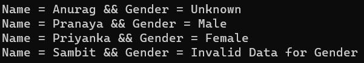
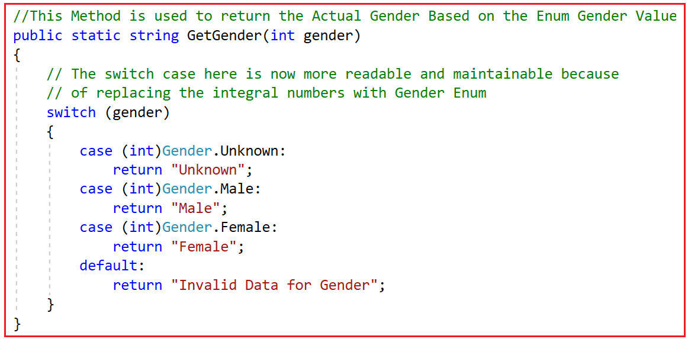
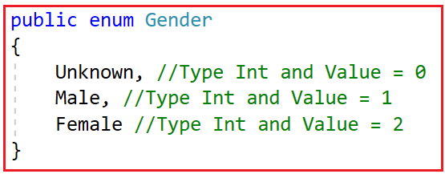
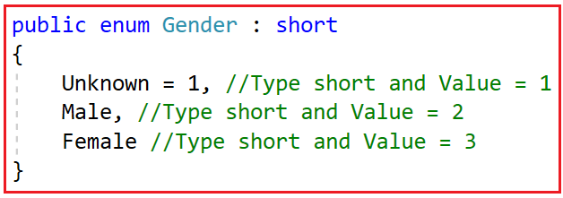
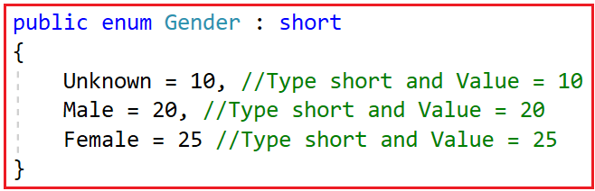
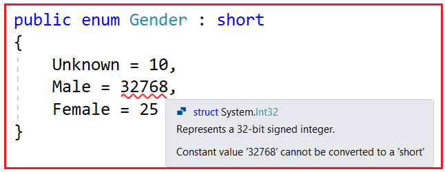
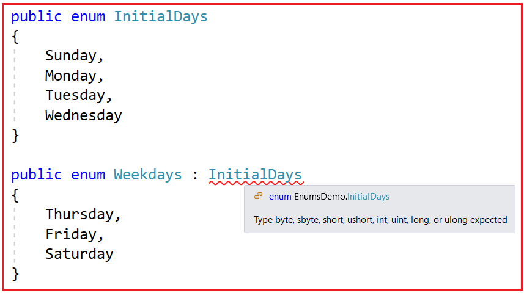
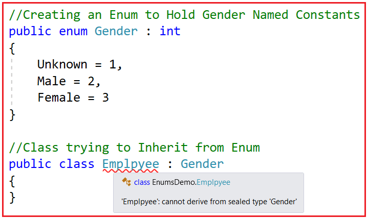
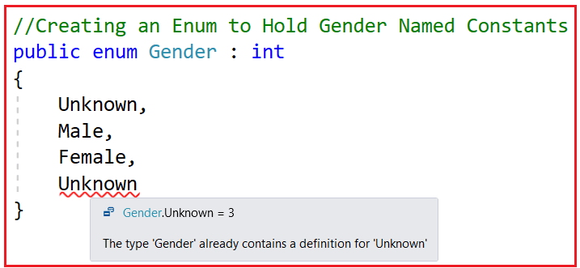

## **Enumها در سی شارپ به همراه مثال**

در این مقاله، قصد دارم **Enumها را در C#** به همراه مثال بررسی کنم. لطفاً مقاله قبلی ما را که در آن در مورد Indexerها در C# به همراه مثال بحث کردیم، مطالعه کنید. در پایان این مقاله، شما خواهید فهمید که Enumها چه هستند و چه زمانی و چگونه می‌توان از Enumها در C# به همراه مثال استفاده کرد.

##### **چرا در سی شارپ به Enum نیاز داریم؟**

Enumها ثابت‌های نام Strongly Typed هستند. بیایید Enumها را بفهمیم، یعنی منظور شما از ثابت‌های نام Strongly Typed چیست، با یک مثال؟ فرض کنید یک کلاس Employee با ویژگی‌های Name و Gender داریم. Gender یک ویژگی عدد صحیح است و مقادیر این ویژگی به شرح زیر است.

1. ۰ جنسیت نامشخص است
2. ۱ نفر مرد است
3. عدد ۲ مونث است

این یعنی اگر مقدار ویژگی جنسیت ۱ باشد، معنی آن جنسیت مرد است، به همین ترتیب، اگر مقدار آن ۲ باشد، معنی آن زن است و برای ۰، معنی آن ناشناخته است. برای درک بهتر، لطفاً به مثال زیر نگاهی بیندازید. کد مثال زیر خود توضیح است، بنابراین لطفاً برای درک بهتر، خطوط نظرات را مطالعه کنید.

```csharp
using System;
using System.Collections.Generic;

namespace EnumsDemo
{
    class Program
    {
        static void Main(string[] args)
        {
            // Create a collection to store list of employees
            List<Employee> empList = new List<Employee>
            {
                new Employee() { Name = "Anurag", Gender = 0 },
                new Employee() { Name = "Pranaya", Gender = 1 },
                new Employee() { Name = "Priyanka", Gender = 2 },
                new Employee() { Name = "Sambit", Gender = 3 }
            };

            // Loop through Each Employees and Print the Name and Gender
            foreach (var emp in empList)
            {
                // To Print the Actual Gender of the Employee,
                // we need to call the GetGender Method by passing the Integer Gender Value
                Console.WriteLine($"Name = {emp.Name} && Gender = {GetGender(emp.Gender)}");
            }

            Console.ReadLine();
        }

        // This Method is used to return the Actual Gender Based on the Integer Gender Value
        public static string GetGender(int gender)
        {
            // The switch case here is less readable because of these integral numbers
            switch (gender)
            {
                case 0:
                    return "Unknown";
                case 1:
                    return "Male";
                case 2:
                    return "Female";
                default:
                    return "Invalid Data for Gender";
            }
        }
    }

    public class Employee
    {
        public string Name { get; set; }

        // 0 - Unknown
        // 1 - Male
        // 2 - Female
        public int Gender { get; set; }
    }
}
```

**وقتی برنامه‌ی فوق را اجرا کنیم، مطابق انتظار، خروجی زیر را دریافت خواهیم کرد.**



نقطه ضعف برنامه فوق، خوانایی کمتر و همچنین قابلیت نگهداری کمتر آن است. دلیل این امر این است که به جای استفاده از enumها برای بدست آوردن جنسیت، بر روی انتگرال‌ها عمل می‌کند. حال بیایید ببینیم چگونه این اعداد انتگرال را با Enumها جایگزین کنیم تا برنامه خوانایی و نگهداری بیشتری داشته باشد. ابتدا، همانطور که در زیر نشان داده شده است، یک enum برای جنسیت ایجاد کنید. برای ایجاد یک Enum در C#، باید از کلمه کلیدی enum و به دنبال آن نام استفاده کنیم و درون آکولادهای ({})، باید ثابت‌های نامگذاری شده را که در تصویر زیر نشان داده شده است، مشخص کنیم.

 در سی شارپ")

همانطور که در تصویر بالا مشاهده می‌کنید، Enum با سه ثابت نام‌گذاری شده یعنی Unknown، Male و Female ایجاد شده است. حال، به جای اعداد صحیح، اجازه دهید از ثابت‌های نام‌گذاری شده‌ی Enum Gender فوق در متد GetGender برای بازگرداندن جنسیت واقعی استفاده کنیم. بنابراین، با Enum Gender، باید متد GetGender را مطابق شکل زیر تغییر دهیم.



همانطور که در کد بالا مشاهده می‌کنید، اکنون ما به جای انتگرال‌های صحیح از Enums استفاده می‌کنیم که باعث خوانایی و قابلیت نگهداری کد می‌شود. بنابراین، مثال کامل در زیر آورده شده است. کد مثال زیر خود توضیح است، بنابراین لطفاً برای درک بهتر، خطوط کامنت را مطالعه کنید.

```csharp
using System;
using System.Collections.Generic;

namespace EnumsDemo
{
    class Program
    {
        static void Main(string[] args)
        {
            // Create a collection to store list of employees
            List<Employee> empList = new List<Employee>
            {
                new Employee() { Name = "Anurag", Gender = 0 },
                new Employee() { Name = "Pranaya", Gender = 1 },
                new Employee() { Name = "Priyanka", Gender = 2 },
                new Employee() { Name = "Sambit", Gender = 3 }
            };

            // Loop through Each Employees and Print the Name and Gender
            foreach (var emp in empList)
            {
                // To Print the Actual Gender of the Employee,
                // we need to call the GetGender Method by passing the Integer Gender Value
                Console.WriteLine($"Name = {emp.Name} && Gender = {GetGender(emp.Gender)}");
            }

            Console.ReadLine();
        }

        // This Method is used to return the Actual Gender Based on the Enum Gender Value
        public static string GetGender(int gender)
        {
            // The switch case here is now more readable and maintainable because
            // of replacing the integral numbers with Gender Enum
            switch (gender)
            {
                case (int)Gender.Unknown:
                    return "Unknown";
                case (int)Gender.Male:
                    return "Male";
                case (int)Gender.Female:
                    return "Female";
                default:
                    return "Invalid Data for Gender";
            }
        }
    }

    public class Employee
    {
        public string Name { get; set; }

        // 0 - Unknown
        // 1 - Male
        // 2 - Female
        public int Gender { get; set; }
    }

    public enum Gender
    {
        Unknown,
        Male,
        Female
    }
}
```

**حالا وقتی برنامه را اجرا کنید، خروجی مورد انتظار را مانند تصویر زیر دریافت خواهید کرد.**


**نکته:** اگر برنامه‌ای از مجموعه‌ای از اعداد صحیح استفاده می‌کند، می‌توانید آن‌ها را با enumها جایگزین کنید که باعث می‌شود برنامه خواناتر و قابل نگهداری‌تر شود. این یعنی اگر یک ویژگی دارید که قرار است اعداد صحیح را در خود نگه دارد و برای هر عدد صحیح یک مقدار رشته‌ای داریم، می‌توانید اعداد صحیح را با Enumها جایگزین کنید.

##### **نکاتی که باید هنگام کار با Enumها در سی شارپ به خاطر داشته باشید:**

1. Enumها، انواع شمارشی (Enumeration) هستند.
2. هستند **نامگذاری‌شده با نوع قوی** **Enumها ثابت‌های** . از این رو، برای تبدیل آنها از نوع enum به نوع صحیح و برعکس، به تبدیل صریح (Explicit Cast) نیاز است. همچنین، یک enum از یک نوع را نمی‌توان به طور ضمنی به یک enum از نوع دیگر اختصاص داد، حتی اگر مقدار اصلی اعضای آنها یکسان باشد.
3. نوع داده‌ی پیش‌فرضِ یک enum، عدد صحیح (int) است.
4. مقدار پیش‌فرض برای اولین عنصر enum برابر با ZERO است و به صورت خودکار ۱ واحد افزایش می‌یابد.
5. همچنین می‌توان نوع و مقادیر اساسی enumها را سفارشی کرد.
6. Enumها انواع مقداری هستند.
7. کلمه کلیدی Enum (تماماً با حروف کوچک) برای ایجاد شمارش‌ها استفاده می‌شود، در حالی که کلاس Enum شامل متدهای استاتیک GetValues() و GetNames() است که می‌توانند برای فهرست کردن مقادیر و نام‌های نوع Enum مورد استفاده قرار گیرند.

##### **نوع پیش‌فرض اعضای Enum در C# چیست؟**

نوع داده‌ی پیش‌فرض enum، عدد صحیح (int) است و مقدار آن از صفر شروع می‌شود و برای هر عضو enum، یک واحد افزایش می‌یابد. برای مثال، در Enum زیر، نوع داده Unknown، Male و Female است و مقدار Unknown برابر با ۰، Male برابر با ۱ و Female برابر با ۲ است.



##### **آیا می‌توانیم نوع اصلی Enum را در سی شارپ تغییر دهیم؟**

بله، می‌توانیم نوع زیربنایی Enum را در C# تغییر دهیم. برای این کار، enum ما باید از آن نوع خاص به ارث برده شود. برای مثال، اگر می‌خواهیم نوع زیربنایی short باشد، enum ما باید از نوع داده short به ارث برده شود، همانطور که در تصویر زیر نشان داده شده است. اکنون، نوع زیربنایی enum جنسیت، short است و مقدار آن از ۱ شروع می‌شود و برای هر عضو enum، ۱ واحد افزایش می‌یابد. بنابراین، در این حالت، مقدار برای Male برابر با ۲ و برای Female برابر با ۳ است.



##### **آیا می‌توانیم در سی شارپ به اعضای Enum مقادیر تصادفی اختصاص دهیم؟**

بله، می‌توانیم در سی‌شارپ مقادیر تصادفی را به اعضای Enum اختصاص دهیم. مقادیر Enum نیازی به ترتیب متوالی ندارند. هر مقدار معتبری از نوع داده‌ای مجاز است. برای مثال، در Enum زیر، مقدار Unknown را 10، Male را 20 و Female را 25 تعیین می‌کنیم. هر ترتیب تصادفی معتبر است.



enum زیر کامپایل نخواهد شد. دلیل این امر این است که MaxValue = 32767 و MinValue = –32768 با نوع داده short مجاز هستند. و در اینجا، ما سعی داریم مقداری برابر با 32768 را ذخیره کنیم که فراتر از محدوده نوع داده short است. بنابراین، مقادیر مجاز برای اعضای enum به نوع داده اصلی بستگی دارد.



برای تبدیل از نوع enum به نوع integer و برعکس، به یک تبدیل صریح (explicit cast) نیاز است. خط زیر کامپایل نمی‌شود. یک خطای کامپایلر با این مضمون ایجاد می‌شود: **نمی‌توان نوع 'Gender' را به 'int' به صورت ضمنی تبدیل کرد. یک تبدیل صریح وجود دارد (آیا تبدیل صریح را از قلم انداخته‌اید؟)**  
**int i = Gender.Male;**

باز هم، خط بالا کامپایل نمی‌شود. یک خطای کامپایلر با کمی تفاوت ایجاد می‌شود که می‌گوید: **سمت چپ یک انتساب باید یک متغیر، ویژگی یا اندیس‌گذار باشد.**  
**Gender Female = 2;**

##### **یک Enum از یک نوع را نمی‌توان به طور ضمنی به یک Enum از نوع دیگر نسبت داد:**

نمی‌توان Enum از یک نوع را به طور ضمنی به enum از نوع دیگر نسبت داد، حتی اگر مقدار اعضای اصلی آنها یکسان باشد. در چنین مواردی، تبدیل صریح مورد نیاز است. برای درک بهتر، لطفاً به مثال زیر نگاهی بیندازید. در مثال زیر، نحوه تبدیل صریح یک Enum از یک نوع به نوع دیگر در C# را نشان می‌دهم.

```csharp
namespace EnumsDemo
{
    class Program
    {
        static void Main(string[] args)
        {
            // This following line will not compile.
            // Cannot implicitly convert type 'Season' to 'Gender'.
            // An explicit conversion is required.
            // Gender gender = Season.Winter;

            // The following line compiles as we have an explicit cast
            Gender gender = (Gender)Season.Winter;
        }
    }

    // Gender Enum
    public enum Gender : int
    {
        Unknown = 1,
        Male = 2,
        Female = 3
    }

    // Season Enum
    public enum Season : int
    {
        Winter = 1,
        Spring = 2,
        Summer = 3
    }
}
```

##### **درک متدهای GetValues() و GetNames() از کلاس Enum:**

همانطور که قبلاً بحث کردیم، **کلمه کلیدی enum** (تماماً با حروف کوچک) در C# برای ایجاد enumerations استفاده می‌شود، در حالی که کلاس Enum در C# شامل متدهای استاتیک **GetValues** () و **GetNames** () است که می‌توانند برای فهرست کردن مقادیر و نام‌های نوع Enum مورد استفاده قرار گیرند.

1. **GetValues():** متد استاتیک GetValues از کلاس Enum برای بازیابی آرایه‌ای از مقادیر ثابت‌ها در یک enumeration مشخص استفاده می‌شود.
2. **GetNames():** متد استاتیک GetNames از کلاس Enum برای بازیابی آرایه‌ای از نام‌های ثابت‌ها در یک enumeration مشخص استفاده می‌شود.

هنگام فراخوانی دو متد بالا، باید نوع enum را ارسال کنیم. برای درک بهتر، لطفاً به مثال زیر نگاهی بیندازید. همانطور که در کد زیر مشاهده می‌کنید، هنگام فراخوانی **متدهای استاتیک GetValues** () و **GetNames** () از کلاس Enum، نوع enum یعنی typeof(Gender) را ارسال می‌کنیم. کد مثال زیر نیازی به توضیح ندارد، بنابراین لطفاً برای درک بهتر، خطوط توضیحات را مطالعه کنید.

```csharp
using System;

namespace EnumsDemo
{
    class Program
    {
        static void Main(string[] args)
        {
            // GetValues Method return an array of Values of Gender Enum
            // Values are nothing but Integer numbers i.e. 1, 2, and 3
            int[] EnumValues = (int[])Enum.GetValues(typeof(Gender));
            Console.WriteLine("Gender Enum Values");
            // Looping through the EnumValues array to Print all the Values
            foreach (int value in EnumValues)
            {
                Console.WriteLine(value);
            }

            Console.WriteLine();

            // GetNames Method return an array of Names of Gender Enum
            // Names are nothing but the string named constants i.e. Unknown, Male, and Female
            string[] EnumNames = Enum.GetNames(typeof(Gender));
            Console.WriteLine("Gender Enum Names");
            // Looping through the EnumNames array to Print all the Names
            foreach (string Name in EnumNames)
            {
                Console.WriteLine(Name);
            }
            Console.ReadKey();
        }
    }

    // Creating an Enum to Hold Gender-Named Constants
    public enum Gender : int
    {
        Unknown = 1,
        Male = 2,
        Female = 3
    }
}
```

**وقتی کد بالا را اجرا کنیم، خروجی زیر را به شما می‌دهد.**

 و GetNames() از Enum در سی شارپ")

##### **آیا می‌توانیم در سی شارپ یک Enum را از Enum دیگری ارث بری کنیم؟**

در سی شارپ، یک Enum نمی‌تواند از Enum دیگری در سی شارپ ارث‌بری کند. اجازه دهید این موضوع را با یک مثال درک کنیم. در اینجا ما دو enum به نام‌های InitialDays و Weekdays داریم و سعی داریم enumهای WeekDays را از enum InitialDays ارث‌بری کنیم، همانطور که می‌بینید در اینجا با خطای کامپایل مواجه می‌شویم.



همانطور که در تصویر بالا مشاهده می‌کنید، ما با یک خطای کامپایل مواجه می‌شویم و به وضوح می‌گوید که یک Enum فقط می‌تواند از انواع داده صحیح مانند byte، sbyte، short، ushort، int، uint، long و ulong به ارث برسد. بنابراین، ما نمی‌توانیم enumها را از enum دیگری مشتق کنیم.

##### **آیا یک کلاس می‌تواند از یک Enum در C# مشتق شود؟**

کلاس‌ها نمی‌توانند از enumها مشتق شوند. دلیل این امر این است که Enumها به عنوان کلاس‌های مهر و موم شده (sealed) در نظر گرفته می‌شوند و از این رو تمام قوانینی که برای کلاس‌های مهر و موم شده قابل اجرا هستند، برای enumها نیز اعمال می‌شوند. مهر و موم شده به این معنی است که یک کلاس دیگر نمی‌تواند در ارث‌بری شرکت کند. برای درک بهتر، لطفاً به مثال زیر نگاهی بیندازید. در اینجا، ما enum Gender و کلاس Employee را داریم. و کلاس Employee سعی می‌کند از Gender Enum ارث‌بری کند و از این رو با خطای کامپایل مواجه می‌شویم.



##### **آیا یک Enum می‌تواند شامل اعضای تکراری در C# باشد؟**

اعضای Enum باید منحصر به فرد باشند. اعضای یک Enum در C# نمی‌توانند تکراری باشند. اگر سعی کنیم اعضای تکراری Enum ایجاد کنیم، با خطای کامپایل مواجه خواهیم شد. برای درک بهتر، لطفاً به Enum زیر نگاهی بیندازید. در اینجا، ما Enum Gender را با دو نوع عضو Unknown ایجاد می‌کنیم و از این رو با خطای کامپایل مواجه می‌شویم.



**نکته:** Enumها مانند کلاس‌ها هستند، بنابراین نمی‌توانیم دو عضو با نام یکسان تعریف کنیم.