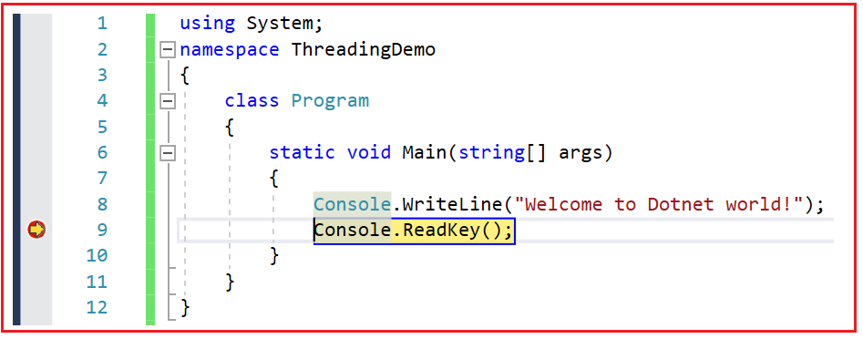
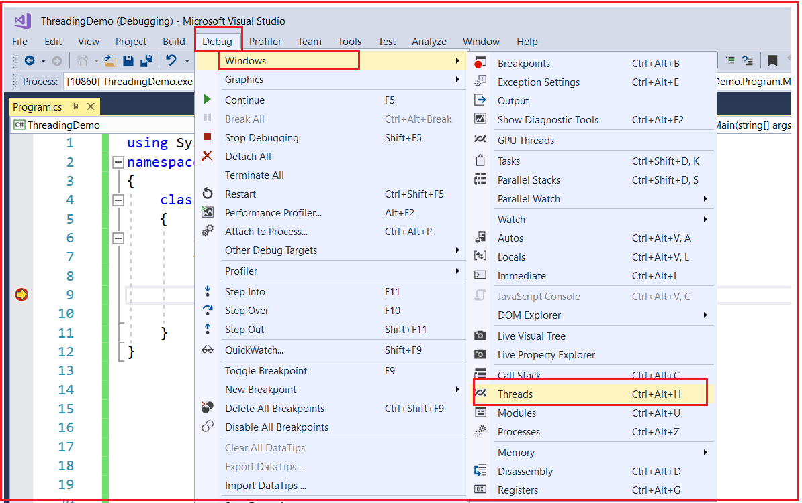
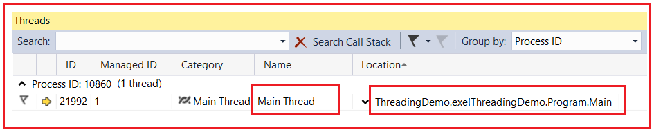
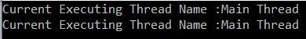
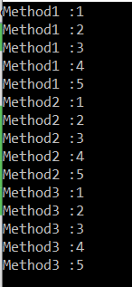

## **چندنخی (Multithreading) در سی شارپ به همراه مثال**

در این مقاله، من در مورد **چندنخی (Multithreading) در سی شارپ** با مثال بحث خواهم کرد. چندنخی یکی از مهمترین مفاهیم در سی شارپ است که شما به عنوان یک توسعه دهنده باید آن را درک کنید. در این مقاله و چند مقاله بعدی، من تمام مفاهیم چندنخی (Multithreading) در سی شارپ را با مثال پوشش خواهم داد. به عنوان بخشی از این مقاله، نکات زیر را پوشش خواهم داد.

1. **چندوظیفگی چیست؟**
2. **چگونه سیستم عامل چندین برنامه را همزمان اجرا می‌کند؟**
3. **فرآیند چیست؟**
4. **نخ چیست؟**
5. **مثالی برای درک Threading در سی شارپ.**
6. **درک کلاس Thread در چارچوب .NET.**
7. **معایب برنامه‌های تک‌رشته‌ای چیست؟**
8. **چگونه با استفاده از چندنخی بر معایب برنامه‌های تک‌رشته‌ای غلبه کنیم؟**
9. **چندنخی (Multithreading) در سی شارپ چیست؟**
10. **کلاس Thread در سی شارپ چیست؟**

##### **چندوظیفگی چیست؟**

قبل از درک مفهوم چندرشته‌ای (Multithreading) در سی‌شارپ، ابتدا بیایید چندوظیفگی (multitasking) را درک کنیم. همانطور که از نامش پیداست، چندوظیفگی به معنای انجام چندین کار به طور همزمان است. سیستم عامل ویندوز یک سیستم عامل چندوظیفگی است. به این معنی که توانایی اجرای چندین برنامه را به طور همزمان دارد. به عنوان مثال، در دستگاه من، می‌توانم مرورگر گوگل کروم، مایکروسافت ورد، نوت‌پد، VLC Media Player، ویژوال استودیو و غیره را به طور همزمان باز کنم. این امر به این دلیل امکان‌پذیر است که من سیستم عامل ویندوز را که یک سیستم عامل چندوظیفگی است، روی دستگاه خود نصب کرده‌ام.

بنابراین، چندوظیفگی به اجرای همزمان چندین وظیفه یا فرآیند در یک سیستم کامپیوتری اشاره دارد. این قابلیت به یک کامپیوتر اجازه می‌دهد طوری به نظر برسد که انگار چندین وظیفه را همزمان انجام می‌دهد، حتی اگر معمولاً یک واحد پردازش مرکزی (CPU) داشته باشد. چندوظیفگی یک ویژگی اساسی سیستم‌های عامل مدرن است و نقش مهمی در بهبود کارایی، پاسخگویی و قابلیت استفاده کامپیوترها ایفا می‌کند.

##### **چگونه سیستم عامل چندین برنامه را همزمان اجرا می‌کند؟**

سیستم عامل از فرآیندهای داخلی برای اجرای همزمان چندین برنامه (مرورگر گوگل کروم، مایکروسافت ورد، نوت پد، VLC Media Player، ویژوال استودیو و غیره) استفاده می‌کند.

###### **فرآیند چیست؟**

یک فرآیند بخشی از سیستم عامل (یا یک جزء تحت سیستم عامل) است که مسئول اجرای برنامه یا اپلیکیشن است. بنابراین، برای اجرای هر برنامه یا اپلیکیشن، یک فرآیند وجود خواهد داشت.

در یک سیستم عامل (OS)، فرآیند یک مفهوم اساسی است که نشان‌دهنده یک برنامه در حال اجرا است. این کوچکترین واحد کار در اجرای یک سیستم کامپیوتری است. هر فرآیند فضای حافظه مخصوص خود را دارد که شامل کد برنامه، داده‌ها و یک پشته برای مدیریت فراخوانی‌های تابع و متغیرهای محلی است. سیستم عامل فرآیندها را مدیریت می‌کند و منابع خاص خود مانند زمان CPU، مدیریت فایل‌ها و اطلاعات وضعیت سیستم را دارد.

فرآیندهایی که برنامه‌ها یا اپلیکیشن‌ها را با استفاده از Task Manager اجرا می‌کنند. کافیست روی نوار وظیفه کلیک راست کرده و گزینه Task Manager را انتخاب کنید تا پنجره Task Manager باز شود. از آن پنجره، مطابق شکل زیر، روی دکمه «Processes» کلیک کنید.

 در سی شارپ")

همانطور که در تصویر بالا مشاهده می‌کنید، هر برنامه توسط یک فرآیند مربوطه اجرا می‌شود. در همین راستا، چندین فرآیند در پس‌زمینه در حال اجرا هستند که به عنوان فرآیندهای پس‌زمینه شناخته می‌شوند. این فرآیندهای پس‌زمینه به عنوان سرویس‌های ویندوز شناخته می‌شوند و سیستم عامل بسیاری از سرویس‌های ویندوز را در پس‌زمینه اجرا می‌کند.

بنابراین، ما یک سیستم عامل داریم و تحت سیستم عامل، فرآیندهایی داریم که برنامه‌های ما را اجرا می‌کنند. بنابراین، نکته‌ای که باید به خاطر داشته باشید این است که تحت فرآیند، یک برنامه اجرا می‌شود. برای اجرای کد یک برنامه، فرآیند به صورت داخلی از مفهومی به نام Thread استفاده می‌کند.

##### **Thread چیست؟**

به طور کلی، یک Thread یک فرآیند سبک وزن است. به عبارت ساده، می‌توان گفت که Thread واحدی از یک فرآیند است که وظیفه اجرای کد برنامه را بر عهده دارد. بنابراین، هر برنامه یا اپلیکیشن دارای منطق یا کدی است و برای اجرای آن منطق یا کد، Thread وارد عمل می‌شود.

در یک سیستم عامل (OS)، یک نخ (thread) واحد اجرایی کوچک‌تری در داخل یک فرآیند است. نخ‌ها گاهی اوقات «فرآیندهای سبک» نامیده می‌شوند زیرا فضای حافظه یکسانی را با فرآیند والد، شامل کد، داده‌ها و منابع آن، به اشتراک می‌گذارند. با این حال، نخ‌ها زمینه اجرایی خاص خود را دارند، از جمله شمارنده برنامه، ثبات‌ها و پشته. نخ‌های داخل یک فرآیند می‌توانند به صورت همزمان اجرا شوند و امکان اجرای موازی وظایف را فراهم کنند.

به طور پیش‌فرض، هر فرآیند حداقل یک نخ دارد که مسئول اجرای کد برنامه است و آن نخ، نخ اصلی (Main Thread) نامیده می‌شود. بنابراین، هر برنامه به طور پیش‌فرض یک برنامه تک‌رشته‌ای (single-threaded) است.

**نکته:** تمام کلاس‌های مرتبط با threading در سی‌شارپ متعلق به **فضای نام System.Threading** هستند .

##### **مثال برای درک Threading در سی شارپ:**

بیایید یک مثال برای درک Threading در C# بزنیم. در ادامه یک برنامه ساده را مشاهده می‌کنید که در آن کلاسی به نام Program داریم و در آن کلاس، متدی به نام Main داریم که به سادگی یک پیام را در پنجره Console چاپ می‌کند.

```csharp
using System;

namespace ThreadingDemo
{
    class Program
    {
        static void Main(string[] args)
        {
            Console.WriteLine("Welcome to Dotnet world!");
            Console.ReadKey();
        }
    }
}
```

##### **آیا برنامه‌ی فوق هنگام اجرا از Thread استفاده می‌کند؟**

بله، یک Thread وجود دارد و آن Thread کد برنامه ما را اجرا می‌کند که به آن Thread اصلی گفته می‌شود. حال، بیایید این را ثابت کنیم. یک نقطه اشکال‌زدایی (debugger point) روی کد برنامه خود قرار دهید و سپس برنامه را اجرا کنید. فرض کنید نقطه اشکال‌زدایی را روی خط شماره ۹ قرار داده‌اید و وقتی برنامه را اجرا می‌کنید، خواهید دید که اشکال‌زدایی به آن نقطه می‌رسد، همانطور که در تصویر زیر نشان داده شده است.



وقتی دیباگر به نقطه اشکال‌زدایی رسید، **Debug => Windows => Threads را از منوی Visual Studio انتخاب کنید.** همانطور که در تصویر زیر نشان داده شده است، گزینه‌های



پس از انتخاب **گزینه‌های Debug => Windows => Threads** ، پنجره زیر باز می‌شود. در اینجا می‌توانید ببینید که Thread اصلی در حال حاضر متد Main از کلاس Program را اجرا می‌کند.



بنابراین، این ثابت می‌کند که به طور پیش‌فرض، هر برنامه یک برنامه تک‌رشته‌ای است و به طور پیش‌فرض، رشته اصلی کد برنامه ما را اجرا می‌کند.

##### **کلاس نخ (Thread) در سی شارپ:**

به تعریف کلاس Thread در C# بروید. خواهید دید که شامل یک ویژگی استاتیک به نام **CurrentThread** است که نمونه‌ای از رشته در حال اجرا، یعنی رشته‌ای که کد برنامه شما را اجرا می‌کند، را برمی‌گرداند. اگر به تعریف کلاس Thread بروید، امضای زیر را خواهید یافت.

 در سی شارپ")

همانطور که می‌بینید، **نوع بازگشتی ویژگی استاتیک CurrentThread** ، Thread است، یعنی نمونه‌ای از نخ در حال اجرا را برمی‌گرداند. در همین راستا، یک ویژگی غیر استاتیک به نام Name وجود دارد که با استفاده از آن می‌توانیم نام نخ در حال اجرا را تنظیم و دریافت کنیم.

**نکته:** به طور پیش‌فرض، نخ هیچ نامی ندارد. شما می‌توانید با استفاده از ویژگی Name از کلاس Thread، هر نامی را به نخ بدهید. بنابراین، برنامه را مطابق شکل زیر تغییر دهید، که در آن ویژگی Name از کلاس Thread را تنظیم کرده و ویژگی Name را چاپ می‌کنیم.

```csharp
using System.Threading;
using System;

namespace ThreadingDemo
{
    class Program
    {
        static void Main(string[] args)
        {
            Thread t = Thread.CurrentThread;
            //By Default, the Thread does not have any name
            //if you want then you can provide the name explicitly
            t.Name = "Main Thread";
            Console.WriteLine("Current Executing Thread Name :" + t.Name);
            Console.WriteLine("Current Executing Thread Name :" + Thread.CurrentThread.Name);

            Console.Read();
        }
    }
}
```

###### **خروجی:**



همانطور که می‌بینید، برای اجرای کد برنامه، یک نخ (thread) ایجاد می‌شود، یعنی نخ اصلی (Main Thread). بنابراین، این ثابت می‌کند که به طور پیش‌فرض، هر برنامه یک برنامه تک‌رشته‌ای است.

##### **معایب برنامه‌های تک‌رشته‌ای در چارچوب دات‌نت چیست؟**

برنامه‌های تک‌رشته‌ای در چارچوب .NET دارای معایب متعددی هستند، به ویژه در مورد عملکرد، پاسخگویی و مقیاس‌پذیری. برخی از معایب اصلی عبارتند از:

- **استفاده محدود از CPU:** برنامه‌های تک‌رشته‌ای فقط می‌توانند یک وظیفه یا عملیات را همزمان اجرا کنند. این بدان معناست که آنها نمی‌توانند به طور کامل از پردازنده‌های چند هسته‌ای مدرن استفاده کنند و منجر به استفاده کمتر از منابع CPU موجود می‌شود. در مقابل، برنامه‌های چندرشته‌ای یا موازی می‌توانند کار را بین چندین رشته توزیع کنند و از هسته‌های CPU بیشتری به طور مؤثر استفاده کنند.
- **پاسخگویی ضعیف:** در یک برنامه تک‌رشته‌ای، عملیات وقت‌گیر می‌توانند کل اجرا را مسدود کنند و باعث شوند برنامه به ورودی کاربر پاسخ ندهد. به عنوان مثال، اگر یک محاسبه طولانی مدت در رشته اصلی رخ دهد، رابط کاربری تا زمان تکمیل محاسبه به‌روزرسانی نمی‌شود. این می‌تواند منجر به یک تجربه کاربری ضعیف شود.
- **دشواری در مدیریت وظایف همزمان:** برنامه‌های تک‌رشته‌ای در مدیریت وظایف همزمان، مانند پاسخ به ورودی کاربر، در حین انجام وظایف پس‌زمینه مانند بارگذاری داده‌ها یا محاسبات، با مشکل مواجه می‌شوند. برنامه ممکن است در طول چنین عملیاتی بدون رشته‌های اضافی یا تکنیک‌های برنامه‌نویسی ناهمزمان، پاسخگو نباشد.
- **چالش‌های مقیاس‌پذیری:** برنامه‌های تک‌رشته‌ای اغلب هنگام مقیاس‌پذیری برای مدیریت همزمان چندین کاربر یا حجم کار با چالش‌هایی روبرو می‌شوند. آنها ممکن است برای سناریوهایی که نیاز به همزمانی بالا یا پردازش موازی دارند، مانند سرورهای وب یا برنامه‌های پردازش داده بلادرنگ، مناسب نباشند.
- **موازی‌سازی محدود:** برنامه‌های تک‌رشته‌ای نمی‌توانند پردازش موازی واقعی را انجام دهند. این می‌تواند یک نقطه ضعف قابل توجه در هنگام مواجهه با وظایف محاسباتی فشرده باشد که می‌توانند از موازی‌سازی بهره‌مند شوند، مانند تجزیه و تحلیل داده‌ها، رندر کردن یا شبیه‌سازی‌ها.
- **استفاده ناکارآمد از منابع:** برنامه‌های تک‌رشته‌ای ممکن است به طور مؤثر از سایر منابع سیستم مانند حافظه و ورودی/خروجی استفاده نکنند. به عنوان مثال، ممکن است در حین انتظار برای تکمیل عملیات ورودی/خروجی، رشته را مسدود کنند و منجر به هدر رفتن چرخه‌های CPU شوند که می‌توانند برای کارهای دیگر استفاده شوند.
- **دشواری در دستیابی به تحمل‌پذیری خطا:** در برنامه‌های تک‌رشته‌ای، مدیریت خطاها و استثنائات می‌تواند چالش‌برانگیزتر باشد زیرا یک خرابی در یک بخش از برنامه می‌تواند کل فرآیند را مختل کند. معماری‌های چندرشته‌ای یا چند فرآیندی می‌توانند خرابی‌ها را به نخ‌ها یا فرآیندهای خاص ایزوله کنند و تحمل‌پذیری خطا را آسان‌تر کنند.

برای رفع این محدودیت‌ها، توسعه‌دهندگان اغلب از تکنیک‌های چندرشته‌ای، برنامه‌نویسی ناهمزمان یا پردازش موازی ارائه شده توسط چارچوب .NET استفاده می‌کنند تا برنامه‌ها را پاسخگوتر، مقیاس‌پذیرتر و کارآمدتر کنند. این رویکردها به برنامه‌ها این امکان را می‌دهند که از سخت‌افزار مدرن بهتر استفاده کنند و تجربیات کاربری را بهبود بخشند، به خصوص در وظایف همزمان و سناریوهای حجم کار سنگین.

در یک برنامه تک‌رشته‌ای، تمام منطق یا کد موجود در برنامه فقط توسط یک رشته، یعنی رشته اصلی، اجرا می‌شود. به عنوان مثال، اگر سه متد در برنامه خود داشته باشیم، هر سه متد از متد اصلی فراخوانی می‌شوند. سپس، رشته اصلی فقط مسئول اجرای متوالی هر سه متد، یعنی یک به یک، است. این رشته، متد اول را اجرا می‌کند و پس از اتمام اجرای متد اول، فقط متد دوم را اجرا می‌کند و به همین ترتیب ادامه می‌دهد. بیایید این موضوع را با یک مثال درک کنیم. برنامه را مطابق شکل زیر اصلاح کنید.

```csharp
using System;

namespace ThreadingDemo
{
    class Program
    {
        static void Main(string[] args)
        {
            Method1();
            Method2();
            Method3();
            Console.Read();
        }

        static void Method1()
        {
            for (int i = 1; i <= 5; i++)
            {
                Console.WriteLine("Method1 :" + i);
            }
        }
        
        static void Method2()
        {
            for (int i = 1; i <= 5; i++)
            {
                Console.WriteLine("Method2 :" + i);
            }
        }

        static void Method3()
        {
            for (int i = 1; i <= 5; i++)
            {
                Console.WriteLine("Method3 :" + i);
            }
        }
    }
}
```

###### **خروجی:**



همانطور که در خروجی بالا مشاهده می‌کنید، متدها یکی پس از دیگری فراخوانی و اجرا می‌شوند. نخ اصلی ابتدا متد1 را اجرا می‌کند و پس از اتمام اجرای متد1، متد2 و متد3 را فراخوانی می‌کند.

##### **مشکل اجرای برنامه فوق چیست؟**

در مثال ما، ما فقط در حال نوشتن یک کد ساده برای چاپ مقادیر ۱ تا ۵ در بدنه متد هستیم. اگر یک متد بیش از زمان مورد انتظار طول بکشد، چه خواهید کرد؟ فرض کنید متد۲ قرار است با یک پایگاه داده تعامل داشته باشد، یا قرار است هرگونه سرویس وب یا هر API وب را فراخوانی کند، که ارائه پاسخ بیش از ۱۰ ثانیه طول می‌کشد. در این صورت، اجرای متد۲ به مدت ۱۰ ثانیه به تأخیر می‌افتد زیرا منتظر دریافت پاسخ از پایگاه داده، سرویس وب یا API وب است. تا زمانی که متد۲ اجرای خود را کامل نکند، متد۳ به دلیل اجرای متوالی برنامه، یعنی یک به یک، اجرا نخواهد شد.

##### **مثالی برای درک مشکل برنامه‌های تک‌رشته‌ای در سی‌شارپ**

در اینجا، ما هیچ فراخوانی پایگاه داده یا وب سرویسی انجام نخواهیم داد؛ در عوض، از متد Sleep کلاس Thread برای به تأخیر انداختن اجرای Method2 به مدت 10 ثانیه استفاده خواهیم کرد. در زیر امضای متد Sleep آمده است. نسخه سربارگذاری شده دیگری از متد Sleep موجود است که TimeSpan را به عنوان ورودی دریافت می‌کند و در مقالات بعدی در مورد آن بحث خواهیم کرد.

**تابع استاتیک عمومی Sleep(int millisecondsTimeout);**

متد sleep زمان را بر حسب میلی‌ثانیه به عنوان ورودی دریافت می‌کند و سپس اجرای نخ فعلی را برای آن تعداد میلی‌ثانیه مشخص شده به حالت تعلیق در می‌آورد. بنابراین، لطفاً کد کلاس Program را مطابق شکل زیر تغییر دهید.

```csharp
using System.Threading;
using System;

namespace ThreadingDemo
{
    class Program
    {
        static void Main(string[] args)
        {
            Method1();
            Method2();
            Method3();
            Console.Read();
        }
        static void Method1()
        {
            for (int i = 1; i <= 5; i++)
            {
                Console.WriteLine("Method1 :" + i);
            }
        }

        static void Method2()
        {
            for (int i = 1; i <= 5; i++)
            {
                Console.WriteLine("Method2 :" + i);
                if (i == 3)
                {
                    Console.WriteLine("Performing the Database Operation Started");
                    //Sleep for 10 seconds
                    Thread.Sleep(10000);
                    Console.WriteLine("Performing the Database Operation Completed");
                }
            }
        }
        static void Method3()
        {
            for (int i = 1; i <= 5; i++)
            {
                Console.WriteLine("Method3 :" + i);
            }
        }
    }
}
```

حالا برنامه را اجرا کنید و توجه کنید که اجرای متد۲ به مدت ۱۰ ثانیه به تأخیر می‌افتد. به محض اینکه متد۲ اجرای خود را کامل کند، فقط متد۳ اجرای خود را آغاز می‌کند. دلیل این امر این است که هر سه متد توسط یک رشته اجرا می‌شوند، که این نقطه ضعف برنامه تک رشته‌ای است.

##### **چگونه مشکل فوق را حل کنیم؟**

برای حل مشکل فوق، ما مفهومی به نام چندنخی (Multithreading) در سی شارپ داریم. همانطور که قبلاً بحث کردیم، سیستم عامل دارای فرآیندهایی است که برای اجرای برنامه‌های ما استفاده می‌شوند. فرآیند شامل نخ (Thread) است که در واقع کد برنامه ما را اجرا می‌کند.

یک فرآیند، به طور پیش‌فرض، از یک نخ برای اجرای کد برنامه ما استفاده می‌کند، اما یک فرآیند می‌تواند چندین نخ داشته باشد و چندین نخ می‌توانند کد برنامه ما را همزمان اجرا کنند. در این حالت، هر نخ وظیفه متفاوتی را انجام می‌دهد، یا می‌توان گفت هر نخ بخش‌های مختلفی از کد برنامه ما را اجرا می‌کند.

در برنامه ما، سه متد داریم. بنابراین، سه متدی که در برنامه تعریف کرده‌ایم می‌توانند توسط سه نخ اجرا شوند. مزیت این است که اجرا همزمان انجام می‌شود. بنابراین، وقتی چندین نخ سعی می‌کنند کد برنامه را اجرا کنند، سیستم عامل برای هر نخ زمانی اختصاص می‌دهد.

در مثال ما، می‌خواهیم سه متد را با استفاده از سه نخ مختلف اجرا کنیم. فرض کنید t1، t2 و t3. نخ t1 قرار است Method1 را اجرا کند و نخ t2 قرار است Method2 را اجرا کند. همزمان، Method3 توسط نخ t3 اجرا خواهد شد. بیایید کلاس Program را مطابق شکل زیر تغییر دهیم تا سه متد را با سه نخ مختلف اجرا کند. در اینجا، نخ اصلی، متد Main را اجرا می‌کند و نخ اصلی نخ‌های فرزند را ایجاد می‌کند.

```csharp
using System.Threading;
using System;

namespace ThreadingDemo
{
    class Program
    {
        static void Main(string[] args)
        {
            Console.WriteLine("Main Thread Started");

            //Creating Threads
            Thread t1 = new Thread(Method1)
            {
                Name = "Thread1"
            };
            Thread t2 = new Thread(Method2)
            {
                Name = "Thread2"
            };
            Thread t3 = new Thread(Method3)
            {
                Name = "Thread3"
            };

            //Executing the methods
            t1.Start();
            t2.Start();
            t3.Start();
            Console.WriteLine("Main Thread Ended");
            Console.Read();
        }
        static void Method1()
        {
            Console.WriteLine("Method1 Started using " + Thread.CurrentThread.Name);
            for (int i = 1; i <= 5; i++)
            {
                Console.WriteLine("Method1 :" + i);
            }
            Console.WriteLine("Method1 Ended using " + Thread.CurrentThread.Name);
        }

        static void Method2()
        {
            Console.WriteLine("Method2 Started using " + Thread.CurrentThread.Name);
            for (int i = 1; i <= 5; i++)
            {
                Console.WriteLine("Method2 :" + i);
                if (i == 3)
                {
                    Console.WriteLine("Performing the Database Operation Started");
                    //Sleep for 10 seconds
                    Thread.Sleep(10000);
                    Console.WriteLine("Performing the Database Operation Completed");
                }
            }
            Console.WriteLine("Method2 Ended using " + Thread.CurrentThread.Name);
        }
        static void Method3()
        {
            Console.WriteLine("Method3 Started using " + Thread.CurrentThread.Name);
            for (int i = 1; i <= 5; i++)
            {
                Console.WriteLine("Method3 :" + i);
            }
            Console.WriteLine("Method3 Ended using " + Thread.CurrentThread.Name);
        }
    }
}
```

همانطور که در کد بالا مشاهده می‌کنید، ما سه نمونه مختلف از کلاس Thread ایجاد کرده‌ایم. به سازنده کلاس Thread، باید نام متدی را که باید توسط آن Thread اجرا شود، ارسال کنیم. سپس، متد Start() را در کلاس Thread فراخوانی می‌کنیم که اجرای متد را شروع می‌کند. خروجی را به صورت متوالی دریافت نخواهید کرد. برنامه را اجرا کنید و خروجی را مطابق شکل زیر مشاهده کنید. خروجی ممکن است در دستگاه شما متفاوت باشد.

 در سی شارپ به همراه مثال")

در اینجا، نخ اصلی (Main thread) قرار است تمام نخ‌های دیگر را ایجاد کند. در اینجا، نخ اصلی متد اصلی (Main method) را اجرا می‌کند و نخ اصلی نخ‌های فرزند (child threads) به نام نخ‌های کارگر (Worker Threads) را ایجاد می‌کند. اکنون، برای مشاهده‌ی تمام نخ‌ها، برنامه را با قرار دادن نقطه اشکال‌زدایی (debugging point) در حالت اشکال‌زدایی (debug mode) اجرا کنید و سپس **گزینه‌های Debug => Windows => Threads** را باز کنید ، سپس پنجره‌ی زیر باز می‌شود. در اینجا می‌توانید ببینید که نخ اصلی (Main Thread) و نخ‌های کارگر (Worker threads) کد برنامه‌ی ما را اجرا می‌کنند.

 در سی شارپ چیست؟")

##### **چندنخی (Multithreading) در سی شارپ چیست؟**

اگر از چندین نخ برای اجرای کد برنامه شما استفاده شود، به آن چند نخی (Multithreading) می‌گویند. چند نخی مکانیزمی برای پیاده‌سازی برنامه‌نویسی همزمان است که در آن چندین نخ به طور همزمان عمل می‌کنند. نخ‌ها فرآیندهای سبکی هستند که مسیر اجرا را در یک برنامه مشخص می‌کنند. استفاده از نخ، کارایی یک برنامه را افزایش داده و اتلاف زمان چرخه CPU را کاهش می‌دهد. مزیت اصلی استفاده از چند نخی، حداکثر استفاده از منابع CPU است.

چندریسمانی در سی شارپ به توانایی زبان برنامه‌نویسی سی شارپ و چارچوب دات نت برای ایجاد و مدیریت چندین ریسمان اجرایی در یک فرآیند واحد اشاره دارد. ریسمان‌ها توالی‌های سبک و مستقلی از دستورالعمل‌ها هستند که می‌توانند به صورت همزمان اجرا شوند و به شما امکان می‌دهند چندین کار را همزمان انجام دهید. چندریسمانی یک مفهوم قدرتمند در سی شارپ است و برای دستیابی به اهداف مختلفی مانند بهبود پاسخگویی برنامه، موازی‌سازی وظایف و استفاده کارآمد از پردازنده‌های چند هسته‌ای استفاده می‌شود.

###### **ویژگی‌های کلیدی چندنخی (Multithreading) در سی شارپ:**

- **کلاس Thread:** سی‌شارپ کلاس System.Threading.Thread را ارائه می‌دهد که به شما امکان ایجاد و مدیریت Threadها را می‌دهد. با استفاده از این کلاس، می‌توانید Threadهای جدید ایجاد کنید، آنها را شروع و متوقف کنید، اولویت‌های آنها را تنظیم کنید و وظایف مختلف همگام‌سازی و هماهنگی را انجام دهید.
- **برنامه‌نویسی موازی:** چندنخی اغلب برای برنامه‌نویسی موازی استفاده می‌شود، که در آن چندین نخ روی بخش‌های جداگانه‌ای از یک مسئله برای بهبود عملکرد کار می‌کنند. چارچوب دات‌نت کتابخانه‌ها و ساختارهایی مانند کتابخانه موازی وظایف (TPL) و LINQ موازی (PLINQ) را برای ساده‌سازی برنامه‌نویسی موازی فراهم می‌کند.
- **بهبود پاسخگویی:** چندریسمانی می‌تواند رابط کاربری (UI) را پاسخگو نگه دارد در حالی که وظایف وقت‌گیر را در پس‌زمینه انجام می‌دهد. به عنوان مثال، در یک برنامه رابط کاربری گرافیکی، می‌توانید یک محاسبه وقت‌گیر را روی یک ریسمان جداگانه اجرا کنید تا رابط کاربری تعاملی باقی بماند و هنگ نکند.
- **همزمانی:** چندرشته‌ای بودن، اجرای همزمان بخش‌های کد را امکان‌پذیر می‌کند، که برای سناریوهایی مفید است که در آن‌ها چندین رشته نیاز به دسترسی به منابع مشترک، انجام عملیات ورودی/خروجی یا مدیریت همزمان چندین درخواست کلاینت دارند.
- **ایمنی نخ:** وقتی چندین نخ به داده‌ها یا منابع مشترک دسترسی دارند، اطمینان از ایمنی نخ برای جلوگیری از خرابی داده‌ها و شرایط رقابتی بسیار مهم است. سی‌شارپ ابزارهای همگام‌سازی اولیه‌ای مانند قفل‌ها، mutexeها، سمافورها و کلاس Monitor را برای کمک به شما در دستیابی به ایمنی نخ فراهم می‌کند.
- **Async/Await:** زبان سی‌شارپ شامل کلمات کلیدی async و await است که برنامه‌نویسی ناهمزمان را ساده می‌کند. این کلمات کلیدی به شما امکان می‌دهند کد ناهمزمانی بنویسید که بتواند همزمان با سایر وظایف بدون مسدود کردن نخ فراخوانی اجرا شود. برنامه‌نویسی ناهمزمان برای برنامه‌های مقیاس‌پذیر و واکنش‌گرا ضروری است.

چندرشته‌ای بودن می‌تواند عملکرد و پاسخگویی برنامه‌های C# را تا حد زیادی افزایش دهد، اما پیچیدگی‌هایی مربوط به همگام‌سازی، هماهنگی و مشکلات بالقوه‌ای مانند بن‌بست را نیز ایجاد می‌کند. بنابراین، استفاده عاقلانه از چندرشته‌ای بودن و پیروی از بهترین شیوه‌ها برای اطمینان از کد همزمان قوی و قابل اعتماد ضروری است.

##### **کلاس Thread در سی شارپ چیست؟**

1. در زبان سی شارپ، از کلاس Thread برای ایجاد رشته‌ها (threads) استفاده می‌شود.
2. با کمک کلاس Thread می‌توانیم نخ‌های پیش‌زمینه و پس‌زمینه ایجاد کنیم. نخ‌های پیش‌زمینه و پس‌زمینه که قرار است در مقاله بعدی خود در مورد آنها صحبت کنیم، چه هستند؟
3. کلاس Thread همچنین به ما امکان می‌دهد اولویت یک thread را تعیین کنیم. در مقالات بعدی، نحوه تعیین اولویت یک thread را مورد بحث قرار خواهیم داد.
4. کلاس Thread در سی شارپ همچنین وضعیت فعلی یک thread را ارائه می‌دهد. ما این موضوع را هنگام بحث در مورد چرخه حیات Thread در سی شارپ مورد بحث قرار خواهیم داد.
5. کلاس Thread در سی شارپ مهر و موم شده (sealed) است و نمی‌توان از آن ارث‌بری کرد.
```