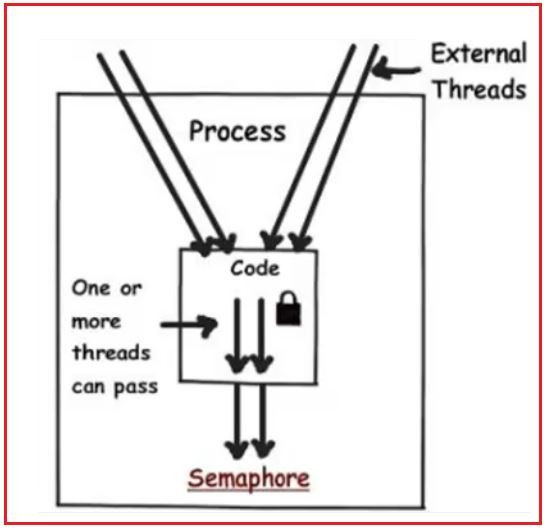
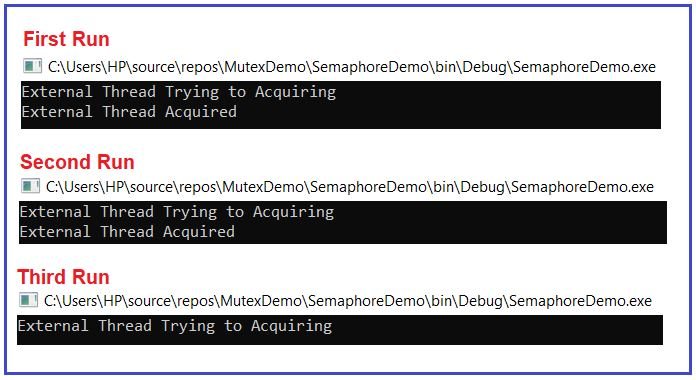
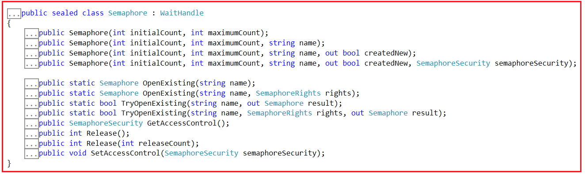
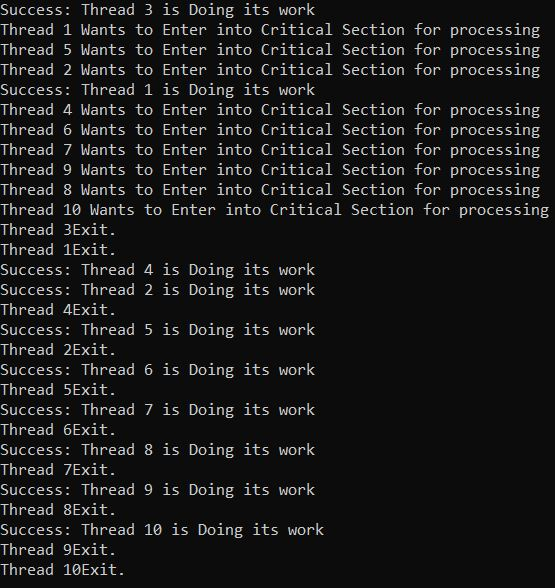

## **کلاس سمافور در سی شارپ به همراه مثال**

در این مقاله، قصد دارم **نحوه پیاده‌سازی همگام‌سازی نخ‌ها با استفاده از کلاس Semaphore در سی‌شارپ را** با مثال‌ها مورد بحث قرار دهم. لطفاً مقاله قبلی ما را که در آن نحوه استفاده از Mutex در سی‌شارپ برای محافظت از منابع مشترک در چندنخی از دسترسی همزمان را بررسی کردیم، مطالعه کنید. به عنوان بخشی از این مقاله، قصد داریم نکات زیر را مورد بحث قرار دهیم.

1. **چرا با وجود اینکه در سی شارپ از قبل قفل، مانیتور و موتکس داریم، به سمافور نیاز داریم؟**
2. **سمافور در سی شارپ چیست؟**
3. **سمافور در سی شارپ چگونه کار می‌کند؟**
4. **چگونه از کلاس سمافور استفاده کنیم؟**
5. **آشنایی با متدهای مختلف کلاس Semaphore در سی شارپ به همراه مثال.**

##### **چرا با وجود اینکه در سی شارپ از قبل قفل، مانیتور و موتکس داریم، به سمافور نیاز داریم؟**

مانند قفل، مانیتور و Mutex، Semaphore نیز برای تأمین امنیت نخ در برنامه‌های چند نخی C# استفاده می‌شود. قفل و مانیتورها اساساً برای تأمین امنیت نخ برای نخ‌هایی که توسط خود برنامه تولید می‌شوند، یعنی نخ‌های داخلی، استفاده می‌شوند. از سوی دیگر، Mutex امنیت نخ را برای نخ‌هایی که توسط برنامه‌های خارجی تولید می‌شوند، یعنی نخ‌های خارجی، تضمین می‌کند. با استفاده از Mutex، فقط یک نخ خارجی می‌تواند در هر نقطه از زمان به کد برنامه ما دسترسی داشته باشد و این را قبلاً در مقاله قبلی خود دیده‌ایم. اما اگر می‌خواهیم کنترل بیشتری بر تعداد نخ‌های خارجی که می‌توانند به کد برنامه ما دسترسی داشته باشند، داشته باشیم، باید از کلاس Semaphore در C# استفاده کنیم. برای درک بهتر، لطفاً به تصویر زیر نگاهی بیندازید.



ابتدا مثالی از نحوه محدود کردن تعداد نخ‌های خارجی برای دسترسی به کد برنامه با استفاده از Semaphore را بررسی می‌کنیم و سپس کلاس Semaphore در C# را با جزئیات درک خواهیم کرد. در مثال زیر، ما نمونه‌ای از Semaphore را ایجاد می‌کنیم تا حداکثر به دو نخ اجازه دسترسی به کد برنامه، یعنی کد بین متد WaitOne و متد Release، را بدهیم.

```csharp
using System;
using System.Threading;

namespace SemaphoreDemo
{
    class Program
    {
        public static Semaphore semaphore = null;

        static void Main(string[] args)
        {
            try
            {
                //Try to Open the Semaphore if Exists, if not throw an exception
                semaphore = Semaphore.OpenExisting("SemaphoreDemo");
            }
            catch(Exception Ex)
            {
                //If Semaphore not Exists, create a semaphore instance
                //Here Maximum 2 external threads can access the code at the same time
                semaphore = new Semaphore(2, 2, "SemaphoreDemo");
            }

            Console.WriteLine("External Thread Trying to Acquiring");
            semaphore.WaitOne();
            //This section can be access by maximum two external threads: Start
            Console.WriteLine("External Thread Acquired");
            Console.ReadKey();
            //This section can be access by maximum two external threads: End
            semaphore.Release();
        }
    }
}
```

حالا، پروژه را بسازید و سپس فایل EXE برنامه را سه بار اجرا کنید. دو بار اول، پیام External Thread Acquired را مشاهده خواهید کرد، اما وقتی فایل EXE را برای بار سوم اجرا می‌کنید، همانطور که در تصویر زیر نشان داده شده است، پیام External Thread Trying to Acquiring only را مشاهده خواهید کرد.



حالا، امیدوارم نیاز اساسی به کلاس سمافور در سی شارپ را درک کرده باشید. بیایید بیشتر پیش برویم و کلاس سمافور سی شارپ را با جزئیات بیشتر درک کنیم.

##### **کلاس سمافور در سی شارپ چیست؟**

کلاس Semaphore در سی شارپ برای محدود کردن تعداد نخ‌های خارجی که می‌توانند به طور همزمان به یک منبع مشترک دسترسی داشته باشند، استفاده می‌شود. به عبارت دیگر، می‌توان گفت که Semaphore به یک یا چند نخ خارجی اجازه می‌دهد تا وارد بخش بحرانی شوند و وظیفه را همزمان با امنیت نخ اجرا کنند. بنابراین، در زمان واقعی، زمانی که تعداد محدودی منابع داریم و می‌خواهیم تعداد نخ‌هایی که می‌توانند از آن استفاده کنند را محدود کنیم، باید از Semaphore استفاده کنیم.

##### **سازنده‌ها و متدهای کلاس سمافور در سی شارپ:**

بیایید با سازنده‌ها و متدهای مختلف کلاس Semaphore در سی‌شارپ آشنا شویم. اگر روی کلاس Semaphore کلیک راست کرده و گزینه go to definition را انتخاب کنید، تصویر زیر را مشاهده خواهید کرد. در اینجا، می‌توانید ببینید که Semaphore یک کلاس sealed است و از کلاس WaitHandle ارث‌بری شده است. به عنوان یک کلاس sealed، هیچ ارث‌بری دیگری امکان‌پذیر نیست.



##### **سازنده‌های کلاس سمافور در سی شارپ:**

کلاس Semaphore در سی شارپ چهار سازنده (constructor) زیر را ارائه می‌دهد که می‌توانیم از آنها برای ایجاد یک نمونه از کلاس Semaphore استفاده کنیم.

1. **Semaphore(int initialCount, int maximumCount) :** این تابع یک نمونه جدید از کلاس Semaphore را مقداردهی اولیه می‌کند و تعداد اولیه ورودی‌ها و حداکثر تعداد ورودی‌های همزمان را مشخص می‌کند.
2. **Semaphore(int initialCount, int maximumCount, string name) :** این تابع یک نمونه جدید از کلاس Semaphore را مقداردهی اولیه می‌کند، تعداد اولیه ورودی‌ها و حداکثر تعداد ورودی‌های همزمان را مشخص می‌کند و به صورت اختیاری نام یک شیء Semaphore سیستمی را نیز مشخص می‌کند.
3. **Semaphore(int initialCount, int maximumCount, string name, out bool createdNew) :** این تابع یک نمونه جدید از کلاس Semaphore را مقداردهی اولیه می‌کند، تعداد اولیه ورودی‌ها و حداکثر تعداد ورودی‌های همزمان را مشخص می‌کند، به صورت اختیاری نام یک شیء سمافور سیستمی را مشخص می‌کند و متغیری را تعیین می‌کند که مقداری را دریافت می‌کند که نشان می‌دهد آیا یک سمافور سیستمی جدید ایجاد شده است یا خیر.
4. **Semaphore(int initialCount, int maximumCount, string name, out bool createdNew, SemaphoreSecurity semaphoreSecurity) :** این تابع یک نمونه جدید از کلاس Semaphore را مقداردهی اولیه می‌کند، تعداد اولیه ورودی‌ها و حداکثر تعداد ورودی‌های همزمان را مشخص می‌کند، به صورت اختیاری نام یک شیء Semaphore سیستم را مشخص می‌کند، متغیری را مشخص می‌کند که مقداری را دریافت می‌کند که نشان می‌دهد آیا یک Semaphore سیستم جدید ایجاد شده است یا خیر، و کنترل دسترسی امنیتی را برای Semaphore سیستم مشخص می‌کند.

پارامترهای مورد استفاده در سازنده‌های کلاس Semaphore:

1. **initialCount** : تعداد اولیه درخواست‌ها برای سمافور که می‌توانند به صورت همزمان اعطا شوند. اگر initialCount بیشتر از maximumCount باشد، خطای ArgumentException صادر می‌شود.
2. **maximumCount** : حداکثر تعداد درخواست‌هایی که می‌توان به طور همزمان برای سمافور اعطا کرد. اگر maximumCount کمتر از ۱ یا initialCount کمتر از ۰ باشد، خطای ArgumentOutOfRangeException رخ خواهد داد.
3. **name** : نام یک شیء سمافور سیستمی نامگذاری‌شده.
4. **createdNew** : وقتی این متد مقدار بازگشتی را برمی‌گرداند، اگر یک سمافور محلی ایجاد شده باشد (یعنی اگر نام null یا یک رشته خالی باشد) یا اگر سمافور سیستمی مشخص شده ایجاد شده باشد، مقدار true را شامل می‌شود؛ اگر سمافور سیستمی مشخص شده از قبل وجود داشته باشد، مقدار false را شامل می‌شود. این پارامتر بدون مقدار اولیه ارسال می‌شود.
5. **semaphoreSecurity** : یک شیء از نوع System.Security.AccessControl.SemaphoreSecurity که نشان‌دهنده‌ی امنیت کنترل دسترسی است که باید روی سمافور سیستمیِ نامگذاری‌شده اعمال شود.

##### **متدهای کلاس سمافور در سی شارپ:**

کلاس سمافور در سی شارپ متدهای زیر را ارائه می‌دهد.

1. **OpenExisting(string name) :** این متد برای باز کردن یک سمافور نام‌گذاری‌شده‌ی مشخص‌شده در صورت وجود، استفاده می‌شود. این متد یک شیء را برمی‌گرداند که نشان‌دهنده‌ی سمافور سیستم نام‌گذاری‌شده است. در اینجا، پارامتر name نام سمافور سیستمی را که باید باز شود، مشخص می‌کند. اگر نام یک رشته‌ی خالی باشد، خطای ArgumentException رخ می‌دهد. -or-name بیش از ۲۶۰ کاراکتر باشد. اگر نام تهی باشد، خطای ArgumentNullException رخ می‌دهد.
2. **OpenExisting(string name, SemaphoreRights rights) :** این متد برای باز کردن سمافور نام‌گذاری‌شده‌ی مشخص‌شده، در صورت وجود، با دسترسی امنیتی مورد نظر استفاده می‌شود. این متد یک شیء را برمی‌گرداند که نشان دهنده‌ی سمافور سیستم نام‌گذاری‌شده است. در اینجا، پارامتر name نام سمافور سیستمی را که باید باز شود، مشخص می‌کند. پارامتر rights ترکیبی بیتی از مقادیر شمارشی را مشخص می‌کند که نشان دهنده‌ی دسترسی امنیتی مورد نظر است.
3. **TryOpenExisting(string name, out Semaphore result) :** این متد برای باز کردن Semaphore با نام مشخص شده، در صورتی که از قبل وجود داشته باشد، استفاده می‌شود و مقداری را برمی‌گرداند که نشان می‌دهد آیا عملیات موفقیت‌آمیز بوده است یا خیر. در اینجا، پارامتر name نام Semaphore سیستمی را که باید باز شود، مشخص می‌کند. هنگامی که این متد برمی‌گرداند، نتیجه شامل یک شیء Semaphore است که در صورت موفقیت‌آمیز بودن فراخوانی، Semaphore با نام را نشان می‌دهد، یا در صورت ناموفق بودن فراخوانی، null. این پارامتر به عنوان مقداردهی اولیه نشده در نظر گرفته می‌شود. اگر mutex با نام با موفقیت باز شود، مقدار true و در غیر این صورت، مقدار false را برمی‌گرداند.
4. **TryOpenExisting(string name, SemaphoreRights rights, out Semaphore result) :** این متد برای باز کردن Semaphore با نام مشخص شده، در صورتی که از قبل وجود داشته باشد، با دسترسی امنیتی مورد نظر استفاده می‌شود و مقداری را برمی‌گرداند که نشان می‌دهد آیا عملیات موفقیت‌آمیز بوده است یا خیر. در اینجا، پارامتر name نام Semaphore سیستمی را که باید باز شود، مشخص می‌کند. پارامتر rights ترکیبی بیتی از مقادیر شمارشی را مشخص می‌کند که نشان‌دهنده دسترسی امنیتی مورد نظر است. هنگامی که این متد برمی‌گرداند، نتیجه شامل یک شیء Semaphore است که در صورت موفقیت‌آمیز بودن فراخوانی، Semaphore با نام را نشان می‌دهد، یا در صورت ناموفق بودن فراخوانی، null است. این پارامتر به عنوان پارامتر مقداردهی اولیه نشده در نظر گرفته می‌شود. اگر Semaphore با نام با موفقیت باز شود، مقدار true و در غیر این صورت، مقدار false را برمی‌گرداند.
5. **Release() :** این متد از سمافور خارج می‌شود و تعداد قبلی را برمی‌گرداند. این متد، تعداد سمافور را قبل از فراخوانی متد Release برمی‌گرداند.
6. **Release(int releaseCount) :** این متد به تعداد دفعات مشخص از سمافور خارج می‌شود و تعداد دفعات قبلی را برمی‌گرداند. در اینجا، پارامتر releaseCount تعداد دفعات خروج از سمافور را مشخص می‌کند. این متد، تعداد دفعات قبل از فراخوانی متد Release را برمی‌گرداند.
7. **GetAccessControl() :** این متد امنیت کنترل دسترسی را برای یک سمافور سیستمیِ نامگذاری‌شده دریافت می‌کند.
8. **SetAccessControl(SemaphoreSecurity semaphoreSecurity) :** این متد امنیت کنترل دسترسی را برای یک سمافور سیستمی نامگذاری شده تنظیم می‌کند.

**نکته:** کلاس **Semaphore** به ارث رسیده است **در سی شارپ از کلاس انتزاعی WaitHandle** و کلاس WaitHandle متد WaitOne() را ارائه می‌دهد که برای قفل کردن منبع باید آن را فراخوانی کنیم. توجه داشته باشید که یک شیء Semaphore فقط می‌تواند از همان نخی که آن را دریافت کرده است، آزاد شود.

1. **متد WaitOne():** نخ‌ها می‌توانند با استفاده از متد WaitOne وارد بخش بحرانی شوند. ما باید متد WaitOne را روی شیء سمافور فراخوانی کنیم. اگر متغیر Int32 که توسط سمافور نگهداری می‌شود بزرگتر از 0 باشد، به نخ اجازه می‌دهد وارد بخش بحرانی شود.

##### **سمافور در سی شارپ چگونه کار می‌کند؟**

سمافورها متغیرهای Int32 هستند که در منابع سیستم عامل ذخیره می‌شوند. وقتی شیء سمافور را مقداردهی اولیه می‌کنیم، آن را با یک عدد مقداردهی اولیه می‌کنیم. این عدد اساساً برای محدود کردن نخ‌هایی که می‌توانند وارد بخش بحرانی شوند، استفاده می‌شود.

بنابراین، وقتی یک نخ وارد ناحیه بحرانی می‌شود، مقدار متغیر Int32 را ۱ واحد کاهش می‌دهد و وقتی از ناحیه بحرانی خارج می‌شود، مقدار متغیر Int32 را ۱ واحد افزایش می‌دهد. مهمترین نکته‌ای که باید به خاطر داشته باشید این است که وقتی مقدار متغیر Int32 برابر با ۰ باشد، هیچ نخی نمی‌تواند وارد ناحیه بحرانی شود.

##### **چگونه در سی شارپ یک سمافور ایجاد کنیم؟**

شما می‌توانید از دستور زیر برای ایجاد نمونه Semaphore در سی‌شارپ استفاده کنید. در اینجا، ما از نسخه overload شده سازنده استفاده می‌کنیم که دو پارامتر برای ایجاد نمونه‌ای از کلاس semaphore می‌گیرد.

**سمافور semaphoreObject = new Semaphore(initialCount: 2, maximumCount: 3); // سمافور جدید (تعداد اولیه: 2، تعداد حداکثر: 3)**

همانطور که در عبارت بالا مشاهده می‌کنید، ما دو مقدار را به سازنده کلاس Semaphore هنگام مقداردهی اولیه ارسال می‌کنیم. این دو مقدار نشان‌دهنده InitialCount و MaximumCount هستند. maximumCount تعریف می‌کند که حداکثر چند نخ می‌تواند وارد بخش بحرانی شود و initialCount مقدار متغیر Int32 را تنظیم می‌کند.

پارامتر InitialCount مقدار متغیر Int32 را تعیین می‌کند. یعنی تعداد اولیه درخواست‌ها برای سمافور که می‌توانند همزمان اعطا شوند را تعریف می‌کند. پارامتر MaximumCount حداکثر تعداد درخواست‌ها برای سمافور که می‌توانند همزمان اعطا شوند را تعریف می‌کند.

برای مثال، اگر حداکثر مقدار شمارش را ۳ و مقدار شمارش اولیه را ۰ تنظیم کنیم، به این معنی است که ۳ نخ از قبل در بخش بحرانی هستند، بنابراین هیچ نخ جدیدی نمی‌تواند وارد بخش بحرانی شود. اگر حداکثر مقدار شمارش را ۳ و مقدار شمارش اولیه را ۲ تنظیم کنیم، به این معنی است که حداکثر ۳ نخ می‌توانند وارد بخش بحرانی شوند و یک نخ وجود دارد که در حال حاضر در بخش بحرانی است، بنابراین دو نخ جدید می‌توانند وارد بخش بحرانی شوند.

**نکته ۱:** وقتی یک نخ وارد بخش بحرانی می‌شود، مقدار متغیر initialCount را ۱ واحد کاهش می‌دهد و وقتی از بخش بحرانی خارج می‌شود، مقدار متغیر initialCount را ۱ واحد افزایش می‌دهد. و وقتی مقدار متغیر initialCount برابر با ۰ باشد، هیچ نخی نمی‌تواند وارد بخش بحرانی شود. پارامتر دوم maximumCount همیشه باید برابر یا بزرگتر از پارامتر اول initialCount باشد، در غیر این صورت با خطا مواجه خواهیم شد.

**نکته ۲:** وقتی نخ می‌خواهد از بخش بحرانی خارج شود، باید متد Release() را فراخوانی کنیم. وقتی این متد فراخوانی می‌شود، متغیر Int32 که توسط شیء سمافور نگهداری می‌شود، یک واحد افزایش می‌یابد.

##### **مثال برای درک سمافور در سی شارپ:**

برای درک بهتر نحوه استفاده از Semaphore برای پیاده‌سازی همگام‌سازی نخ‌ها به منظور محافظت از منابع مشترک در چندنخی از دسترسی همزمان در C#، مثالی را بررسی می‌کنیم. لطفاً به مثال زیر نگاهی بیندازید. در مثال زیر، یک شیء Semaphore را با ۲ مقدار اولیه و حداکثر ۳ نخ که می‌توانند وارد بخش بحرانی شوند، مقداردهی اولیه می‌کنیم. حلقه for را با اجرا از ۰ تا ۱۰ شروع می‌کنیم. نخ‌ها را با استفاده از کلاس Thread و فراخوانی متد DoSomeTask از منابع مشترک، شروع می‌کنیم.

هر نخ قبل از انجام وظیفه مورد نیاز، متد WaitOne از شیء سمافور را فراخوانی می‌کند. متد WaitOne مقدار متغیر initialcount را ۱ واحد کاهش می‌دهد. بنابراین، متد WaitOne تعداد نخ‌هایی را که می‌توانند به منبع مشترک دسترسی داشته باشند، محدود می‌کند. پس از انجام وظیفه، هر نخ متد Release را فراخوانی می‌کند که مقدار متغیر initialcount را ۱ واحد به شیء سمافور افزایش می‌دهد. این امر به نخ‌های دیگر اجازه می‌دهد تا وارد بخش بحرانی شوند.

```csharp
using System;
using System.Threading;

namespace SemaphoreDemo
{
    class Program
    {
        public static Semaphore semaphore = new Semaphore(2, 3);

        static void Main(string[] args)
        {
            for (int i = 1; i <= 10; i++)
            {
                Thread threadObject = new Thread(DoSomeTask)
                {
                    Name = "Thread " + i
                };
                threadObject.Start();
            }
            Console.ReadKey();
        }

        static void DoSomeTask()
        {

            Console.WriteLine(Thread.CurrentThread.Name + " Wants to Enter into Critical Section for processing");
            try
            {
                //Blocks the current thread until the current WaitHandle receives a signal.   
                semaphore.WaitOne();
                //Decrease the Initial Count Variable by 1
                Console.WriteLine("Success: " + Thread.CurrentThread.Name + " is Doing its work");
                Thread.Sleep(5000);
                Console.WriteLine(Thread.CurrentThread.Name + "Exit.");
            }
            finally
            {
                //Release() method to release semaphore  
                //Increase the Initial Count Variable by 1
                semaphore.Release();
            }
        }
    }
}
```

###### **خروجی:**



همانطور که در خروجی بالا مشاهده می‌کنید، در اینجا حداکثر دو نخ وارد بخش بحرانی می‌شوند و وظایف خود را در هر نقطه زمانی مشخص انجام می‌دهند.