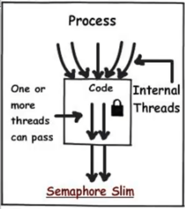
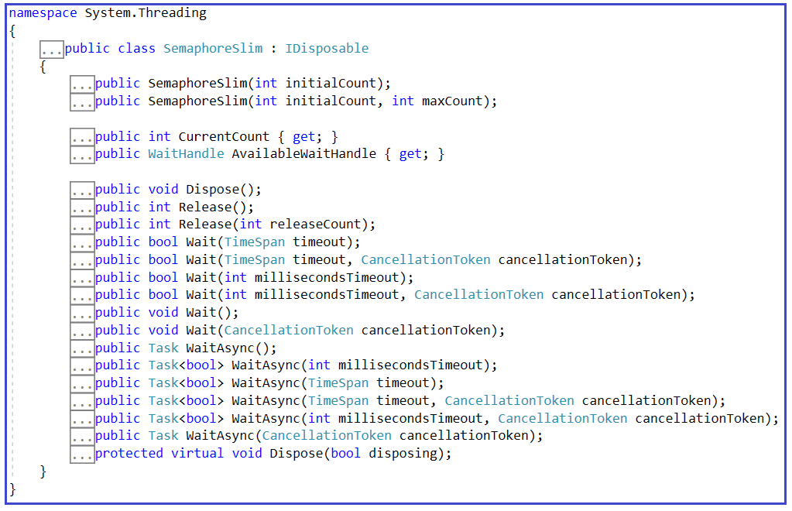
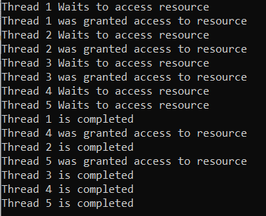
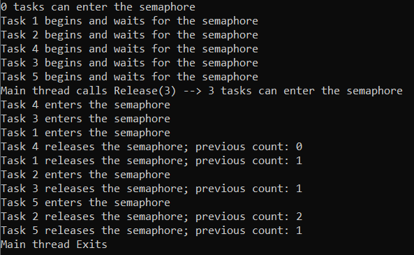

## **کلاس SemaphoreSlim در سی شارپ به همراه مثال**

در این مقاله، قصد دارم **نحوه پیاده‌سازی همگام‌سازی نخ‌ها با استفاده از کلاس SemaphoreSlim در سی‌شارپ را** به همراه مثال بررسی کنم. لطفاً مقاله قبلی ما را که در آن نحوه پیاده‌سازی همگام‌سازی نخ‌ها با استفاده از کلاس Semaphore در سی‌شارپ را به همراه مثال بررسی کردیم، مطالعه کنید. کلاس SemaphoreSlim یک جایگزین سبک برای Semaphore است که تعداد نخ‌هایی را که می‌توانند به طور همزمان به یک منبع یا مجموعه‌ای از منابع دسترسی داشته باشند، محدود می‌کند.

##### **چرا با وجود اینکه Lock، Monitor، Mutex و Semaphore را در سی شارپ داریم، به SemaphoreSlim نیاز داریم؟**

مانند Lock، Monitor، Mutex و Semaphore، کلاس SemaphoreSlim در C# نیز برای تأمین ایمنی نخ استفاده می‌شود. قفل و مانیتورها اساساً برای تأمین ایمنی نخ برای نخ‌های داخلی، یعنی نخ‌های تولید شده توسط خود برنامه، استفاده می‌شوند. از سوی دیگر، Mutex و Semaphore ایمنی نخ را برای نخ‌هایی که توسط برنامه‌های خارجی، یعنی نخ‌های خارجی، تولید می‌شوند، تضمین می‌کنند. با استفاده از Mutex، فقط یک نخ خارجی می‌تواند در هر نقطه از زمان به کد برنامه ما دسترسی داشته باشد. و اگر می‌خواهیم کنترل بیشتری بر تعداد نخ‌های خارجی که می‌توانند به کد برنامه ما دسترسی داشته باشند، داشته باشیم، می‌توانیم از Semaphore در C# استفاده کنیم.

با استفاده از قفل و مانیتور، فقط یک نخ داخلی می‌تواند در هر نقطه از زمان به کد برنامه ما دسترسی داشته باشد. اما اگر بخواهیم کنترل بیشتری روی تعداد نخ‌های داخلی که می‌توانند به کد برنامه ما دسترسی داشته باشند، داشته باشیم، باید از کلاس SemaphoreSlim در C# استفاده کنیم. برای درک بهتر، لطفاً به تصویر زیر نگاهی بیندازید.



##### **کلاس SemaphoreSlim در سی شارپ چیست؟**

کلاس SemaphoreSlim در سی شارپ برای همگام‌سازی درون یک برنامه واحد توصیه می‌شود. یک semaphore سبک، دسترسی به مجموعه‌ای از منابع محلی برنامه شما را کنترل می‌کند. این یک جایگزین سبک برای Semaphore است که تعداد نخ‌هایی را که می‌توانند به طور همزمان به یک منبع یا مجموعه‌ای از منابع دسترسی داشته باشند، محدود می‌کند.

##### **سازنده‌ها و متدهای کلاس SemaphoreSlim در سی شارپ:**

بیایید با سازنده‌ها و متدهای مختلف کلاس SemaphoreSlim در سی‌شارپ آشنا شویم. اگر روی کلاس SemaphoreSlim کلیک راست کرده و گزینه go to definition را انتخاب کنید، تعریف کلاس زیر را مشاهده خواهید کرد. این یک کلاس است و رابط IDisposable را پیاده‌سازی می‌کند.



##### **سازنده‌های کلاس SemaphoreSlim در سی شارپ:**

کلاس SemaphoreSlim در سی شارپ دو سازنده زیر را ارائه می‌دهد که می‌توانیم از آنها برای ایجاد یک نمونه از کلاس SemaphoreSlim استفاده کنیم.

1. **SemaphoreSlim(int initialCount) :** این تابع یک نمونه جدید از کلاس SemaphoreSlim را مقداردهی اولیه می‌کند و تعداد اولیه درخواست‌هایی را که می‌توانند به صورت همزمان اعطا شوند، مشخص می‌کند. در اینجا، پارامتر initialCount تعداد اولیه درخواست‌هایی را که می‌توانند به صورت همزمان برای سمافور اعطا شوند، مشخص می‌کند. اگر initialCount کمتر از 0 باشد، خطای ArgumentOutOfRangeException رخ خواهد داد.
2. **SemaphoreSlim(int initialCount, int maxCount) :** این تابع یک نمونه جدید از کلاس SemaphoreSlim را مقداردهی اولیه می‌کند و تعداد اولیه و حداکثر درخواست‌هایی را که می‌توانند به صورت همزمان اعطا شوند، مشخص می‌کند. در اینجا، پارامتر initialCount تعداد اولیه درخواست‌هایی را که می‌توانند به صورت همزمان برای سمافور اعطا شوند، مشخص می‌کند. و پارامتر maxCount حداکثر تعداد درخواست‌هایی را که می‌توانند به صورت همزمان برای سمافور اعطا شوند، مشخص می‌کند. اگر initialCount کمتر از 0 باشد، یا initialCount بزرگتر از maxCount باشد، یا maxCount مساوی یا کمتر از 0 باشد، خطای ArgumentOutOfRangeException رخ خواهد داد.

##### **متدهای کلاس SemaphoreSlim در سی شارپ:**

کلاس SemaphoreSlim در سی شارپ متدهای زیر را ارائه می‌دهد.

##### **روش انتظار:**

چندین نسخه سربارگذاری شده از متد Wait در کلاس SemaphoreSlim موجود است. آنها به شرح زیر هستند:

1. **Wait():** نخ فعلی را تا زمانی که بتواند وارد System.Threading.SemaphoreSlim شود، مسدود می‌کند.
2. **Wait(TimeSpan timeout):** این تابع، نخ فعلی را تا زمانی که بتواند وارد SemaphoreSlim شود، مسدود می‌کند و با استفاده از TimeSpan، زمان انقضا را مشخص می‌کند. اگر نخ فعلی با موفقیت وارد SemaphoreSlim شود، مقدار true و در غیر این صورت مقدار false را برمی‌گرداند.
3. **Wait(CancelationToken cancelToken):** این تابع نخ فعلی را تا زمانی که بتواند وارد SemaphoreSlim شود و در عین حال یک CancellationToken را مشاهده کند، مسدود می‌کند.
4. **Wait(TimeSpan timeout, CancellationToken cancelToken):** این تابع، نخ فعلی را تا زمانی که بتواند وارد SemaphoreSlim شود، با استفاده از TimeSpan که زمان انقضا را مشخص می‌کند، مسدود می‌کند و در عین حال CancellationToken را مشاهده می‌کند. اگر نخ فعلی با موفقیت وارد SemaphoreSlim شود، مقدار true و در غیر این صورت مقدار false را برمی‌گرداند.
5. **Wait(int millisecondsTimeout):** این تابع، نخ فعلی را تا زمانی که بتواند وارد SemaphoreSlim شود، مسدود می‌کند و برای این کار از یک عدد صحیح علامت‌دار ۳۲ بیتی استفاده می‌کند که زمان انقضا را مشخص می‌کند. اگر نخ فعلی با موفقیت وارد SemaphoreSlim شود، مقدار true و در غیر این صورت مقدار false را برمی‌گرداند.
6. **Wait(int millisecondsTimeout, CancellationToken cancellationToken):** این تابع، نخ فعلی را تا زمانی که بتواند وارد SemaphoreSlim شود، مسدود می‌کند. این کار با استفاده از یک عدد صحیح علامت‌دار ۳۲ بیتی که زمان انقضا را مشخص می‌کند، انجام می‌شود و در عین حال، CancellationToken نیز مشاهده می‌شود. اگر نخ فعلی با موفقیت وارد SemaphoreSlim شود، مقدار true و در غیر این صورت مقدار false را برمی‌گرداند.

###### **پارامترها:**

در ادامه توضیحات پارامترهای مورد استفاده در متدهای Wait آمده است.

1. **timeout :** یک TimeSpan که تعداد میلی‌ثانیه‌های مورد نیاز برای انتظار را نشان می‌دهد، یک TimeSpan که -1 میلی‌ثانیه برای انتظار نامحدود را نشان می‌دهد، یا یک TimeSpan که 0 میلی‌ثانیه برای آزمایش دسته انتظار و بازگشت فوری را نشان می‌دهد.
2. **cancelToken** : توکن System.Threading.Cancellation که باید مشاهده شود.
3. **millisecondsTimeout** : تعداد میلی‌ثانیه‌هایی که باید منتظر بمانید، System.Threading.Timeout.Infinite(-1) برای انتظار نامحدود، یا صفر برای بررسی وضعیت دسته انتظار و بازگرداندن فوری.

**توجه:** نسخه‌های Async تمام روش‌های فوق نیز موجود است.

##### **روش انتشار:**

دو نسخه overload شده از متد Release در کلاس SemaphoreSlim وجود دارد که به شرح زیر هستند:

1. **Release():** شیء SemaphoreSlim را یک بار آزاد می‌کند. تعداد قبلی SemaphoreSlim را برمی‌گرداند.
2. **Release(int releaseCount):** شیء SemaphoreSlim را به تعداد دفعات مشخص شده آزاد می‌کند. تعداد دفعات قبلی SemaphoreSlim را برمی‌گرداند. در اینجا، پارامتر releaseCount تعداد دفعات خروج از سمافور را مشخص می‌کند.

##### **SemaphoreSlim در سی شارپ چگونه کار می‌کند؟**

وقتی یک SemaphoreSlim را نمونه‌سازی می‌کنیم، می‌توانیم حداکثر تعداد نخ‌هایی را که می‌توانند همزمان وارد بخش بحرانی شوند، مشخص کنیم. همچنین تعداد اولیه نخ‌هایی را که می‌توانند همزمان وارد بخش بحرانی شوند، مشخص می‌کنیم. این تعداد، شمارش سمافور را تعریف می‌کند. هر بار که یک نخ وارد SemaphoreSlim می‌شود، شمارش کاهش می‌یابد و هر بار که یک نخ SemaphoreSlim را رها می‌کند، افزایش می‌یابد.

برای ورود به SemaphoreSlim، یک نخ باید یکی از متدهای سربارگذاری Wait یا WaitAsync را فراخوانی کند. برای آزاد کردن SemaphoreSlim، نخ باید یکی از متدهای Release را فراخوانی کند. وقتی تعداد به صفر می‌رسد، فراخوانی‌های بعدی بلوک متد Wait تا زمانی که نخ‌های دیگر SemaphoreSlim را آزاد کنند، ادامه می‌یابد. اگر چندین نخ مسدود شوند، هیچ ترتیب تضمین‌شده‌ای مانند FIFO یا LIFO وجود ندارد که زمان ورود نخ‌ها به سمافور را کنترل کند.

##### **مثال برای درک کلاس SemaphoreSlim در سی شارپ:**

در مثال زیر، ما یک تابع به نام SemaphoreSlimFunction ایجاد کرده‌ایم که به یک منبع دسترسی می‌دهد، متد Wait نخ فعلی را تا زمانی که بتواند به منبع دسترسی پیدا کند مسدود می‌کند و متد Release برای آزاد کردن یک منبع پس از انجام کار لازم است. برای درک SemaphoreSlim، ما پنج نخ را درون متد Main ایجاد کرده‌ایم که سعی می‌کنند به طور همزمان به SemaphoreSlimFunction دسترسی پیدا کنند، اما ما دسترسی را با استفاده از شیء SemaphoreSlim به سه نخ محدود کرده‌ایم.

```csharp
using System;
using System.Threading;

namespace SemaphoreSlimDemo
{
    class Program
    {
        //only 3 threads can access resource simulteniously
        static SemaphoreSlim semaphore = new SemaphoreSlim(initialCount:3);

        static void Main(string[] args)
        {
            for (int i = 1; i <= 5; i++)
            {
                int count = i;
                Thread t = new Thread(() => SemaphoreSlimFunction("Thread " + count, 1000 * count));
                t.Start();
            }
            Console.ReadLine();
        }

        static void SemaphoreSlimFunction(string name, int seconds)
        {
            Console.WriteLine($"{name} Waits to access resource");
            semaphore.Wait();
            Console.WriteLine($"{name} was granted access to resource");

            Thread.Sleep(seconds);
            Console.WriteLine($"{name} is completed");
            semaphore.Release();
        }
    }
}
```

###### **خروجی:**



**نکته:** ما از نمونه SemaphoreSlim برای محدود کردن نخ‌های همزمانی که می‌توانند به یک منبع مشترک در یک محیط چند نخی دسترسی داشته باشند، استفاده می‌کنیم. اگر نخ‌هایی که سعی در دسترسی به یک منبع دارند، بیشتر از حد مجاز اعلام شده باشند، فقط به نخ‌های محدودی دسترسی داده می‌شود و بقیه باید منتظر بمانند.

##### **مثال دیگری برای درک کلاس SemaphoreSlim در سی شارپ:**

در مثال زیر، یک نمونه SemaphoreSlim با حداکثر تعداد سه نخ و تعداد اولیه صفر نخ ایجاد می‌کنیم. سپس این مثال پنج وظیفه را آغاز می‌کند که همگی در انتظار سمافور متوقف می‌شوند. نخ اصلی، سربار Release(Int32) را فراخوانی می‌کند تا تعداد سمافور را به حداکثر خود افزایش دهد، که به سه وظیفه اجازه می‌دهد وارد سمافور شوند. هر بار که سمافور آزاد می‌شود، تعداد سمافور قبلی نمایش داده می‌شود.

```csharp
using System;
using System.Threading;
using System.Threading.Tasks;

public class Example
{
    // Create the semaphore.
    private static SemaphoreSlim semaphore = new SemaphoreSlim(0, 3);

    // A padding interval to make the output more orderly.
    private static int padding;

    public static void Main()
    {
        Console.WriteLine($"{semaphore.CurrentCount} tasks can enter the semaphore");
        Task[] tasks = new Task[5];

        // Create and start five numbered tasks.
        for (int i = 0; i <= 4; i++)
        {
            tasks[i] = Task.Run(() =>
            {
                // Each task begins by requesting the semaphore.
                Console.WriteLine($"Task {Task.CurrentId} begins and waits for the semaphore");

                int semaphoreCount;
                semaphore.Wait();
                try
                {
                    Interlocked.Add(ref padding, 100);
                    Console.WriteLine($"Task {Task.CurrentId} enters the semaphore");
                    // The task just sleeps for 1+ seconds.
                    Thread.Sleep(1000 + padding);
                }
                finally
                {
                    semaphoreCount = semaphore.Release();
                }
                Console.WriteLine($"Task {Task.CurrentId} releases the semaphore; previous count: {semaphoreCount}");
            });
        }

        // Wait for one second, to allow all the tasks to start and block.
        Thread.Sleep(1000);

        // Restore the semaphore count to its maximum value.
        Console.Write("Main thread calls Release(3) --> ");
        semaphore.Release(3);
        Console.WriteLine($"{semaphore.CurrentCount} tasks can enter the semaphore");
        // Main thread waits for the tasks to complete.
        Task.WaitAll(tasks);

        Console.WriteLine("Main thread Exits");
        Console.ReadKey();
    }
}
```

###### **خروجی:**

