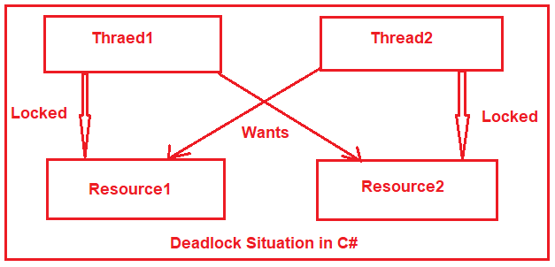
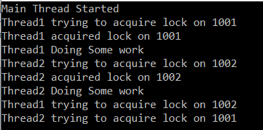
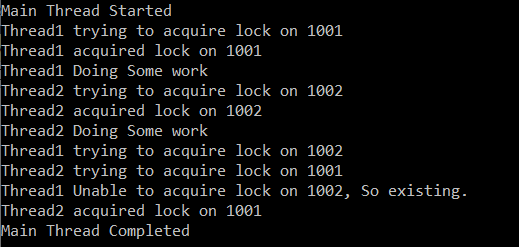
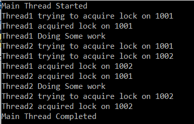

## **مثالی از بن‌بست در سی‌شارپ**

در این مقاله، قصد دارم در مورد **Deadlock در سی شارپ** با مثال‌ها صحبت کنم. لطفاً مقاله قبلی ما در مورد SemaphoreSlim در سی شارپ با مثال‌ها را مطالعه کنید. Deadlock یکی از مهمترین جنبه‌هایی است که باید به عنوان یک توسعه‌دهنده درک شود. به عنوان بخشی از این مقاله، قصد داریم نکات زیر را مورد بحث قرار دهیم.

1. **بن‌بست چیست؟**
2. **چرا بن‌بست رخ داد؟**
3. **چگونه ممکن است در یک برنامه چند رشته‌ای، بن‌بست رخ دهد؟**
4. **چگونه با استفاده از متد Monitor.TryEnter از وقوع Deadlock جلوگیری کنیم؟**
5. **چگونه با بدست آوردن قفل‌ها به ترتیب خاص، از بن‌بست جلوگیری کنیم؟**

##### **بن‌بست (Deadlock) در سی شارپ چیست؟**

به عبارت ساده، می‌توانیم بن‌بست را در سی‌شارپ به عنوان وضعیتی تعریف کنیم که در آن دو یا چند نخ **در اجرای خود بی‌حرکت یا منجمد** هستند زیرا منتظر پایان کار یکدیگر هستند.

برای مثال، فرض کنید دو نخ به نام‌های Thread1 و Thread2 و دو منبع به نام‌های Resource1 و Resource2 داریم. نخ اول، **Resource1** را قفل کرده و سعی کرده قفلی روی **Respurce2** ایجاد کند . در همان زمان، **نخ دوم** قفلی روی **Resource2** ایجاد کرده و سعی کرده قفلی روی **Resource1** ایجاد کند .



همانطور که در تصویر بالا مشاهده می‌کنید، **Thread1** منتظر دریافت   **قفل روی** **Resource2** نگهداری می‌شود **است که توسط Thread2** . **Thread2** همچنین نمی‌تواند کار خود را تمام کند و قفل **Resource2** را آزاد کند زیرا منتظر دریافت قفل روی **Resource1** است که Thread1 آن را قفل می‌کند و از این رو وضعیت Deadlock رخ داده است.

اگر شرایط زیر برقرار باشد، بن‌بست می‌تواند رخ دهد:

1. **انحصار متقابل:** این به این معنی است که فقط یک نخ می‌تواند در یک زمان خاص به یک منبع دسترسی داشته باشد.
2. **نگه داشتن و منتظر ماندن:** این وضعیتی است که در آن یک نخ حداقل یک منبع را در اختیار دارد و منتظر حداقل یک منبع است که قبلاً توسط نخ دیگری به دست آمده است.
3. **انتظار چرخشی (Circular Wait):** این وضعیتی است که در آن دو یا چند نخ منتظر منبعی هستند که توسط عضو بعدی در زنجیره به دست می‌آید.

##### **مثال برای درک Deadlock در سی شارپ:**

بیایید Deadlock را در سی شارپ با یک مثال درک کنیم. یک فایل کلاس با نام **Account.cs** ایجاد کنید و کد زیر را در آن کپی و جایگذاری کنید.

```csharp
namespace DeadLockDemo
{
    public class Account
    {
        public int ID { get; }
        private double Balance { get; set;}

        public Account(int id, double balance)
        {
            ID = id;
            Balance = balance;
        }
        
        public void WithdrawMoney(double amount)
        {
            Balance -= amount;
        }

        public void DepositMoney(double amount)
        {
            Balance += amount;
        }
    }
}
```

کلاس Account فوق بسیار سرراست است. ما این کلاس را با دو ویژگی، ID و Balance، ایجاد کردیم که از طریق سازنده این کلاس مقداردهی اولیه می‌شوند. بنابراین، در زمان ایجاد نمونه کلاس Account، باید مقدار ID و Balance را ارسال کنیم. ما همچنین دو متد ایجاد کرده‌ایم. متد WithdrawMoney برای برداشت مبلغ و متد DepositMoney برای اضافه کردن مبلغ استفاده می‌شود.

##### **فایل AccountManager.cs:**

سپس، یک فایل کلاس دیگر با نام **AccountManager.cs** ایجاد کنید و کد زیر را در آن کپی و جایگذاری کنید.

```csharp
using System;
using System.Threading;

namespace DeadLockDemo
{
    public class AccountManager
    {
       private Account FromAccount;
       private Account ToAccount;
       private double TransferAmount;

        public AccountManager(Account AccountFrom, Account AccountTo, double AmountTransfer)
        {
            FromAccount = AccountFrom;
            ToAccount = AccountTo;
            TransferAmount = AmountTransfer;
        }

        public void FundTransfer()
        {
            Console.WriteLine($"{Thread.CurrentThread.Name} trying to acquire lock on {FromAccount.ID}");
            lock (FromAccount)
            {
                Console.WriteLine($"{Thread.CurrentThread.Name} acquired lock on {FromAccount.ID}");
                Console.WriteLine($"{Thread.CurrentThread.Name} Doing Some work");
                Thread.Sleep(1000);
                Console.WriteLine($"{Thread.CurrentThread.Name} trying to acquire lock on {ToAccount.ID}");

                lock (ToAccount)
                {
                    FromAccount.WithdrawMoney(TransferAmount);
                    ToAccount.DepositMoney(TransferAmount);
                }
            }
        }
    }
}
```

در کد بالا، ما دو متغیر از نوع Account ایجاد کردیم تا جزئیات FromAccount و ToAccount را نگه‌داری کنند، یعنی حسابی که قرار است مبلغ از آن کسر شود و حسابی که مبلغ به آن ایجاد می‌شود. همچنین یک متغیر از نوع double دیگر، یعنی TransferAmount، ایجاد کردیم تا مبلغی را که قرار است از FromAccount کسر و به ToAccount واریز شود، نگه‌داری کند. از طریق سازنده این کلاس، این متغیرها را مقداردهی اولیه می‌کنیم.

ما همچنین متد FundTransfer را ایجاد کردیم که وظیفه مورد نیاز را انجام می‌دهد. همانطور که می‌بینید، ابتدا قفلی روی حساب فرستنده (From Account) ایجاد می‌کند و سپس مقداری کار انجام می‌دهد. پس از ۱ ثانیه، پشتیبان‌گیری می‌کند و سعی می‌کند قفلی روی حساب گیرنده (To Account) ایجاد کند.

##### **اصلاح متد اصلی:**

حالا متد Main کلاس Program را مطابق شکل زیر تغییر دهید. در اینجا، برای accountManager1، Account1001 همان FromAccount و Account1002 همان ToAccount است. به طور مشابه، برای accountManager2، Account1002 همان FromAccount و Account1001 همان ToAccount است.

```csharp
using System;
using System.Threading;

namespace DeadLockDemo
{
    class Program
    {
        public static void Main()
        {
            Console.WriteLine("Main Thread Started");
            Account Account1001 = new Account(1001, 5000);
            Account Account1002 = new Account(1002, 3000);

            AccountManager accountManager1 = new AccountManager(Account1001, Account1002, 5000);
            Thread thread1 = new Thread(accountManager1.FundTransfer)
            {
                Name = "Thread1"
            };

            AccountManager accountManager2 = new AccountManager(Account1002, Account1001, 6000);
            Thread thread2 = new Thread(accountManager2.FundTransfer)
            {
                Name = "Thread2"
            };

            thread1.Start();
            thread2.Start();

            thread1.Join();
            thread2.Join();
            Console.WriteLine("Main Thread Completed");
            Console.ReadKey();
        }
    }
}
```

###### **خروجی:**



**نکته:** برای thread1، Account1001 همان resource1 و Account1002 همان resource2 است. از طرف دیگر، برای thread2، Account1002 همان resource1 و Account1001 همان resource2 است. حالا، برنامه را اجرا کنید و ببینید که آیا بن‌بستی رخ داده است یا خیر.

دلیل بن‌بست این است که **thread1** یک قفل انحصاری روی **Account1001** به دست آورده و سپس مقداری پردازش انجام داده است. در همین حال، **thread2** شروع به کار کرده و یک قفل انحصاری روی **Account1002** به دست آورده و سپس مقداری پردازش انجام داده است. سپس **thread1** برگشته و می‌خواهد قفلی روی **Account1002** که قبلاً توسط thread2 قفل شده است، به دست آورد. به طور مشابه، **thread2** برگشته و می‌خواهد قفلی روی Account1001 به دست آورد که قبلاً توسط thread1 قفل شده است و از این رو بن‌بست ایجاد شده است.

##### **جلوگیری از بن‌بست با استفاده از متد Monitor.TryEnter؟**

یکی از نسخه‌های سربارگذاری‌شده ( **TryEnter(** **obj** **,** **int** **millisecondsTimeout)** ) از **متد Monitor.TryEnter** پارامتر دوم را به عنوان زمان انقضا بر حسب میلی‌ثانیه می‌گیرد. با استفاده از آن پارامتر، می‌توانیم یک مهلت زمانی برای آزادسازی قفل توسط نخ تعیین کنیم. اگر یک نخ منبعی را برای مدت طولانی در اختیار داشته باشد در حالی که نخ دیگر منتظر است، مانیتور یک محدودیت زمانی ارائه می‌دهد و قفل را مجبور به آزادسازی آن می‌کند. به این ترتیب نخ دیگر می‌تواند وارد بخش بحرانی شود. اصلاح **کلاس AccountManager** به صورت زیر:

```csharp
using System;
using System.Threading;

namespace DeadLockDemo
{
    public class AccountManager
    {
       private Account FromAccount;
       private Account ToAccount;
       private double TransferAmount;

        public AccountManager(Account AccountFrom, Account AccountTo, double AmountTransfer)
        {
            this.FromAccount = AccountFrom;
            this.ToAccount = AccountTo;
            this.TransferAmount = AmountTransfer;
        }

        public void FundTransfer()
        {
            Console.WriteLine($"{Thread.CurrentThread.Name} trying to acquire lock on {FromAccount.ID}");
            
            lock (FromAccount)
            {
                Console.WriteLine($"{Thread.CurrentThread.Name} acquired lock on {FromAccount.ID}");
                Console.WriteLine($"{Thread.CurrentThread.Name} Doing Some work");
                Thread.Sleep(3000);
                Console.WriteLine($"{Thread.CurrentThread.Name} trying to acquire lock on {ToAccount.ID}");
                
                if (Monitor.TryEnter(ToAccount, 3000))
                {
                    Console.WriteLine($"{Thread.CurrentThread.Name} acquired lock on {ToAccount.ID}");
                    try
                    {
                        FromAccount.WithdrawMoney(TransferAmount);
                        ToAccount.DepositMoney(TransferAmount);
                    }
                    finally
                    {
                        Monitor.Exit(ToAccount);
                    }
                }
                else
                {
                    Console.WriteLine($"{Thread.CurrentThread.Name} Unable to acquire lock on {ToAccount.ID}, So existing.");
                }
            }
        }
    }
}
```

###### **خروجی:**



همانطور که در خروجی می‌بینید، thread1 قفل را آزاد کرده و از بخش بحرانی خارج می‌شود، که به thread2 اجازه می‌دهد وارد بخش بحرانی شود و وظیفه خود را انجام دهد.

##### **چگونه با بدست آوردن قفل‌ها به ترتیب خاص، از بن‌بست در سی‌شارپ جلوگیری کنیم؟**

لطفاً کلاس AccountManager را مطابق شکل زیر تغییر دهید.

```csharp
using System;
using System.Threading;

namespace DeadLockDemo
{
    public class AccountManager
    {
       private Account FromAccount;
       private Account ToAccount;
       private readonly double TransferAmount;
       private static readonly Mutex mutex = new Mutex();

        public AccountManager(Account AccountFrom, Account AccountTo, double AmountTransfer)
        {
            this.FromAccount = AccountFrom;
            this.ToAccount = AccountTo;
            this.TransferAmount = AmountTransfer;
        }

        public void FundTransfer()
        {
            object _lock1, _lock2;

            if (FromAccount.ID < ToAccount.ID)
            {
                _lock1 = FromAccount;
                _lock2 = ToAccount;
            }
            else
            {
                _lock1 = ToAccount;
                _lock2 = FromAccount;
            }

            Console.WriteLine($"{Thread.CurrentThread.Name} trying to acquire lock on {((Account)_lock1).ID}");
            
            lock (_lock1)
            {
                Console.WriteLine($"{Thread.CurrentThread.Name} acquired lock on {((Account)_lock1).ID}");
                Console.WriteLine($"{Thread.CurrentThread.Name} Doing Some work");
                Thread.Sleep(3000);
                Console.WriteLine($"{Thread.CurrentThread.Name} trying to acquire lock on {((Account)_lock2).ID}");
                lock(_lock2)
                {
                    Console.WriteLine($"{Thread.CurrentThread.Name} acquired lock on {((Account)_lock2).ID}");
                    FromAccount.WithdrawMoney(TransferAmount);
                    ToAccount.DepositMoney(TransferAmount);
                }
            }
        }
    }
}
```

###### **خروجی:**

