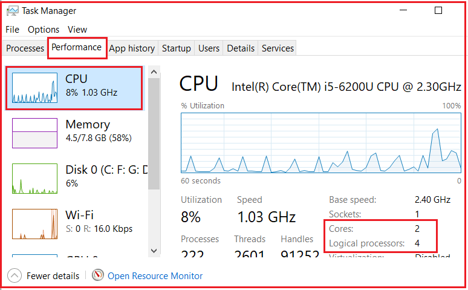
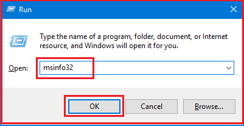
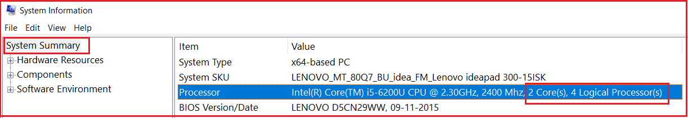
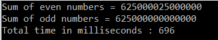
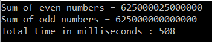

## **تست عملکرد یک برنامه چند رشته‌ای در سی شارپ**

در این مقاله، قصد دارم **تست عملکرد یک برنامه چند رشته‌ای در سی‌شارپ را** با یک مثال مورد بحث قرار دهم. لطفاً مقاله قبلی ما را که در آن در مورد Deadlock در سی‌شارپ با مثال‌ها بحث کردیم، مطالعه کنید. به عنوان بخشی از این مقاله، پیامدهای عملکرد یک برنامه چند رشته‌ای را هنگام اجرای برنامه روی دستگاهی با یک هسته/پردازنده در مقابل دستگاهی با چند هسته/پردازنده به شما نشان خواهم داد.

#### **چگونه بفهمیم چند پردازنده روی دستگاهمان داریم؟**

شما می‌توانید از روش‌های مختلفی متوجه شوید که چند پردازنده روی دستگاه شما نصب شده است. برخی از این روش‌ها به شرح زیر است:

##### **روش اول:** **استفاده از Task Manager**

روی نوار وظیفه (Taskbar) کلیک راست کرده و گزینه « **Task Manager** » را از منوی زمینه انتخاب کنید. سپس روی زبانه « **Performance»** کلیک کرده و « **CPU** » را از پنل سمت چپ انتخاب کنید. سپس همانطور که در تصویر زیر نشان داده شده است، هسته‌ها و پردازنده‌های منطقی (Logical Processors) را در سمت راست مشاهده خواهید کرد.



##### **روش دوم:** **استفاده از دستور msinfo32**

را فشار دهید **، کلیدهای ترکیبی Windows key + R** برای باز کردن **Run** ، سپس عبارت **msinfo32** را تایپ کرده و **OK کلیک کنید.** مطابق تصویر زیر، روی دکمه



پس از کلیک بر روی دکمه‌ی تأیید، برنامه‌ی اطلاعات سیستم (System Information) باز می‌شود. از آنجا **گزینه‌ی خلاصه (Summary)** را انتخاب کنید و به پایین اسکرول کنید تا گزینه‌ی پردازنده (Processor) را پیدا کنید. جزئیات، تعداد هسته‌ها و پردازنده‌های منطقی پردازنده‌ی مرکزی (CPU) شما را نشان می‌دهد، همانطور که در تصویر زیر نشان داده شده است.



##### **روش سوم: استفاده از دات نت کد**

شما می‌توانید از کد زیر در هر نوع برنامه‌ی .net برای پیدا کردن کل پردازنده‌های روی دستگاه استفاده کنید.  
**محیط** **.ProcessorCount**

##### **روش چهارم: استفاده از خط فرمان**

در خط فرمان ویندوز، کد زیر را بنویسید و اینتر را بزنید

**تکرار %NUMBER\_OF\_PROCESSORS%**

##### **تست عملکرد با پردازنده‌های چندگانه:**

اگر دستگاهی با چندین پردازنده دارید، چندین رشته می‌توانند کد برنامه شما را به صورت موازی روی هسته‌های مختلف اجرا کنند. به عنوان مثال، اگر دستگاه شما دو هسته دارد و دو رشته برای اجرای کد برنامه شما وجود دارد، هر رشته روی یک هسته جداگانه اجرا می‌شود. در نتیجه، عملکرد بهتری خواهیم داشت.

اگر دو نخ داشته باشید و اگر هر نخ برای تکمیل اجرا 10 میلی‌ثانیه طول بکشد، در دستگاهی با 2 پردازنده، کل زمان صرف شده 10 میلی‌ثانیه است.

##### **تست عملکرد با تک پردازنده:**

اگر دستگاهی با یک پردازنده داشته باشید، چندین رشته یکی پس از دیگری اجرا می‌شوند. برای یک دستگاه با پردازنده تک هسته‌ای امکان اجرای چندین رشته به صورت موازی وجود ندارد. سیستم عامل آنقدر سریع بین رشته‌ها جابجا می‌شود که این توهم را به ما می‌دهد که رشته‌ها به صورت موازی اجرا می‌شوند. در یک دستگاه تک هسته‌ای یا پردازنده، چندین رشته می‌توانند بر عملکرد تأثیر منفی بگذارند زیرا تعویض زمینه سربار ایجاد می‌کند.

اگر دو نخ داشته باشید و هر نخ برای تکمیل اجرا 10 میلی‌ثانیه زمان نیاز داشته باشد، در دستگاهی با یک پردازنده، کل زمان صرف شده 20 میلی‌ثانیه به علاوه زمان تعویض زمینه نخ در صورت وجود است.

##### **مثال: استفاده از یک نخ واحد**

```csharp
using System;
using System.Diagnostics;
using System.Threading;

namespace MultithreadingPerformanceTesting
{
    class Program
    {
        public static void Main()
        {
            Stopwatch stopwatch = Stopwatch.StartNew();
            stopwatch = Stopwatch.StartNew();
            EvenNumbersSum();
            OddNumbersSum();
            stopwatch.Stop();
            Console.WriteLine($"Total time in milliseconds : {stopwatch.ElapsedMilliseconds}");
            Console.ReadKey();
        }

        public static void EvenNumbersSum()
        {
            double Evensum = 0;
            for (int count = 0; count <= 50000000; count++)
            {
                if (count % 2 == 0)
                {
                    Evensum = Evensum + count;
                }
            }
            Console.WriteLine($"Sum of even numbers = {Evensum}");
        }

        public static void OddNumbersSum()
        {
            double Oddsum = 0;
            for (int count = 0; count <= 50000000; count++)
            {
                if (count % 2 == 1)
                {
                    Oddsum = Oddsum + count;
                }
            }
            Console.WriteLine($"Sum of odd numbers = {Oddsum}");
        }
    }
}
```

**خروجی:**



همانطور که می‌بینید، تقریباً ۶۹۶ میلی‌ثانیه طول می‌کشد تا اجرا کامل شود.

##### **مثال: استفاده از چندین نخ (threads)**

بیایید مثال قبلی را با استفاده از چندین نخ بازنویسی کنیم و خروجی را مقایسه کنیم.

```csharp
using System;
using System.Diagnostics;
using System.Threading;

namespace MultithreadingPerformanceTesting
{
    class Program
    {
        public static void Main()
        {
            Stopwatch stopwatch = Stopwatch.StartNew();
            stopwatch = Stopwatch.StartNew();
            Thread thread1 = new Thread(EvenNumbersSum);
            Thread thread2 = new Thread(OddNumbersSum);

            thread1.Start();
            thread2.Start();

            thread1.Join();
            thread2.Join();
            stopwatch.Stop();
            Console.WriteLine($"Total time in milliseconds : {stopwatch.ElapsedMilliseconds}");
            Console.ReadKey();
        }

        public static void EvenNumbersSum()
        {
            double Evensum = 0;
            for (int count = 0; count <= 50000000; count++)
            {
                if (count % 2 == 0)
                {
                    Evensum = Evensum + count;
                }
            }
            Console.WriteLine($"Sum of even numbers = {Evensum}");
        }

        public static void OddNumbersSum()
        {
            double Oddsum = 0;
            for (int count = 0; count <= 50000000; count++)
            {
                if (count % 2 == 1)
                {
                    Oddsum = Oddsum + count;
                }
            }
            Console.WriteLine($"Sum of odd numbers = {Oddsum}");
        }
    }
}
```

**خروجی:**

