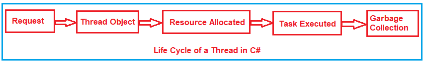
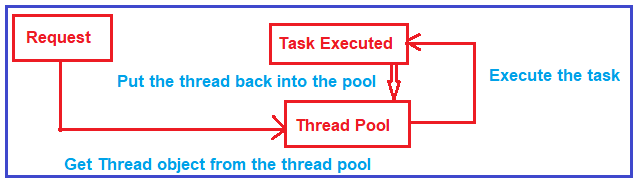
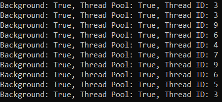
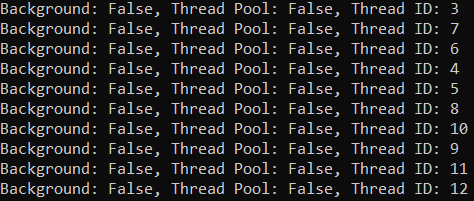
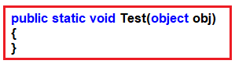
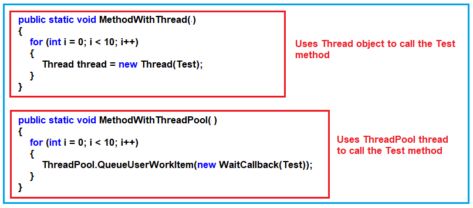
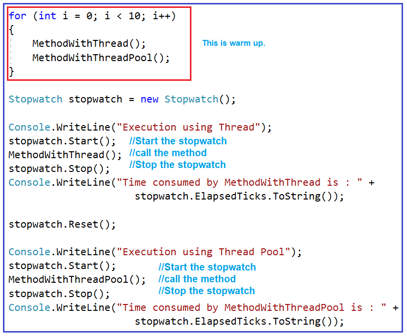
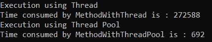

## **استخر نخ (Thread Pool) در سی شارپ به همراه مثال**

در این مقاله، قصد دارم **به همراه مثال‌هایی در مورد Thread Pool در سی‌شارپ** صحبت کنم. لطفاً مقاله قبلی ما را که در آن در مورد تست عملکرد یک برنامه چندنخی در سی‌شارپ صحبت کردیم، مطالعه کنید. به عنوان بخشی از این مقاله، قصد داریم نکات زیر را مورد بحث قرار دهیم.

1. **چرخه حیات درخواست یک نخ (Thread).**
2. **ادغام نخ‌ها (Thread Pooling) در سی‌شارپ چیست؟**
3. **چرا به یک Thread Pool در سی شارپ نیاز داریم؟**
4. **تست عملکرد بین نخ معمولی و ادغام نخ‌ها**

##### **چرخه حیات درخواست یک نخ در سی شارپ به همراه مثال.**

بیایید چرخه حیات یک نخ (thread) در سی شارپ (C#) را درک کنیم. برای درک این موضوع، لطفاً به تصویر زیر نگاهی بیندازید. هنگامی که چارچوب دات نت (.NET Framework) یک درخواست دریافت می‌کند (این درخواست می‌تواند فراخوانی متد یا فراخوانی تابع از هر نوع برنامه‌ای باشد). برای مدیریت آن درخواست، یک شیء نخ (thread object) ایجاد می‌شود. هنگامی که شیء نخ ایجاد می‌شود، برخی منابع مانند حافظه به آن شیء نخ اختصاص داده می‌شود. پس از آن، وظیفه (task) اجرا می‌شود و پس از اتمام وظیفه، زباله‌روب (garbage collector) آن شیء نخ را حذف می‌کند تا تخصیص حافظه آزاد شود. این چرخه حیات یک نخ در سی شارپ است.



این مراحل برای هر درخواستی که به یک برنامه چند رشته‌ای می‌رسد، بارها و بارها تکرار می‌شوند. این بدان معناست که هر بار که یک شیء رشته جدید ایجاد می‌شود، در حافظه تخصیص داده می‌شود. اگر درخواست‌های زیادی وجود داشته باشد، اشیاء رشته زیادی نیز وجود خواهد داشت و اگر اشیاء رشته زیادی وجود داشته باشد، بار زیادی روی حافظه ایجاد می‌شود که باعث کند شدن برنامه شما می‌شود.

جای زیادی برای بهبود عملکرد وجود دارد. شیء Thread ایجاد می‌شود، منابع اختصاص داده می‌شوند، وظیفه اجرا می‌شود و سپس نباید به سراغ garbage collection برود، به جای اینکه شیء thread را گرفته و همانطور که در تصویر زیر نشان داده شده است، آن را در یک pool قرار دهد؟ اینجاست که thread pooling به کار می‌آید.

 در سی شارپ")

##### **استخر نخ (thread pool) در سی شارپ:**

Thread Pool در سی شارپ چیزی جز مجموعه‌ای از نخ‌ها نیست که می‌توانند برای انجام تعدادی کار در پس‌زمینه مورد استفاده مجدد قرار گیرند. اکنون وقتی درخواستی می‌رسد، مستقیماً به thread pool می‌رود و بررسی می‌کند که آیا نخ‌های خالی موجود است یا خیر. در صورت وجود، شیء thread را از thread pool می‌گیرد و وظیفه را همانطور که در تصویر زیر نشان داده شده است، اجرا می‌کند.



وقتی نخ وظیفه خود را تکمیل کرد، دوباره به مخزن نخ‌ها (thread pool) بازگردانده می‌شود تا بتواند دوباره مورد استفاده قرار گیرد. این قابلیت استفاده مجدد از ایجاد تعدادی نخ توسط یک برنامه جلوگیری می‌کند و این امر باعث کاهش مصرف حافظه می‌شود.

##### **چگونه از Thread Pool در سی شارپ استفاده کنیم؟**

بیایید یک مثال ساده برای درک نحوه استفاده از Thread Pooling در سی شارپ ببینیم. وقتی نحوه استفاده از Thread Pooling را فهمیدید، آنگاه معیار عملکرد بین شیء Thread معمولی و شیء Thread Pool را بررسی خواهیم کرد.

###### **مرحله ۱:**

برای پیاده‌سازی ادغام نخ‌ها در سی‌شارپ، ابتدا باید فضای نام Threading را وارد کنیم، زیرا کلاس ThreadPool متعلق به این فضای نام Threading است، همانطور که در زیر نشان داده شده است.

**با استفاده از System.Threading؛**

###### **مرحله ۲:**

پس از وارد کردن فضای نام Threading، باید از **کلاس ThreadPool** استفاده کنید و با استفاده از این کلاس، باید **متد استاتیک QueueUserWorkItem** را فراخوانی کنید . و اگر به تعریف **متد QueueUserWorkItem** بروید ، خواهید دید که این متد یک پارامتر از نوع **شیء WaitCallback** می‌گیرد . هنگام ایجاد شیء از **کلاس WaitCallback** ، باید نام متدی را که می‌خواهید اجرا شود، همانطور که در زیر نشان داده شده است، ارسال کنید.

**ThreadPool.QueueUserWorkItem(new WaitCallback(MyMethod));**

در اینجا، **متد QueueUserWorkItem** تابع را برای اجرا در صف قرار می‌دهد و آن تابع زمانی اجرا می‌شود که یک نخ از مخزن نخ‌ها در دسترس قرار گیرد. اگر هیچ نخی در دسترس نباشد، منتظر می‌ماند تا یک نخ آزاد شود. در اینجا MyMethod متدی است که می‌خواهیم توسط یک نخ از مخزن نخ‌ها اجرا شود.

##### **کد نمونه کامل برای درک ادغام نخ‌ها در سی‌شارپ**

همانطور که در کد زیر می‌بینید، در اینجا، ما یک متد به نام MyMethod ایجاد می‌کنیم و به عنوان بخشی از آن متد، به سادگی شناسه نخ را چاپ می‌کنیم، اینکه آیا نخ، نخ پس‌زمینه است یا خیر، و اینکه آیا از یک استخر نخ است یا خیر. و می‌خواهیم این متد را 10 بار با استفاده از threadهای استخر نخ اجرا کنیم. بنابراین، در اینجا از یک حلقه ساده برای هر حلقه استفاده می‌کنیم و از کلاس ThreadPool استفاده می‌کنیم و آن متد را فراخوانی می‌کنیم.

```csharp
using System;
using System.Threading;

namespace ThreadPoolApplication
{
    class Program
    {
        static void Main(string[] args)
        {
            for (int i = 0; i < 10; i++)
            {
                ThreadPool.QueueUserWorkItem(new WaitCallback(MyMethod));
            }
            Console.Read();
        }

        public static void MyMethod(object obj)
        {
            Thread thread = Thread.CurrentThread;
            string message = $"Background: {thread.IsBackground}, Thread Pool: {thread.IsThreadPoolThread}, Thread ID: {thread.ManagedThreadId}";
            Console.WriteLine(message);
        }
    }
}
```

پس از اجرای کد بالا، خروجی زیر به شما داده می‌شود. همانطور که می‌بینید، نشان می‌دهد که این نخ‌ها پس‌زمینه هستند و نخ‌ها از استخر نخ هستند و شناسه‌های نخ ممکن است در خروجی شما متفاوت باشند. در اینجا، می‌توانید ببینید که برخی از نخ‌ها دوباره استفاده شده‌اند و این مزیت استفاده از Thread Pooling در سی‌شارپ است.



حالا، بیایید همان مثال را با استفاده از نخ‌های معمولی بررسی کنیم. لطفاً کد را به صورت زیر تغییر دهید. در اینجا، به جای استفاده از ThreadPool، از کلاس Thread برای ایجاد نخ‌ها و فراخوانی متدها استفاده می‌کنیم.

```csharp
using System;
using System.Threading;

namespace ThreadPoolApplication
{
    class Program
    {
        static void Main(string[] args)
        {
            for (int i = 0; i < 10; i++)
            {
                Thread thread = new Thread(MyMethod)
                {
                    Name = "Thread" + i
                };
                thread.Start();
            }
            Console.Read();
        }

        public static void MyMethod(object obj)
        {
            Thread thread = Thread.CurrentThread;
            string message = $"Background: {thread.IsBackground}, Thread Pool: {thread.IsThreadPoolThread}, Thread ID: {thread.ManagedThreadId}";
            Console.WriteLine(message);
        }
    }
}
```

حالا کد بالا را اجرا کنید، خروجی زیر را خواهید دید. در اینجا می‌توانید ببینید که نخ‌ها، نخ‌های پس‌زمینه نیستند و همچنین از مخزن نخ نمی‌آیند و همچنین نخ‌ها دوباره استفاده نمی‌شوند. هر نخ یک شناسه نخ منحصر به فرد دارد.



##### **تست عملکرد با استفاده و بدون استفاده از Thread Pool در سی شارپ به همراه مثال:**

بیایید برای درک معیار عملکرد، مثالی بزنیم. در اینجا، مقایسه می‌کنیم که شیء نخ چقدر زمان می‌برد و نخ استخر نخ چقدر زمان می‌برد تا همان کار را انجام دهد، یعنی همان متدها را اجرا کند.

برای انجام این کار، کاری که قرار است انجام دهیم این است که متدی به نام **Test** همانطور که در زیر نشان داده شده است، ایجاد خواهیم کرد. این متد یک پارامتر ورودی از نوع شیء می‌گیرد و به عنوان بخشی از آن متد Test، ما هیچ کاری انجام نمی‌دهیم، به این معنی که یک متد خالی ایجاد می‌شود.



سپس دو متد مانند **MethodWithThread** و **MethodWithThreadPool** ایجاد می‌کنیم و درون این دو متد، یک حلقه for ایجاد می‌کنیم که 10 بار اجرا می‌شود. درون حلقه for، تابع Test را مطابق شکل زیر فراخوانی می‌کنیم. همانطور که می‌بینید، **متد MethodWithThread** از شیء Thread برای فراخوانی متد Test استفاده می‌کند در حالی که **متد MethodWithThreadPool** از شیء ThreadPool برای فراخوانی متد Test استفاده می‌کند.



حالا باید دو متد بالا ( **MethodWithThread** و **MethodWithThreadPool** ) را از متد main فراخوانی کنیم. از آنجایی که قرار است معیار عملکرد را آزمایش کنیم، این دو متد را بین شروع و پایان کرونومتر، همانطور که در زیر نشان داده شده است، فراخوانی می‌کنیم. کلاس Stopwatch در **فضای نام System.Diagnostics** موجود است . حلقه for در متد Main برای گرم کردن (warm-up) است. دلیل این امر این است که وقتی کد را برای اولین بار اجرا می‌کنیم، کامپایل اتفاق می‌افتد و کامپایل مدتی طول می‌کشد و ما نمی‌خواهیم آن را اندازه‌گیری کنیم.



##### **کد کامل در زیر آورده شده است.**

```csharp
using System;
using System.Diagnostics;
using System.Threading;

namespace ThreadPoolApplication
{
    class Program
    {
        static void Main(string[] args)
        {
            //Warmup Code start
            for (int i = 0; i < 10; i++)
            {
                MethodWithThread();
                MethodWithThreadPool();
            }
            //Warmup Code start
            Stopwatch stopwatch = new Stopwatch();

            Console.WriteLine("Execution using Thread");
            stopwatch.Start();
            MethodWithThread();
            stopwatch.Stop();
            Console.WriteLine("Time consumed by MethodWithThread is : " +
                                 stopwatch.ElapsedTicks.ToString());
            
            stopwatch.Reset();

            Console.WriteLine("Execution using Thread Pool");
            stopwatch.Start();
            MethodWithThreadPool();
            stopwatch.Stop();
            Console.WriteLine("Time consumed by MethodWithThreadPool is : " +
                                 stopwatch.ElapsedTicks.ToString());
            
            Console.Read();
        }

        public static void MethodWithThread()
        {
            for (int i = 0; i < 10; i++)
            {
                Thread thread = new Thread(Test);
                thread.Start();
            }
        }

        public static void MethodWithThreadPool()
        {
            for (int i = 0; i < 10; i++)
            {
                ThreadPool.QueueUserWorkItem(new WaitCallback(Test));
            }           
        }

        public static void Test(object obj)
        {
        }       
    }
}
```

###### **خروجی:**



همانطور که در خروجی بالا مشاهده می‌کنید، زمان مصرف شده توسط MethodWithThread برابر با ۲۷۲۵۸۸ و زمان مصرف شده توسط MethodWithThreadPool برابر با ۶۹۲ است. اگر دقت کنید، تفاوت زمانی زیادی بین این دو وجود دارد.

بنابراین ثابت می‌شود که استخر نخ در مقایسه با شیء کلاس نخ، عملکرد بهتری ارائه می‌دهد. اگر نیاز به ایجاد یک یا دو نخ باشد، باید از شیء کلاس نخ استفاده کنید، در حالی که اگر نیاز به ایجاد بیش از ۵ نخ باشد، باید در یک محیط چند نخی، کلاس استخر نخ را انتخاب کنید.