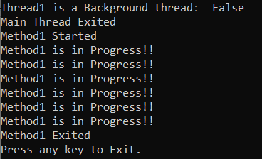
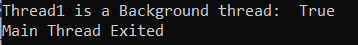

## **نخ‌های پیش‌زمینه و پس‌زمینه در سی‌شارپ به همراه مثال**

در این مقاله، قصد دارم **به همراه مثال‌هایی، نخ‌های پیش‌زمینه و پس‌زمینه در سی‌شارپ** را مورد بحث قرار دهم. لطفاً مقاله قبلی ما را که در آن به همراه مثال‌هایی، در مورد استخر نخ در سی‌شارپ بحث کردیم، مطالعه کنید.

##### **انواع نخ‌ها در سی شارپ**

Threading یکی از مهمترین مفاهیم است و به عنوان یک توسعه دهنده، همه ما باید این مفهوم را درک کنیم زیرا در اکثر برنامه‌های بلادرنگ از Threading استفاده می‌کنیم. در C#، به طور پیش‌فرض، اجرای یک برنامه با یک Thread شروع می‌شود که Thread اصلی نامیده می‌شود و به طور خودکار توسط CLR و سیستم عامل اجرا می‌شود.

از نخ اصلی، می‌توانیم نخ‌های دیگری نیز برای انجام وظایف مورد نظر به طور همزمان یا همزمان در برنامه ایجاد کنیم. در سی شارپ، می‌توانیم دو نوع نخ ایجاد کنیم. آنها به شرح زیر هستند.

1. **موضوع پیش‌زمینه**
2. **موضوع پس‌زمینه**

##### **نخ پیش‌زمینه در سی‌شارپ:**

نخ‌های پیش‌زمینه، نخ‌هایی هستند که حتی پس از خروج یا خاتمه برنامه اصلی، به اجرا ادامه می‌دهند. این بدان معناست که اگر نخ اصلی برنامه را ترک کند، نخ‌های پیش‌زمینه همچنان برای تکمیل وظیفه محول شده به خود در حال اجرا هستند. بنابراین، نخ‌های پیش‌زمینه در C# اهمیتی نمی‌دهند که نخ اصلی فعال باشد یا خیر، بلکه فقط زمانی تکمیل می‌شوند که کار محول شده به آن را تمام کند. این بدان معناست که عمر یک نخ پیش‌زمینه در C# به نخ اصلی بستگی ندارد. نخ پیش‌زمینه این قابلیت را دارد که از خاتمه یافتن برنامه فعلی جلوگیری کند. CLR تا زمانی که همه نخ‌های پیش‌زمینه کار محول شده به خود را تمام نکرده باشند، برنامه را خاموش نمی‌کند. نخ اصلی یک نخ پیش‌زمینه است.

##### **نخ پس‌زمینه در سی‌شارپ:**

نخ‌های پس‌زمینه نخ‌هایی هستند که اگر برنامه اصلی ما بسته شود، بسته می‌شوند. یا به عبارت ساده، می‌توان گفت که عمر نخ پس‌زمینه به عمر نخ اصلی بستگی دارد. به طور خلاصه، اگر برنامه اصلی ما بسته شود، نخ‌های پس‌زمینه نیز بسته می‌شوند. نخ‌های پس‌زمینه توسط CLR مشاهده می‌شوند و اگر همه نخ‌های پیش‌زمینه خاتمه یافته باشند، همه نخ‌های پس‌زمینه هنگام بسته شدن برنامه به طور خودکار متوقف می‌شوند.

**نکته:** به طور پیش‌فرض، وقتی در سی‌شارپ یک نخ ایجاد می‌کنیم، آن نخ از نوع نخ‌های پیش‌زمینه (Foreground) است.

##### **چگونه در سی شارپ یک نخ را به عنوان نخ پس زمینه (Background Thread) تبدیل کنیم؟**

همانطور که قبلاً بحث کردیم، در C#، نخ توسط کلاس Thread ایجاد و مدیریت می‌شود. کلاس Thread یک ویژگی به نام IsBackground ارائه می‌دهد تا بررسی کند که آیا نخ داده شده در پس‌زمینه اجرا می‌شود یا در پیش‌زمینه. اگر مقدار ویژگی IsBackground روی true تنظیم شده باشد، نخ یک نخ پس‌زمینه است، یعنی در پس‌زمینه اجرا می‌شود. یا اگر مقدار IsBackground روی false تنظیم شده باشد، نخ یک نخ پیش‌زمینه است، یعنی در پیش‌زمینه اجرا می‌شود.

1. **IsBackground {get; set;} :** این ویژگی برای دریافت یا تنظیم مقداری استفاده می‌شود که نشان می‌دهد آیا یک نخ، نخ پس‌زمینه است یا خیر. اگر این نخ، نخ پس‌زمینه باشد یا قرار باشد بشود، مقدار true را برمی‌گرداند؛ در غیر این صورت، مقدار false را برمی‌گرداند. اگر نخ از کار افتاده باشد، خطای ThreadStateException رخ می‌دهد.

به طور پیش‌فرض، وقتی با استفاده از کلاس Thread در C# یک نخ ایجاد می‌کنیم، ویژگی IsBackground برابر با false است و اگر می‌خواهید یک نخ پس‌زمینه در برنامه خود ایجاد کنید، باید مقدار ویژگی IsBackground نخ را برابر با true قرار دهید.

##### **مثال برای درک نخ پیش‌زمینه در سی‌شارپ:**

به طور پیش‌فرض وقتی در سی‌شارپ یک نخ ایجاد می‌کنیم، آن نخ پیش‌زمینه (Foreground Thread) است. همانطور که بحث کردیم، نخ‌های پیش‌زمینه نخ‌هایی هستند که حتی وقتی برنامه اصلی یا نخ اصلی متوقف می‌شود، به اجرا ادامه می‌دهند. بیایید این را با یک مثال درک کنیم.

```csharp
using System;
using System.Threading;

namespace MultithreadingDemo
{
    public class Program
    {
        static void Main(string[] args)
        {
            // A thread created here to run Method1 Parallely
            Thread thread1 = new Thread(Method1);
            Console.WriteLine($"Thread1 is a Background thread:  {thread1.IsBackground}");
            thread1.Start();

            //The control will come here and will exit 
            //the main thread or main application
            Console.WriteLine("Main Thread Exited");
        }

        // Static method
        static void Method1()
        {
            Console.WriteLine("Method1 Started");
            for (int i = 0; i <= 5; i++)
            {
                Console.WriteLine("Method1 is in Progress!!");
                Thread.Sleep(1000);
            }
            Console.WriteLine("Method1 Exited");
            Console.WriteLine("Press any key to Exit.");
            Console.ReadKey();
        }
    }
}
```

###### **خروجی:**



همانطور که در خروجی بالا مشاهده می‌کنید، پس از اینکه اجرای نخ اصلی یا متد اصلی به پایان رسید، نخ پیش‌زمینه (Foreground Thread) همچنان در حال اجرا است. بنابراین، این ثابت می‌کند که نخ‌های پیش‌زمینه حتی پس از خروج یا خاتمه برنامه، یعنی حتی پس از خاتمه نخ اصلی، به اجرا ادامه می‌دهند و وظایف خود را انجام می‌دهند.

##### **مثال برای درک موضوع پس‌زمینه در سی‌شارپ:**

به طور پیش‌فرض وقتی در سی‌شارپ یک نخ ایجاد می‌کنیم، یک نخ پیش‌زمینه (Foreground Thread) است. و اگر می‌خواهید یک نخ را به عنوان نخ پس‌زمینه (background thread) قرار دهید، باید ویژگی IsBackground شیء نخ را روی true تنظیم کنید. نخ‌های پس‌زمینه نخ‌هایی هستند که اگر نخ اصلی ما بسته شود، بسته می‌شوند، یعنی اگر همه نخ‌های پیش‌زمینه بسته شوند، نخ پس‌زمینه به طور خودکار بسته می‌شود. بگذارید این موضوع را با یک مثال درک کنیم. ما در حال بازنویسی مثال قبلی هستیم و در اینجا به سادگی ویژگی IsBackground شیء نخ را روی true تنظیم می‌کنیم.

```csharp
using System;
using System.Threading;

namespace MultithreadingDemo
{
    public class Program
    {
        static void Main(string[] args)
        {
            // A thread created here to run Method1 Parallely
            Thread thread1 = new Thread(Method1)
            {
                //Thread becomes background thread
                IsBackground = true
            };
            
            Console.WriteLine($"Thread1 is a Background thread:  {thread1.IsBackground}");
            thread1.Start();

            //The control will come here and will exit 
            //the main thread or main application
            Console.WriteLine("Main Thread Exited");

            //As the Main thread (i.e. foreground thread exits the application)
            //Automatically, the background thread quits the application
        }

        // Static method
        static void Method1()
        {
            Console.WriteLine("Method1 Started");
            for (int i = 0; i <= 5; i++)
            {
                Console.WriteLine("Method1 is in Progress!!");
                Thread.Sleep(1000);
            }
            Console.WriteLine("Method1 Exited");
            Console.WriteLine("Press any key to Exit.");
            Console.ReadKey();
        }
    }
}
```

###### **خروجی:**



در مثال بالا، به محض اینکه نخ اصلی از برنامه خارج می‌شود، نخ پس‌زمینه نیز از برنامه خارج می‌شود.

##### **چندین نخ پیش‌زمینه و یک نخ پس‌زمینه در سی‌شارپ**

در مثال زیر، نخ اصلی به طور پیش‌فرض یک نخ پیش‌زمینه است و نخ اصلی یک شیء thread1 برای فراخوانی Method1 ایجاد می‌کند. در اینجا، thread1 نیز یک نخ پیش‌زمینه است. سپس از Method1، یک نخ پیش‌زمینه برای فراخوانی Method2 ایجاد کرده‌ایم. در اینجا، به محض اینکه همه نخ‌های پیش‌زمینه یعنی نخ اصلی و thread1 خارج شوند، نخ پس‌زمینه یعنی thread2 به طور خودکار بدون تکمیل وظیفه خود از برنامه خارج می‌شود (گاهی اوقات ممکن است وظیفه تکمیل شود).

```csharp
using System;
using System.Threading;

namespace MultithreadingDemo
{
    public class Program
    {
        static void Main(string[] args)
        {
            // A thread created here to run Method1 Parallely
            Thread thread1 = new Thread(Method1)
            {
            };

            Console.WriteLine($"Thread1 is a Background thread:  {thread1.IsBackground}");
            thread1.Start();

            //The control will come here and will exit 
            //the main thread or main application
            Console.WriteLine("Main Thread Exited");

            //As the Main thread (i.e. foreground thread exits the application)
            //Automatically, the background thread quits the application
        }

        // Static method
        static void Method1()
        {
            Console.WriteLine("Method1 Started");
            Thread thread2 = new Thread(Method2)
            {
                IsBackground = true
            };
            thread2.Start();
            Thread.Sleep(3000);
            Console.WriteLine("Method1 Exited");
        }

        // Static method
        static void Method2()
        {
            Console.WriteLine("Method2 Started");
            for (int i = 0; i <= 10; i++)
            {
                Console.WriteLine("Method2 is in Progress!!");
                Thread.Sleep(1000);
            }
            Console.WriteLine("Method2 Exited");
            Console.WriteLine("Press any key to Exit.");
            Console.ReadKey();
        }
    }
}
```

بنابراین، نکته‌ای که باید به خاطر داشته باشید این است که به محض اینکه تمام نخ‌های پیش‌زمینه، از جمله نخ اصلی، از برنامه خارج شوند، تمام نخ‌های پس‌زمینه نیز به طور خودکار از برنامه خارج می‌شوند.

##### **نکاتی که باید به خاطر داشت:**

در سی شارپ، یک نخ یا نخ پس‌زمینه است یا نخ پیش‌زمینه. نخ‌های پس‌زمینه مشابه نخ‌های پیش‌زمینه هستند، با این تفاوت که نخ‌های پس‌زمینه مانع از خاتمه یافتن یک فرآیند نمی‌شوند. هنگامی که تمام نخ‌های پیش‌زمینه متعلق به یک فرآیند خاتمه یافتند، CLR فرآیند را پایان می‌دهد. هر نخ پس‌زمینه باقی‌مانده متوقف شده و تکمیل نمی‌شود.

به طور پیش‌فرض، نخ‌های زیر در پیش‌زمینه اجرا می‌شوند (یعنی، ویژگی IsBackground آنها مقدار false را برمی‌گرداند):

1. نخ اصلی (یا نخ اصلی برنامه).
2. همه نخ‌ها با فراخوانی سازنده کلاس Thread ایجاد می‌شوند.

به طور پیش‌فرض، نخ‌های زیر در پس‌زمینه اجرا می‌شوند (یعنی، ویژگی IsBackground آنها مقدار true را برمی‌گرداند):

1. نخ‌های موجود در استخر نخ، مجموعه‌ای از نخ‌های کارگر هستند که توسط زمان اجرا نگهداری می‌شوند. می‌توانید با استفاده از کلاس ThreadPool، استخر نخ را پیکربندی کرده و کار روی نخ‌های استخر نخ را زمان‌بندی کنید.

##### **مثالی برای درک بهتر نخ‌های پس‌زمینه و پیش‌زمینه در سی‌شارپ:**

در مثال زیر، رفتار نخ‌های پیش‌زمینه و پس‌زمینه را در سی‌شارپ نشان می‌دهیم. کد نمونه یک نخ پیش‌زمینه و یک نخ پس‌زمینه ایجاد می‌کند. نخ پیش‌زمینه فرآیند را تا زمان تکمیل حلقه for و خاتمه آن در حال اجرا نگه می‌دارد. اجرای نخ پیش‌زمینه به پایان رسیده است، فرآیند قبل از اتمام اجرای نخ پس‌زمینه خاتمه می‌یابد.

```csharp
using System;
using System.Threading;

namespace MultithreadingDemo
{
    public class Program
    {
        static void Main(string[] args)
        {
            ThreadingTest foregroundTest = new ThreadingTest(5);
            //Creating a Coreground Thread
            Thread foregroundThread = new Thread(new ThreadStart(foregroundTest.RunLoop));

            ThreadingTest backgroundTest = new ThreadingTest(50);
            //Creating a Background Thread
            Thread backgroundThread =new Thread(new ThreadStart(backgroundTest.RunLoop))
            {
                 IsBackground = true
            };

            foregroundThread.Start();
            backgroundThread.Start();
        }
    }
    class ThreadingTest
    {
        readonly int maxIterations;

        public ThreadingTest(int maxIterations)
        {
            this.maxIterations = maxIterations;
        }

        public void RunLoop()
        {
            for (int i = 0; i < maxIterations; i++)
            {
                Console.WriteLine($"{0} count: {1}", Thread.CurrentThread.IsBackground ? "Background Thread" : "Foreground Thread", i);
                Thread.Sleep(250);
            }
            Console.WriteLine("{0} finished counting.", Thread.CurrentThread.IsBackground ? "Background Thread" : "Foreground Thread");
        }
    }
}
```

**نکته ۱:** در سی‌شارپ، نخ‌های پیش‌زمینه این قابلیت را دارند که از خاتمه یافتن برنامه فعلی جلوگیری کنند. CLR تا زمانی که همه نخ‌های پیش‌زمینه خاتمه نیافته‌اند، برنامه را خاموش نمی‌کند (به عبارت دیگر، AppDomain میزبان را تخلیه نمی‌کند).

**نکته ۲:** در C#، نخ‌های پس‌زمینه توسط CLR به عنوان مسیرهای اجرایی قابل مصرف در نظر گرفته می‌شوند که می‌توانند در هر نقطه از زمان نادیده گرفته شوند (حتی اگر در حال حاضر در حال انجام یک واحد کاری باشند). بنابراین، اگر تمام نخ‌های پیش‌زمینه خاتمه یافته باشند، تمام نخ‌های پس‌زمینه هنگام تخلیه بار دامنه برنامه به طور خودکار از بین می‌روند.